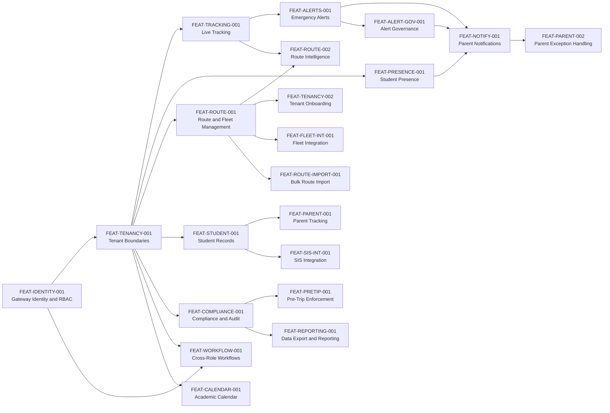

# Business - Complete Reference

## Table of Contents

- [Features](#features)
- [Requirements](#requirements)
- [UseCases](#usecases)
- [UserJourney](#userjourney)
- [UC001_authenticate_and_enter_role_workspace](#uc001-authenticate-and-enter-role-workspace)
- [UC002_onboard_boards_schools_and_scoped_users](#uc002-onboard-boards-schools-and-scoped-users)
- [UC003_plan_and_manage_routes_stops_and_vehicles](#uc003-plan-and-manage-routes-stops-and-vehicles)
- [UC004_monitor_fleet_alerts_and_operational_health](#uc004-monitor-fleet-alerts-and-operational-health)
- [UC005_execute_daily_driver_workflow](#uc005-execute-daily-driver-workflow)
- [UC006_capture_student_boarding_and_alighting](#uc006-capture-student-boarding-and-alighting)
- [UC007_track_children_and_receive_safety_communications](#uc007-track-children-and-receive-safety-communications)
- [UC008_respond_to_in_route_incident_or_emergency](#uc008-respond-to-in-route-incident-or-emergency)
- [UC009_maintain_compliance_inspections_and_audit_history](#uc009-maintain-compliance-inspections-and-audit-history)
- [UC010_fleet_assignment_workflow](#uc010-fleet-assignment-workflow)
- [UC011_alert_confirmation_and_governance](#uc011-alert-confirmation-and-governance)
- [UC012_data_migration_and_integration](#uc012-data-migration-and-integration)
- [UC013_pre_trip_inspection_enforcement](#uc013-pre-trip-inspection-enforcement)
- [UC014_absence_reporting_workflow](#uc014-absence-reporting-workflow)

---

## Features

_Source: `docs/Business/Features.md`_

# SBTM Feature Catalog

- Document owner: Product and Engineering
- Last reviewed: 2026-04-02
- Primary use: Traceable feature inventory with dependencies, status, and requirement coverage

This catalog translates the requirements baseline into business-facing capabilities with stable feature identifiers. For code-verified delivery gaps, use `docs/prd/GapAnalysis.md`. For v4 business gap analysis and upgrade plan, see `docs/prd/v4/GapAnalysis.md`.

## Related Documents

- [Requirements.md](Requirements.md)
- [UseCases.md](UseCases.md)
- [UserJourney.md](UserJourney.md)
- [../Design/Architecture.md](../Design/Architecture.md)
- [../prd/v4/GapAnalysis.md](../prd/v4/GapAnalysis.md)
- [../prd/v4/GapAnalysis.md](../prd/v4/GapAnalysis.md) (v4 Business Gap Analysis)
- [../prd/v4/UpgradePlan.md](../prd/v4/UpgradePlan.md) (v4 Upgrade Plan)
- [../prd/v4/AlertStrategy.md](../prd/v4/AlertStrategy.md) (v4 Alert Strategy)

## Feature Dependency Overview

## Feature Catalog

### Core Features (Existing)

| ID                  | Feature                                           | Status      | Depends On                          | Requirement Coverage                                 | Primary Surfaces                                      |
| ------------------- | ------------------------------------------------- | ----------- | ----------------------------------- | ---------------------------------------------------- | ----------------------------------------------------- |
| FEAT-IDENTITY-001   | Gateway identity and RBAC                         | Implemented | None                                | FR-IDENT-001, FR-IDENT-002, SR-AUTH-001, SR-RBAC-001 | API Gateway, all apps                                 |
| FEAT-TENANCY-001    | Tenant-aware data boundaries                      | Implemented | FEAT-IDENTITY-001                   | FR-TENANT-001, PR-TENANT-001                         | API Gateway, downstream services                      |
| FEAT-TRACKING-001   | Live and historical vehicle tracking              | Implemented | FEAT-TENANCY-001                    | FR-GPS-001, NFR-PERF-001                             | GPS Tracking, Driver App, Parent App, Admin Dashboard |
| FEAT-ALERTS-001     | Emergency alert lifecycle and admin visibility    | Implemented | FEAT-TRACKING-001, FEAT-TENANCY-001 | FR-ALERT-001, FR-ALERT-002                           | Emergency Alerts, Admin Dashboard, Driver App         |
| FEAT-PRESENCE-001   | Student presence capture and state tracking       | Partial     | FEAT-TENANCY-001, FEAT-STUDENT-001  | FR-PRESENCE-001, FR-PRESENCE-002, NFR-RESIL-001      | Student Presence, Driver App                          |
| FEAT-STUDENT-001    | Student records and route assignment              | Implemented | FEAT-TENANCY-001                    | FR-STUDENT-001                                       | Student Management, API Gateway, Admin Dashboard      |
| FEAT-COMPLIANCE-001 | Driver compliance, inspections, and audit logging | Implemented | FEAT-TENANCY-001                    | FR-COMPLIANCE-001, SR-AUDIT-001                      | Compliance Management, Admin Dashboard                |
| FEAT-ROUTE-001      | Route, stop, and fleet administration             | Implemented | FEAT-TENANCY-001                    | FR-ROUTE-001                                         | API Gateway, Admin Dashboard                          |
| FEAT-ROUTE-002      | Route intelligence and optimization               | Partial     | FEAT-ROUTE-001, FEAT-TRACKING-001   | FR-ROUTE-002                                         | Route planner, GPS intelligence                       |
| FEAT-VIDEO-001      | Video event registration and review               | Implemented | FEAT-TENANCY-001                    | FR-VIDEO-001                                         | Video Service, Admin Dashboard                        |
| FEAT-PARENT-001     | Parent live tracking experience                   | Partial     | FEAT-TRACKING-001, FEAT-STUDENT-001 | FR-PARENT-001                                        | Parent App                                            |
| FEAT-NOTIFY-001     | Parent-facing safety notifications                | Implemented | FEAT-ALERTS-001, FEAT-PRESENCE-001  | FR-PARENT-002, FR-PRESENCE-003, NFR-PERF-002         | Emergency Alerts, Notification Service, Parent App    |
| FEAT-PARENT-002     | Parent exception handling and history             | Planned     | FEAT-NOTIFY-001                     | FR-PARENT-003, PR-CONSENT-001                        | Parent App                                            |
| FEAT-TENANCY-002    | Tenant onboarding and user provisioning           | Partial     | FEAT-IDENTITY-001, FEAT-TENANCY-001 | FR-ONBOARD-001, FR-ROLE-001, FR-ROLE-002             | API Gateway, Admin Dashboard                          |

### v4 Features (Planned)

| ID                    | Feature                                                              | Status  | Depends On                          | Requirement Coverage                     | Primary Surfaces                       | v4 Phase |
| --------------------- | -------------------------------------------------------------------- | ------- | ----------------------------------- | ---------------------------------------- | -------------------------------------- | -------- |
| FEAT-ALERT-GOV-001    | Alert governance, classification, and confirmation workflow          | Planned | FEAT-ALERTS-001                     | FR-ALERT-003, FR-ALERT-004, FR-ALERT-005 | Emergency Alerts, Admin Dashboard      | Phase B  |
| FEAT-SIS-INT-001      | Student Information System batch/API integration                     | Planned | FEAT-STUDENT-001                    | FR-INT-001                               | Student Management, Admin Dashboard    | Phase D  |
| FEAT-FLEET-INT-001    | OSTA fleet database synchronization                                  | Planned | FEAT-ROUTE-001                      | FR-INT-002                               | API Gateway, Admin Dashboard           | Phase D  |
| FEAT-ROUTE-IMPORT-001 | Bulk route import from Excel/CSV with geocoding                      | Planned | FEAT-ROUTE-001                      | FR-INT-003                               | API Gateway, Admin Dashboard           | Phase D  |
| FEAT-PRETRIP-001      | Pre-trip inspection enforcement before route start                   | Planned | FEAT-COMPLIANCE-001                 | FR-WORKFLOW-003                          | Driver App, Compliance Management      | Phase E  |
| FEAT-WORKFLOW-001     | Cross-role coordination workflows (fleet assignment, route approval) | Planned | FEAT-IDENTITY-001, FEAT-TENANCY-001 | FR-WORKFLOW-001, FR-WORKFLOW-002         | API Gateway, Admin Dashboard           | Phase C  |
| FEAT-REPORTING-001    | Data export (CSV/PDF) and scheduled reports                          | Planned | FEAT-COMPLIANCE-001                 | FR-INT-004                               | Admin Dashboard, Compliance Management | Phase E  |
| FEAT-CALENDAR-001     | Academic calendar management with route schedule awareness           | Planned | FEAT-TENANCY-001                    | FR-CALENDAR-001                          | API Gateway, Admin Dashboard           | Phase E  |

## Current Status Legend

- `Implemented`: Code exists and is materially usable in the current prototype.
- `Partial`: Core foundations exist, but important workflow or quality gaps remain.
- `Planned`: Referenced in target design or roadmap, but not yet implemented end to end.

## Feature-to-Use-Case Matrix

| Feature ID            | Primary Use Cases                                 |
| --------------------- | ------------------------------------------------- |
| FEAT-IDENTITY-001     | UC-LOGIN-001                                      |
| FEAT-TENANCY-001      | UC-ONBOARD-001, UC-MONITOR-001                    |
| FEAT-TRACKING-001     | UC-DRIVER-001, UC-PARENT-001, UC-MONITOR-001      |
| FEAT-ALERTS-001       | UC-DRIVER-001, UC-INCIDENT-001, UC-MONITOR-001    |
| FEAT-PRESENCE-001     | UC-PRESENCE-001, UC-DRIVER-001                    |
| FEAT-STUDENT-001      | UC-ONBOARD-001, UC-PRESENCE-001                   |
| FEAT-COMPLIANCE-001   | UC-COMPLIANCE-001                                 |
| FEAT-ROUTE-001        | UC-ROUTE-001, UC-MONITOR-001                      |
| FEAT-ROUTE-002        | UC-ROUTE-001                                      |
| FEAT-VIDEO-001        | UC-INCIDENT-001                                   |
| FEAT-PARENT-001       | UC-PARENT-001                                     |
| FEAT-NOTIFY-001       | UC-PARENT-001, UC-INCIDENT-001                    |
| FEAT-PARENT-002       | UC-PARENT-001                                     |
| FEAT-TENANCY-002      | UC-ONBOARD-001                                    |
| FEAT-ALERT-GOV-001    | UC-INCIDENT-001, UC-MONITOR-001                   |
| FEAT-SIS-INT-001      | UC-ONBOARD-001, UC-DATAMIG-001                    |
| FEAT-FLEET-INT-001    | UC-ROUTE-001, UC-DATAMIG-001                      |
| FEAT-ROUTE-IMPORT-001 | UC-ROUTE-001, UC-DATAMIG-001                      |
| FEAT-PRETRIP-001      | UC-DRIVER-001, UC-COMPLIANCE-001                  |
| FEAT-WORKFLOW-001     | UC-ROUTE-001, UC-ONBOARD-001, UC-FLEET-ASSIGN-001 |
| FEAT-REPORTING-001    | UC-COMPLIANCE-001, UC-MONITOR-001                 |
| FEAT-CALENDAR-001     | UC-ROUTE-001, UC-MONITOR-001                      |

## v4 Phase Mapping

The v4 features are sequenced across 6 delivery phases (see [Upgrade Plan](../prd/v4/UpgradePlan.md)):

| Phase   | Features                                                    | Business Value                                                                                    |
| ------- | ----------------------------------------------------------- | ------------------------------------------------------------------------------------------------- |
| Phase A | FEAT-NOTIFY-001                                             | Parents receive real-time boarding/alighting and emergency notifications                          |
| Phase B | FEAT-ALERT-GOV-001                                          | Alerts classified by tier, confirmed by admin before parent delivery, escalated if unacknowledged |
| Phase C | FEAT-WORKFLOW-001, FEAT-TENANCY-002 (completion)            | Role boundaries enforced, fleet assignment and route approval workflows                           |
| Phase D | FEAT-SIS-INT-001, FEAT-FLEET-INT-001, FEAT-ROUTE-IMPORT-001 | External system integration, bulk data migration from legacy                                      |
| Phase E | FEAT-PRETRIP-001, FEAT-REPORTING-001, FEAT-CALENDAR-001     | Operational maturity: inspection enforcement, reporting, calendar                                 |
| Phase F | (infrastructure features)                                   | Production hardening, setup wizard, monitoring                                                    |

---

## Requirements

_Source: `docs/Business/Requirements.md`_

# SBTM Requirements Catalog

- Document owner: Product and Delivery
- Last reviewed: 2026-03-24
- Primary use: Traceable business, privacy, operational, and non-functional requirements for the platform

This document defines the requirements baseline for SBTM using stable identifiers. It is the business source of truth for what the platform must do and what quality constraints it must satisfy. For code-verified current implementation status, use `docs/Implementation/*`. For prioritized delivery gaps, use `docs/prd/GapAnalysis.md` and `docs/prd/PhaseWiseImplementationPlan.md`.

## Related Documents

- [Features.md](Features.md)
- [UseCases.md](UseCases.md)
- [UserJourney.md](UserJourney.md)
- [../Design/Architecture.md](../Design/Architecture.md)
- [../Design/SystemArchitecture.md](../Design/SystemArchitecture.md)
- [../Design/SecurityPrivacyArchitecture.md](../Design/SecurityPrivacyArchitecture.md)
- [../prd/v4/GapAnalysis.md](../prd/v4/GapAnalysis.md)
- [../prd/v1/PhaseWiseImplementationPlan.md](../prd/v1/PhaseWiseImplementationPlan.md)
- [../prd/v4/GapAnalysis.md](../prd/v4/GapAnalysis.md) (v4 Business Gap Analysis)
- [../prd/v4/RolesAndWorkflows.md](../prd/v4/RolesAndWorkflows.md) (v4 Roles and Workflows)
- [../prd/v4/AlertStrategy.md](../prd/v4/AlertStrategy.md) (v4 Alert Strategy)
- [../prd/v4/IntegrationAndMigration.md](../prd/v4/IntegrationAndMigration.md) (v4 Integration)
- [../prd/v4/UpgradePlan.md](../prd/v4/UpgradePlan.md) (v4 Upgrade Plan)

## Requirement Model

- `FR-*` = Functional requirements
- `NFR-*` = Non-functional requirements
- `PR-*` = Privacy and data-handling requirements
- `SR-*` = Security requirements
- `OPS-*` = Operational requirements

## Business Objectives

- Provide real-time visibility into school bus location and operational status.
- Improve student safety through presence tracking, emergency workflows, and auditable operational controls.
- Enable administrators to manage routes, vehicles, compliance, and incidents across multiple tenant levels.
- Support a path from prototype-grade deployment to privacy-aware, production-capable multi-tenant operations.
- Deliver proactive parent communication for child boarding/alighting, emergencies, and route changes with multi-channel notification delivery (push, email, SMS).
- Support cross-organization coordination workflows between OSTA, school boards, schools, drivers, and parents with appropriate approval chains and audit trails.
- Integrate with existing school Student Information Systems (SIS) and OSTA fleet databases to eliminate duplicate data entry and support bulk data migration from legacy systems.

## Functional Requirements

| ID                | Requirement                                                                                                                                                   | Priority | Related Features                    | Related Use Cases                            |
| ----------------- | ------------------------------------------------------------------------------------------------------------------------------------------------------------- | -------- | ----------------------------------- | -------------------------------------------- |
| FR-IDENT-001      | The platform shall authenticate Admin, Driver, and Parent users through a centralized gateway.                                                                | Must     | FEAT-IDENTITY-001                   | UC-LOGIN-001                                 |
| FR-IDENT-002      | The platform shall enforce role-based access control for OSTA, board, school, driver, and parent personas.                                                    | Must     | FEAT-IDENTITY-001, FEAT-TENANCY-001 | UC-LOGIN-001, UC-ONBOARD-001                 |
| FR-TENANT-001     | The platform shall associate operational data with a tenant boundary using school and, where applicable, board scope.                                         | Must     | FEAT-TENANCY-001                    | UC-ONBOARD-001, UC-MONITOR-001               |
| FR-GPS-001        | The platform shall ingest live vehicle location updates and expose live and historical tracking views.                                                        | Must     | FEAT-TRACKING-001                   | UC-DRIVER-001, UC-PARENT-001, UC-MONITOR-001 |
| FR-ALERT-001      | The platform shall allow drivers or downstream logic to create emergency alerts tied to a route and vehicle context.                                          | Must     | FEAT-ALERTS-001                     | UC-DRIVER-001, UC-INCIDENT-001               |
| FR-ALERT-002      | The platform shall deliver operational alert visibility to administrators in near real time.                                                                  | Must     | FEAT-ALERTS-001                     | UC-MONITOR-001, UC-INCIDENT-001              |
| FR-PRESENCE-001   | The platform shall record student boarding and alighting events through manual or device-assisted workflows.                                                  | Must     | FEAT-PRESENCE-001                   | UC-PRESENCE-001, UC-DRIVER-001               |
| FR-PRESENCE-002   | The platform shall associate presence events with the relevant student, route, vehicle, and school context.                                                   | Must     | FEAT-PRESENCE-001                   | UC-PRESENCE-001                              |
| FR-PARENT-001     | The platform shall allow parents to view their linked children and the live bus context relevant to those children.                                           | Must     | FEAT-PARENT-001                     | UC-PARENT-001                                |
| FR-PARENT-002     | The platform shall support parent-facing safety communications for alert and presence events.                                                                 | Must     | FEAT-NOTIFY-001                     | UC-PARENT-001, UC-INCIDENT-001               |
| FR-STUDENT-001    | The platform shall manage student enrollment records and route assignments.                                                                                   | Must     | FEAT-STUDENT-001                    | UC-ONBOARD-001, UC-PRESENCE-001              |
| FR-COMPLIANCE-001 | The platform shall store driver compliance records, vehicle inspections, and audit logs.                                                                      | Must     | FEAT-COMPLIANCE-001                 | UC-COMPLIANCE-001                            |
| FR-ROUTE-001      | The platform shall support route, stop, and vehicle management for school transport operations.                                                               | Must     | FEAT-ROUTE-001                      | UC-ROUTE-001, UC-MONITOR-001                 |
| FR-ROUTE-002      | The platform shall support route planning and optimization workflows, with provider-backed mapping targeted beyond the current prototype level.               | Should   | FEAT-ROUTE-002                      | UC-ROUTE-001                                 |
| FR-VIDEO-001      | The platform shall store video event metadata and enable admin access to relevant incident recordings.                                                        | Should   | FEAT-VIDEO-001                      | UC-INCIDENT-001                              |
| FR-ONBOARD-001    | The platform shall support tenant onboarding workflows for boards, schools, and role-scoped operational users.                                                | Should   | FEAT-TENANCY-002                    | UC-ONBOARD-001                               |
| FR-PARENT-003     | The platform should support absence reporting and parent-visible notification history.                                                                        | Should   | FEAT-PARENT-002, FEAT-NOTIFY-001    | UC-PARENT-001                                |
| FR-ALERT-003      | The platform shall classify alerts by tier (Safety, Operational, Informational) and route them to the appropriate audience with tier-specific delivery rules. | Must     | FEAT-ALERTS-001, FEAT-NOTIFY-001    | UC-INCIDENT-001, UC-PARENT-001               |
| FR-ALERT-004      | Safety-tier emergency alerts shall require School Admin confirmation before parent notification, with configurable timeout-based auto-escalation.             | Must     | FEAT-ALERTS-001                     | UC-INCIDENT-001                              |
| FR-ALERT-005      | Unacknowledged alerts shall escalate through the admin hierarchy (School -> Board -> OSTA) on configurable timelines.                                         | Should   | FEAT-ALERTS-001                     | UC-INCIDENT-001                              |
| FR-PRESENCE-003   | The platform shall send push notifications to parents when their child boards or alights the bus.                                                             | Must     | FEAT-PRESENCE-001, FEAT-NOTIFY-001  | UC-PRESENCE-001, UC-PARENT-001               |
| FR-WORKFLOW-001   | The platform shall support fleet assignment workflow with OSTA proposal, school confirmation, and audit trail.                                                | Should   | FEAT-ROUTE-001, FEAT-TENANCY-002    | UC-ROUTE-001, UC-ONBOARD-001                 |
| FR-WORKFLOW-002   | The platform shall notify affected parents before route changes take effect, with configurable lead time.                                                     | Should   | FEAT-ROUTE-001, FEAT-NOTIFY-001     | UC-ROUTE-001, UC-PARENT-001                  |
| FR-WORKFLOW-003   | The platform shall enforce pre-trip vehicle inspection completion before route start.                                                                         | Should   | FEAT-COMPLIANCE-001                 | UC-DRIVER-001, UC-COMPLIANCE-001             |
| FR-INT-001        | The platform shall support batch import of student data from school SIS exports (CSV/XML) with field mapping and conflict resolution.                         | Should   | FEAT-STUDENT-001, FEAT-TENANCY-002  | UC-ONBOARD-001                               |
| FR-INT-002        | The platform shall support synchronization of fleet data from OSTA existing fleet management system.                                                          | Should   | FEAT-ROUTE-001                      | UC-ROUTE-001                                 |
| FR-INT-003        | The platform shall support bulk route import from Excel/CSV with geocoding, OSRM polyline generation, and map preview.                                        | Should   | FEAT-ROUTE-001, FEAT-ROUTE-002      | UC-ROUTE-001                                 |
| FR-INT-004        | The platform shall support data export (CSV, PDF) for students, routes, compliance, alerts, and audit records.                                                | Should   | FEAT-COMPLIANCE-001                 | UC-COMPLIANCE-001, UC-MONITOR-001            |
| FR-ROLE-001       | The platform shall support a Super Admin role for initial system setup and platform maintenance.                                                              | Should   | FEAT-IDENTITY-001, FEAT-TENANCY-002 | UC-ONBOARD-001                               |
| FR-ROLE-002       | Board Admin shall be able to create, modify, and deactivate schools within their board scope.                                                                 | Should   | FEAT-TENANCY-002                    | UC-ONBOARD-001                               |
| FR-CALENDAR-001   | The platform should support academic calendar management (holidays, PA days) with automatic route schedule awareness.                                         | Should   | FEAT-ROUTE-001                      | UC-ROUTE-001, UC-MONITOR-001                 |

## Security Requirements

| ID           | Requirement                                                                                                 | Priority | Related Architecture                                        |
| ------------ | ----------------------------------------------------------------------------------------------------------- | -------- | ----------------------------------------------------------- |
| SR-AUTH-001  | All protected application routes shall require authenticated access through the API gateway.                | Must     | Gateway, System Architecture                                |
| SR-RBAC-001  | Authorization decisions shall be role-aware and tenant-aware.                                               | Must     | Gateway, Security and Privacy Architecture                  |
| SR-SVC-001   | Internal service calls should move toward authenticated service-to-service trust before production rollout. | Should   | Integration Architecture, Security and Privacy Architecture |
| SR-INPUT-001 | Public-facing service endpoints shall validate inputs and reject unexpected fields.                         | Must     | Service boundaries, Operations                              |
| SR-AUDIT-001 | Security-relevant and operationally sensitive actions should be attributable through audit records.         | Should   | Compliance Service, Observability, Runbooks                 |

## Privacy Requirements

| ID               | Requirement                                                                                                                                        | Priority | Related Use Cases                |
| ---------------- | -------------------------------------------------------------------------------------------------------------------------------------------------- | -------- | -------------------------------- |
| PR-RESIDENCY-001 | Student and operational data should remain deployable within Canadian hosting boundaries to support PIPEDA and MFIPPA alignment.                   | Should   | UC-ONBOARD-001, UC-MONITOR-001   |
| PR-MINIMIZE-001  | Student-facing workflows shall collect only the operational data needed for transport safety and service delivery.                                 | Must     | UC-PRESENCE-001, UC-PARENT-001   |
| PR-TENANT-001    | Tenant boundaries shall be preserved in storage, processing, and operational access patterns.                                                      | Must     | UC-ONBOARD-001, UC-MONITOR-001   |
| PR-RETENTION-001 | The platform should implement documented retention, archival, and deletion workflows for regulated data.                                           | Should   | UC-COMPLIANCE-001, UC-PARENT-001 |
| PR-CONSENT-001   | Parent-facing communications and child-tracking workflows should respect consent and notification expectations defined by operating organizations. | Should   | UC-PARENT-001                    |

## Non-Functional Requirements

| ID            | Requirement                                                                                                           | Target                                                  | Related Architecture                          |
| ------------- | --------------------------------------------------------------------------------------------------------------------- | ------------------------------------------------------- | --------------------------------------------- |
| NFR-AVAIL-001 | Services should remain horizontally scalable and stateless where practical.                                           | Prototype target with scale-out path                    | Deployment Architecture                       |
| NFR-PERF-001  | Live GPS visibility should update within a few seconds under normal operating conditions.                             | Target: within 3 seconds end to end                     | Integration Architecture                      |
| NFR-PERF-002  | Critical alert delivery should reach the first operational consumer quickly enough to support intervention workflows. | Target: within 10 seconds to first parent/admin channel | Integration Architecture, Observability       |
| NFR-OBS-001   | The platform should emit logs, metrics, and traces sufficient to diagnose cross-service issues.                       | Required before production hardening                    | Observability, Operations                     |
| NFR-RESIL-001 | The driver workflow should tolerate intermittent connectivity through offline buffering and retry behavior.           | Required for field use                                  | System Architecture, Integration Architecture |
| NFR-DATA-001  | Storage layers should support encryption in transit and at rest.                                                      | TLS and encrypted backing services                      | Security and Privacy Architecture             |

## Operational Requirements

| ID             | Requirement                                                                                                           | Priority | Related Operations Docs         |
| -------------- | --------------------------------------------------------------------------------------------------------------------- | -------- | ------------------------------- |
| OPS-DEPLOY-001 | The platform shall be runnable in a documented local multi-service environment.                                       | Must     | DeploymentGuide.md              |
| OPS-DEPLOY-002 | The platform should define a production-oriented deployment topology and secret-management approach.                  | Should   | DeploymentGuide.md              |
| OPS-RUN-001    | Operators should have documented procedures for incident response, service restart, and degraded dependency handling. | Should   | Runbooks.md, Troubleshooting.md |
| OPS-BACKUP-001 | The platform should define database backup and restore procedures before production rollout.                          | Should   | Runbooks.md                     |
| OPS-MON-001    | Operations should track queue depth, service health, error rate, and critical workflow latency.                       | Should   | Observability.md                |

## Requirement Traceability Matrix

| Requirement Group    | Primary Features                                                      | Primary Use Cases                                               | Primary Services                                   |
| -------------------- | --------------------------------------------------------------------- | --------------------------------------------------------------- | -------------------------------------------------- |
| Identity and tenancy | FEAT-IDENTITY-001, FEAT-TENANCY-001, FEAT-TENANCY-002                 | UC-LOGIN-001, UC-ONBOARD-001                                    | API Gateway                                        |
| Live operations      | FEAT-TRACKING-001, FEAT-ALERTS-001, FEAT-PRESENCE-001                 | UC-DRIVER-001, UC-MONITOR-001, UC-INCIDENT-001, UC-PRESENCE-001 | GPS Tracking, Emergency Alerts, Student Presence   |
| Parent experience    | FEAT-PARENT-001, FEAT-PARENT-002, FEAT-NOTIFY-001                     | UC-PARENT-001, UC-INCIDENT-001                                  | API Gateway, Parent App, Emergency Alerts          |
| Administration       | FEAT-ROUTE-001, FEAT-ROUTE-002, FEAT-STUDENT-001, FEAT-COMPLIANCE-001 | UC-ROUTE-001, UC-COMPLIANCE-001, UC-MONITOR-001                 | API Gateway, Student Management, Compliance        |
| Privacy and security | FEAT-TENANCY-001, FEAT-COMPLIANCE-001                                 | UC-ONBOARD-001, UC-COMPLIANCE-001                               | API Gateway, Compliance, all tenant-aware services |

## Current Delivery Notes

- The current implementation already satisfies major parts of identity, tracking, alerting, student management, compliance, and admin monitoring at prototype level.
- Parent delivery, BLE-backed end-to-end presence capture, provider-backed route intelligence, and deeper hardening remain partial or planned.
- The requirement set intentionally distinguishes current delivery from target-state obligations so documentation does not overstate implementation completeness.

## v4 Additions Summary

The v4 gap analysis (see [docs/prd/v4/GapAnalysis.md](../prd/v4/GapAnalysis.md)) identified 31 business functionality gaps across 6 categories:

- **Role Definition and Responsibility Boundaries** (6 gaps): Super Admin role, fleet assignment workflow, Board Admin school management, School Admin completeness, Driver workflow enforcement, Parent communication features.
- **Workflow and Coordination** (7 gaps): Approval workflows for fleet/routes, student transfer, seasonal planning, emergency confirmation, hybrid paper-digital support, compliance review actions.
- **Alert System and Communication** (6 gaps): Alert classification by tier, presence-to-parent notifications, admin confirmation before parent delivery, multi-channel notification, parent preferences, escalation chain.
- **Integration and Data Migration** (6 gaps): SIS integration, OSTA fleet sync, bulk route import, data export, parent auto-provisioning, address geocoding.
- **Compliance and Governance** (5 gaps): Cross-role compliance visibility, workflow decision audit, incident reports, pre-trip enforcement, consent management.
- **Operational Readiness** (4 gaps): Setup wizard, tenant provisioning workflow, academic calendar, route scheduling.

New functional requirements (FR-ALERT-003 through FR-CALENDAR-001) were added to this catalog to cover these gaps. The v4 upgrade plan sequences delivery across 6 phases (A through F) from parent safety communication through production hardening.

---

## UseCases

_Source: `docs/Business/UseCases.md`_

# SBTM Use Case Catalog

- Document owner: Product and Delivery
- Last reviewed: 2026-04-02
- Primary use: Master index for detailed natural-language use cases with stable identifiers and traceability

This document is the index for the SBTM use case set. Each use case now lives in its own file so agents and human readers can consume one workflow at a time without losing context. The individual files are natural-language-first and are intended to be independently readable.

## Related Documents

- [Requirements.md](Requirements.md)
- [Features.md](Features.md)
- [UserJourney.md](UserJourney.md)
- [../Design/SystemArchitecture.md](../Design/SystemArchitecture.md)
- [../Design/IntegrationArchitecture.md](../Design/IntegrationArchitecture.md)
- [../prd/v4/GapAnalysis.md](../prd/v4/GapAnalysis.md)
- [../prd/v1/PhaseWiseImplementationPlan.md](../prd/v1/PhaseWiseImplementationPlan.md)
- [../prd/v4/GapAnalysis.md](../prd/v4/GapAnalysis.md) (v4 Business Gap Analysis)
- [../prd/v4/RolesAndWorkflows.md](../prd/v4/RolesAndWorkflows.md) (v4 Roles and Workflows)

## Use Case Index

### Core Use Cases (Existing)

| ID                | Use Case                                            | Primary Actors                        | Status      | Detail File                                                                                                                       |
| ----------------- | --------------------------------------------------- | ------------------------------------- | ----------- | --------------------------------------------------------------------------------------------------------------------------------- |
| UC-LOGIN-001      | Authenticate and enter role-specific workspace      | Admin, Driver, Parent                 | Implemented | [UC001_authenticate_and_enter_role_workspace.md](usecases/UC001_authenticate_and_enter_role_workspace.md)                         |
| UC-ONBOARD-001    | Onboard boards, schools, and scoped users           | OSTA Admin, Board Admin, School Admin | Partial     | [UC002_onboard_boards_schools_and_scoped_users.md](usecases/UC002_onboard_boards_schools_and_scoped_users.md)                     |
| UC-ROUTE-001      | Plan and manage routes, stops, and vehicles         | Dispatcher, School Admin              | Partial     | [UC003_plan_and_manage_routes_stops_and_vehicles.md](usecases/UC003_plan_and_manage_routes_stops_and_vehicles.md)                 |
| UC-MONITOR-001    | Monitor fleet, alerts, and operational health       | OSTA Admin, Board Admin, Dispatcher   | Partial     | [UC004_monitor_fleet_alerts_and_operational_health.md](usecases/UC004_monitor_fleet_alerts_and_operational_health.md)             |
| UC-DRIVER-001     | Execute the daily driver workflow                   | Driver                                | Partial     | [UC005_execute_daily_driver_workflow.md](usecases/UC005_execute_daily_driver_workflow.md)                                         |
| UC-PRESENCE-001   | Capture student boarding and alighting              | Driver, Student Presence Service      | Partial     | [UC006_capture_student_boarding_and_alighting.md](usecases/UC006_capture_student_boarding_and_alighting.md)                       |
| UC-PARENT-001     | Track children and receive safety communications    | Parent                                | Partial     | [UC007_track_children_and_receive_safety_communications.md](usecases/UC007_track_children_and_receive_safety_communications.md)   |
| UC-INCIDENT-001   | Respond to an in-route incident or emergency        | Driver, Admin, Parent                 | Partial     | [UC008_respond_to_in_route_incident_or_emergency.md](usecases/UC008_respond_to_in_route_incident_or_emergency.md)                 |
| UC-COMPLIANCE-001 | Maintain compliance, inspections, and audit history | Compliance Admin, Dispatcher          | Implemented | [UC009_maintain_compliance_inspections_and_audit_history.md](usecases/UC009_maintain_compliance_inspections_and_audit_history.md) |

### v4 Use Cases (Planned)

| ID                   | Use Case                                                | Primary Actors                        | Status  | Detail File                                                                                       | v4 Phase |
| -------------------- | ------------------------------------------------------- | ------------------------------------- | ------- | ------------------------------------------------------------------------------------------------- | -------- |
| UC-FLEET-ASSIGN-001  | Coordinate fleet assignment between OSTA and school     | OSTA Admin, School Admin              | Planned | [UC010_fleet_assignment_workflow.md](usecases/UC010_fleet_assignment_workflow.md)                 | Phase C  |
| UC-ALERT-CONFIRM-001 | Confirm and govern emergency alert delivery to parents  | School Admin, Board Admin, OSTA Admin | Planned | [UC011_alert_confirmation_and_governance.md](usecases/UC011_alert_confirmation_and_governance.md) | Phase B  |
| UC-DATAMIG-001       | Migrate legacy data and integrate with external systems | School Admin, OSTA Admin, Board IT    | Planned | [UC012_data_migration_and_integration.md](usecases/UC012_data_migration_and_integration.md)       | Phase D  |
| UC-PRETRIP-001       | Complete pre-trip inspection before route start         | Driver, School Admin                  | Planned | [UC013_pre_trip_inspection_enforcement.md](usecases/UC013_pre_trip_inspection_enforcement.md)     | Phase E  |
| UC-ABSENCE-001       | Report and manage student absence                       | Parent, School Admin, Driver          | Partial | [UC014_absence_reporting_workflow.md](usecases/UC014_absence_reporting_workflow.md)               | Phase C  |

## Reading Guidance

- Use this index when comparing scope and status across workflows.
- Use the individual use case files when writing requirements, tests, user guides, or implementation plans.
- Treat current-state caveats in each use case file as part of the documented behavior, not as incidental notes.
- v4 use cases reference the [v4 Roles and Workflows](../prd/v4/RolesAndWorkflows.md) for RACI responsibilities and the [v4 Alert Strategy](../prd/v4/AlertStrategy.md) for notification details.

---

## UserJourney

_Source: `docs/Business/UserJourney.md`_

# SBTM User Journey (Current Implementation)

- Document owner: Product and UX
- Last reviewed: 2026-04-02
- Primary use: Business-facing walkthrough of the currently deliverable user experience

This document describes the currently deliverable user flow at a business level. For upgrade gaps and phase sequencing, use `docs/prd/GapAnalysis.md` and `docs/prd/PhaseWiseImplementationPlan.md`. For v4 target-state roles and workflows, see `docs/prd/v4/RolesAndWorkflows.md`.

## Related Documents

- [Requirements.md](Requirements.md)
- [UseCases.md](UseCases.md)
- [Features.md](Features.md)
- [GapAnalysis.md](../prd/v4/GapAnalysis.md)
- [LiveDemoScript.md](../Demo/LiveDemoScript.md)
- [v4 Roles and Workflows](../prd/v4/RolesAndWorkflows.md)
- [v4 Alert Strategy](../prd/v4/AlertStrategy.md)

## Super Admin Journey (Web) - v4 Target

**Not yet implemented.** Target-state journey for initial system setup:

1. Deploy SBTM platform to production environment.
2. Run first-time setup wizard (or manual bootstrap via database).
3. Configure system settings: timezone (America/Toronto), region (Ontario), notification defaults.
4. Create initial OSTA Admin account.
5. Hand off to OSTA Admin for day-to-day operations.

**Notes:** After initial setup, the Super Admin role is used only for platform maintenance, version upgrades, and infrastructure issues. See [v4 Roles and Workflows](../prd/v4/RolesAndWorkflows.md) for full responsibility matrix.

## OSTA Admin Journey (Web)

**Current:**

1. Login to Admin Dashboard.
2. View system-wide dashboard with fleet map and alerts.
3. Manage boards and schools (create, view).
4. Manage vehicles (CRUD).
5. View compliance status across the system.

**v4 Target Additions:** 6. Import fleet data from OSTA fleet management system (sync or manual bulk import). 7. Propose vehicle-to-school-and-route assignments; School Admin confirms. 8. View system-wide compliance dashboard with drill-down by board and school. 9. Receive escalated alerts that School/Board Admins have not acknowledged. 10. Generate monthly fleet utilization and safety reports. 11. View audit trail for all workflow decisions across the system.

## Board Admin Journey (Web) - OCSB, OCDSB

**Current:**

1. Login to Admin Dashboard.
2. View board-scoped data (limited to own board).
3. View schools within board (read-only in current UI).

**v4 Target Additions:** 4. Create, modify, and deactivate schools within own board. 5. Create School Admin accounts for schools in own board. 6. Configure board-level academic calendar (holidays, PA days, exam days). 7. Review and approve major route changes proposed by School Admins. 8. View cross-school compliance status for own board. 9. Receive escalated alerts from School Admins. 10. Review and sign-off incident reports. 11. Generate weekly compliance summary reports.

## Admin Journey (Web)

1. Open Admin Dashboard (Vite app).
2. Login via API gateway and persist token in local storage.
3. View dashboard tiles, map, and alerts from live gateway data.
4. Review routes, students, presence, compliance, and videos.
5. Access basic board and school listing views.

**Notes:** Full board and school onboarding, invitations, and lifecycle management are still pending. The v4 plan differentiates OSTA Admin, Board Admin, and School Admin journeys with role-specific views and responsibilities.

## School Admin Journey (Web)

**Current:**

1. Login to Admin Dashboard.
2. View school-scoped dashboard (own school data).
3. Manage routes (create, view, modify via route planner).
4. Manage students (view, bulk import CSV).
5. View compliance (drivers, inspections, audit).
6. View and resolve alerts for own school.

**v4 Target Additions:** 7. Fully manage students: enroll, edit, withdraw (complete CRUD in UI). 8. Import students from SIS data export (with preview and approval). 9. Bulk import routes from Excel with geocoding and OSRM polyline generation. 10. Accept or reject vehicle assignments proposed by OSTA Admin. 11. Confirm emergency alerts before parent notification (within 2-minute window). 12. Manage driver accounts: create, assign to routes, view compliance. 13. Trigger parent invitation emails for student families. 14. Configure school settings: bell times, notification preferences. 15. View absence reports and confirm receipt to parents. 16. Review pre-trip inspection results; handle failed inspections. 17. Generate incident reports from resolved alerts. 18. Export data: student lists, route plans, compliance summaries (CSV/PDF).

## Driver Journey (Mobile)

1. Open Driver App (Expo).
2. Login via API gateway and receive a JWT.
3. View schedule via `/api/v1/driver/me/schedule`.
4. GPS updates are sent to `/api/v1/routes/locations`.
5. Trigger panic button to send emergency events.
6. Use the roster while presence integration is still partially local in the current UI.

**v4 Target Additions:** 7. Complete pre-trip vehicle inspection checklist before route start. Failed inspection blocks route start and alerts School Admin. 8. Start route (School Admin notified automatically). 9. At each stop: view expected students, mark boarding/alighting (manual or BLE SmartTag scan). Parent receives push notification for each event. 10. View absent students (greyed out on roster, reported by parents). 11. End route (summary generated: students boarded/alighted, stops visited, duration). 12. Emergency/panic button with offline buffering: events queued locally when offline, flushed on reconnection.

**Notes:** API base URL is configured via `EXPO_PUBLIC_API_URL`. The mobile app already includes offline buffering, but authoritative presence capture and BLE scanning are still upgrade work.

## Parent Journey (Web)

1. Open Parent Portal (Vite app).
2. Login via API gateway and persist token in local storage.
3. View children cards from `/api/v1/parent/children`.
4. Open live map; app polls `/api/v1/routes/:routeId/live-location`.

**v4 Target Additions:** 5. Receive push notification when child boards the bus: "[Child name] boarded bus [Route] at [Stop] at [Time]". 6. Receive push notification when child alights the bus. 7. Receive push + SMS for emergency alerts affecting child's route (after School Admin confirmation). 8. Report child absence for specific date and route type (AM/PM/BOTH). Receive confirmation when school acknowledges. 9. View notification history: all alerts, boarding events, route changes with read/unread status. 10. Configure notification preferences: which event types, which channels (push/email/SMS), quiet hours. Emergency alerts cannot be disabled. 11. During onboarding: accept privacy notice and consent form (recorded with timestamp and version). 12. View route change notifications before effective date.

**Notes:** The current experience is polling-based. Real notification delivery, notification history, and absence reporting are still pending. See [v4 Alert Strategy](../prd/v4/AlertStrategy.md) for the complete notification tier model and channel strategy.

---

## UC001_authenticate_and_enter_role_workspace

_Source: `docs/Business/usecases/UC001_authenticate_and_enter_role_workspace.md`_

<!-- CLASSIFICATION: INTERNAL -->

# UC001 — Authenticate and Enter Role-Specific Workspace

> **Use Case ID**: UC-LOGIN-001
> **Feature**: FEAT-IDENTITY-001, FEAT-TENANCY-001
> **Priority**: MUST
> **Actors**: Parent, Driver, Admin, School Operator, Compliance or Support User
> **Classification**: INTERNAL
> **Last Updated**: 2026-03-24

## 1. Description

A user opens the appropriate SBTM application, submits credentials to the API Gateway, receives an authenticated session, and enters a workspace that is filtered by both role and tenant context. This use case is the starting point for every other user-facing workflow in the platform.

## 2. Preconditions

- A valid user record exists in the platform.
- The user has been assigned a role that the target application understands.
- The API Gateway is reachable.
- The relevant web or mobile application is configured with the correct gateway base URL.

## 3. Triggers

- A user opens the login page or app launch screen.
- A user session has expired and re-authentication is required.

## 4. Main Flow

1. The user opens the Parent App, Driver App, or Admin Dashboard.
2. The user enters an email address and password.
3. The application sends the login request to the API Gateway.
4. The API Gateway validates the credentials against the user record.
5. The API Gateway returns an authenticated session payload that includes user identity, role, and tenant context.
6. The application stores the session token according to its platform-specific behavior.
7. The application loads role-scoped landing data, such as child cards for a parent, schedule context for a driver, or dashboard metrics for an admin.

## 5. Alternative Flows

### 5a. Invalid Credentials

- The API Gateway rejects the login request.
- The application shows an authentication failure state.
- No protected data is returned.

### 5b. Valid Credentials but Wrong Application Surface

- The user signs in successfully but does not have access to the requested workflow.
- The application shows a restricted or unavailable state rather than protected data.

### 5c. Expired Session

- The token is no longer valid.
- The application redirects the user to sign in again.

## 6. Postconditions

- The user has an authenticated session.
- The application knows the user role and tenant context.
- Protected routes can be requested according to role and scope rules.

## 7. Business Rules and Constraints

- Authentication is centralized through the API Gateway.
- Authorization is role-aware and tenant-aware.
- A successful login does not imply access to every tenant or route in the system.

## 8. Current-State Notes

- JWT-based login is implemented.
- Logout is currently a client-side token discard rather than a server-side session invalidation workflow.
- Different applications store the resulting session according to their own platform behavior.

## 9. Requirements Traced

| Requirement  | Description                                        |
| ------------ | -------------------------------------------------- |
| FR-IDENT-001 | Centralized authentication through the API Gateway |
| FR-IDENT-002 | Role-based access control                          |
| SR-AUTH-001  | Authenticated access for protected routes          |
| SR-RBAC-001  | Role-aware and tenant-aware authorization          |

---

## UC002_onboard_boards_schools_and_scoped_users

_Source: `docs/Business/usecases/UC002_onboard_boards_schools_and_scoped_users.md`_

<!-- CLASSIFICATION: INTERNAL -->

# UC002 — Onboard Boards, Schools, and Scoped Users

> **Use Case ID**: UC-ONBOARD-001
> **Feature**: FEAT-TENANCY-001, FEAT-TENANCY-002, FEAT-STUDENT-001
> **Priority**: SHOULD
> **Actors**: OSTA Admin, Board Admin, School Admin
> **Classification**: INTERNAL
> **Last Updated**: 2026-03-24

## 1. Description

An authorized tenant administrator prepares the organizational structure needed for daily transport operations. This includes boards, schools, user accounts, and the operational data dependencies that routes, students, vehicles, and reporting depend on.

## 2. Preconditions

- An authorized OSTA or board-level user is authenticated.
- The target board or school does not already exist, or the workflow is explicitly editing an existing entity.
- The platform environment is operational.

## 3. Triggers

- A new school board is added to the platform.
- A new school is brought into service.
- A new school admin or operator needs access.

## 4. Main Flow

1. The authorized administrator opens board or school management views.
2. The administrator reviews the current tenant structure.
3. The administrator creates or updates the board and school records required for the tenant.
4. The administrator confirms the tenant context that downstream data should inherit.
5. The system persists the organizational data.
6. Downstream workflows such as route creation, vehicle setup, and student enrollment use the new tenant context.

## 5. Alternative Flows

### 5a. Invitation and Provisioning Workflow Not Available

- The organization structure is created, but account lifecycle steps are handled manually or through seeded data.
- User provisioning remains an operational workaround rather than a full product flow.

### 5b. Incomplete Tenant Setup

- The board or school record exists, but supporting route, roster, or user data is missing.
- Daily operations remain blocked or only partially demonstrable.

## 6. Postconditions

- Board and school records exist with the expected scope.
- Downstream operational data can be associated with the correct tenant.

## 7. Business Rules and Constraints

- Tenant boundaries are central to data isolation and reporting.
- Board-level and school-level workflows must not expose unrelated tenant data.
- Downstream services should inherit tenant context, even if that enforcement is still stronger at the gateway than in every service.

## 8. Current-State Notes

- Board and school listing support exists.
- Full invitation-based provisioning is not yet delivered.
- Tenant setup still depends on partial or manual workflows in practice.

## 9. v4 Enhancements (Planned)

- **Super Admin role** for initial system bootstrap — creates OSTA Admin, configures system settings (see [v4 Gap Analysis](../prd/v4/GapAnalysis.md), GAP-ROLE-001).
- **Board Admin school management** — Board Admin can create, modify, and deactivate schools within their board scope (GAP-ROLE-003).
- **Guided tenant provisioning wizard** — Step-by-step workflow for adding new boards and schools post-initial-setup (GAP-OPS-002).
- **Parent auto-provisioning from SIS** — When students are imported from SIS, parent accounts are auto-generated with invitation emails (GAP-INT-005).
- **SIS integration** — Batch or API sync of student data from school board SIS, reducing manual data entry (see [UC-DATAMIG-001](usecases/UC012_data_migration_and_integration.md)).
- See [v4 Roles and Workflows](../prd/v4/RolesAndWorkflows.md) for the complete RACI matrix across all admin roles.

## 10. Requirements Traced

| Requirement    | Description                               |
| -------------- | ----------------------------------------- |
| FR-TENANT-001  | Tenant-scoped operational data            |
| FR-ONBOARD-001 | Tenant onboarding workflows               |
| PR-TENANT-001  | Tenant boundaries preserved in operations |
| OPS-DEPLOY-001 | Documented, runnable platform baseline    |

---

## UC003_plan_and_manage_routes_stops_and_vehicles

_Source: `docs/Business/usecases/UC003_plan_and_manage_routes_stops_and_vehicles.md`_

<!-- CLASSIFICATION: INTERNAL -->

# UC003 — Plan and Manage Routes, Stops, and Vehicles

> **Use Case ID**: UC-ROUTE-001
> **Feature**: FEAT-ROUTE-001, FEAT-ROUTE-002
> **Priority**: MUST
> **Actors**: School Admin, Dispatcher, School Operator
> **Classification**: INTERNAL
> **Last Updated**: 2026-03-24

## 1. Description

An operator or school administrator defines a route, associates stops and a vehicle, and makes that route available for daily execution, monitoring, and parent visibility.

## 2. Preconditions

- The tenant and school context exist.
- The acting user has route-management permissions.
- At least one vehicle is available or planned for assignment.

## 3. Triggers

- A new route is required.
- An existing route must be updated because of operational change.
- A vehicle assignment or stop sequence must be adjusted.

## 4. Main Flow

1. The operator opens route management in the admin interface.
2. The operator creates or edits route metadata, including name, direction, start time, and estimated duration.
3. The operator adds, reorders, or removes route stops.
4. The operator associates a vehicle with the route if one is available.
5. The platform validates the request and persists the updated route.
6. The route becomes available for driver schedule, parent tracking, and admin monitoring workflows.

## 5. Alternative Flows

### 5a. Provider-Backed Optimization Not Available

- The operator uses current route structure without relying on provider-grade optimization.
- The system may return placeholder or mocked route geometry.

### 5b. Invalid Vehicle or Stop Configuration

- The platform rejects the requested change.
- The operator corrects the route or vehicle assignment and resubmits.

## 6. Postconditions

- The route definition is stored.
- Associated downstream workflows can reference the route.
- Vehicle and stop context is ready for daily operations.

## 7. Business Rules and Constraints

- Routes are tenant-scoped.
- Vehicles should not conflict across active route assignments.
- Route quality is important operationally, but the current optimization layer is not yet production-grade.

## 8. Current-State Notes

- Route CRUD exists.
- Vehicle CRUD exists.
- Optimization remains partial and should be treated as prototype-grade.

## 9. v4 Enhancements (Planned)

- **Bulk route import** from Excel/CSV with geocoding and OSRM polyline generation. Admin uploads file -> system validates, geocodes, and previews on map -> admin confirms (see [UC-DATAMIG-001](usecases/UC012_data_migration_and_integration.md), [v4 Gap Analysis](../prd/v4/GapAnalysis.md) GAP-INT-003).
- **Address geocoding** for stop creation — admin types address, system geocodes via Nominatim or Google, admin confirms pin on map (GAP-INT-006).
- **Fleet assignment workflow** — OSTA proposes vehicle-to-route assignment, School Admin reviews and confirms (see [UC-FLEET-ASSIGN-001](usecases/UC010_fleet_assignment_workflow.md), GAP-WF-001).
- **Route change notification** — When a route is modified, parents of affected students are notified before the change takes effect (GAP-WF-002, FR-WORKFLOW-002).
- **Seasonal route planning** — Clone previous year routes and adjust for new school year (GAP-WF-004).
- **Academic calendar awareness** — Routes marked inactive on holidays and non-operational days (GAP-OPS-003).
- See [v4 Integration and Migration](../prd/v4/IntegrationAndMigration.md) for complete route import wizard design.

## 10. Requirements Traced

| Requirement  | Description                             |
| ------------ | --------------------------------------- |
| FR-ROUTE-001 | Route, stop, and vehicle management     |
| FR-ROUTE-002 | Route planning and optimization support |

---

## UC004_monitor_fleet_alerts_and_operational_health

_Source: `docs/Business/usecases/UC004_monitor_fleet_alerts_and_operational_health.md`_

<!-- CLASSIFICATION: INTERNAL -->

# UC004 — Monitor Fleet, Alerts, and Operational Health

> **Use Case ID**: UC-MONITOR-001
> **Feature**: FEAT-TRACKING-001, FEAT-ALERTS-001, FEAT-ROUTE-001, FEAT-TENANCY-001
> **Priority**: MUST
> **Actors**: OSTA Admin, Board Admin, School Operator, Dispatcher, Admin
> **Classification**: INTERNAL
> **Last Updated**: 2026-03-24

## 1. Description

An operational user monitors the current state of transport activity through the dashboard. This includes route progress, live vehicle position, active alerts, and the supporting context needed to respond to operational issues.

## 2. Preconditions

- The user is authenticated.
- Tracking and alerting services are available.
- Routes are active or recent enough to appear in dashboard context.

## 3. Triggers

- The user opens the dashboard during operations.
- An alert or incident occurs.
- The user needs to review route execution status.

## 4. Main Flow

1. The operator opens the admin dashboard.
2. The system loads summary metrics and live route or alert data.
3. The operator reviews active alerts and live bus positions.
4. The operator filters or drills into a specific route, bus, student, or incident.
5. The operator uses the detail context to decide whether intervention or escalation is required.

## 5. Alternative Flows

### 5a. Downstream Service Degradation

- The dashboard loads partially.
- Some map, alert, or supporting records are missing or stale.
- The operator continues with reduced visibility and may escalate to support.

### 5b. Board-Level or System-Wide Aggregation Gap

- The user needs broader aggregation than the current implementation provides.
- The user navigates school-by-school or accepts a limited overview.

## 6. Postconditions

- The operator has situational awareness of the accessible transport scope.
- Relevant incidents or route problems can be investigated further.

## 7. Business Rules and Constraints

- Operational visibility must remain within role and tenant boundaries.
- Live visibility is only as reliable as GPS and alert ingest freshness.
- Dashboard monitoring is safety-relevant and should avoid misleading data presentation.

## 8. Current-State Notes

- Live monitoring exists at prototype level.
- Board-level and system-wide aggregation remain limited.
- Real-time delivery is mixed across polling and service-driven update mechanisms.

## 9. Requirements Traced

| Requirement   | Description                            |
| ------------- | -------------------------------------- |
| FR-GPS-001    | Real-time route visibility             |
| FR-ALERT-002  | Admin alert visibility                 |
| FR-TENANT-001 | Tenant-aware operational data          |
| OPS-MON-001   | Monitoring of critical workflow health |

---

## UC005_execute_daily_driver_workflow

_Source: `docs/Business/usecases/UC005_execute_daily_driver_workflow.md`_

<!-- CLASSIFICATION: INTERNAL -->

# UC005 — Execute the Daily Driver Workflow

> **Use Case ID**: UC-DRIVER-001
> **Feature**: FEAT-TRACKING-001, FEAT-ALERTS-001, FEAT-PRESENCE-001
> **Priority**: MUST
> **Actors**: Driver
> **Classification**: INTERNAL
> **Last Updated**: 2026-03-24

## 1. Description

A driver uses the mobile application to sign in, review the assigned route, transmit GPS updates, manage student-related route actions, and raise an emergency when an operational issue occurs.

## 2. Preconditions

- The driver has a valid account.
- The mobile app is configured correctly.
- The route and vehicle context exist or are provided in the current environment.

## 3. Triggers

- The driver starts a shift.
- The driver starts an active route.

## 4. Main Flow

1. The driver signs in to the mobile app.
2. The mobile app loads the driver schedule or route context.
3. The driver starts route execution.
4. The mobile app begins sending location updates.
5. The driver interacts with the roster during boarding and alighting moments.
6. The driver raises an emergency event if a serious issue occurs.
7. The app continues sending or queueing operational events until the route is complete.

## 5. Alternative Flows

### 5a. Connectivity Loss

- GPS, alert, or presence events are buffered locally.
- The app attempts to flush queued events when connectivity returns.

### 5b. BLE or Automated Presence Not Available

- The driver continues with manual roster interaction.

### 5c. Route Context Simplified or Seeded

- The app may rely on partially simplified route or vehicle context in the current prototype.

## 6. Postconditions

- The platform receives route telemetry and driver-triggered events.
- Operational route state is available for admins and related consumers.

## 7. Business Rules and Constraints

- Drivers need a workflow that tolerates intermittent connectivity.
- Safety-critical actions such as panic or emergency initiation must remain available.
- Presence capture should become authoritative, but is not yet fully so in the current mobile UI.

## 8. Current-State Notes

- GPS updates and emergency initiation are implemented.
- Offline buffering exists.
- The roster workflow is still not fully authoritative backend presence capture.
- BLE-assisted capture is still incomplete in the app.

## 9. Requirements Traced

| Requirement     | Description                           |
| --------------- | ------------------------------------- |
| FR-GPS-001      | Live vehicle location updates         |
| FR-ALERT-001    | Emergency event creation              |
| FR-PRESENCE-001 | Boarding and alighting capture        |
| NFR-RESIL-001   | Offline resilience for field workflow |

---

## UC006_capture_student_boarding_and_alighting

_Source: `docs/Business/usecases/UC006_capture_student_boarding_and_alighting.md`_

<!-- CLASSIFICATION: INTERNAL -->

# UC006 — Capture Student Boarding and Alighting

> **Use Case ID**: UC-PRESENCE-001
> **Feature**: FEAT-PRESENCE-001, FEAT-NOTIFY-001, FEAT-STUDENT-001
> **Priority**: MUST
> **Actors**: Driver, Student Presence Service
> **Classification**: INTERNAL
> **Last Updated**: 2026-03-24

## 1. Description

The platform records that a student has boarded or exited the bus. The resulting presence state supports safety awareness, parent communications, and administrative visibility.

## 2. Preconditions

- The student exists in the roster.
- The student is associated with the relevant school and route context.
- The driver is authenticated and operating in the correct route context.

## 3. Triggers

- A student boards the bus.
- A student exits the bus.
- A device-assisted detection event indicates presence activity.

## 4. Main Flow

1. The driver or device-assisted process identifies the student event.
2. The app or device process creates a presence payload.
3. The payload is sent through the gateway to the Student Presence service.
4. The Student Presence service persists the event.
5. The service updates current operational state for that student and route.
6. Downstream consumers can use the new state for monitoring or notification workflows.

## 5. Alternative Flows

### 5a. Manual Override

- The driver records the event manually.
- The manual path becomes the authoritative event source for that action.

### 5b. BLE-Assisted Detection

- The service processes a batch of tag detections.
- The service infers student state based on tag identity and signal evidence.

### 5c. Offline Buffering

- The mobile app stores the event temporarily.
- The event is submitted later when connectivity returns.

## 6. Postconditions

- A durable presence event exists.
- The student, route, vehicle, and tenant context are associated with that event.
- Parent-facing or admin-facing workflows can reference the resulting state.

## 7. Business Rules and Constraints

- Presence events are student-linked operational data and must be handled carefully.
- Manual fallback is required even when automation exists.
- Duplicate or conflicting detection events should be resolved consistently.

## 8. Current-State Notes

- Backend presence support exists.
- Mobile integration is partial.
- BLE support exists conceptually and partially in services, but not yet as a complete app workflow.

## 9. Requirements Traced

| Requirement     | Description                                                |
| --------------- | ---------------------------------------------------------- |
| FR-PRESENCE-001 | Record boarding and alighting events                       |
| FR-PRESENCE-002 | Associate presence with route, vehicle, and tenant context |
| PR-MINIMIZE-001 | Minimize student-facing operational data collection        |

---

## UC007_track_children_and_receive_safety_communications

_Source: `docs/Business/usecases/UC007_track_children_and_receive_safety_communications.md`_

<!-- CLASSIFICATION: INTERNAL -->

# UC007 — Track Children and Receive Safety Communications

> **Use Case ID**: UC-PARENT-001
> **Feature**: FEAT-PARENT-001, FEAT-NOTIFY-001, FEAT-PARENT-002
> **Priority**: MUST
> **Actors**: Parent
> **Classification**: INTERNAL
> **Last Updated**: 2026-03-24

## 1. Description

A parent uses the web portal to view linked children, inspect the current route context, and receive or review safety communications related to that route.

## 2. Preconditions

- The parent account is linked to one or more student records.
- At least one linked student has route context or operational data to display.
- The parent portal and API Gateway are reachable.

## 3. Triggers

- The parent opens the portal to check route status.
- The parent needs reassurance or current visibility during active transport.
- A notification-worthy event occurs.

## 4. Main Flow

1. The parent signs in.
2. The portal loads the list of linked children.
3. The parent selects a child or route view.
4. The portal shows live route tracking information for that child.
5. The portal surfaces relevant alerts or communications when available.
6. The parent interprets the current route state and decides whether any follow-up is required.

## 5. Alternative Flows

### 5a. Polling-Based Visibility

- The portal refreshes route and alert data through polling rather than push-style updates.
- Information remains available, but not as proactively as the target design intends.

### 5b. No Current Route or Linked Child Context

- The portal shows a limited state because there is no active route assignment or no linked roster match.

### 5c. Planned Parent Exception Workflow Not Yet Available

- The parent cannot yet report an absence or review a notification history in a complete product flow.

## 6. Postconditions

- The parent has current route and child visibility at the level supported by the product.
- The platform preserves the link between parent access and the relevant student context.

## 7. Business Rules and Constraints

- Parent access should remain limited to linked children.
- Safety communication should be timely, but should also avoid causing confusion or unnecessary alarm.
- Notification preferences and consent handling need a stronger future workflow.

## 8. Current-State Notes

- Child list and live map visibility exist.
- Real proactive notification delivery is still incomplete.
- Absence reporting and notification history remain planned rather than delivered.

## 9. v4 Enhancements (Planned)

- **Push notifications for boarding/alighting** — Parent receives push notification when their child boards or alights the bus: "[Child name] boarded bus at [Stop] at [Time]" (see [v4 Alert Strategy](../prd/v4/AlertStrategy.md), Tier 3 Informational Notifications).
- **Multi-channel notification delivery** — Push (primary), SMS (emergency escalation), Email (daily summary, route changes). See GAP-ALERT-004.
- **Emergency notification with admin confirmation** — Safety alerts go through School Admin confirmation before parent delivery. Auto-escalate after 2-minute timeout (see [UC-ALERT-CONFIRM-001](usecases/UC011_alert_confirmation_and_governance.md)).
- **Notification preference management** — Parents can configure which events to receive, on which channels, with quiet hours and emergency override (GAP-ALERT-005).
- **Absence reporting with confirmation** — Parent reports absence, receives confirmation, driver roster updated automatically (see [UC-ABSENCE-001](usecases/UC014_absence_reporting_workflow.md)).
- **Bus approaching notification** — Push notification when bus is within X minutes of child's stop.
- **Route change notification** — Push + email notification before route changes affecting child take effect.
- **Privacy consent management** — During onboarding, parent accepts privacy notice and consent form (GAP-GOV-005).
- See [v4 Roles and Workflows](../prd/v4/RolesAndWorkflows.md) for parent role responsibilities and the [v4 User Guide](../../UserGuide/parent/README.md) for the target parent experience.

## 10. Requirements Traced

| Requirement    | Description                                       |
| -------------- | ------------------------------------------------- |
| FR-PARENT-001  | Parent visibility into linked children and routes |
| FR-PARENT-002  | Parent-facing safety communications               |
| FR-PARENT-003  | Absence reporting and history support             |
| PR-CONSENT-001 | Parent communication and consent expectations     |

---

## UC008_respond_to_in_route_incident_or_emergency

_Source: `docs/Business/usecases/UC008_respond_to_in_route_incident_or_emergency.md`_

<!-- CLASSIFICATION: INTERNAL -->

# UC008 — Respond to an In-Route Incident or Emergency

> **Use Case ID**: UC-INCIDENT-001
> **Feature**: FEAT-ALERTS-001, FEAT-VIDEO-001, FEAT-NOTIFY-001
> **Priority**: MUST
> **Actors**: Driver, Admin, Parent, School Operator
> **Classification**: INTERNAL
> **Last Updated**: 2026-03-24

## 1. Description

An in-route incident occurs and the platform must capture the event, expose it to operational users, and support the follow-up workflow that protects students and informs the right stakeholders.

## 2. Preconditions

- The affected route and vehicle context are known.
- The driver or admin user can access the emergency workflow.
- Alerting services are available.

## 3. Triggers

- A driver presses a panic or emergency control.
- An admin or operational workflow records an emergency or incident condition.

## 4. Main Flow

1. The incident is initiated from the driver or operational workflow.
2. The platform persists the emergency alert.
3. The alert becomes visible to admin-facing operational users.
4. Supporting context such as location, route, and vehicle information is made available.
5. Related parent communications are sent where the workflow supports it.
6. Investigation and follow-up actions proceed, potentially including audit or video review.

## 5. Alternative Flows

### 5a. Parent Delivery Incomplete

- The alert is fully visible to admins.
- Parent delivery is delayed, partial, or absent depending on the current environment.

### 5b. Related Video Workflow Available

- Video metadata is recorded and later used during review.

### 5c. Service Degradation During Incident

- The alert is stored, but live dissemination or downstream follow-up is reduced.
- Operators fall back to manual coordination.

## 6. Postconditions

- The incident is recorded with route and vehicle context.
- Operational users can review and act on the incident.
- Supporting evidence and follow-up workflows can continue.

## 7. Business Rules and Constraints

- Emergency workflows are safety-critical and should avoid ambiguity.
- Parent communications should be accurate and route-specific.
- Auditability matters for both support and compliance follow-up.

## 8. Current-State Notes

- Emergency alert creation exists.
- Admin-facing visibility exists.
- Parent delivery remains incomplete end to end.
- Video review support exists at metadata level, but playback and broader incident workflows remain partial.

## 9. v4 Enhancements (Planned)

- **Alert classification by tier** — Alerts classified as Tier 1 (Safety: admin + parent), Tier 2 (Operational: admin only), Tier 3 (Informational: parent only). See [v4 Alert Strategy](../prd/v4/AlertStrategy.md), GAP-ALERT-001.
- **School Admin confirmation before parent delivery** — Tier 1 alerts require School Admin confirmation within 2 minutes. If unconfirmed, auto-escalate to parents. See [UC-ALERT-CONFIRM-001](usecases/UC011_alert_confirmation_and_governance.md), GAP-WF-005.
- **Escalation chain** — Unacknowledged alerts escalate: 5 min -> Board Admin, 15 min -> OSTA Admin (GAP-ALERT-006).
- **Multi-channel parent delivery** — Push notification (primary) + SMS (emergency escalation) + Email (follow-up). See GAP-ALERT-004.
- **Incident report generation** — After alert resolution, system generates incident report template with timeline, alert details, responder actions, resolution notes, video evidence links. Exportable as PDF (GAP-GOV-003).
- **Alert lifecycle audit trail** — Every state transition (CREATED, CONFIRMED, AUTO_ESCALATED, RESOLVED, REOPENED) recorded with actor, timestamp, and notes (GAP-GOV-002).
- **False alarm handling** — School Admin can classify alert as false alarm, preventing parent notification and recording in audit for reporting.
- See [v4 Roles and Workflows](../prd/v4/RolesAndWorkflows.md) Section 3.2 for the complete emergency alert confirmation sequence diagram.

## 10. Requirements Traced

| Requirement  | Description                                |
| ------------ | ------------------------------------------ |
| FR-ALERT-001 | Emergency event creation                   |
| FR-ALERT-002 | Admin visibility into alerts               |
| FR-VIDEO-001 | Video event support for incident workflows |
| NFR-PERF-002 | Timely alert delivery expectations         |

---

## UC009_maintain_compliance_inspections_and_audit_history

_Source: `docs/Business/usecases/UC009_maintain_compliance_inspections_and_audit_history.md`_

<!-- CLASSIFICATION: INTERNAL -->

# UC009 — Maintain Compliance, Inspections, and Audit History

> **Use Case ID**: UC-COMPLIANCE-001
> **Feature**: FEAT-COMPLIANCE-001
> **Priority**: MUST
> **Actors**: Compliance or Support User, School Operator, Admin
> **Classification**: INTERNAL
> **Last Updated**: 2026-03-24

## 1. Description

An authorized operational or compliance user records, reviews, and investigates driver compliance information, vehicle inspection results, and audit history so the transport operation remains accountable and safe.

## 2. Preconditions

- The user is authenticated with a role allowed to access compliance-related views.
- The relevant driver, vehicle, and school context exist.
- The compliance service is reachable.

## 3. Triggers

- A compliance review is due.
- A vehicle inspection must be recorded.
- An investigation requires audit review.

## 4. Main Flow

1. The authorized user opens compliance-related views.
2. The user reviews driver compliance records or inspection status.
3. The user records a new inspection or updates an existing compliance entry where required.
4. The user queries audit records to understand change history or operational context.
5. The user uses the resulting information to support safe operations, investigation, or follow-up action.

## 5. Alternative Flows

### 5a. Missing Compliance Record

- The platform does not find an existing driver compliance record.
- The user creates one as part of the update flow.

### 5b. Service-Local Audit Only

- The user can review the compliance service audit scope.
- Cross-service investigative completeness remains limited.

## 6. Postconditions

- Compliance, inspection, or audit data has been reviewed or updated.
- Operational users have attributable records for follow-up.

## 7. Business Rules and Constraints

- Compliance records are tenant-scoped and operationally sensitive.
- Audit history should support investigation without encouraging unnecessary access to student-linked data.
- Retention expectations for audit and compliance records are longer-lived than for some telemetry data.

## 8. Current-State Notes

- Compliance records, inspections, and audit queries exist.
- There is no distinct compliance-only role yet.
- Audit remains service-local rather than fully centralized.

## 9. Requirements Traced

| Requirement       | Description                                             |
| ----------------- | ------------------------------------------------------- |
| FR-COMPLIANCE-001 | Compliance, inspection, and audit support               |
| SR-AUDIT-001      | Attributable audit coverage                             |
| PR-RETENTION-001  | Retention and lifecycle expectations for regulated data |

---

## UC010_fleet_assignment_workflow

_Source: `docs/Business/usecases/UC010_fleet_assignment_workflow.md`_

# UC-FLEET-ASSIGN-001: Coordinate Fleet Assignment Between OSTA and School

- Document owner: Product and Delivery
- Last reviewed: 2026-04-02
- Status: Planned (v4 Phase C)
- Priority: Should

## Actors

- **OSTA Admin** (primary): Proposes vehicle-to-school-and-route assignment
- **School Admin** (primary): Reviews and accepts or rejects the proposed assignment
- **Driver** (informed): Notified of new vehicle assignment

## Features Traced

- FEAT-WORKFLOW-001 (Cross-Role Workflows)
- FEAT-ROUTE-001 (Route and Fleet Management)

## Requirements Traced

- FR-WORKFLOW-001
- FR-ROUTE-001

## Preconditions

- OSTA Admin is authenticated with system-wide access
- Vehicles exist in the fleet pool (imported from OSTA fleet DB or manually created)
- Target school and route exist in the system
- School Admin account is active for the target school

## Main Flow

1. OSTA Admin opens the Fleet Management view and selects an unassigned or reassignable vehicle.
2. OSTA Admin selects the target school and route for assignment.
3. OSTA Admin submits the assignment proposal with optional notes (e.g., "72-seat bus for high-capacity route").
4. System validates the proposal: vehicle is active, route does not already have a conflicting vehicle for the same time slot.
5. System creates an assignment proposal record with status PENDING.
6. System notifies School Admin: "Vehicle [license plate] ([make/model], [capacity] seats) proposed for Route [name] by OSTA Admin."
7. School Admin reviews the proposal: vehicle details, route details, capacity fit.
8. School Admin accepts the proposal.
9. System updates the route's vehicleId to the assigned vehicle.
10. System notifies OSTA Admin: "Assignment accepted by [School Admin name] at [School name]."
11. System notifies the assigned Driver: "You are assigned to Bus [license plate] on Route [name]."
12. System records the decision in the audit trail: who proposed, who accepted, when, with what notes.

## Alternative Flows

### School Admin Rejects

7a. School Admin rejects the proposal with comments (e.g., "Vehicle too small for 35-student route").
8a. System notifies OSTA Admin: "Assignment rejected. Reason: [comments]."
9a. OSTA Admin reviews rejection reason and revises the proposal with a different vehicle.
10a. Return to step 3 with revised proposal.

### Paper Trail Required

After step 12: 13. OSTA Admin or School Admin selects "Generate Assignment Agreement" from the proposal record. 14. System generates a PDF document containing: vehicle details, route details, proposal/acceptance dates, both parties' names. 15. Document is printed, physically signed by both parties. 16. Signed document is scanned and uploaded to the system, linked to the assignment record.

## Post-Conditions

- Vehicle is assigned to the specified route
- Driver is notified of the assignment
- Audit trail records the complete decision chain
- Previous vehicle assignment (if any) is released back to the fleet pool

## Current-State Notes

- Vehicle assignment is currently a direct update by any admin without coordination workflow
- No proposal/acceptance mechanism exists
- No audit trail for assignment decisions
- No PDF generation capability

## v4 References

- [Roles and Workflows](../prd/v4/RolesAndWorkflows.md) - Section 3.1: Fleet Assignment Workflow
- [Gap Analysis](../prd/v4/GapAnalysis.md) - GAP-ROLE-002, GAP-WF-001

---

## UC011_alert_confirmation_and_governance

_Source: `docs/Business/usecases/UC011_alert_confirmation_and_governance.md`_

# UC-ALERT-CONFIRM-001: Confirm and Govern Emergency Alert Delivery to Parents

- Document owner: Product and Delivery
- Last reviewed: 2026-04-02
- Status: Planned (v4 Phase B)
- Priority: Must

## Actors

- **Driver** (trigger): Initiates emergency event via panic button or incident report
- **School Admin** (primary): Receives, reviews, and confirms alert before parent delivery
- **Board Admin** (escalation): Receives escalated alerts if School Admin does not respond
- **OSTA Admin** (escalation): Receives further escalated alerts
- **Parent** (recipient): Receives confirmed emergency notification

## Features Traced

- FEAT-ALERT-GOV-001 (Alert Governance)
- FEAT-ALERTS-001 (Emergency Alerts)
- FEAT-NOTIFY-001 (Parent Notifications)

## Requirements Traced

- FR-ALERT-003, FR-ALERT-004, FR-ALERT-005
- NFR-PERF-002

## Preconditions

- Driver is on an active route with GPS tracking enabled
- School Admin is logged in or reachable via push notification
- Notification services (push, SMS, email) are configured and operational
- Parents of students on the route have active accounts with notification preferences set

## Main Flow

1. Driver triggers PANIC_BUTTON on the driver app (or system detects ROUTE_DEVIATION via geofence service).
2. System creates an EmergencyAlert record with status PENDING_CONFIRMATION.
3. System classifies the alert as Tier 1 (Safety) based on event type.
4. System immediately notifies School Admin via WebSocket (in-app) and push notification. Alert appears as a confirmation modal in the admin dashboard.
5. System sends informational copy to Board Admin and OSTA Admin (WebSocket only, no confirmation required from them at this stage).
6. School Admin reviews the modal showing: route name, vehicle, driver name, location on map, event type, timestamp.
7. School Admin selects "Confirm and Notify Parents."
8. System updates alert status to CONFIRMED.
9. System sends notifications to all parents of students on the affected route:
   - Push notification: "EMERGENCY: [event type] on [route name]. Bus carrying [child name] has reported a [event type] at [time]. School has been notified. Updates will follow."
   - SMS: Same message, abbreviated to 160 characters.
10. System logs notification delivery status for each parent (SENT/DELIVERED/FAILED per channel).
11. System records the confirmation in the audit trail: who confirmed, when, alert classification.

## Alternative Flows

### False Alarm

7a. School Admin selects "Confirm as False Alarm."
8a. System updates alert status to FALSE_ALARM.
9a. No notification is sent to parents.
10a. System records false alarm in audit trail for reporting.

### Request More Information

7b. School Admin selects "Request More Information."
8b. System extends the confirmation timer by 2 minutes.
9b. System sends a message to the driver app: "School admin is requesting more details about the emergency."
10b. Return to step 6, waiting for School Admin's follow-up action.

### Auto-Escalation (School Admin Timeout)

After step 4, if 2 minutes pass without School Admin response:
5a. System auto-escalates: sends notifications to parents (same as step 9).
6a. System logs the auto-escalation in audit trail.
7a. System notifies School Admin: "Alert auto-escalated to parents without your confirmation."
8a. System notifies Board Admin: "Emergency alert on [route] was auto-escalated (School Admin did not confirm within 2 minutes)."

### Further Escalation (Unacknowledged)

If alert remains unacknowledged by any admin:

- At 5 minutes: Board Admin receives escalation push + SMS.
- At 15 minutes: OSTA Admin receives escalation push + SMS + email.
- At 30 minutes: System marks the alert as CRITICAL_UNRESOLVED in the audit log.

## Resolution Flow

After the emergency is handled:

12. School Admin can add status updates (notes) to the confirmed alert at any time during active incident management. Each update is timestamped and recorded in the audit trail.
13. School Admin selects "Resolve Incident" and enters resolution notes.
14. System updates alert status to RESOLVED.
15. System sends notification to parents: "Alert resolved. [Summary of resolution]."
16. System prompts School Admin to generate an incident report (optional).
17. If incident report is generated, Board Admin is notified for review and sign-off.
18. RESOLVED and FALSE_ALARM alerts are removed from the Dashboard view (both Info and Action modes), along with their associated routes, buses, and boarded students.

## Alternative Flows

### Status Update (During Active Incident)

After step 8 (CONFIRMED):
9b. School Admin selects "Add Status Update" and enters operational notes (e.g., "Police on scene", "Replacement bus dispatched").
10b. System records the status update in the audit trail with timestamp, actor, and notes.
11b. System broadcasts the update to connected admin dashboard clients via WebSocket.
12b. Return to active incident view — admin can continue adding updates or resolve.

## Post-Conditions

- Alert is in CONFIRMED, FALSE_ALARM, or RESOLVED state
- All notification deliveries are logged with status
- Audit trail contains the complete alert lifecycle including any status updates
- Parents received (or did not receive, for false alarms) appropriate notifications
- Resolved/false alarm alerts are no longer visible on the operational Dashboard

## Current-State Notes

- Tier 1/2/3 alert classification implemented with auto-escalation chain
- Confirmation modal with countdown timer in admin dashboard
- Status update capability for CONFIRMED/ACTIVE/AUTO_ESCALATED alerts
- Resolve-with-notes endpoint for recording resolution details
- Dashboard filters out terminal alerts (RESOLVED, FALSE_ALARM) in both modes
- Audit trail records full lifecycle including STATUS_UPDATE events
- Parent notification delivery (push/SMS) is not yet implemented

## v4 References

- [Alert Strategy](../prd/v4/AlertStrategy.md) - Complete alert tier model and confirmation workflow
- [Roles and Workflows](../prd/v4/RolesAndWorkflows.md) - Section 3.2: Emergency Alert Confirmation Workflow
- [Gap Analysis](../prd/v4/GapAnalysis.md) - GAP-WF-005, GAP-ALERT-001, GAP-ALERT-003, GAP-ALERT-006

---

## UC012_data_migration_and_integration

_Source: `docs/Business/usecases/UC012_data_migration_and_integration.md`_

# UC-DATAMIG-001: Migrate Legacy Data and Integrate with External Systems

- Document owner: Product and Delivery
- Last reviewed: 2026-04-02
- Status: Planned (v4 Phase D)
- Priority: Should

## Actors

- **School Admin** (primary): Imports student and route data, reviews sync results
- **OSTA Admin** (primary): Imports fleet data, configures fleet sync
- **Board IT** (supporting): Provides SIS data exports, configures SIS integration
- **System** (automated): Performs batch sync, geocoding, validation

## Features Traced

- FEAT-SIS-INT-001 (SIS Integration)
- FEAT-FLEET-INT-001 (Fleet Integration)
- FEAT-ROUTE-IMPORT-001 (Bulk Route Import)

## Requirements Traced

- FR-INT-001, FR-INT-002, FR-INT-003

## Preconditions

- Target school, board, and admin accounts exist in SBTM
- Source data is available in supported format (CSV, XML, Excel)
- Geocoding service is operational (for route import)
- OSRM service is operational (for polyline generation)

## Sub-Use-Cases

### A. Student Data Import from SIS

1. Board IT exports student data from the school board's Student Information System as CSV or XML.
2. School Admin opens Admin Dashboard -> Students -> Import from SIS.
3. School Admin uploads the export file.
4. System applies board-specific field mapping to translate SIS fields to SBTM fields.
5. System compares imported data with existing SBTM records:
   - New students (by external_student_id): marked for creation
   - Changed students (name, grade, address differ): marked for update
   - Missing students (in SBTM but not in SIS export): flagged for review
   - Duplicate external_student_id: rejected with error
6. System presents a preview report: "X students to create, Y to update, Z flagged for review, W errors."
7. School Admin reviews the preview and resolves any flags (keep or withdraw missing students).
8. School Admin confirms the import.
9. System creates/updates student records in a single transaction.
10. System logs the import in audit trail: source file, counts, School Admin who approved.
11. For students with parent contact data: system generates parent invitation emails (see UC-ONBOARD-001 for parent onboarding flow).

### B. OSTA Fleet Data Import

1. OSTA exports fleet data from the existing fleet management system (CSV or database export).
2. OSTA Admin opens Admin Dashboard -> Fleet -> Import from OSTA.
3. OSTA Admin uploads the fleet data file.
4. System applies field mapping (OSTA vehicle ID -> external_vehicle_id, license plate, capacity, type, status, certifications).
5. System compares with existing SBTM vehicles:
   - New vehicles: created as unassigned (not linked to any school or route)
   - Changed vehicles: updated (status, plates, capacity)
   - Decommissioned vehicles (in SBTM but not in fleet export): flagged
6. OSTA Admin reviews the preview and confirms.
7. System creates/updates vehicle records.
8. OSTA Admin proceeds to assign new vehicles to schools and routes (see UC-FLEET-ASSIGN-001).

### C. Bulk Route Import from Excel/CSV

1. School Admin collects existing route definitions from Excel spreadsheets or legacy systems.
2. School Admin reformats data into the SBTM route import template (or uses the template provided by the system).
3. School Admin opens Admin Dashboard -> Routes -> Import Routes.
4. School Admin uploads the Excel/CSV file.
5. System parses file and groups rows by route_name + direction.
6. For each route, system validates:
   - Required fields present (name, direction, at least 2 stops)
   - Stop sequence is contiguous
   - Route name is unique within the school
7. For stops without latitude/longitude, system geocodes the address via geocoding service.
8. System presents a validation report: "X routes ready, Y routes with warnings, Z routes with errors, W addresses could not be geocoded."
9. School Admin reviews each route on a map preview:
   - Stop markers shown at geocoded locations
   - Admin can drag-and-drop stops to adjust placement
   - Admin can edit route details inline
   - Routes with errors must be fixed or excluded
10. School Admin clicks "Generate Polylines."
11. System calls OSRM for each route to generate road-following polylines and calculate estimated durations.
12. System shows final preview with polylines on map.
13. School Admin confirms import.
14. System creates all routes and stops in a single transaction.
15. System logs the import in audit trail.
16. School Admin proceeds to assign students to imported routes and assign vehicles.

## Post-Conditions

- Imported data is stored in SBTM with traceability to source (SIS, OSTA fleet, Excel)
- Audit trail records all import operations
- Existing data is not silently deleted (flagged for human review)
- Routes have OSRM-generated polylines rendered on map

## Error Handling

| Error                               | System Response                                                  |
| ----------------------------------- | ---------------------------------------------------------------- |
| File format not recognized          | Reject upload with format guidance                               |
| Required field missing              | Reject affected records, allow rest to proceed                   |
| Address cannot be geocoded          | Flag address for manual coordinate entry                         |
| Duplicate route name in same school | Reject affected route, suggest rename                            |
| OSRM unavailable                    | Allow import without polylines; polylines can be generated later |
| Database transaction fails          | Roll back entire import, report error                            |

## Current-State Notes

- CSV bulk student import exists but without SIS field mapping or conflict resolution
- No fleet data import capability
- No Excel/CSV route import — routes are created one-at-a-time via route planner
- No geocoding integration for stop creation
- OSRM polyline generation exists in scripts but not in UI workflow

## v4 References

- [Integration and Migration](../prd/v4/IntegrationAndMigration.md) - Complete integration design
- [Gap Analysis](../prd/v4/GapAnalysis.md) - GAP-INT-001, GAP-INT-002, GAP-INT-003, GAP-INT-006

---

## UC013_pre_trip_inspection_enforcement

_Source: `docs/Business/usecases/UC013_pre_trip_inspection_enforcement.md`_

# UC-PRETRIP-001: Complete Pre-Trip Inspection Before Route Start

- Document owner: Product and Delivery
- Last reviewed: 2026-04-02
- Status: Planned (v4 Phase E)
- Priority: Should

## Actors

- **Driver** (primary): Completes inspection checklist before starting route
- **School Admin** (informed/action): Receives failed inspection alerts, arranges remediation

## Features Traced

- FEAT-PRETRIP-001 (Pre-Trip Enforcement)
- FEAT-COMPLIANCE-001 (Compliance and Audit)

## Requirements Traced

- FR-WORKFLOW-003
- FR-COMPLIANCE-001

## Preconditions

- Driver is authenticated and has an assigned route for today
- Pre-trip inspection checklist is configured for the vehicle type
- Driver's app has network connectivity (or inspection can be submitted when connectivity returns)

## Main Flow

1. Driver opens the Driver App and selects the assigned route.
2. System presents the pre-trip inspection checklist before showing the "Start Route" button. The checklist includes:
   - Brakes (service and parking)
   - Headlights and taillights
   - Turn signals and hazard lights
   - Interior and exterior mirrors
   - Tires (pressure, tread depth, damage)
   - Windshield wipers and fluid
   - Emergency exits and windows
   - First aid kit present and stocked
   - Fire extinguisher present and charged
   - Seatbelts functional
   - Interior cleanliness and safety
   - Stop arm and crossing gate (if equipped)
3. Driver inspects each item and marks it as PASS or FAIL.
4. For failed items, driver adds a brief note describing the issue (optional photo attachment).
5. Driver submits the inspection.

### All Items Pass

6a. System records the inspection result (VehicleInspection with type PRE_TRIP, is_passed: true).
7a. System enables the "Start Route" button.
8a. Driver starts the route normally.

### Any Item Fails

6b. System records the inspection result (VehicleInspection with type PRE_TRIP, is_passed: false, failed items in checklist_json).
7b. System disables the "Start Route" button. Message: "Route start blocked due to failed inspection items. Your school admin has been notified."
8b. System sends an alert to School Admin: "Pre-trip inspection FAILED for Bus [license plate] on Route [name]. Failed items: [list]. Driver: [name]."
9b. School Admin reviews the failed inspection in the Compliance -> Inspections tab.
10b. School Admin takes action: - Arranges maintenance for the vehicle, OR - Assigns a substitute vehicle to the route (if available), OR - Contacts the driver with instructions
11b. If a substitute vehicle is assigned, driver receives notification: "You have been reassigned to Bus [new license plate]. Please complete a new pre-trip inspection."
12b. Driver performs pre-trip inspection on the substitute vehicle (return to step 2).

## Post-Conditions

- Inspection record stored with pass/fail result, checklist details, and timestamp
- If passed: route start is enabled
- If failed: route start is blocked, School Admin is notified, remediation is tracked
- Audit trail records inspection submission and any subsequent vehicle reassignment

## Current-State Notes

- Vehicle inspections exist as records in the compliance service but are not linked to route lifecycle
- Driver can start a route without completing any inspection
- No inspection checklist UI in the driver app
- Inspection results are not enforced as a gate before route start

## v4 References

- [Roles and Workflows](../prd/v4/RolesAndWorkflows.md) - Section 3.5: Pre-Trip Inspection and Route Start Workflow
- [Gap Analysis](../prd/v4/GapAnalysis.md) - GAP-GOV-004

---

## UC014_absence_reporting_workflow

_Source: `docs/Business/usecases/UC014_absence_reporting_workflow.md`_

# UC-ABSENCE-001: Report and Manage Student Absence

- Document owner: Product and Delivery
- Last reviewed: 2026-04-02
- Status: Partial (absence reporting exists, confirmation workflow and driver roster integration planned for v4 Phase C)
- Priority: Should

## Actors

- **Parent** (primary): Reports child absence for a specific date and route
- **School Admin** (informed/action): Receives absence report, confirms receipt
- **Driver** (informed): Sees absent students on route roster (greyed out)
- **System** (automated): Updates roster, sends confirmations

## Features Traced

- FEAT-PARENT-002 (Parent Exception Handling)
- FEAT-PRESENCE-001 (Student Presence)

## Requirements Traced

- FR-PARENT-003
- PR-CONSENT-001

## Preconditions

- Parent is authenticated and linked to at least one child
- Child is assigned to a route with upcoming service
- Absence report date is today or a future date

## Main Flow

1. Parent opens the Parent Portal and navigates to the Absence Report page.
2. Parent selects the child to report absent.
3. Parent selects the date of absence.
4. Parent selects the route type: AM only, PM only, or BOTH.
5. Parent optionally adds notes (e.g., "doctor's appointment," "family trip").
6. Parent submits the absence report.
7. System creates an absence record (StudentAbsence entity).
8. System sends confirmation to parent: "Absence reported for [child name] on [date] ([route type])."
9. System notifies School Admin: "[Child name] reported absent for [date] ([route type]) by [parent name]."
10. System updates the driver's route roster for the affected route(s): the student is marked as ABSENT and greyed out.

### Route Day

11. Driver opens the roster for the route.
12. Driver sees the absent student greyed out with label: "Absent (reported by parent)."
13. Driver does not wait at the student's stop (if the student is the only expected pickup at that stop).
14. If other students are expected at the same stop, driver still stops for them.

## Alternative Flows

### Cancel Absence

After step 8:
9a. Parent opens the absence report before the route date and selects "Cancel."
10a. System deletes the absence record.
11a. System notifies School Admin: "Absence cancelled for [child name] on [date]."
12a. System restores the student on the driver's roster (no longer greyed out).

### Absence Report After Route Has Started

If the parent tries to report absence for a route that has already started:
3a. System displays warning: "The [AM/PM] route has already started. This absence report will not affect today's roster."
4a. Parent can still submit for record purposes, but the driver's roster is not updated mid-route.

### School Admin Manages Absence (Admin View)

1b. School Admin opens Admin Dashboard -> Absences.
2b. School Admin selects a date to view all absence reports for that day.
3b. School Admin sees a table of absences: child name, route, type, parent, notes, timestamp.
4b. School Admin can delete an absence report if it was submitted in error (with audit trail).

## Post-Conditions

- Absence record exists in the system for the specified date
- Driver's roster reflects the absence (student greyed out)
- Parent received confirmation
- School Admin received notification
- Audit trail records the absence report and any cancellation

## Current-State Notes

- Absence reporting API and UI exist (Parent App and Admin Dashboard)
- Parent can submit absence reports and School Admin can view/delete them
- **Gap**: No confirmation notification is sent back to the parent
- **Gap**: Absence reports do not automatically update the driver's roster
- **Gap**: Driver app does not display which students are absent

## v4 References

- [Roles and Workflows](../prd/v4/RolesAndWorkflows.md) - Section 3.6: Absence Reporting Workflow
- [Gap Analysis](../prd/v4/GapAnalysis.md) - GAP-ROLE-006
