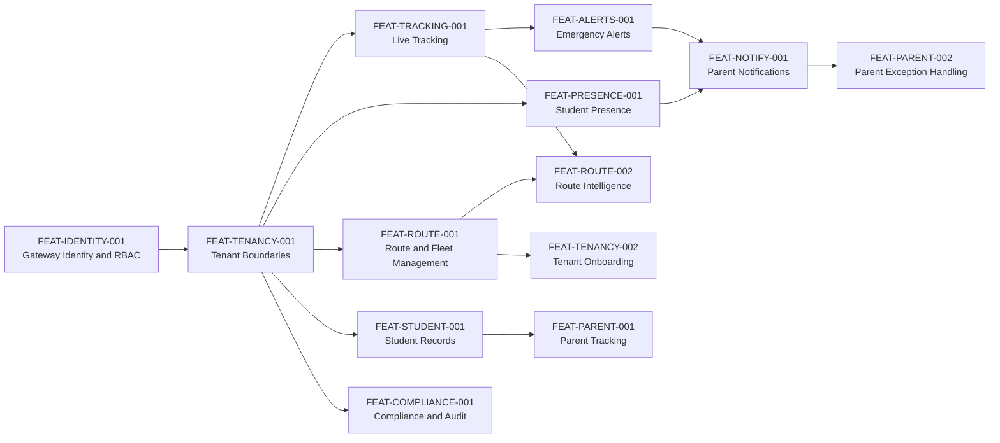

# SBTM Feature Catalog

- Document owner: Product and Engineering
- Last reviewed: 2026-03-24
- Primary use: Traceable feature inventory with dependencies, status, and requirement coverage

This catalog translates the requirements baseline into business-facing capabilities with stable feature identifiers. For code-verified delivery gaps, use `docs/prd/v1/UpgradePlan/GapAnalysis.md`.

## Related Documents

- [Requirements.md](Requirements.md)
- [UseCases.md](UseCases.md)
- [UserJourney.md](UserJourney.md)
- [../Design/v1/Architecture.md](../Design/v1/Architecture.md)
- [../prd/v1/UpgradePlan/GapAnalysis.md](../prd/v1/UpgradePlan/GapAnalysis.md)

## Feature Dependency Overview

## Feature Catalog

| ID | Feature | Status | Depends On | Requirement Coverage | Primary Surfaces |
| --- | --- | --- | --- | --- | --- |
| FEAT-IDENTITY-001 | Gateway identity and RBAC | Implemented | None | FR-IDENT-001, FR-IDENT-002, SR-AUTH-001, SR-RBAC-001 | API Gateway, all apps |
| FEAT-TENANCY-001 | Tenant-aware data boundaries | Implemented | FEAT-IDENTITY-001 | FR-TENANT-001, PR-TENANT-001 | API Gateway, downstream services |
| FEAT-TRACKING-001 | Live and historical vehicle tracking | Implemented | FEAT-TENANCY-001 | FR-GPS-001, NFR-PERF-001 | GPS Tracking, Driver App, Parent App, Admin Dashboard |
| FEAT-ALERTS-001 | Emergency alert lifecycle and admin visibility | Implemented | FEAT-TRACKING-001, FEAT-TENANCY-001 | FR-ALERT-001, FR-ALERT-002 | Emergency Alerts, Admin Dashboard, Driver App |
| FEAT-PRESENCE-001 | Student presence capture and state tracking | Partial | FEAT-TENANCY-001, FEAT-STUDENT-001 | FR-PRESENCE-001, FR-PRESENCE-002, NFR-RESIL-001 | Student Presence, Driver App |
| FEAT-STUDENT-001 | Student records and route assignment | Implemented | FEAT-TENANCY-001 | FR-STUDENT-001 | Student Management, API Gateway, Admin Dashboard |
| FEAT-COMPLIANCE-001 | Driver compliance, inspections, and audit logging | Implemented | FEAT-TENANCY-001 | FR-COMPLIANCE-001, SR-AUDIT-001 | Compliance Management, Admin Dashboard |
| FEAT-ROUTE-001 | Route, stop, and fleet administration | Implemented | FEAT-TENANCY-001 | FR-ROUTE-001 | API Gateway, Admin Dashboard |
| FEAT-ROUTE-002 | Route intelligence and optimization | Partial | FEAT-ROUTE-001, FEAT-TRACKING-001 | FR-ROUTE-002 | Route planner, GPS intelligence |
| FEAT-VIDEO-001 | Video event registration and review | Implemented | FEAT-TENANCY-001 | FR-VIDEO-001 | Video Service, Admin Dashboard |
| FEAT-PARENT-001 | Parent live tracking experience | Partial | FEAT-TRACKING-001, FEAT-STUDENT-001 | FR-PARENT-001 | Parent App |
| FEAT-NOTIFY-001 | Parent-facing safety notifications | Planned | FEAT-ALERTS-001, FEAT-PRESENCE-001 | FR-PARENT-002, NFR-PERF-002 | Emergency Alerts, future notification flow, Parent App |
| FEAT-PARENT-002 | Parent exception handling and history | Planned | FEAT-NOTIFY-001 | FR-PARENT-003, PR-CONSENT-001 | Parent App |
| FEAT-TENANCY-002 | Tenant onboarding and user provisioning | Partial | FEAT-IDENTITY-001, FEAT-TENANCY-001 | FR-ONBOARD-001 | API Gateway, Admin Dashboard |

## Current Status Legend

- `Implemented`: Code exists and is materially usable in the current prototype.
- `Partial`: Core foundations exist, but important workflow or quality gaps remain.
- `Planned`: Referenced in target design or roadmap, but not yet implemented end to end.

## Feature-to-Use-Case Matrix

| Feature ID | Primary Use Cases |
| --- | --- |
| FEAT-IDENTITY-001 | UC-LOGIN-001 |
| FEAT-TENANCY-001 | UC-ONBOARD-001, UC-MONITOR-001 |
| FEAT-TRACKING-001 | UC-DRIVER-001, UC-PARENT-001, UC-MONITOR-001 |
| FEAT-ALERTS-001 | UC-DRIVER-001, UC-INCIDENT-001, UC-MONITOR-001 |
| FEAT-PRESENCE-001 | UC-PRESENCE-001, UC-DRIVER-001 |
| FEAT-STUDENT-001 | UC-ONBOARD-001, UC-PRESENCE-001 |
| FEAT-COMPLIANCE-001 | UC-COMPLIANCE-001 |
| FEAT-ROUTE-001 | UC-ROUTE-001, UC-MONITOR-001 |
| FEAT-ROUTE-002 | UC-ROUTE-001 |
| FEAT-VIDEO-001 | UC-INCIDENT-001 |
| FEAT-PARENT-001 | UC-PARENT-001 |
| FEAT-NOTIFY-001 | UC-PARENT-001, UC-INCIDENT-001 |
| FEAT-PARENT-002 | UC-PARENT-001 |
| FEAT-TENANCY-002 | UC-ONBOARD-001 |
