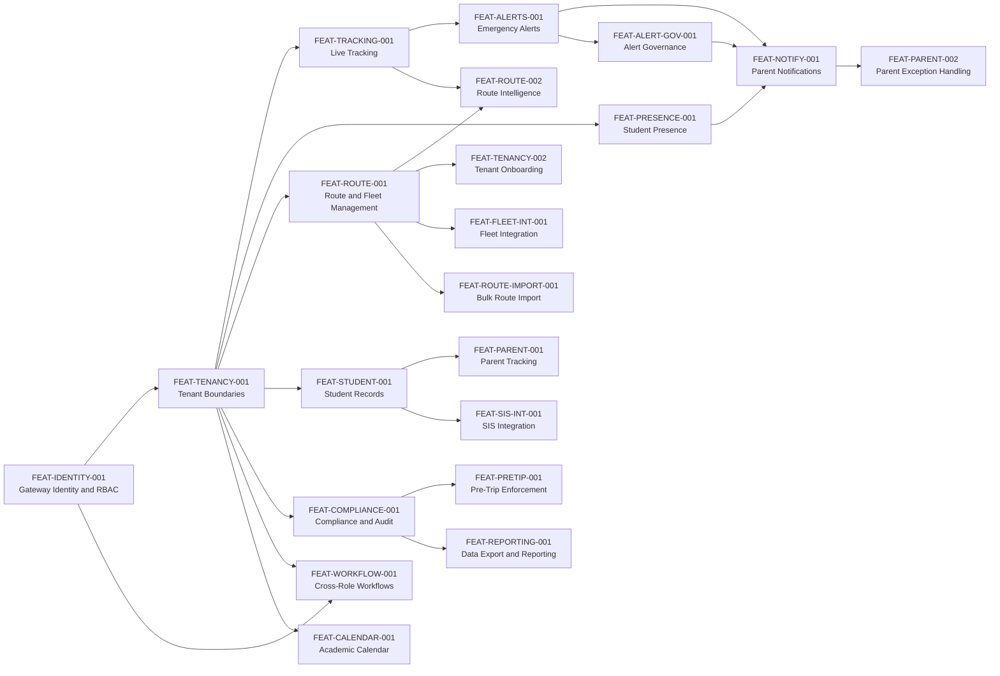

# SBTM Feature Catalog

- Document owner: Product and Engineering
- Last reviewed: 2026-04-02
- Primary use: Traceable feature inventory with dependencies, status, and requirement coverage

This catalog translates the requirements baseline into business-facing capabilities with stable feature identifiers. For code-verified delivery gaps, use `docs/prd/GapAnalysis.md`. For v4 business gap analysis and upgrade plan, see `docs/prd/v4/GapAnalysis.md`.

## Related Documents

- [Requirements.md](Requirements.md)
- [UseCases.md](UseCases.md)
- [UserJourney.md](UserJourney.md)
- [../Design/Architecture.md](../Design/Architecture.md)
- [../prd/GapAnalysis.md](../prd/GapAnalysis.md)
- [../prd/v4/GapAnalysis.md](../prd/v4/GapAnalysis.md) (v4 Business Gap Analysis)
- [../prd/v4/UpgradePlan.md](../prd/v4/UpgradePlan.md) (v4 Upgrade Plan)
- [../prd/v4/AlertStrategy.md](../prd/v4/AlertStrategy.md) (v4 Alert Strategy)

## Feature Dependency Overview

## Feature Catalog

### Core Features (Existing)

| ID                  | Feature                                           | Status      | Depends On                          | Requirement Coverage                                 | Primary Surfaces                                      |
| ------------------- | ------------------------------------------------- | ----------- | ----------------------------------- | ---------------------------------------------------- | ----------------------------------------------------- |
| FEAT-IDENTITY-001   | Gateway identity and RBAC                         | Implemented | None                                | FR-IDENT-001, FR-IDENT-002, SR-AUTH-001, SR-RBAC-001 | API Gateway, all apps                                 |
| FEAT-TENANCY-001    | Tenant-aware data boundaries                      | Implemented | FEAT-IDENTITY-001                   | FR-TENANT-001, PR-TENANT-001                         | API Gateway, downstream services                      |
| FEAT-TRACKING-001   | Live and historical vehicle tracking              | Implemented | FEAT-TENANCY-001                    | FR-GPS-001, NFR-PERF-001                             | GPS Tracking, Driver App, Parent App, Admin Dashboard |
| FEAT-ALERTS-001     | Emergency alert lifecycle and admin visibility    | Implemented | FEAT-TRACKING-001, FEAT-TENANCY-001 | FR-ALERT-001, FR-ALERT-002                           | Emergency Alerts, Admin Dashboard, Driver App         |
| FEAT-PRESENCE-001   | Student presence capture and state tracking       | Partial     | FEAT-TENANCY-001, FEAT-STUDENT-001  | FR-PRESENCE-001, FR-PRESENCE-002, NFR-RESIL-001      | Student Presence, Driver App                          |
| FEAT-STUDENT-001    | Student records and route assignment              | Implemented | FEAT-TENANCY-001                    | FR-STUDENT-001                                       | Student Management, API Gateway, Admin Dashboard      |
| FEAT-COMPLIANCE-001 | Driver compliance, inspections, and audit logging | Implemented | FEAT-TENANCY-001                    | FR-COMPLIANCE-001, SR-AUDIT-001                      | Compliance Management, Admin Dashboard                |
| FEAT-ROUTE-001      | Route, stop, and fleet administration             | Implemented | FEAT-TENANCY-001                    | FR-ROUTE-001                                         | API Gateway, Admin Dashboard                          |
| FEAT-ROUTE-002      | Route intelligence and optimization               | Partial     | FEAT-ROUTE-001, FEAT-TRACKING-001   | FR-ROUTE-002                                         | Route planner, GPS intelligence                       |
| FEAT-VIDEO-001      | Video event registration and review               | Implemented | FEAT-TENANCY-001                    | FR-VIDEO-001                                         | Video Service, Admin Dashboard                        |
| FEAT-PARENT-001     | Parent live tracking experience                   | Partial     | FEAT-TRACKING-001, FEAT-STUDENT-001 | FR-PARENT-001                                        | Parent App                                            |
| FEAT-NOTIFY-001     | Parent-facing safety notifications                | Implemented | FEAT-ALERTS-001, FEAT-PRESENCE-001  | FR-PARENT-002, FR-PRESENCE-003, NFR-PERF-002         | Emergency Alerts, Notification Service, Parent App    |
| FEAT-PARENT-002     | Parent exception handling and history             | Planned     | FEAT-NOTIFY-001                     | FR-PARENT-003, PR-CONSENT-001                        | Parent App                                            |
| FEAT-TENANCY-002    | Tenant onboarding and user provisioning           | Partial     | FEAT-IDENTITY-001, FEAT-TENANCY-001 | FR-ONBOARD-001, FR-ROLE-001, FR-ROLE-002             | API Gateway, Admin Dashboard                          |

### v4 Features (Planned)

| ID                    | Feature                                                              | Status  | Depends On                          | Requirement Coverage                     | Primary Surfaces                       | v4 Phase |
| --------------------- | -------------------------------------------------------------------- | ------- | ----------------------------------- | ---------------------------------------- | -------------------------------------- | -------- |
| FEAT-ALERT-GOV-001    | Alert governance, classification, and confirmation workflow          | Planned | FEAT-ALERTS-001                     | FR-ALERT-003, FR-ALERT-004, FR-ALERT-005 | Emergency Alerts, Admin Dashboard      | Phase B  |
| FEAT-SIS-INT-001      | Student Information System batch/API integration                     | Planned | FEAT-STUDENT-001                    | FR-INT-001                               | Student Management, Admin Dashboard    | Phase D  |
| FEAT-FLEET-INT-001    | OSTA fleet database synchronization                                  | Planned | FEAT-ROUTE-001                      | FR-INT-002                               | API Gateway, Admin Dashboard           | Phase D  |
| FEAT-ROUTE-IMPORT-001 | Bulk route import from Excel/CSV with geocoding                      | Planned | FEAT-ROUTE-001                      | FR-INT-003                               | API Gateway, Admin Dashboard           | Phase D  |
| FEAT-PRETRIP-001      | Pre-trip inspection enforcement before route start                   | Planned | FEAT-COMPLIANCE-001                 | FR-WORKFLOW-003                          | Driver App, Compliance Management      | Phase E  |
| FEAT-WORKFLOW-001     | Cross-role coordination workflows (fleet assignment, route approval) | Planned | FEAT-IDENTITY-001, FEAT-TENANCY-001 | FR-WORKFLOW-001, FR-WORKFLOW-002         | API Gateway, Admin Dashboard           | Phase C  |
| FEAT-REPORTING-001    | Data export (CSV/PDF) and scheduled reports                          | Planned | FEAT-COMPLIANCE-001                 | FR-INT-004                               | Admin Dashboard, Compliance Management | Phase E  |
| FEAT-CALENDAR-001     | Academic calendar management with route schedule awareness           | Planned | FEAT-TENANCY-001                    | FR-CALENDAR-001                          | API Gateway, Admin Dashboard           | Phase E  |

## Current Status Legend

- `Implemented`: Code exists and is materially usable in the current prototype.
- `Partial`: Core foundations exist, but important workflow or quality gaps remain.
- `Planned`: Referenced in target design or roadmap, but not yet implemented end to end.

## Feature-to-Use-Case Matrix

| Feature ID            | Primary Use Cases                                 |
| --------------------- | ------------------------------------------------- |
| FEAT-IDENTITY-001     | UC-LOGIN-001                                      |
| FEAT-TENANCY-001      | UC-ONBOARD-001, UC-MONITOR-001                    |
| FEAT-TRACKING-001     | UC-DRIVER-001, UC-PARENT-001, UC-MONITOR-001      |
| FEAT-ALERTS-001       | UC-DRIVER-001, UC-INCIDENT-001, UC-MONITOR-001    |
| FEAT-PRESENCE-001     | UC-PRESENCE-001, UC-DRIVER-001                    |
| FEAT-STUDENT-001      | UC-ONBOARD-001, UC-PRESENCE-001                   |
| FEAT-COMPLIANCE-001   | UC-COMPLIANCE-001                                 |
| FEAT-ROUTE-001        | UC-ROUTE-001, UC-MONITOR-001                      |
| FEAT-ROUTE-002        | UC-ROUTE-001                                      |
| FEAT-VIDEO-001        | UC-INCIDENT-001                                   |
| FEAT-PARENT-001       | UC-PARENT-001                                     |
| FEAT-NOTIFY-001       | UC-PARENT-001, UC-INCIDENT-001                    |
| FEAT-PARENT-002       | UC-PARENT-001                                     |
| FEAT-TENANCY-002      | UC-ONBOARD-001                                    |
| FEAT-ALERT-GOV-001    | UC-INCIDENT-001, UC-MONITOR-001                   |
| FEAT-SIS-INT-001      | UC-ONBOARD-001, UC-DATAMIG-001                    |
| FEAT-FLEET-INT-001    | UC-ROUTE-001, UC-DATAMIG-001                      |
| FEAT-ROUTE-IMPORT-001 | UC-ROUTE-001, UC-DATAMIG-001                      |
| FEAT-PRETRIP-001      | UC-DRIVER-001, UC-COMPLIANCE-001                  |
| FEAT-WORKFLOW-001     | UC-ROUTE-001, UC-ONBOARD-001, UC-FLEET-ASSIGN-001 |
| FEAT-REPORTING-001    | UC-COMPLIANCE-001, UC-MONITOR-001                 |
| FEAT-CALENDAR-001     | UC-ROUTE-001, UC-MONITOR-001                      |

## v4 Phase Mapping

The v4 features are sequenced across 6 delivery phases (see [Upgrade Plan](../prd/v4/UpgradePlan.md)):

| Phase   | Features                                                    | Business Value                                                                                    |
| ------- | ----------------------------------------------------------- | ------------------------------------------------------------------------------------------------- |
| Phase A | FEAT-NOTIFY-001                                             | Parents receive real-time boarding/alighting and emergency notifications                          |
| Phase B | FEAT-ALERT-GOV-001                                          | Alerts classified by tier, confirmed by admin before parent delivery, escalated if unacknowledged |
| Phase C | FEAT-WORKFLOW-001, FEAT-TENANCY-002 (completion)            | Role boundaries enforced, fleet assignment and route approval workflows                           |
| Phase D | FEAT-SIS-INT-001, FEAT-FLEET-INT-001, FEAT-ROUTE-IMPORT-001 | External system integration, bulk data migration from legacy                                      |
| Phase E | FEAT-PRETRIP-001, FEAT-REPORTING-001, FEAT-CALENDAR-001     | Operational maturity: inspection enforcement, reporting, calendar                                 |
| Phase F | (infrastructure features)                                   | Production hardening, setup wizard, monitoring                                                    |
