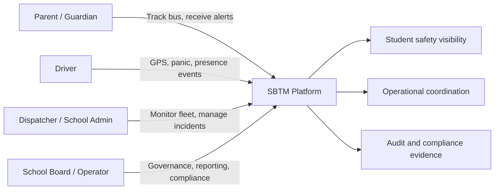

# SBTM Problem Statement and Business Context

- Document owner: Product and Architecture
- Last reviewed: 2026-03-24
- Primary use: Shared business context for product, engineering, delivery, and stakeholder conversations

This document explains why SBTM exists, which outcomes it is expected to improve, and how the domain context should shape product and technical decisions. For scope and delivery commitments, use `Requirements.md`, `UseCases.md`, and `../prd/v1/UpgradePlan/*`.

## Related Documents

- [Requirements.md](Requirements.md)
- [Features.md](Features.md)
- [UseCases.md](UseCases.md)
- [UserJourney.md](UserJourney.md)
- [Architecture.md](../Design/v1/Architecture.md)
- [NonFunctionalRequirements.md](../Design/v1/NonFunctionalRequirements.md)

## 1. Business Problem

School transportation operations are safety-critical, time-sensitive, and coordination-heavy. The current operational model in many school boards relies on phone calls, fragmented spreadsheets, manual attendance checks, and delayed issue escalation. This creates avoidable risk in four core areas:

1. **Student safety risk** when parents and schools do not have timely visibility into bus location, boarding, alighting, or emergency situations.
2. **Operational inefficiency** when dispatchers and school administrators react to incomplete or delayed information.
3. **Communication breakdowns** when drivers, parents, and administrators do not share the same live operational picture.
4. **Compliance burden** when inspections, incidents, and audit evidence are stored across disconnected systems.

SBTM addresses these gaps by creating a tenant-aware transport platform where live bus telemetry, student presence events, emergency workflows, and audit trails are available to the right stakeholders at the right time.

## 2. Target Operating Environment

The project is designed for Canadian school transportation operations, where data handling, breach response, and access boundaries must align with school-board expectations and public-sector obligations.

### Key contextual constraints

- **Children's safety takes priority** over convenience or feature breadth.
- **School boards and schools need tenant isolation** so one organization's data never leaks into another's workflows.
- **Drivers may lose connectivity** during routes, so critical workflows must degrade safely.
- **Parents require trust and clarity**, especially during delays, route changes, and emergency events.
- **Auditability matters** for inspections, incidents, and operational reviews.

## 3. Stakeholders and Value Delivered

| Stakeholder | Primary pain today | Value SBTM is expected to deliver |
|---|---|---|
| Parents / Guardians | Unclear ETAs, poor emergency communication, no trusted proof of boarding/alighting | Live location, timely alerts, clearer student safety status |
| Drivers | Manual reporting, fragmented tools, pressure during route exceptions | Simple mobile workflows for location, panic events, and presence logging |
| Dispatchers / School Admins | Limited fleet visibility, delayed incident awareness, manual coordination | Shared operational dashboard, route visibility, faster incident response |
| School Boards / Operators | Weak audit trail, inconsistent compliance evidence, difficult multi-school coordination | Centralized records, tenant-scoped reporting, better operational governance |

## 4. Desired Business Outcomes

SBTM should improve both safety outcomes and operational outcomes.

### Safety outcomes
- Reduce time from incident creation to stakeholder notification.
- Improve confidence in student boarding and alighting visibility.
- Provide a consistent escalation path for emergency events.

### Operational outcomes
- Reduce dispatcher effort spent gathering status from drivers.
- Improve route exception awareness for schools and parents.
- Provide a reusable platform for multi-school or multi-board operations.

### Governance outcomes
- Improve evidence quality for audits, inspections, and post-incident reviews.
- Make data access boundaries explicit through tenant-aware APIs and records.

## 5. Success Measures

The project should be evaluated with measurable outcomes, not only feature completion.

| Area | Success measure |
|---|---|
| Parent trust | Parents can view current route status and receive safety-critical alerts without relying on phone support |
| Emergency response | Critical incidents are visible to administrators within seconds, with a durable incident trail |
| Operational awareness | Dispatchers can determine fleet status from the dashboard instead of manual driver check-ins |
| Student safety workflow | Boarding/alighting events are recorded with tenant-scoped context and route association |
| Compliance readiness | Inspection, incident, and audit evidence is retrievable from system records |

## 6. Product Boundaries

SBTM is intended to be the transport operations coordination layer, not a general student information system or a full route optimization engine.

### In scope for the platform direction
- Vehicle tracking and route status visibility
- Student presence events tied to transport workflows
- Emergency alert capture and operational notification
- Tenant-aware administration, compliance, and audit records

### Explicitly outside the current product boundary
- Full academic SIS ownership
- Payroll, HR, or driver scheduling beyond transport workflows
- Deep map intelligence and optimized routing beyond currently planned integrations
- General-purpose messaging unrelated to transport and safety operations

## 7. Business Context Diagram

## 8. Design Implications

The business domain creates several architectural expectations:

- Safety workflows must prioritize **timeliness, resilience, and auditability**.
- Parent- and admin-facing experiences must expose **shared truth from the same operational events**.
- Offline-tolerant driver workflows are required because transport operations do not happen in ideal network conditions.
- Multi-tenant controls are not optional implementation details; they are part of the business promise.
- Documentation must separate **target-state design** from **current implementation reality** so stakeholders can understand what exists today versus what is planned.
