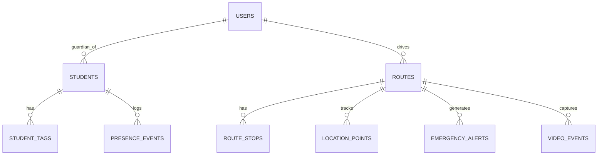

# SBTM Demo Setup Guide

## Complete Developer & QA Setup Guide for Live Demo

This guide walks you through setting up the School Bus Transport Management System (SBTM) for a live demo with simulated buses, students, and parent tracking.

---

## Prerequisites

| Requirement | Version | Purpose |
|-------------|---------|---------|
| **Node.js** | v20+ | Runtime for all services |
| **Docker** | Latest | Containerization |
| **Docker Compose** | v2.0+ | Container orchestration |
| **Git** | Latest | Source control |
| **PostgreSQL Client** | v15+ | Optional: Manual DB access |

### Hardware for Demo
- **2-3 smartphones/tablets** (Android/iOS) for Driver App
- **3-4 smartphones** for Parent App
- **1 laptop/desktop** for Admin Dashboard

---

## Quick Start (5 Minutes)

### Step 1: Clone Repository
```bash
git clone https://github.com/arvinddhasmana/SBTM_AntiGravity.git
cd SBTM_AntiGravity
```

### Step 2: Start All Services
```bash
# Start infrastructure (PostgreSQL, Redis) and all microservices
docker compose up --build -d
```

### Step 3: Initialize Database with Demo Data
```bash
# Wait for services to be healthy (about 30 seconds)
# Then run the seed script
.\scripts\seed-demo-data.ps1

# OR on Unix-based systems
./scripts/seed-demo-data.sh
```

### Step 4: Verify Services
```bash
# Check all services are running
docker compose ps

# Health check (API Gateway)
curl http://localhost:3001/health
```

---

## Service Endpoints

| Service | Port | Health Check |
|---------|------|--------------|
| **API Gateway** | 3001 | http://localhost:3001/api/v1/health |
| **GPS Tracking** | 3002 | http://localhost:3002/health |
| **Emergency Alerts** | 3003 | http://localhost:3003/health |
| **Student Presence** | 3004 | http://localhost:3004/health |
| **Video Service** | 3005 | http://localhost:3005/api/v1/health |
| **Admin Dashboard** | 5173 | http://localhost:5173 |
| **Parent App** | 3000 | http://localhost:3000 |

---

## Demo User Credentials

> [!IMPORTANT]
> Use these pre-seeded accounts for the demo

### Admin Users
| Email | Password | Role | Description |
|-------|----------|------|-------------|
| admin@sbtm.demo | Admin123! | ADMIN | Full system access |
| supervisor@sbtm.demo | Admin123! | ADMIN | Fleet supervisor |

### Driver Users
| Email | Password | Assigned Bus | Route |
|-------|----------|--------------|-------|
| driver1@sbtm.demo | Driver123! | BUS-001 | Route A (Morning) |
| driver2@sbtm.demo | Driver123! | BUS-002 | Route B (Morning) |
| driver3@sbtm.demo | Driver123! | BUS-003 | Route C (Afternoon) |

### Parent Users
| Email | Password | Children |
|-------|----------|----------|
| parent1@sbtm.demo | Parent123! | Emma Smith (Route A), Liam Smith (Route A) |
| parent2@sbtm.demo | Parent123! | Olivia Johnson (Route B) |
| parent3@sbtm.demo | Parent123! | Noah Williams (Route A) |
| parent4@sbtm.demo | Parent123! | Ava Brown (Route B) |

---

## Demo Scenario Setup

### Scenario: Morning School Run

**Participants:**
- 2-3 Buses with GPS-enabled phones
- 4 Students with SmartTags (simulated)
- 4 Parents monitoring on phones
- 1 Admin monitoring dashboard

### Step-by-Step Demo Flow

#### 1. Admin Setup (5 min)
1. Open Admin Dashboard: http://localhost:5173
2. Login as: `admin@sbtm.demo` / `Admin123!`
3. Navigate to **Fleet Overview** → Verify 3 buses visible
4. Navigate to **Routes** → Verify routes configured

#### 2. Driver Preparation (5 min per driver)
1. Open Driver App on smartphone
2. Login as `driver1@sbtm.demo`
3. Select assigned route from list
4. Tap **"Start Route"** to begin GPS tracking

#### 3. Parent Tracking Setup (2 min per parent)
1. Open Parent App on smartphone
2. Login as parent (e.g., `parent1@sbtm.demo`)
3. Select child from dashboard
4. View live bus location on map

#### 4. Live Demo Actions

**GPS Tracking Demo:**
```
→ Driver moves with phone
→ Admin sees real-time position on dashboard
→ Parents see bus approaching on their app
```

**Student Boarding Demo:**
```
→ Simulate student boarding via API:
curl -X POST http://localhost:3001/api/v1/student-presence-events \
  -H "Authorization: Bearer <DRIVER_TOKEN>" \
  -H "Content-Type: application/json" \
  -d '{"studentId":"STUDENT-001","vehicleId":"BUS-001","routeId":"ROUTE-A","eventType":"BOARD"}'
```

**Emergency Alert Demo:**
```
→ Driver taps Panic Button in app
→ Admin immediately sees alert popup
→ Alert shows bus location, route, driver info
```

---

## Database Schema Overview



---

## Troubleshooting

### Docker Issues

**Problem:** Services not starting
```bash
# Check logs
docker compose logs api-gateway
docker compose logs postgres

# Rebuild
docker compose down -v
docker compose up --build
```

**Problem:** Port conflicts
```bash
# Stop local PostgreSQL/Redis
net stop postgresql-x64-15
net stop redis

# Or change ports in docker-compose.yml
```

### Database Issues

**Problem:** Seed data not loading
```bash
# Connect to database
docker exec -it sbtm_antigravity-postgres-1 psql -U postgres -d sbms

# Check tables
\dt

# Re-run seed
.\scripts\seed-demo-data.ps1
```

**Problem:** GPS migrations not applied
```bash
# Manually run prisma migrations
docker exec sbtm_antigravity-gps-tracking-1 npx prisma migrate deploy
```

### API Issues

**Problem:** Authentication failures
```bash
# Get fresh token
curl -X POST http://localhost:3001/api/v1/auth/login \
  -H "Content-Type: application/json" \
  -d '{"email":"admin@sbtm.demo","password":"Admin123!"}'
```

---

## API Quick Reference

### Authentication
```bash
# Login
POST /api/v1/auth/login
Body: { "email": "...", "password": "..." }
Response: { "accessToken": "..." }
```

### GPS Tracking
```bash
# Get live location
GET /api/v1/routes/{routeId}/live-location
Header: Authorization: Bearer <token>

# Send location (Driver)
POST /api/v1/locations
Body: { "vehicleId", "routeId", "lat", "lng" }
```

### Student Presence
```bash
# Board/Alight student
POST /api/v1/student-presence-events
Body: { "studentId", "vehicleId", "routeId", "eventType": "BOARD|ALIGHT" }

# Get students on route
GET /api/v1/routes/{routeId}/students
```

### Emergency
```bash
# Trigger emergency
POST /api/v1/emergency-events
Body: { "vehicleId", "routeId", "eventType": "PANIC_BUTTON", "lat", "lng" }

# Get active alerts
GET /api/v1/alerts/active
```

---

## Starting Individual Apps

### Admin Dashboard (Development)
```bash
cd apps/admin-dashboard
npm install
npm run dev
# Opens at http://localhost:5173
```

### Parent App (Web)
```bash
cd apps/parent-app/web
npm install
npm run dev
# Opens at http://localhost:3000
```

### Driver App (Expo)
```bash
cd apps/driver-app
npm install
npx expo start
# Scan QR code with Expo Go app
```

---

## Environment Variables Reference

### API Gateway (.env)
```env
PORT=3001
DB_HOST=localhost
DB_PORT=5433
DB_USERNAME=postgres
DB_PASSWORD=mysecretpassword
DB_DATABASE=sbms
JWT_SECRET=your-super-secret-jwt-key
GPS_SERVICE_URL=http://localhost:3002
ALERTS_SERVICE_URL=http://localhost:3003
PRESENCE_SERVICE_URL=http://localhost:3004
VIDEO_SERVICE_URL=http://localhost:3005
```

---

## Demo Checklist

- [ ] Docker running and healthy
- [ ] All 5 services started
- [ ] Database seeded with demo data
- [ ] Admin dashboard accessible
- [ ] 2-3 driver phones ready with app
- [ ] 3-4 parent phones ready with app
- [ ] SmartTag simulation scripts ready
- [ ] Network connectivity verified
