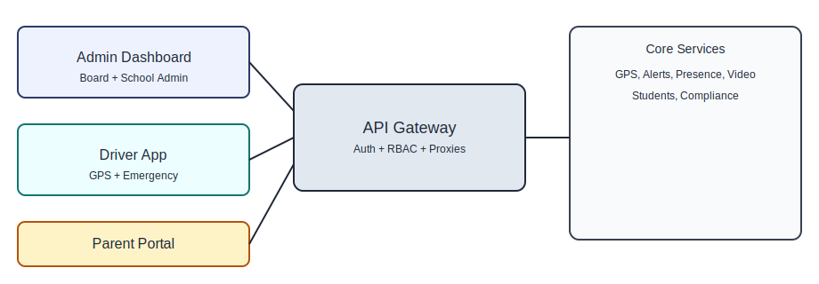
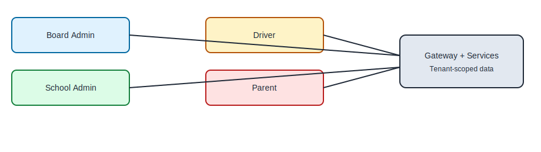
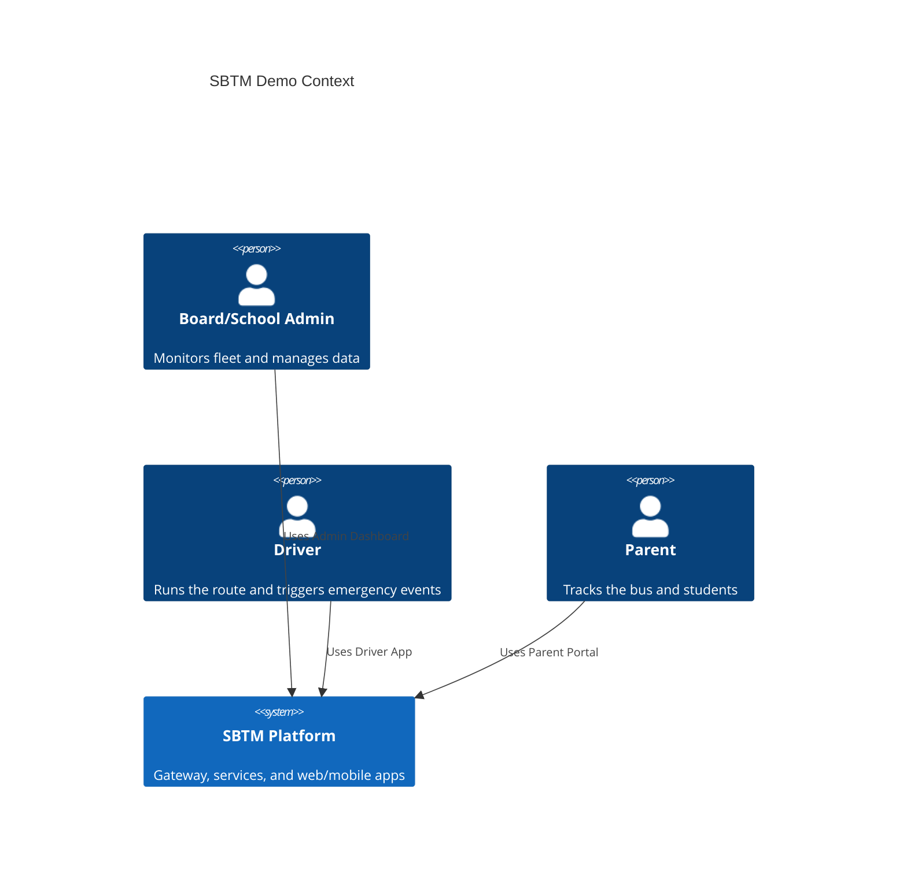
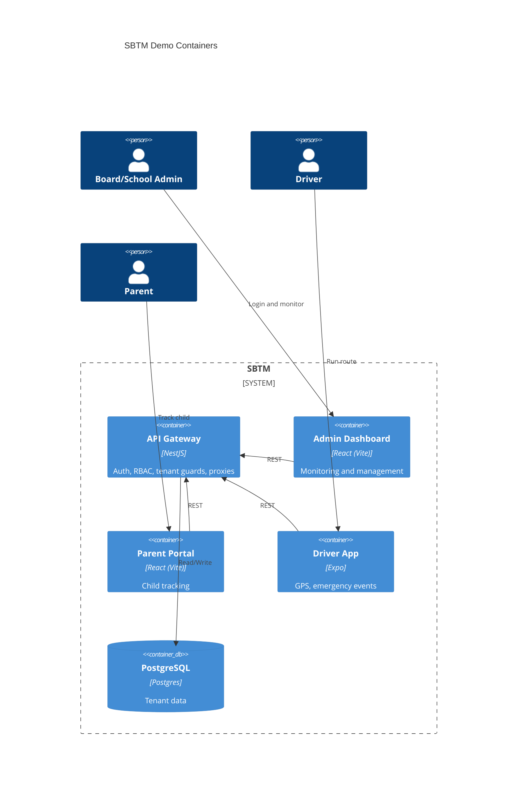

# SBTM Demo Setup Guide (All Features)

This guide is for new developers and QA team members. It walks you through a full, end-to-end demo story that covers Board Admin, School Admin, Driver, and Parent roles. It includes one-command setup, seeded data, and workarounds for features that are not implemented yet.

If you need a shorter walkthrough, use [LiveDemoScript.md](LiveDemoScript.md).

## Visual Overview





### C4 Diagram (Demo Context)





## 1. One-Command Demo Setup (Recommended)

### Windows (PowerShell)

```powershell
# From repo root
.\scripts\demo-setup.ps1
```

### macOS/Linux (bash)

```bash
# From repo root
./scripts/demo-setup.sh
```

Both commands will:
1) Start all services with Docker Compose.
2) Seed demo data (users, routes, vehicles, students).

If you do not want to rebuild containers, pass `--no-build` (bash) or `-NoBuild` (PowerShell).

## 2. Two-Command Setup (Fallback)

If the one-command setup fails, use this fallback:

```bash
# Start all services
Docker compose up -d --build

# Seed demo data
# Windows:
.\scripts\seed-demo-data.ps1

# macOS/Linux:
./scripts/seed-demo-data.sh
```

## 3. Demo Credentials (Seeded)

Suggested login credentials (all use the same password in demo environments):

- Admin (Board/School): admin@sbtm.demo
- OSTA Admin: osta.admin@sbtm.demo
- Board Admin: board.admin@sbtm.demo
- School Admin: school.admin@sbtm.demo
- Driver: driver1@sbtm.demo
- Parent: parent1@sbtm.demo

If login fails, run the seeding script again and use the password printed by the script.

## 4. Start the Demo Apps

### Admin Dashboard

```powershell
cd apps/admin-dashboard
npm install
npm run dev
```

- URL: http://localhost:5173
- Set VITE_API_URL to http://localhost:3001

### Parent Portal

```powershell
cd apps/parent-app/web
npm install
npm run dev
```

- URL: http://localhost:5174
- Set VITE_API_URL to http://localhost:3001

### Driver App (Expo)

```powershell
cd apps/driver-app
npm install
npx expo start
```

- Set EXPO_PUBLIC_API_URL to http://<your-ip>:3001/api/v1 on physical devices.
- Android emulator default: http://10.0.2.2:3001/api/v1

## 5. Run the Demo Simulator (GPS + Alerts + Route Events)

After services are up and data is seeded, run the simulator to generate live GPS movement, emergency alerts, late notices, and route start/complete entries.

```powershell
# From repo root
.\scripts\simulate-demo.ps1 -IntervalSeconds 5 -Laps 3 -WithPresence
```

To customize routes and waypoints without editing the script, update:

- [scripts/demo-gps-track.json](../../scripts/demo-gps-track.json)

The simulator loads this file automatically when present. Each route entry should align with seeded IDs (ROUTE-A, BUS-001, driver1@sbtm.demo, Demo School IDs).
The file supports multiple named tracks under `tracks`. Pick one with `-TrackName seeded-main`.
To use a different file, pass `-TrackConfigPath <path>`.

The simulator validates route, vehicle, driver, and student IDs against seeded demo data. Use `-StrictSeedValidation` to fail fast if any IDs are out of sync.

What this does:
- Emits GPS updates for ROUTE-A and ROUTE-B (BUS-001, BUS-002).
- Sends a PANIC alert periodically.
- Sends a late notice as an "OTHER" alert (workaround for missing delay endpoint).
- Logs ROUTE_STARTED and ROUTE_COMPLETED entries to Compliance Audit (Admin Dashboard > Compliance > Audit).

You can tune the pacing:
- Increase `-IntervalSeconds` for slower movement.
- Increase `-Laps` for longer demos.
- Use `-NoEmergency` or `-NoLate` to mute those events.

## 6. Demo Story (End-to-End Use Cases)

This story demonstrates the main use cases for Board Admin, School Admin, Driver, and Parent.

### Step A: Board Admin View (Monitoring)

1) Log in to the Admin Dashboard as admin@sbtm.demo.
2) Open the Dashboard page to view live alerts and fleet status.
3) Open Students and Compliance pages to show tenant-scoped lists.

Workaround (Board/School management UI is not implemented):
- Use API calls to create a board and school to narrate the flow.

```bash
# Login to get a token
curl -X POST http://localhost:3001/api/v1/auth/login \
  -H "Content-Type: application/json" \
  -d '{"email":"admin@sbtm.demo","password":"Admin123!"}'

# Use the accessToken in these calls
curl -X POST http://localhost:3001/api/v1/boards \
  -H "Authorization: Bearer <token>" \
  -H "Content-Type: application/json" \
  -d '{"name":"Demo Board"}'

curl -X POST http://localhost:3001/api/v1/schools \
  -H "Authorization: Bearer <token>" \
  -H "Content-Type: application/json" \
  -d '{"name":"Demo School","boardId":"<board-id>"}'
```

Narration tip: Explain that Board Admin would see system-wide metrics, while School Admin sees only a single school slice. The API already enforces tenant scope through school_id.

### Step B: School Admin Actions (Operations)

1) In the Admin Dashboard, open Routes and Vehicles.
2) Show a seeded route (ROUTE-A) and associated bus (BUS-001).
3) Show Students list for the school (Emma Smith, Liam Smith, Olivia Johnson).

Workaround (Board/School admin roles in UI):
- If you need explicit role demo, update a user role in the database:

```bash
docker exec -it sbtm_antigravity-postgres-1 psql -U postgres -d sbms \
  -c "UPDATE users SET role='SCHOOL_ADMIN' WHERE email='admin@sbtm.demo';"
```

### Step C: Driver Operations (Route + GPS + Emergency)

1) Open Driver App and log in as driver1@sbtm.demo.
2) Select the schedule and start tracking.
3) Trigger the panic button to create an emergency event.

If no device GPS is available, simulate GPS from your terminal:

```bash
curl -X POST http://localhost:3001/api/v1/routes/locations \
  -H "Authorization: Bearer <driver-token>" \
  -H "Content-Type: application/json" \
  -d '{"vehicleId":"BUS-001","routeId":"ROUTE-A","timestamp":"2026-02-11T08:00:00Z","lat":45.4215,"lng":-75.6972}'
```

### Step D: Parent Tracking (Live Location)

1) Open the Parent Portal and log in as parent1@sbtm.demo.
2) Select a child and open the live map view.
3) The map polls the gateway for /routes/:routeId/live-location.

If the bus location does not move, repeat the GPS curl above with updated coordinates.

### Step E: Student Presence (Manual Event)

Presence tags are optional in this demo. Use a manual event to simulate a student boarding:

```bash
curl -X POST http://localhost:3001/api/v1/student-presence-events \
  -H "Authorization: Bearer <driver-token>" \
  -H "Content-Type: application/json" \
  -d '{"studentId":"STUDENT-001","vehicleId":"BUS-001","routeId":"ROUTE-A","eventType":"BOARD","timestamp":"2026-02-11T08:05:00Z","source":"MANUAL"}'
```

### Step F: Video Event (Admin Review)

```bash
curl -X POST http://localhost:3001/api/v1/video-events \
  -H "Authorization: Bearer <token>" \
  -H "Content-Type: application/json" \
  -d '{"routeId":"ROUTE-A","vehicleId":"BUS-001","driverId":"driver-001","eventType":"INCIDENT","timestamp":"2026-02-11T08:10:00Z","durationSeconds":30}'
```

Then open the Videos page in the Admin Dashboard.

## 7. Workarounds and Narration (If Features Are Missing)

- Board/School management UI: use the API calls above and narrate the UI that will consume them.
- Route optimization: explain that the API returns a placeholder polyline and will be wired to map providers later.
- Parent notifications: the simulator uses an alert event type of OTHER to represent a delay.
- Video playback: show the event list and narrate how playback will be streamed from the Video Service.
- BLE tags: use manual presence events for now; BLE scanning can be narrated.

## 8. Validation and QA Checks

Use these checks to confirm everything is working with real data:

- API health: http://localhost:3001/api/v1/health
- Admin Dashboard live alerts after panic event
- Parent map updates after GPS posts
- Students list appears under Admin Dashboard
- Compliance list and inspections from gateway endpoints

## 9. Reference Links

- [docs/Implementation/Module-8-ApiGateway.md](../Implementation/Module-8-ApiGateway.md)
- [docs/Implementation/Module-7-AdminDashboard.md](../Implementation/Module-7-AdminDashboard.md)
- [docs/Implementation/Module-3-DriverApp.md](../Implementation/Module-3-DriverApp.md)
- [docs/Implementation/Module-2-ParentApp.md](../Implementation/Module-2-ParentApp.md)
- [docs/Implementation/Module-6-StudentPresence.md](../Implementation/Module-6-StudentPresence.md)
- [docs/Demo/LiveDemoScript.md](LiveDemoScript.md)
