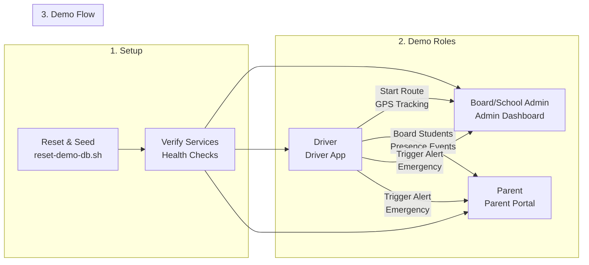
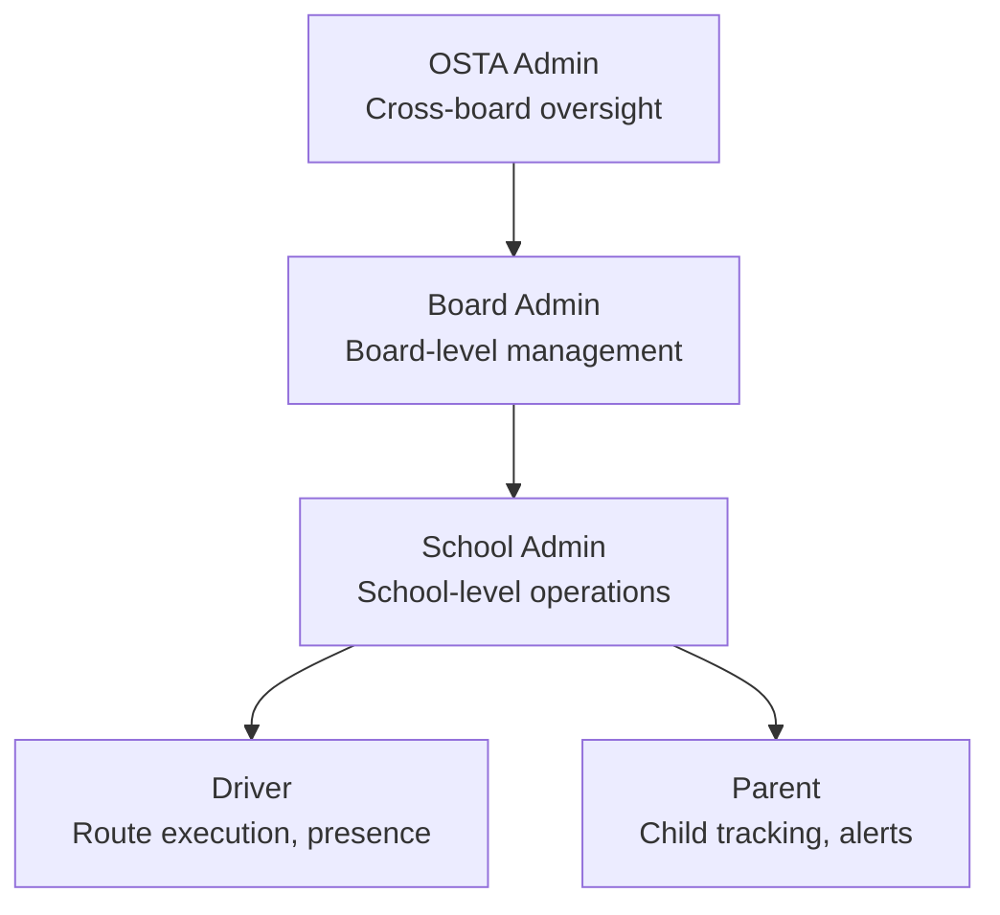

# SBTM Demo Setup Guide (6-School Real-World Demo)

- Document owner: QA and Engineering
- Last reviewed: 2026-04-12
- Primary use: Demo environment setup, seeded data, and operator runbook

This guide is for new developers and QA team members. It walks you through a full, end-to-end demo story that covers OSTA Admin, Board Admin, School Admin, Driver, and Parent roles across 6 Ottawa schools, 2 school boards (OCSB, OCDSB). Drivers use the real Driver App on their phones with actual GPS -- no simulation needed.

This document is the operational setup guide for demos. For current capability gaps, limitations, and phase sequencing, use `docs/prd/GapAnalysis.md` and `docs/prd/PhaseWiseImplementationPlan.md`. For v4 business gap analysis and upgrade plan, see `docs/prd/v4/GapAnalysis.md`.

## Related Documents

- [LiveDemoScript.md](LiveDemoScript.md)
- [QUICK_REFERENCE.md](QUICK_REFERENCE.md)
- [Real Phone Deployment Guide](../Operations/RealPhoneDeploymentGuide.md) -- deploy on a real phone and drive a route
- [GapAnalysis.md](../prd/v4/GapAnalysis.md)
- [PhaseWiseImplementationPlan.md](../prd/v1/PhaseWiseImplementationPlan.md)
- [TestingGuide.md](../Test/TestingGuide.md)
- [v4 Gap Analysis](../prd/v4/GapAnalysis.md)
- [v4 Roles and Workflows](../prd/v4/RolesAndWorkflows.md)
- [v4 Alert Strategy](../prd/v4/AlertStrategy.md)

If you need a shorter walkthrough, use [LiveDemoScript.md](LiveDemoScript.md).

## Visual Overview

### Demo Flow



### Roles Map



## 1. Demo Setup - Complete Reset (Recommended)

This is the **primary recommended approach** for setting up the demo environment. It ensures a clean, consistent state every time.

### Cloud demo (Azure)

The fully Azure-hosted demo lives at:

- Admin: https://admin.sbtm.ca
- Parent: https://parent.sbtm.ca
- API: https://api.sbtm.ca

Provision and deploy with one command:

```bash
bash scripts/azure/bootstrap.sh demo canadacentral
bash scripts/azure/verify-portals.sh demo   # confirm all checks pass
```

Cost controls:

```bash
bash scripts/azure/cost-stop.sh  demo   # pause AKS + Postgres (~$30/mo residual; SWA Free stays $0)
bash scripts/azure/cost-start.sh demo   # resume + auto-verify portals
bash scripts/azure/teardown-azure.sh demo  # delete app RG (sbtm-demo-rg). DNS zone in sbtm-dns-rg is preserved.
```

### Recreate after teardown

```bash
POSTGRES_ADMIN_PASSWORD='<value>' MAPTILER_KEY='<value>' \
  bash scripts/azure/bootstrap.sh demo canadacentral
```

The persistent `sbtm-dns-rg` resource group (containing the `sbtm.ca` zone) is **never** deleted by `teardown-azure.sh`, so the four NS records at your domain registrar stay valid forever — no re-paste needed on rebuild. Bootstrap detects the existing zone and reuses it.

> Resource-location notes:
>
> - `sbtm-pg-demo-centralus` lives in `sbtm-demo-rg` but runs in **Central US** because eastus has no Postgres Flex quota — handled automatically by `bootstrap.sh`. It is **not stray**; teardown removes it with the rest of the RG.
> - The post-delete sweep in `teardown-azure.sh` scans the entire subscription for any leftover `sbtm-*` resources outside `sbtm-dns-rg` and prints them, so you'll always know if anything leaks.

See [docs/Deployment/CustomDomainSetup.md](../Deployment/CustomDomainSetup.md) for the one-time NS delegation at your registrar.

### Local Docker reset and seed

```bash
# From repo root - this will reset everything
./scripts/reset-demo-db.sh
```

This command will:

1. Stop all containers and delete volumes (`docker compose down -v`)
2. Rebuild and start all services (`docker compose up -d --build`)
3. Seed demo data via 3-stage init: schema, standard seed (boards + system admins), demo seed (6 schools, routes, students, parents)
4. Run verification checks to ensure everything works

**Optional flags:**

- `--no-build` - Skip Docker rebuild (faster if images are up to date)
- `--skip-verify` - Skip verification step (not recommended)

### Regenerating Route Data (Optional)

If you need to regenerate the demo routes with OSRM-aligned polylines:

```bash
npx tsx scripts/generate-demo-routes.ts           # Full generation (needs OSRM at localhost:5000)
npx tsx scripts/generate-demo-routes.ts --from-cache  # SQL-only from cached JSON (no OSRM needed)
```

### Verification After Setup

```bash
./scripts/verify-demo.sh
```

This will verify:

- Database tables and seeded data (2 boards, 6 schools, 60 routes, 90 students)
- User login credentials across all roles
- API endpoint authorization (including live location, driver schedule, parent children)

## 2. Demo Credentials (Seeded)

All demo users use password **Admin123!**

### System Admins

| Role              | Email                   | Notes                 |
| ----------------- | ----------------------- | --------------------- |
| Super Admin       | `super.admin@sbtm.demo` | System-wide access    |
| OSTA Admin        | `osta.admin@sbtm.demo`  | Cross-board oversight |
| OCDSB Board Admin | `ocdsb.admin@sbtm.demo` | OCDSB board scope     |
| OCSB Board Admin  | `ocsb.admin@sbtm.demo`  | OCSB board scope      |

### Per-School Users (6 schools)

Each school has 1 School Admin, 1 Driver, 1 Bus, 5 AM routes + 5 PM routes, 15 students, and 10 parents.

| School                  | Board | School Admin              | Driver                     | Bus            |
| ----------------------- | ----- | ------------------------- | -------------------------- | -------------- |
| St. Bernadette (STBERN) | OCSB  | `admin.stbern@sbtm.demo`  | `driver.stbern@sbtm.demo`  | BUS-STBERN-01  |
| All Saints (ALLSNT)     | OCSB  | `admin.allsnt@sbtm.demo`  | `driver.allsnt@sbtm.demo`  | BUS-ALLSNT-01  |
| Sacred Heart (SACRHRT)  | OCSB  | `admin.sacrhrt@sbtm.demo` | `driver.sacrhrt@sbtm.demo` | BUS-SACRHRT-01 |
| John Young (JYOUNG)     | OCDSB | `admin.jyoung@sbtm.demo`  | `driver.jyoung@sbtm.demo`  | BUS-JYOUNG-01  |
| Maplewood (MPLWD)       | OCDSB | `admin.mplwd@sbtm.demo`   | `driver.mplwd@sbtm.demo`   | BUS-MPLWD-01   |
| A.Y. Jackson (AYJACK)   | OCDSB | `admin.ayjack@sbtm.demo`  | `driver.ayjack@sbtm.demo`  | BUS-AYJACK-01  |

**Parents:** `parent1.{abbrev}@sbtm.demo` through `parent10.{abbrev}@sbtm.demo` (60 parents total)

**Route IDs:** `ROUTE-{ABBREV}-R01-AM` through `ROUTE-{ABBREV}-R05-PM` (10 routes per school, 60 total)

### Quick Start: Demo a Single School

For a focused demo, use St. Bernadette as the primary school:

1. Admin Dashboard: log in as `admin.stbern@sbtm.demo`
2. Driver App: log in as `driver.stbern@sbtm.demo`
3. Parent Portal: log in as `parent1.stbern@sbtm.demo`

## 3. Access the Demo Apps Started by Docker Compose

`docker compose up -d --build` already starts these web apps and backend services in containers.

### Admin Dashboard

- URL: http://localhost:5173

### Parent Portal

- URL: http://localhost:5174

### Optional Local Frontend Development (instead of Docker app containers)

Use this only when you are actively developing UI locally:

```bash
# Admin Dashboard
cd apps/admin-dashboard
pnpm install
pnpm run dev

# Parent Portal (new terminal)
cd apps/parent-dashboard/web
pnpm install
pnpm run dev
```

Set `VITE_API_URL` to `http://localhost:3001` for both.

### Driver App (Expo)

```bash
cd apps/driver-app
pnpm install
npx expo start
```

- Set EXPO_PUBLIC_API_URL to http://<your-ip>:3001/api/v1 on physical devices.
- Android emulator default: http://10.0.2.2:3001/api/v1

## 4. Running a Real-World Demo (No Simulation)

This demo is designed for real drivers using the Driver App on their phones. No GPS simulation is needed.

### Step A: OSTA/Board Admin View (Monitoring)

1. Log in to the Admin Dashboard as `osta.admin@sbtm.demo` (or board-specific: `ocdsb.admin@sbtm.demo`).
2. Open the Dashboard page to view live alerts and fleet status across all schools.
3. Open Students and Compliance pages to show tenant-scoped lists.

### Step B: School Admin Actions (Operations)

1. Log in as `admin.stbern@sbtm.demo` in Admin Dashboard.
2. Open Routes to see all 10 routes for St. Bernadette (5 AM + 5 PM).
3. Select a route to see stops rendered on the map with a school marker.

### Step C: Driver Operations (Route + GPS + Boarding)

1. Open Driver App on phone and log in as `driver.stbern@sbtm.demo`.
2. View the schedule showing all 10 assigned routes.
3. Select a route, start it -- GPS tracking begins automatically.
4. Board students at each stop using the student roster.
5. The bus appears on the Admin Dashboard map in real time.
6. Complete the route -- the bus marker disappears from the map.

### Step D: Parent Tracking (Live Location)

1. Open the Parent Portal and log in as `parent1.stbern@sbtm.demo`.
2. Select a child and open the live map view.
3. The map polls the gateway for live bus location.
4. When the driver boards the child, the parent sees the boarding event.

### Step E: Emergency Alert Demo

1. While driving, the driver triggers the panic button in the Driver App.
2. The alert appears immediately on the Admin Dashboard with PENDING_CONFIRMATION status.
3. School Admin confirms or marks as false alarm.
4. If confirmed, parents are notified.

### Step F: Multi-School View

1. Log in as `osta.admin@sbtm.demo` in Admin Dashboard.
2. Start routes at multiple schools simultaneously (have multiple phones/drivers).
3. The dashboard shows all active buses across all 6 schools.
4. Select a route to zoom into its path, stops, and school marker.

## 5. Manual GPS Simulation (Optional)

If no device GPS is available, you can simulate GPS from your terminal:

```bash
# Get a driver token
TOKEN=$(curl -sf -X POST http://localhost:3001/api/v1/auth/login \
  -H "Content-Type: application/json" \
  -d '{"email":"driver.stbern@sbtm.demo","password":"Admin123!"}' \
  | grep -oP '"accessToken"\s*:\s*"\K[^"]+')

# Start the route
curl -X POST http://localhost:3001/api/v1/routes/lifecycle \
  -H "Authorization: Bearer $TOKEN" \
  -H "Content-Type: application/json" \
  -d '{"routeId":"ROUTE-STBERN-R01-AM","vehicleId":"BUS-STBERN-01","eventType":"ROUTE_STARTED","timestamp":"'$(date -u +%Y-%m-%dT%H:%M:%SZ)'"}'

# Send GPS update
curl -X POST http://localhost:3001/api/v1/routes/locations \
  -H "Authorization: Bearer $TOKEN" \
  -H "Content-Type: application/json" \
  -d '{"vehicleId":"BUS-STBERN-01","routeId":"ROUTE-STBERN-R01-AM","timestamp":"'$(date -u +%Y-%m-%dT%H:%M:%SZ)'","lat":45.2705,"lng":-75.8849}'
```

## 6. Alert Governance Demo (Phase B)

### Alert Tier System

| Tier   | Event Types                                               | Governance                         | Parent Notification     |
| ------ | --------------------------------------------------------- | ---------------------------------- | ----------------------- |
| Tier 1 | PANIC_BUTTON, PANIC_ALERT, INCIDENT, MEDICAL              | Requires School Admin confirmation | Only after confirmation |
| Tier 2 | LATE_DEPARTURE, LATE_ARRIVAL, ROUTE_DEVIATION, COMPLIANCE | Auto-managed                       | No parent notification  |

### Alert Governance API Endpoints

| Method | Endpoint                         | Role                    | Purpose                    |
| ------ | -------------------------------- | ----------------------- | -------------------------- |
| GET    | `/api/v1/alerts`                 | Any admin               | List all alerts            |
| GET    | `/api/v1/alerts/active`          | Any admin               | List active/pending alerts |
| PATCH  | `/api/v1/alerts/:id/confirm`     | School/Board/OSTA Admin | Confirm Tier 1 alert       |
| PATCH  | `/api/v1/alerts/:id/false-alarm` | School/Board/OSTA Admin | Mark as false alarm        |
| PATCH  | `/api/v1/alerts/:id/resolve`     | School/Board/OSTA Admin | Resolve an alert           |
| GET    | `/api/v1/alerts/:id/audit-trail` | School/Board/OSTA Admin | Full lifecycle audit trail |

### Verification

After a demo run:

```bash
./scripts/verify-demo.sh
```

Check the output for alert counts by tier/status and audit log summaries.

## 7. Workarounds and Narration (If Features Are Missing)

- Board/School management UI: use API calls and narrate the UI that will consume them.
- Route optimization: routes are generated using OSRM and rendered as polylines on the map.
- Parent notifications: v4 will add push/SMS/email (see [v4 Alert Strategy](../prd/v4/AlertStrategy.md)).
- Video playback: show the event list and narrate how playback will be streamed from the Video Service.
- Fleet assignment: v4 will add OSTA proposal -> School Admin confirmation workflow.
- Pre-trip inspection: inspections exist as records but do not block route start.
- Absence reporting: parent can report absence but driver's roster does not reflect it yet.
- Student boarding notifications: presence events are captured but no push notification is sent yet.

## 8. Scope Boundaries

- Keep this guide focused on environment setup, seeded data, and demo execution.
- Do not treat this guide as the authoritative source for product completeness.
- When demoing a missing feature, point back to `docs/prd/GapAnalysis.md`.
- BLE tags: use manual presence events for now.

## 9. Validation and QA Checks

- API health: http://localhost:3001/api/v1/health
- Admin Dashboard live alerts after emergency event
- Parent map updates after GPS posts
- Students list appears under Admin Dashboard
- Run seed verification script: `./scripts/verify-demo.sh`

## 10. Reference Links

- [docs/Implementation/Module-8-ApiGateway.md](../Implementation/Module-8-ApiGateway.md)
- [docs/Implementation/Module-7-AdminDashboard.md](../Implementation/Module-7-AdminDashboard.md)
- [docs/Implementation/Module-3-DriverApp.md](../Implementation/Module-3-DriverApp.md)
- [docs/Implementation/Module-2-ParentApp.md](../Implementation/Module-2-ParentApp.md)
- [docs/Implementation/Module-6-StudentPresence.md](../Implementation/Module-6-StudentPresence.md)
- [docs/Demo/LiveDemoScript.md](LiveDemoScript.md)
- [docs/prd/v4/GapAnalysis.md](../prd/v4/GapAnalysis.md)
- [docs/prd/v4/RolesAndWorkflows.md](../prd/v4/RolesAndWorkflows.md)
- [docs/prd/v4/AlertStrategy.md](../prd/v4/AlertStrategy.md)
- [docs/prd/v4/ProductionRolloutGuide.md](../prd/v4/ProductionRolloutGuide.md)
