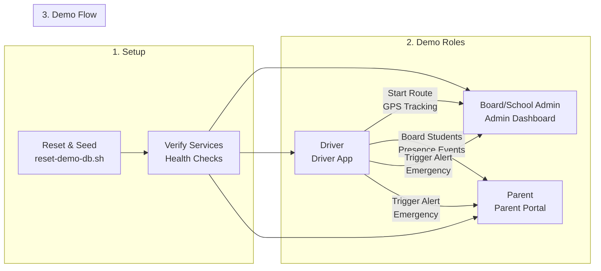
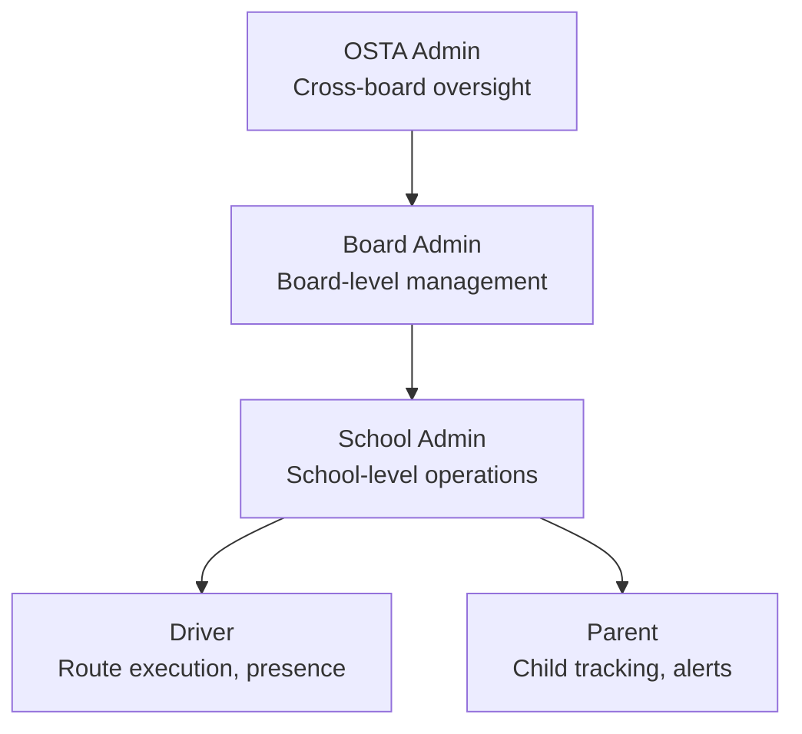
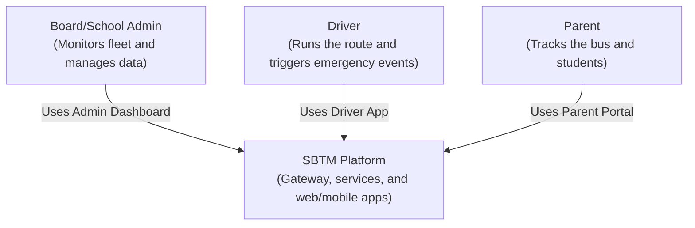
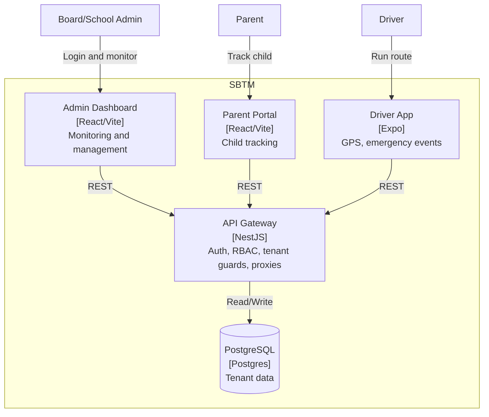

# SBTM Demo Setup Guide (All Features)

- Document owner: QA and Engineering
- Last reviewed: 2026-04-02
- Primary use: Demo environment setup, seeded data, and operator runbook

This guide is for new developers and QA team members. It walks you through a full, end-to-end demo story that covers Board Admin, School Admin, Driver, and Parent roles. It includes one-command setup, seeded data, and workarounds for features that are not implemented yet.

This document is the operational setup guide for demos. For current capability gaps, limitations, and phase sequencing, use `docs/prd/GapAnalysis.md` and `docs/prd/PhaseWiseImplementationPlan.md`. For v4 business gap analysis and upgrade plan, see `docs/prd/v4/GapAnalysis.md`.

## Related Documents

- [LiveDemoScript.md](LiveDemoScript.md)
- [QUICK_REFERENCE.md](QUICK_REFERENCE.md)
- [GapAnalysis.md](../prd/GapAnalysis.md)
- [PhaseWiseImplementationPlan.md](../prd/PhaseWiseImplementationPlan.md)
- [TestingGuide.md](../Test/TestingGuide.md)
- [v4 Gap Analysis](../prd/v4/GapAnalysis.md)
- [v4 Roles and Workflows](../prd/v4/RolesAndWorkflows.md)
- [v4 Alert Strategy](../prd/v4/AlertStrategy.md)

If you need a shorter walkthrough, use [LiveDemoScript.md](LiveDemoScript.md).

## Visual Overview

The C4 diagrams below replace the previous SVG images and show the demo-relevant system context and container architecture.

### Demo Flow



### Roles Map



### C4 Diagram (Demo Context)





## 1. Demo Setup - Complete Reset (Recommended)

This is the **primary recommended approach** for setting up the demo environment. It ensures a clean, consistent state every time.

### Reset and Seed

```bash
# From repo root - this will reset everything
./scripts/reset-demo-db.sh
```

This command will:

1. Stop all containers and delete volumes (`docker compose down -v`)
2. Rebuild and start all services (`docker compose up -d --build`)
3. Seed demo data (users, routes, vehicles, students, GPS history)
4. Run verification checks to ensure everything works

**Optional flags:**

- `--no-build` - Skip Docker rebuild (faster if images are up to date)
- `--skip-verify` - Skip verification step (not recommended)

### Verification After Setup

Check that everything is working:

```bash
./scripts/verify-demo.sh
```

This will verify:

- Database tables and seeded data
- User login credentials
- API endpoint authorization (including live location and student presence)

## 2. Demo Credentials (Seeded)

All demo users use password **Admin123!**

**Admin users:**

- OSTA Admin: `osta.admin@sbtm.demo`
- School Admin (Greenfield Elementary): `school.admin@sbtm.demo`
- School Admin (Riverside Academy): `school2.admin@sbtm.demo`

**Live drivers (4 — install Driver app on phone for real GPS):**

- `driver1@sbtm.demo` → ROUTE-R01, BUS-01 (Greenfield Elementary)
- `driver2@sbtm.demo` → ROUTE-R02, BUS-02 (Greenfield Elementary)
- `driver11@sbtm.demo` → ROUTE-R11, BUS-11 (Riverside Academy)
- `driver12@sbtm.demo` → ROUTE-R12, BUS-12 (Riverside Academy)

These 4 routes are highlighted on the admin dashboard with a **gold pulsing border**.

**All drivers:** driver1–driver20@sbtm.demo (all 20 exist in DB)

**Parents (10 logins, tracking 15 kids):**

- `parent1@sbtm.demo` → kids on ROUTE-R01, ROUTE-R02
- `parent2@sbtm.demo` → kids on ROUTE-R01, ROUTE-R03
- `parent3@sbtm.demo` → kids on ROUTE-R11, ROUTE-R12
- `parent4@sbtm.demo` – `parent10@sbtm.demo` → various routes

If login fails, run the seeding script again and use the password printed by the script.

## 3. Access the Demo Apps Started by Docker Compose

`docker compose up -d --build` already starts these web apps and backend services in containers.

### Admin Dashboard

- URL: http://localhost:5173

### Parent Portal

- URL: http://localhost:5174

### Optional Local Frontend Development (instead of Docker app containers)

Use this only when you are actively developing UI locally:

```bash
# Admin Dashboard
cd apps/admin-dashboard
npm install
npm run dev

# Parent Portal (new terminal)
cd apps/parent-app/web
npm install
npm run dev
```

Set `VITE_API_URL` to `http://localhost:3001` for both.

### Driver App (Expo)

```bash
cd apps/driver-app
npm install
npx expo start
```

- Set EXPO_PUBLIC_API_URL to http://<your-ip>:3001/api/v1 on physical devices.
- Android emulator default: http://10.0.2.2:3001/api/v1

## 4. Run the Demo Simulator (GPS + Alerts + Route Events)

After services are up and data is seeded, run the simulator to generate live GPS movement, emergency alerts, late notices, and route start/complete entries.

```bash
# From repo root
./scripts/simulate-demo.sh --interval 5 --laps 3
```

To customize routes and waypoints without editing the script, update:

- [scripts/demo-gps-track.json](../../scripts/demo-gps-track.json)

The simulator loads this file automatically when present. Each route entry should align with seeded IDs (ROUTE-R01, BUS-01, driver1@sbtm.demo, etc.).
The file supports multiple named tracks under `tracks`. Pick one with `--track-name ottawa-full`.
To use a different file, pass `--track-config <path>`.

The simulator validates route, vehicle, driver, and student IDs against seeded demo data. Use `--strict-seed-validation` to fail fast if any IDs are out of sync.

What this does:

- Emits GPS updates for all 20 routes (BUS-01 through BUS-20) along Ottawa streets.
- Sends a PANIC alert periodically.
- Sends a late notice as an "OTHER" alert (workaround for missing delay endpoint).
- Logs ROUTE_STARTED and ROUTE_COMPLETED entries to Compliance Audit (Admin Dashboard > Compliance > Audit).

You can tune the pacing:

- Increase `--interval` for slower movement.
- Increase `--laps` for longer demos.
- Use `--no-emergency` or `--no-late` to mute those events.

**Troubleshooting:**

- If you see "GPS failed" errors: Check that API Gateway is running (`docker ps`)
- If maps don't update: Check browser console for 403 errors (authentication issue)
- If GPS posts succeed but maps are empty: Run `./scripts/verify-demo.sh` to check authorization

## 5. Demo Story (End-to-End Use Cases)

This story demonstrates the main use cases for Board Admin, School Admin, Driver, and Parent.

### Step A: Board Admin View (Monitoring)

1. Log in to the Admin Dashboard as osta.admin@sbtm.demo.
2. Open the Dashboard page to view live alerts and fleet status.
3. Open Students and Compliance pages to show tenant-scoped lists.

Workaround (Board/School management UI is not implemented):

- Use API calls to create a board and school to narrate the flow.

```bash
# Login to get a token
curl -X POST http://localhost:3001/api/v1/auth/login \
  -H "Content-Type: application/json" \
  -d '{"email":"osta.admin@sbtm.demo","password":"Admin123!"}'

# Use the accessToken in these calls
curl -X POST http://localhost:3001/api/v1/boards \
  -H "Authorization: Bearer <token>" \
  -H "Content-Type: application/json" \
  -d '{"name":"Demo Board"}'

curl -X POST http://localhost:3001/api/v1/schools \
  -H "Authorization: Bearer <token>" \
  -H "Content-Type: application/json" \
  -d '{"name":"Demo School","boardId":"<board-id>"}'
```

Narration tip: Explain that Board Admin would see system-wide metrics, while School Admin sees only a single school slice. The API already enforces tenant scope through school_id.

### Step B: School Admin Actions (Operations)

1. In the Admin Dashboard, open Routes and Vehicles.
2. Show a seeded route (ROUTE-R01 — Bank Street South) and associated bus (BUS-01).
3. Show Students list for the school (500 students across 20 routes).

Role switch for demo:

- Use `osta.admin@sbtm.demo` for OSTA view.
- Use `school.admin@sbtm.demo` for School view.

### Step C: Driver Operations (Route + GPS + Emergency)

1. Open Driver App and log in as driver1@sbtm.demo.
2. Select the schedule and start tracking.
3. Trigger the panic button to create an emergency event.

If no device GPS is available, simulate GPS from your terminal:

```bash
curl -X POST http://localhost:3001/api/v1/routes/locations \
  -H "Authorization: Bearer <driver-token>" \
  -H "Content-Type: application/json" \
  -d '{"vehicleId":"BUS-01","routeId":"ROUTE-R01","timestamp":"2026-02-11T08:00:00Z","lat":45.3735,"lng":-75.6740}'
```

### Step D: Parent Tracking (Live Location)

1. Open the Parent Portal and log in as parent1@sbtm.demo.
2. Select a child and open the live map view.
3. The map polls the gateway for /routes/:routeId/live-location.

If the bus location does not move, repeat the GPS curl above with updated coordinates.

### Step E: Student Presence (Manual Event)

Presence tags are optional in this demo. Use a manual event to simulate a student boarding:

```bash
curl -X POST http://localhost:3001/api/v1/student-presence-events \
  -H "Authorization: Bearer <driver-token>" \
  -H "Content-Type: application/json" \
  -d '{"studentId":"STUDENT-001","vehicleId":"BUS-01","routeId":"ROUTE-R01","eventType":"BOARD","timestamp":"2026-02-11T08:05:00Z","source":"MANUAL"}'
```

### Step F: Video Event (Admin Review)

```bash
curl -X POST http://localhost:3001/api/v1/video-events \
  -H "Authorization: Bearer <token>" \
  -H "Content-Type: application/json" \
  -d '{"routeId":"ROUTE-R01","vehicleId":"BUS-01","driverId":"driver-001","eventType":"INCIDENT","timestamp":"2026-02-11T08:10:00Z","durationSeconds":30}'
```

Then open the Videos page in the Admin Dashboard.

## 6. Workarounds and Narration (If Features Are Missing)

- Board/School management UI: use the API calls above and narrate the UI that will consume them.
- Route optimization: explain that the API returns a placeholder polyline and will be wired to map providers later.
- Parent notifications: the simulator uses an alert event type of OTHER to represent a delay. v4 will add push/SMS/email notification delivery to parents (see [v4 Alert Strategy](../prd/v4/AlertStrategy.md)).
- Video playback: show the event list and narrate how playback will be streamed from the Video Service.
- Alert confirmation: currently alerts broadcast immediately without admin confirmation. v4 will add School Admin confirmation workflow with 2-minute timeout before parent delivery (see [v4 Alert Strategy](../prd/v4/AlertStrategy.md)).
- Fleet assignment: currently vehicles are assigned directly. v4 will add OSTA proposal -> School Admin confirmation workflow (see [v4 Roles and Workflows](../prd/v4/RolesAndWorkflows.md)).
- Pre-trip inspection: inspections exist as records but do not block route start. v4 will enforce pre-trip inspection completion before route start.
- Absence reporting: parent can report absence in the portal but driver's roster does not reflect it yet. v4 will integrate absence into the driver roster.
- Student boarding notifications: presence events are captured but no push notification is sent to parents yet. v4 will add the presence-to-notification pipeline.

## 7. Alert Governance Demo (Phase B — Implemented)

The simulation script (`singlebus-simulate.sh`) now demonstrates the full Phase B alert governance workflow during the PM route:

### Alert Schedule During PM Route

| Route % | Event Type      | Tier   | Governance Action                                         |
| ------- | --------------- | ------ | --------------------------------------------------------- |
| 10%     | LATE_DEPARTURE  | Tier 2 | Auto-resolved at 25% (admin-only, no parent notification) |
| 15%     | MEDICAL         | Tier 1 | Marked as False Alarm at 25% (no parent notification)     |
| 20%     | LATE_ARRIVAL    | Tier 2 | Auto-resolved at 30% (admin-only)                         |
| 40%     | ROUTE_DEVIATION | Tier 2 | Auto-resolved at 50% (admin-only)                         |
| 60%     | PANIC_BUTTON    | Tier 1 | School Admin confirms at 70% → parents notified           |
| 80%     | INCIDENT        | Tier 1 | School Admin confirms at 90% → parents notified           |

### Scene G: Alert Governance Workflow (Live)

1. Start the simulation: `cd scripts && bash singlebus-simulate.sh`
2. Open Admin Dashboard at http://localhost:5173 (login: `school.admin@sbtm.demo` / `Admin123!`)
3. Navigate to **Alerts** page — observe tier filter tabs: Safety (Tier 1) / Operational (Tier 2) / All
4. At ~10% route progress: LATE_DEPARTURE appears as Tier 2 (amber badge), no confirmation needed
5. At ~15% route progress: MEDICAL appears as Tier 1 with **PENDING_CONFIRMATION** (pulsing yellow) — click to see confirmation modal with 2-min countdown
6. Simulation auto-marks MEDICAL as **False Alarm** — observe status change, no parent notification sent
7. At ~60%: PANIC_BUTTON appears as Tier 1 PENDING_CONFIRMATION — simulation confirms it → status changes to **CONFIRMED**, parents receive notification
8. Navigate to **Operational** (sidebar) — shows only Tier 2 alerts (LATE_DEPARTURE, LATE_ARRIVAL, ROUTE_DEVIATION)

### Verification

After simulation completes:

```bash
bash scripts/verify-demo.sh
```

Check the output for:

- **Alert counts by tier**: Should show TIER_1 and TIER_2 alerts
- **Alert counts by status**: Should show CONFIRMED, FALSE_ALARM, RESOLVED entries
- **Audit log summary**: Should show CREATED, PENDING_CONFIRMATION, CONFIRMED, FALSE_ALARM, RESOLVED events
- **Confirmed/False-alarm alerts**: Should show PANIC_BUTTON/INCIDENT as CONFIRMED, MEDICAL as FALSE_ALARM

SQL verification:

```bash
docker exec -i sbtm_antigravity-postgres-1 psql -U postgres -d sbms < scripts/verify.sql
```

## 8. v4 Demo Additions (When Available)

When remaining v4 features are implemented, extend the demo with these scenes:

1. Login as OSTA Admin.
2. Show fleet pool with unassigned vehicles (imported from OSTA fleet DB).
3. OSTA proposes vehicle assignment to school and route.
4. Login as School Admin shows pending assignment for review.
5. School Admin accepts -> vehicle assigned, driver notified.

### Scene I: Bulk Route Import

1. Login as School Admin.
2. Upload Excel with route data.
3. Show validation report with geocoded addresses.
4. Preview routes on map with OSRM polylines.
5. Confirm import.

### Scene J: Student SIS Import

1. Login as School Admin.
2. Upload SIS export CSV.
3. Show preview: new, updated, and flagged students.
4. Confirm import -> students created with route assignments.
5. Show parent invitation emails generated.

## 7. Scope Boundaries

- Keep this guide focused on environment setup, seeded data, simulator usage, and demo execution.
- Do not treat this guide as the authoritative source for product completeness or upgrade status.
- When demoing a missing or partially implemented feature, point back to `docs/prd/GapAnalysis.md` for the verified limitation.
- BLE tags: use manual presence events for now; BLE scanning can be narrated.

## 7. Validation and QA Checks

Use these checks to confirm everything is working with real data:

- API health: http://localhost:3001/api/v1/health
- Admin Dashboard live alerts after panic event
- Parent map updates after GPS posts
- Students list appears under Admin Dashboard
- Compliance list and inspections from gateway endpoints
- Run seed verification script: `./scripts/verify-demo.sh`

## 8. Reference Links

- [docs/Implementation/Module-8-ApiGateway.md](../Implementation/Module-8-ApiGateway.md)
- [docs/Implementation/Module-7-AdminDashboard.md](../Implementation/Module-7-AdminDashboard.md)
- [docs/Implementation/Module-3-DriverApp.md](../Implementation/Module-3-DriverApp.md)
- [docs/Implementation/Module-2-ParentApp.md](../Implementation/Module-2-ParentApp.md)
- [docs/Implementation/Module-6-StudentPresence.md](../Implementation/Module-6-StudentPresence.md)
- [docs/Demo/LiveDemoScript.md](LiveDemoScript.md)
- [docs/prd/v4/GapAnalysis.md](../prd/v4/GapAnalysis.md)
- [docs/prd/v4/RolesAndWorkflows.md](../prd/v4/RolesAndWorkflows.md)
- [docs/prd/v4/AlertStrategy.md](../prd/v4/AlertStrategy.md)
- [docs/prd/v4/ProductionRolloutGuide.md](../prd/v4/ProductionRolloutGuide.md)
