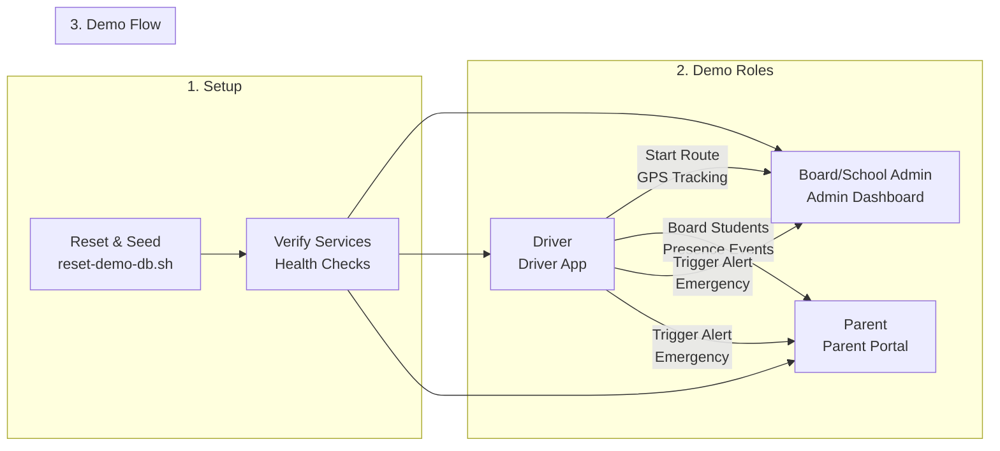
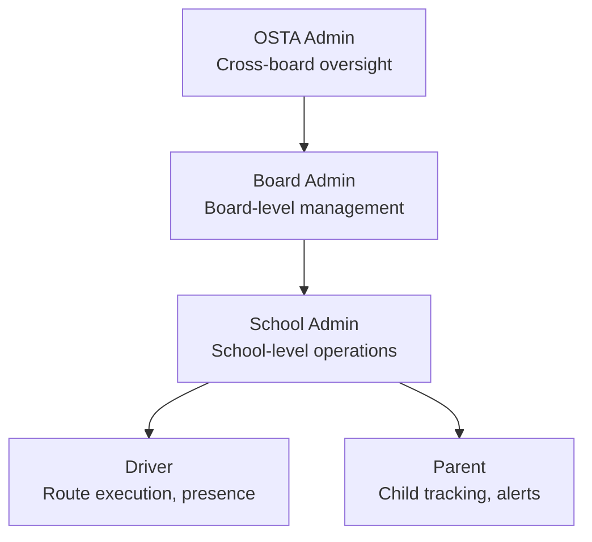

# Demo - Complete Reference

## Table of Contents

- [DEMO_SETUP_GUIDE](#demo-setup-guide)
- [LiveDemoScript](#livedemoscript)
- [QUICK_REFERENCE](#quick-reference)

---

## DEMO_SETUP_GUIDE

_Source: `docs/Demo/DEMO_SETUP_GUIDE.md`_

# SBTM Demo Setup Guide (6-School Real-World Demo)

- Document owner: QA and Engineering
- Last reviewed: 2026-04-12
- Primary use: Demo environment setup, seeded data, and operator runbook

This guide is for new developers and QA team members. It walks you through a full, end-to-end demo story that covers OSTA Admin, Board Admin, School Admin, Driver, and Parent roles across 6 Ottawa schools, 2 school boards (OCSB, OCDSB). Drivers use the real Driver App on their phones with actual GPS -- no simulation needed.

This document is the operational setup guide for demos. For current capability gaps, limitations, and phase sequencing, use `docs/prd/GapAnalysis.md` and `docs/prd/PhaseWiseImplementationPlan.md`. For v4 business gap analysis and upgrade plan, see `docs/prd/v4/GapAnalysis.md`.

## Related Documents

- [LiveDemoScript.md](LiveDemoScript.md)
- [QUICK_REFERENCE.md](QUICK_REFERENCE.md)
- [Real Phone Deployment Guide](../Operations/RealPhoneDeploymentGuide.md) -- deploy on a real phone and drive a route
- [GapAnalysis.md](../prd/v4/GapAnalysis.md)
- [PhaseWiseImplementationPlan.md](../prd/v1/PhaseWiseImplementationPlan.md)
- [TestingGuide.md](../Test/TestingGuide.md)
- [v4 Gap Analysis](../prd/v4/GapAnalysis.md)
- [v4 Roles and Workflows](../prd/v4/RolesAndWorkflows.md)
- [v4 Alert Strategy](../prd/v4/AlertStrategy.md)

If you need a shorter walkthrough, use [LiveDemoScript.md](LiveDemoScript.md).

## Visual Overview

### Demo Flow



### Roles Map



## 1. Demo Setup - Complete Reset (Recommended)

This is the **primary recommended approach** for setting up the demo environment. It ensures a clean, consistent state every time.

### Reset and Seed

```bash
# From repo root - this will reset everything
./scripts/reset-demo-db.sh
```

This command will:

1. Stop all containers and delete volumes (`docker compose down -v`)
2. Rebuild and start all services (`docker compose up -d --build`)
3. Seed demo data via 3-stage init: schema, standard seed (boards + system admins), demo seed (6 schools, routes, students, parents)
4. Run verification checks to ensure everything works

**Optional flags:**

- `--no-build` - Skip Docker rebuild (faster if images are up to date)
- `--skip-verify` - Skip verification step (not recommended)

### Regenerating Route Data (Optional)

If you need to regenerate the demo routes with OSRM-aligned polylines:

```bash
npx tsx scripts/generate-demo-routes.ts           # Full generation (needs OSRM at localhost:5000)
npx tsx scripts/generate-demo-routes.ts --from-cache  # SQL-only from cached JSON (no OSRM needed)
```

### Verification After Setup

```bash
./scripts/verify-demo.sh
```

This will verify:

- Database tables and seeded data (2 boards, 6 schools, 60 routes, 90 students)
- User login credentials across all roles
- API endpoint authorization (including live location, driver schedule, parent children)

## 2. Demo Credentials (Seeded)

All demo users use password **Admin123!**

### System Admins

| Role              | Email                   | Notes                 |
| ----------------- | ----------------------- | --------------------- |
| Super Admin       | `super.admin@sbtm.demo` | System-wide access    |
| OSTA Admin        | `osta.admin@sbtm.demo`  | Cross-board oversight |
| OCDSB Board Admin | `ocdsb.admin@sbtm.demo` | OCDSB board scope     |
| OCSB Board Admin  | `ocsb.admin@sbtm.demo`  | OCSB board scope      |

### Per-School Users (6 schools)

Each school has 1 School Admin, 1 Driver, 1 Bus, 5 AM routes + 5 PM routes, 15 students, and 10 parents.

| School                  | Board | School Admin              | Driver                     | Bus            |
| ----------------------- | ----- | ------------------------- | -------------------------- | -------------- |
| St. Bernadette (STBERN) | OCSB  | `admin.stbern@sbtm.demo`  | `driver.stbern@sbtm.demo`  | BUS-STBERN-01  |
| All Saints (ALLSNT)     | OCSB  | `admin.allsnt@sbtm.demo`  | `driver.allsnt@sbtm.demo`  | BUS-ALLSNT-01  |
| Sacred Heart (SACRHRT)  | OCSB  | `admin.sacrhrt@sbtm.demo` | `driver.sacrhrt@sbtm.demo` | BUS-SACRHRT-01 |
| John Young (JYOUNG)     | OCDSB | `admin.jyoung@sbtm.demo`  | `driver.jyoung@sbtm.demo`  | BUS-JYOUNG-01  |
| Maplewood (MPLWD)       | OCDSB | `admin.mplwd@sbtm.demo`   | `driver.mplwd@sbtm.demo`   | BUS-MPLWD-01   |
| A.Y. Jackson (AYJACK)   | OCDSB | `admin.ayjack@sbtm.demo`  | `driver.ayjack@sbtm.demo`  | BUS-AYJACK-01  |

**Parents:** `parent1.{abbrev}@sbtm.demo` through `parent10.{abbrev}@sbtm.demo` (60 parents total)

**Route IDs:** `ROUTE-{ABBREV}-R01-AM` through `ROUTE-{ABBREV}-R05-PM` (10 routes per school, 60 total)

### Quick Start: Demo a Single School

For a focused demo, use St. Bernadette as the primary school:

1. Admin Dashboard: log in as `admin.stbern@sbtm.demo`
2. Driver App: log in as `driver.stbern@sbtm.demo`
3. Parent Portal: log in as `parent1.stbern@sbtm.demo`

## 3. Access the Demo Apps Started by Docker Compose

`docker compose up -d --build` already starts these web apps and backend services in containers.

### Admin Dashboard

- URL: http://localhost:5173

### Parent Portal

- URL: http://localhost:5174

### Optional Local Frontend Development (instead of Docker app containers)

Use this only when you are actively developing UI locally:

```bash
# Admin Dashboard
cd apps/admin-dashboard
pnpm install
pnpm run dev

# Parent Portal (new terminal)
cd apps/parent-app/web
pnpm install
pnpm run dev
```

Set `VITE_API_URL` to `http://localhost:3001` for both.

### Driver App (Expo)

```bash
cd apps/driver-app
pnpm install
npx expo start
```

- Set EXPO_PUBLIC_API_URL to http://<your-ip>:3001/api/v1 on physical devices.
- Android emulator default: http://10.0.2.2:3001/api/v1

## 4. Running a Real-World Demo (No Simulation)

This demo is designed for real drivers using the Driver App on their phones. No GPS simulation is needed.

### Step A: OSTA/Board Admin View (Monitoring)

1. Log in to the Admin Dashboard as `osta.admin@sbtm.demo` (or board-specific: `ocdsb.admin@sbtm.demo`).
2. Open the Dashboard page to view live alerts and fleet status across all schools.
3. Open Students and Compliance pages to show tenant-scoped lists.

### Step B: School Admin Actions (Operations)

1. Log in as `admin.stbern@sbtm.demo` in Admin Dashboard.
2. Open Routes to see all 10 routes for St. Bernadette (5 AM + 5 PM).
3. Select a route to see stops rendered on the map with a school marker.

### Step C: Driver Operations (Route + GPS + Boarding)

1. Open Driver App on phone and log in as `driver.stbern@sbtm.demo`.
2. View the schedule showing all 10 assigned routes.
3. Select a route, start it -- GPS tracking begins automatically.
4. Board students at each stop using the student roster.
5. The bus appears on the Admin Dashboard map in real time.
6. Complete the route -- the bus marker disappears from the map.

### Step D: Parent Tracking (Live Location)

1. Open the Parent Portal and log in as `parent1.stbern@sbtm.demo`.
2. Select a child and open the live map view.
3. The map polls the gateway for live bus location.
4. When the driver boards the child, the parent sees the boarding event.

### Step E: Emergency Alert Demo

1. While driving, the driver triggers the panic button in the Driver App.
2. The alert appears immediately on the Admin Dashboard with PENDING_CONFIRMATION status.
3. School Admin confirms or marks as false alarm.
4. If confirmed, parents are notified.

### Step F: Multi-School View

1. Log in as `osta.admin@sbtm.demo` in Admin Dashboard.
2. Start routes at multiple schools simultaneously (have multiple phones/drivers).
3. The dashboard shows all active buses across all 6 schools.
4. Select a route to zoom into its path, stops, and school marker.

## 5. Manual GPS Simulation (Optional)

If no device GPS is available, you can simulate GPS from your terminal:

```bash
# Get a driver token
TOKEN=$(curl -sf -X POST http://localhost:3001/api/v1/auth/login \
  -H "Content-Type: application/json" \
  -d '{"email":"driver.stbern@sbtm.demo","password":"Admin123!"}' \
  | grep -oP '"accessToken"\s*:\s*"\K[^"]+')

# Start the route
curl -X POST http://localhost:3001/api/v1/routes/lifecycle \
  -H "Authorization: Bearer $TOKEN" \
  -H "Content-Type: application/json" \
  -d '{"routeId":"ROUTE-STBERN-R01-AM","vehicleId":"BUS-STBERN-01","eventType":"ROUTE_STARTED","timestamp":"'$(date -u +%Y-%m-%dT%H:%M:%SZ)'"}'

# Send GPS update
curl -X POST http://localhost:3001/api/v1/routes/locations \
  -H "Authorization: Bearer $TOKEN" \
  -H "Content-Type: application/json" \
  -d '{"vehicleId":"BUS-STBERN-01","routeId":"ROUTE-STBERN-R01-AM","timestamp":"'$(date -u +%Y-%m-%dT%H:%M:%SZ)'","lat":45.2705,"lng":-75.8849}'
```

## 6. Alert Governance Demo (Phase B)

### Alert Tier System

| Tier   | Event Types                                               | Governance                         | Parent Notification     |
| ------ | --------------------------------------------------------- | ---------------------------------- | ----------------------- |
| Tier 1 | PANIC_BUTTON, PANIC_ALERT, INCIDENT, MEDICAL              | Requires School Admin confirmation | Only after confirmation |
| Tier 2 | LATE_DEPARTURE, LATE_ARRIVAL, ROUTE_DEVIATION, COMPLIANCE | Auto-managed                       | No parent notification  |

### Alert Governance API Endpoints

| Method | Endpoint                         | Role                    | Purpose                    |
| ------ | -------------------------------- | ----------------------- | -------------------------- |
| GET    | `/api/v1/alerts`                 | Any admin               | List all alerts            |
| GET    | `/api/v1/alerts/active`          | Any admin               | List active/pending alerts |
| PATCH  | `/api/v1/alerts/:id/confirm`     | School/Board/OSTA Admin | Confirm Tier 1 alert       |
| PATCH  | `/api/v1/alerts/:id/false-alarm` | School/Board/OSTA Admin | Mark as false alarm        |
| PATCH  | `/api/v1/alerts/:id/resolve`     | School/Board/OSTA Admin | Resolve an alert           |
| GET    | `/api/v1/alerts/:id/audit-trail` | School/Board/OSTA Admin | Full lifecycle audit trail |

### Verification

After a demo run:

```bash
./scripts/verify-demo.sh
```

Check the output for alert counts by tier/status and audit log summaries.

## 7. Workarounds and Narration (If Features Are Missing)

- Board/School management UI: use API calls and narrate the UI that will consume them.
- Route optimization: routes are generated using OSRM and rendered as polylines on the map.
- Parent notifications: v4 will add push/SMS/email (see [v4 Alert Strategy](../prd/v4/AlertStrategy.md)).
- Video playback: show the event list and narrate how playback will be streamed from the Video Service.
- Fleet assignment: v4 will add OSTA proposal -> School Admin confirmation workflow.
- Pre-trip inspection: inspections exist as records but do not block route start.
- Absence reporting: parent can report absence but driver's roster does not reflect it yet.
- Student boarding notifications: presence events are captured but no push notification is sent yet.

## 8. Scope Boundaries

- Keep this guide focused on environment setup, seeded data, and demo execution.
- Do not treat this guide as the authoritative source for product completeness.
- When demoing a missing feature, point back to `docs/prd/GapAnalysis.md`.
- BLE tags: use manual presence events for now.

## 9. Validation and QA Checks

- API health: http://localhost:3001/api/v1/health
- Admin Dashboard live alerts after emergency event
- Parent map updates after GPS posts
- Students list appears under Admin Dashboard
- Run seed verification script: `./scripts/verify-demo.sh`

## 10. Reference Links

- [docs/Implementation/Module-8-ApiGateway.md](../Implementation/Module-8-ApiGateway.md)
- [docs/Implementation/Module-7-AdminDashboard.md](../Implementation/Module-7-AdminDashboard.md)
- [docs/Implementation/Module-3-DriverApp.md](../Implementation/Module-3-DriverApp.md)
- [docs/Implementation/Module-2-ParentApp.md](../Implementation/Module-2-ParentApp.md)
- [docs/Implementation/Module-6-StudentPresence.md](../Implementation/Module-6-StudentPresence.md)
- [docs/Demo/LiveDemoScript.md](LiveDemoScript.md)
- [docs/prd/v4/GapAnalysis.md](../prd/v4/GapAnalysis.md)
- [docs/prd/v4/RolesAndWorkflows.md](../prd/v4/RolesAndWorkflows.md)
- [docs/prd/v4/AlertStrategy.md](../prd/v4/AlertStrategy.md)
- [docs/prd/v4/ProductionRolloutGuide.md](../prd/v4/ProductionRolloutGuide.md)

---

## LiveDemoScript

_Source: `docs/Demo/LiveDemoScript.md`_

# SBTM Live Demo Script

- Document owner: Product, QA, and Engineering
- Last reviewed: 2026-04-06
- Primary use: Stakeholder-facing demo narrative and walkthrough script

This script is a presentation flow for stakeholders and internal walkthroughs. It is not the source of truth for implementation status. For verified current gaps and planned completion order, use `docs/prd/GapAnalysis.md` and `docs/prd/PhaseWiseImplementationPlan.md`. For v4 business enhancements, see `docs/prd/v4/GapAnalysis.md`.

## Related Documents

- [DEMO_SETUP_GUIDE.md](DEMO_SETUP_GUIDE.md)
- [QUICK_REFERENCE.md](QUICK_REFERENCE.md)
- [GapAnalysis.md](../prd/v4/GapAnalysis.md)
- [TestingGuide.md](../Test/TestingGuide.md)
- [v4 Gap Analysis](../prd/v4/GapAnalysis.md)
- [v4 Alert Strategy](../prd/v4/AlertStrategy.md)

## Demo Overview

- Duration: 30-40 minutes
- Roles: Admin, Driver, Parent
- Devices: Laptop for admin, phone for driver, browser for parent

## Preparation (5 min)

### Step 1: Reset the demo database

This ensures a clean state before the demo:

```bash
./scripts/reset-demo-db.sh
```

Wait for completion and verify all checks pass.

### Step 2: Start the simulator

Run the simulator to generate live GPS movement, emergency alerts, and presence events:

```bash
./scripts/simulate-demo.sh --interval 5 --laps 3
```

Leave this running in a separate terminal window during the demo.

## Scene 1: Admin Overview (5 min)

1. Open Admin Dashboard.
2. Log in with `osta.admin@sbtm.demo` / `Admin123!`.
3. Show dashboard metrics, alerts, routes, and videos from live gateway data.
4. Open Compliance > Audit to show route start/completion entries from the simulator.
5. (Optional) Log out and log in as `school.admin@sbtm.demo` to narrate scope differences.

## Scene 2: Driver Starts Route (7 min)

1. Open Driver App (Expo).
2. Log in with `driver1@sbtm.demo` / `Admin123!`.
3. Select the mock route and start GPS tracking.
4. Trigger panic button to send an emergency event.

## Scene 3: Parent Tracking (7 min)

1. Open Parent Portal (web).
2. Log in with `parent1@sbtm.demo` / `Admin123!`.
3. Select a child card.
4. Show live map updates via polling.

## Scene 4: Presence Events (5 min)

1. Explain how Student Presence service records BLE/manual events.
2. (Optional) Send a manual event via API gateway:

```bash
curl -X POST http://localhost:3001/api/v1/student-presence-events \
  -H "Authorization: Bearer <driver-token>" \
  -H "Content-Type: application/json" \
  -d '{"studentId":"STUDENT-001","vehicleId":"BUS-01","routeId":"ROUTE-R01","eventType":"BOARD","timestamp":"2026-02-11T08:00:00Z","source":"MANUAL"}'
```

## Scene 5: Video Events (5 min)

1. Describe how video events are created and stored in the Video Service.
2. Show the Videos page in the Admin Dashboard.

## Scene 6: Alert Governance (Phase B) (10 min)

> This scene demonstrates the Tier 1 confirmation workflow and Tier 2 operational alerts.

1. Start the single-bus simulation: `cd scripts && bash singlebus-simulate.sh`
2. Open Admin Dashboard and login as `school.admin@sbtm.demo` / `Admin123!`
3. Navigate to **Alerts** page — point out the **tier filter tabs** at the top (Safety / Operational / All)
4. When LATE_DEPARTURE appears (~10% route):
   - "This is a Tier 2 operational alert — visible to admins only, no parent notification. Click the **Operational** page in the sidebar to see only these."
5. When MEDICAL appears (~15% route) with PENDING_CONFIRMATION status:
   - "This is a Tier 1 safety alert. The pulsing yellow badge means it's awaiting School Admin confirmation."
   - Click the alert to see the **Confirmation Modal** with the 2-minute countdown timer
   - "The admin has 2 minutes to confirm, mark as false alarm, or request more info. If they don't act, the system auto-escalates."
   - The simulation marks this as **False Alarm** — point out that parents were NOT notified
6. When PANIC_BUTTON appears (~60% route):
   - "Another Tier 1 alert — this time the School Admin confirms it."
   - The simulation confirms → show status changing to **CONFIRMED** and explain parents are now notified
7. Show the audit trail: "Every action — creation, confirmation, false alarm — is logged in the audit trail for compliance."

## Scene 7: Role Boundaries and Phase C Workflows (10 min)

> This scene demonstrates role-based sidebar, fleet assignment, and absence confirmation.

### Role-Based Sidebar

1. Log in as `super.admin@sbtm.demo` / `Admin123!` — show that all navigation items are visible
2. Log out, log in as `board.admin@sbtm.demo` / `Admin123!` — show limited sidebar (schools, students, alerts, compliance — no boards management)
3. Log out, log in as `school.admin@sbtm.demo` / `Admin123!` — show school-level sidebar (students, routes, alerts, absences, fleet assignments)
4. "Each role sees only the pages relevant to their responsibilities."

### Fleet Assignment Workflow

1. Log in as `osta.admin@sbtm.demo` / `Admin123!`
2. Navigate to **Fleet Assignments** page
3. Click "Create Proposal" — fill in school, route (AM), vehicle (BUS-01), driver, effective date
4. "OSTA proposes assignments. School admins must review and accept."
5. Log out, log in as `school.admin@sbtm.demo`
6. Navigate to **Fleet Assignments** — show the pending proposal with PROPOSED status
7. Click "Accept" — show status changes to ACCEPTED
8. (Optional) Click "Download PDF" to show the generated fleet assignment agreement

### Absence Confirmation Workflow

1. Log in as `parent1@sbtm.demo` in the Parent Portal
2. Report an absence for Alice Smith (PM, family appointment)
3. Switch to Admin Dashboard as `school.admin@sbtm.demo`
4. Navigate to **Absences** page — show the pending absence with PENDING badge
5. Click "Confirm" — show status changes to CONFIRMED
6. "Confirmed absences automatically update the driver's roster, so Alice won't be expected at the PM stop."

> Note: The single-bus simulation (`singlebus-simulate.sh`) runs both these workflows automatically.

## Wrap-up

- Highlight that backend services are live and the frontend apps use gateway APIs.
- Alert governance ensures safety-critical alerts are verified before reaching parents.
- Run `./scripts/verify-demo.sh` to validate seeded data, logins, and audit trail after setup.

### Forward-Looking Narration Points (v4)

When presenting to stakeholders, use these talking points to describe upcoming capabilities:

- **Parent Notifications**: "In the next release, parents will receive push notifications the moment their child boards or alights the bus. Emergency alerts will also be delivered via SMS as a fallback."
- **Alert Governance**: "Already implemented — Tier 1 alerts go through confirmation. Tier 2 alerts are admin-only. Auto-escalation at 2/5/15 minute thresholds."
- **Fleet Assignment**: "Already implemented — OSTA proposes vehicle assignments, School Admins review and accept or reject with comments, generating printable PDF agreements."
- **Absence Confirmation**: "Already implemented — Parents report absences, School Admins confirm or reject, and the driver's roster is automatically updated."
- **Role-Based Dashboard**: "Already implemented — sidebar navigation adapts to each user's role. Super Admin and OSTA Admin see everything; Board Admin and School Admin see only their relevant pages."
- **SIS Integration**: "Student data will sync from existing school board information systems, eliminating the need for duplicate data entry."
- **Bulk Route Import**: "Schools with hundreds of existing routes in Excel can import them in bulk, with automatic geocoding and OSRM road-following polyline generation."
- **Pre-Trip Inspection**: "Drivers will complete a mandatory inspection checklist before starting their route. Failed inspections block route start and alert the school admin."

See [v4 Upgrade Plan](../prd/v4/UpgradePlan.md) for the full delivery roadmap.

## Troubleshooting During Demo

### Maps Not Showing Bus Movement

- **Symptoms:** Map displays but no bus markers appear
- **Check:** Browser console (F12) for 403 Forbidden errors
- **Fix:** Re-run `./scripts/reset-demo-db.sh` to reset authorization data

### Emergency Alerts Not Appearing

- **Symptoms:** Simulator shows "Emergency PANIC alert sent" but Admin Dashboard doesn't show it
- **Check:** Verify simulator lap is divisible by EmergencyEvery parameter (default: every 3rd lap)
- **Fix:** Manually refresh Admin Dashboard page

### Parent Portal Shows "Offline"

- **Symptoms:** Portal shows "No active route" or "Offline" status
- **Check:** Verify simulator is running and shows green "BUS-01: Start" messages
- **Check:** Console for 403 errors on /routes/:routeId/live-location
- **Fix:** Verify parent user has childRouteIds populated (run verify-demo.sh)

---

## QUICK_REFERENCE

_Source: `docs/Demo/QUICK_REFERENCE.md`_

# Demo Quick Reference

- Document owner: QA and Engineering
- Last reviewed: 2026-04-12
- Primary use: Fast operational checklist for demo setup and troubleshooting

This is the fast operational companion to `DEMO_SETUP_GUIDE.md`. For feature gaps or upgrade status, use `docs/prd/GapAnalysis.md`.

## Related Documents

- [DEMO_SETUP_GUIDE.md](DEMO_SETUP_GUIDE.md)
- [LiveDemoScript.md](LiveDemoScript.md)
- [GapAnalysis.md](../prd/v4/GapAnalysis.md)
- [TestingGuide.md](../Test/TestingGuide.md)

## Fast Commands

### Complete Reset (Most Common)

```bash
./scripts/reset-demo-db.sh
```

### Verify Setup

```bash
./scripts/verify-demo.sh
```

### Regenerate Route Data (Optional)

```bash
npx tsx scripts/generate-demo-routes.ts --from-cache   # SQL from cached JSON (no OSRM)
npx tsx scripts/generate-demo-routes.ts                 # Full generation (needs OSRM)
```

## Demo Credentials

All passwords: **Admin123!**

### System Admins

| Role              | Email                   | Notes                 |
| ----------------- | ----------------------- | --------------------- |
| Super Admin       | `super.admin@sbtm.demo` | System-wide access    |
| OSTA Admin        | `osta.admin@sbtm.demo`  | Cross-board oversight |
| OCDSB Board Admin | `ocdsb.admin@sbtm.demo` | OCDSB board scope     |
| OCSB Board Admin  | `ocsb.admin@sbtm.demo`  | OCSB board scope      |

### Per-School Users

| School (Abbrev)         | Board | School Admin              | Driver                     | Bus            |
| ----------------------- | ----- | ------------------------- | -------------------------- | -------------- |
| St. Bernadette (STBERN) | OCSB  | `admin.stbern@sbtm.demo`  | `driver.stbern@sbtm.demo`  | BUS-STBERN-01  |
| All Saints (ALLSNT)     | OCSB  | `admin.allsnt@sbtm.demo`  | `driver.allsnt@sbtm.demo`  | BUS-ALLSNT-01  |
| Sacred Heart (SACRHRT)  | OCSB  | `admin.sacrhrt@sbtm.demo` | `driver.sacrhrt@sbtm.demo` | BUS-SACRHRT-01 |
| John Young (JYOUNG)     | OCDSB | `admin.jyoung@sbtm.demo`  | `driver.jyoung@sbtm.demo`  | BUS-JYOUNG-01  |
| Maplewood (MPLWD)       | OCDSB | `admin.mplwd@sbtm.demo`   | `driver.mplwd@sbtm.demo`   | BUS-MPLWD-01   |
| A.Y. Jackson (AYJACK)   | OCDSB | `admin.ayjack@sbtm.demo`  | `driver.ayjack@sbtm.demo`  | BUS-AYJACK-01  |

**Parents:** `parent1.{abbrev}@sbtm.demo` -- `parent10.{abbrev}@sbtm.demo` (60 total)

### Quick Start (Single School Demo)

- Admin: `admin.stbern@sbtm.demo`
- Driver: `driver.stbern@sbtm.demo`
- Parent: `parent1.stbern@sbtm.demo`

## Route IDs

Pattern: `ROUTE-{ABBREV}-R{01-05}-{AM|PM}`

Example routes for St. Bernadette:

- `ROUTE-STBERN-R01-AM` through `ROUTE-STBERN-R05-AM` (morning)
- `ROUTE-STBERN-R01-PM` through `ROUTE-STBERN-R05-PM` (afternoon)

**Total: 60 routes** (10 per school x 6 schools)

## Portal URLs (Docker)

- Admin Dashboard: http://localhost:5173
- Parent Portal: http://localhost:5174
- API Gateway: http://localhost:3001

## Seeded Demo Data

### Schools (6)

| School                             | Board | Location          |
| ---------------------------------- | ----- | ----------------- |
| St. Bernadette Catholic Elementary | OCSB  | 45.2705, -75.8849 |
| All Saints High School             | OCSB  | 45.3219, -75.9251 |
| Sacred Heart Catholic High School  | OCSB  | 45.2642, -75.9103 |
| John Young Elementary School       | OCDSB | 45.2900, -75.8841 |
| Maplewood Secondary School         | OCDSB | 45.2674, -75.8914 |
| A.Y. Jackson S.S.                  | OCDSB | 45.2953, -75.8795 |

### Per School

- 1 school admin, 1 driver, 1 bus
- 5 AM routes + 5 PM routes (10 total), ~5-8 stops per route
- 15 students, 10 parents

### Totals

- 2 boards, 6 schools, 6 drivers, 6 buses
- 60 routes, ~300-400 stops
- 90 students, 60 parents

## Common Issues

### API Gateway Not Reachable During Reset

**Cause:** Services need time to start after reset
**Fix:** The reset script waits up to 90 seconds. If it still fails:

```bash
docker compose ps
docker compose logs api-gateway
docker compose down -v && docker compose up -d --build
```

### 403 Forbidden on Maps

**Cause:** Missing childRouteIds for parent users
**Fix:** Re-run `./scripts/reset-demo-db.sh`

### Maps Empty Despite Driver Running

**Cause:** Route not started via lifecycle event
**Check:** Ensure driver tapped "Start Route" in the Driver App

### Docker Containers Not Starting

**Cause:** Port conflicts or stale volumes
**Fix:** `docker compose down -v` then `docker compose up -d --build`

## Quick Health Checks

```bash
# All containers running
docker ps

# API Gateway health
curl http://localhost:3001/api/v1/health

# Route reference count (expect 60)
docker exec sbtm-postgres-1 psql -U postgres -d sbms -c "SELECT COUNT(*) FROM routes_reference;"

# Student count (expect 90)
docker exec sbtm-postgres-1 psql -U postgres -d sbms -c "SELECT COUNT(*) FROM students_reference;"

# Parent route assignments
docker exec sbtm-postgres-1 psql -U postgres -d sbms -c "SELECT email, \"childRouteIds\" FROM users WHERE role = 'PARENT' LIMIT 10;"
```

## Alert Governance API Endpoints (Phase B)

| Method | Endpoint                         | Role                    | Purpose                    |
| ------ | -------------------------------- | ----------------------- | -------------------------- |
| GET    | `/api/v1/alerts`                 | Any admin               | List all alerts            |
| GET    | `/api/v1/alerts/active`          | Any admin               | List active/pending alerts |
| PATCH  | `/api/v1/alerts/:id/confirm`     | School/Board/OSTA Admin | Confirm Tier 1 alert       |
| PATCH  | `/api/v1/alerts/:id/false-alarm` | School/Board/OSTA Admin | Mark as false alarm        |
| PATCH  | `/api/v1/alerts/:id/resolve`     | School/Board/OSTA Admin | Resolve an alert           |
| GET    | `/api/v1/alerts/:id/audit-trail` | School/Board/OSTA Admin | Full lifecycle audit trail |

## For More Details

- Full setup guide: [DEMO_SETUP_GUIDE.md](DEMO_SETUP_GUIDE.md)
- Live demo script: [LiveDemoScript.md](LiveDemoScript.md)
- Implementation docs: [docs/Implementation/](../Implementation/)
