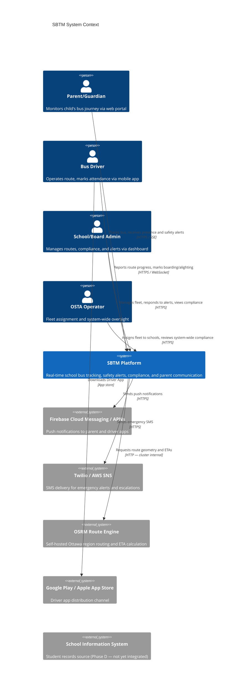
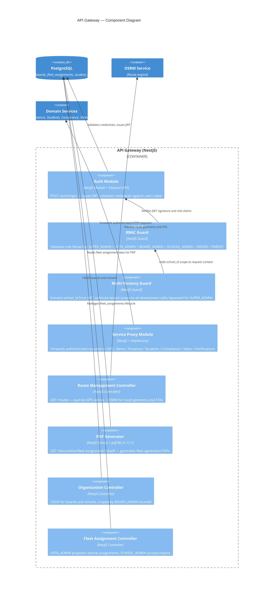
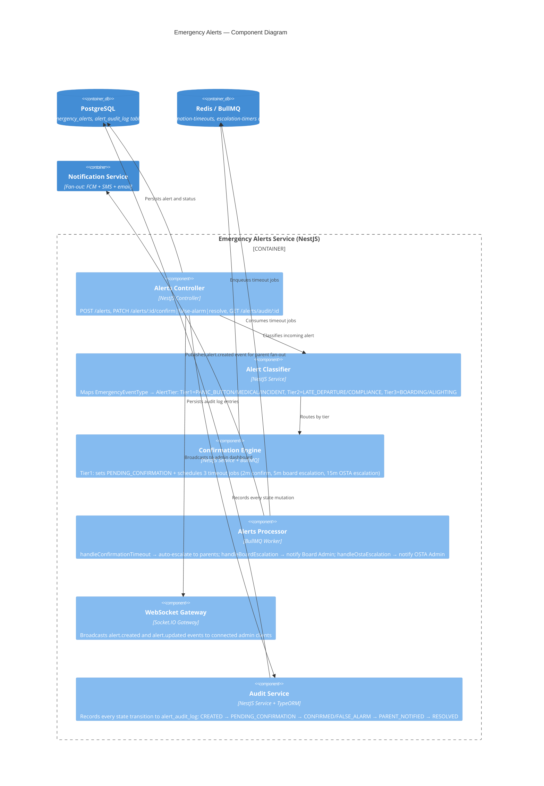

# SBTM Azure Architecture

- Document owner: Engineering and Architecture
- Last reviewed: 2026-04-21
- Audience: Solution architects, DevOps engineers, security reviewers

## Overview

SBTM is deployed on Azure Kubernetes Service (AKS) using managed PaaS for stateful services (PostgreSQL, Redis, Blob Storage). The Kubernetes manifests are cloud-agnostic (Kustomize-based) and can be applied to any K8s cluster; only the Bicep provisioning layer is Azure-specific.

### Design Principles

- **AKS for compute**: Standard tier cluster with 2+ Standard_D2s_v3 nodes; scale horizontally by adding nodes.
- **Managed PaaS for state**: PostgreSQL Flexible Server (PostGIS), Azure Cache for Redis, Azure Blob Storage — no stateful workloads in-cluster except OSRM.
- **Single public entry point**: NGINX Ingress exposes only the API Gateway. Frontend apps served via Azure Static Web Apps (CDN, free tier).
- **Zero-secret images**: All secrets via Azure Key Vault + CSI driver. No secrets in env files, ConfigMaps, or image layers.
- **Cloud-agnostic K8s manifests**: `infra/k8s/` base + Kustomize overlays work on any Kubernetes distribution.

---

## C4 Diagrams

### Level 1 — System Context



### Level 2 — Container Diagram (Azure AKS Deployment)

```mermaid
C4Container
  title SBTM Container Diagram — Azure AKS

  Person(user, "Users", "Parents, Drivers, Admins, OSTA")

  System_Boundary(azure, "Azure Cloud") {
    System_Boundary(static, "Azure Static Web Apps") {
      Container(adminui, "Admin Dashboard", "React 19 + Vite + Tailwind + Leaflet", "Fleet management, alert response, compliance, and route management UI")
      Container(parentui, "Parent Portal", "React 19 + Vite + Tailwind + Leaflet", "Bus tracking, presence notifications, and safety communication UI")
    }

    System_Boundary(aks, "AKS Cluster — sbtm-aks") {
      Container(ingress, "NGINX Ingress + cert-manager", "Kubernetes Ingress Controller", "TLS termination (Let's Encrypt), public HTTPS entry point for API")
      Container(gw, "API Gateway", "NestJS v10 + TypeORM + JWT + Passport", "Authentication, RBAC, multi-tenant scoping, reverse proxy to all services")
      Container(gps, "GPS Tracking", "Express + Prisma v5 + PostGIS", "Location ingest (POST), history queries (GET), snap-to-road via OSRM")
      Container(alerts, "Emergency Alerts", "NestJS + TypeORM + BullMQ + Socket.IO", "Alert classification (Tier 1/2/3), admin confirmation, escalation chain, WebSocket broadcast")
      Container(presence, "Student Presence", "NestJS + TypeORM + BullMQ", "Board/alight state persistence, Redis cache, BullMQ event publication")
      Container(students, "Student Management", "NestJS + TypeORM", "Student enrollment, route assignment, absence reporting, bulk import")
      Container(compliance, "Compliance Management", "NestJS + TypeORM", "Driver records, pre-trip inspections, compliance expiry tracking, audit log")
      Container(video, "Video Service", "NestJS + TypeORM", "Video event metadata, Azure Blob Storage integration for uploads/downloads")
      Container(notify, "Notification Service", "NestJS + BullMQ", "Multi-channel fan-out: FCM push, email (SMTP/SES), SMS (Twilio/SNS)")
      Container(osrmapp, "OSRM", "OSRM v5.27.1", "Route optimization engine; Ottawa road data loaded from Azure Blob Storage")
    }

    System_Boundary(data, "Managed Data Services") {
      ContainerDb(pg, "PostgreSQL + PostGIS", "Azure DB for PostgreSQL Flexible Server", "All domain data; multi-tenant with school_id; private endpoint")
      ContainerDb(redis, "Redis", "Azure Cache for Redis", "BullMQ queues for event routing; Student Presence state cache; private endpoint")
      ContainerDb(blob, "Blob Storage", "Azure Blob Storage (LRS/ZRS)", "Driver videos, OSRM routing data, document exports")
    }

    Container(acr, "Container Registry", "Azure Container Registry (Basic/Standard)", "Docker images for all 8 backend services; integrated with AKS via managed identity")
    Container(kv, "Key Vault + CSI Driver", "Azure Key Vault + secrets-store-csi-driver", "JWT secret, DB credentials, FCM server key, Twilio token; mounted as pod volumes")
    Container(monitor, "Observability", "Azure Monitor + Application Insights + Log Analytics", "Pod metrics, distributed traces (OpenTelemetry), log aggregation, health alerts")
  }

  Container(driverapp, "Driver App", "React Native + Expo 54 + expo-location + react-native-ble-plx", "GPS tracking, BLE SmartTag scanning, student presence marking, emergency alerts, offline queue")

  Rel(user, adminui, "Opens browser", "HTTPS")
  Rel(user, parentui, "Opens browser", "HTTPS")
  Rel(driverapp, ingress, "API and WebSocket calls", "HTTPS / WSS")
  Rel(adminui, ingress, "API calls", "HTTPS")
  Rel(parentui, ingress, "API calls + SSE stream", "HTTPS / SSE")
  Rel(ingress, gw, "Routes to API Gateway", "HTTP")
  Rel(gw, gps, "Proxies location requests", "HTTP")
  Rel(gw, alerts, "Proxies alert requests", "HTTP / WebSocket upgrade")
  Rel(gw, presence, "Proxies presence events", "HTTP")
  Rel(gw, students, "Proxies student management", "HTTP")
  Rel(gw, compliance, "Proxies compliance requests", "HTTP")
  Rel(gw, video, "Proxies video metadata", "HTTP")
  Rel(gw, osrmapp, "Route geometry and snap-to-road", "HTTP — cluster internal")
  Rel(alerts, notify, "alert.created event", "BullMQ via Redis")
  Rel(presence, notify, "presence.boarded / presence.alighted events", "BullMQ via Redis")
  Rel(gps, pg, "Reads/writes location_events", "Prisma ORM")
  Rel(alerts, pg, "Reads/writes alerts, audit_log", "TypeORM")
  Rel(presence, pg, "Reads/writes presence_events", "TypeORM")
  Rel(presence, redis, "Caches route presence summary", "Redis GET/SET")
  Rel(students, pg, "Reads/writes students, absences", "TypeORM")
  Rel(compliance, pg, "Reads/writes driver_records, inspections", "TypeORM")
  Rel(video, pg, "Reads/writes video_events", "TypeORM")
  Rel(video, blob, "Uploads/downloads video files", "Azure Blob SDK")
  Rel(osrmapp, blob, "Loads Ottawa .osrm data on startup", "Azure Blob SDK init")
  Rel(notify, fcm, "Sends push notifications", "FCM HTTP API")
  Rel(notify, twilio, "Sends SMS for emergency alerts", "Twilio API")
```

### Level 3 — Component Diagrams

#### API Gateway — Internal Components



#### Emergency Alerts — Event Flow



---

## Azure Well-Architected Framework

### Reliability

| Control            | Implementation                                                                                    |
| ------------------ | ------------------------------------------------------------------------------------------------- |
| AKS multi-node     | 2+ nodes minimum; pod disruption budgets prevent single-node disruption from taking down services |
| Health probes      | All pods have liveness + readiness probes; unhealthy pods replaced automatically                  |
| PostgreSQL HA      | Geo-redundant backup; point-in-time restore; Zone Redundant HA for production                     |
| Redis persistence  | AOF + RDB persistence enabled on Standard tier; failover replica in production                    |
| Ingress redundancy | NGINX Ingress with 2 replicas; cert-manager handles certificate auto-renewal                      |

### Security

| Control           | Implementation                                                                             |
| ----------------- | ------------------------------------------------------------------------------------------ |
| Secrets           | Azure Key Vault + CSI driver; no secrets in ConfigMaps, env files, or images               |
| Network           | AKS VNET; private endpoints for PostgreSQL and Redis; only ingress has public IP           |
| Identity          | Azure Workload Identity for pod → Azure service auth (ACR pull, KV read, Blob write)       |
| TLS               | cert-manager + Let's Encrypt; auto-renewal; HTTP redirected to HTTPS by ingress            |
| Registry scanning | Azure Defender for Containers scans all images pushed to ACR                               |
| WAF               | Azure Front Door Standard WAF for production (OWASP rules + rate limiting)                 |
| RBAC              | AKS RBAC; separate namespaces for staging and production; least-privilege service accounts |

### Cost Optimization

| Tier       | AKS Nodes                        | PostgreSQL                     | Redis       | Est. Cost/month |
| ---------- | -------------------------------- | ------------------------------ | ----------- | --------------- |
| Demo       | 2× Standard_D2s_v3 (East US)     | B2ms, 32GB                     | Basic C0    | ~$215–235       |
| Pilot      | 2× Standard_D4s_v3               | GP_Standard_D2s_v3, 128GB      | Standard C1 | ~$450–550       |
| Production | 3–5× Standard_D4s_v3 (autoscale) | GP_Standard_D4s_v3, 256GB + HA | Standard C2 | ~$900–1,500     |

**Cost reduction options for demo:**

- Use a single Standard_D4s_v3 node (pack all services): ~$140 node cost + PaaS = ~$215/mo total
- Deploy in East US (AKS free control plane tier in select regions)
- Admin Dashboard and Parent Portal on Azure Static Web Apps (free tier) — saves ~$20/mo vs containerized hosting

### Performance Efficiency

| Concern               | Implementation                                                                               |
| --------------------- | -------------------------------------------------------------------------------------------- |
| GPS ingest            | HPA on GPS Tracking pod (scale at 70% CPU); Redis not used for GPS (Prisma + PostGIS direct) |
| Alert delivery        | BullMQ Redis queue; target ≤10s from alert.created to push delivery                          |
| Presence cache        | Redis TTL 30s for route summary; 1hr for individual student state                            |
| Static assets         | Azure Static Web Apps CDN distributes Admin Dashboard and Parent Portal globally             |
| DB connection pooling | PgBouncer sidecar or connection_limit via Prisma for GPS service                             |

### Operational Excellence

| Concern       | Implementation                                                                                                              |
| ------------- | --------------------------------------------------------------------------------------------------------------------------- |
| CI/CD         | GitHub Actions: lint → build → test → push ACR → deploy staging → manual gate → production                                  |
| GitOps        | Kustomize overlays in `infra/k8s/overlays/staging` and `production`; changes applied via `kubectl apply -k`                 |
| Observability | Azure Monitor Container Insights (pod metrics), Application Insights (traces + exceptions), Log Analytics (structured logs) |
| Alerting      | Azure Monitor alerts on pod CrashLoopBackOff, error rate spike, PostgreSQL connection exhaustion                            |
| Runbooks      | `docs/Operations/Runbooks.md` covers incident response, rollback, and backup restore procedures                             |

---

## Azure Service Configuration Reference

### AKS Cluster

```
Name: sbtm-aks
Region: East US (or Canada Central for PIPEDA)
Tier: Standard
System node pool: 1× Standard_D2s_v3 (system workloads)
App node pool: 2× Standard_D2s_v3 (autoscale 1–5)
Networking: Azure CNI
VNET: sbtm-vnet (10.0.0.0/16)
AKS subnet: 10.0.1.0/24
Services subnet: 10.0.2.0/24
Add-ons: Azure Monitor, Key Vault CSI driver, Workload Identity
```

### PostgreSQL Flexible Server

```
Name: sbtm-pg
SKU: B2ms (demo) / GP_Standard_D4s_v3 (production)
Storage: 32GB (demo) / 256GB (production)
Extensions: postgis, uuid-ossp, pg_stat_statements
Backup: Geo-redundant, 7-day retention (demo) / 35-day (production)
Private DNS zone: sbtm-pg.private.postgres.database.azure.com
Database: sbms
```

### Redis Cache

```
Name: sbtm-redis
SKU: Basic C0 (demo) / Standard C1 (production)
Persistence: Disabled (demo) / AOF + RDB (production)
Private endpoint: sbtm-redis.redis.cache.windows.net
```

### Blob Storage

```
Name: sbtmblobstorage
Containers:
  - videos (private, hot tier)
  - osrm-data (private, cool tier)
  - exports (private, hot tier)
Replication: LRS (demo) / ZRS (production)
Lifecycle: Auto-delete videos > 90 days (configurable)
```

### Container Registry

```
Name: sbtmacr
SKU: Basic (demo) / Standard (production)
Geo-replication: Disabled (demo) / Canada East replica (production)
Admin user: disabled (use managed identity pull)
```

---

## Related Documents

- [InfrastructureAsCode.md](InfrastructureAsCode.md) — Bicep templates and Kustomize manifests
- [AzureCICD.md](AzureCICD.md) — GitHub Actions CI/CD pipeline
- [CostAnalysis.md](CostAnalysis.md) — Detailed cost breakdown and scaling guidance
- [DeploymentArchitecture.md](../Design/DeploymentArchitecture.md) — Environment matrix and topology overview
