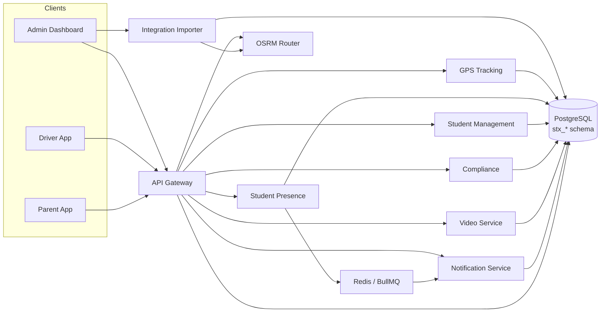

# SBTM v2 Architecture Overview

- Document owner: Engineering and Architecture
- Last reviewed: 2026-05-18
- Primary use: Entry point for the v2 architecture document set

This document is the architectural index for the SBTM v2 state following the aggressive v1→v2 cutover on `feat/sbtm-refocus-data-model`. The v2 design expands tenancy from a single hard-coded authority (OSTA) to any number of Student Transportation Authorities (STAs), introduces a dedicated import pipeline, and replaces all v1 schema entities with the `stx_*` table family.

## v2 Design Documents (authoritative)

| Document                                                     | Purpose                                                                                                                 |
| ------------------------------------------------------------ | ----------------------------------------------------------------------------------------------------------------------- |
| [DataModel-v2.md](DataModel-v2.md)                           | Canonical v2 schema: `stx_sta`, `stx_boards`, `stx_schools`, `stx_students`, `stx_alerts`, `shapes`, RLS policies, RBAC |
| [Integrations-STA.md](Integrations-STA.md)                   | Import pipeline: three-layer CSV/GTFS contract, staging/diff/commit flow, OSRM shape fallback                           |
| [ImportMappings.md](ImportMappings.md)                       | Per-column mapping tables for all import CSV files                                                                      |
| [Alerts.md](Alerts.md)                                       | Alert model: `stx_alerts`, scope kinds (sta/board/school), audience resolution, delivery, audit                         |
| [RoutePlanner.md](RoutePlanner.md)                           | Admin route-planner UI: editable stops/shapes, GTFS export, OSRM snap-to-road                                           |
| [DataRetention.md](DataRetention.md)                         | Per-STA configurable retention; `boarding_event_retention_days` default 395 d                                           |
| [SchemaAudit-And-Migration.md](SchemaAudit-And-Migration.md) | v1→v2 aggressive cutover: phase-by-phase execution, drop list, CI gates                                                 |

## v1-Era Documents (historical reference)

The documents below were written for the v1 design. They have been moved to `Archive/` and **do not describe the current codebase**:

- [Archive/SystemArchitecture.md](Archive/SystemArchitecture.md) — v1 service topology
- [Archive/DataArchitecture.md](Archive/DataArchitecture.md) — v1 data domain ownership
- [Archive/DatabaseSchema.md](Archive/DatabaseSchema.md) — v1 schema snapshot (`school_boards`, `schools`, `EmergencyAlert` …)
- [Archive/IntegrationArchitecture.md](Archive/IntegrationArchitecture.md) — v1 request/event flows
- [Archive/DeploymentArchitecture.md](Archive/DeploymentArchitecture.md) — v1 Docker Compose / AKS topology
- [Archive/SecurityPrivacyArchitecture.md](Archive/SecurityPrivacyArchitecture.md) — v1 identity and RLS model
- [Archive/TechnicalSpecifications.md](Archive/TechnicalSpecifications.md) — v1 technical constraints
- [Archive/EventCatalog.md](Archive/EventCatalog.md) — v1 event definitions

## Architecture Intent

The v2 architecture pursues the same core goals as v1 but applies them against a multi-STA, import-driven model:

- **Multi-STA tenancy** — `stx_sta` is the root tenant; all boards, schools, students, routes, and alerts are anchored to a single STA. RLS enforces isolation at every layer.
- **Import-driven onboarding** — no manual row insertion; all transport data enters via the `integration-importer` service (stage → diff → dry-run → commit). Seed data (`scripts/schema-seed/seed-v2.sql`) covers only STAs and admin users.
- **Shapes as first-class data** — routes carry GTFS-aligned `shapes` rows instead of a single `polyline` text column. OSRM auto-generates shapes for routes imported without geometry.
- **Unified alert model** — `stx_alerts` replaces the v1 `EmergencyAlert`; `scope_kind` can be `sta`, `board`, `school`, or `route`. Audience resolution fans out to all relevant guardians.
- Field resilience, event awareness, privacy by design, and observability goals carry over unchanged from v1.

## v2 Service Topology

## Cross-Cutting Principles

- Multi-tenant by design: STA is the root of every tenant boundary; `sta_id` appears directly on every high-volume table.
- Import-over-insert: transport data enters through a versioned, auditable import pipeline — not ad-hoc SQL.
- Event-aware, not event-only: request-response remains primary; state changes that matter operationally emit events.
- Privacy by design: PII fields encrypted at rest; boarding and student data scoped strictly by STA RLS.
- Operational transparency: import sessions, alert deliveries, and GPS deviation events are all auditable.

## Source-of-Truth Boundaries

- `docs/Design/DataModel-v2.md` — canonical schema and RBAC rules.
- `docs/Design/Integrations-STA.md` — import pipeline contract.
- `docs/Design/Alerts.md` — alert lifecycle and delivery rules.
- `docs/Design/RoutePlanner.md` — route-planner UI and GTFS export spec.
- `docs/Implementation/` — code-verified current state of each service module.
