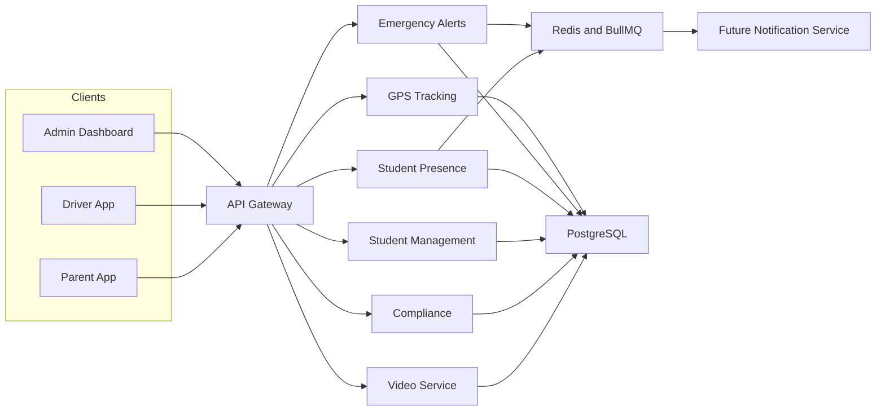

# SBTM v1 Architecture Overview

- Document owner: Engineering and Architecture
- Last reviewed: 2026-03-24
- Primary use: Entry point for the split v1 architecture document set

This document is the architectural index for the SBTM v1 target state. It separates the design into focused concerns so business, data, integration, deployment, and privacy decisions can evolve without overloading a single file.

## Related Documents

- [SystemArchitecture.md](SystemArchitecture.md)
- [DataArchitecture.md](DataArchitecture.md)
- [IntegrationArchitecture.md](IntegrationArchitecture.md)
- [DeploymentArchitecture.md](DeploymentArchitecture.md)
- [SecurityPrivacyArchitecture.md](SecurityPrivacyArchitecture.md)
- [TechnicalSpecifications.md](TechnicalSpecifications.md)
- [EventCatalog.md](EventCatalog.md)
- [../../Business/Requirements.md](../../Business/Requirements.md)
- [../../prd/v1/UpgradePlan/GapAnalysis.md](../../prd/v1/UpgradePlan/GapAnalysis.md)

## Architecture Intent

The v1 architecture evolves the current prototype into a more coherent event-aware platform for school transportation operations. The design goals are:

- Keep tenant boundaries explicit across apps, services, and data.
- Support field resilience for driver workflows with intermittent connectivity.
- Improve parent and operator situational awareness through timely event propagation.
- Preserve a practical path from local Docker Compose delivery to a production-capable deployment model.
- Treat privacy, auditability, and child-safety workflows as core architectural concerns rather than late additions.

## Document Map

| Document | Primary Question It Answers |
| --- | --- |
| [SystemArchitecture.md](SystemArchitecture.md) | How do users, applications, services, and core runtime boundaries fit together? |
| [DataArchitecture.md](DataArchitecture.md) | What data domains exist, who owns them, and how are tenant boundaries expressed? |
| [DatabaseSchema.md](DatabaseSchema.md) | What persisted tables and entities currently exist across services? |
| [DataRetention.md](DataRetention.md) | How long should operational and privacy-sensitive data be retained? |
| [IntegrationArchitecture.md](IntegrationArchitecture.md) | How do requests, events, queues, and external dependencies interact? |
| [DeploymentArchitecture.md](DeploymentArchitecture.md) | How does the platform run locally today and what is the intended production topology? |
| [SecurityPrivacyArchitecture.md](SecurityPrivacyArchitecture.md) | How are identity, access control, privacy, audit, and operational trust handled? |
| [TechnicalSpecifications.md](TechnicalSpecifications.md) | What technologies, interfaces, and technical constraints define v1? |
| [EventCatalog.md](EventCatalog.md) | What domain events are expected across the event-driven architecture? |

## Cross-Cutting Principles

- Event-aware, not event-only: request-response remains important, but state changes that matter operationally should become publishable events.
- Multi-tenant by design: tenant context is not optional metadata.
- Operational transparency: health, alerts, and delivery gaps must be observable.
- Privacy by design: tracking, notification, and audit workflows must minimize avoidable exposure of child-related data.
- Replace narrative assumptions with traceable artifacts: business requirements, use cases, and architecture should reference one another directly.

## Architecture Summary Diagram

## Source-of-Truth Boundaries

- Use `docs/Design/v1` for target-state design and architectural direction.
- Use `docs/Implementation` for code-verified current state.
- Use `docs/prd/v1/UpgradePlan` for the difference between current delivery and the v1 target.
