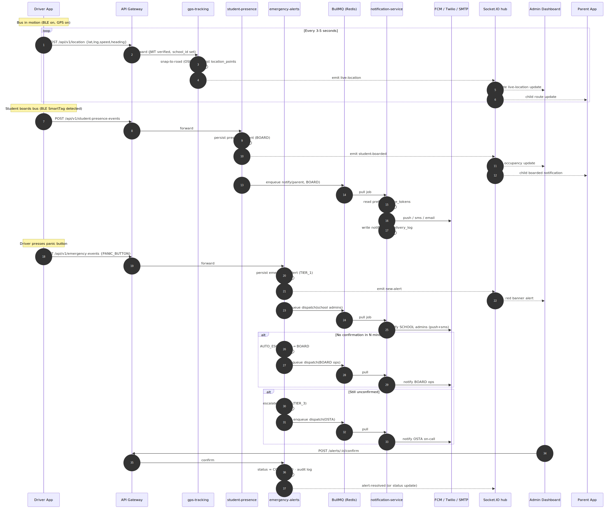

# SBTM — 360° Architecture Diagrams

> **Audience**: New engineers, SREs, security reviewers, product/ops onboarding.
> **Purpose**: A single visual entry point that explains the SBTM (School Bus Tracking & Management) platform from four complementary angles — system, network, DevOps, and data/event flow — plus the core data model.
> **Format**: Each diagram is provided as a Mermaid source ([`docs/Design/diagrams/*.mmd`](./diagrams/)) and a rendered SVG ([`docs/Design/diagrams/*.svg`](./diagrams/)) so it can be embedded anywhere (wiki, slide deck, PR description) without re-rendering.

| #   | Diagram                        | View              | Source                                                                  | Image                                                                   |
| --- | ------------------------------ | ----------------- | ----------------------------------------------------------------------- | ----------------------------------------------------------------------- |
| 1   | High-Level System Architecture | C4 — Context      | [`01-high-level-system.mmd`](./diagrams/01-high-level-system.mmd)       | [`01-high-level-system.svg`](./diagrams/01-high-level-system.svg)       |
| 2   | Detailed System Architecture   | C4 — Container    | [`02-detailed-system.mmd`](./diagrams/02-detailed-system.mmd)           | [`02-detailed-system.svg`](./diagrams/02-detailed-system.svg)           |
| 3   | Network Architecture (Azure)   | Infra — VNet/PaaS | [`03-network-architecture.mmd`](./diagrams/03-network-architecture.mmd) | [`03-network-architecture.svg`](./diagrams/03-network-architecture.svg) |
| 4   | DevOps / CI-CD Architecture    | Pipeline          | [`04-devops-architecture.mmd`](./diagrams/04-devops-architecture.mmd)   | [`04-devops-architecture.svg`](./diagrams/04-devops-architecture.svg)   |
| 5   | Real-time Data & Event Flow    | Sequence          | [`05-data-event-flow.mmd`](./diagrams/05-data-event-flow.mmd)           | [`05-data-event-flow.svg`](./diagrams/05-data-event-flow.svg)           |
| 6   | Database ER (core schema)      | Data              | [`06-database-er.mmd`](./diagrams/06-database-er.mmd)                   | [`06-database-er.svg`](./diagrams/06-database-er.svg)                   |

---

## TL;DR — What is SBTM?

SBTM is a **multi-tenant, real-time school bus tracking & safety platform** running on **Azure Kubernetes Service (AKS)**. It serves three audiences from a shared backend:

- **Parents** — see their child's bus location, board/alight events, ETA, and emergency notifications.
- **Drivers** — execute routes with turn-by-turn navigation, BLE SmartTag-based student presence, and a panic button.
- **Administrators (school/board/OSTA)** — monitor live fleet, manage routes/students/compliance, triage and escalate alerts.

The backend is **8 Node.js/TypeScript microservices** sharing one PostgreSQL database (PostGIS + Row-Level Security for tenant isolation by `school_id`), one Redis (cache + BullMQ job queues), and Azure Blob Storage (video + OSRM routing data).

---

## 1. High-Level System Architecture (C4 Context)



**[Mermaid source](./diagrams/01-high-level-system.mmd)** · **[SVG](./diagrams/01-high-level-system.svg)**

### What it shows

This is the 30,000-foot view. Four user types interact with three client surfaces, all routed through a single edge (NGINX Ingress + API Gateway) into the SBTM platform on AKS, which talks to a private data plane and a small set of external SaaS services.

### Key concepts

- **One front door**: Every external request enters through `api-gateway:3001` behind NGINX Ingress with TLS via cert-manager. The gateway is the _only_ service exposed publicly. All other services are reachable only inside the cluster.
- **Tenant scoping at the edge**: The gateway validates the JWT, extracts `school_id`/`role` claims, and propagates them as request context. PostgreSQL Row-Level Security (RLS) enforces tenant isolation server-side as a defence-in-depth.
- **Real-time is first-class**: Live bus position, presence events, and emergency alerts flow over Socket.IO WebSockets in addition to REST. BullMQ (Redis-backed) handles asynchronous fan-out to push/SMS/email channels.
- **Externals are minimal and pluggable**: FCM (push), Twilio (SMS), SMTP (email), and Azure Monitor / Application Insights (telemetry). All credentials live in Azure Key Vault and are mounted via the CSI driver.

### When to use this diagram

Onboarding overview, exec-level summaries, security/privacy reviews, "what does the system look like in one picture?".

---

## 2. Detailed System Architecture (C4 Container)


**[Mermaid source](./diagrams/02-detailed-system.mmd)** · **[SVG](./diagrams/02-detailed-system.svg)**

### What it shows

Every deployable container/process: 4 client apps, the edge, all 8 backend services + OSRM, the BullMQ queues, the Socket.IO namespaces, the data stores, and the externals. Solid arrows are synchronous calls; dotted arrows are asynchronous events or telemetry.

### The 8 microservices at a glance

| Service                 | Port | Tech                        | Responsibility                                                   | Key dependencies                           |
| ----------------------- | ---- | --------------------------- | ---------------------------------------------------------------- | ------------------------------------------ |
| `api-gateway`           | 3001 | NestJS · Passport JWT       | Auth, RBAC, rate limit, reverse proxy, route/fleet/org CRUD      | PostgreSQL, Redis, OSRM                    |
| `gps-tracking`          | 3002 | Express · Prisma            | GPS ingest, snap-to-road, live + history queries                 | PostgreSQL, Redis, OSRM                    |
| `emergency-alerts`      | 3003 | NestJS · Socket.IO          | Alert lifecycle (TIER 1→2→3 escalation), audit                   | PostgreSQL, Redis (BullMQ), `@sbtm/common` |
| `student-presence`      | 3004 | NestJS · Socket.IO          | Board/alight events from BLE SmartTag, RFID, manual              | PostgreSQL, Redis (BullMQ)                 |
| `video-service`         | 3005 | NestJS · MinIO SDK          | Video event metadata, presigned upload/download URLs             | PostgreSQL, Blob Storage                   |
| `student-management`    | 3006 | NestJS · TypeORM            | Enrollment, parent linkage, route/stop assignment, CSV import    | PostgreSQL                                 |
| `compliance-management` | 3007 | NestJS · `@nestjs/schedule` | Driver license / background / medical expiry, cron-based alerts  | PostgreSQL                                 |
| `notification-service`  | 3008 | NestJS · BullMQ workers     | Multi-channel delivery (FCM, Twilio, SMTP); dry-run mode for dev | Redis, FCM, Twilio, SMTP                   |
| `osrm`                  | 5000 | OSRM v5.27.1                | Snap-to-road, route optimization, distance/duration              | Blob Storage (`.osrm` data)                |

### Cross-cutting library: `@sbtm/common` ([`libs/common`](../../libs/common))

Every service consumes `@sbtm/common` for:

- `RolesGuard` + `@Roles(...)` decorator (RBAC).
- `InternalServiceAuthGuard` (service-to-service auth).
- `HttpExceptionFilter`, `LoggingInterceptor`, `TimeoutInterceptor` (consistent error/log/SLA shape).
- `bootstrapApp()` (uniform Nest startup: helmet, CORS, validation pipes, pino-http).
- `initTracing(serviceName)` (OpenTelemetry → OTLP → App Insights).

### Async plane

- **BullMQ queues** (Redis-backed): `alerts`, `presence`, `notifications`. Producer services (`emergency-alerts`, `student-presence`) enqueue; `notification-service` consumes and fans out to FCM/Twilio/SMTP.
- **Socket.IO namespaces**: `/alerts` (admin live banners), `/presence` (occupancy + parent-side child events), `/video` (incident updates).

### When to use this diagram

Code reviews ("which service should this go in?"), incident triage ("who calls who?"), capacity planning ("which pods need HPA?").

---

## 3. Network Architecture (Azure)



**[Mermaid source](./diagrams/03-network-architecture.mmd)** · **[SVG](./diagrams/03-network-architecture.svg)**

### What it shows

The Azure-side network topology that backs the demo and production environments. Provisioned by [`infra/azure/main.bicep`](../../infra/azure/main.bicep) and orchestrated by [`scripts/azure/bootstrap.sh`](../../scripts/azure/bootstrap.sh).

### Network design principles

1. **Single VNet, multiple subnets, private-only data plane**
   - `snet-aks` — AKS nodes (Azure CNI Overlay; pod IPs from overlay range, not VNet).
   - `snet-private-endpoints` — dedicated subnet for all Private Endpoints (PostgreSQL, Redis, Key Vault, Blob, App Insights).
   - `snet-db` — delegated subnet for VNet-injected PostgreSQL Flexible Server (alternative deployment mode).
   - `snet-services` — reserved for jump hosts / ops runners.
2. **PaaS exposed only via Private Endpoint**
   - PostgreSQL, Redis, Key Vault, and Blob Storage have public network access **disabled**. Each PE has a corresponding entry in a Private DNS Zone (e.g. `privatelink.postgres.database.azure.com`) so in-cluster pods resolve and connect over the VNet.
   - Consequence: bootstrap DB migrations cannot run from a developer workstation; they run in a one-shot AKS Job pod via [`scripts/azure/db-migrate-via-aks.sh`](../../scripts/azure/db-migrate-via-aks.sh).
3. **Workload Identity, no static cloud creds**
   - AKS has an OIDC issuer; pods use federated workload identity to access ACR (image pull), Key Vault (CSI driver), and Blob Storage. No connection strings or managed-identity client secrets live in cluster manifests.
4. **NSGs deny by default**
   - Inbound from `0.0.0.0/0` is denied; only the public LB IP (NGINX Ingress) terminates internet traffic on 443.
5. **Observability is in-cluster + sidecar-free**
   - Container Insights add-on streams to the Log Analytics Workspace; OpenTelemetry from each service ships traces to Application Insights via the OTLP HTTP exporter.

### Bicep modules → Azure resources

| Module             | Resources                                                | Notes                                                                    |
| ------------------ | -------------------------------------------------------- | ------------------------------------------------------------------------ |
| `network.bicep`    | VNet, subnets, NSGs, Private DNS zones                   | Deploys first; outputs subnet IDs                                        |
| `monitoring.bicep` | Log Analytics, App Insights                              | Required before AKS for Container Insights                               |
| `acr.bicep`        | Container Registry                                       | Image registry; AKS managed identity has `AcrPull`                       |
| `aks.bicep`        | AKS cluster, system + app pools, OIDC, workload identity | Depends on network + monitoring + ACR                                    |
| `keyvault.bicep`   | Key Vault, federated identity                            | Depends on AKS for OIDC URL                                              |
| `database.bicep`   | PostgreSQL Flexible (PostGIS, private)                   | Port 5432, allow-listed extensions: PGCRYPTO, UUID-OSSP, CITEXT, POSTGIS |
| `redis.bicep`      | Azure Cache for Redis (TLS 6380)                         | BullMQ + cache                                                           |
| `storage.bicep`    | Storage account + containers (`video`, `osrm`)           | Lifecycle rules, encryption at rest                                      |

### When to use this diagram

Security/compliance reviews, network troubleshooting, planning multi-region or hub-spoke evolution.

---

## 4. DevOps / CI-CD Architecture



**[Mermaid source](./diagrams/04-devops-architecture.mmd)** · **[SVG](./diagrams/04-devops-architecture.svg)**

### What it shows

How code becomes a running pod (or a published mobile build), and how infrastructure itself is provisioned.

### Pipeline summary

| Workflow ([`.github/workflows/`](../../.github/workflows/)) | Trigger                               | What it does                                                                                                              |
| ----------------------------------------------------------- | ------------------------------------- | ------------------------------------------------------------------------------------------------------------------------- |
| `ci.yml`                                                    | `push` to main, every `pull_request`  | Lint, build, unit test, integration test (with `services: postgres + redis`)                                              |
| `build-images.yml`                                          | `workflow_call` / `workflow_dispatch` | Matrix build × 8 services → push to ACR using OIDC federation (no PATs)                                                   |
| `deploy-demo.yml`                                           | After successful build on `main`      | `kustomize edit set image`, `kubectl apply -k overlays/demo`, smoke test                                                  |
| `deploy-production.yml`                                     | `release: published`                  | DB backup → kustomize edit → `kubectl apply -k overlays/production` → `rollout status` → smoke → auto-rollback on failure |
| `infra-provision.yml`                                       | Manual / scheduled                    | `az deployment group create --template-file infra/azure/main.bicep`                                                       |
| `mobile-build.yml`                                          | Manual / tag                          | `eas build --platform android` (and iOS) for the driver and parent apps                                                   |

### Bootstrap (one-time per environment)

For a brand-new environment, [`scripts/azure/bootstrap.sh`](../../scripts/azure/bootstrap.sh) is the **9-step idempotent end-to-end orchestrator**:

1. CLI tools check
2. Azure login (auto-selects subscription with `AUTO_YES=true`)
3. Collect/generate secrets (`JWT_SECRET`, `POSTGRES_ADMIN_PASSWORD`)
4. Preflight check (Bicep compile, kustomize build, vCPU quota)
5. Provision Azure resources via Bicep (`provision-azure.sh`)
6. Materialise `.env.<env>` from Azure outputs (FQDNs, connection strings)
7. Seed Azure Key Vault from `.env.<env>` (graceful skip on RBAC denial)
8. DB migration (extension allow-list → tries local psql with 5s timeout → falls back to AKS pod via `db-migrate-via-aks.sh`)
9. Upload OSRM data to Blob Storage (`osrm-upload.sh`, ~625 MB · 27 files)

Shutdown / restart for cost control: [`cost-stop.sh`](../../scripts/azure/cost-stop.sh) / [`cost-start.sh`](../../scripts/azure/cost-start.sh). Full teardown: [`teardown-azure.sh`](../../scripts/azure/teardown-azure.sh).

### Monorepo build: Turborepo + pnpm

- [`turbo.json`](../../turbo.json) defines cached `build`, `lint`, `test`, `test:cov`, persistent `dev`.
- pnpm workspaces (`pnpm-workspace.yaml`) map `apps/*`, `services/*`, `libs/*`, `apps/parent-dashboard/*`.
- Shared dev tooling: ESLint flat config, Prettier, Husky pre-commit, lint-staged, commitlint (Conventional Commits).

### When to use this diagram

Onboarding to the release process, debugging a failed deploy, planning a new pipeline or environment.

---

## 5. Real-time Data & Event Flow



**[Mermaid source](./diagrams/05-data-event-flow.mmd)** · **[SVG](./diagrams/05-data-event-flow.svg)**

### What it shows

A single sequence diagram covering the three most important real-time scenarios — **live tracking**, **student presence**, and **emergency alert with auto-escalation**. This is where the platform earns its keep.

### Three flows in one picture

1. **Live tracking (3-5 s loop)**
   - Driver app posts a GPS sample → gateway → `gps-tracking` → snap-to-road via OSRM → persist to `location_points` → emit on `/live` Socket.IO room → admin map and parent app both update.
2. **Student board / alight**
   - BLE SmartTag detected by driver app → `student-presence` persists `presence_event` → broadcasts on `/presence` (occupancy + per-child) → enqueues a `notify(parent, BOARD)` BullMQ job → `notification-service` reads `notification_preferences` + `device_tokens` → fans out to FCM/SMS/Email and writes `notification_delivery_log`.
3. **Emergency alert + escalation**
   - Driver hits panic button → `emergency-alerts` persists at TIER_1 → broadcasts `new-alert` → enqueues dispatch to **SCHOOL admins**.
   - If unconfirmed within the configured window → status flips to `AUTO_ESCALATED`, dispatched to **BOARD ops**.
   - Still unconfirmed → escalates to **OSTA** (TIER_3).
   - Admin confirms → `CONFIRMED`, full audit trail in `alert_audit_log`.

### Why two delivery channels (WebSocket _and_ BullMQ)?

- **WebSocket** is for _currently-connected_ admin/parent UIs — sub-second updates, no retry semantics.
- **BullMQ** is for _durable_ multi-channel notification — survives the recipient being offline, supports retry/backoff, dead-letter queue, and writes a per-recipient delivery log for compliance/audit.

### When to use this diagram

Designing new event types, debugging "why did Alice get an SMS but not Bob?", reasoning about ordering and at-least-once semantics.

---

## 6. Database ER (Core Schema)



**[Mermaid source](./diagrams/06-database-er.mmd)** · **[SVG](./diagrams/06-database-er.svg)**

### What it shows

The core entity relationships across the SBTM domain. (For full column-level documentation see [`DatabaseSchema.md`](./DatabaseSchema.md) and the source of truth in [`scripts/init-schema.sql`](../../scripts/init-schema.sql).)

### Schema design choices

- **Tenant boundary = `school_id`** (UUID) on every operational table. Some tables additionally carry `board_id` for board-level reporting.
- **Row-Level Security** is enabled on `students`, `emergency_alert`, `presence_event`, `driver_compliance`, `audit_logs`. Policies use `current_setting('app.current_school_id')`, which the API gateway sets per request inside a transaction.
- **PostGIS** powers route corridors (`geography` columns), geofences, and snap-to-road distance calculations.
- **Append-only audit tables** — `alert_audit_log`, `alert_notification_log`, `audit_logs`, `video_access_logs` — never updated, only inserted, supporting forensic review and compliance reporting.
- **Multi-channel notification model** — `device_tokens` (per-platform), `notification_preferences` (per-event-type opt-in), `notification_delivery_log` (per-attempt status with provider message ID).

### When to use this diagram

Writing migrations, reasoning about tenant scoping, planning new entities, code-review of `WHERE` clauses.

---

## How to update / re-render the diagrams

1. Edit the `.mmd` source under [`docs/Design/diagrams/`](./diagrams/).
2. Re-render to SVG:
   ```bash
   cd docs/Design/diagrams
   for f in *.mmd; do
     npx -y -p @mermaid-js/mermaid-cli mmdc \
       -i "$f" -o "${f%.mmd}.svg" \
       -p puppeteer-config.json -b transparent
   done
   ```
3. Commit both the `.mmd` and the `.svg` so consumers without a Mermaid renderer still see the diagram.

GitHub renders the embedded SVGs automatically. If you only have the source, paste the contents of any `.mmd` into the [Mermaid Live Editor](https://mermaid.live).

---

## Cross-references

- High-level narrative: [`Architecture.md`](./Architecture.md)
- Per-domain deep dives: [`SystemArchitecture.md`](./SystemArchitecture.md), [`DataArchitecture.md`](./DataArchitecture.md), [`IntegrationArchitecture.md`](./IntegrationArchitecture.md), [`SecurityPrivacyArchitecture.md`](./SecurityPrivacyArchitecture.md), [`DeploymentArchitecture.md`](./DeploymentArchitecture.md)
- Schema reference: [`DatabaseSchema.md`](./DatabaseSchema.md), [`scripts/init-schema.sql`](../../scripts/init-schema.sql), [`scripts/rls-policies.sql`](../../scripts/rls-policies.sql)
- Event catalog: [`EventCatalog.md`](./EventCatalog.md)
- Deployment / Azure: [`docs/Deployment/`](../Deployment/), [`scripts/azure/bootstrap.sh`](../../scripts/azure/bootstrap.sh), [`infra/azure/main.bicep`](../../infra/azure/main.bicep)
- Implementation modules: [`docs/Implementation/`](../Implementation/)
