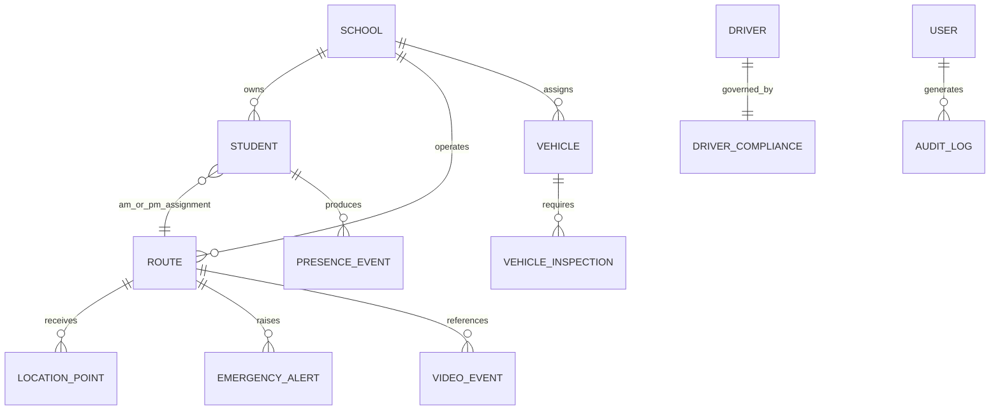

# SBTM v1 Data Architecture

> **⚠ Historical — v1 Era.** This document describes the v1 data domain model. For the current v2 data model and tenant hierarchy (`stx_sta` → `stx_boards` → `stx_schools`) see [DataModel-v2.md](../DataModel-v2.md).

- Document owner: Engineering and Architecture
- Last reviewed: 2026-03-30
- Primary use: Data domain ownership, tenant boundaries, and persistence patterns

## Purpose

This document describes the major data domains in SBTM, who owns them, and how tenant boundaries and operational traceability are represented.

## Related Documents

- [DatabaseSchema.md](DatabaseSchema.md)
- [DataRetention.md](DataRetention.md)
- [SecurityPrivacyArchitecture.md](SecurityPrivacyArchitecture.md)

## Data Domains

| Domain               | Primary Owner         | Core Entities                                               | Notes                                                                  |
| -------------------- | --------------------- | ----------------------------------------------------------- | ---------------------------------------------------------------------- |
| Identity and tenancy | API Gateway           | users, boards, schools, routes, vehicles                    | Gateway currently owns much of the tenancy and operational master data |
| Tracking             | GPS Tracking          | location points, live route status                          | Time-series style writes and historical query patterns                 |
| Presence             | Student Presence      | presence events, route occupancy state, SmartTag detections | Mix of durable records and cached current state                        |
| Student records      | Student Management    | students, route assignments, parent linkage                 | Tenant-scoped roster and assignment data                               |
| Alerts               | Emergency Alerts      | emergency alerts, delivery attempts or stubs                | Real-time operational incident context                                 |
| Compliance           | Compliance Management | driver compliance, vehicle inspections, audit logs          | Operational readiness and accountability data                          |
| Video                | Video Service         | video events, upload status, playback metadata              | Metadata in DB, assets in object storage or local storage              |

## Logical Data Model

## Tenant Boundary Rules

- `school_id` is the current cross-service tenant boundary and must accompany operational records.
- `board` and `school` hierarchy is expressed at the gateway level and should flow to downstream access decisions.
- Shared infrastructure is acceptable for the current prototype, but data access must continue to respect tenant-scoped filtering.

## Persistence Patterns

| Pattern                         | Current Usage                          | Implication                                                                |
| ------------------------------- | -------------------------------------- | -------------------------------------------------------------------------- |
| Shared PostgreSQL instance      | Used across services in local delivery | Fast to operate, but demands stronger logical boundaries                   |
| Per-service entities            | Services own their own ORM entities    | Good for modularity, but still depends on shared DB discipline             |
| Redis-backed transient state    | Presence and alert flows               | Supports low-latency state and job processing                              |
| Object storage or local storage | Video assets                           | Allows metadata to stay in relational storage while assets remain external |

## Sensitive Data Notes

- Student identity and route assignment data are privacy-sensitive because they can reveal child location context.
- Audit data is operationally sensitive because it can expose user behavior and investigative context.
- GPS and presence data can become highly sensitive when correlated over time.

## Data Lifecycle Considerations

- Retention and purge rules are not yet fully implemented and remain a required future control.
- Location, presence, and audit domains should be documented with explicit retention schedules before production rollout.
- Backups must be tenant-safe and support point-in-time operational recovery.

## Traceability

- Primary requirements: FR-TENANT-001, FR-GPS-001, FR-PRESENCE-002, FR-STUDENT-001, FR-COMPLIANCE-001, PR-TENANT-001, PR-RETENTION-001
- Primary use cases: UC-ONBOARD-001, UC-PRESENCE-001, UC-PARENT-001, UC-COMPLIANCE-001
