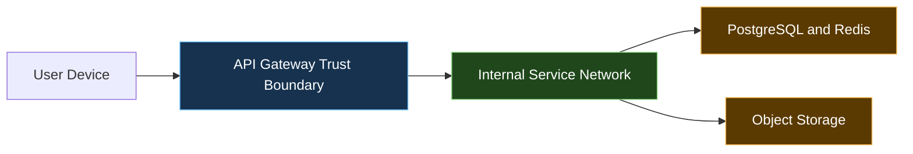

# SBTM v1 Security and Privacy Architecture

> **⚠ Historical — v1 Era.** This document describes the v1 identity and RLS model. For the current v2 RBAC, RLS policies, and privacy design see [DataModel-v2.md](../DataModel-v2.md) §6 and §10.

- Document owner: Engineering and Architecture
- Last reviewed: 2026-03-30
- Primary use: Identity, access, privacy, audit, and trust boundaries

## Purpose

This document captures the security and privacy architecture for SBTM with emphasis on child-safety data, tenant isolation, and operational accountability.

## Related Documents

- [DataArchitecture.md](DataArchitecture.md)
- [DatabaseSchema.md](DatabaseSchema.md)
- [DataRetention.md](DataRetention.md)
- [../Operations/Runbooks.md](../Operations/Runbooks.md)

## Security and Privacy Principles

- Authenticate once at the platform edge and propagate only the context needed downstream.
- Enforce least privilege by role and tenant scope.
- Treat student, location, and presence data as sensitive operational information.
- Design for auditability without over-collecting personal data.
- Prefer privacy-by-design decisions over retrofitted controls.

## Identity and Access Model

| Concern                  | Current State                         | Target Direction                                                                           |
| ------------------------ | ------------------------------------- | ------------------------------------------------------------------------------------------ |
| User authentication      | JWT via API Gateway                   | Continue at gateway with stronger session hardening                                        |
| Role enforcement         | Gateway RBAC                          | Expand consistent downstream authorization expectations                                    |
| Tenant enforcement       | `school_id` filtering and scoped APIs | Add stronger DB and service-level guarantees                                               |
| Service-to-service trust | Limited or absent                     | Azure Workload Identity + AKS VNET policy (services only reachable within cluster network) |

## Trust Boundaries

## Sensitive Data Categories

| Category                     | Examples                                           | Primary Controls Needed                                    |
| ---------------------------- | -------------------------------------------------- | ---------------------------------------------------------- |
| Student-linked identity data | student names, parent linkage, route assignment    | Tenant scoping, access minimization, audit                 |
| Live operational telemetry   | GPS positions, boarding and alighting events       | Access control, retention policy, observability safeguards |
| Incident records             | alerts, inspections, audit history, video metadata | Restricted access, integrity, traceability                 |
| Credentials and secrets      | JWT secrets, provider keys, storage credentials    | Externalized secret management, rotation, least exposure   |

## Privacy Controls

- Keep data collection limited to transport safety and operational service delivery.
- Avoid exposing full student operational histories to roles that do not require them.
- Prefer role-specific summaries over broad raw-data access in UI surfaces.
- Define retention and deletion workflows before production rollout, especially for location, presence, audit, and video data.
- Align deployment choices to Canadian data residency expectations where contractually or regulatorily required.

## Security Gaps to Close

- Database-level tenant hardening, including RLS where feasible.
- Service-to-service trust: addressed in Azure AKS deployment via Workload Identity and VNET network policies restricting pod-to-pod traffic; full mTLS via service mesh is a future consideration.
- Centralized audit coverage across all critical service mutations.
- Stronger browser session hardening for parent-facing workflows (migrate to HttpOnly cookies for production).
- Formalized key rotation via Azure Key Vault; backup encryption and incident response procedures documented in `docs/Operations/Runbooks.md`.
- Parent App tokens currently in `localStorage` — migrate to HttpOnly cookie before production launch.

## Azure Security Controls (Production Deployment)

| Control             | Implementation                                                                                 |
| ------------------- | ---------------------------------------------------------------------------------------------- |
| Secrets management  | Azure Key Vault + CSI driver; no secrets in K8s ConfigMaps or image layers                     |
| Network isolation   | AKS VNET with private endpoints for PostgreSQL and Redis; only API Gateway exposed via ingress |
| Identity federation | Azure Workload Identity for pod-to-Azure-service auth (ACR, KV, Blob)                          |
| TLS                 | cert-manager + Let's Encrypt for AKS ingress; Azure Static Web Apps enforces HTTPS             |
| Image scanning      | Azure Defender for Containers scans ACR images on push                                         |
| WAF                 | Azure Front Door WAF (Standard profile) for production public endpoints                        |
| RBAC                | AKS RBAC + namespace isolation per environment (staging vs production)                         |

## Traceability

- Primary requirements: SR-AUTH-001, SR-RBAC-001, SR-SVC-001, SR-AUDIT-001, PR-RESIDENCY-001, PR-MINIMIZE-001, PR-TENANT-001, PR-RETENTION-001, NFR-DATA-001
- Primary use cases: UC-LOGIN-001, UC-PARENT-001, UC-INCIDENT-001, UC-COMPLIANCE-001
