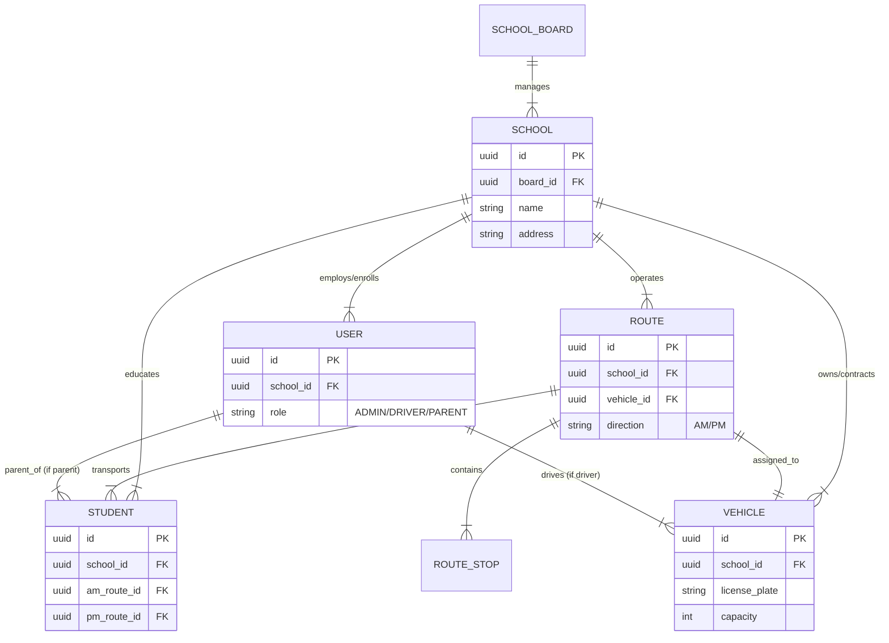

# 🗄️ **Database Schema V2: Multi-Tenant & Relational**

## 1. Overview
This schema introduces **Multi-Tenancy** by anchoring all key entities to a `School` (Tenant). It also adds support for **School Boards** (Super-Tenants) and **Fleet Management**.

## 2. Entity Relationship Diagram (ERD)

## 3. Table Definitions (PostgreSQL)

### 3.1 Organization Hierarchy

#### `school_boards`
- `id`: UUID (PK)
- `name`: VARCHAR(255)
- `region`: VARCHAR(100)
- `created_at`: TIMESTAMP

#### `schools`
- `id`: UUID (PK)
- `board_id`: UUID (FK -> school_boards.id)
- `name`: VARCHAR(255)
- `address`: TEXT
- `location`: GEOGRAPHY(POINT) -- PostGIS
- `contact_email`: VARCHAR(255)
- `operating_hours`: JSONB -- { "start": "08:00", "end": "15:00" }

### 3.2 Users & Authentication

#### `users`
- `id`: UUID (PK)
- `school_id`: UUID (FK -> schools.id, NULLABLE for OSTA_ADMIN)
- `email`: VARCHAR(255) UNIQUE
- `password_hash`: VARCHAR
- `role`: ENUM ('OSTA_ADMIN', 'BOARD_ADMIN', 'SCHOOL_ADMIN', 'DRIVER', 'PARENT')
- `assigned_vehicle_id`: UUID (FK -> vehicles.id, NULLABLE) -- For Drivers

### 3.3 Fleet Management

#### `vehicles`
- `id`: UUID (PK)
- `school_id`: UUID (FK -> schools.id)
- `license_plate`: VARCHAR(20)
- `vin`: VARCHAR(50)
- `capacity`: INT
- `status`: ENUM ('ACTIVE', 'MAINTENANCE', 'RETIRED')

### 3.4 Route Management

#### `routes`
- `id`: UUID (PK)
- `school_id`: UUID (FK -> schools.id)
- `vehicle_id`: UUID (FK -> vehicles.id, UNIQUE per Active Route) -- 1 Bus per Route
- `name`: VARCHAR(100)
- `direction`: ENUM ('AM', 'PM')
- `start_time`: TIME
- `status`: ENUM ('PLANNED', 'ACTIVE', 'COMPLETED')

#### `route_stops`
- `id`: UUID (PK)
- `route_id`: UUID (FK -> routes.id)
- `sequence`: INT
- `location`: GEOGRAPHY(POINT)
- `planned_arrival`: TIME

### 3.5 Student Management

#### `students`
- `id`: UUID (PK)
- `school_id`: UUID (FK -> schools.id)
- `am_route_id`: UUID (FK -> routes.id)
- `pm_route_id`: UUID (FK -> routes.id)
- `am_stop_id`: UUID (FK -> route_stops.id)
- `pm_stop_id`: UUID (FK -> route_stops.id)
- `parent_user_id`: UUID (FK -> users.id)
- `first_name`: VARCHAR
- `last_name`: VARCHAR
- `grade`: VARCHAR(10)

## 4. Best Practices & Constraints
1. **Foreign Keys**: All foreign keys must enforce Referential Integrity (`ON DELETE RESTRICT` for data safety).
2. **Indexing**:
   - `school_id` on all tables (Multi-Tenant filtering).
   - `location` on `schools` and `route_stops` (Spatial queries).
   - `email` on `users` (Login performance).
3. **Data Types**: Use `UUID` for primary keys to allow easy data migration/merging and prevent enumeration attacks.
4. **Audit Columns**: All tables must include `created_at` and `updated_at`.
