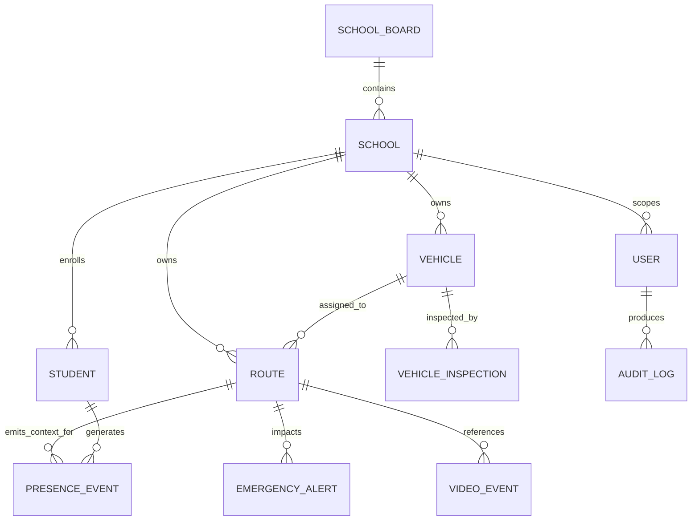

# SBTM v1 Database Schema Reference

- Document owner: Engineering and Architecture
- Last reviewed: 2026-03-24
- Primary use: Schema-level reference for persisted tables, ownership, and tenant-sensitive fields

## Purpose

This document summarizes the persisted data structures currently visible in the codebase across the gateway and domain services. It is a schema reference, not a migration ledger.

## Schema Ownership by Service

| Service | Key Tables or Entities | Tenant Anchor |
| --- | --- | --- |
| API Gateway | `users`, `school_boards`, `schools`, `routes`, `route_stops`, `vehicles` | `boardId`, `schoolId` |
| GPS Tracking | location storage managed by Prisma | `schoolId` in telemetry payloads |
| Emergency Alerts | emergency alerts, notification logs | `schoolId` |
| Student Presence | presence events, student tags | `schoolId` |
| Student Management | `students` | `school_id` |
| Compliance Management | `driver_compliance`, `vehicle_inspections`, `audit_logs` | `school_id` |
| Video Service | `video_events`, access logs | `school_id` |

## Logical Relationships

## Core Tables

### API Gateway Identity and Tenancy

| Table | Key Columns | Notes |
| --- | --- | --- |
| `users` | `id`, `email`, `passwordHash`, `role`, `schoolId`, `boardId`, `driverId`, `childRouteIds`, `assignedRouteIds` | Role and route-assignment context lives here |
| `school_boards` | `id`, `name` | Board catalog |
| `schools` | `id`, `name`, `boardId` | School-to-board relationship |
| `routes` | `id`, `schoolId`, `name`, `direction`, `vehicleId`, `startTime`, `estimatedDuration` | Unique on `schoolId + name` |
| `vehicles` | `id`, `schoolId`, `licensePlate`, `status` | Unique on `schoolId + licensePlate` |

### Student and Presence Domain

| Table | Key Columns | Notes |
| --- | --- | --- |
| `students` | `id`, `school_id`, `parent_user_id`, `am_route_id`, `pm_route_id`, `external_student_id`, `status` | Unique on `school_id + external_student_id` |
| `presence_event` or `presence_events` entity store | `id`, `schoolId`, `studentId`, `vehicleId`, `routeId`, `eventType`, `timestamp`, `source`, `signalStrength` | Indexed for student-route-time and vehicle-time queries |
| student tag store | `studentId`, `tagId`, tag metadata | Used for SmartTag support |

### Alerts and Video Domain

| Table | Key Columns | Notes |
| --- | --- | --- |
| emergency alerts entity store | `id`, `schoolId`, `vehicleId`, `routeId`, `driverId`, `timestamp`, `lat`, `lng`, `eventType`, `status` | Core incident record |
| `video_events` | `id`, `school_id`, `vehicle_id`, `route_id`, `driver_id`, `timestamp`, `event_type`, `duration_seconds`, `status`, `video_url`, `thumbnail_url` | Indexed on vehicle, route, timestamp, and status |
| video access log store | event access metadata | Used for auditability of playback |

### Compliance Domain

| Table | Key Columns | Notes |
| --- | --- | --- |
| `driver_compliance` | `id`, `driver_id`, `school_id`, expiry dates, `status` | Unique on `driver_id` |
| `vehicle_inspections` | `id`, `vehicle_id`, `driver_id`, `school_id`, `type`, `is_passed`, `checklist_json`, `photo_urls` | Inspection history |
| `audit_logs` | `id`, `user_id`, `school_id`, `action`, `resource`, `resource_id`, `details`, `ip_address`, `user_agent`, `createdAt` | Operational and compliance trail |

## Tenant and Privacy Notes

- `schoolId` or `school_id` is the main tenant boundary across services.
- Naming is not yet fully normalized between services.
- Parent linkage, route assignment, presence, GPS, and video metadata become sensitive when combined and should be handled as regulated operational data.

## Known Schema Caveats

- The current documentation reflects code-visible entities, not a complete migration inventory.
- Some services use shared infrastructure while still relying on logical rather than DB-enforced isolation.
- GPS schema details are inferred from service behavior and tests because the service uses Prisma-backed storage rather than TypeORM entities in this repo section.

## Related Documents

- [DataArchitecture.md](DataArchitecture.md)
- [DataRetention.md](DataRetention.md)
- [SecurityPrivacyArchitecture.md](SecurityPrivacyArchitecture.md)