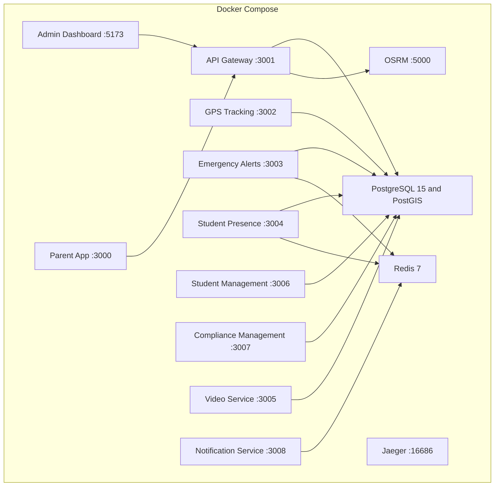
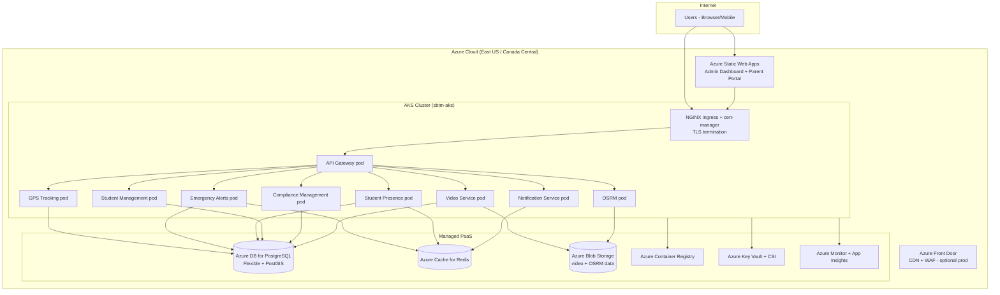

# SBTM v1 Deployment Architecture

- Document owner: Engineering and Architecture
- Last reviewed: 2026-04-21
- Primary use: Runtime topology for local development, staging, and Azure AKS production deployment

## Purpose

This document describes how the platform is deployed in local environments and the target Azure AKS production topology. For the full Azure architecture with C4 diagrams, cost analysis, and IaC guidance see [`docs/Deployment/AzureArchitecture.md`](../Deployment/AzureArchitecture.md).

## Environment Matrix

| Property         | Local Development              | Staging (Azure AKS)                     | Production (Azure AKS)                                       |
| ---------------- | ------------------------------ | --------------------------------------- | ------------------------------------------------------------ |
| Orchestration    | Docker Compose                 | AKS cluster — staging namespace         | AKS cluster — production namespace (multi-replica)           |
| Gateway exposure | Local port mapping             | NGINX Ingress + Let's Encrypt TLS       | NGINX Ingress + Let's Encrypt TLS (+ Azure Front Door WAF)   |
| Database         | Shared PostgreSQL container    | Azure DB for PostgreSQL Flexible (B2ms) | Azure DB for PostgreSQL Flexible (GP tier) with HA + backups |
| Queue and cache  | Redis container                | Azure Cache for Redis (Basic C0)        | Azure Cache for Redis (Standard C1) with AOF persistence     |
| Object storage   | Local or MinIO                 | Azure Blob Storage (LRS)                | Azure Blob Storage (ZRS) with lifecycle rules and encryption |
| Client delivery  | Local Vite or static container | Azure Static Web Apps (free tier)       | Azure Static Web Apps (Standard) with custom domain          |
| Secrets          | `.env` files                   | Azure Key Vault + CSI driver            | Azure Key Vault + CSI driver (HSM tier for prod)             |
| Observability    | Jaeger (local)                 | Azure Monitor + Container Insights      | Azure Monitor + App Insights + Log Analytics workspace       |

## Current Local Topology

## Azure AKS Target Topology

## Deployment Principles

- Keep services independently deployable via Kustomize overlays (`infra/k8s/overlays/staging` and `production`).
- All secrets via Azure Key Vault CSI driver — no secrets in ConfigMaps or image layers.
- Managed PaaS for stateful services (PostgreSQL, Redis, Blob Storage) — no stateful in-cluster workloads except OSRM.
- API Gateway is the only externally exposed backend endpoint; all other services are cluster-internal.
- Frontend apps (Admin Dashboard, Parent Portal) served via Azure Static Web Apps with CDN.
- OSRM data (Ottawa `.osrm` files) stored in Azure Blob Storage and mounted at pod startup.

## Operational Dependencies

- API Gateway depends on PostgreSQL and downstream service reachability.
- API Gateway uses OSRM (cluster-internal service) for route geometry and optimization.
- Emergency Alerts and Student Presence depend on Redis (BullMQ) in addition to PostgreSQL.
- Video workflows depend on Azure Blob Storage configuration (connection string via Key Vault).
- Admin and Parent UIs depend on the gateway being reachable at the configured public HTTPS URL.
- OSRM requires pre-processed Ottawa region data uploaded to Azure Blob Storage (`scripts/azure/osrm-upload.sh`).

## Key Operational Dependencies — Port Reference

| Component             | Local Port | AKS Service Name          | Notes                             |
| --------------------- | ---------- | ------------------------- | --------------------------------- |
| PostgreSQL            | 5433       | Azure DB for PostgreSQL   | Private endpoint, VNET-integrated |
| Redis                 | 6379       | Azure Cache for Redis     | Private endpoint, VNET-integrated |
| API Gateway           | 3001       | `api-gateway:3001`        | Public via NGINX ingress          |
| GPS Tracking          | 3002       | `gps-tracking:3002`       | Cluster-internal only             |
| Emergency Alerts      | 3003       | `emergency-alerts:3003`   | Cluster-internal only             |
| Student Presence      | 3004       | `student-presence:3004`   | Cluster-internal only             |
| Video Service         | 3005       | `video-service:3005`      | Cluster-internal only             |
| Student Management    | 3006       | `student-management:3006` | Cluster-internal only             |
| Compliance Management | 3007       | `compliance-mgmt:3007`    | Cluster-internal only             |
| Notification Service  | 3008       | `notification-svc:3008`   | Cluster-internal only             |
| OSRM                  | 5000       | `osrm:5000`               | Cluster-internal only             |

## Related Documents

- [`docs/Deployment/AzureArchitecture.md`](../Deployment/AzureArchitecture.md) — C4 diagrams, Azure Well-Architected analysis, cost tiers
- [`docs/Deployment/AzureCICD.md`](../Deployment/AzureCICD.md) — GitHub Actions CI/CD pipeline for AKS
- [`docs/Deployment/InfrastructureAsCode.md`](../Deployment/InfrastructureAsCode.md) — Bicep templates and Kustomize K8s manifests
- [`docs/Deployment/CostAnalysis.md`](../Deployment/CostAnalysis.md) — Demo, pilot, and production cost tiers
- [`docs/Operations/DeploymentGuide.md`](../Operations/DeploymentGuide.md) — Step-by-step deployment procedures

## Traceability

- Primary requirements: OPS-DEPLOY-001, OPS-DEPLOY-002, NFR-AVAIL-001, NFR-DATA-001, PR-RESIDENCY-001
- Primary use cases: UC-LOGIN-001, UC-MONITOR-001, UC-DRIVER-001
