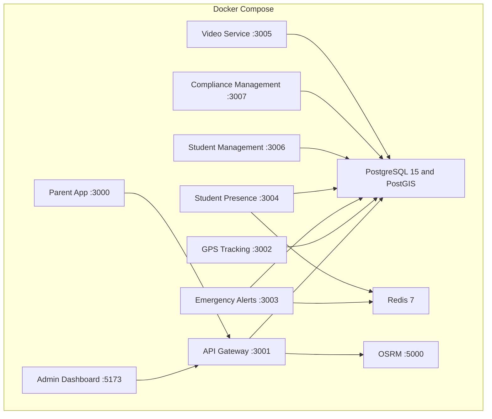

# SBTM v1 Deployment Architecture

- Document owner: Engineering and Architecture
- Last reviewed: 2026-03-30
- Primary use: Runtime topology for local development and target production deployment

## Purpose

This document describes how the platform is deployed today in local environments and what production-oriented topology the architecture is targeting.

## Environment Matrix

| Property         | Local Development              | Demo and Staging Target                | Production Target                                          |
| ---------------- | ------------------------------ | -------------------------------------- | ---------------------------------------------------------- |
| Orchestration    | Docker Compose                 | Docker Compose or container platform   | Container platform with managed secrets and backups        |
| Gateway exposure | Local port mapping             | Reverse-proxied HTTPS                  | Reverse-proxied HTTPS                                      |
| Database         | Shared PostgreSQL container    | Managed or dedicated PostgreSQL        | Managed PostgreSQL with backup and recovery                |
| Queue and cache  | Redis container                | Managed or dedicated Redis             | Managed Redis or resilient queue and cache tier            |
| Object storage   | Local or MinIO                 | MinIO or managed S3-compatible storage | Managed object storage with encryption and lifecycle rules |
| Client delivery  | Local Vite or static container | Static hosting or containerized UI     | Production web hosting and mobile release pipelines        |

## Current Local Topology

## Production-Oriented Topology

- Run the API gateway as the externally exposed backend surface.
- Keep domain services internal to the network boundary.
- Use managed PostgreSQL, Redis, and object storage where practical.
- Terminate TLS at the ingress layer and preserve encrypted traffic where required by platform policy.
- Separate secret management from static configuration.
- Add backup, restore, and observability infrastructure before claiming production readiness.

## Deployment Principles

- Keep services independently deployable where possible.
- Avoid baking tenant-specific secrets or configuration into images.
- Prefer health checks and readiness gating to blind service startup order.
- Treat the current Docker Compose stack as the development baseline, not the final production posture.

## Operational Dependencies

- API Gateway depends on PostgreSQL and downstream service reachability.
- API Gateway uses OSRM (port 5000) for route geometry and optimization.
- Emergency Alerts and Student Presence depend on Redis in addition to PostgreSQL.
- Video workflows depend on object storage configuration consistency.
- Admin and Parent UIs depend on the gateway being reachable at the configured base URL.
- OSRM requires pre-processed map data (Ottawa region) mounted at `/data/ottawa.osrm`.

## Traceability

- Primary requirements: OPS-DEPLOY-001, OPS-DEPLOY-002, NFR-AVAIL-001, NFR-DATA-001, PR-RESIDENCY-001
- Primary use cases: UC-LOGIN-001, UC-MONITOR-001, UC-DRIVER-001
