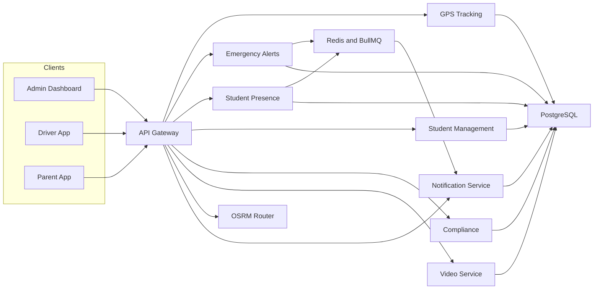
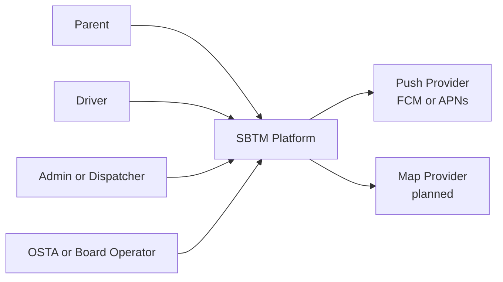
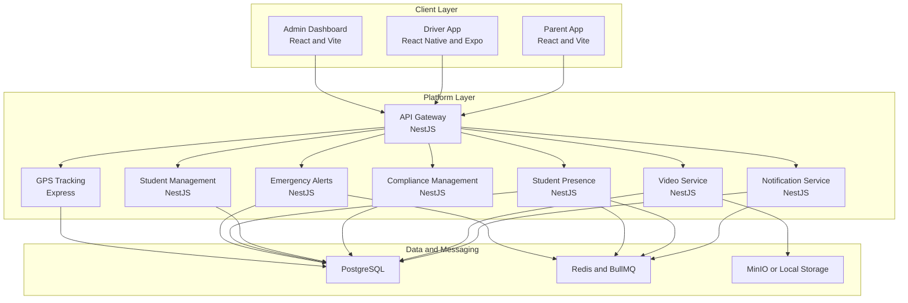
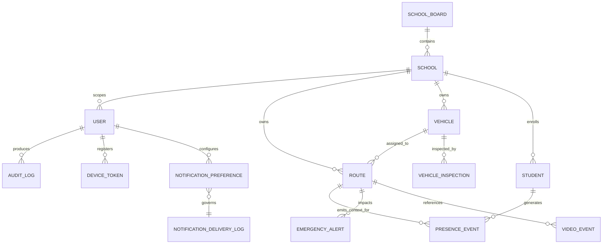
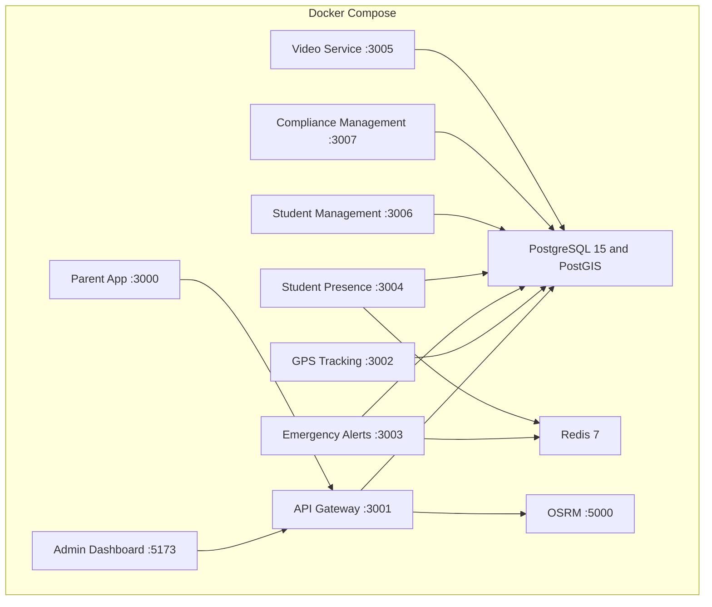
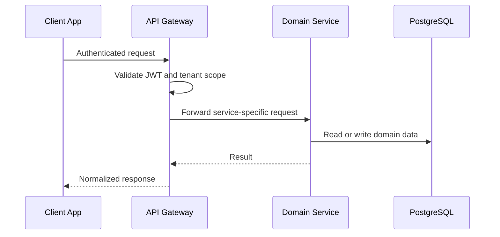
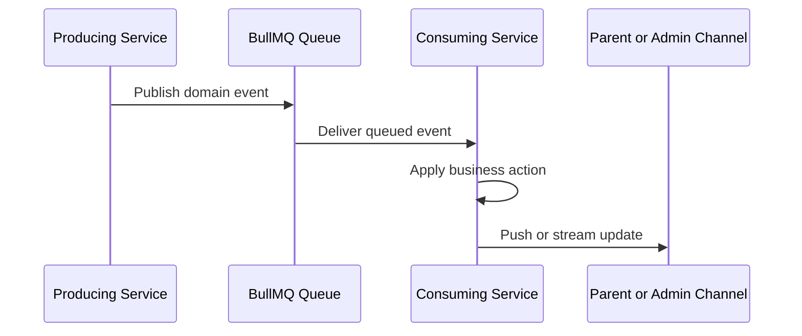
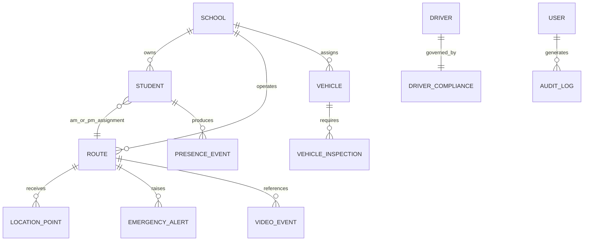
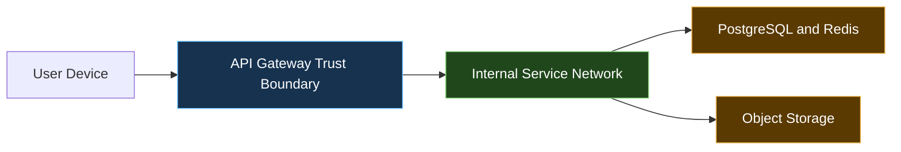

# Design - Complete Reference

## Table of Contents

- [Architecture](#architecture)
- [SystemArchitecture](#systemarchitecture)
- [DatabaseSchema](#databaseschema)
- [DeploymentArchitecture](#deploymentarchitecture)
- [EventCatalog](#eventcatalog)
- [IntegrationArchitecture](#integrationarchitecture)
- [DataArchitecture](#dataarchitecture)
- [SecurityPrivacyArchitecture](#securityprivacyarchitecture)
- [DataRetention](#dataretention)
- [TechnicalSpecifications](#technicalspecifications)

---

## Architecture

_Source: `docs/Design/Architecture.md`_

# SBTM v1 Architecture Overview

- Document owner: Engineering and Architecture
- Last reviewed: 2026-03-30
- Primary use: Entry point for the split v1 architecture document set

This document is the architectural index for the SBTM v1 target state. It separates the design into focused concerns so business, data, integration, deployment, and privacy decisions can evolve without overloading a single file.

## Related Documents

- [SystemArchitecture.md](SystemArchitecture.md)
- [DataArchitecture.md](DataArchitecture.md)
- [IntegrationArchitecture.md](IntegrationArchitecture.md)
- [DeploymentArchitecture.md](DeploymentArchitecture.md)
- [SecurityPrivacyArchitecture.md](SecurityPrivacyArchitecture.md)
- [TechnicalSpecifications.md](TechnicalSpecifications.md)
- [EventCatalog.md](EventCatalog.md)
- [../../Business/Requirements.md](../../Business/Requirements.md)
- [../../prd/GapAnalysis.md](../../prd/GapAnalysis.md)
- [../../prd/v4/GapAnalysis.md](../../prd/v4/GapAnalysis.md) (v4 Business Gap Analysis)
- [../../prd/v4/RolesAndWorkflows.md](../../prd/v4/RolesAndWorkflows.md) (v4 Roles and Workflows)
- [../../prd/v4/AlertStrategy.md](../../prd/v4/AlertStrategy.md) (v4 Alert Strategy)
- [../../prd/v4/IntegrationAndMigration.md](../../prd/v4/IntegrationAndMigration.md) (v4 Integration)
- [../../prd/v4/UpgradePlan.md](../../prd/v4/UpgradePlan.md) (v4 Upgrade Plan)

## Architecture Intent

The v1 architecture evolves the current prototype into a more coherent event-aware platform for school transportation operations. The design goals are:

- Keep tenant boundaries explicit across apps, services, and data.
- Support field resilience for driver workflows with intermittent connectivity.
- Improve parent and operator situational awareness through timely event propagation.
- Preserve a practical path from local Docker Compose delivery to a production-capable deployment model.
- Treat privacy, auditability, and child-safety workflows as core architectural concerns rather than late additions.

## Document Map

| Document                                                         | Primary Question It Answers                                                           |
| ---------------------------------------------------------------- | ------------------------------------------------------------------------------------- |
| [SystemArchitecture.md](SystemArchitecture.md)                   | How do users, applications, services, and core runtime boundaries fit together?       |
| [DataArchitecture.md](DataArchitecture.md)                       | What data domains exist, who owns them, and how are tenant boundaries expressed?      |
| [DatabaseSchema.md](DatabaseSchema.md)                           | What persisted tables and entities currently exist across services?                   |
| [DataRetention.md](DataRetention.md)                             | How long should operational and privacy-sensitive data be retained?                   |
| [IntegrationArchitecture.md](IntegrationArchitecture.md)         | How do requests, events, queues, and external dependencies interact?                  |
| [DeploymentArchitecture.md](DeploymentArchitecture.md)           | How does the platform run locally today and what is the intended production topology? |
| [SecurityPrivacyArchitecture.md](SecurityPrivacyArchitecture.md) | How are identity, access control, privacy, audit, and operational trust handled?      |
| [TechnicalSpecifications.md](TechnicalSpecifications.md)         | What technologies, interfaces, and technical constraints define v1?                   |
| [EventCatalog.md](EventCatalog.md)                               | What domain events are expected across the event-driven architecture?                 |

## Cross-Cutting Principles

- Event-aware, not event-only: request-response remains important, but state changes that matter operationally should become publishable events.
- Multi-tenant by design: tenant context is not optional metadata.
- Operational transparency: health, alerts, and delivery gaps must be observable.
- Privacy by design: tracking, notification, and audit workflows must minimize avoidable exposure of child-related data.
- Replace narrative assumptions with traceable artifacts: business requirements, use cases, and architecture should reference one another directly.

## Architecture Summary Diagram



## Source-of-Truth Boundaries

- Use `docs/Design` for target-state design and architectural direction.
- Use `docs/Implementation` for code-verified current state.
- Use `docs/prd` for the difference between current delivery and the v1 target.
- Use `docs/prd/v4` for v4 business gap analysis, role/workflow definitions, alert strategy, integration and migration design, upgrade plan, and production rollout guide.

---

## SystemArchitecture

_Source: `docs/Design/SystemArchitecture.md`_

# SBTM v1 System Architecture

- Document owner: Engineering and Architecture
- Last reviewed: 2026-03-30
- Primary use: System context, service boundaries, and core runtime interactions

## Purpose

This document describes the system-level architecture of SBTM: actors, primary applications, backend services, and their responsibility boundaries.

## System Context



## Primary Runtime Components

| Component             | Type                  | Responsibility                                                                              |
| --------------------- | --------------------- | ------------------------------------------------------------------------------------------- |
| Driver App            | Mobile application    | Driver authentication, route execution, GPS updates, presence actions, emergency initiation |
| Parent App            | Web application       | Child tracking, route awareness, safety communications                                      |
| Admin Dashboard       | Web application       | Operational oversight, route management, compliance views, incident awareness               |
| API Gateway           | Edge backend          | Identity, RBAC, tenant scoping, reverse proxying, API normalization                         |
| GPS Tracking          | Domain service        | Live location ingestion and history queries                                                 |
| Emergency Alerts      | Domain service        | Alert persistence and admin-facing real-time channels                                       |
| Student Presence      | Domain service        | Boarding and alighting state, presence event persistence, Redis-backed state                |
| Student Management    | Domain service        | Enrollment, parent linkage, route assignment, roster import                                 |
| Compliance Management | Domain service        | Driver compliance, inspections, and audit records                                           |
| Video Service         | Domain service        | Video event metadata and secure asset workflow                                              |
| Notification Service  | Domain service        | Multi-channel parent notification delivery (push, email, SMS) with preference management    |
| Redis and BullMQ      | Shared infrastructure | Queueing and ephemeral presence or alert state                                              |
| PostgreSQL            | Shared infrastructure | Relational persistence across domain services                                               |
| OSRM                  | Shared infrastructure | Route geometry, optimization, and distance calculations (v5.27.1, Ottawa region data)       |

## Container View



## Responsibility Boundaries

- The API Gateway is the only intended public backend entry point for application traffic.
- Tenant scoping and authorization begin at the gateway, but downstream services still need consistent enforcement.
- Student Presence, Alerts, and GPS form the core operational flow for daily transport execution.
- Student Management and Compliance support the operational context rather than route execution itself.
- Video handling is intentionally separate because storage, upload, and playback concerns differ from core operational events.

## Current-to-Target Notes

- The current platform already runs the gateway, core services, and web clients in Docker Compose.
- The target architecture expects more complete event consumption and parent delivery than currently exists.
- The notification boundary is now implemented as a standalone Notification Service (port 3008) consuming from BullMQ `notifications` queue.

## Traceability

- Primary requirements: FR-IDENT-001, FR-TENANT-001, FR-GPS-001, FR-ALERT-001, FR-PRESENCE-001, FR-STUDENT-001, FR-COMPLIANCE-001
- Primary use cases: UC-LOGIN-001, UC-MONITOR-001, UC-DRIVER-001, UC-PRESENCE-001, UC-PARENT-001

---

## DatabaseSchema

_Source: `docs/Design/DatabaseSchema.md`_

# SBTM v1 Database Schema Reference

- Document owner: Engineering and Architecture
- Last reviewed: 2026-03-30
- Primary use: Schema-level reference for persisted tables, ownership, and tenant-sensitive fields

## Purpose

This document summarizes the persisted data structures currently visible in the codebase across the gateway and domain services. It is a schema reference, not a migration ledger.

## Schema Ownership by Service

| Service               | Key Tables or Entities                                                                            | Tenant Anchor                    |
| --------------------- | ------------------------------------------------------------------------------------------------- | -------------------------------- |
| API Gateway           | `users`, `school_boards`, `schools`, `routes`, `route_stops`, `vehicles`                          | `boardId`, `schoolId`            |
| GPS Tracking          | `location_points`, `route_lifecycle_events`, `route_geofences`, `route_deviation_events` (Prisma) | `schoolId` in telemetry payloads |
| Emergency Alerts      | emergency alerts, notification logs                                                               | `schoolId`                       |
| Student Presence      | presence events, student tags                                                                     | `schoolId`                       |
| Student Management    | `students`                                                                                        | `school_id`                      |
| Compliance Management | `driver_compliance`, `vehicle_inspections`, `audit_logs`                                          | `school_id`                      |
| Video Service         | `video_events`, access logs                                                                       | `school_id`                      |
| Notification Service  | `device_tokens`, `notification_preferences`, `notification_delivery_log`                          | `schoolId`                       |

## Logical Relationships



## Core Tables

### API Gateway Identity and Tenancy

| Table           | Key Columns                                                                                                                                                                                        | Notes                                                                                                                  |
| --------------- | -------------------------------------------------------------------------------------------------------------------------------------------------------------------------------------------------- | ---------------------------------------------------------------------------------------------------------------------- |
| `users`         | `id`, `email`, `passwordHash` (nullable), `role`, `phone` (nullable), `schoolId`, `boardId`, `driverId`, `childRouteIds`, `assignedRouteIds`, `isActive`, `invitationToken`, `invitationExpiresAt` | Role and route-assignment context lives here. Invitation-based onboarding supported. Phone used for SMS notifications. |
| `school_boards` | `id`, `name`                                                                                                                                                                                       | Board catalog                                                                                                          |
| `schools`       | `id`, `name`, `boardId`                                                                                                                                                                            | School-to-board relationship                                                                                           |
| `routes`        | `id`, `schoolId`, `name`, `direction`, `vehicleId`, `startTime`, `estimatedDuration`                                                                                                               | Unique on `schoolId + name`                                                                                            |
| `vehicles`      | `id`, `schoolId`, `licensePlate`, `status`                                                                                                                                                         | Unique on `schoolId + licensePlate`                                                                                    |

### Student and Presence Domain

| Table                                              | Key Columns                                                                                                 | Notes                                                   |
| -------------------------------------------------- | ----------------------------------------------------------------------------------------------------------- | ------------------------------------------------------- |
| `students`                                         | `id`, `school_id`, `parent_user_id`, `am_route_id`, `pm_route_id`, `external_student_id`, `status`          | Unique on `school_id + external_student_id`             |
| `presence_event` or `presence_events` entity store | `id`, `schoolId`, `studentId`, `vehicleId`, `routeId`, `eventType`, `timestamp`, `source`, `signalStrength` | Indexed for student-route-time and vehicle-time queries |
| student tag store                                  | `studentId`, `tagId`, tag metadata                                                                          | Used for SmartTag support                               |

### GPS Tracking Domain (Prisma-managed)

| Table                    | Key Columns                                                                        | Notes                                            |
| ------------------------ | ---------------------------------------------------------------------------------- | ------------------------------------------------ |
| `location_points`        | `vehicle_id`, `route_id`, `school_id`, `timestamp`, `lat`, `lng`, telemetry fields | Core GPS breadcrumb storage                      |
| `route_lifecycle_events` | `route_id`, `event_type`, `timestamp`                                              | Route execution events (start, stop, completion) |
| `route_geofences`        | `route_id`, `corridor_threshold`, `stop_proximity`, `deviation_threshold`          | Per-route configurable geofence parameters       |
| `route_deviation_events` | `route_id`, `vehicle_id`, `deviation_meters`, `threshold`, `timestamp`             | Immutable deviation audit log                    |

### Alerts and Video Domain

| Table                         | Key Columns                                                                                                                                     | Notes                                            |
| ----------------------------- | ----------------------------------------------------------------------------------------------------------------------------------------------- | ------------------------------------------------ |
| emergency alerts entity store | `id`, `schoolId`, `vehicleId`, `routeId`, `driverId`, `timestamp`, `lat`, `lng`, `eventType`, `status`                                          | Core incident record                             |
| `video_events`                | `id`, `school_id`, `vehicle_id`, `route_id`, `driver_id`, `timestamp`, `event_type`, `duration_seconds`, `status`, `video_url`, `thumbnail_url` | Indexed on vehicle, route, timestamp, and status |
| video access log store        | event access metadata                                                                                                                           | Used for auditability of playback                |

### Compliance Domain

| Table                 | Key Columns                                                                                                           | Notes                            |
| --------------------- | --------------------------------------------------------------------------------------------------------------------- | -------------------------------- |
| `driver_compliance`   | `id`, `driver_id`, `school_id`, expiry dates, `status`                                                                | Unique on `driver_id`            |
| `vehicle_inspections` | `id`, `vehicle_id`, `driver_id`, `school_id`, `type`, `is_passed`, `checklist_json`, `photo_urls`                     | Inspection history               |
| `audit_logs`          | `id`, `user_id`, `school_id`, `action`, `resource`, `resource_id`, `details`, `ip_address`, `user_agent`, `createdAt` | Operational and compliance trail |

### Notification Service Domain

| Table                       | Key Columns                                                                                                                  | Notes                                                                  |
| --------------------------- | ---------------------------------------------------------------------------------------------------------------------------- | ---------------------------------------------------------------------- |
| `device_tokens`             | `id`, `userId`, `schoolId`, `token`, `platform` (android/ios/web), `isActive`                                                | Unique on `userId + token`. Indexed on `userId, isActive`              |
| `notification_preferences`  | `id`, `userId`, `schoolId`, `eventType`, `channel`, `enabled`                                                                | Unique on `userId + eventType + channel`. EMERGENCY cannot be disabled |
| `notification_delivery_log` | `id`, `schoolId`, `recipientUserId`, `eventType`, `eventSourceId`, `channel`, `status`, `providerMessageId`, `failureReason` | Unified audit trail for all notification deliveries                    |

## Tenant and Privacy Notes

- `schoolId` or `school_id` is the main tenant boundary across services.
- Naming is not yet fully normalized between services.
- Parent linkage, route assignment, presence, GPS, and video metadata become sensitive when combined and should be handled as regulated operational data.

## Known Schema Caveats

- The current documentation reflects code-visible entities, not a complete migration inventory.
- Some services use shared infrastructure while still relying on logical rather than DB-enforced isolation.
- GPS tables (`location_points`, `route_lifecycle_events`, `route_geofences`, `route_deviation_events`) are Prisma-managed and defined in the GPS service's Prisma schema, not TypeORM entities.
- Column naming is not yet fully normalized: API Gateway uses camelCase (`schoolId`), while domain services use snake_case (`school_id`).

## Related Documents

- [DataArchitecture.md](DataArchitecture.md)
- [DataRetention.md](DataRetention.md)
- [SecurityPrivacyArchitecture.md](SecurityPrivacyArchitecture.md)

---

## DeploymentArchitecture

_Source: `docs/Design/DeploymentArchitecture.md`_

# SBTM v1 Deployment Architecture

- Document owner: Engineering and Architecture
- Last reviewed: 2026-03-30
- Primary use: Runtime topology for local development and target production deployment

## Purpose

This document describes how the platform is deployed today in local environments and what production-oriented topology the architecture is targeting.

## Environment Matrix

| Property         | Local Development              | Demo and Staging Target                | Production Target                                          |
| ---------------- | ------------------------------ | -------------------------------------- | ---------------------------------------------------------- |
| Orchestration    | Docker Compose                 | Docker Compose or container platform   | Container platform with managed secrets and backups        |
| Gateway exposure | Local port mapping             | Reverse-proxied HTTPS                  | Reverse-proxied HTTPS                                      |
| Database         | Shared PostgreSQL container    | Managed or dedicated PostgreSQL        | Managed PostgreSQL with backup and recovery                |
| Queue and cache  | Redis container                | Managed or dedicated Redis             | Managed Redis or resilient queue and cache tier            |
| Object storage   | Local or MinIO                 | MinIO or managed S3-compatible storage | Managed object storage with encryption and lifecycle rules |
| Client delivery  | Local Vite or static container | Static hosting or containerized UI     | Production web hosting and mobile release pipelines        |

## Current Local Topology



## Production-Oriented Topology

- Run the API gateway as the externally exposed backend surface.
- Keep domain services internal to the network boundary.
- Use managed PostgreSQL, Redis, and object storage where practical.
- Terminate TLS at the ingress layer and preserve encrypted traffic where required by platform policy.
- Separate secret management from static configuration.
- Add backup, restore, and observability infrastructure before claiming production readiness.

## Deployment Principles

- Keep services independently deployable where possible.
- Avoid baking tenant-specific secrets or configuration into images.
- Prefer health checks and readiness gating to blind service startup order.
- Treat the current Docker Compose stack as the development baseline, not the final production posture.

## Operational Dependencies

- API Gateway depends on PostgreSQL and downstream service reachability.
- API Gateway uses OSRM (port 5000) for route geometry and optimization.
- Emergency Alerts and Student Presence depend on Redis in addition to PostgreSQL.
- Video workflows depend on object storage configuration consistency.
- Admin and Parent UIs depend on the gateway being reachable at the configured base URL.
- OSRM requires pre-processed map data (Ottawa region) mounted at `/data/ottawa.osrm`.

## Traceability

- Primary requirements: OPS-DEPLOY-001, OPS-DEPLOY-002, NFR-AVAIL-001, NFR-DATA-001, PR-RESIDENCY-001
- Primary use cases: UC-LOGIN-001, UC-MONITOR-001, UC-DRIVER-001

---

## EventCatalog

_Source: `docs/Design/EventCatalog.md`_

# SBTM v1 – Event Catalog

- Document owner: Engineering and Architecture
- Last reviewed: 2026-03-30
- Primary use: Domain event definitions for the event-aware integration model

This catalog defines the domain events in the SBTM v1 architecture. Each entry lists the event name, producer service, consumer services, trigger, and payload shape.

## Related Documents

- [Architecture.md](Architecture.md)
- [IntegrationArchitecture.md](IntegrationArchitecture.md)
- [TechnicalSpecifications.md](TechnicalSpecifications.md)
- [../../Business/Requirements.md](../../Business/Requirements.md)

---

## Naming Convention

`<aggregate>.<past-participle>`

Examples: `location.updated`, `alert.created`, `presence.boarded`

---

## Events

### `location.updated`

| Field         | Value                                                             |
| ------------- | ----------------------------------------------------------------- |
| **Producer**  | GPS Tracking Service                                              |
| **Consumers** | Geofencing / Deviation Alert Service, Analytics (Phase 3)         |
| **Trigger**   | A new GPS location point is ingested via `POST /api/v1/locations` |
| **Queue**     | `gps` (BullMQ)                                                    |
| **Status**    | **Implemented — Phase 3**                                         |

**Payload**:

```json
{
  "vehicleId": "uuid",
  "routeId": "uuid",
  "schoolId": "uuid",
  "lat": 43.6532,
  "lng": -79.3832,
  "speedKph": 40.2,
  "headingDeg": 270,
  "accuracyMeters": 5
}
```

---

### `route.deviation`

| Field         | Value                                                                                 |
| ------------- | ------------------------------------------------------------------------------------- |
| **Producer**  | GPS Tracking Service (GeofenceService)                                                |
| **Consumers** | Emergency Alerts Service, Notification Service (Phase 3+)                             |
| **Trigger**   | Vehicle position exceeds configured `deviationThresholdMeters` for its route geofence |
| **Queue**     | `gps` (BullMQ)                                                                        |
| **Status**    | **Implemented — Phase 3**                                                             |

**Payload**:

```json
{
  "vehicleId": "uuid",
  "routeId": "uuid",
  "schoolId": "uuid",
  "lat": 43.71,
  "lng": -79.5,
  "deviationMeters": 450.0,
  "threshold": 300.0,
  "timestamp": "2026-03-25T08:30:00Z"
}
```

**Downstream actions** (planned):

- Emergency Alerts Service creates a ROUTE_DEVIATION alert.
- Notification Service notifies school admin of operational deviation.

---

### `alert.created`

| Field         | Value                                                                   |
| ------------- | ----------------------------------------------------------------------- |
| **Producer**  | Emergency Alerts Service                                                |
| **Consumers** | Notification Service                                                    |
| **Trigger**   | A panic, route deviation, medical, or other emergency event is recorded |
| **Queue**     | `alerts` (BullMQ)                                                       |

**Payload**:

```json
{
  "alertId": "uuid",
  "vehicleId": "uuid",
  "routeId": "uuid",
  "schoolId": "uuid",
  "eventType": "PANIC_BUTTON",
  "location": { "lat": 43.6532, "lng": -79.3832 },
  "driverId": "uuid"
}
```

**Downstream actions**:

- Notification Service sends push notification to all parents on the route.
- Admin Dashboard WebSocket broadcast (via `WebsocketGateway`).

---

### `presence.boarded`

| Field         | Value                                                               |
| ------------- | ------------------------------------------------------------------- |
| **Producer**  | Student Presence Service                                            |
| **Consumers** | Notification Service                                                |
| **Trigger**   | A `BOARD` presence event is persisted (BLE scan or manual override) |
| **Queue**     | `presence` (BullMQ)                                                 |

**Payload**:

```json
{
  "studentId": "uuid",
  "vehicleId": "uuid",
  "routeId": "uuid",
  "schoolId": "uuid",
  "source": "MANUAL",
  "timestamp": "2024-09-03T07:45:00Z"
}
```

**Downstream actions**:

- Notification Service sends "Your child has boarded the bus" push to parent.

---

### `presence.alighted`

| Field         | Value                                                                    |
| ------------- | ------------------------------------------------------------------------ |
| **Producer**  | Student Presence Service                                                 |
| **Consumers** | Notification Service                                                     |
| **Trigger**   | An `ALIGHT` presence event is persisted (BLE timeout or manual override) |
| **Queue**     | `presence` (BullMQ)                                                      |

**Payload**:

```json
{
  "studentId": "uuid",
  "vehicleId": "uuid",
  "routeId": "uuid",
  "schoolId": "uuid",
  "source": "SMARTTAG",
  "timestamp": "2024-09-03T08:10:00Z"
}
```

**Downstream actions**:

- Notification Service sends "Your child has alighted the bus" push to parent.

---

## Event Bus Topology (BullMQ)

```
Producer            Queue Name      Consumer
─────────────────────────────────────────────────────
GPS Tracking        gps             (Phase 3: Geofencing)
Emergency Alerts    alerts          Notification Service
Student Presence    presence        Notification Service
Presence/Alerts     notifications   Notification Service
```

All queues use:

- **Concurrency**: 5 workers per queue
- **Backoff**: exponential, starting at 1 s, max 30 s
- **Max retries**: 5
- **Job retention**: completed jobs kept for 1 h, failed jobs kept for 24 h

---

### `notification.requested`

| Field         | Value                                              |
| ------------- | -------------------------------------------------- |
| **Producer**  | Student Presence Service, Emergency Alerts Service |
| **Consumers** | Notification Service                               |
| **Trigger**   | A presence or alert event requires parent delivery |
| **Queue**     | `notifications` (BullMQ)                           |
| **Status**    | **Implemented — Phase A**                          |

**Payload**:

```json
{
  "eventType": "BOARD | ALIGHT | EMERGENCY",
  "eventSourceId": "uuid",
  "recipientUserId": "uuid",
  "schoolId": "uuid",
  "routeId": "uuid",
  "studentId": "uuid",
  "emergencyType": "PANIC_BUTTON (optional, EMERGENCY only)"
}
```

**Downstream actions**:

- Notification Service checks parent preferences and delivers via enabled channels (push, email, SMS).
- EMERGENCY events bypass preferences and deliver on all channels with SMS escalation on push failure.
- Delivery status logged in `notification_delivery_log`.

---

## IntegrationArchitecture

_Source: `docs/Design/IntegrationArchitecture.md`_

# SBTM v1 Integration Architecture

- Document owner: Engineering and Architecture
- Last reviewed: 2026-03-30
- Primary use: Request flows, event flows, and external dependency interaction patterns

## Purpose

This document describes how SBTM integrates across its internal service boundaries and planned external dependencies.

## Integration Modes

| Mode                             | Current State                             | Target Direction                                             |
| -------------------------------- | ----------------------------------------- | ------------------------------------------------------------ |
| Request-response via API Gateway | Primary integration mode                  | Remains the main application interaction pattern             |
| Domain events via BullMQ         | Partial                                   | Becomes the main decoupling mechanism for operational events |
| Real-time updates                | Mixed polling, SSE, and WebSocket support | Move toward event-driven delivery where practical            |
| External integrations            | Limited today                             | Map provider and push provider integration later             |

## Core Request Flow



## Core Event Flow



## Key Integration Paths

| Path                                                 | Purpose                                  | Current State          |
| ---------------------------------------------------- | ---------------------------------------- | ---------------------- |
| Driver App -> API Gateway -> GPS Tracking            | Live route telemetry                     | Implemented            |
| Driver App -> API Gateway -> Student Presence        | Boarding and alighting events            | Partial end to end     |
| Driver App -> API Gateway -> Emergency Alerts        | Panic and incident workflows             | Implemented            |
| Parent App -> API Gateway -> tracking and alert data | Child visibility                         | Partial, polling-heavy |
| Admin Dashboard -> API Gateway -> domain services    | Operations monitoring and administration | Implemented            |
| Alerts and Presence -> BullMQ                        | Event publication                        | Partial                |
| BullMQ -> Notification workflow                      | Parent-facing delivery                   | Implemented (Phase A)  |
| Notification Service -> FCM / Email / SMS            | Multi-channel parent delivery            | Implemented (dry-run)  |

## External Dependencies

| Dependency                        | Purpose                                                 | Status                                          |
| --------------------------------- | ------------------------------------------------------- | ----------------------------------------------- |
| Push provider such as FCM or APNs | Parent alert and presence notifications                 | Implemented (dry-run mode, Phase A)             |
| Email provider (SMTP)             | Non-urgent parent notifications and daily summaries     | Implemented (dry-run mode, Phase A)             |
| SMS provider (Twilio)             | Emergency escalation SMS delivery                       | Implemented (dry-run mode, Phase A)             |
| OSRM (self-hosted)                | Route geometry, optimization, and distance calculations | Implemented (v5.27.1, Ottawa region, port 5000) |
| Object storage                    | Video upload and playback                               | Implemented via MinIO or local storage          |

## Integration Gaps

- GPS currently persists location data without publishing `location.updated` events.
- Parent alert delivery still relies heavily on polling despite backend SSE support.
- Service-to-service authentication remains a planned hardening step.

## Event Envelope Expectations

- Every operational event should carry a stable `eventId`.
- Tenant context such as `schoolId` should be mandatory.
- Events should be versioned so consumers can evolve safely.
- Retry and dead-letter handling should be observable rather than silent.

## Traceability

- Primary requirements: FR-GPS-001, FR-ALERT-001, FR-PARENT-002, NFR-PERF-001, NFR-PERF-002, NFR-RESIL-001, OPS-MON-001
- Primary use cases: UC-DRIVER-001, UC-PRESENCE-001, UC-PARENT-001, UC-INCIDENT-001

---

## DataArchitecture

_Source: `docs/Design/DataArchitecture.md`_

# SBTM v1 Data Architecture

- Document owner: Engineering and Architecture
- Last reviewed: 2026-03-30
- Primary use: Data domain ownership, tenant boundaries, and persistence patterns

## Purpose

This document describes the major data domains in SBTM, who owns them, and how tenant boundaries and operational traceability are represented.

## Related Documents

- [DatabaseSchema.md](DatabaseSchema.md)
- [DataRetention.md](DataRetention.md)
- [SecurityPrivacyArchitecture.md](SecurityPrivacyArchitecture.md)

## Data Domains

| Domain               | Primary Owner         | Core Entities                                               | Notes                                                                  |
| -------------------- | --------------------- | ----------------------------------------------------------- | ---------------------------------------------------------------------- |
| Identity and tenancy | API Gateway           | users, boards, schools, routes, vehicles                    | Gateway currently owns much of the tenancy and operational master data |
| Tracking             | GPS Tracking          | location points, live route status                          | Time-series style writes and historical query patterns                 |
| Presence             | Student Presence      | presence events, route occupancy state, SmartTag detections | Mix of durable records and cached current state                        |
| Student records      | Student Management    | students, route assignments, parent linkage                 | Tenant-scoped roster and assignment data                               |
| Alerts               | Emergency Alerts      | emergency alerts, delivery attempts or stubs                | Real-time operational incident context                                 |
| Compliance           | Compliance Management | driver compliance, vehicle inspections, audit logs          | Operational readiness and accountability data                          |
| Video                | Video Service         | video events, upload status, playback metadata              | Metadata in DB, assets in object storage or local storage              |

## Logical Data Model



## Tenant Boundary Rules

- `school_id` is the current cross-service tenant boundary and must accompany operational records.
- `board` and `school` hierarchy is expressed at the gateway level and should flow to downstream access decisions.
- Shared infrastructure is acceptable for the current prototype, but data access must continue to respect tenant-scoped filtering.

## Persistence Patterns

| Pattern                         | Current Usage                          | Implication                                                                |
| ------------------------------- | -------------------------------------- | -------------------------------------------------------------------------- |
| Shared PostgreSQL instance      | Used across services in local delivery | Fast to operate, but demands stronger logical boundaries                   |
| Per-service entities            | Services own their own ORM entities    | Good for modularity, but still depends on shared DB discipline             |
| Redis-backed transient state    | Presence and alert flows               | Supports low-latency state and job processing                              |
| Object storage or local storage | Video assets                           | Allows metadata to stay in relational storage while assets remain external |

## Sensitive Data Notes

- Student identity and route assignment data are privacy-sensitive because they can reveal child location context.
- Audit data is operationally sensitive because it can expose user behavior and investigative context.
- GPS and presence data can become highly sensitive when correlated over time.

## Data Lifecycle Considerations

- Retention and purge rules are not yet fully implemented and remain a required future control.
- Location, presence, and audit domains should be documented with explicit retention schedules before production rollout.
- Backups must be tenant-safe and support point-in-time operational recovery.

## Traceability

- Primary requirements: FR-TENANT-001, FR-GPS-001, FR-PRESENCE-002, FR-STUDENT-001, FR-COMPLIANCE-001, PR-TENANT-001, PR-RETENTION-001
- Primary use cases: UC-ONBOARD-001, UC-PRESENCE-001, UC-PARENT-001, UC-COMPLIANCE-001

---

## SecurityPrivacyArchitecture

_Source: `docs/Design/SecurityPrivacyArchitecture.md`_

# SBTM v1 Security and Privacy Architecture

- Document owner: Engineering and Architecture
- Last reviewed: 2026-03-30
- Primary use: Identity, access, privacy, audit, and trust boundaries

## Purpose

This document captures the security and privacy architecture for SBTM with emphasis on child-safety data, tenant isolation, and operational accountability.

## Related Documents

- [DataArchitecture.md](DataArchitecture.md)
- [DatabaseSchema.md](DatabaseSchema.md)
- [DataRetention.md](DataRetention.md)
- [../../Operations/Runbooks.md](../../Operations/Runbooks.md)

## Security and Privacy Principles

- Authenticate once at the platform edge and propagate only the context needed downstream.
- Enforce least privilege by role and tenant scope.
- Treat student, location, and presence data as sensitive operational information.
- Design for auditability without over-collecting personal data.
- Prefer privacy-by-design decisions over retrofitted controls.

## Identity and Access Model

| Concern                  | Current State                         | Target Direction                                        |
| ------------------------ | ------------------------------------- | ------------------------------------------------------- |
| User authentication      | JWT via API Gateway                   | Continue at gateway with stronger session hardening     |
| Role enforcement         | Gateway RBAC                          | Expand consistent downstream authorization expectations |
| Tenant enforcement       | `school_id` filtering and scoped APIs | Add stronger DB and service-level guarantees            |
| Service-to-service trust | Limited or absent                     | Internal JWT or mTLS before production rollout          |

## Trust Boundaries



## Sensitive Data Categories

| Category                     | Examples                                           | Primary Controls Needed                                    |
| ---------------------------- | -------------------------------------------------- | ---------------------------------------------------------- |
| Student-linked identity data | student names, parent linkage, route assignment    | Tenant scoping, access minimization, audit                 |
| Live operational telemetry   | GPS positions, boarding and alighting events       | Access control, retention policy, observability safeguards |
| Incident records             | alerts, inspections, audit history, video metadata | Restricted access, integrity, traceability                 |
| Credentials and secrets      | JWT secrets, provider keys, storage credentials    | Externalized secret management, rotation, least exposure   |

## Privacy Controls

- Keep data collection limited to transport safety and operational service delivery.
- Avoid exposing full student operational histories to roles that do not require them.
- Prefer role-specific summaries over broad raw-data access in UI surfaces.
- Define retention and deletion workflows before production rollout, especially for location, presence, audit, and video data.
- Align deployment choices to Canadian data residency expectations where contractually or regulatorily required.

## Security Gaps to Close

- Database-level tenant hardening, including RLS where feasible.
- Service-to-service trust for internal calls.
- Centralized audit coverage across all critical service mutations.
- Stronger browser session hardening for parent-facing workflows.
- Formalized key rotation, backup protection, and incident response procedures.

## Traceability

- Primary requirements: SR-AUTH-001, SR-RBAC-001, SR-SVC-001, SR-AUDIT-001, PR-RESIDENCY-001, PR-MINIMIZE-001, PR-TENANT-001, PR-RETENTION-001, NFR-DATA-001
- Primary use cases: UC-LOGIN-001, UC-PARENT-001, UC-INCIDENT-001, UC-COMPLIANCE-001

---

## DataRetention

_Source: `docs/Design/DataRetention.md`_

# SBTM v1 Data Retention and Lifecycle

- Document owner: Engineering and Product
- Last reviewed: 2026-03-30
- Primary use: Retention, archival, deletion, and privacy-oriented lifecycle guidance for operational data

## Purpose

This document defines the target retention posture for major data classes in SBTM. It exists to support privacy-by-design planning and operational governance. It does not claim that automated retention enforcement is fully implemented today.

## Lifecycle Principles

- Minimize retained student-linked operational data to what is necessary for safety, support, and compliance.
- Keep retention rules explicit by data class rather than relying on indefinite default storage.
- Preserve auditability for regulated and safety-relevant actions while still planning for lawful deletion and archival.
- Align hosting and operational procedures with Canadian data residency expectations where required.

## Retention Matrix

| Data Class                  | Examples                                               | Operational Need                                                | Target Retention                                                                                   | Intended Action After Retention                          |
| --------------------------- | ------------------------------------------------------ | --------------------------------------------------------------- | -------------------------------------------------------------------------------------------------- | -------------------------------------------------------- |
| User identity records       | user accounts, role assignments, school or board links | Active platform access                                          | Keep while account is active and for a bounded post-deactivation support window                    | Archive or purge after policy-defined offboarding period |
| Route and fleet master data | routes, stops, vehicles                                | Operational baseline                                            | Keep while active and for historical reporting window                                              | Archive superseded records if needed                     |
| Student roster records      | student identity, route assignments, parent linkage    | Daily operations and support                                    | Keep while student is actively served and for a limited operational support window after departure | Archive or purge according to tenant policy              |
| GPS telemetry               | live and historical location points                    | Live operations, incident review, limited analytics             | Shorter retention than master data; avoid indefinite storage                                       | Aggregate, archive, or purge                             |
| Presence events             | boarding and alighting records                         | Parent communication, operational traceability, incident review | Medium retention with explicit limit                                                               | Archive summary or purge detailed event history          |
| Emergency alerts            | incident records and status                            | Safety follow-up and audit                                      | Retain through investigation and reporting window                                                  | Archive and eventually purge under policy                |
| Compliance records          | driver compliance, inspections                         | Safety and regulatory support                                   | Retain according to school-board or regulatory obligations                                         | Archive with controlled access                           |
| Audit logs                  | critical mutations, access traces                      | Accountability and investigation                                | Retain longer than routine operational data                                                        | Archive with restricted access                           |
| Video metadata and assets   | video events, recordings, thumbnails                   | Incident handling and evidence review                           | Highly policy-sensitive and should be minimized                                                    | Secure deletion or archival under strict controls        |

## Recommended Policy Direction

| Data Class          | Recommended Direction                                                             |
| ------------------- | --------------------------------------------------------------------------------- |
| GPS telemetry       | Prefer short default retention with optional aggregation for reporting            |
| Presence events     | Retain long enough for operational disputes and support, but not indefinitely     |
| Student roster data | Retain based on active service relationship and defined offboarding workflow      |
| Audit logs          | Retain longer than operational telemetry because they support accountability      |
| Video               | Require explicit retention rule tied to incident severity and privacy obligations |

## Deletion and Archival Events

The following events should trigger lifecycle review:

- student leaves the service or school
- parent withdraws from service where policy allows data minimization or deletion
- route season or school year ends
- incident investigation closes
- compliance window or audit retention window expires

## Implementation Gaps

- No fully documented or automated purge jobs are currently represented across services.
- No centralized archival workflow exists yet.
- Data retention policy enforcement is still below the level implied by privacy-oriented business requirements.

## Operational Controls Needed

- scheduled purge or archival jobs by data class
- tenant-aware backup retention rules
- documented legal hold or incident hold behavior for alerts, audits, and video
- deletion audit trail so lifecycle actions are themselves traceable

## Related Documents

- [DataArchitecture.md](DataArchitecture.md)
- [DatabaseSchema.md](DatabaseSchema.md)
- [SecurityPrivacyArchitecture.md](SecurityPrivacyArchitecture.md)
- [../../Operations/Runbooks.md](../../Operations/Runbooks.md)

---

## TechnicalSpecifications

_Source: `docs/Design/TechnicalSpecifications.md`_

# SBTM v1 – Technical Specifications

- Document owner: Engineering
- Last reviewed: 2026-03-30
- Primary use: Target-state technical baseline, interfaces, and non-functional design

This document describes the target v1 technical baseline. It should be read with the current-state implementation notes in `docs/Implementation` and the verified upgrade gaps in `docs/prd/GapAnalysis.md`.

## Related Documents

- [Architecture.md](Architecture.md)
- [SystemArchitecture.md](SystemArchitecture.md)
- [DataArchitecture.md](DataArchitecture.md)
- [IntegrationArchitecture.md](IntegrationArchitecture.md)
- [DeploymentArchitecture.md](DeploymentArchitecture.md)
- [SecurityPrivacyArchitecture.md](SecurityPrivacyArchitecture.md)
- [EventCatalog.md](EventCatalog.md)
- [GapAnalysis.md](../prd/GapAnalysis.md)
- [PhaseWiseImplementationPlan.md](../prd/PhaseWiseImplementationPlan.md)
- [TestingGuide.md](../../Test/TestingGuide.md)

## 1. Technology Stack

| Layer                | Technology                                  | Notes                                                                                          |
| -------------------- | ------------------------------------------- | ---------------------------------------------------------------------------------------------- |
| Mobile App (Driver)  | React Native (Expo ~54)                     | GPS, BLE scanning, offline queue via AsyncStorage                                              |
| Web App (Parent)     | Vite + React 19, TailwindCSS                | SSE alert stream, Leaflet map                                                                  |
| Web App (Admin)      | Vite + React 19, TailwindCSS, Leaflet       | Live fleet map, route management                                                               |
| API Gateway          | NestJS **v10.4.15** + TypeORM **v10** + JWT | RBAC, multi-tenant guards, proxy routing. **Note: v10 — other NestJS services are on v11.0.1** |
| GPS Tracking         | Express + Prisma **v5.22.0**                | Location ingest, live/history queries                                                          |
| Emergency Alerts     | NestJS + TypeORM + BullMQ                   | Alert creation, WebSocket broadcast, notification fan-out                                      |
| Student Presence     | NestJS + TypeORM + BullMQ                   | BLE / manual presence, Redis presence cache                                                    |
| Video Service        | NestJS + TypeORM                            | Video event metadata, MinIO/local storage                                                      |
| Student Management   | NestJS + TypeORM                            | Student CRUD, tag assignment, bulk import                                                      |
| Compliance           | NestJS + TypeORM                            | Driver records, inspections, audit log                                                         |
| Notification Service | NestJS + BullMQ                             | FCM/APNs fan-out, notification log                                                             |
| Event Bus            | BullMQ (Redis-backed)                       | Domain event queuing and consumer groups                                                       |
| Relational DB        | PostgreSQL (PostGIS enabled)                | Per-service schemas, `school_id` tenant column                                                 |
| Cache / Queue broker | Redis                                       | BullMQ queues, presence state cache                                                            |
| Object Storage       | MinIO (S3-compatible) or local              | Video file storage                                                                             |
| Route Engine         | OSRM v5.27.1 (self-hosted)                  | Route geometry, optimization, ETA calculations                                                 |

---

## 2. Domain Events

All events are serialised as JSON and published via BullMQ. Each event envelope carries:

```typescript
interface DomainEvent<T = unknown> {
  eventId: string; // UUID v4
  eventType: string; // e.g. "location.updated"
  version: number; // schema version, starts at 1
  schoolId: string; // tenant identifier
  occurredAt: string; // ISO 8601
  payload: T;
}
```

### 2.1 location.updated

Published by: GPS Tracking Service  
Consumed by: (reserved for geofencing/deviation alerts in Phase 3)

```typescript
interface LocationUpdatedPayload {
  vehicleId: string;
  routeId: string;
  lat: number;
  lng: number;
  speedKph: number;
  headingDeg: number;
  accuracyMeters: number;
}
```

### 2.2 alert.created

Published by: Emergency Alerts Service  
Consumed by: Notification Service

```typescript
interface AlertCreatedPayload {
  alertId: string;
  vehicleId: string;
  routeId: string;
  eventType: 'PANIC_BUTTON' | 'ROUTE_DEVIATION' | 'MEDICAL' | 'OTHER';
  location: { lat: number; lng: number };
  driverId?: string;
}
```

### 2.3 presence.boarded

Published by: Student Presence Service  
Consumed by: Notification Service

```typescript
interface PresenceBoardedPayload {
  studentId: string;
  vehicleId: string;
  routeId: string;
  source: 'SMARTTAG' | 'MANUAL' | 'RFID';
  signalStrength?: number;
}
```

### 2.4 presence.alighted

Published by: Student Presence Service  
Consumed by: Notification Service

```typescript
interface PresenceAlightedPayload {
  studentId: string;
  vehicleId: string;
  routeId: string;
  source: 'SMARTTAG' | 'MANUAL' | 'RFID';
}
```

---

## 3. API Contract Additions (v1)

### 3.1 SSE Alert Stream (Parent App)

`GET /api/v1/routes/:routeId/alerts/stream`

Returns a Server-Sent Events stream. Each event is a JSON-serialised alert or presence update.

```
event: alert.created
data: {"alertId":"...","message":"Emergency on your child's bus","routeId":"r1"}

event: presence.alighted
data: {"studentId":"s1","routeId":"r1","message":"Your child has alighted the bus"}
```

### 3.2 Student Presence Event (Driver App)

`POST /api/v1/student-presence-events`

Request body:

```json
{
    "studentId": "uuid",
    "vehicleId": "uuid",
    "routeId": "uuid",
    "eventType": "BOARD" | "ALIGHT",
    "source": "MANUAL",
    "timestamp": "ISO 8601"
}
```

Response: `201 Created`

---

## 4. Offline Queue Specification (Driver App)

The Driver App uses an AsyncStorage-backed queue to buffer events when offline.

### Queue Key Layout

| Key                   | Value                            |
| --------------------- | -------------------------------- |
| `@sbtm/offline_queue` | `JSON.stringify(OfflineEvent[])` |

### OfflineEvent schema

```typescript
interface OfflineEvent {
  id: string; // UUID v4
  type: 'gps' | 'emergency' | 'presence';
  endpoint: string; // API path
  payload: unknown;
  retries: number; // incremented on failure
  createdAt: string; // ISO 8601
}
```

### Flush behaviour

- Triggered on: app foreground, network state change to online.
- Events are sent in FIFO order.
- On success: event removed from queue.
- On failure: `retries` incremented; dropped after 5 attempts.
- Maximum queue size: 500 events (oldest evicted when full).

---

## 5. Non-Functional Requirements

| Requirement            | Target                                 |
| ---------------------- | -------------------------------------- |
| GPS ingest latency     | ≤ 3 s end-to-end (prototype)           |
| Alert delivery latency | ≤ 10 s from event to push notification |
| Presence cache TTL     | 1 hour (state), 30 s (route summary)   |
| Offline queue max age  | 24 hours                               |
| API availability       | ≥ 99.5% (prototype SLA)                |
| Multi-tenant isolation | `school_id` enforced on every DB query |

---

## 6. Security Notes

- JWT tokens expire after 1 hour; refresh tokens are 7 days.
- Service-to-service authentication is planned for Phase 4 (internal JWT signing or mTLS).
- Driver App tokens are stored in `expo-secure-store` (Keychain / Keystore backed).
- Parent App tokens are stored in `localStorage` (web); migrate to HttpOnly cookie for production.
- All events carry `schoolId`; the API gateway validates that the caller's JWT scope includes the target school.

## 7. Prototype and Delivery Notes

- The current implementation already runs the gateway, GPS, alerts, presence, video, student-management, and compliance services in Docker Compose.
- Parent alert delivery, BLE-backed mobile presence, GPS event publishing, and provider-backed route intelligence remain phased upgrade work rather than completed functionality.
- Demo and test documents should reference this file for target-state technical direction, not as proof that the implementation is already complete.
