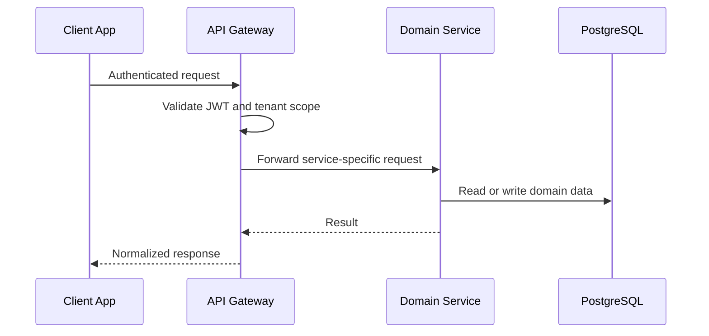
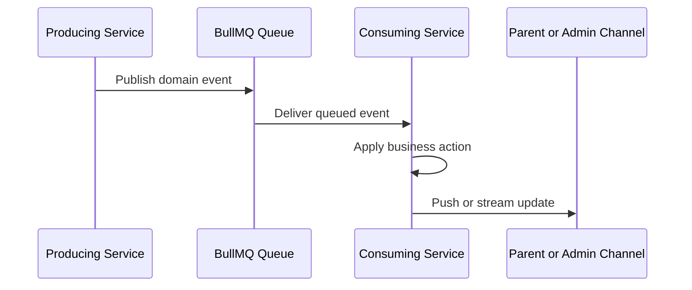

# SBTM v1 Integration Architecture

- Document owner: Engineering and Architecture
- Last reviewed: 2026-03-24
- Primary use: Request flows, event flows, and external dependency interaction patterns

## Purpose

This document describes how SBTM_AntiGravity integrates across its internal service boundaries and planned external dependencies.

## Integration Modes

| Mode | Current State | Target Direction |
| --- | --- | --- |
| Request-response via API Gateway | Primary integration mode | Remains the main application interaction pattern |
| Domain events via BullMQ | Partial | Becomes the main decoupling mechanism for operational events |
| Real-time updates | Mixed polling, SSE, and WebSocket support | Move toward event-driven delivery where practical |
| External integrations | Limited today | Map provider and push provider integration later |

## Core Request Flow

## Core Event Flow

## Key Integration Paths

| Path | Purpose | Current State |
| --- | --- | --- |
| Driver App -> API Gateway -> GPS Tracking | Live route telemetry | Implemented |
| Driver App -> API Gateway -> Student Presence | Boarding and alighting events | Partial end to end |
| Driver App -> API Gateway -> Emergency Alerts | Panic and incident workflows | Implemented |
| Parent App -> API Gateway -> tracking and alert data | Child visibility | Partial, polling-heavy |
| Admin Dashboard -> API Gateway -> domain services | Operations monitoring and administration | Implemented |
| Alerts and Presence -> BullMQ | Event publication | Partial |
| BullMQ -> Notification workflow | Parent-facing delivery | Planned |

## External Dependencies

| Dependency | Purpose | Status |
| --- | --- | --- |
| Push provider such as FCM or APNs | Parent alert and presence notifications | Planned |
| Map provider | Route optimization, geometry, and ETA support | Planned |
| Object storage | Video upload and playback | Implemented via MinIO or local storage |

## Integration Gaps

- GPS currently persists location data without publishing `location.updated` events.
- Parent alert delivery still relies heavily on polling despite backend SSE support.
- Notification fan-out is not yet a complete standalone consuming workflow.
- Service-to-service authentication remains a planned hardening step.

## Event Envelope Expectations

- Every operational event should carry a stable `eventId`.
- Tenant context such as `schoolId` should be mandatory.
- Events should be versioned so consumers can evolve safely.
- Retry and dead-letter handling should be observable rather than silent.

## Traceability

- Primary requirements: FR-GPS-001, FR-ALERT-001, FR-PARENT-002, NFR-PERF-001, NFR-PERF-002, NFR-RESIL-001, OPS-MON-001
- Primary use cases: UC-DRIVER-001, UC-PRESENCE-001, UC-PARENT-001, UC-INCIDENT-001