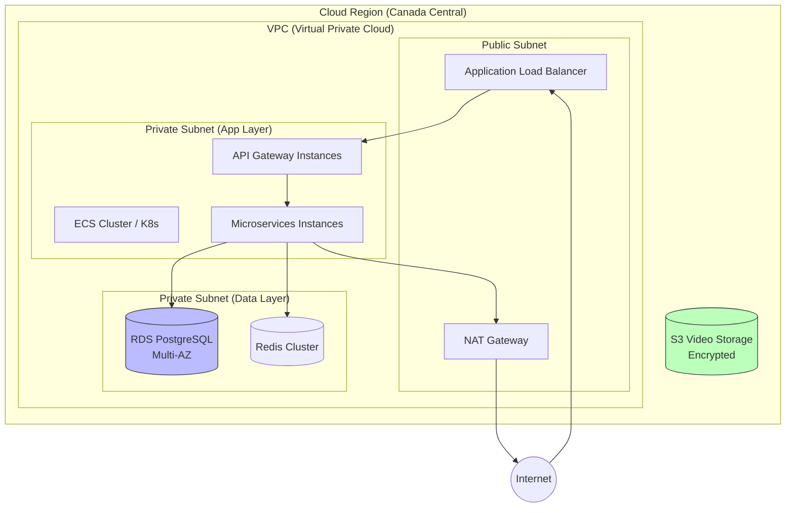

# 🏗️ **System Architecture V2: Multi-Tenant & Scalable**

## 1. Overview
The SBTM V2 architecture evolves the original prototype into a **Production-Grade, Multi-Tenant SaaS Platform**. It introduces strict data isolation, hierarchical administration (OSTA -> School Board -> School), and advanced route optimization capabilities.

## 2. High-Level Architecture Diagram

```mermaid
graph TD
    subgraph "Clients Layer"
        AdminApp[Admin Dashboard (Web)<br/>React/Vite]
        DriverApp[Driver App (Mobile)<br/>React Native]
        ParentApp[Parent App (Web/Mobile)<br/>Next.js/React Native]
    end

    subgraph "Edge Layer"
        CDN[CDN (Static Assets)]
        WAF[Web App Firewall<br/>Security & Rate Limiting]
        LB[Load Balancer]
    end

    subgraph "Gateway Layer"
        Gateway[NestJS API Gateway<br/>BFF Pattern]
        Auth[Auth Service<br/>JWT/RBAC/OAuth2]
    end

    subgraph "Business Logic Layer (Microservices)"
        SchoolSvc[School Management<br/>(Schools, Boards)]
        RouteSvc[Route & Optimization<br/>(AI Routing)]
        FleetSvc[Fleet & Driver<br/>(Vehicles, Inspections)]
        StudentSvc[Student Service<br/>(Enrollment, Presence)]
        GPSSvc[GPS Tracking<br/>(Location Ingestion)]
        AlertSvc[Emergency Alerts<br/>(Notification Engine)]
        VideoSvc[Video Service<br/>(Secure Storage)]
    end

    subgraph "Data Persistence Layer"
        PG[(PostgreSQL Cluster<br/>Multi-Tenant Data)]
        Redis[(Redis Cluster<br/>Cache/PubSub)]
        S3[(Object Storage<br/>Video/Images)]
        SpatialDB[(PostGIS<br/>Spatial Queries)]
    end

    subgraph "3rd Party Services"
        MapsAPI[Mapbox / Google Maps]
        SMS[Twilio / SNS]
        Email[SendGrid / SES]
    end

    %% Client Interactions
    AdminApp --> WAF
    DriverApp --> WAF
    ParentApp --> WAF

    %% Edge to Gateway
    WAF --> LB --> Gateway

    %% Gateway Routing
    Gateway --> Auth
    Gateway --> SchoolSvc
    Gateway --> RouteSvc
    Gateway --> FleetSvc
    Gateway --> StudentSvc
    Gateway --> GPSSvc
    Gateway --> AlertSvc
    Gateway --> VideoSvc

    %% Service to Data Interactions
    SchoolSvc --> PG
    RouteSvc --> PG & SpatialDB & MapsAPI
    FleetSvc --> PG
    StudentSvc --> PG
    GPSSvc --> Redis & SpatialDB
    AlertSvc --> Redis & SMS
    VideoSvc --> S3
    
    style Gateway fill:#f9f,stroke:#333
    style PG fill:#ccf,stroke:#333
    style Redis fill:#fcf,stroke:#333
```

## 3. Deployment & Infrastructure Diagram (Canadian Data Residency)



## 4. Key Architectural Changes for Multi-Tenancy

### 4.1 Data Isolation Strategy
- **Row-Level Security (RLS)**: All primary entities (`Students`, `Routes`, `Vehicles`) must have a `school_id` column.
- **Service-Level Enforcement**: API Gateway injects `school_id` from the JWT token into every downstream request. Services reject requests that modify data outside the authorized school scope.

### 4.2 Hierarchical RBAC
- **OSTA_ADMIN**: Can access *all* data.
- **BOARD_ADMIN**: Can access data for schools within their *Board*.
- **SCHOOL_ADMIN**: Can access data for *their School only*.
- **DRIVER**: Can access *assigned* Routes/Vehicles.
- **PARENT**: Can access *their Children* and *associated Routes*.

## 5. Technology Stack & Best Practices

| Component | Technology | Best Practice |
|-----------|------------|---------------|
| **Backend** | NestJS (Node.js) | Domain-Driven Design (DDD), Modular Monolith or Microservices |
| **Database** | PostgreSQL + PostGIS | Use Migrations (Prisma/TypeORM), Index `school_id` columns |
| **Caching** | Redis | Cache frequently accessed data (Routes, Student lists) |
| **Real-time** | Socket.IO / WebSockets | Scalable presence/GPS updates via Redis Adapter |
| **Maps** | Mapbox / OpenRouteService | Use vector tiles for performance, minimize external API costs |

## 6. Non-Functional Requirements (NFRs)

### 6.1 Scalability
- **Horizontal Scaling**: All services must be stateless and containerized (Docker).
- **Database Scaling**: Read replicas for heavy reporting queries (OSTA Dashboards).

### 6.2 Reliability & Availability
- **99.9% Uptime**: Multi-zone deployment (if cloud).
- **Graceful Degradation**: If Map API fails, fallback to cached routes (no optimization, but viewing works).

### 6.3 Security (Legal & Compliance)
- **PIPEDA / MFIPPA Compliance**:
  - Data Residency: All data stored in **Canada**.
  - Encryption: TLS 1.3 in transit, AES-256 at rest (Database & S3).
  - Data Retention: Automated archival/deletion policies (e.g., Video deleted after 30 days).
  - Audit Logs: Immutable log of all access to student PII.

## 7. Deployment Strategy
- **Containerization**: Docker & Docker Compose for all environments.
- **CI/CD**: Automated testing (Unit, Integration, E2E) before deployment.
- **Blue/Green Deployment**: Zero-downtime updates for critical services.
