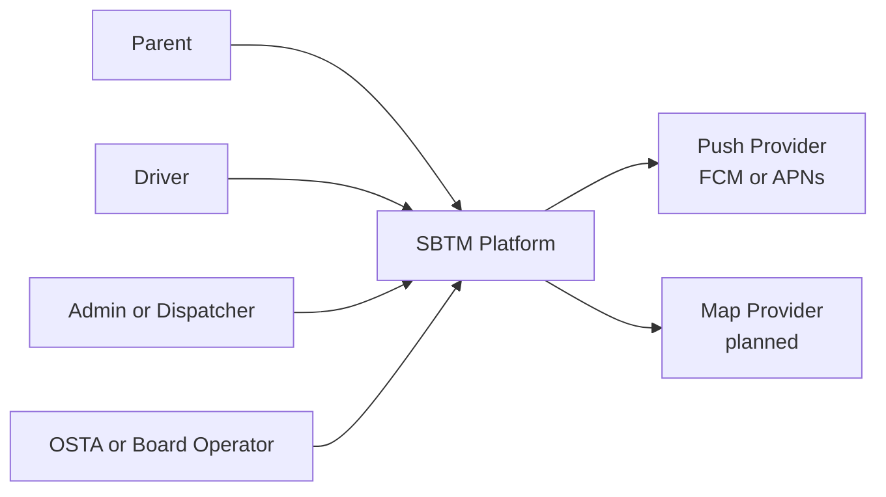
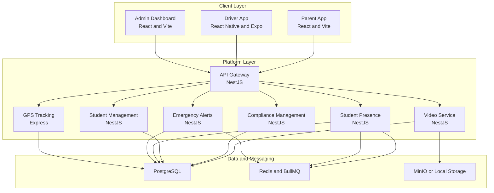

# SBTM v1 System Architecture

- Document owner: Engineering and Architecture
- Last reviewed: 2026-03-24
- Primary use: System context, service boundaries, and core runtime interactions

## Purpose

This document describes the system-level architecture of SBTM_AntiGravity: actors, primary applications, backend services, and their responsibility boundaries.

## System Context

## Primary Runtime Components

| Component | Type | Responsibility |
| --- | --- | --- |
| Driver App | Mobile application | Driver authentication, route execution, GPS updates, presence actions, emergency initiation |
| Parent App | Web application | Child tracking, route awareness, safety communications |
| Admin Dashboard | Web application | Operational oversight, route management, compliance views, incident awareness |
| API Gateway | Edge backend | Identity, RBAC, tenant scoping, reverse proxying, API normalization |
| GPS Tracking | Domain service | Live location ingestion and history queries |
| Emergency Alerts | Domain service | Alert persistence and admin-facing real-time channels |
| Student Presence | Domain service | Boarding and alighting state, presence event persistence, Redis-backed state |
| Student Management | Domain service | Enrollment, parent linkage, route assignment, roster import |
| Compliance Management | Domain service | Driver compliance, inspections, and audit records |
| Video Service | Domain service | Video event metadata and secure asset workflow |
| Redis and BullMQ | Shared infrastructure | Queueing and ephemeral presence or alert state |
| PostgreSQL | Shared infrastructure | Relational persistence across domain services |

## Container View

## Responsibility Boundaries

- The API Gateway is the only intended public backend entry point for application traffic.
- Tenant scoping and authorization begin at the gateway, but downstream services still need consistent enforcement.
- Student Presence, Alerts, and GPS form the core operational flow for daily transport execution.
- Student Management and Compliance support the operational context rather than route execution itself.
- Video handling is intentionally separate because storage, upload, and playback concerns differ from core operational events.

## Current-to-Target Notes

- The current platform already runs the gateway, core services, and web clients in Docker Compose.
- The target architecture expects more complete event consumption and parent delivery than currently exists.
- The intended notification boundary is explicit in architecture even if it is not yet implemented as a standalone service.

## Traceability

- Primary requirements: FR-IDENT-001, FR-TENANT-001, FR-GPS-001, FR-ALERT-001, FR-PRESENCE-001, FR-STUDENT-001, FR-COMPLIANCE-001
- Primary use cases: UC-LOGIN-001, UC-MONITOR-001, UC-DRIVER-001, UC-PRESENCE-001, UC-PARENT-001