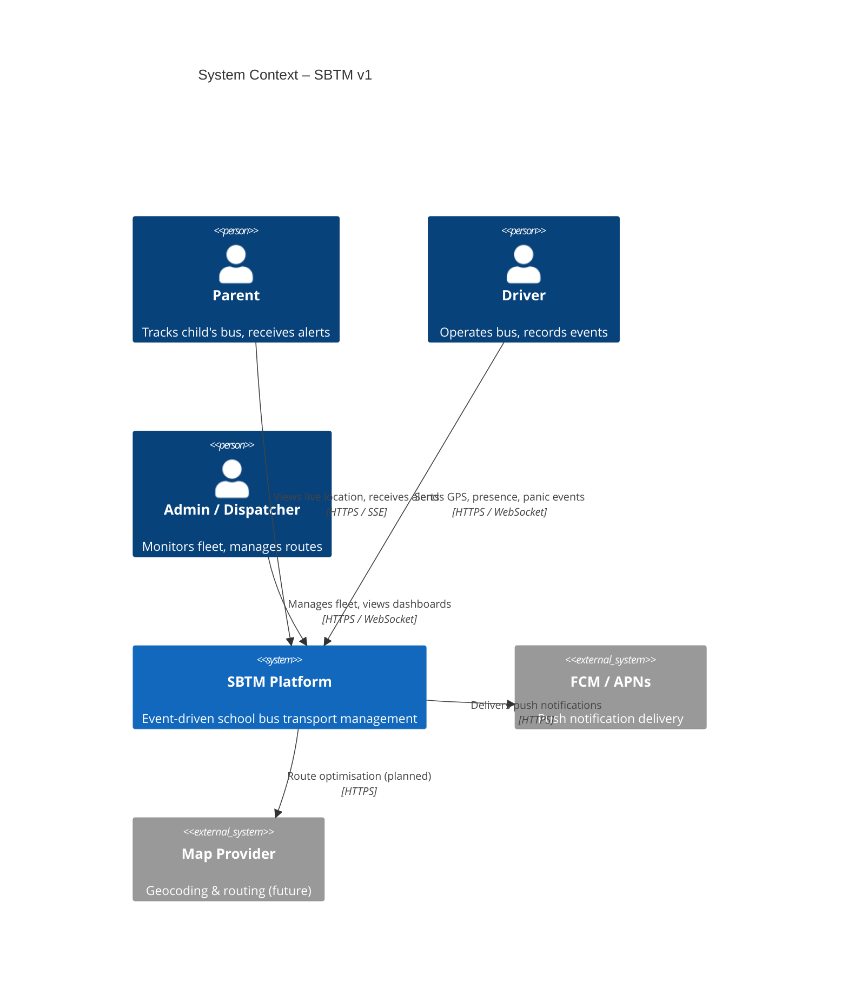
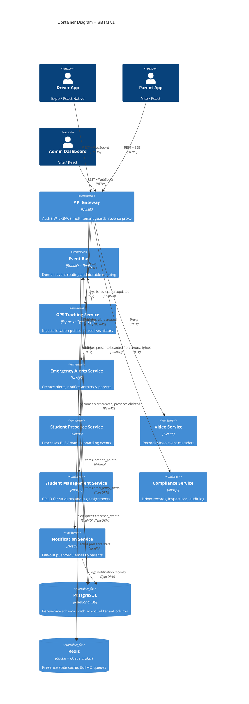
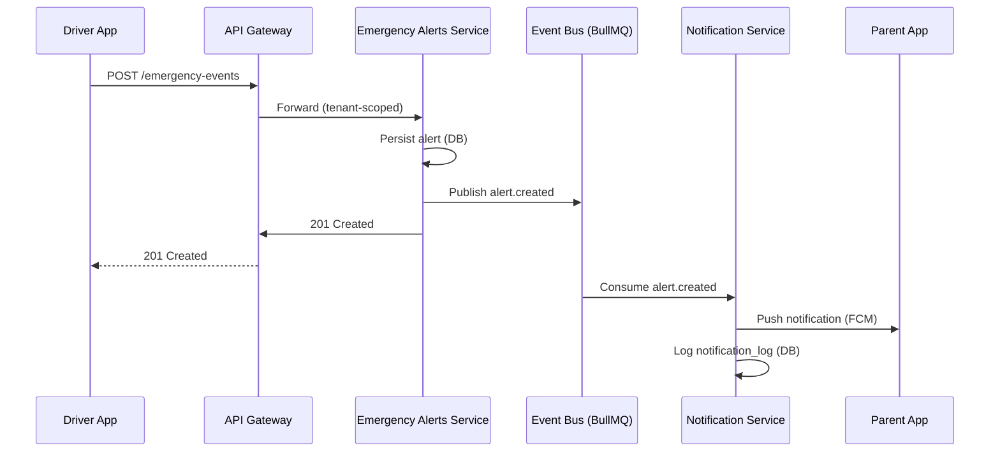
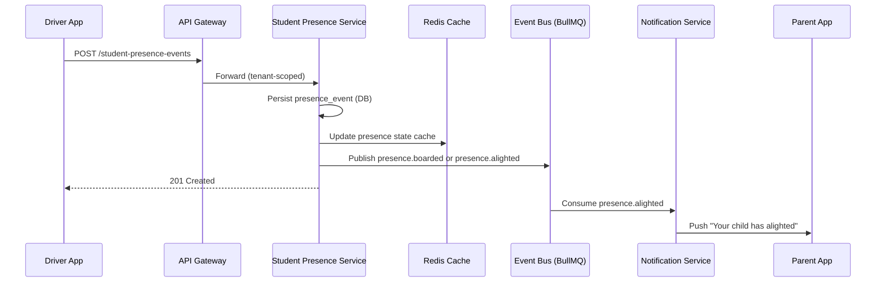
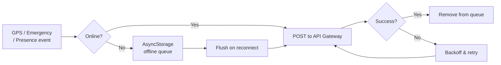

# SBTM v1 – Event-Driven Architecture

## 1. Overview

The v1 architecture evolves the current request/response model into an **event-driven** platform. Core business operations (GPS tracking, student presence, emergency alerts, notifications) become first-class domain events that flow through a central event bus. Services produce and consume events asynchronously, which decouples producers from consumers and enables real-time notification pipelines without tight coupling.

### Design Principles
- **Event-First**: State changes are expressed as immutable domain events.
- **Eventual Consistency**: Consumers process events asynchronously; the system remains responsive under load.
- **Resilience**: Clients queue events locally when offline and flush on reconnect.
- **Multi-Tenant by Default**: Every event carries `schoolId` (and optionally `boardId`) for tenant isolation.

---

## 2. C4 Context Diagram

---

## 3. C4 Container Diagram

---

## 4. Event Flow – Emergency Alert

---

## 5. Event Flow – Student Presence (BLE / Manual)

---

## 6. Offline Resilience (Driver App)

The Driver App persists events locally using AsyncStorage when the network is unavailable. A background flush job retries the queue on reconnect.

---

## 7. Architecture Decision Records (ADRs)

| # | Decision | Rationale |
|---|----------|-----------|
| 1 | BullMQ over Kafka | Lower ops overhead for prototype scale; Redis already in stack |
| 2 | Per-service PostgreSQL schema, shared instance | Tenant isolation via `school_id` column; single DB for prototype cost |
| 3 | AsyncStorage offline queue | No extra native library needed in Expo; survives app restart |
| 4 | Server-Sent Events for parent alerts | Simpler than WebSockets for read-only alert stream; browser-native |

---

## 8. Gap Coverage

| Gap (from v0 analysis) | v1 Solution |
|---|---|
| Offline GPS / emergency buffering | AsyncStorage queue in Driver App (`offline-queue.service.ts`) |
| Student presence not wired | `presence.service.ts` in Driver App + API call in store |
| Parent push notifications | `useAlerts` hook + SSE polling; Notification Service fan-out |
| Service-to-service auth (planned) | Internal JWT signing (Phase 4) |
| Row-level security (planned) | PostgreSQL RLS (Phase 4) |
