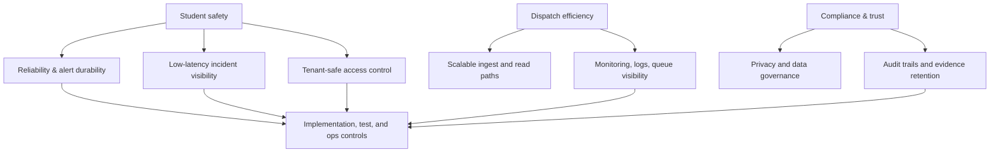

# SBTM v1 – Non-Functional Requirements

- Document owner: Engineering, Architecture, and Delivery
- Last reviewed: 2026-03-24
- Primary use: Consolidated quality attributes, operational targets, and production-readiness expectations

This document centralizes the non-functional requirements for the SBTM platform. It should be used together with `Architecture.md`, `TechnicalSpecifications.md`, and the current-state notes in `../../Implementation`.

## Related Documents

- [Architecture.md](Architecture.md)
- [TechnicalSpecifications.md](TechnicalSpecifications.md)
- [EventCatalog.md](EventCatalog.md)
- [ProblemStatement.md](../../Business/ProblemStatement.md)
- [TestingGuide.md](../../Test/TestingGuide.md)
- [GapAnalysis.md](../../prd/v1/UpgradePlan/GapAnalysis.md)

## 1. Scope and Interpretation

The targets below define the intended quality bar for SBTM. Where prototype and production expectations differ, both are called out explicitly. Current code-verified capability may lag behind this target-state document; use `docs/Implementation/*` and the upgrade plan for rollout sequencing.

## 2. Availability and Reliability

| Area | Prototype target | Production target | Notes |
|---|---|---|---|
| External API availability | ≥ 99.5% monthly | ≥ 99.9% monthly | Applies to gateway-mediated public APIs |
| Critical incident capture | Best effort with durable retry | No acknowledged alert loss after persistence | Once stored, downstream delivery must retry |
| Driver offline operation | Queue-and-forward for critical mobile events | Same | Covers GPS, emergency, and presence events |
| Queue durability | Redis-backed job retry | Durable retry with monitored backlog | Failed jobs must surface operationally |
| Recovery objective (RTO) | 4 hours | 1 hour | Service-level restoration target after major outage |
| Recovery point objective (RPO) | 15 minutes | 5 minutes | Data loss tolerance for persistent stores |

### Reliability expectations

- Services must fail in a way that preserves tenant boundaries.
- Safety-critical writes must be persisted before asynchronous fan-out is considered successful.
- Clients must not assume continuous connectivity during route execution.

## 3. Performance and Responsiveness

| Scenario | Target |
|---|---|
| GPS ingest end-to-end latency | p95 ≤ 3 seconds |
| Emergency alert creation to admin visibility | p95 ≤ 5 seconds |
| Emergency alert creation to parent notification handoff | p95 ≤ 10 seconds |
| Parent route status read | p95 ≤ 2 seconds |
| Admin dashboard operational list/map refresh | p95 ≤ 3 seconds |
| Authentication request | p95 ≤ 2 seconds |
| Background queue retry delay | exponential backoff starting at 1 second, capped by queue policy |

### Throughput assumptions

- Support active fleet monitoring for multiple schools within one tenant-aware deployment.
- Accept sustained route telemetry bursts during school start and end windows.
- Keep parent and admin read paths responsive even during ingest spikes.

## 4. Scalability and Capacity

SBTM must scale by adding stateless application instances while keeping per-tenant isolation intact.

### Required scaling characteristics

- API Gateway must support horizontal scaling behind a load balancer.
- Event consumers must support worker-based horizontal scaling by queue.
- Datastores must tolerate time-series growth for GPS data and audit-heavy growth for compliance and alerts.
- Caches must isolate hot operational reads from write-heavy ingestion paths where appropriate.

### Capacity planning assumptions

- Peak usage occurs around route dispatch, pickup, and drop-off windows.
- GPS and presence traffic are bursty rather than evenly distributed.
- Historical telemetry, audit logs, and video metadata will grow faster than administrative reference data.

## 5. Security and Privacy

| Control area | Requirement |
|---|---|
| Authentication | JWT-based identity at the gateway; short-lived access tokens and controlled refresh flow |
| Authorization | RBAC plus tenant scoping on every request and downstream data access |
| Data in transit | TLS for external traffic and secured service-to-service communication as the platform matures |
| Data at rest | Encryption for relational data, object storage, and backups |
| Secret handling | Environment-scoped secret storage; no secrets committed to repo or images |
| Auditability | Administrative and compliance-sensitive actions must produce durable audit records |
| Session storage | Mobile secrets use secure device storage; browser tokens require hardened production handling |

### Privacy requirements

- Personal data must be processed on a least-privilege basis.
- Student, parent, driver, and school records must remain tenant-scoped.
- Operational data retention must reflect public-sector and school-board expectations.
- Demo or test environments must not be treated as proof of production-grade privacy controls.

## 6. Compliance and Data Governance

The platform direction assumes alignment with Canadian public-sector and education-sector expectations, including privacy, retention, access logging, and breach response readiness.

### Governance expectations

- Keep hosted data in approved regions consistent with customer commitments.
- Retain enough audit information to support incident investigation and compliance review.
- Define retention and deletion policies for telemetry, video metadata, alerts, and compliance artifacts.
- Support evidence extraction for audits without granting cross-tenant access.

## 7. Resilience and Failure Handling

### Mobile and edge resilience

- Driver workflows must queue critical events locally when offline.
- Reconnect logic must flush events in order and track retry attempts.
- Event loss, duplicate submission, and replay risk must be handled through idempotent server-side processing where practical.

### Service resilience

- Asynchronous consumers must surface dead-letter or failed-job conditions operationally.
- A failure in a non-critical downstream consumer must not block the originating safety event from being recorded.
- Services must return explicit degraded-state behavior instead of silent failure where possible.

## 8. Multi-Tenancy and Data Isolation

Multi-tenancy is a core quality attribute, not an optional enhancement.

### Mandatory controls

- Every tenant-scoped record must include `school_id` or equivalent tenant identity.
- APIs must reject requests that attempt cross-tenant access, even when resource identifiers are valid.
- Background jobs and event consumers must propagate tenant context.
- Logs, exports, and support tooling must avoid mixing tenant data.

## 9. Observability and Operability

| Area | Requirement |
|---|---|
| Logging | Structured logs with request correlation and tenant-safe fields |
| Metrics | Service health, request latency, queue backlog, retry count, and datastore health |
| Tracing | Cross-service traceability for gateway-to-service flows and async handoffs |
| Alerting | Queue backlog, failed jobs, auth failure spikes, and service health degradation |
| Health checks | Readiness and liveness endpoints for deploy-time and runtime verification |

Operational visibility is especially important for emergency handling, tenant isolation incidents, and offline retry failures.

## 10. Maintainability and Delivery Quality

- Documentation must distinguish clearly between **implemented state**, **target-state design**, and **planned roadmap**.
- Architecture and technical docs should be updated in the same change set as material design changes.
- Public API and event contract changes require corresponding updates to design docs and testing guidance.
- New modules should document ownership, dependencies, interfaces, and source-of-truth location before they are treated as production-ready.

## 11. Quality Attribute Traceability

## 12. Acceptance Guidance

These requirements are considered actionable only when they can be traced to:

1. design decisions in `docs/Design/v1`,
2. implementation notes in `docs/Implementation`,
3. delivery gaps in `docs/prd/v1/UpgradePlan`, and
4. verification activities in `docs/Test/TestingGuide.md`.
