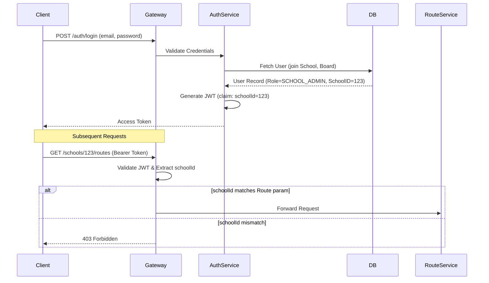
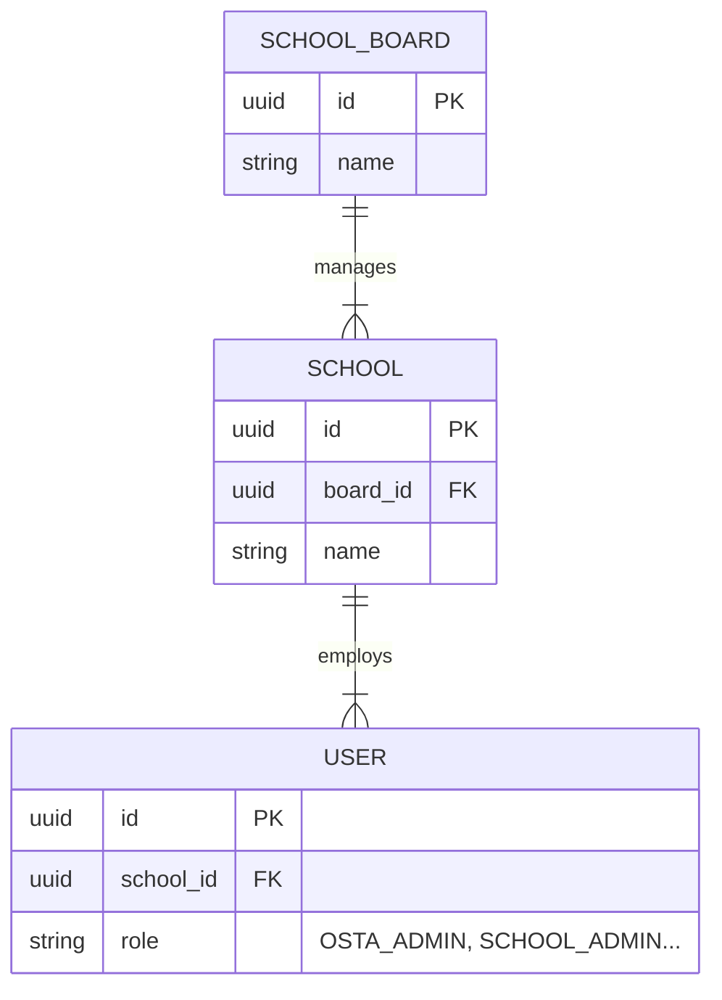

# 🏗️ **Module 1: Core Multi-Tenancy & RBAC**

## 1. Goal
Implement the foundational **Multi-Tenancy** layer by introducing `School` and `SchoolBoard` entities and enforcing data isolation through an enhanced Role-Based Access Control (RBAC) system.

## 2. Scope
- **Database**: Create `schools` and `school_boards` tables. Update `users` table.
- **API**: Create endpoints for Organization Management (`/boards`, `/schools`).
- **Auth**: Update JWT payload to include `schoolId` and `boardId`.
- **RBAC**: Implement `OSTA_ADMIN`, `BOARD_ADMIN`, and `SCHOOL_ADMIN` roles.

## 3. Architecture Visualization

### 3.1 Authentication & Scope Flow

### 3.2 Database Schema Relations

---

## 4. ✅ **SECTION A — Developer Specification (Copilot Developer)**

### 4.1 Database Migrations
- [ ] Create migration to add `school_boards` table.
- [ ] Create migration to add `schools` table with FK to `school_boards`.
- [ ] Create migration to add `school_id` (FK) and `board_id` (FK) to `users` table.
- [ ] **Seed Data**: Create default OSTA Admin user and a generic "Demo Board" with "Demo School".

### 4.2 Backend Implementation (NestJS)
- [ ] **Auth Service**:
  - Update `User` entity to include `school` and `board` relations.
  - Update `AuthService` login logic to fetch school context.
  - Update `JwtStrategy` and `JwtPayload` interface to include `schoolId` and `boardId`.
- [ ] **School Service (New)**:
  - Create `SchoolBoardController` (`/boards`) and `SchoolController` (`/schools`).
  - Implement CRUD logic.
  - Apply `RolesGuard` to ensure only `OSTA_ADMIN` can create/delete/update Organizations.

### 4.3 Frontend Implementation (Admin Dashboard)
- [ ] **Auth Context**: Update `useAuth` hook to decode and store `schoolId` from token.
- [ ] **Org Management Screens**:
  - `pages/admin/BoardsList.tsx`: Table of Boards (OSTA View).
  - `pages/admin/SchoolList.tsx`: Table of Schools filtered by Board.
  - **Add School Modal**: Form with Name, Address, Contact Info.

---

## 5. ✅ **SECTION B — Reviewer Checklist (Copilot Reviewer)**

### Security & Isolation
- [ ] **JWT Claims**: Does the token strictly contain the user's scope?
- [ ] **Middleware**: Is there a global guard/interceptor that verifies `schoolId` in URL params matches the token?
- [ ] **Impersonation**: If `OSTA_ADMIN` uses `X-School-ID` header, is it validated against existing schools?

### Code Quality
- [ ] **Type Safety**: Are `schoolId` types consistent (string/UUID)?
- [ ] **Error Handling**: Do invalid IDs return 404 (Not Found) instead of 500?

---

## 6. ✅ **SECTION C — Tester Acceptance Criteria (Copilot Tester)**

### TC-1.1: OSTA Admin Scope
- **Setup**: Login as OSTA Admin.
- **Action**: `GET /boards`
- **Expected**: Return list of ALL boards.

### TC-1.2: School Admin Isolation (Positive)
- **Setup**: Login as School Admin (School A).
- **Action**: `GET /schools/school-A/details`
- **Expected**: 200 OK with details.

### TC-1.3: School Admin Isolation (Negative)
- **Setup**: Login as School Admin (School A).
- **Action**: `GET /schools/school-B/details`
- **Expected**: **403 Forbidden**.

### TC-1.4: Hierarchy Enforcement
- **Setup**: Login as School Admin.
- **Action**: Attempt to Create a new School Board via API.
- **Expected**: **403 Forbidden** (Only OSTA Admin).
