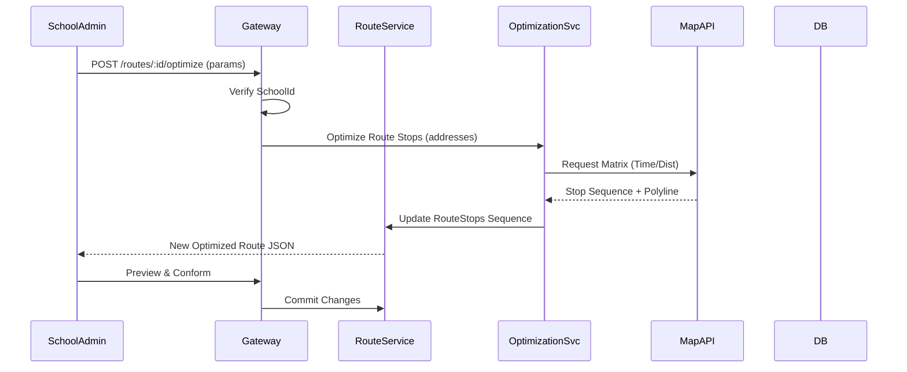
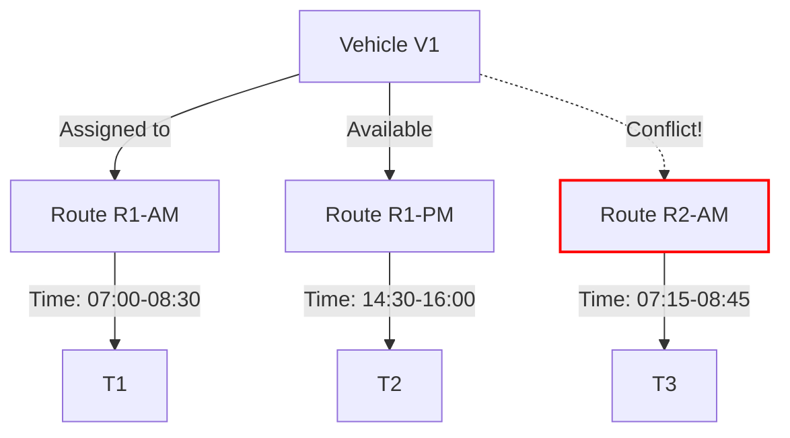

# 🗺️ **Module 2: Route & Vehicle Management**

## 1. Goal
Implement advanced **Route Planning** (including AI Optimization) and **Fleet Management** capabilities, ensuring strict 1:1 assignment between buses and routes within a school scope.

## 2. Scope
- **Database**: Create `routes`, `vehicles`, `route_stops`.
- **API**: Endpoints for Routing (`/routes`), Fleet (`/vehicles`), and AI Optimization (`/optimize`).
- **Logic**: Enforce `school_id` isolation and route-bus coupling.
- **UI**: Interactive Map Editor and Vehicle Registry.

## 3. Architecture Visualization

### 3.1 Route Optimization Workflow

### 3.2 Vehicle Assignment Logic

---

## 4. ✅ **SECTION A — Developer Specification (Copilot Developer)**

### 4.1 Database Migrations
- [ ] Create `vehicles` table with `license_plate` (UNIQUE per School) and `status`.
- [ ] Create `routes` table with `direction` ('AM'/'PM') and `vehicle_id` (UNIQUE constraint).
- [ ] Create `route_stops` with `GEOGRAPHY(Point)` column (PostGIS).

### 4.2 Backend Implementation (Route Service)
- [ ] **RouteController**: Implement standard CRUD.
- [ ] **Validation Logic**:
  - Cannot assign a Vehicle to two active Routes with overlapping times (check `start_time` + estimated duration).
  - Route Name must be unique within a School.
- [ ] **AI Optimization Endpoint**:
  - Integrate with Map Service (Use Adapter Pattern).
  - Input: List of Student Addresses + School Location.
  - Output: Ordered Stops + Polyline + ETA.

### 4.3 Backend Implementation (Fleet Service)
- [ ] **VehicleController**: Implement standard CRUD.
- [ ] Implement Status Workflow (Active -> Maintenance).
- [ ] **Constraint**: Cannot delete a Vehicle if it is assigned to an active Route.

### 4.4 Frontend Implementation (Admin Dashboard)
- [ ] **Route Planner UI**:
  - Split View: Student List (Left) + Map (Right).
  - Drag-and-Drop Stop Reordering.
  - "Optimize Route" Button -> Call API -> Render Result.
- [ ] **Fleet Manager UI**:
  - Table of Vehicles with Status indicators.
  - Add/Edit Vehicle Modal.

---

## 5. ✅ **SECTION B — Reviewer Checklist (Copilot Reviewer)**

### Logic & Constraints
- [ ] **Overlap Check**: Does the vehicle assignment logic handle edge cases (e.g., late bus)?
- [ ] **Transaction Safety**: Are route updates atomic (either fully save or rollback)?

### Performance
- [ ] **Spatial Index**: Is the `route_stops.location` column indexed with GiST?
- [ ] **Caching**: Is the optimized route cached to prevent redundant API calls?

---

## 6. ✅ **SECTION C — Tester Acceptance Criteria (Copilot Tester)**

### TC-2.1: Vehicle Creation
- **Setup**: Login as School Admin.
- **Action**: Create Vehicle (Plate: BUS-101).
- **Expected**: Success (Status: ACTIVE).

### TC-2.2: Route Assignment
- **Setup**: Create Route (AM). Assign BUS-101.
- **Expected**: Success.

### TC-2.3: Assignment Conflict
- **Setup**: Create Route 2 (AM, same time). Try to Assign BUS-101.
- **Expected**: **409 Conflict** (Vehicle already assigned).

### TC-2.4: Optimize Calculation
- **Setup**: Create Route with unsequenced stops.
- **Action**: Click "Optimize".
- **Expected**: Returns JSON with logically ordered stops + valid Polyline points.
