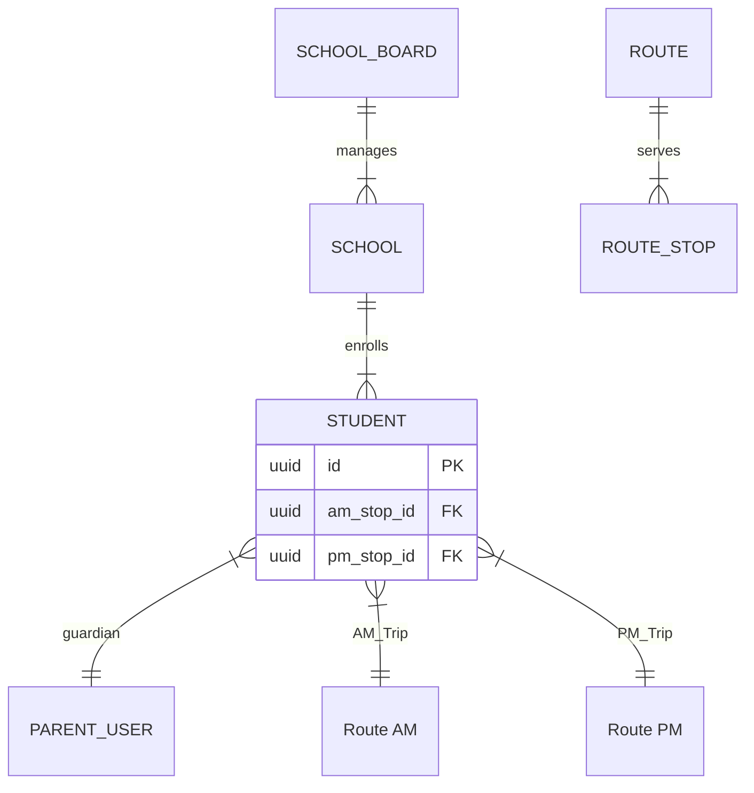
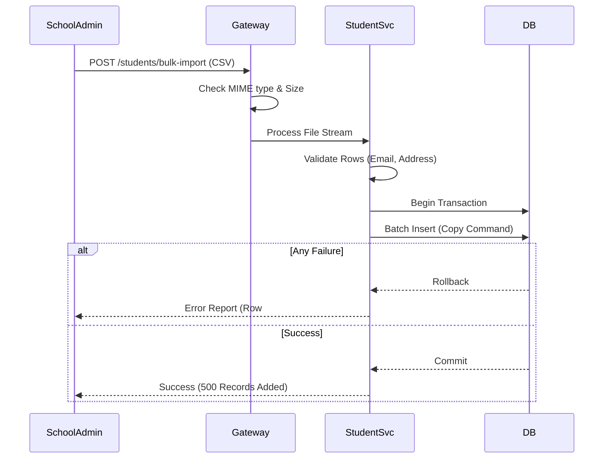

# 🎓 **Module 3: Student Management**

## 1. Goal
Implement centralized **Student Management** linked to Schools, Routes, and Parents, enabling efficient enrollment and attendance tracking.

## 2. Scope
- **Database**: Create `students` table.
- **API**: Endpoints for Student Enrollment (`/students`), Assignment (`/assignment`), and Bulk Import.
- **Logic**: Enforce School scope, validate Route capacity.
- **UI**: Student Roster and Assignment Modal.

## 3. Architecture Visualization

### 3.1 Student Data Relationship (ERD)

### 3.2 Bulk Import Workflow

---

## 4. ✅ **SECTION A — Developer Specification (Copilot Developer)**

### 4.1 Database Migrations
- [ ] Create `students` table with fields: `first_name`, `last_name`, `grade`, `address`, `school_id`, `parent_user_id`, `am_route_id`, `pm_route_id`, `am_stop_id`, `pm_stop_id`.
- [ ] Add Indexes on `school_id` and `parent_user_id` for quick lookups.
- [ ] Add unique constraint on `(school_id, student_id_external)` to prevent duplicates.

### 4.2 Backend Implementation (Student Service)
- [ ] **StudentController**: Implement CRUD Ops.
- [ ] **Assignment Logic**:
  - Validate `route_id` belongs to `school_id`.
  - Validate `stop_id` belongs to `route_id`.
  - Check Vehicle Capacity (Optional/Warning).
- [ ] **Bulk Import**:
  - Use streaming parser (e.g., `papaparse` or `csv-parser`).
  - Batch size: 1000 records per transaction.

### 4.3 Frontend Implementation (Admin Dashboard)
- [ ] **Student Roster**:
  - Datatable with filtering/sorting.
  - "Assign Route" Modal with dropdowns for AM/PM routes and stops.
- [ ] **Bulk Import Wizard**:
  - File Upload -> Validation Preview -> Commit.

---

## 5. ✅ **SECTION B — Reviewer Checklist (Copilot Reviewer)**

### Data Integrity
- [ ] **Isolation**: Can a student be assigned to a route from another school? (Must Fail).
- [ ] **Capacity**: Is there a warning if assigning a student exceeds bus capacity?
- [ ] **Parent Link**: Is the parent user notified when linked?

### Upload Performance
- [ ] **Async**: For large files (>1MB), is the process async or properly streamed?

---

## 6. ✅ **SECTION C — Tester Acceptance Criteria (Copilot Tester)**

### TC-3.1: Student Creation
- **Setup**: Login as School Admin.
- **Action**: Create Student (John Doe).
- **Expected**: Success (Status: ENROLLED).

### TC-3.2: Route Assignment
- **Setup**: Assign John Doe to Route 101-AM.
- **Expected**: Success. Student appears on Driver Roster.

### TC-3.3: Invalid Route
- **Setup**: Try assigning John Doe to Route 202 (Other School).
- **Expected**: **404 Not Found** or **403 Forbidden**.

### TC-3.4: Bulk Import
- **Setup**: Upload CSV with 50 valid students.
- **Expected**: 50 records created. No errors.
