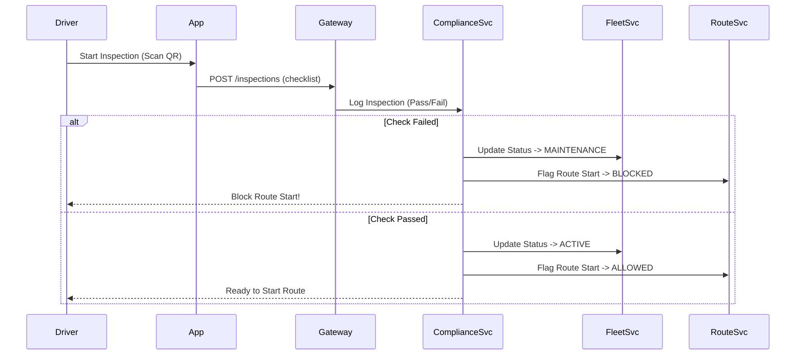
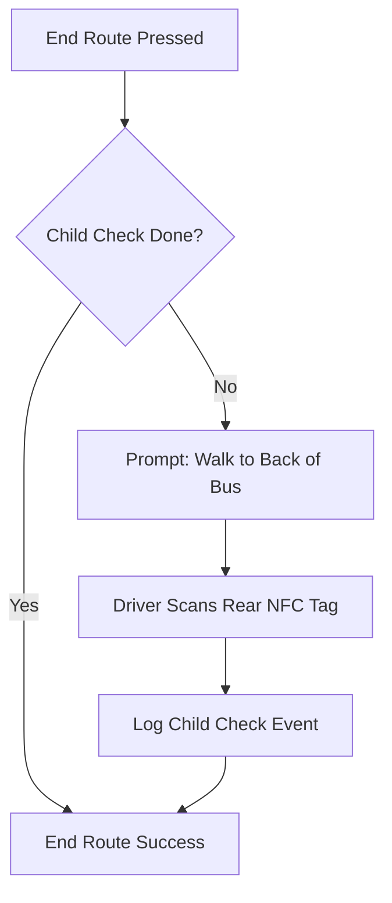

# 🛡️ **Module 4: Compliance & Safety**

## 1. Goal
Implement robust **Compliance Tracking** and **Safety Enforcement** features to meet OSTA/Ministry regulations, including driver background checks, vehicle inspections, and post-trip child checks.

## 2. Scope
- **Database**: Add tables for `compliance_logs`, `vehicle_inspections`, `audit_logs`.
- **API**: Endpoints for Logging Checks (`/compliance`), Reporting Incidents (`/incidents`), and Auditing (`/audit`).
- **Logic**: Enforce "Start Route" only if inspection complete. Enforce "End Route" only if Child Check complete.
- **UI**: Driver App Checklists, Admin Compliance Dashboard.

## 3. Architecture Visualization

### 3.1 Vehicle Inspection Flow (Pre-Trip)

### 3.2 Child Check Logic (Post-Trip)

---

## 4. ✅ **SECTION A — Developer Specification (Copilot Developer)**

### 4.1 Database Migrations
- [ ] Create `vehicle_inspections` table with `is_passed`, `comments`, `checklist_json` (Stores defect details).
- [ ] Create `driver_compliance` table with `license_expiry`, `background_check_status`.
- [ ] Create `audit_logs` table (Partitioned by Month recommended for scalability).

### 4.2 Backend Implementation (Compliance Service)
- [ ] **InspectionController**: Receiving logs. Trigger Fleet status update if inspection fails.
- [ ] **ComplianceController**: Manage driver document expiry dates (e.g., medical test due).
- [ ] **AuditInterceptor**: Global interceptor to log sensitive actions (e.g., Viewing Student PII).
- [ ] **Route Guard**: Middleware to check if vehicle has a valid inspection <= 24h old.

### 4.3 Frontend Implementation (Driver App & Admin)
- [ ] **Driver App - Pre-Trip**: Interactive checklist form. Photo upload for defects.
- [ ] **Driver App - Post-Trip**: Child Check workflow (NFC/QR Scan).
- [ ] **Admin Dashboard - Compliance**:
  - List of Drivers with expiring documents (Red/Yellow warning).
  - Inspection History per Vehicle (Download PDF capability).

---

## 5. ✅ **SECTION B — Reviewer Checklist (Copilot Reviewer)**

### Safety Enforcement
- [ ] **Bypass Check**: Can a driver start a route via API (e.g., Postman) without an inspection? (Must be NO).
- [ ] **Audit Trail**: Are ALL student data accesses logged with User ID and Timestamp?
- [ ] **Data Retention**: Is there a job to archive old logs (e.g., > 1 year)?

---

## 6. ✅ **SECTION C — Tester Acceptance Criteria (Copilot Tester)**

### TC-4.1: Inspection Pass
- **Setup**: Login as Driver. Submit Passed Inspection.
- **Result**: Vehicle Status = ACTIVE. Can Start Route.

### TC-4.2: Inspection Fail
- **Setup**: Login as Driver. Submit Failed Inspection (e.g., Flat Tire).
- **Result**: Vehicle Status = MAINTENANCE. Cannot Start Route (**403 Forbidden**).

### TC-4.3: Child Check Enforcement
- **Setup**: Complete Route. Press "End Route".
- **Result**: Prompt "Please Scan Rear Tag". Route remains ACTIVE until scan.

### TC-4.4: Audit Log Verification
- **Setup**: Login as School Admin. View a Student Profile.
- **Action**: Check `audit_logs` table.
- **Result**: Row exists (User: Admin, Action: VIEW_STUDENT, Resource: StudentID).
