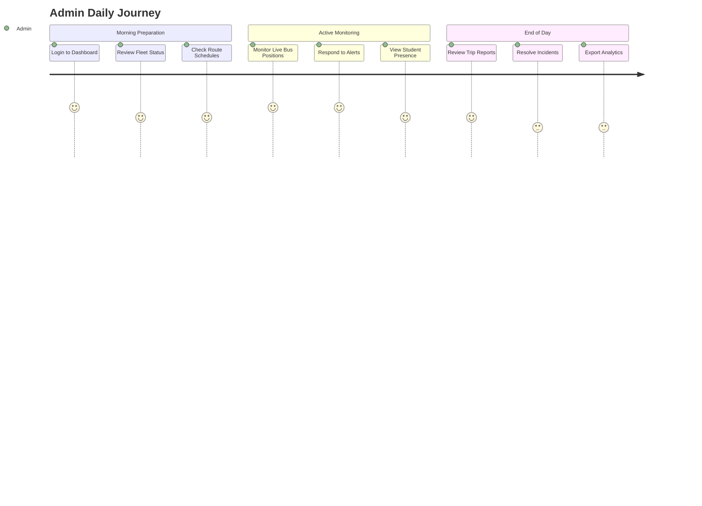
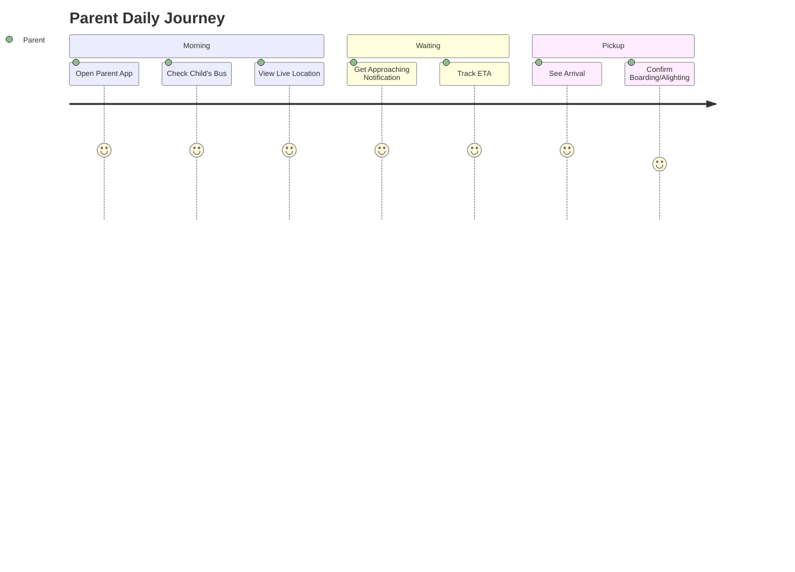
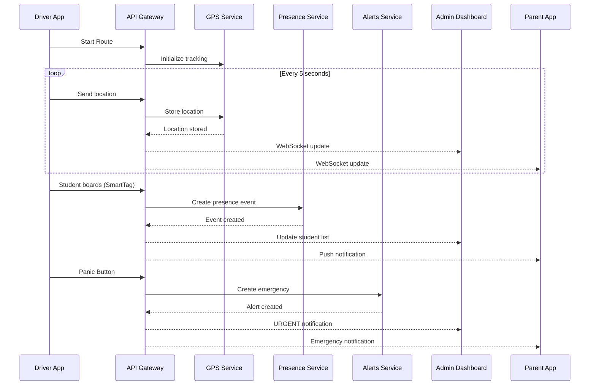
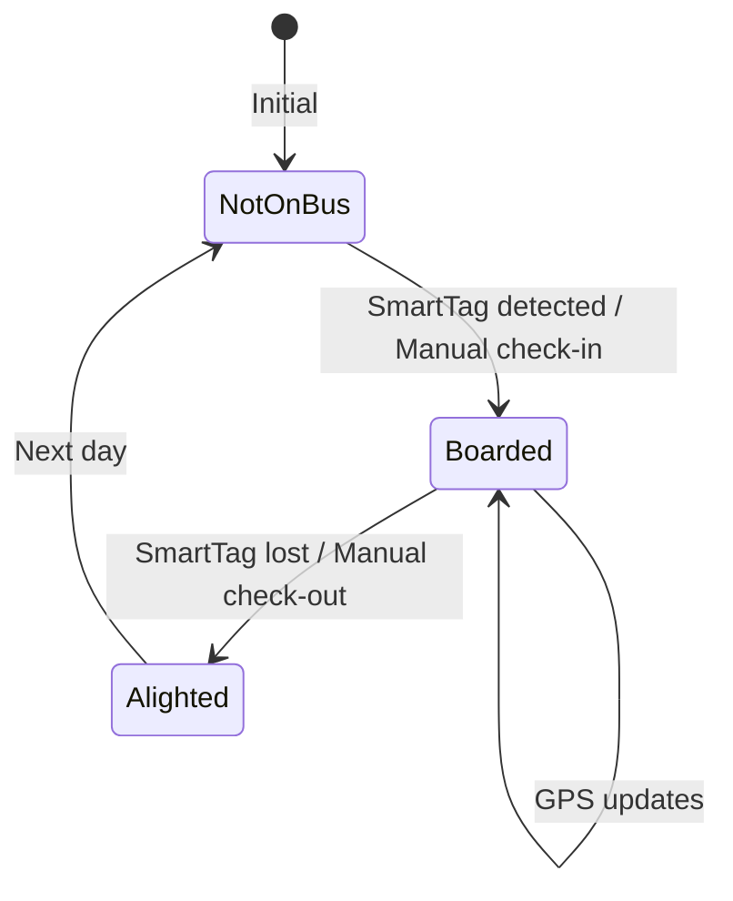
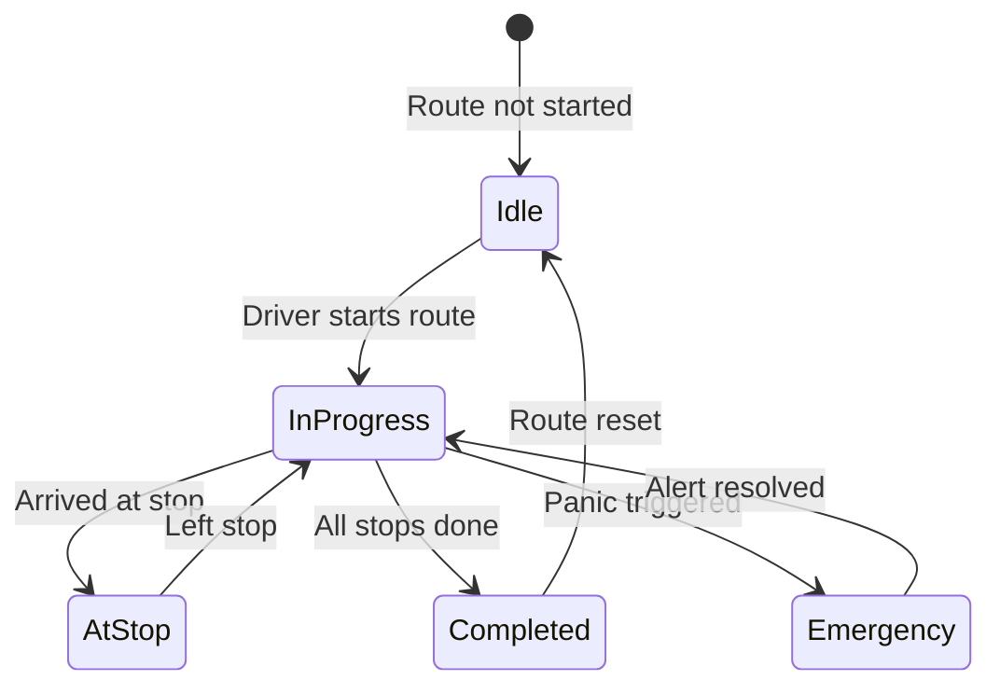

# SBTM User Journey Documentation

## Complete User Journey Guide for All Stakeholders

This document details the user journeys for all three user types in the School Bus Transport Management System (SBTM): **Admin**, **Driver**, and **Parent**.

---

## Table of Contents
1. [Admin User Journey](#admin-user-journey)
2. [Driver User Journey](#driver-user-journey)
3. [Parent User Journey](#parent-user-journey)
4. [System Interactions](#system-interactions)

---

## Admin User Journey

### User Profile
- School transportation coordinator or fleet manager
- Monitors all buses, routes, and emergency situations
- Manages routes, users, and system configuration

### Journey Map

### Detailed User Flows

#### Flow 1: Morning Fleet Overview

**Trigger:** Admin starts their workday

| Step | Action | Screen | Expected Outcome |
|------|--------|--------|------------------|
| 1 | Open Admin Dashboard | Login | Dashboard login page displayed |
| 2 | Enter credentials | Login | `admin@sbtm.demo` / `Admin123!` |
| 3 | Click "Login" | Login → Dashboard | Redirect to Fleet Overview |
| 4 | View fleet status | Fleet Overview | All buses shown with status (Active/Inactive) |
| 5 | Check today's routes | Routes | Route schedule displayed with drivers |

#### Flow 2: Real-Time Monitoring

**Trigger:** Buses are active on routes

| Step | Action | Screen | Expected Outcome |
|------|--------|--------|------------------|
| 1 | View Live Map | Dashboard | All active buses shown on map |
| 2 | Click on bus icon | Dashboard | Bus details panel opens |
| 3 | View driver info | Bus Details | Driver name, contact, route displayed |
| 4 | View student list | Bus Details | Boarded students with presence times |
| 5 | Check ETA | Bus Details | Estimated arrival at next stop |

#### Flow 3: Emergency Response

**Trigger:** Driver triggers panic button

| Step | Action | Screen | Expected Outcome |
|------|--------|--------|------------------|
| 1 | Receive alert notification | Any | Alert popup with sound/visual indicator |
| 2 | Click alert notification | Any → Alert Details | Immediate redirect to alert |
| 3 | View emergency details | Alert Details | Bus location, driver, route, student count |
| 4 | Contact driver | Alert Details | Click-to-call or message option |
| 5 | Resolve alert | Alert Details | Mark as resolved with notes |

#### Flow 4: Student Presence Monitoring

| Step | Action | Screen | Expected Outcome |
|------|--------|--------|------------------|
| 1 | Navigate to "Students" | Navigation | Student list with presence status |
| 2 | Filter by route | Student List | Show students for selected route |
| 3 | View boarding status | Student List | BOARDED/NOT_ON_BUS/ALIGHTED status |
| 4 | View presence history | Student Details | Timeline of board/alight events |

---

## Driver User Journey

### User Profile
- School bus driver on assigned route
- Responsible for student safety and route completion
- Uses mobile app for navigation and presence logging

### Journey Map

### Detailed User Flows

#### Flow 1: Starting the Day

**Trigger:** Driver begins their shift

| Step | Action | Screen | Expected Outcome |
|------|--------|--------|------------------|
| 1 | Open Driver App | Splash | App loads, check connectivity |
| 2 | Login | Login | Enter `driver1@sbtm.demo` / `Driver123!` |
| 3 | View assigned routes | Route List | Today's routes displayed (AM/PM) |
| 4 | Select route | Route List | Route details shown with stops |
| 5 | Tap "Start Route" | Route Details | GPS tracking begins |

#### Flow 2: Active Route Navigation

**Trigger:** Route is started

| Step | Action | Screen | Expected Outcome |
|------|--------|--------|------------------|
| 1 | View current location on map | Active Route | Bus position shown on route |
| 2 | See next stop info | Active Route | Stop name, ETA, students to pick up |
| 3 | Follow navigation | Active Route | Turn-by-turn directions (if enabled) |
| 4 | Arrive at stop | Active Route | Stop arrival notification |
| 5 | View students at stop | Stop Details | List of students to board |

#### Flow 3: Student Boarding

**Trigger:** Bus arrives at pickup stop

| Step | Action | Screen | Expected Outcome |
|------|--------|--------|------------------|
| 1 | Stop arrives | Active Route | "Approaching Stop" notification |
| 2 | View student roster | Student Roster | Students for this stop listed |
| 3 | Student boards (auto-detected) | Student Roster | SmartTag detected, status updates |
| 4 | Manual override if needed | Student Roster | Tap to mark as boarded manually |
| 5 | Proceed to next stop | Active Route | Next stop info displayed |

#### Flow 4: Emergency Situation

**Trigger:** Emergency on bus

| Step | Action | Screen | Expected Outcome |
|------|--------|--------|------------------|
| 1 | Tap "Panic Button" | Any Screen | Large, visible red button always accessible |
| 2 | Confirm emergency | Panic Confirmation | "Are you sure?" dialog |
| 3 | Select type | Emergency Type | PANIC_BUTTON / INCIDENT / OTHER |
| 4 | Emergency sent | Active Route | Confirmation shown, admin notified |
| 5 | Continue or wait | Active Route | GPS continues, video may capture |

#### Flow 5: Completing Route

**Trigger:** All stops completed

| Step | Action | Screen | Expected Outcome |
|------|--------|--------|------------------|
| 1 | Final stop reached | Active Route | "Route Completing" notification |
| 2 | Verify all students alighted | Student Roster | Check all students off bus |
| 3 | Tap "End Route" | Active Route | Confirm route completion |
| 4 | View summary | Route Summary | Total students, time, distance |
| 5 | Submit | Route Summary | Data synced to backend |

---

## Parent User Journey

### User Profile
- Parent or guardian of student(s)
- Wants to track child's bus location in real-time
- Needs notifications about boarding and arrival

### Journey Map

### Detailed User Flows

#### Flow 1: Morning Check

**Trigger:** Parent checks on child's bus

| Step | Action | Screen | Expected Outcome |
|------|--------|--------|------------------|
| 1 | Open Parent App | Splash | App loads |
| 2 | Login (if needed) | Login | `parent1@sbtm.demo` / `Parent123!` |
| 3 | View dashboard | Home | Children listed with bus status |
| 4 | Select child | Home | Child's bus info displayed |
| 5 | View live map | Live Map | Bus position shown on map |

#### Flow 2: Real-Time Tracking

**Trigger:** Bus is on route

| Step | Action | Screen | Expected Outcome |
|------|--------|--------|------------------|
| 1 | View map | Live Map | Bus icon showing current position |
| 2 | See route overlay | Live Map | Complete route drawn on map |
| 3 | View child's stop | Live Map | Child's pickup/dropoff point highlighted |
| 4 | Check ETA | Live Map | "Bus arriving in X minutes" |
| 5 | Monitor progress | Live Map | Position updates every 5-10 seconds |

#### Flow 3: Receiving Notifications

**Trigger:** Bus events occur

| Notification Type | Trigger | Message Example |
|------------------|---------|-----------------|
| **Bus Started** | Driver starts route | "Emma's bus is now on the way!" |
| **Approaching Stop** | Bus 5 min away | "Bus arriving at Emma's stop in 5 minutes" |
| **Child Boarded** | SmartTag detected | "Emma has boarded the bus" |
| **Child Alighted** | SmartTag detected | "Emma has safely exited the bus" |
| **Bus Arrived** | At destination | "Bus has arrived at Lincoln Elementary" |
| **Delay Alert** | Route delayed | "Emma's bus is running 10 minutes late" |
| **Emergency Alert** | Panic triggered | "ALERT: An incident has occurred on Emma's bus" |

#### Flow 4: Viewing Child's History

| Step | Action | Screen | Expected Outcome |
|------|--------|--------|------------------|
| 1 | Navigate to "History" | Navigation | History list displayed |
| 2 | Select date | History | Day's events shown |
| 3 | View boarding time | History | Exact time child boarded |
| 4 | View arrival time | History | Exact time at school |
| 5 | Export if needed | History | Download/share option |

---

## System Interactions

### Complete Data Flow

### State Diagram - Student Presence

### State Diagram - Bus Route

---

## Demo Scenario: Morning School Run

### Setup
- **Time:** 7:30 AM typical school morning
- **Buses:** 2 active (BUS-001, BUS-002)
- **Students:** 4 students across routes
- **Routes:** Route A (3 stops), Route B (4 stops)

### Timeline

| Time | Actor | Action | System Response |
|------|-------|--------|-----------------|
| 7:30 | Admin | Opens dashboard | Fleet overview shows 3 buses ready |
| 7:32 | Driver 1 | Starts Route A on BUS-001 | GPS tracking begins |
| 7:33 | Parent 1 | Opens app | "Emma's bus is on the way!" |
| 7:35 | Driver 1 | Arrives at Stop 1 | Stop arrival logged |
| 7:36 | Emma | Boards bus (SmartTag) | Parent notified: "Emma boarded" |
| 7:38 | Driver 2 | Starts Route B on BUS-002 | Second bus tracking begins |
| 7:40 | Driver 1 | Arrives at Stop 2 | Admin sees both buses on map |
| 7:41 | Liam | Boards bus (SmartTag) | Parent 2 notified |
| 7:45 | Driver 2 | Panic button pressed | EMERGENCY ALERT to admin |
| 7:46 | Admin | Views alert, contacts driver | Alert acknowledged |
| 7:50 | Admin | Resolves alert (false alarm) | Alert closed, operations resume |
| 8:00 | Both | Arrive at school | Routes completed |

---

## Error Scenarios & Recovery

### GPS Signal Lost
- **Driver sees:** "GPS signal weak" indicator
- **System behavior:** Continues with last known position, marks as stale
- **Admin sees:** Bus icon shows warning

### SmartTag Not Detected
- **Driver action:** Manual boarding option
- **System logs:** Source = "MANUAL" instead of "SMARTTAG"

### App Offline
- **Driver App:** Queues location updates, syncs when online
- **Parent App:** Shows last known position with timestamp

---

## Appendix: API Endpoints Used

| Journey Step | HTTP Method | Endpoint |
|--------------|-------------|----------|
| Login | POST | `/api/v1/auth/login` |
| Get Profile | GET | `/api/v1/auth/me` |
| Start Route | POST | `/api/v1/routes/{id}/start` |
| Send Location | POST | `/api/v1/locations` |
| Get Live Location | GET | `/api/v1/routes/{id}/live-location` |
| Board Student | POST | `/api/v1/student-presence-events` |
| Get Students on Route | GET | `/api/v1/routes/{id}/students` |
| Trigger Emergency | POST | `/api/v1/emergency-events` |
| Get Active Alerts | GET | `/api/v1/alerts/active` |
| Resolve Alert | PUT | `/api/v1/alerts/{id}/resolve` |
