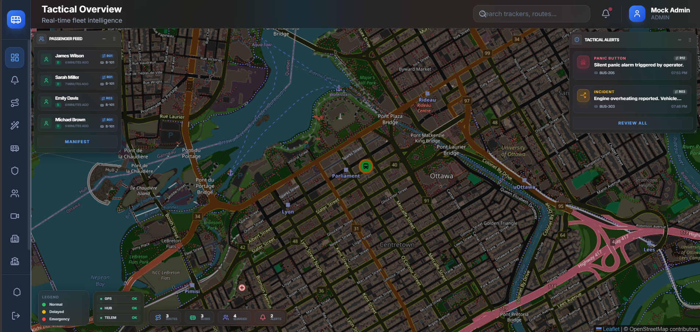

# Admin Dashboard: Tactical UI Design Specification

## Overview
The Admin Dashboard is the nerve center of the SBTM platform. It is designed as a **High-Density Tactical Command Center**, prioritizing situational awareness through a full-panel background map overlaid with interactive, glassmorphic data tiles.

### Visual Concept: "The Glass Cockpit"
The design follows the "Glass Cockpit" philosophy used in modern aviation and mission control. Information is layered, with the most critical data points floated as transparent patches over a persistent city-wide operation map.

---

## Core UI Pillars

### 1. Persistent Map Layer (The Canvas)
- **Role**: Provides continuous visual context for fleet movements.
- **Styling**: Full-panel, dark-themed tactical map.
- **Behavior**: Acts as the bottom-most layer. Responds to panning and zooming while overlays remain fixed relative to the screen.

### 2. Floating Tactical Overlays (Dynamic Panels)
- **Components**: `Passenger Feed` (Top-Left), `Tactical Alerts` (Top-Right).
- **Glassmorphism**: 
  - `backdrop-filter: blur(24px)`
  - `background: rgba(15, 23, 42, 0.2)`
- **Interactivity**:
  - **Draggable**: Can be repositioned anywhere on the screen.
  - **Resizable**: Handles on the bottom-right for manual scaling.
  - **Collapsible**: Minimizes to a small header to save space.
  - **Persistence**: Remembers their last set position and collapse state in the browser's local storage.
- **Orientation**: 
  - The Left panel is anchored to the **Left Navigation Pane**, shifting automatically when the sidebar expands.
  - The Right panel is anchored to the **Right Edge**, ensuring stability across different browser zoom levels.

### 3. Fixed Tactical Bar (The Base)
- **Components**: `Legend`, `Mission Health`, `Fleet Metrics`.
- **Layout**: A single horizontal row docked at the bottom of the viewport.
- **Design**: Minimalist, header-less containers to maximize map real estate while ensuring "System Vital" stats (Buses on road, active alerts) are never covered.

---

## Design Tokens & Palette

### Colors (High Contrast)
- **Background**: Slate-950 (`#020617`) - Primarily used for the underlying map and dark overlays.
- **Primary Action**: Blue-400/500 - Used for icons and active selection.
- **Active Alerts**: Rose-500/Amber-500 - High-contrast emergency and incident indicators.
- **Safe/Synced**: Emerald-400/500 - Glowing status indicators for healthy system components.

### Typography
- **Primary Font**: `Inter` (Sans-serif).
- **Weights**: 
  - `900 (Black)` for data values and headers.
  - `700 (Bold)` for labels.
- **Sizing**: Aggressively compact (`text-[9px]` to `text-[11px]`) to maintain high information density.

---

## Implementation Instructions for Team Members & AI Agents

### Modifying Overlays
When adding new data feeds as floating panels:
1. Wrap the content in the `FloatingPanel` component.
2. Provide a unique `id` for position persistence.
3. Use the `anchor="right"` prop for panels on the right side of the screen to ensure zoom stability.
4. Set default size and position carefully:
   - `x: 30, y: 80` is the standard offset from the header and corners.

### Styling New Components
Always use the predefined utility classes in `index.css`:
- `.glass-card`: For the main panel containers.
- `.glass-item`: For internal clickable cards (alerts, rows).
- `.custom-scrollbar`: To ensure minimal visual impact for scrollable feeds.

### Positioning Logic
- Use **`absolute`** positioning within the dashboard container. This ensures that panels move *with* the layout (e.g., when the Sidebar expands) but stay *on top* of the Map.
- **NEVER** use `fixed` for panels inside the main content area, as they will ignore the sidebar expansion and cover navigation icons.
