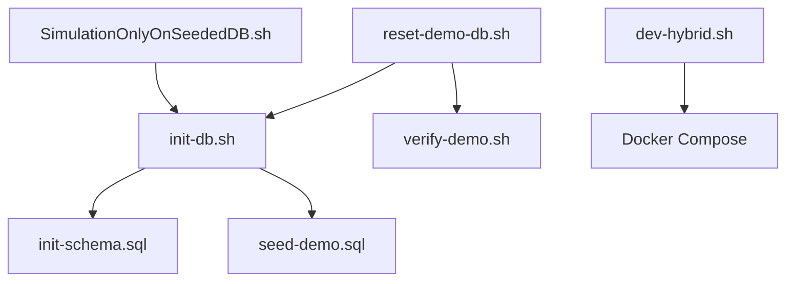

# SBTM Scripts Directory Structure

This document describes the hierarchical organization of scripts in the SBTM repository. All scripts are organized by function and purpose.

## Directory Structure

```
scripts/
├── SCHEMA & SEED ──────────────────────────────────────────
│   schema-seed/
│   ├── init-db.sh               Step 1 — apply schema + seed SUPER_ADMIN / STA_ADMIN
│   ├── import-and-seed.sh       Step 2 — import OSTA + RCJTC bundles, seed all credentials
│   ├── seed-v2.sql              Dev credentials SQL (upsert-safe, idempotent)
│   ├── init-schema.sql          Schema definitions (routes, stops, students)
│   ├── seed-standard.sql        Minimal seed data (no route data)
│   ├── seed-demo.sql            Full demo data with UUID-based routes
│   ├── reset-demo-db.sh         Destructive reset: drops volumes, rebuilds, seeds
│   └── verify-demo.sh           Verification script for seeded data
│
├── SIMULATION (canonical) ─────────────────────────────────
│   simulation/
│   ├── SimulationOnlyOnSeededDB.sh   Main GPS simulation runner
│   ├── seeded-run.ts                 Simulation logic using seeded routes
│   ├── demo-sim-config.json          Configuration for GPS events
│   └── demo-gen-config.ts            Generator for simulation config
│
├── ROUTE GENERATION (utility) ─────────────────────────────
│   route-gen/
│   ├── generate-demo-routes.ts       Generates UUID-based route data
│   ├── generate-osrm-routes.ts       OSRM route optimization
│   ├── densify-tracks.ts             GPS track densification
│   └── demo-routes.json              Generated route geometries
│
├── DEV WORKFLOW ───────────────────────────────────────────
│   dev/
│   ├── dev-hybrid.sh            Docker infra + local services
│   ├── dev-mock.sh              Full mock mode (no real services)
│   ├── dev-stop.sh              Stop all development processes
│   ├── start-hybrid.sh          Alternative hybrid startup
│   └── setup-osrm.sh            Initialize OSRM routing engine
│
├── MOBILE ─────────────────────────────────────────────────
│   mobile/
│   ├── mobile-build.sh          Build mobile apps (iOS/Android)
│   ├── mobile-submit.sh         Submit to app stores
│   └── phone-deploy.sh          Deploy to physical devices
│
├── MIGRATIONS ─────────────────────────────────────────────
│   migrations/
│   └── run-alert-config-migration.sh   Alert configuration migration
│
├── CLOUD DEPLOYMENT ───────────────────────────────────────
│   azure/                       Azure-specific deployment scripts
│   gcp/                         GCP-specific deployment scripts
│
└── BACKWARD COMPATIBILITY WRAPPERS ────────────────────────
    *.sh (root level)            Wrapper scripts for backward compatibility
```

## Key Scripts

### Database Initialization

v2 setup is a two-step process:

**Step 1** — `scripts/schema-seed/init-db.sh` (wrapper → `schema-seed/init-db.sh`)

- Applies the v2 schema (migrations + staging tables)
- Seeds SUPER_ADMIN + STA_ADMIN users only
- Idempotent (safe to run multiple times)

```bash
./scripts/schema-seed/init-db.sh
```

**Step 2** — `scripts/schema-seed/import-and-seed.sh`

- Commits both OSTA and RCJTC sample bundles via the integration-importer
  (populates `stx_boards`, `stx_schools`, `stx_operators`, `stx_vehicles`, GTFS tables, `stx_students`, `stx_guardians`, `stx_ridership`)
- Re-runs `seed-v2.sql` to fix board/school/driver/parent anchor IDs now that stx\_\* rows exist
- Idempotent (safe to re-run)

```bash
./scripts/schema-seed/import-and-seed.sh
```

> **OSRM road-snapped shapes** — to generate accurate road-snapped polylines instead of straight-line stop-to-stop shapes:
>
> ```bash
> OSRM_BASE_URL=http://localhost:5000 ./scripts/schema-seed/import-and-seed.sh
> ```

### Development Workflow

**scripts/dev-hybrid.sh** (wrapper → dev/dev-hybrid.sh)

- Starts Docker infrastructure (PostgreSQL, Redis, MinIO, OSRM)
- Runs selected services locally in development mode
- Starts admin dashboard

Usage:

```bash
./scripts/dev-hybrid.sh                          # All services + dashboard
./scripts/dev-hybrid.sh api-gateway gps-tracking # Selected services only
./scripts/dev-hybrid.sh --infra-only             # Infrastructure only
./scripts/dev-hybrid.sh --no-dashboard           # No admin dashboard
```

**scripts/dev-stop.sh** (wrapper → dev/dev-stop.sh)

- Stops all development processes
- Stops Docker containers

Usage:

```bash
./scripts/dev-stop.sh
```

### GPS Simulation

**scripts/SimulationOnlyOnSeededDB.sh** (wrapper → simulation/SimulationOnlyOnSeededDB.sh)

- Simulates GPS events for routes in the seeded database
- Requires database to be initialized first (`init-db.sh`)
- Uses UUID-based route identifiers

Usage:

```bash
./scripts/SimulationOnlyOnSeededDB.sh
```

### Demo Reset

**scripts/reset-demo-db.sh** (wrapper → schema-seed/reset-demo-db.sh)

- **DESTRUCTIVE**: Drops all Docker volumes
- Rebuilds containers
- Seeds fresh demo data
- Runs verification

Usage:

```bash
./scripts/reset-demo-db.sh                # Full reset with build
./scripts/reset-demo-db.sh --no-build     # Skip Docker rebuild
./scripts/reset-demo-db.sh --skip-verify  # Skip verification
```

## Migration Notes

### UUID-Only Route Identity

As of the UUID-Only Route Identity Migration, all scripts now use:

- **UUID-based route identifiers** (not string codes like `ROUTE-STBERN-R01-AM`)
- **Operational tables** (`routes`, `route_stops`, `students`) as single source of truth
- **No reference tables** (`routes_reference`, `route_stops_reference`, `students_reference` have been dropped)

### Hierarchical Organization

Scripts are now organized into functional subdirectories. Wrapper scripts at the root level provide backward compatibility for existing documentation and workflows.

## Common Workflows

### 1. Fresh v2 Development Environment

```bash
./scripts/dev-hybrid.sh                          # Start Docker infra + services
./scripts/schema-seed/init-db.sh                 # Step 1: schema + system users
./scripts/schema-seed/import-and-seed.sh         # Step 2: import bundles + all credentials

# With OSRM road-snapped route shapes (optional):
# OSRM_BASE_URL=http://localhost:5000 ./scripts/schema-seed/import-and-seed.sh
```

### 2. Update Schema Only

```bash
./scripts/init-db.sh                 # Rerun schema + seed
```

### 3. Stop Everything

```bash
./scripts/dev-stop.sh                # Stop services
docker compose down                  # Stop infrastructure
```

## Script Dependencies



## Development Guidelines

### Adding New Scripts

1. **Choose the correct directory** based on function
2. **Follow naming conventions**: Use kebab-case, descriptive names
3. **Add usage comments** at the top of each script
4. **Update this documentation** when adding new scripts
5. **Create wrapper** in root if the script is frequently referenced

### Script Standards

- Use `#!/usr/bin/env bash` shebang
- Enable strict mode: `set -euo pipefail`
- Use `SCRIPT_DIR` for path resolution
- Include usage documentation
- Make scripts idempotent when possible
- Use color coding for output (green=success, red=error, yellow=warning)

## Deprecated Scripts

The following scripts have been removed during the UUID-Only Route Identity Migration:

- `singlebus-*` (superseded by `SimulationOnlyOnSeededDB.sh`)
- `dynamic-*` (never wired into demo flow)
- `demo-simulate.sh`, `demo-run.ts` (replaced by canonical simulation)
- `simulate-demo.sh` (duplicate)
- `generate-demo-track.js` (one-off, output in seed)
- `demo-gps-track.json` (consumed by deleted scripts)
- `rls-policies.sql` (never referenced)
- `verify.sql` (superseded by `verify-demo.sh`)

## References

- [UUID-Only Route Identity Migration](../prd/v6/UUID-Only%20Route%20Identity%20Migration.md)
- [Local Development Guide](local_dev_testing_guide.md)
- [Cloud Debugging Guide](cloud_debugging_guide.md)
