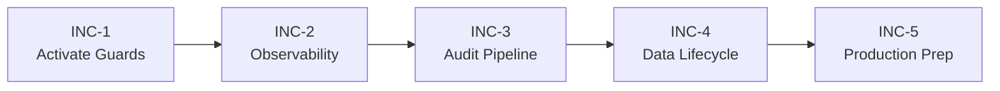

# SBTM v1 Post-Phase-5 Upgrade Plan

- Document owner: Product and Engineering
- Last reviewed: 2026-03-26
- Primary use: Remediation plan for gaps remaining after all five upgrade phases

## Purpose

This plan addresses the implementation gaps identified in [GapAnalysis.md](GapAnalysis.md). It sequences the remaining work into focused increments that can be delivered independently.

## Related Documents

- [GapAnalysis.md](GapAnalysis.md) — Post-Phase-5 gap analysis
- [../../Design/SecurityPrivacyArchitecture.md](../../Design/SecurityPrivacyArchitecture.md)
- [../../Design/DataRetention.md](../../Design/DataRetention.md)
- [../../Business/Requirements.md](../../Business/Requirements.md)
- [../../sdlc_guidelines/07_deployment_operations/monitoring_observability.md](../../sdlc_guidelines/07_deployment_operations/monitoring_observability.md)

## Increment Overview

| Increment | Focus | Priority | Effort |
|---|---|---|---|
| **[INC-1](#inc-1-activate-existing-security-controls)** | Activate rate limiting and service-to-service auth guards | Critical | Low |
| **[INC-2](#inc-2-observability-foundation)** | Correlation IDs, structured logging, OpenTelemetry setup | Critical | Medium |
| **[INC-3](#inc-3-centralized-audit-pipeline)** | Cross-service audit event emission and centralized storage | High | High |
| **[INC-4](#inc-4-data-lifecycle-and-privacy)** | Retention schedules, purge jobs, DSAR workflow | Medium | High |
| **[INC-5](#inc-5-secret-management-and-production-readiness)** | Secret management, CORS hardening, production deployment prep | Medium | Medium |

## Delivery Sequence



INC-1 and INC-2 can be worked in parallel as they have no dependencies on each other. INC-3 benefits from correlation IDs (INC-2) being in place. INC-4 and INC-5 are independent but logically follow the operational foundation.

---

## INC-1: Activate Existing Security Controls

### Goal

Wire existing but inactive security guards into the request pipeline so rate limiting and service-to-service authentication are enforced at runtime.

### Scope

#### 1.1 Apply ThrottlerGuard Globally

- Register `ThrottlerGuard` as a global guard in the API Gateway `AppModule`.
- Verify throttler configuration reads from `RATE_LIMIT_TTL` and `RATE_LIMIT_MAX` environment variables.
- Add `@SkipThrottle()` decorator to health check endpoints.

**Files affected:**
- `services/api-gateway/src/app.module.ts`

**Requirements traced:** SR-INPUT-001

#### 1.2 Activate Service-to-Service Auth

- Create a shared internal JWT signing key (`INTERNAL_SERVICE_SECRET`) in environment configuration.
- Apply `InternalServiceAuthGuard` to all internal-facing endpoints in downstream services.
- Add an HTTP interceptor in the API Gateway that attaches internal service JWT to outgoing requests.
- Verify that direct service access without the internal token returns 401.

**Files affected:**
- All service `app.module.ts` files
- API Gateway HTTP proxy/forwarding modules
- `docker-compose.yml` — add `INTERNAL_SERVICE_SECRET`

**Requirements traced:** SR-SVC-001, SR-SVC-002

### Acceptance Criteria

- [ ] Exceeding rate limit on any public endpoint returns HTTP 429.
- [ ] Direct HTTP call to a downstream service without internal token returns 401.
- [ ] Gateway-proxied calls succeed because the gateway attaches the internal token.
- [ ] Health check endpoints are exempt from rate limiting.

### Verification

| Test Type | Scope |
|---|---|
| Manual | Send 101 rapid requests to a public endpoint; verify 429 on the 101st |
| Manual | Call downstream service directly without internal token; verify 401 |
| Integration | Gateway → downstream service call succeeds with internal token |

---

## INC-2: Observability Foundation

### Goal

Establish cross-service observability so requests can be traced, logs are structured, and the platform is ready for production monitoring.

### Scope

#### 2.1 Correlation ID Middleware

- Add middleware to the API Gateway that generates a UUID `X-Request-Id` if not present in the incoming request.
- Propagate `X-Request-Id` to all outgoing HTTP calls to downstream services.
- Include `X-Request-Id` in all structured log entries in the gateway and downstream services.
- Include `X-Request-Id` in HTTP response headers.

**Files affected:**
- API Gateway middleware
- All service logging configuration
- HTTP proxy/forwarding modules

**Requirements traced:** OPS-TRACE-001

#### 2.2 Structured Logging

- Ensure all services emit JSON-structured log entries with fields: `timestamp`, `level`, `service`, `requestId`, `schoolId`, `message`.
- Replace console-based logging with structured logger where practical.

**Files affected:**
- All service logging setup

#### 2.3 OpenTelemetry Setup

- Configure OpenTelemetry NodeJS SDK with automatic HTTP instrumentation.
- Add OTLP exporter configuration (default to local Jaeger or console exporter for development).
- Add OpenTelemetry collector to `docker-compose.yml` for local development.

**Files affected:**
- New: `libs/tracing/` or service-level tracing bootstrap
- `docker-compose.yml` — add collector service

**Requirements traced:** NFR-OBS-001

### Acceptance Criteria

- [ ] Every response includes `X-Request-Id` header.
- [ ] Log entries across gateway and downstream services for the same request share the same `requestId`.
- [ ] OpenTelemetry traces appear in the local collector UI.

### Verification

| Test Type | Scope |
|---|---|
| Manual | Send request to gateway; verify `X-Request-Id` in response and in downstream service logs |
| Manual | Open Jaeger/collector UI; verify trace spans across gateway and at least one downstream service |

---

## INC-3: Centralized Audit Pipeline

### Goal

Deliver a cross-service audit trail where critical mutations from all services are captured, centralized, and queryable.

### Scope

#### 3.1 Audit Event Schema

Define a standard audit event payload:
```json
{
  "requestId": "uuid",
  "service": "api-gateway",
  "userId": "uuid",
  "schoolId": "uuid",
  "action": "CREATE",
  "resource": "route",
  "resourceId": "uuid",
  "timestamp": "ISO-8601",
  "details": {}
}
```

#### 3.2 Audit Event Emission

- Add audit event emission to critical mutation endpoints:
  - API Gateway: user creation, role changes, route CRUD, vehicle CRUD
  - Student Management: student enrollment, route assignment changes
  - Emergency Alerts: alert creation, status changes
  - Student Presence: manual presence overrides
  - Compliance Management: compliance record changes, inspection submissions

**Files affected:**
- Critical mutation handlers in all services

#### 3.3 Audit Event Consumer

- Create a BullMQ consumer (in compliance service or new audit module) that persists audit events to a dedicated audit table.
- Expose a query endpoint for audit log retrieval with filtering by service, resource, user, and time range.

**Files affected:**
- Compliance service or new audit module
- Database migration for centralized audit table

**Requirements traced:** OPS-AUDIT-001, SR-AUDIT-001

### Acceptance Criteria

- [ ] A route creation through the gateway produces a queryable audit record.
- [ ] Audit records include requestId for correlation with traces.
- [ ] Audit records from different services are stored in the same table and queryable together.
- [ ] Audit query endpoint supports filtering by service, resource type, and time range.

### Verification

| Test Type | Scope |
|---|---|
| Integration | Create route → verify audit record exists with correct fields |
| Integration | Create alert → verify audit record exists |
| Query test | Filter audit logs by service, resource, and time range |

---

## INC-4: Data Lifecycle and Privacy

### Goal

Implement data retention schedules, purge jobs, and privacy-response workflows required by PIPEDA alignment.

### Scope

#### 4.1 Retention Configuration

Define retention configuration per data class:

| Data Class | Retention | Action |
|---|---|---|
| GPS location records | 90 days | Purge |
| Emergency alert records | 1 year | Archive to cold table |
| Presence events | 90 days | Purge |
| Video metadata and files | 30 days | Purge |
| Audit logs | 2 years | Archive |
| Student records | Active enrollment + 1 year | Anonymize |

#### 4.2 Purge Jobs

- Implement scheduled BullMQ jobs for each data class.
- Run purge jobs on a configurable schedule (default: daily).
- Log purge actions to the audit trail.

**Files affected:**
- GPS Tracking: purge location_points older than threshold
- Emergency Alerts: archive alerts older than threshold
- Student Presence: purge events older than threshold
- Video Service: purge metadata and files older than threshold
- Compliance: archive audit logs older than threshold

#### 4.3 DSAR Workflow

- Implement a data subject access request endpoint that retrieves all personal data for a given parent or student.
- Implement a data deletion endpoint that removes personal data within SLA.
- Record DSAR fulfillment in the audit trail.

**Requirements traced:** PR-RET-001, PR-DEL-001, PR-ENC-001

### Acceptance Criteria

- [ ] GPS records older than 90 days are automatically purged.
- [ ] Purge job runs produce audit trail entries.
- [ ] DSAR endpoint returns all personal data for a student/parent.
- [ ] Data deletion endpoint removes personal data and logs the action.

### Verification

| Test Type | Scope |
|---|---|
| Scheduled job test | Insert old data → run purge job → verify data removed |
| DSAR test | Create test data → request DSAR → verify complete response |
| Retention test | Verify each data class has retention config and working purge |

---

## INC-5: Secret Management and Production Readiness

### Goal

Prepare the platform for production deployment by addressing remaining security and operational concerns.

### Scope

#### 5.1 Secret Management Planning

- Document the target secret management approach (Vault, cloud KMS, or managed secrets).
- Remove hardcoded secrets from docker-compose.yml and replace with `.env` file references.
- Add `.env.example` with placeholder values.

#### 5.2 CORS Hardening

- Ensure all services with HTTP endpoints validate CORS origins from configuration.
- Restrict allowed origins to configured values only.

#### 5.3 Production Deployment Checklist

- Create a production readiness checklist covering:
  - TLS termination
  - Database backup and restore procedures
  - Secret rotation procedures
  - Monitoring and alerting setup
  - Incident response readiness

**Requirements traced:** OPS-DEPLOY-002, NFR-DATA-001, OPS-RUN-001, OPS-BACKUP-001

### Acceptance Criteria

- [ ] No plaintext secrets in version-controlled configuration files.
- [ ] `.env.example` provides documented placeholder configuration.
- [ ] CORS origins are validated across all HTTP services.
- [ ] Production readiness checklist is documented and actionable.

### Verification

| Test Type | Scope |
|---|---|
| Code review | No hardcoded secrets in docker-compose.yml or source code |
| Manual | Cross-origin request from unauthorized origin is rejected |
| Documentation review | Production checklist covers all operational requirements |
