# PRD (Product Roadmap) - Complete Reference

> **Historical record (pre-v2 cutover).** This consolidated PRD references the legacy `OSTA_ADMIN` role, the v1 `FleetAssignment` workflow, `EmergencyAlert` flow, and `Route.polyline` column — all of which were removed by the v2 aggressive cutover (`docs/Design/SchemaAudit-And-Migration.md`). Treat this document as product-history context; the current data model and RBAC live in `docs/Design/DataModel-v2.md` §10 and the current API contract in `docs/Reference/Reference-Complete.md`.

## Table of Contents

### v1

- [v1/PhaseWiseImplementationPlan](#v1phaseWiseimplementationplan)
- [v1/GapAnalysis](#v1gapanalysis)
- [v1/UpgradePlan/README](#v1upgradeplanreadme)
- [v1/UpgradePlan/Phase-1-ParentSafetyCommunication](#v1upgradeplanphase-1-parentsafetycommunication)
- [v1/UpgradePlan/Phase-2-DriverPresence](#v1upgradeplanphase-2-driverpresence)
- [v1/UpgradePlan/Phase-3-GpsEventingGeofencing](#v1upgradeplanphase-3-gpseventinggeofencing)
- [v1/UpgradePlan/Phase-4-TenantAdminProvisioning](#v1upgradeplanphase-4-tenantadminprovisioning)
- [v1/UpgradePlan/Phase-5-SecurityProductionHardening](#v1upgradeplanphase-5-securityproductionhardening)

### v2

- [v2/AdminParentPortalOverhaulPlan](#v2adminparentportaloverhaulplan)

### v3

- [v3/BestPractices-Implementation](#v3bestpractices-implementation)

### v4

- [v4/UpgradePlan](#v4upgradeplan)
- [v4/GapAnalysis](#v4gapanalysis)
- [v4/AlertStrategy](#v4alertstrategy)
- [v4/RolesAndWorkflows](#v4rolesandworkflows)
- [v4/IntegrationAndMigration](#v4integrationandmigration)
- [v4/ProductionIntegrationChecklist](#v4productionintegrationchecklist)
- [v4/ProductionRolloutGuide](#v4productionrolloutguide)
- [v4/ImplementationPlanForPhaseBAlertGovernanceandConfirmation](#v4implementationplanforphasebalerttgovernanceandconfirmation)

### Backlog

- [Backlog/UpgradePlan](#backlogupgradeplan)
- [Backlog/GapAnalysis](#backloggapanalysis)

---

## v1/PhaseWiseImplementationPlan

_Source: `prd/v1/PhaseWiseImplementationPlan.md`_

# Phase-Wise Implementation Plan (Revised v1)

- Document owner: Product and Engineering
- Last reviewed: 2026-03-30
- Primary use: Delivery sequencing summary and index for detailed phase plans

This is the summary index for the SBTM v1 upgrade plan. Each phase has a self-contained implementation plan in the [UpgradePlan/](v1/UpgradePlan/README.md) directory with full scope, acceptance criteria, verification, dependencies, and module cross-references.

## Related Documents

- [GapAnalysis.md](v4/GapAnalysis.md)
- [UpgradePlan/README.md](v1/UpgradePlan/README.md) — Phase plan index
- [../Business/Requirements.md](../Business/Requirements.md)
- [../Design/Architecture.md](../Design/Architecture.md)
- [../Design/TechnicalSpecifications.md](../Design/TechnicalSpecifications.md)
- [../Test/TestingGuide.md](../Test/TestingGuide.md)
- [../Demo/DEMO_SETUP_GUIDE.md](../Demo/DEMO_SETUP_GUIDE.md)

## Planning Principles

- Build on what already exists instead of reworking implemented foundations.
- Close end-to-end workflow gaps before adding deeper platform sophistication.
- Sequence producer and consumer work together so new event-driven features become usable immediately.
- Keep each phase independently demonstrable and testable.

## Phase Summary

| Phase                                                                                           | Goal                                                                                                                   | Gap Level | Detail                                                                      |
| ----------------------------------------------------------------------------------------------- | ---------------------------------------------------------------------------------------------------------------------- | --------- | --------------------------------------------------------------------------- |
| **[Phase 1: Parent Safety Communication](v1/UpgradePlan/Phase-1-ParentSafetyCommunication.md)** | Deliver end-to-end parent notification — event occurs, parent receives message in near real time, delivery is recorded | Critical  | Notification backbone, parent delivery workflows, SSE integration           |
| **[Phase 2: Driver Presence](v1/UpgradePlan/Phase-2-DriverPresence.md)**                        | Make the driver app the authoritative presence-capture tool                                                            | High      | Roster-to-API wiring, BLE/SmartTag capture, route lifecycle state           |
| **[Phase 3: GPS Intelligence](v1/UpgradePlan/Phase-3-GpsEventingGeofencing.md)**                | Turn GPS from passive tracking into an operational intelligence pipeline                                               | High      | Event publication, geofencing, deviation detection, real route optimization |
| **[Phase 4: Tenant Administration](v1/UpgradePlan/Phase-4-TenantAdminProvisioning.md)**         | Operational multi-tenant onboarding without database seeding                                                           | Medium    | Org management, user provisioning, absence reporting, tenant dashboards     |
| **[Phase 5: Production Hardening](v1/UpgradePlan/Phase-5-SecurityProductionHardening.md)**      | Enterprise security, audit, and compliance controls                                                                    | Medium    | RLS, service-to-service auth, centralized audit, data lifecycle             |

## Delivery Sequence

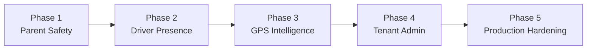

1. **Phase 1** — Unlocks the clearest business value: real parent alerts.
2. **Phase 2** — Makes field operations and presence data trustworthy.
3. **Phase 3** — Adds route intelligence atop stable eventing.
4. **Phase 4** — Enables real tenant onboarding after core workflows stabilize.
5. **Phase 5** — Hardens the platform for production readiness.

## Demo Impact by Phase

| After Phase | Demo Capability                                              |
| ----------- | ------------------------------------------------------------ |
| 1           | Real parent alerts instead of narrated future-state behavior |
| 2           | True boarding and alighting flows from the driver app        |
| 3           | Real route intelligence instead of placeholder optimization  |
| 4           | Live tenant and user onboarding                              |
| 5           | Credible production-readiness demonstration                  |

---

## v1/GapAnalysis

_Source: `prd/v1/GapAnalysis.md`_

# SBTM v1 Upgrade Gap Analysis

- Document owner: Product and Engineering
- Last reviewed: 2026-03-30
- Primary use: Verified gap inventory between the current implementation and the v1 target

## Purpose

This analysis compares the revised v1 design in `docs/Design`, the business and demo expectations in `docs/Business` and `docs/Demo`, and the current implementation across the apps and services. The goal is to identify the remaining deltas that matter for the upgrade plan, while correcting assumptions from earlier gap notes that are no longer accurate.

Related documents:

- [PhaseWiseImplementationPlan.md](./v1/PhaseWiseImplementationPlan.md)
- [UpgradePlan/](v1/UpgradePlan/README.md) — Self-contained phase plans (Phase 1–5)
- [../Design/Architecture.md](../Design/Architecture.md)
- [../Design/EventCatalog.md](../Design/EventCatalog.md)
- [../Business/Requirements.md](../Business/Requirements.md)
- [../Test/TestingGuide.md](../Test/TestingGuide.md)
- [../Demo/DEMO_SETUP_GUIDE.md](../Demo/DEMO_SETUP_GUIDE.md)

## Executive Summary

The current implementation already delivers a meaningful multi-service prototype: gateway auth and RBAC, GPS ingest and history, emergency alerts, student presence processing, compliance, video, student management, a working admin dashboard, a working parent portal, and a driver app with offline buffering.

The platform is materially ahead of the earlier gap documentation in a few areas:

- Multi-tenant foundations are in place in the API gateway and downstream services via `school_id` filtering.
- The driver app already has an AsyncStorage-backed offline queue for GPS, emergency, and presence events.
- The emergency alerts service already exposes both WebSocket broadcast and an SSE stream.
- The admin dashboard already includes basic board and school listing views.

The main v1 gaps are now concentrated in end-to-end event consumption, parent-facing delivery, operational intelligence, and production hardening:

- Event-driven architecture is only partially implemented. Alerts and presence publish BullMQ jobs, but GPS does not publish `location.updated`, and there is no real notification consumer pipeline.
- Parent workflows remain incomplete. The parent app polls for alerts and live location, but there is no push delivery, no absence workflow, and no notification history.
- Driver presence is only partially complete in the mobile app. Presence API posting exists, but the roster flow still toggles local state and BLE scanning is not implemented in the app.
- Route optimization and geofencing remain mock or unimplemented.
- Enterprise controls such as row-level security, service-to-service auth, centralized audit pipelines, and retention workflows remain planned rather than delivered.

## Confirmed Current-State Capabilities

### Platform and Services

- API gateway provides JWT auth, RBAC, multi-tenancy guards, and proxy routes for GPS, alerts, presence, video, students, compliance, parent, and driver workflows.
- GPS tracking service persists live and historical route locations with `schoolId` filtering.
- Emergency alerts service persists alerts, pushes BullMQ jobs, broadcasts alerts over WebSocket, and exposes an SSE stream.
- Student presence service supports manual and SmartTag-style detection processing, persists events, updates Redis-backed state, and publishes BullMQ jobs.
- Video, student management, and compliance services are implemented and integrated through the gateway.

### Applications

- Admin dashboard is connected to live APIs and includes dashboard, alerts, routes, route planner, students, vehicles, videos, compliance, and basic boards and schools pages.
- Driver app supports auth, route selection, GPS tracking, panic events, and offline buffering.
- Parent app supports auth, child list, live location polling, and active alert polling.

## Gap Matrix

| Area                              | v1 Target                                                                | Current State                                                                                                             | Gap Level | Notes                                                                          |
| --------------------------------- | ------------------------------------------------------------------------ | ------------------------------------------------------------------------------------------------------------------------- | --------- | ------------------------------------------------------------------------------ |
| Event bus                         | Domain events produced and consumed across services                      | Alerts and presence publish BullMQ jobs; GPS does not publish; consumers are largely placeholders                         | High      | The architecture is producer-heavy and not yet end-to-end                      |
| Notifications                     | Dedicated notification flow for parents across alert and presence events | Notification logic is a stub inside emergency-alerts; no standalone notification service; no real push/SMS/email delivery | Critical  | Blocks a major parent-facing value proposition                                 |
| Parent real-time delivery         | SSE or push-driven alert delivery and event updates                      | Alerts service has SSE, but parent app still polls and does not subscribe to SSE                                          | High      | Backend capability exists; frontend integration is missing                     |
| Driver presence workflow          | Manual and BLE-backed attendance from the mobile app                     | Presence API client exists, but the roster screen still updates local state only; BLE scanning is absent in the app       | High      | Service is ahead of the mobile UI integration                                  |
| GPS intelligence                  | `location.updated` events, route deviation detection, geofencing         | GPS ingest/history exists only; no event publishing and no geospatial alerting                                            | High      | Phase 3 scope has not started in code                                          |
| Route optimization                | Real provider-backed route optimization and map rendering                | Optimization service returns mocked ordering and placeholder polyline                                                     | Medium    | Suitable for demo, not for production operations                               |
| Organization management           | Board/school onboarding, CRUD, invitations, role provisioning            | Basic board/school listing pages exist; add-school action is not wired; no invite/provisioning workflow                   | Medium    | Earlier docs overstated the UI gap, but management workflows are still missing |
| OSTA and board views              | Cross-board and board-level operational dashboards                       | Tenant data exists, but role-specific aggregated dashboards and filters are limited                                       | Medium    | Partial support only                                                           |
| Identity and account provisioning | Unified provisioning for parent, driver, and admin accounts              | Login exists; invitation and lifecycle management do not                                                                  | Medium    | Important for real deployments and onboarding                                  |
| Multi-tenant isolation            | App-layer enforcement plus DB-layer RLS                                  | Gateway and services filter by `school_id`; no PostgreSQL RLS policies                                                    | Medium    | Adequate for prototype, below v1 enterprise target                             |
| Service-to-service security       | Internal JWT or mTLS between services                                    | Not implemented                                                                                                           | Medium    | Required before production hardening                                           |
| Audit and compliance pipeline     | Centralized audit trail for critical system mutations                    | Compliance service logs locally, but no cross-service centralized audit pipeline exists                                   | Medium    | Compliance observability remains fragmented                                    |
| Data lifecycle and privacy        | Retention, archival, deletion, and residency controls                    | Not implemented beyond basic storage choices                                                                              | Medium    | Business requirements call for privacy alignment                               |
| Parent absence reporting          | Guardians report absences and impact routing/operations                  | Not implemented                                                                                                           | Medium    | Called out in business scope, absent from delivered workflows                  |

## Detailed Gap Analysis

### 1. Core Application Workflow Gaps

#### 1.1 Driver App

Confirmed implemented:

- Login, route selection, GPS tracking, panic alert submission, and offline queueing.
- Presence API client for `BOARD` and `ALIGHT` events with offline buffering support.

Confirmed gaps:

- The roster screen currently changes local student state and is not the definitive presence workflow.
- BLE and SmartTag scanning is not implemented in the app, despite service-side support for SmartTag detections.
- Vehicle and route execution state are still partly hardcoded or minimally modeled in the active route flow.
- Driver operational lifecycle events such as route start, stop progression, and richer driver status telemetry are not fully surfaced.

Impact:

- Manual safety workflows are inconsistent between UI and backend.
- The mobile app does not yet function as the reliable presence-capture device envisioned in v1.

#### 1.2 Parent App

Confirmed implemented:

- Login, child list retrieval, and live route tracking via polling.
- Active alert polling for a route.

Confirmed gaps:

- No push notifications for alert, boarding, alighting, delay, or route-completion events.
- No SSE client usage even though the alerts backend exposes an SSE stream.
- No absence reporting or parent-initiated exception workflow.
- No notification inbox or delivery-state visibility.

Impact:

- The parent experience remains observational rather than proactive.
- Safety communication objectives are only partially met.

#### 1.3 Admin Dashboard

Confirmed implemented:

- Pages for dashboard, alerts, routes, route planner, students, vehicles, videos, compliance, boards, and schools.
- Integration with gateway-backed APIs and live alert and presence channels.

Confirmed gaps:

- Route planning still uses mocked optimization output and placeholder polyline data.
- Boards and schools pages provide basic listing only, not full tenant administration.
- No invitation or user provisioning workflows for board admins, school admins, drivers, or parents.
- OSTA-wide and board-level cross-tenant operational views are limited.

Impact:

- The dashboard is viable for internal demos and operations monitoring.
- It is not yet a complete administration surface for multi-tenant onboarding and operations.

### 2. Platform and Service Gaps

#### 2.1 Event-Driven Architecture Is Partial, Not Complete

The v1 design assumes business events are first-class integration points. In practice:

- Emergency alerts publish BullMQ jobs.
- Presence events publish BullMQ jobs.
- GPS events are only written to the database.
- Presence queue processing is a placeholder and does not drive downstream actions.
- Notification fan-out is not implemented as a proper consuming service.

Impact:

- The system behaves like a mixed synchronous/prototype architecture rather than the event-first architecture described in v1.
- Downstream capabilities such as parent notifications, analytics, and geofencing cannot be added cleanly without finishing the event pipeline.

#### 2.2 GPS Intelligence and Geofencing

Confirmed implemented:

- GPS tracking service persists location points and supports live and history retrieval.

Impact:

- Fleet visibility exists, but operational intelligence is limited.
- Delay, deviation, and predictive workflows cannot be trusted yet.

Confirmed gaps:

- No `location.updated` event emission.
- No geofencing or route-deviation logic.
- No ETA engine or path adherence analytics.
- No provider-backed routing engine to replace mocked route optimization.

#### 2.3 Multi-Tenancy, Identity, and Provisioning

Confirmed implemented:

- Gateway role checks and tenant scoping.
- `school_id` filtering in downstream services.
- Board and school data model support in the platform.

Impact:

- Multi-tenant structure exists, but operational onboarding still depends on manual or seeded data flows.

Confirmed gaps:

- No invitation flow for creating and onboarding users.
- No unified lifecycle management for parent, driver, and admin accounts.
- No board-aware enforcement in downstream databases beyond application filtering.
- No database RLS policies.

Impact:

- Current controls are sufficient for a controlled demo, not for the full v1 operating model.

#### 2.4 Security, Audit, and Data Lifecycle

Confirmed implemented:

- JWT-based auth at the gateway.
- Compliance-specific audit logging.

Impact:

- The system does not yet satisfy the full non-functional direction implied by PIPEDA/MFIPPA alignment and enterprise multi-tenant deployment.

Confirmed gaps:

- No service-to-service authentication.
- No centralized audit pipeline across all services.
- No defined retention, archival, purge, or privacy-response workflows.
- No evidence of production observability standards such as centralized tracing and metrics.

## Demo and Documentation Alignment

The demo documentation assumes a more complete narrative than the current product actually supports. The key mismatches are:

- Parent notifications are still narrated as future or simulated behavior.
- Route optimization is demo-safe but still mocked.
- Board and school management are partially represented in UI but not fully operable.
- Presence support exists in backend and partially in mobile code, but the main mobile interaction model is not yet authoritative.

These mismatches do not invalidate the demo, but they should be treated as guided-demo limitations rather than production-complete workflows.

## Corrections to Earlier Gap Assumptions

- Admin dashboard does expose basic board and school pages; the gap is incomplete management workflow, not complete absence of UI.
- Emergency alerts SSE support exists in the backend; the gap is client adoption and broader parent delivery.
- Driver presence posting support exists in the mobile codebase; the gap is that the main roster flow is not fully wired to that path and BLE scanning is still missing.
- Offline buffering in the driver app is implemented and should move out of the “pending” category.

## Reclassified Items From Earlier Reports

The following items should no longer be reported as entirely missing:

- Driver offline resilience.
- Driver presence API integration layer.
- Admin board and school UI presence.
- Alerts SSE backend support.

The following remain genuinely incomplete and should stay in the active gap list:

- notification delivery,
- GPS event publication,
- BLE scanning in the driver app,
- geofencing and route deviation alerts,
- account provisioning and invitations,
- RLS, service-to-service auth, centralized audit, and retention controls.

## Recommended Upgrade Priorities

1. Complete the event-consumption and parent notification path.
2. Finish the driver presence workflow in the app, including roster-to-API wiring and BLE capture.
3. Add GPS event publication and geofencing/deviation logic.
4. Replace mocked route optimization with provider-backed mapping and route services.
5. Complete tenant administration, provisioning, and cross-tenant operational views.
6. Harden the platform with RLS, service-to-service auth, centralized audit, and retention controls.

---

## v1/UpgradePlan/README

_Source: `prd/v1/UpgradePlan/README.md`_

# Upgrade Plan

- Document owner: Product and Engineering
- Last reviewed: 2026-03-30
- Primary use: Index for the phase-wise upgrade from prototype to v1

## Overview

This directory contains self-contained implementation plans for each upgrade phase, derived from the [Gap Analysis](../GapAnalysis.md) and the [Phase-Wise Implementation Plan](../PhaseWiseImplementationPlan.md).

Each phase file includes scope, acceptance criteria, verification steps, and cross-references to the relevant implementation modules, design docs, and business requirements.

## Phase Index

| Phase                                                            | Focus                                            | Gap Level | Status  |
| ---------------------------------------------------------------- | ------------------------------------------------ | --------- | ------- |
| [Phase 1](v1/UpgradePlan/Phase-1-ParentSafetyCommunication.md)   | Complete the Parent Safety Communication Loop    | Critical  | Planned |
| [Phase 2](v1/UpgradePlan/Phase-2-DriverPresence.md)              | Finish the Driver Presence Workflow              | High      | Planned |
| [Phase 3](v1/UpgradePlan/Phase-3-GpsEventingGeofencing.md)       | GPS Eventing, Geofencing, and Route Intelligence | High      | Planned |
| [Phase 4](v1/UpgradePlan/Phase-4-TenantAdminProvisioning.md)     | Tenant Administration and User Provisioning      | Medium    | Planned |
| [Phase 5](v1/UpgradePlan/Phase-5-SecurityProductionHardening.md) | Security, Compliance, and Production Hardening   | Medium    | Planned |

## Delivery Sequence


1. **Phase 1** unlocks the clearest business value — real parent alerts instead of narrated future-state.
2. **Phase 2** makes field operations and presence data trustworthy.
3. **Phase 3** adds route intelligence atop stable eventing.
4. **Phase 4** enables real tenant onboarding after core workflows are stable.
5. **Phase 5** hardens the platform for production readiness.

## Related Documents

- [../GapAnalysis.md](../GapAnalysis.md) — Verified gap inventory
- [../PhaseWiseImplementationPlan.md](../PhaseWiseImplementationPlan.md) — Summary plan
- [../../Business/Requirements.md](../Business/Requirements.md) — Business requirements
- [../../Design/Architecture.md](../Design/Architecture.md) — System architecture

---

## v1/UpgradePlan/Phase-1-ParentSafetyCommunication

_Source: `prd/v1/UpgradePlan/Phase-1-ParentSafetyCommunication.md`_

# Phase 1: Complete the Parent Safety Communication Loop

- Document owner: Product and Engineering
- Last reviewed: 2026-03-30
- Phase status: Planned
- Gap level: Critical

## Goal

Deliver the first fully end-to-end v1 workflow: an operational event occurs, the parent receives the right message in near real time, and the system records delivery outcomes.

## Why This Phase Is First

The notification delivery gap is classified as **Critical** in the gap analysis. Emergency alerts and presence events are produced by backend services but not consumed or delivered to parents. This phase closes the most impactful gap — parent safety communication — with the smallest dependency footprint.

## Current State (from Gap Analysis)

| Capability                                     | Status                        |
| ---------------------------------------------- | ----------------------------- |
| Emergency alerts published to BullMQ           | Implemented                   |
| Presence events published to BullMQ            | Implemented                   |
| Alert SSE stream from emergency-alerts service | Implemented                   |
| Parent app alert polling                       | Implemented                   |
| BullMQ job consumers (notification fan-out)    | Not implemented (placeholder) |
| Push/SMS/email notification delivery           | Not implemented               |
| Parent SSE/push subscription                   | Not implemented               |
| Notification audit trail                       | Not implemented               |

## Scope

### 1. Notification Delivery Backbone

- Create a dedicated notification service boundary (or module) with clear consumer responsibilities.
- Consume emergency alert and presence jobs from BullMQ.
- Introduce a provider abstraction for push, SMS, and email delivery channels. Start with one enabled channel.
- Persist notification attempts and delivery statuses for audit and support.

**Implementation modules affected:**

- [Module-4-EmergencyAlerts.md](../Implementation/Module-4-EmergencyAlerts.md) — Producer side (already implemented)
- [Module-6-StudentPresence.md](../Implementation/Module-6-StudentPresence.md) — Producer side (already implemented)
- New: Notification consumer (create or extend existing module)

**Requirements traced:**

- FR-NOTIFY-001: Deliver emergency alerts to parents on impacted route
- FR-NOTIFY-002: Deliver boarding/alighting events as parent notifications
- PR-CONSENT-001: Guardian consent required before notification delivery
- SR-AUTH-001: Notifications sent only to verified, authorized recipients

### 2. Parent Delivery Workflows

- Deliver emergency alerts to parents assigned to the impacted route.
- Deliver boarding and alighting notifications using presence events.
- Add a parent-facing notification list or recent activity feed.

**Implementation modules affected:**

- [Module-2-ParentApp.md](../Implementation/Module-2-ParentApp.md)

### 3. Parent App Real-Time Integration

- Replace alert polling with the existing SSE stream where appropriate.
- Preserve polling as a fallback, not the primary delivery mechanism.
- Add UI states for unread, failed, or delayed notifications.

**Implementation modules affected:**

- [Module-2-ParentApp.md](../Implementation/Module-2-ParentApp.md)
- [Module-8-ApiGateway.md](../Implementation/Module-8-ApiGateway.md) — SSE proxy if needed

## Dependencies

| Dependency                            | Source                        | Status               |
| ------------------------------------- | ----------------------------- | -------------------- |
| BullMQ producers in emergency-alerts  | Module-4                      | Implemented          |
| BullMQ producers in student-presence  | Module-6                      | Implemented          |
| Parent-to-route mapping in data model | Module-9 (Student Management) | Implemented (seeded) |
| JWT auth and RBAC                     | Module-8 (API Gateway)        | Implemented          |

## Acceptance Criteria

- [ ] An emergency alert generated by the driver is delivered to the correct parent audience.
- [ ] A presence event (board/alight) triggers a parent-visible notification without manual intervention.
- [ ] Delivery attempts are persisted and queryable for debugging and audit.
- [ ] Parent app can receive live alert changes without relying solely on periodic polling.
- [ ] Notification delivery respects guardian consent status.

## Verification

| Test Type        | Scope                                                                                             |
| ---------------- | ------------------------------------------------------------------------------------------------- |
| Integration test | Queue producer-to-consumer flow (enqueue alert job → consumer processes → notification persisted) |
| Integration test | Presence event → notification delivery                                                            |
| E2E test         | Driver triggers alert → parent receives notification                                              |
| Security test    | Notification only delivered to parents on the impacted route (tenant isolation)                   |
| Demo validation  | Seeded parent accounts receive notifications during live route demo                               |

## Demo Impact

After Phase 1 completion, the demo can show **real parent alerts** instead of narrated future-state behavior. The parent app will display live notifications during the demo route.

## Related Documents

- [../GapAnalysis.md](../GapAnalysis.md) — Gap: "Notifications" (Critical), "Parent real-time delivery" (High)
- [../../Design/EventCatalog.md](../Design/EventCatalog.md) — Event definitions
- [../../Business/Requirements.md](../Business/Requirements.md) — FR-NOTIFY-_, PR-CONSENT-_
- [../../sdlc_guidelines/03_architecture_design/design_guidelines.md](../sdlc_guidelines/03_architecture_design/design_guidelines.md) — Event-driven patterns

---

## v1/UpgradePlan/Phase-2-DriverPresence

_Source: `prd/v1/UpgradePlan/Phase-2-DriverPresence.md`_

# Phase 2: Finish the Driver Presence Workflow

- Document owner: Product and Engineering
- Last reviewed: 2026-03-30
- Phase status: Planned
- Gap level: High

## Goal

Make the driver app the authoritative field tool for presence capture rather than a partially local workflow. Manual roster actions and BLE/SmartTag detections both produce durable backend presence events.

## Why This Phase Is Second

Driver presence is the source-of-truth for whether a student is on the bus. Phase 1 builds the notification pipeline that consumes presence events — Phase 2 ensures those events are reliable and complete.

## Current State (from Gap Analysis)

| Capability                             | Status                                                         |
| -------------------------------------- | -------------------------------------------------------------- |
| Presence API client in driver app      | Implemented                                                    |
| Offline buffering (AsyncStorage queue) | Implemented                                                    |
| Roster screen (local state toggling)   | Implemented (local only)                                       |
| Presence events submitted to backend   | Partial (API client exists but roster UI not wired through it) |
| BLE/SmartTag scanning in driver app    | Not implemented                                                |
| Backend SmartTag detection processing  | Implemented                                                    |
| Route lifecycle state management       | Partial (some hardcoded values)                                |

## Scope

### 1. Roster-to-Presence API Wiring

- Replace local-only roster status toggling with calls through the existing presence service client.
- Reflect server-confirmed student state in the roster UI.
- Use offline buffering for presence updates when connectivity is lost.
- Handle conflict resolution when offline events sync after reconnection.

**Implementation modules affected:**

- [Module-3-DriverApp.md](../Implementation/Module-3-DriverApp.md)
- [Module-6-StudentPresence.md](../Implementation/Module-6-StudentPresence.md)

**Requirements traced:**

- FR-PRES-001: Driver manually records student boarding/alighting
- FR-PRES-002: Presence events persisted to backend
- NFR-PERF-002: Presence events processed within 300ms p95

### 2. BLE / SmartTag Capture

- Implement BLE scanning in the driver app using Expo BLE libraries.
- Translate BLE detections into the SmartTag detection payload expected by student-presence service.
- Add mobile-side throttling, deduplication, and reconnect behavior.
- Handle scan permissions and explain purpose to the driver.

**Implementation modules affected:**

- [Module-3-DriverApp.md](../Implementation/Module-3-DriverApp.md)
- [Module-6-StudentPresence.md](../Implementation/Module-6-StudentPresence.md)

**Requirements traced:**

- FR-PRES-003: Automated presence detection via BLE/SmartTag
- NFR-BATT-001: BLE scanning must not excessively drain driver device battery

### 3. Operational Route State

- Remove hardcoded route execution assumptions (fixed vehicle identifiers).
- Record route lifecycle state: route start, stop progression, route completion.
- Surface route state for downstream notifications and operations visibility.

**Implementation modules affected:**

- [Module-3-DriverApp.md](../Implementation/Module-3-DriverApp.md)
- [Module-1-GpsTracking.md](../Implementation/Module-1-GpsTracking.md)

## Dependencies

| Dependency                           | Source                        | Status                             |
| ------------------------------------ | ----------------------------- | ---------------------------------- |
| Phase 1 notification pipeline        | Phase 1                       | Required (for downstream delivery) |
| Student tag assignment data          | Module-9 (Student Management) | Implemented                        |
| Presence service SmartTag processing | Module-6                      | Implemented                        |
| Offline queue infrastructure         | Module-3 (Driver App)         | Implemented                        |

## Acceptance Criteria

- [ ] Manual roster actions create durable presence events in the backend.
- [ ] Server-confirmed student state is reflected in the driver app roster UI.
- [ ] BLE detections create board/alight transitions through the presence service.
- [ ] Offline presence actions flush successfully after reconnection.
- [ ] Route lifecycle events (start, stop progression, completion) are recorded.

## Verification

| Test Type               | Scope                                                                   |
| ----------------------- | ----------------------------------------------------------------------- |
| Mobile integration test | Roster action → presence API call → backend persistence                 |
| Device test             | Simulated or physical BLE beacon → SmartTag detection → presence event  |
| Offline test            | Queue presence events offline → reconnect → verify server state matches |
| Consistency check       | Redis presence state matches database records for a route               |
| Security test           | Presence events scoped to driver's assigned route only                  |

## Demo Impact

After Phase 2 completion, the demo can show **true boarding and alighting flows** from the driver app, with live presence events triggering parent notifications (via Phase 1 pipeline).

## Related Documents

- [Phase-1-ParentSafetyCommunication.md](v1/UpgradePlan/Phase-1-ParentSafetyCommunication.md) — Prerequisite: notification pipeline
- [../GapAnalysis.md](../GapAnalysis.md) — Gap: "Driver presence workflow" (High)
- [../../Design/Architecture.md](../Design/Architecture.md) — Presence service architecture
- [../../sdlc_guidelines/08_tech_specific/react_native_expo.md](../sdlc_guidelines/08_tech_specific/react_native_expo.md) — Mobile conventions

---

## v1/UpgradePlan/Phase-3-GpsEventingGeofencing

_Source: `prd/v1/UpgradePlan/Phase-3-GpsEventingGeofencing.md`_

# Phase 3: GPS Eventing, Geofencing, and Real Route Intelligence

- Document owner: Product and Engineering
- Last reviewed: 2026-03-30
- Phase status: Planned
- Gap level: High

## Goal

Turn the GPS stack from passive location tracking into an operational intelligence pipeline that publishes events, detects route deviations, and provides real route optimization.

## Why This Phase Is Third

GPS intelligence depends on the stable eventing foundation from Phase 1 and reliable route state from Phase 2. With those in place, GPS events can flow through the event pipeline and trigger downstream actions.

## Current State (from Gap Analysis)

| Capability                                        | Status                        |
| ------------------------------------------------- | ----------------------------- |
| GPS location ingest and persistence               | Implemented                   |
| GPS history retrieval with schoolId filtering     | Implemented                   |
| Live location polling/WebSocket broadcast         | Implemented                   |
| `location.updated` domain event publication       | Not implemented               |
| Geofencing logic (route corridor, stop proximity) | Not implemented               |
| Route deviation detection                         | Not implemented               |
| ETA calculation                                   | Not implemented               |
| Provider-backed route optimization                | Not implemented (mocked)      |
| Real route polyline data                          | Not implemented (placeholder) |

## Scope

### 1. GPS Event Publication

- Publish `location.updated` domain events from GPS ingest.
- Standardize event envelope fields to match the v1 event catalog.
- Enable downstream consumers (geofencing, notifications, analytics) to subscribe.

**Implementation modules affected:**

- [Module-1-GpsTracking.md](../Implementation/Module-1-GpsTracking.md)

**Requirements traced:**

- FR-GPS-001: Record vehicle location at configurable intervals
- FR-GPS-002: Publish location events for downstream consumption

### 2. Geofencing and Deviation Detection

- Define route corridor, stop proximity, and deviation thresholds as configurable parameters.
- Implement PostGIS-based spatial queries for geofence checks.
- Detect route deviations and generate derived alert events.
- Add ETA and route-progress calculations where feasible.

**Implementation modules affected:**

- [Module-1-GpsTracking.md](../Implementation/Module-1-GpsTracking.md)
- [Module-4-EmergencyAlerts.md](../Implementation/Module-4-EmergencyAlerts.md) — Consume derived alert events

**Requirements traced:**

- FR-GEO-001: Detect when a vehicle deviates from its assigned route corridor
- FR-GEO-002: Generate alert events for significant route deviations
- FR-GEO-003: Calculate ETA based on current position and route progress

### 3. Route Optimization and Mapping

- Replace mocked optimization output with provider-backed routing (e.g., OSRM, Google Directions, Mapbox).
- Replace placeholder polyline data with actual geometry returned by the provider.
- Surface route quality, duration, and distance metrics in admin route planner.

**Implementation modules affected:**

- [Module-7-AdminDashboard.md](../Implementation/Module-7-AdminDashboard.md) — Route planner UI
- [Module-8-ApiGateway.md](../Implementation/Module-8-ApiGateway.md) — Route optimization proxy
- [Module-1-GpsTracking.md](../Implementation/Module-1-GpsTracking.md) — Route data model

## Dependencies

| Dependency                      | Source                 | Status                                    |
| ------------------------------- | ---------------------- | ----------------------------------------- |
| Event pipeline (Phase 1)        | Phase 1                | Required (for event consumption)          |
| Stable route and stop data      | Module-8 (API Gateway) | Implemented                               |
| Route lifecycle state (Phase 2) | Phase 2                | Required (for deviation context)          |
| Map provider credentials        | External               | Needs selection and provisioning          |
| PostGIS spatial functions       | Module-1               | Available (PostgreSQL + PostGIS deployed) |

## Acceptance Criteria

- [ ] GPS ingest publishes `location.updated` events consumable by downstream services.
- [ ] Route deviations are detectable and generate alert events.
- [ ] Geofence thresholds are configurable per route.
- [ ] Route planner displays real path geometry from a provider (not placeholder polyline).
- [ ] Route optimization returns non-mocked ordering with distance/duration metrics.

## Verification

| Test Type              | Scope                                                                  |
| ---------------------- | ---------------------------------------------------------------------- |
| Contract test          | `location.updated` event envelope matches v1 event catalog             |
| Geofence scenario test | On-route, near-route, and off-route positions produce correct results  |
| Integration test       | GPS event → geofence check → deviation alert published                 |
| Visual verification    | Admin dashboard map renders real route geometry and live bus positions |
| Performance test       | GPS ingest p95 < 200ms under 100 updates/sec per school                |

## Demo Impact

After Phase 3 completion, the demo can show **real route intelligence** — live deviation detection, accurate route display on the map, and ETA estimates — instead of placeholder optimization output.

## Related Documents

- [Phase-1-ParentSafetyCommunication.md](v1/UpgradePlan/Phase-1-ParentSafetyCommunication.md) — Event pipeline foundation
- [Phase-2-DriverPresence.md](v1/UpgradePlan/Phase-2-DriverPresence.md) — Route state dependency
- [../GapAnalysis.md](../GapAnalysis.md) — Gap: "GPS intelligence" (High), "Route optimization" (Medium)
- [../../Design/DataArchitecture.md](../Design/DataArchitecture.md) — GPS data domain
- [../../sdlc_guidelines/08_tech_specific/postgresql_postgis.md](../sdlc_guidelines/08_tech_specific/postgresql_postgis.md) — PostGIS guidelines

---

## v1/UpgradePlan/Phase-4-TenantAdminProvisioning

_Source: `prd/v1/UpgradePlan/Phase-4-TenantAdminProvisioning.md`_

# Phase 4: Tenant Administration and User Provisioning

- Document owner: Product and Engineering
- Last reviewed: 2026-03-30
- Phase status: Planned
- Gap level: Medium

## Goal

Move from seeded-demo tenant setup to operational multi-tenant onboarding. New boards, schools, and users can be created through the application without manual database seeding.

## Why This Phase Is Fourth

Core safety workflows (Phases 1–3) must be stable before adding administrative complexity. Tenant administration builds on those operational workflows to provide complete org management.

## Current State (from Gap Analysis)

| Capability                                          | Status                                          |
| --------------------------------------------------- | ----------------------------------------------- |
| Board and school data model                         | Implemented                                     |
| Basic board/school listing pages in admin dashboard | Implemented                                     |
| Board/school CRUD operations                        | Partial (list/view only; create/edit not wired) |
| User invitation flow                                | Not implemented                                 |
| Account lifecycle management                        | Not implemented (login only)                    |
| Role provisioning beyond initial seed               | Not implemented                                 |
| Cross-tenant operational dashboards                 | Partial (limited filtering)                     |
| Parent absence reporting                            | Not implemented                                 |

## Scope

### 1. Organization Management Workflows

- Extend boards and schools pages from read/list views to full CRUD with lifecycle management.
- Add role-aware administration experiences (OSTA Admin manages boards, Board Admin manages schools).
- Implement form validation and business rules for org creation.

**Implementation modules affected:**

- [Module-7-AdminDashboard.md](../Implementation/Module-7-AdminDashboard.md)
- [Module-8-ApiGateway.md](../Implementation/Module-8-ApiGateway.md) — Org management API endpoints

**Requirements traced:**

- FR-ADMIN-001: Create and manage boards
- FR-ADMIN-002: Create and manage schools within a board
- FR-ADMIN-003: Role-based administration access

### 2. User Provisioning

- Introduce invitation flows for board admins, school admins, drivers, and parents.
- Support account activation, password set/reset, deactivation.
- Implement role assignment and school/board scoping during provisioning.
- Email-based invitation delivery (leverages Phase 1 notification infrastructure).

**Implementation modules affected:**

- [Module-8-ApiGateway.md](../Implementation/Module-8-ApiGateway.md) — Auth and provisioning endpoints
- [Module-9-StudentManagement.md](../Implementation/Module-9-StudentManagement.md) — Parent-student linking
- [Module-7-AdminDashboard.md](../Implementation/Module-7-AdminDashboard.md) — Provisioning UI

**Requirements traced:**

- FR-PROV-001: Invite users by email with role assignment
- FR-PROV-002: User activates account and sets credentials
- FR-PROV-003: Admin can deactivate/reactivate user accounts
- SR-AUTH-002: Provisioned users inherit tenant scope from invitation

### 3. Operational Visibility by Tenant Level

- Add OSTA-wide dashboard (cross-board aggregation).
- Add board-level dashboard (cross-school within board).
- Ensure school-level views remain correctly scoped.
- Add reporting counts and filters aligned with tenant hierarchy.

**Implementation modules affected:**

- [Module-7-AdminDashboard.md](../Implementation/Module-7-AdminDashboard.md)

### 4. Parent Absence Workflow

- Add guardian absence reporting endpoint and UI.
- Surface absence effects to driver roster and admin operational views.
- Integrate absence data with presence tracking to avoid false alerts.

**Implementation modules affected:**

- [Module-2-ParentApp.md](../Implementation/Module-2-ParentApp.md)
- [Module-6-StudentPresence.md](../Implementation/Module-6-StudentPresence.md) — Absence-aware processing
- [Module-7-AdminDashboard.md](../Implementation/Module-7-AdminDashboard.md) — Admin visibility

**Requirements traced:**

- FR-ABS-001: Guardian can report an absence for a scheduled trip
- FR-ABS-002: Absence is visible to the driver and admin before route start

## Dependencies

| Dependency                            | Source   | Status                           |
| ------------------------------------- | -------- | -------------------------------- |
| Stable auth and tenant data model     | Module-8 | Implemented                      |
| Notification infrastructure (Phase 1) | Phase 1  | Required (for invitation emails) |
| Business rules for role ownership     | Product  | Needs clarification              |

## Acceptance Criteria

- [ ] A new board and school can be onboarded through the admin dashboard (no database seeding).
- [ ] A user can be invited, activate their account, and be scoped to the correct tenant.
- [ ] OSTA-wide, board-level, and school-level dashboards show correctly scoped data.
- [ ] A parent can report an absence, and it is visible to the driver and admin.
- [ ] Cross-tenant access is denied for non-OSTA roles.

## Verification

| Test Type                | Scope                                                                         |
| ------------------------ | ----------------------------------------------------------------------------- |
| E2E test                 | Create board → create school → invite admin → admin activates account         |
| RBAC test                | Each role can only manage resources at or below its tenant level              |
| Authorization regression | Cross-tenant access attempts are denied                                       |
| Absence workflow test    | Parent reports absence → driver sees updated roster → no false boarding alert |
| Demo validation          | Onboard a new tenant live during demo                                         |

## Demo Impact

After Phase 4 completion, the demo can **onboard tenants and users live** instead of relying on pre-seeded database data.

## Related Documents

- [Phase-1-ParentSafetyCommunication.md](v1/UpgradePlan/Phase-1-ParentSafetyCommunication.md) — Notification infrastructure for invitations
- [../GapAnalysis.md](../GapAnalysis.md) — Gaps: "Organization management" (Medium), "Identity and provisioning" (Medium), "Parent absence" (Medium)
- [../../Business/UseCases.md](../Business/UseCases.md) — Admin and parent use cases
- [../../Design/Architecture.md](../Design/Architecture.md) — Multi-tenancy architecture

---

## v1/UpgradePlan/Phase-5-SecurityProductionHardening

_Source: `prd/v1/UpgradePlan/Phase-5-SecurityProductionHardening.md`_

# Phase 5: Security, Compliance, and Production Hardening

- Document owner: Product and Engineering
- Last reviewed: 2026-03-30
- Phase status: Planned
- Gap level: Medium

## Goal

Close the gap between a functioning prototype and a deployable enterprise-aligned platform. Security controls, audit infrastructure, and data lifecycle management reach production grade.

## Why This Phase Is Last

Hardening should be applied after core workflows are functionally complete. Phases 1–4 establish the operational surface; Phase 5 wraps it with enterprise security, observability, and compliance controls.

## Current State (from Gap Analysis)

| Capability                                              | Status                                            |
| ------------------------------------------------------- | ------------------------------------------------- |
| JWT-based auth at gateway                               | Implemented                                       |
| RBAC guards at gateway                                  | Implemented                                       |
| Application-layer tenant isolation (school_id)          | Implemented                                       |
| PostgreSQL RLS policies                                 | Not implemented                                   |
| Service-to-service authentication                       | Not implemented                                   |
| Centralized audit pipeline                              | Not implemented (compliance service logs locally) |
| Correlation IDs across services                         | Not implemented                                   |
| Data retention schedules                                | Not implemented                                   |
| Archival and purge workflows                            | Not implemented                                   |
| Production observability (centralized tracing, metrics) | Not implemented                                   |

## Scope

### 1. Database Tenant Hardening

- Add PostgreSQL Row-Level Security (RLS) policies for tenant-scoped tables in downstream services.
- Implement `SET app.current_school_id` in service middleware before queries.
- Review schema patterns that require tenant context propagation beyond `school_id` filtering.
- Test that RLS prevents cross-tenant data access even with direct SQL access.

**Implementation modules affected:**

- All service modules (1–6, 8–10) — database-layer changes
- [Module-8-ApiGateway.md](../Implementation/Module-8-ApiGateway.md) — Tenant context propagation

**Requirements traced:**

- NFR-SEC-001: Tenant isolation enforceable at database layer
- SR-TENANT-001: Cross-tenant data access prevented even with compromised application logic

### 2. Service-to-Service Trust

- Implement internal JWT signing or mTLS for inter-service communication.
- Define service identity for each backend service.
- Implement key rotation and failure behavior.
- Audit and log service-to-service calls with source attribution.

**Implementation modules affected:**

- All backend service modules — authentication middleware
- [Module-8-ApiGateway.md](../Implementation/Module-8-ApiGateway.md) — Token delegation

**Requirements traced:**

- SR-SVC-001: All internal service calls are authenticated and attributable
- SR-SVC-002: Service credentials rotate on a defined schedule

### 3. Centralized Audit and Observability

- Emit structured audit events for critical mutations across all services.
- Centralize logs using a log aggregation pipeline (ELK, Loki, or equivalent).
- Implement distributed tracing with correlation IDs (OpenTelemetry).
- Centralize metrics collection and dashboarding.
- Configure alerting for safety-critical metrics (see monitoring_observability.md).

**Implementation modules affected:**

- All service modules — audit event emission and structured logging
- New: Observability infrastructure setup

**Requirements traced:**

- OPS-AUDIT-001: All critical data mutations are auditable
- OPS-TRACE-001: Requests can be traced across service boundaries
- OPS-MON-001: Safety-critical services are monitored with alerting

### 4. Data Lifecycle and Privacy Controls

- Define and implement retention schedules for each data category:

| Data Category            | Retention                  | Action After            |
| ------------------------ | -------------------------- | ----------------------- |
| GPS location records     | 90 days                    | Archive to cold storage |
| Emergency alert records  | 1 year                     | Archive                 |
| Presence events          | 90 days                    | Archive                 |
| Video metadata and files | 30 days                    | Purge                   |
| Audit logs               | 2 years                    | Archive                 |
| Student records          | Active enrollment + 1 year | Anonymize               |

- Implement purge jobs as scheduled tasks.
- Implement data subject access requests (DSAR) workflow for PIPEDA compliance.
- Document data residency and encryption controls.

**Implementation modules affected:**

- All service modules — data lifecycle integration
- [Module-10-ComplianceManagement.md](../Implementation/Module-10-ComplianceManagement.md) — Compliance audit coordination

**Requirements traced:**

- PR-RET-001: Data retained only as long as necessary for stated purpose
- PR-DEL-001: Personal data deleted upon request within 30 days
- PR-ENC-001: PII encrypted at rest and in transit

## Dependencies

| Dependency                                 | Source     | Status             |
| ------------------------------------------ | ---------- | ------------------ |
| Stable event and notification architecture | Phase 1    | Required           |
| Complete operational workflows             | Phases 2–4 | Required           |
| Deployment topology decisions              | DevOps     | Needs decision     |
| Secret management infrastructure           | DevOps     | Needs setup        |
| Log aggregation service                    | DevOps     | Needs provisioning |

## Acceptance Criteria

- [ ] PostgreSQL RLS prevents cross-tenant data access at the database layer.
- [ ] Cross-service calls are authenticated and attributable to a specific service identity.
- [ ] Critical mutations across all services emit audit events that are centrally queryable.
- [ ] Requests can be traced across service boundaries using correlation IDs.
- [ ] Retention schedules are configured and purge jobs run on schedule.
- [ ] Data subject access requests can be fulfilled within 30 days.

## Verification

| Test Type               | Scope                                                                           |
| ----------------------- | ------------------------------------------------------------------------------- |
| Database security test  | Direct SQL query bypasses application but RLS blocks cross-tenant access        |
| Service auth test       | Internal call without valid service token is rejected                           |
| Audit completeness test | Create/update/delete operations across services produce queryable audit trail   |
| Tracing test            | E2E request produces correlated trace across gateway and 2+ downstream services |
| Retention test          | Data older than retention period is archived/purged on schedule                 |
| PIPEDA test             | DSAR workflow returns all personal data for a given subject within SLA          |

## Demo Impact

After Phase 5, the platform can credibly move from demo-grade to **production-readiness planning**. Security controls, audit trails, and compliance infrastructure demonstrate enterprise fitness.

## Related Documents

- [Phase-1-ParentSafetyCommunication.md](v1/UpgradePlan/Phase-1-ParentSafetyCommunication.md) through [Phase-4-TenantAdminProvisioning.md](v1/UpgradePlan/Phase-4-TenantAdminProvisioning.md) — Prerequisites
- [../GapAnalysis.md](../GapAnalysis.md) — Gaps: "Multi-tenant isolation" (Medium), "Service-to-service security" (Medium), "Audit and compliance" (Medium), "Data lifecycle" (Medium)
- [../../sdlc_guidelines/01_security_compliance/privacy_compliance.md](../sdlc_guidelines/01_security_compliance/privacy_compliance.md) — PIPEDA/MFIPPA compliance rules
- [../../sdlc_guidelines/07_deployment_operations/monitoring_observability.md](../sdlc_guidelines/07_deployment_operations/monitoring_observability.md) — Observability standards
- [../../sdlc_guidelines/07_deployment_operations/incident_response.md](../sdlc_guidelines/07_deployment_operations/incident_response.md) — Incident management
- [../../Design/SecurityPrivacyArchitecture.md](../Design/SecurityPrivacyArchitecture.md) — Security architecture

---

## v2/AdminParentPortalOverhaulPlan

_Source: `prd/v2/AdminParentPortalOverhaulPlan.md`_

# Plan: SBTM Admin & Parent Portal Overhaul

Fix 6 problem areas across 6 phases. All UIs get modern dark glassmorphic treatment. Admin becomes a Command Center; Parent becomes a Card UI with bottom-sheet map.

Decisions confirmed: OSRM runtime snapping, Command Center admin, Card UI parent, glassmorphic design system.

## Phase 1: Fix Alerts Pipeline (Backend + Frontend)

Root cause: Dashboard calls GET /api/v1/alerts and PATCH /api/v1/alerts/:id/resolve - neither exists in backend. Both 404 -> "No Alerts."

1. Add findAll(schoolId?) to AlertsService - query all alerts without status filter (parallel with 2)
2. Add resolve(id) to AlertsService - set status RESOLVED
3. Add GET /alerts and PATCH /alerts/:id/resolve to emergency-alerts controller (depends on 1,2)
4. Add proxy routes in API Gateway controller (depends on 3)
5. Update frontend Alert type - add lat, lng, driverId, schoolId

Relevant files: alerts.service.ts, alerts.controller.ts, gateway alerts.controller.ts, types/index.ts, alerts.api.ts

## Phase 2: Road-Aligned GPS via OSRM (Option B - Runtime Snap)

Root cause: Linear interpolation between waypoints cuts across buildings. No road-snapping.

1. Add osrm service to docker-compose.yml - osrm/osrm-backend with Ottawa/Ontario PBF extract, port 5000
2. Create OsrmService in GPS tracking - calls GET http://osrm:5000/match/v1/driving/{coords}?geometries=geojson&radiuses=50
3. Add snappedLat, snappedLng columns to LocationPoint in Prisma schema
4. Integrate into LocationService.ingestLocation() - snap on ingest, store both raw + snapped coords
5. Update getLatestLocation() and getRouteHistory() - return snapped coords when available
6. Densify demo-gps-track.json waypoints using OSRM route API (50m sampling, ~50-100 points/route)
7. Adjust simulate-demo.sh for denser waypoint lists

Relevant files: docker-compose.yml, schema.prisma, services/gps-tracking/src/services/osrmService.ts (new), locationService.ts, demo-gps-track.json, simulate-demo.sh

## Phase 3: Route Planner Enhancements

1. Create RouteDetail.tsx at /routes/:id - info panel, stop list, assigned students, map with polyline + markers (parallel with 2)
2. Create RouteEdit.tsx at /routes/:id/edit - pre-filled form, updateRoute() API. Share form components with planner
3. Add View/Edit/Delete buttons to RouteCard.tsx with glassmorphic delete confirmation modal (parallel with 1)
4. Map click-to-add-stop: useMapEvents in planner - click -> Nominatim reverse-geocode -> auto-fill address + lat/lng
5. Polyline drawing: Click points to trace route path, real-time preview, double-click finishes
6. Draggable stop markers: Marker with draggable=true, update coords on dragend
7. Fix map center: Toronto -> Ottawa [45.3920, -75.7130]
8. Replace hardcoded schoolId: 's1' with dynamic value from user context
9. Add routes to App.tsx router: /routes/:id, /routes/:id/edit

Relevant files: RoutePlanner.tsx, RouteDetail.tsx (new), RouteEdit.tsx (new), RouteCard.tsx, App.tsx

## Phase 4: Student Presence Dashboard

1. Backend: GET /api/v1/presence/stats?schoolId= -> { totalTracked, boarded, alighted, unknown, byRoute[] } (parallel with 2)
2. Backend: GET /api/v1/presence/events?studentName=&schoolId=&routeId=&vehicleId=&eventType=&page=&limit= -> paginated events with student/school/bus/route info
3. Gateway proxy for both (depends on 1,2)
4. Stats Panel: Glassmorphic stat cards (Total, Boarded, Alighted, Unknown) + Recharts donut chart by route
5. Detail Table: Glass-card table - Student Name, School, Status badge ("On Bus ✓" green / "Dropped Off" blue), Timestamp, Bus, Route. Paginated
6. Filters Bar: Glass filter row - student name search, school dropdown, bus dropdown, route dropdown, event type toggle
7. Wire PresenceWebSocket for real-time updates (class exists but is never connected)
8. Replace raw "BOARDED"/"ALIGHTED" enum with friendly styled badges

Relevant files: presence.controller.ts, presence.service.ts, Students.tsx, presence.api.ts, PresenceStats.tsx (new), PresenceTable.tsx (new), PresenceFilters.tsx (new)

## Phase 5: Resizable/Collapsible UI + Map Fullscreen

1. Collapsible Sidebar: Chevron toggle, w-16 (icons only) <-> w-64 (full), transition-all duration-300, localStorage persistence. Dynamic ml- offset on main
2. Map Fullscreen: Floating glassmorphic expand button (Maximize2/Minimize2) on all maps. Fullscreen = fixed inset-0 z-50 with backdrop. ESC to exit
3. Resizable Panels: Install react-resizable-panels. Wrap map|list splits on Routes, Students, Dashboard in PanelGroup with PanelResizeHandle
4. Flexible map heights: h-[400px]/h-[500px] -> flex-1 min-h-[300px]

Relevant files: Sidebar.tsx, App.tsx, LiveMap.tsx, all pages with maps

New dependency: react-resizable-panels

## Phase 6: Glassmorphic UI Overhaul

### 6A: Admin Dashboard - Command Center

The admin already has a dark glassmorphic foundation (.glass-card, backdrop-blur-xl, slate palette in index.css). Build on top of it:

Layout:

- Collapsible Sidebar (w-16 collapsed / w-64 expanded)
- Full-width map hero (70vh)
- Floating glass overlays on map (bus list left, route detail drawer right)
- Alert ticker bar along map bottom
- Stat cards + charts section below map
  ┌───────────────────────────────────────────────────────┐
  │ [≡] Sidebar (w-16 collapsed / w-64 expanded) │
  ├───────────────────────────────────────────────────────┤
  │ │
  │ FULL-WIDTH MAP (70vh hero) │
  │ │
  │ ┌──────────┐ ┌────────────────┐ │
  │ │ Bus List │ (map surface) │ Route Detail │ │
  │ │ Glass │ │ Side Drawer │ │
  │ │ Panel │ │ (slides right) │ │
  │ │ (left) │ │ │ │
  │ └──────────┘ └────────────────┘ │
  │ ┌───────────────────────────────────────────────────┐ │
  │ │ 🔴 ALERT TICKER — scrolling live alerts │ │
  │ └───────────────────────────────────────────────────┘ │
  ├───────────────────────────────────────────────────────┤
  │ [Active Routes] [Buses Running] [Students] [Alerts] │
  │ ┌─────────────────────┐ ┌─────────────────────────┐ │
  │ │ Presence Donut │ │ Alert History │ │
  │ └─────────────────────┘ └─────────────────────────┘ │
  └───────────────────────────────────────────────────────┘
  New CSS utilities in index.css:

- .glass-panel - bg-slate-900/60 backdrop-blur-2xl border border-white/10 rounded-2xl shadow-2xl
- .glass-pill - bg-white/10 backdrop-blur-md border border-white/5 rounded-full
- .glass-input - bg-white/5 backdrop-blur-md border border-white/10 rounded-xl
- .gradient-border - gradient wrapper for highlighted cards
- .alert-ticker - bg-red-950/80 backdrop-blur-xl border-t border-red-500/30
- Animations: slide-in-right (drawer), ticker (scrolling alerts), count-up (stats)

Dashboard.tsx redesign: 70vh map hero, floating glass bus list (left), route detail drawer (right, slides on click via framer-motion), alert ticker bar (bottom), stat cards + charts below map

Sidebar redesign: Collapsed -> icon + tooltip on hover. Active: gradient left border + bg-primary-500/10

### 6B: Parent Portal - Glassmorphic Card UI

Current state: plain white bg-gray-100 with no custom theme. Full redesign:

Theme: Dark glassmorphic matching admin. tailwind.config.js gets same dashboard + primary tokens. index.css gets glass utilities, dark body, Inter font, custom scrollbars.

Dashboard:

- Glass top nav (sticky)
- Alert banner (glass + pulsing)
- Child cards (glass) with ETA progress bars, route/bus details, status badge, Track Live CTA
  ┌──────────────────────────────────┐
  │ TOP NAV (glassmorphic, sticky) │
  │ [🚌 Parent Portal] [🔔] [👤] │
  ├──────────────────────────────────┤
  │ ⚠️ ALERT BANNER (glass, pulsing) │
  │ │
  │ ┌────────────────────────────┐ │
  │ │ 👦 Child Card (glass) │ │
  │ │ Name • School • Route │ │
  │ │ ┌──────────────────────┐ │ │
  │ │ │ ETA: 3 min ████░ 85%│ │ │
  │ │ └──────────────────────┘ │ │
  │ │ Status: 🟢 On Bus │ │
  │ │ [📍 Track Live] │ │
  │ └────────────────────────────┘ │
  └──────────────────────────────────┘
  Map page:

- Full-screen map
- Route polyline + stop markers + animated bus marker
- Glass top bar
- Draggable bottom sheet with live ETA, next stop, and journey timeline
  ┌──────────────────────────────────┐
  │ [← Back] Child: Alex Johnson │ ← glass top bar
  ├──────────────────────────────────┤
  │ FULL-SCREEN MAP │
  │ - Route polyline (blue) │
  │ - Stop markers (glass dots) │
  │ - Animated bus marker │
  ├──────────────────────────────────┤
  │ ┌────────────────────────────┐ │ ← draggable bottom sheet
  │ │ 🟢 Live • ETA: 3 min │ │
  │ │ Next stop: Bank & Heron │ │
  │ │ Timeline: │ │
  │ │ ⬤ 8:01 Departed Stop 1 │ │
  │ │ ⬤ 8:05 Passed Stop 2 │ │
  │ │ ○ 8:08 Next: Stop 3 (you) │ │
  │ └────────────────────────────┘ │
  └──────────────────────────────────┘
  Specific file changes:

- tailwind.config.js - add dashboard + primary color tokens
- src/index.css - glass utilities, dark body, Inter font
- Layout.tsx - dark glass nav, gradient logo, glass-pill nav items
- Dashboard.tsx - glass child cards, ETA progress bar, gradient status badges
- Map.tsx - route polyline, stop markers, glass bottom sheet (draggable via framer-motion)
- Login.tsx - dark gradient background, centered glass card
- Notifications.tsx - glass cards with status-colored left border
- AbsenceReport.tsx - glass form card

New dependency: framer-motion (drawer slide-in, bottom sheet drag, card transitions)

## Verification

1. Phase 1: simulate-demo.sh --interval 5 --laps 1 -> alerts page loads, All/Active/Resolved filter works, resolve button transitions status
2. Phase 2: Restart stack with OSRM, run simulation -> buses follow Ottawa streets (not cutting through buildings)
3. Phase 3: Create route via map clicks -> stops auto-geocoded, drag to adjust, save persists. Edit existing route. Delete with confirm
4. Phase 4: Run simulation -> stats panel shows live counts, donut chart updates, table rows populate, filters narrow results, WebSocket pushes appear without refresh
5. Phase 5: Toggle sidebar collapse, resize map fullscreen (ESC exits), drag panel handles, verify layout at different viewports
6. Phase 6: Visual QA - all glass styling, dark backgrounds, animations smooth (60fps), parent portal mobile-responsive

## Scope

Included: All 6 phases - alerts fix, OSRM integration, route planner CRUD+map, presence dashboard, resize/collapse, full glassmorphic redesign of both portals

Excluded: Parent mobile app (placeholder), actual push/SMS delivery (stub logs only), driver app UI, video service UI

---

## v3/BestPractices-Implementation

_Source: `prd/v3/BestPractices-Implementation.md`_

# Best Practices Implementation Plan

> **Created**: 2026-03-31  
> **Status**: In Progress  
> **Priority**: Security → Standardization → Performance → Observability

This document covers 5 medium-effort improvements identified during the codebase best-practices gap analysis. Items are ordered by priority.

---

## Item 1: httpOnly Cookies + Secure Token Storage

**Priority**: Highest (Security)  
**Risk**: Medium  
**Current State**: JWTs stored in `localStorage` — vulnerable to XSS attacks.  
**Target State**: JWT delivered via httpOnly, Secure, SameSite=Strict cookie.

### Steps

| Step | Change                                                                                                    | Files                                                                                                     |
| ---- | --------------------------------------------------------------------------------------------------------- | --------------------------------------------------------------------------------------------------------- |
| A    | Add `cookie-parser` to api-gateway dependencies                                                           | `services/api-gateway/package.json`                                                                       |
| B    | Register cookie-parser middleware in bootstrap                                                            | `services/api-gateway/src/main.ts`                                                                        |
| C    | Modify login endpoint to set accessToken as httpOnly cookie instead of JSON body                          | `services/api-gateway/src/modules/auth/auth.controller.ts`                                                |
| D    | Add `/auth/logout` endpoint that clears the cookie                                                        | `services/api-gateway/src/modules/auth/auth.controller.ts`                                                |
| E    | Update JwtStrategy to extract token from cookie (fallback to Authorization header for service-to-service) | `services/api-gateway/src/modules/auth/strategies/jwt.strategy.ts`                                        |
| F    | Admin dashboard: add `withCredentials: true` to axios, remove `localStorage.setItem('auth_token')`        | `apps/admin-dashboard/src/services/api/api-client.ts`, `apps/admin-dashboard/src/context/AuthContext.tsx` |
| G    | Parent app: same as F                                                                                     | `apps/parent-dashboard/web/src/services/api.ts`, `apps/parent-dashboard/web/src/context/AuthContext.tsx`  |

### Cookie Configuration

```typescript
res.cookie('access_token', accessToken, {
  httpOnly: true,
  secure: process.env.NODE_ENV === 'production',
  sameSite: 'strict',
  maxAge: 24 * 60 * 60 * 1000, // 24 hours
  path: '/',
});
```

### Backward Compatibility

- JwtStrategy must check cookie first, then fall back to Authorization header
- Service-to-service calls (InternalServiceAuthGuard) continue using Authorization header
- Driver app (React Native) continues using Authorization header (no cookies in mobile)

---

## Item 2: NestJS v10 → v11 Upgrade (api-gateway)

**Priority**: High (Standardization)  
**Risk**: Low-Medium  
**Current State**: api-gateway on NestJS v10.4.15, all other 5 NestJS services on v11.0.1.  
**Target State**: All services on NestJS v11.

### Dependencies to Bump

| Package                    | From     | To      |
| -------------------------- | -------- | ------- |
| `@nestjs/common`           | ^10.4.15 | ^11.0.1 |
| `@nestjs/core`             | ^10.4.15 | ^11.0.1 |
| `@nestjs/platform-express` | ^10.4.15 | ^11.0.1 |
| `@nestjs/jwt`              | ^10.2.0  | ^11.0.0 |
| `@nestjs/passport`         | ^10.0.3  | ^11.0.0 |
| `@nestjs/typeorm`          | ^10.0.2  | ^11.0.0 |
| `@nestjs/config`           | ^3.3.0   | ^4.0.2  |
| `@nestjs/throttler`        | ^5.2.0   | ^6.4.0  |

### Steps

| Step | Change                                                                    |
| ---- | ------------------------------------------------------------------------- |
| A    | Update all `@nestjs/*` versions in `services/api-gateway/package.json`    |
| B    | Run `pnpm install` to resolve                                             |
| C    | Fix any breaking import/API changes (decorator signatures, module config) |
| D    | Verify build: `pnpm --filter api-gateway build`                           |
| E    | Run unit tests: `pnpm --filter api-gateway test`                          |
| F    | Run e2e tests: `pnpm --filter api-gateway test:e2e`                       |

### Known Breaking Changes (v10→v11)

- `@nestjs/config`: ConfigModule API unchanged, but package major bumped
- `@nestjs/throttler`: v5→v6 changes guard registration pattern
- `@nestjs/passport`: Strategy registration syntax unchanged
- Decorator compatibility: @Req(), @Res(), @Body() unchanged

---

## Item 3: TanStack Query (Frontend Data Fetching)

**Priority**: Medium (Performance/DX)  
**Risk**: Medium  
**Current State**: Direct axios calls with manual `useEffect` + `useState` polling.  
**Target State**: TanStack Query for caching, deduplication, automatic refetch, retry.

### Steps

| Step | Change                                                         | Files                                                                         |
| ---- | -------------------------------------------------------------- | ----------------------------------------------------------------------------- |
| A    | Add `@tanstack/react-query` + `@tanstack/react-query-devtools` | `apps/admin-dashboard/package.json`, `apps/parent-dashboard/web/package.json` |
| B    | Create `QueryClientProvider` wrapper                           | Each app's entry point (`main.tsx` or `App.tsx`)                              |
| C    | Create query key factory                                       | `src/services/query-keys.ts` in each app                                      |
| D    | Convert API service files to return fetcher functions          | `src/services/api/*.ts`                                                       |
| E    | Replace `useEffect` + `useState` patterns with `useQuery`      | Dashboard.tsx, presence pages, etc.                                           |
| F    | Replace manual POST/PATCH calls with `useMutation`             | Form submission components                                                    |
| G    | Replace `setInterval` polling with `refetchInterval` option    | Dashboard.tsx (currently 10s polling)                                         |

### Target Architecture

```
// Before (current)
const [data, setData] = useState([]);
useEffect(() => { api.getStudents().then(setData); }, []);

// After (TanStack Query)
const { data } = useQuery({
  queryKey: ['students', schoolId],
  queryFn: () => api.getStudents(schoolId),
  refetchInterval: 10_000,
});
```

### Scope

- **Admin Dashboard**: ~15 components with data fetching
- **Parent App Web**: ~8 components with data fetching
- **Driver App (React Native)**: Deferred (uses different data flow with GPS streaming)

---

## Item 4: Structured Logging (pino)

**Priority**: Medium (Observability)  
**Risk**: Low  
**Current State**: Mix of NestJS `Logger` (backend) + `console.log` (frontend). Manual `JSON.stringify` in LoggingInterceptor.  
**Target State**: Structured JSON logging via pino across all NestJS services.

### Steps

| Step | Change                                                                      | Files                                                 |
| ---- | --------------------------------------------------------------------------- | ----------------------------------------------------- |
| A    | Add `nestjs-pino`, `pino-http`, `pino-pretty` to all NestJS services        | All 6 `services/*/package.json`                       |
| B    | Register `LoggerModule` in each service's `AppModule`                       | All `app.module.ts` files                             |
| C    | Update `LoggingInterceptor` in `@sbtm/common` to use pino-compatible output | `libs/common/src/interceptors/logging.interceptor.ts` |
| D    | Replace `console.log` in service `main.ts` files with NestJS Logger         | All `main.ts` files                                   |
| E    | Frontend: wrap `console.log` in utility that no-ops in production           | `apps/*/src/utils/logger.ts`                          |

### Pino Configuration

```typescript
LoggerModule.forRoot({
  pinoHttp: {
    level: process.env.LOG_LEVEL || 'info',
    transport:
      process.env.NODE_ENV !== 'production'
        ? { target: 'pino-pretty', options: { colorize: true } }
        : undefined,
    redact: ['req.headers.authorization', 'req.headers.cookie'],
  },
});
```

### Benefits

- Automatic request/response logging with correlation IDs
- Redaction of sensitive headers (authorization, cookies)
- JSON output in production, pretty-print in development
- 30% faster than winston for high-throughput logging

---

## Item 5: OpenTelemetry Distributed Tracing

**Priority**: Lower (Observability)  
**Risk**: Medium  
**Current State**: No distributed tracing. Correlation IDs exist via `x-request-id` middleware but are not wired into trace context.  
**Target State**: OpenTelemetry auto-instrumentation with trace propagation across services.

### Steps

| Step | Change                                                     | Files                                                     |
| ---- | ---------------------------------------------------------- | --------------------------------------------------------- |
| A    | Add OpenTelemetry packages to `@sbtm/common`               | `libs/common/package.json`                                |
| B    | Create tracing bootstrap in shared lib                     | `libs/common/src/config/tracing.ts`                       |
| C    | Initialize tracing before NestJS bootstrap in each service | All `main.ts` files                                       |
| D    | Add Jaeger service to docker-compose                       | `docker-compose.yml`, `docker-compose.infra.yml`          |
| E    | Wire `x-request-id` into OpenTelemetry baggage             | `libs/common/src/middleware/correlation-id.middleware.ts` |

### Packages

```json
{
  "@opentelemetry/sdk-node": "^0.52.0",
  "@opentelemetry/auto-instrumentations-node": "^0.49.0",
  "@opentelemetry/exporter-trace-otlp-http": "^0.52.0",
  "@opentelemetry/resources": "^1.25.0",
  "@opentelemetry/semantic-conventions": "^1.25.0"
}
```

### Jaeger Docker Addition

```yaml
jaeger:
  image: jaegertracing/all-in-one:1.58
  ports:
    - '16686:16686' # UI
    - '4318:4318' # OTLP HTTP
  environment:
    COLLECTOR_OTLP_ENABLED: 'true'
```

### Tracing Bootstrap

```typescript
// libs/common/src/config/tracing.ts
export function initTracing(serviceName: string) {
  const sdk = new NodeSDK({
    resource: new Resource({ [ATTR_SERVICE_NAME]: serviceName }),
    traceExporter: new OTLPTraceExporter({ url: process.env.OTEL_EXPORTER_OTLP_ENDPOINT }),
    instrumentations: [getNodeAutoInstrumentations()],
  });
  sdk.start();
}
```

---

## Implementation Order

```
Item 1 (httpOnly Cookies) → commit & push
    ↓
Item 2 (NestJS v11) → commit & push
    ↓
Item 3 (TanStack Query) → commit & push
    ↓
Item 4 (Structured Logging) → commit & push
    ↓
Item 5 (OpenTelemetry) → commit & push
```

Each item is independently deployable and does not depend on subsequent items.

---

## v4/UpgradePlan

_Source: `prd/v4/UpgradePlan.md`_

# SBTM v4 Upgrade Plan

- Document owner: Product and Architecture
- Last reviewed: 2026-04-06
- Scope: Phased delivery plan from current state to production-ready system
- Audience: AI Agents, Product Managers, Architects, Project Managers, Development Team

## Related Documents

- [Gap Analysis](./v4/GapAnalysis.md)
- [Roles and Workflows](./v4/RolesAndWorkflows.md)
- [Alert Strategy](./v4/AlertStrategy.md)
- [Integration and Migration](./v4/IntegrationAndMigration.md)
- [Production Rollout Guide](./v4/ProductionRolloutGuide.md)
- [Previous Upgrade Plans](./v1/PhaseWiseImplementationPlan.md)

---

## Phase Status

| Phase       | Name                                    | Status      | Completion Notes                                                                         |
| ----------- | --------------------------------------- | ----------- | ---------------------------------------------------------------------------------------- |
| **Phase A** | Parent Safety Communication             | ✅ Complete | Alert notification pipeline, BullMQ fan-out, presence notifications, WebSocket real-time |
| **Phase B** | Alert Governance and Confirmation       | ✅ Complete | See implementation notes below                                                           |
| **Phase C** | Role Boundary Enforcement and Workflows | ✅ Complete | See implementation notes below                                                           |
| **Phase D** | External System Integration             | 🔲 Planned  | Depends on Phase C                                                                       |
| **Phase E** | Operational Maturity                    | 🔲 Planned  | Depends on Phase C                                                                       |
| **Phase F** | Production Deployment and Hardening     | 🔲 Planned  | Depends on all above                                                                     |

---

## Upgrade Philosophy

Each phase is independently demonstrable and delivers business value. The plan sequences work so that critical safety features (parent notification) land first, followed by operational workflows, then integration and scale.

Phases build on each other but each produces a usable increment.

---

## Phase Overview

| Phase       | Name                                    | Business Value                                                                                               | Duration Target | Dependencies |
| ----------- | --------------------------------------- | ------------------------------------------------------------------------------------------------------------ | --------------- | ------------ |
| **Phase A** | Parent Safety Communication             | Parents receive real-time safety alerts and presence notifications                                           | 4-6 weeks       | None         |
| **Phase B** | Alert Governance and Confirmation       | Emergency alerts are classified, confirmed by admins before parent delivery, and escalated if unacknowledged | 3-4 weeks       | Phase A      |
| **Phase C** | Role Boundary Enforcement and Workflows | All roles operate within correct boundaries with coordination workflows for fleet and route management       | 4-5 weeks       | Phase A      |
| **Phase D** | External System Integration             | Student data from SIS, fleet from OSTA, bulk route import from Excel                                         | 5-6 weeks       | Phase C      |
| **Phase E** | Operational Maturity                    | Compliance workflows, reporting, calendar management, pre-trip enforcement                                   | 3-4 weeks       | Phase C      |
| **Phase F** | Production Deployment and Hardening     | Production infrastructure, monitoring, backup, first-time setup wizard                                       | 3-4 weeks       | All above    |

---

## Phase A: Parent Safety Communication

### Business Objective

Parents can receive push notifications when their child boards or alights the bus, and are immediately informed of confirmed emergency events.

### Deliverables

| ID  | Deliverable                                                               | Addresses Gap               |
| --- | ------------------------------------------------------------------------- | --------------------------- |
| A.1 | Notification Router service component                                     | GAP-ALERT-004               |
| A.2 | FCM push notification integration                                         | GAP-ALERT-004               |
| A.3 | Presence-to-notification pipeline (child boarded/alighted -> parent push) | GAP-ALERT-002               |
| A.4 | Emergency alert delivery to parents via push + SMS                        | GAP-ROLE-006, GAP-ALERT-004 |
| A.5 | Parent notification preference UI and persistence                         | GAP-ALERT-005               |
| A.6 | Email integration for non-urgent notifications                            | GAP-ALERT-004               |
| A.7 | SMS integration for emergency escalation                                  | GAP-ALERT-004               |

### Acceptance Criteria

- When a driver marks a student as boarded, the student's parent receives a push notification within 10 seconds
- When a driver marks a student as alighted, the student's parent receives a push notification within 10 seconds
- When an emergency alert is created, all parents on the affected route receive push + SMS within the configured timeline
- Parent can configure notification preferences (which events, which channels)
- Emergency notifications cannot be disabled by parents
- Notification delivery is logged with status (SENT/DELIVERED/FAILED)

### Phase A - Notification Pipeline

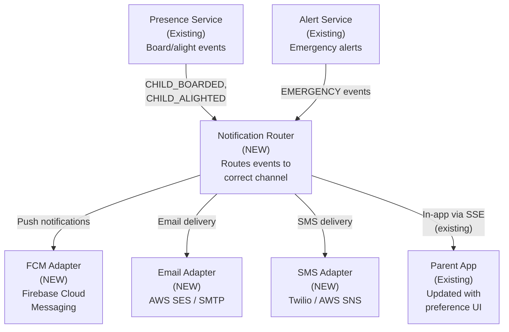

---

## Phase B: Alert Governance and Confirmation

### Business Objective

Emergency alerts follow a governed process: classified by tier, confirmed by School Admin before parent delivery, and escalated through the admin hierarchy if unacknowledged.

### Deliverables

| ID  | Deliverable                                                                | Addresses Gap |
| --- | -------------------------------------------------------------------------- | ------------- |
| B.1 | Alert classifier component (Tier 1/2/3)                                    | GAP-ALERT-001 |
| B.2 | Confirmation engine with timeout-based auto-escalation                     | GAP-WF-005    |
| B.3 | Admin confirmation UI (modal with confirm/false-alarm/request-info)        | GAP-WF-005    |
| B.4 | Escalation chain (School -> Board -> OSTA) with configurable timing        | GAP-ALERT-006 |
| B.5 | Operational alerts (Tier 2) dashboard for admin-only events                | GAP-ALERT-001 |
| B.6 | Alert lifecycle audit trail (CREATED -> CONFIRMED -> NOTIFIED -> RESOLVED) | GAP-GOV-002   |

### Acceptance Criteria

- Tier 1 alerts (PANIC, MEDICAL, INCIDENT) require School Admin confirmation before parent delivery
- If School Admin does not confirm within 2 minutes, alert auto-escalates to parents
- Unacknowledged alerts escalate: 5 min -> Board Admin, 15 min -> OSTA Admin
- Tier 2 alerts (LATE_DEPARTURE, COMPLIANCE) only visible to admins
- Tier 3 events (boarding/alighting) bypass confirmation and go directly to parents
- Full audit trail for every alert state transition

### Implementation Notes

**Implemented in branch `copilot/update-upgrade-plan-phase-b`:**

| Deliverable                   | Implementation                                                                                                                                                                                                                                                     |
| ----------------------------- | ------------------------------------------------------------------------------------------------------------------------------------------------------------------------------------------------------------------------------------------------------------------ |
| B.1 Alert classifier          | `services/emergency-alerts/src/modules/alerts/alert-classifier.service.ts` — classifies `EmergencyEventType` into `AlertTier.TIER_1/2/3` using static `Set` lookups                                                                                                |
| B.2 Confirmation engine       | `AlertsService.create()` — Tier 1 alerts set status `PENDING_CONFIRMATION` and schedule 3 BullMQ delayed jobs: `confirmation-timeout` (2 min), `board-escalation` (5 min), `osta-escalation` (15 min). State-guard pattern in processor prevents double-execution. |
| B.3 Admin confirmation UI     | `AlertConfirmationModal.tsx` — modal with live countdown timer, Confirm/False Alarm/Request Info actions. Shown automatically when admin clicks a `PENDING_CONFIRMATION` alert.                                                                                    |
| B.4 Escalation chain          | `AlertsProcessor.handleBoardEscalation()` / `handleOstaEscalation()` — update `escalationLevel` on the alert entity and fan out via `notifications` queue.                                                                                                         |
| B.5 Tier 2 operational alerts | `AlertsService.create()` — Tier 2 alerts set status `ACTIVE` with no parent notification. Frontend `Alerts.tsx` shows these only in admin views.                                                                                                                   |
| B.6 Audit trail               | `AlertAuditLog` entity. `AlertsService` writes audit entries on every state transition: `CREATED → PENDING_CONFIRMATION → CONFIRMED/AUTO_ESCALATED/FALSE_ALARM → PARENT_NOTIFIED → RESOLVED`. Processor writes `BOARD_ESCALATED` / `OSTA_ESCALATED`.               |

**New API endpoints:**

- `PATCH /api/v1/alerts/:id/confirm` — School Admin confirms Tier 1 alert
- `PATCH /api/v1/alerts/:id/false-alarm` — School Admin marks as false alarm
- `PATCH /api/v1/alerts/:id/request-info` — School Admin requests more information
- `GET /api/v1/alerts/audit/:id` — Full lifecycle audit trail for an alert

**Entity changes:**

- `EmergencyEventType` extended with `MEDICAL`, `LATE_DEPARTURE`, `COMPLIANCE`
- `EmergencyAlertStatus` extended with `PENDING_CONFIRMATION`, `CONFIRMED`, `AUTO_ESCALATED`, `FALSE_ALARM`
- New enums: `AlertTier`, `AlertEscalationLevel`
- New columns on `EmergencyAlert`: `tier`, `confirmedBy`, `confirmedAt`, `escalationLevel`, `autoEscalatedAt`, `parentNotifiedAt`
- New entity: `AlertAuditLog` with full transition history

**Threat model note:** The delayed BullMQ job chain introduces a new attack surface — a stale/replayed job could trigger parent notifications for an already-resolved alert. Mitigated by re-fetching alert status from the database in each job handler before acting (state guard pattern). See `AlertsProcessor.handleConfirmationTimeout()`.

---

## Phase C: Role Boundary Enforcement and Workflows

### Business Objective

Each role operates within its defined responsibility boundary. Cross-role coordination is supported through in-system workflows for fleet assignment, route changes, and student transfers.

### Deliverables

| ID  | Deliverable                                                                         | Addresses Gap            |
| --- | ----------------------------------------------------------------------------------- | ------------------------ |
| C.1 | Super Admin role for system bootstrap and maintenance                               | GAP-ROLE-001             |
| C.2 | Board Admin school management (create/modify/deactivate schools)                    | GAP-ROLE-003             |
| C.3 | School Admin full student management (enroll/edit/withdraw) in UI                   | GAP-ROLE-004             |
| C.4 | Fleet assignment workflow (OSTA proposes -> School confirms)                        | GAP-ROLE-002, GAP-WF-001 |
| C.5 | Route change notification workflow (changes -> affected parents notified)           | GAP-WF-002               |
| C.6 | Absence confirmation workflow (parent reports -> driver roster updated)             | GAP-ROLE-006             |
| C.7 | Admin dashboard role-based view filtering (sidebar and page content adapts to role) | GAP-ROLE-004             |
| C.8 | Document generation for printable agreements (PDF export)                           | GAP-WF-006               |

### Acceptance Criteria

- Board Admin can create, modify, and deactivate schools within their board
- Board Admin cannot access schools in other boards
- School Admin can enroll, edit, and withdraw students through the UI (not just API)
- OSTA Admin can propose vehicle-to-route assignment; School Admin must confirm
- When a route is modified, parents of affected students are notified before the change date
- When a parent reports absence, the driver's roster shows the student as absent
- Admin dashboard sidebar shows only pages relevant to the user's role
- Fleet assignment generates a printable PDF agreement

### Implementation Notes

**Implemented as Phase C of v4 roadmap (April 2026):**

| Deliverable                       | Implementation                                                                                                                                                                                                                                                                                                                                          |
| --------------------------------- | ------------------------------------------------------------------------------------------------------------------------------------------------------------------------------------------------------------------------------------------------------------------------------------------------------------------------------------------------------- |
| C.1 Super Admin role              | `libs/common/src/decorators/roles.decorator.ts` — added `SUPER_ADMIN` to `Role` enum. `libs/common/src/guards/roles.guard.ts` — hierarchy-aware `ROLE_INCLUDES` map where SUPER_ADMIN satisfies OSTA_ADMIN, ADMIN, BOARD_ADMIN, SCHOOL_ADMIN guards. `multi-tenancy.guard.ts` — SUPER_ADMIN bypasses tenant checks. Seed user: `super.admin@sbtm.demo`. |
| C.2 Board Admin school management | `organization.controller.ts` + `organization.gateway.service.ts` — 9 REST endpoints for CRUD on boards and schools. BOARD_ADMIN scoped to own boardId. School entity extended with `status`, `createdAt`, `updatedAt`. Seed user: `board.admin@sbtm.demo`.                                                                                              |
| C.3 Student management UI         | `EnrollStudentModal.tsx`, `EditStudentModal.tsx`, `WithdrawStudentModal.tsx` — modal forms wired to existing student-management API. `Students.tsx` updated with modal state management. `StudentTable.tsx` shows status column (ENROLLED/WITHDRAWN).                                                                                                   |
| C.4 Fleet assignment workflow     | `fleet-assignment.entity.ts` — `fleet_assignments` table with PROPOSED/ACCEPTED/REJECTED/SUPERSEDED statuses. `fleet-assignment.controller.ts` — POST propose (OSTA_ADMIN), PATCH accept/reject (SCHOOL_ADMIN). `FleetAssignments.tsx` — admin dashboard page with role-specific views.                                                                 |
| C.5 Route change notification     | `route-change-notifier.service.ts` — queries students on affected routes, looks up parent user IDs, POSTs to notification service with `ROUTE_CHANGE` event type. `notification-router.service.ts` — added `ROUTE_CHANGE` message template.                                                                                                             |
| C.6 Absence confirmation          | `student-absence.entity.ts` extended with `confirmationStatus` (PENDING/CONFIRMED/REJECTED), `confirmedByUserId`, `confirmedAt`, `confirmationNotes`. `absence.controller.ts` — PATCH confirm/reject (SCHOOL_ADMIN). `AbsenceManagement.tsx` — status badges and confirm/reject action buttons.                                                         |
| C.7 Role-based sidebar            | `Sidebar.tsx` — `allowedRoles` property on NavItem, filtered by `user.role`. Navigation items for Users, Absences, Fleet Assignments added. ALL_ADMIN_ROLES constant for common pages.                                                                                                                                                                  |
| C.8 PDF document generation       | `pdf-generator.service.ts` — uses `pdf-lib` (pure JS) to generate fleet assignment agreements and route plan PDFs. `document.controller.ts` — GET endpoints returning PDF downloads.                                                                                                                                                                    |

**Alert RBAC (Phase B pre-work completed):**

- `alerts.controller.ts` — added `assertAlertOwnership()`: SCHOOL_ADMIN verifies `alert.schoolId` matches their own, BOARD_ADMIN queries School entity to verify board membership. `resolveSchoolIdFilter()` scopes alert listing by role.
- `AlertDto` interface — added `schoolId` field for ownership checks.
- School repository injected into alerts controller for board-level verification.

**New API endpoints:**

- `POST /api/v1/fleet-assignments` — OSTA_ADMIN proposes assignment
- `GET /api/v1/fleet-assignments` — List assignments (scoped by role)
- `PATCH /api/v1/fleet-assignments/:id/accept` — SCHOOL_ADMIN accepts
- `PATCH /api/v1/fleet-assignments/:id/reject` — SCHOOL_ADMIN rejects
- `POST /api/v1/absences` — PARENT reports absence
- `PATCH /api/v1/absences/:id/confirm` — SCHOOL_ADMIN confirms
- `PATCH /api/v1/absences/:id/reject` — SCHOOL_ADMIN rejects
- `GET /api/v1/boards` / `POST /api/v1/boards` — Organization management
- `GET /api/v1/schools` / `POST /api/v1/schools` — Organization management
- `GET /api/v1/documents/fleet-assignment/:id/pdf` — PDF download
- `GET /api/v1/documents/route-plan/:routeId/pdf` — PDF download

**Database changes:**

- New table: `fleet_assignments` with proposal lifecycle columns
- New columns in `student_absences`: `confirmationStatus`, `confirmedByUserId`, `confirmedAt`, `confirmationNotes`
- New columns in `schools`: `status` (default ACTIVE), `createdAt`, `updatedAt`
- New seed users: SUPER_ADMIN (`super.admin@sbtm.demo`), BOARD_ADMIN (`board.admin@sbtm.demo`)
- New dependency: `pdf-lib` v1.17.1 in api-gateway

---

## Phase D: External System Integration

### Business Objective

The system integrates with existing school and OSTA data sources to eliminate duplicate data entry and enable bulk migration of legacy data.

### Deliverables

| ID  | Deliverable                                                                        | Addresses Gap |
| --- | ---------------------------------------------------------------------------------- | ------------- |
| D.1 | SIS batch file sync adapter (CSV/XML import from SIS)                              | GAP-INT-001   |
| D.2 | Board-specific field mapping configuration                                         | GAP-INT-001   |
| D.3 | Student sync preview and approval workflow                                         | GAP-INT-001   |
| D.4 | OSTA fleet database sync adapter                                                   | GAP-INT-002   |
| D.5 | Excel/CSV route import wizard (upload -> validate -> geocode -> preview -> commit) | GAP-INT-003   |
| D.6 | Address geocoding service integration (Nominatim or Google)                        | GAP-INT-006   |
| D.7 | Parent auto-provisioning from SIS contact data                                     | GAP-INT-005   |
| D.8 | Data export capabilities (CSV/PDF for students, routes, compliance, alerts)        | GAP-INT-004   |

### Acceptance Criteria

- School Admin can upload SIS export file and preview student changes before committing
- OSTA Admin can trigger fleet sync and see newly available vehicles
- School Admin can upload Excel with 100+ routes and import them in batch with OSRM polylines
- Stop creation via address search with geocoding (no manual coordinates)
- Parent accounts auto-created from SIS parent contact data with email invitation
- Admin can export student list, route plan, compliance summary as CSV or PDF

---

## Phase E: Operational Maturity

### Business Objective

The system supports complete daily operational workflows including pre-trip enforcement, compliance management, reporting, and calendar awareness.

### Deliverables

| ID  | Deliverable                                                           | Addresses Gap |
| --- | --------------------------------------------------------------------- | ------------- |
| E.1 | Pre-trip inspection enforcement (must pass before route start)        | GAP-GOV-004   |
| E.2 | Compliance visibility across role hierarchy (school -> board -> OSTA) | GAP-GOV-001   |
| E.3 | Compliance expiry alerts and remediation workflow                     | GAP-WF-007    |
| E.4 | Incident report generation (auto-filled from alert data, exportable)  | GAP-GOV-003   |
| E.5 | Academic calendar management (holidays, PA days)                      | GAP-OPS-003   |
| E.6 | Route schedule windows with late-departure detection                  | GAP-OPS-004   |
| E.7 | Parent consent management (collect, store, withdrawal workflow)       | GAP-GOV-005   |
| E.8 | Scheduled reports (daily/weekly/monthly) via email                    | GAP-INT-004   |

### Acceptance Criteria

- Driver cannot start route without passing pre-trip inspection
- Failed inspection blocks route and alerts School Admin
- Board Admin sees compliance status for all schools in their board
- Expired compliance triggers automatic notification to School Admin and Board Admin
- Incident report can be generated from resolved alert, exported as PDF
- Routes marked as inactive on holidays (no unnecessary alerts or tracking)
- Parents present consent during onboarding; consent record stored with timestamp
- School Admin receives daily operation summary email

---

## Phase F: Production Deployment and Hardening

### Business Objective

The system is ready for production deployment with proper infrastructure, monitoring, backup, and guided first-time setup.

### Deliverables

| ID   | Deliverable                                                                   | Addresses Gap  |
| ---- | ----------------------------------------------------------------------------- | -------------- |
| F.1  | First-time setup wizard (Super Admin creates OSTA Admin, configures boards)   | GAP-OPS-001    |
| F.2  | Guided tenant provisioning workflow (new board/school setup)                  | GAP-OPS-002    |
| F.3  | Production infrastructure configuration (to be documented, not scripted here) | OPS-DEPLOY-002 |
| F.4  | Database backup and restore procedures                                        | OPS-BACKUP-001 |
| F.5  | Monitoring and alerting for system health                                     | OPS-MON-001    |
| F.6  | Rate limiting activation on public endpoints                                  | SR-INPUT-001   |
| F.7  | Service-to-service authentication enforcement                                 | SR-SVC-001     |
| F.8  | Secret management (vault or cloud KMS)                                        | Security       |
| F.9  | Production deployment runbook                                                 | OPS-RUN-001    |
| F.10 | Feature-version upgrade procedure and rollback plan                           | OPS-RUN-001    |

### Acceptance Criteria

- Fresh deployment can be bootstrapped through UI wizard without database scripts
- Production environment has automated daily backups with tested restore procedure
- System health dashboard monitors: service uptime, API latency, queue depth, error rate
- Public API endpoints are rate-limited (100 req/min per user, configurable)
- All service-to-service calls use authenticated internal JWT
- Secrets are stored in vault, not in environment variables
- Documented upgrade procedure with step-by-step rollback plan

---

## Phase Dependencies

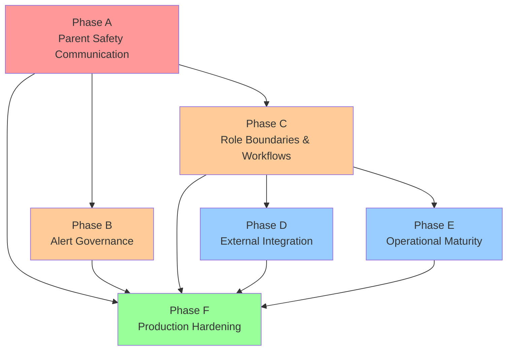

---

## Risk Assessment

| Risk                                                          | Likelihood | Impact | Mitigation                                                                                               |
| ------------------------------------------------------------- | ---------- | ------ | -------------------------------------------------------------------------------------------------------- |
| SIS integration delayed by board IT availability              | High       | Medium | Start with CSV batch import; API sync is Phase D enhancement                                             |
| Push notification delivery inconsistency                      | Medium     | High   | Implement fallback chain (push -> SMS -> email). Monitor delivery rates.                                 |
| Legacy route data quality is poor                             | High       | Medium | Route import wizard includes validation and map preview. Admin can correct before commit.                |
| Parent adoption rate is low                                   | Medium     | High   | Simple onboarding flow. Email invitation with one-click setup. Consider SMS invitation as alternative.   |
| Alert confirmation timeout causes delayed parent notification | Low        | High   | 2-minute timeout is short enough for safety. Auto-escalation ensures delivery even without admin action. |
| OSTA fleet DB access is restricted                            | Medium     | Medium | Manual fleet entry fallback remains available. Sync is an enhancement, not a dependency.                 |
| Privacy concern with geocoding external service               | Low        | High   | Default to self-hosted Nominatim. External geocoder only with privacy assessment approval.               |

---

## Further Considerations

### Phase C — Role Boundary Enforcement: Completed

All pre-work notes from Phase B have been addressed in the Phase C implementation:

- **Alert endpoint RBAC**: `alerts.controller.ts` now enforces role-based ownership via `assertAlertOwnership()`. SCHOOL_ADMIN can only confirm alerts from their own school. BOARD_ADMIN is verified through school-to-board membership lookup.
- **Tier 2 admin-only visibility**: Alert listing endpoints scope results by role through `resolveSchoolIdFilter()`. Parents accessing the parent-view endpoint only see Tier 1 alerts relevant to their child's route.
- **Alert ownership**: Enforced at the API Gateway level. School Admin's `schoolId` is compared against the alert's `schoolId`. Board Admin verification queries the School entity to confirm board membership.

### Phase D — Integration: Alert Data Export

- Incident reports generated from resolved Tier 1 alerts (deliverable E.4) will rely on the `AlertAuditLog` entity introduced in Phase B. The audit trail schema is designed to support this use case.

### Phase E — Operational Maturity: Confirmation Timeout Tuning

- The 2-minute confirmation timeout and 5/15-minute escalation delays are constants in `alerts.service.ts`. Phase E should expose these as per-school configurable values stored in school settings, allowing boards with different response-time SLAs to adjust timing without code changes.
- The `requestInfo` action currently only logs an audit event. Phase E should consider extending the timer window when info is requested, to give the admin adequate response time without forcing auto-escalation.

---

## v4/GapAnalysis

_Source: `prd/v4/GapAnalysis.md`_

# SBTM v4 Gap Analysis Report

- Document owner: Product and Architecture
- Last reviewed: 2026-04-02
- Scope: Business functionality gaps across Roles, Workflows, Alerts, Integration, and Compliance
- Audience: AI Agents, Product Managers, Architects, Development Team

## Related Documents

- [Roles and Workflows](./v4/RolesAndWorkflows.md)
- [Alert Strategy](./v4/AlertStrategy.md)
- [Integration and Migration](./v4/IntegrationAndMigration.md)
- [Upgrade Plan](./v4/UpgradePlan.md)
- [Production Rollout Guide](./v4/ProductionRolloutGuide.md)
- [Production Integration Checklist](./v4/ProductionIntegrationChecklist.md)
- [Business Requirements](../Business/Requirements.md)
- [Feature Catalog](../Business/Features.md)
- [Previous Gap Analysis (v1)](./v1/GapAnalysis.md)

## Executive Summary

This gap analysis focuses exclusively on business functionality gaps, not technical implementation details. The system has strong foundations in GPS tracking, alerting, presence capture, and multi-tenant architecture. However, significant gaps exist in role-based workflow orchestration, cross-organization coordination, alert governance, external system integration, and production-readiness for a first rollout in the Ontario school transportation context.

The gaps are organized by business domain and prioritized by impact on operational readiness.

## System Context - Current State

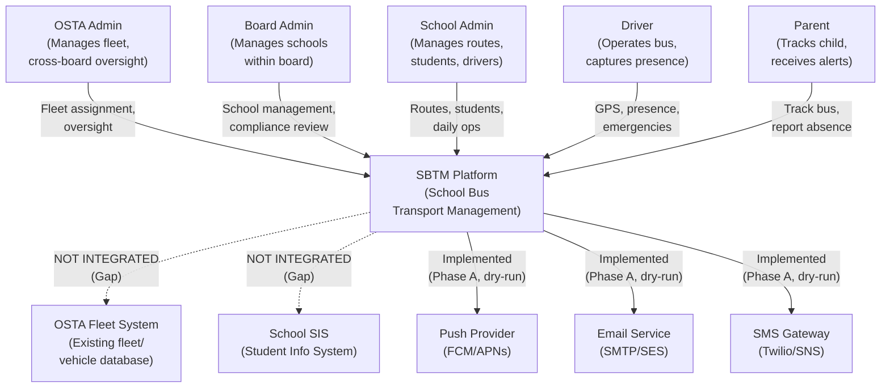

## Gap Categories

### Category 1: Role Definition and Responsibility Boundaries

| Gap ID       | Gap Description                                                             | Current State                                                                                                                                                                                                 | Target State                                                                                                                                                                     | Priority | Impact                                                                                 |
| ------------ | --------------------------------------------------------------------------- | ------------------------------------------------------------------------------------------------------------------------------------------------------------------------------------------------------------- | -------------------------------------------------------------------------------------------------------------------------------------------------------------------------------- | -------- | -------------------------------------------------------------------------------------- |
| GAP-ROLE-001 | No Super Admin (Software Vendor) role for initial system setup              | System bootstraps with hard-coded seed data. No concept of a vendor-level administrator who sets up boards during initial deployment.                                                                         | A Super Admin role exists for system provisioning, board configuration, and platform-level settings. Day-to-day operation is delegated to OSTA Admin.                            | Critical | Without this, initial production setup requires direct database manipulation.          |
| GAP-ROLE-002 | OSTA Admin cannot manage fleet-to-route assignment with school consultation | Fleet (vehicles) and routes are managed independently. No workflow for OSTA to assign a vehicle to a school/route and get school acknowledgment.                                                              | OSTA Admin proposes fleet assignment. School Admin reviews and confirms or requests changes. Assignment becomes effective upon agreement.                                        | High     | Fleet assignment without school input creates operational misalignment.                |
| GAP-ROLE-003 | Board Admin cannot create or manage schools                                 | Board Admin role exists but school creation is currently available to OSTA Admin only (UI restriction). Board Admin should own school lifecycle within their board.                                           | Board Admin can create, update, and deactivate schools within their board scope. OSTA Admin retains override capability.                                                         | High     | Boards cannot self-manage their school portfolio.                                      |
| GAP-ROLE-004 | School Admin functionality is too broad and too narrow simultaneously       | School Admin can manage students and routes but cannot manage school-specific settings. Student enrollment is a no-op in UI. No control over alert preferences or notification recipients.                    | School Admin fully manages: students (enroll/edit/withdraw), routes, stops, student-route assignment, school alert preferences, and daily operational settings.                  | High     | Core daily operations are incomplete.                                                  |
| GAP-ROLE-005 | Driver role lacks end-to-end workflow for daily operations                  | Driver can start route, send GPS, trigger panic, and view roster. But route start/end lifecycle does not integrate with school admin visibility. No pre-trip checklist enforcement.                           | Driver completes pre-trip inspection, starts route (school admin notified), captures presence at each stop, ends route (summary generated). Pre-trip failure blocks route start. | Medium   | Safety-critical pre-trip workflow is not enforced.                                     |
| GAP-ROLE-006 | Parent role missing core communication features                             | Parents can view children and track bus. Push notifications, email alerts, and SMS for emergencies are implemented via Notification Service (Phase A). Absence reporting exists but no confirmation workflow. | Parents receive push/email/SMS for: child board/alight, emergency alerts, bus late/early. Absence report triggers confirmation and reaches driver's roster automatically.        | Critical | Parents have no proactive safety communication. Core value proposition is undelivered. |

### Category 2: Workflow and Coordination Gaps

| Gap ID     | Gap Description                                    | Current State                                                                                                                | Target State                                                                                                                                                                                                                                                | Priority | Impact                                                                                                  |
| ---------- | -------------------------------------------------- | ---------------------------------------------------------------------------------------------------------------------------- | ----------------------------------------------------------------------------------------------------------------------------------------------------------------------------------------------------------------------------------------------------------- | -------- | ------------------------------------------------------------------------------------------------------- |
| GAP-WF-001 | No approval workflow for fleet assignment          | OSTA Admin or School Admin independently creates and assigns vehicles to routes. No coordination or approval between roles.  | Fleet assignment follows: OSTA proposes assignment -> School Admin reviews -> School Admin accepts/rejects with comments -> OSTA finalizes. History of decisions is stored. Both in-system and print-for-signature options exist.                           | High     | Risk of fleet allocation conflicts and lack of accountability.                                          |
| GAP-WF-002 | No approval workflow for route changes             | Routes can be created, modified, or deleted without notification to affected parties (bus operator, parents, board).         | Route changes follow: School Admin proposes -> Board Admin reviews (for changes affecting multiple schools or policy) -> Parents notified of route changes affecting their children. Minor stop-time adjustments can be auto-approved.                      | Medium   | Route changes can silently affect parents and operations.                                               |
| GAP-WF-003 | No student transfer or route reassignment workflow | Student route assignment is a direct update. No workflow for handling student transfers between schools or route changes.    | Student transfer triggers: Source school releases student -> Target school accepts -> Route assignments updated -> Both schools' records reflect transfer history -> Parents notified.                                                                      | Medium   | Student mobility is not managed systematically.                                                         |
| GAP-WF-004 | No seasonal or annual route planning workflow      | Routes are managed one-at-a-time. No concept of planning cycles (fall term, winter adjustments, spring changes).             | Route planning operates on a seasonal calendar: Draft routes -> Board review -> Parent notification window -> Activation date. Previous year routes can be cloned and adjusted.                                                                             | Low      | Year-over-year planning is manual and error-prone.                                                      |
| GAP-WF-005 | Emergency alert confirmation workflow is missing   | Driver triggers alert and it broadcasts immediately. No OSTA/Board/School Admin confirmation before parent notification.     | Emergency alert flow: Driver triggers -> Alert visible to School Admin immediately -> School Admin confirms severity and scope -> Confirmed alert broadcasts to parents. Panic-level events still auto-broadcast but require post-incident review sign-off. | Critical | Unconfirmed alerts can cause unnecessary panic among parents. False-positive alerts have no governance. |
| GAP-WF-006 | No hybrid paper-digital workflow support           | All workflows are assumed digital. No mechanism for generating printable documents for signatures, filing, or audit trail.   | Key decisions (fleet assignment, route approval, incident reports) can generate a printable PDF document with digital signature fields. Signed documents can be uploaded back into the system for record-keeping.                                           | Medium   | Ontario transportation operations still require paper trails for certain regulatory actions.            |
| GAP-WF-007 | Compliance review workflow is view-only            | Compliance data is displayed but there are no review and sign-off workflows. Expired compliance does not trigger any action. | Compliance expiry triggers automated alerts to School Admin and Board Admin. School Admin acknowledges and records remediation action. Board Admin can review compliance status across schools. OSTA Admin sees system-wide compliance dashboard.           | High     | Compliance issues can go unnoticed and un-actioned.                                                     |

### Category 3: Alert System and Communication Gaps

| Gap ID        | Gap Description                                               | Current State                                                                                                                                                                                                                                           | Target State                                                                                                                                                                                                                                                                                                 | Priority | Impact                                                                    |
| ------------- | ------------------------------------------------------------- | ------------------------------------------------------------------------------------------------------------------------------------------------------------------------------------------------------------------------------------------------------- | ------------------------------------------------------------------------------------------------------------------------------------------------------------------------------------------------------------------------------------------------------------------------------------------------------------ | -------- | ------------------------------------------------------------------------- |
| GAP-ALERT-001 | No alert classification by audience and severity              | All alerts are treated as uniform events. No distinction between admin-only operational alerts and parent-facing safety alerts.                                                                                                                         | Alerts are classified into: (a) Operational (admin-only: late departure, maintenance due, compliance expiry), (b) Safety (admin + parent: panic, deviation, incident), (c) Informational (parent: child boarded/alighted, ETA changes). Each class has its own delivery rules and confirmation requirements. | Critical | Parents receive alerts they should not see, or miss alerts they must see. |
| GAP-ALERT-002 | Student boarding/alighting notifications do not reach parents | Presence events are captured and published to BullMQ `notifications` queue. Notification Service delivers to parents via push/email based on preferences.                                                                                               | Boarding event triggers push notification to parent: "[Child name] boarded bus [Route] at [Stop] at [Time]". Alighting event sends similar notification. Notifications respect parent preferences (opt-in/opt-out per event type).                                                                           | Critical | Core parent safety feature is non-functional.                             |
| GAP-ALERT-003 | Emergency alerts reach parents without admin confirmation     | A driver panic button immediately broadcasts to all connected clients. No admin review step before parent delivery.                                                                                                                                     | Two-tier emergency delivery: Tier 1 (auto-broadcast to admins only, admin must confirm within configurable timeout). Tier 2 (after confirmation or timeout, broadcast to parents). PANIC_BUTTON events auto-escalate to parents after 2-minute admin confirmation timeout.                                   | High     | False alarms cause unnecessary parent panic.                              |
| GAP-ALERT-004 | No notification channel orchestration                         | Notification Service implements multi-channel delivery (FCM push, email via SMTP, SMS via Twilio) with channel adapters and dry-run mode. Channel preference per user is persisted and enforced. Fallback: push failure for EMERGENCY escalates to SMS. | Multi-channel delivery: Push notification (primary for parents), Email (daily summary, non-urgent), SMS (emergency escalation, configurable). Channel preference per user. Fallback chain: Push -> SMS -> Email for critical alerts.                                                                         | Critical | Parents without the app open receive nothing.                             |
| GAP-ALERT-005 | No parent notification preference management                  | Notification preferences are persisted in `notification_preferences` table. Parent app Settings page allows toggling PUSH/EMAIL per event type. EMERGENCY preferences are locked (always enabled). API endpoints at `/api/v1/notification-preferences`. | Parents can configure: which alert types to receive, preferred channels per type, quiet hours, emergency override (always deliver emergencies regardless of quiet hours). Preferences stored in user profile and enforced by notification service.                                                           | High     | No respect for parent communication preferences.                          |
| GAP-ALERT-006 | No alert escalation chain                                     | An alert is created and either stays active or gets resolved. No escalation if it is not acknowledged.                                                                                                                                                  | Unacknowledged alerts escalate: After 5 minutes -> escalate from School Admin to Board Admin. After 15 minutes -> escalate to OSTA Admin. Escalation path and timing are configurable per alert type.                                                                                                        | Medium   | Critical alerts can go unnoticed if the primary responder is unavailable. |

### Category 4: Integration and Data Migration Gaps

| Gap ID      | Gap Description                                                       | Current State                                                                                                                                               | Target State                                                                                                                                                                                                                                                                                                       | Priority | Impact                                                                                        |
| ----------- | --------------------------------------------------------------------- | ----------------------------------------------------------------------------------------------------------------------------------------------------------- | ------------------------------------------------------------------------------------------------------------------------------------------------------------------------------------------------------------------------------------------------------------------------------------------------------------------ | -------- | --------------------------------------------------------------------------------------------- |
| GAP-INT-001 | No integration with existing school Student Information Systems (SIS) | Students are manually entered or CSV-imported. No live connection to school board SIS databases.                                                            | Two integration options: (a) Batch sync: Nightly import from SIS export files (CSV/XML). (b) API sync: REST or SFTP-based integration with SIS for real-time student enrollment data. Mapping configuration per board for field translation. Conflict resolution rules for mismatched data.                        | High     | Duplicate data entry increases error and maintenance burden.                                  |
| GAP-INT-002 | No integration with OSTA fleet management system                      | Vehicles are manually created in SBTM. OSTA already maintains fleet data in an existing system.                                                             | Two integration options: (a) One-way sync: OSTA fleet DB is the source of truth. SBTM imports vehicle data periodically. (b) Two-way sync: SBTM reads fleet data from OSTA and writes assignment status back. API adapter layer handles data format translation.                                                   | High     | Fleet data is duplicated and can become inconsistent.                                         |
| GAP-INT-003 | No bulk route import from Excel or legacy systems                     | Routes are created one-at-a-time through the route planner UI. No way to import existing route definitions from Excel spreadsheets or other legacy formats. | Route import wizard: Upload Excel/CSV with route data (name, direction, stops with addresses and coordinates, timing). System validates addresses, geocodes if needed, generates OSRM polylines, and creates routes in batch. Preview and correction step before commit.                                           | High     | Migrating hundreds of existing routes from legacy systems is impractical without bulk import. |
| GAP-INT-004 | No data export or reporting capability                                | No export functionality exists in any UI. No scheduled reports. No data feeds for external systems.                                                         | Export capabilities: (a) Admin can export student lists, route data, presence records, compliance reports as CSV/PDF. (b) Scheduled daily/weekly email reports to Board and OSTA admins. (c) API endpoints for external reporting tools to pull aggregate data.                                                    | Medium   | Operational reporting and regulatory submissions are unsupported.                             |
| GAP-INT-005 | No parent onboarding integration                                      | Parents are manually created by admins and linked to children via route IDs. No self-registration or invitation flow from school systems.                   | Parent onboarding flow: School Admin creates student -> System generates parent invitation link -> Parent receives email with link -> Parent self-registers and links to child -> Parent verifies identity via school-provided code. Alternatively, parent accounts auto-provisioned from SIS parent contact data. | High     | Parent onboarding is a manual admin burden that will not scale.                               |
| GAP-INT-006 | No map or address geocoding service for stop creation                 | Stops require manual latitude/longitude entry. No address search or geocoding.                                                                              | Stop creation uses address search with geocoding: Admin types address -> System geocodes via Nominatim/Google/Mapbox -> Admin confirms pin on map -> Coordinates stored automatically. Supports Canadian address formats.                                                                                          | Medium   | Manual coordinate entry is error-prone and impractical for non-technical admins.              |

### Category 5: Compliance and Governance Gaps

| Gap ID      | Gap Description                                        | Current State                                                                                                                                  | Target State                                                                                                                                                                                                                                                         | Priority | Impact                                                  |
| ----------- | ------------------------------------------------------ | ---------------------------------------------------------------------------------------------------------------------------------------------- | -------------------------------------------------------------------------------------------------------------------------------------------------------------------------------------------------------------------------------------------------------------------- | -------- | ------------------------------------------------------- |
| GAP-GOV-001 | Compliance is not shared across role hierarchy         | Compliance data is school-scoped. Board Admin and OSTA Admin cannot see cross-school compliance status.                                        | Compliance visibility follows tenant hierarchy: School Admin sees own school. Board Admin sees aggregate and drill-down for all schools in board. OSTA Admin sees system-wide compliance dashboard with filtering.                                                   | High     | Board and OSTA lack oversight of compliance status.     |
| GAP-GOV-002 | No audit trail for workflow decisions                  | Audit logs record CRUD operations but not workflow decisions (approvals, rejections, confirmations).                                           | All workflow decisions are recorded in audit: who approved/rejected, when, with what notes. Fleet assignments, route changes, alert confirmations, compliance reviews all generate workflow audit entries.                                                           | Medium   | Regulatory accountability for decisions is missing.     |
| GAP-GOV-003 | No incident report generation                          | Emergency alerts exist as database records. No formal incident report can be generated for regulatory filing.                                  | After an emergency is resolved, the system generates an incident report template containing: timeline of events, alert details, responder actions, resolution notes, video evidence links (if available). Report can be exported as PDF for filing.                  | Medium   | Regulatory incident reporting is entirely manual.       |
| GAP-GOV-004 | Pre-trip inspection is not enforced before route start | Vehicle inspections exist as records but are not linked to route lifecycle. A driver can start a route without completing pre-trip inspection. | Pre-trip inspection is a required step before route start. Driver opens inspection checklist -> completes all items -> submits with pass/fail -> Only on pass, route start is enabled. Failed inspection triggers maintenance workflow and prevents route operation. | High     | Safety-critical inspection workflow has no enforcement. |
| GAP-GOV-005 | No data consent management for parents                 | No mechanism to record parent consent for child tracking and data collection.                                                                  | During parent onboarding, system presents privacy notice and collects explicit consent. Consent records are stored with timestamp and version. Parents can withdraw consent (triggers data handling workflow). Consent renewal on policy updates.                    | Medium   | PIPEDA/MFIPPA compliance requires demonstrable consent. |

### Category 6: Operational Readiness Gaps

| Gap ID      | Gap Description                                               | Current State                                                                                                  | Target State                                                                                                                                                                                                                                                                                                                   | Priority | Impact                                                         |
| ----------- | ------------------------------------------------------------- | -------------------------------------------------------------------------------------------------------------- | ------------------------------------------------------------------------------------------------------------------------------------------------------------------------------------------------------------------------------------------------------------------------------------------------------------------------------ | -------- | -------------------------------------------------------------- |
| GAP-OPS-001 | No system setup wizard for first-time deployment              | System requires manual database seeding, environment variable configuration, and service-by-service startup.   | First-time setup wizard: Super Admin creates initial OSTA Admin account -> Configures system-level settings (timezone, region, notification preferences) -> Creates first board and school -> Invites first Board Admin -> System is operational.                                                                              | High     | First production deployment requires deep technical knowledge. |
| GAP-OPS-002 | No tenant provisioning workflow for adding new boards/schools | Adding a new board or school post-initial-setup requires admin UI navigation. No guided workflow or checklist. | Guided provisioning workflow: (a) New Board: OSTA Admin starts wizard -> Board name, region, admin contact -> Board Admin invited -> Board created. (b) New School: Board Admin starts wizard -> School name, address, contact -> School Admin invited -> Initial routes and students imported or created -> School activated. | Medium   | Scaling to new boards and schools is unguided.                 |
| GAP-OPS-003 | No academic year calendar management                          | System has no concept of school calendar, holidays, or operational days. Routes are assumed to run every day.  | Academic calendar management: Board Admin configures school year dates, holidays, PA days, exam days per board. Routes automatically marked as inactive on non-operational days. Parents notified of schedule changes. Driver schedule adjusted accordingly.                                                                   | Medium   | Routes show as "expected" on holidays, causing confusion.      |
| GAP-OPS-004 | No route scheduling for AM and PM service                     | Routes have a direction (AM/PM) but no concept of daily schedule or service windows.                           | Routes are scheduled with service windows: AM routes active 7:00-9:00, PM routes active 2:30-4:30 (configurable per school). System flags routes that have not started within their window. Late routes generate alerts automatically.                                                                                         | Medium   | No automated monitoring of route schedule adherence.           |

## Gap Priority Summary

| Priority | Count | Business Impact                                                          |
| -------- | ----- | ------------------------------------------------------------------------ |
| Critical | 5     | Core value proposition undelivered. Production launch blocked.           |
| High     | 13    | Significant operational friction. Manual workarounds required.           |
| Medium   | 12    | Operational inefficiency. Can be addressed post-launch with workarounds. |
| Low      | 1     | Nice-to-have. No immediate operational impact.                           |

## Recommended Sequencing

1. **Pre-Launch Critical** (GAP-ROLE-006, GAP-ALERT-001, GAP-ALERT-002, GAP-ALERT-004, GAP-WF-005): Parent notification delivery, alert classification, and emergency confirmation workflow. Without these, the system cannot serve its primary safety mission.

2. **Launch Readiness** (GAP-ROLE-001, GAP-ROLE-002, GAP-ROLE-003, GAP-ROLE-004, GAP-INT-003, GAP-OPS-001, GAP-GOV-004): Role boundary enforcement, bulk data import, setup wizard, and pre-trip inspection enforcement. Required for a practical first deployment.

3. **Operational Maturity** (GAP-WF-001, GAP-WF-002, GAP-INT-001, GAP-INT-002, GAP-INT-005, GAP-GOV-001, GAP-GOV-005, GAP-ALERT-003, GAP-ALERT-005): Approval workflows, external system integration, compliance visibility, and alert governance. Needed for sustainable multi-school operations.

4. **Scale and Efficiency** (remaining Medium/Low gaps): Seasonal planning, data export, calendar management, route scheduling, incident reports. Addressed as the system matures.

---

## v4/AlertStrategy

_Source: `prd/v4/AlertStrategy.md`_

# SBTM v4 Alert Strategy

- Document owner: Product and Architecture
- Last reviewed: 2026-04-02
- Scope: Alert classification, audience routing, confirmation workflows, notification channels, and escalation
- Audience: AI Agents, Product Managers, Business Analysts, Development Team

## Related Documents

- [Gap Analysis](./v4/GapAnalysis.md)
- [Roles and Workflows](./v4/RolesAndWorkflows.md)
- [Business Requirements](../Business/Requirements.md)
- [Event Catalog](../Design/EventCatalog.md)
- [Emergency Alerts Module](../Implementation/Module-4-EmergencyAlerts.md)

---

## 1. Alert Classification Model

All system events that require human attention are classified into three tiers based on audience and urgency.

### Tier 1: Safety Alerts (Admin + Parent)

Safety alerts are events that directly affect student safety and must reach both operational staff and parents.

| Event Type      | Source                                                  |     Auto-broadcast to Parents?      | Admin Confirmation Required? | Escalation                                                                             |
| --------------- | ------------------------------------------------------- | :---------------------------------: | :--------------------------: | -------------------------------------------------------------------------------------- |
| PANIC_BUTTON    | Driver triggers panic                                   | After confirmation or 2-min timeout |      Yes (School Admin)      | Auto-escalate to Board -> OSTA if unconfirmed                                          |
| MEDICAL         | Driver reports medical event                            |         After confirmation          |      Yes (School Admin)      | Same as PANIC                                                                          |
| INCIDENT        | Driver or system reports incident                       |         After confirmation          |      Yes (School Admin)      | Same as PANIC                                                                          |
| ROUTE_DEVIATION | GPS geofence service detects deviation beyond threshold |  No (admin-only unless escalated)   |     No (auto-generated)      | If deviation persists >5 min, School Admin notified. If >15 min, Board Admin notified. |

### Tier 2: Operational Alerts (Admin Only)

Operational alerts inform administrators about service status and compliance issues. Parents do not receive these.

| Event Type          | Source                                                           | Recipients                | Action Required                                |
| ------------------- | ---------------------------------------------------------------- | ------------------------- | ---------------------------------------------- |
| LATE_DEPARTURE      | Route not started within scheduled window                        | School Admin              | Investigate and contact driver                 |
| LATE_ARRIVAL        | Bus behind schedule by >10 min at any stop                       | School Admin              | Monitor, notify parents if >20 min             |
| ROUTE_DIVERSION     | Driver manually reports planned diversion                        | School Admin, Board Admin | Acknowledge and update route if needed         |
| COMPLIANCE_EXPIRING | Scheduled check: driver license/medical within 30 days of expiry | School Admin              | Contact driver, arrange renewal                |
| COMPLIANCE_EXPIRED  | Scheduled check: driver license/medical expired                  | School Admin, Board Admin | Suspend driver assignment until renewed        |
| INSPECTION_FAILED   | Pre-trip inspection failed                                       | School Admin              | Arrange maintenance or substitute vehicle      |
| VEHICLE_MAINTENANCE | Vehicle status changed to maintenance                            | School Admin              | Arrange substitute vehicle for affected routes |

### Tier 3: Informational Notifications (Parent-facing)

Informational notifications keep parents aware of their child's transport status. These are routine and not alarming.

| Event Type        | Source                                               | Recipients               | Delivery Channel                           |
| ----------------- | ---------------------------------------------------- | ------------------------ | ------------------------------------------ |
| CHILD_BOARDED     | Presence service: student board event                | Parent of specific child | Push notification                          |
| CHILD_ALIGHTED    | Presence service: student alight event               | Parent of specific child | Push notification                          |
| BUS_APPROACHING   | GPS + geofence: bus within X minutes of child's stop | Parent of specific child | Push notification                          |
| ROUTE_STARTED     | Driver starts route                                  | All parents on route     | Push notification (optional, configurable) |
| ROUTE_COMPLETED   | Driver ends route                                    | All parents on route     | Push notification (optional, configurable) |
| ABSENCE_CONFIRMED | School Admin confirms reported absence               | Reporting parent         | Push + in-app                              |
| ROUTE_CHANGE      | School Admin modifies route affecting child          | Affected parents         | Push + email                               |
| ETA_UPDATE        | Significant ETA change (>5 min) for child's stop     | Parent of specific child | Push notification                          |

### Alert Processing Architecture Diagram

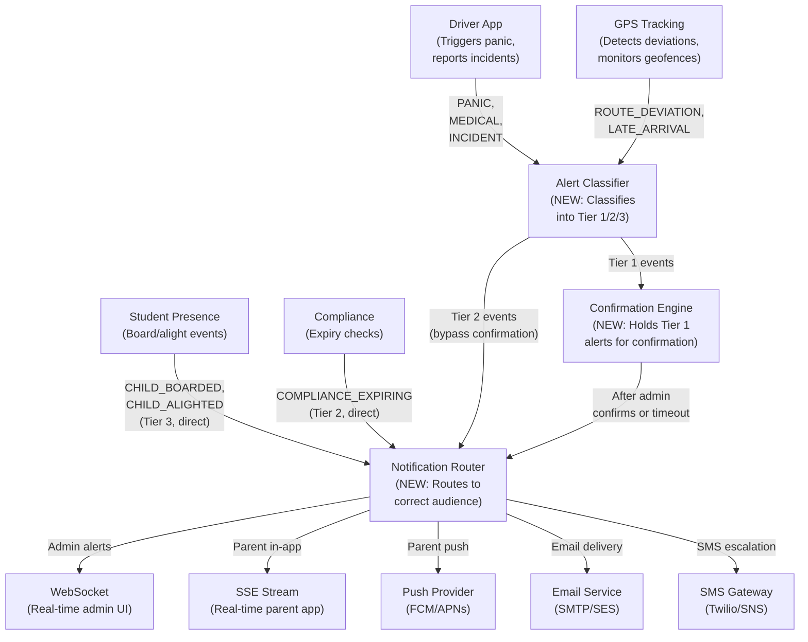

---

## 2. Confirmation and Escalation Rules

### Confirmation Workflow for Tier 1 (Safety) Alerts

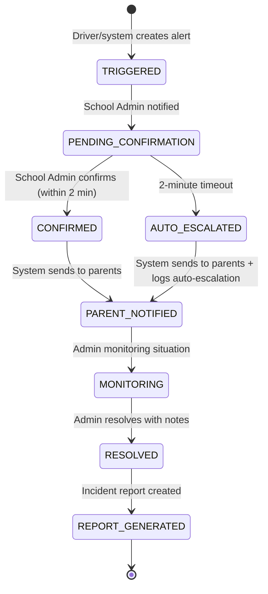

### Escalation Chain

| Time Since Alert | Action                                   | Recipients                                          |
| ---------------- | ---------------------------------------- | --------------------------------------------------- |
| 0 seconds        | Alert created                            | School Admin (immediate WebSocket + push)           |
| 0 seconds        | Informational copy                       | Board Admin, OSTA Admin (WebSocket only)            |
| 2 minutes        | If unconfirmed: auto-escalate to parents | Parents on affected route (push + SMS)              |
| 5 minutes        | If unacknowledged by School Admin        | Board Admin receives escalation (push + SMS)        |
| 15 minutes       | If unacknowledged by Board Admin         | OSTA Admin receives escalation (push + SMS + email) |
| 30 minutes       | If still unresolved                      | System marks as CRITICAL_UNRESOLVED in audit log    |

### Confirmation UI for School Admin

When a Tier 1 alert arrives, the School Admin sees a modal overlay:

```
EMERGENCY ALERT - Confirmation Required

Route: R01 - Bank Street South
Vehicle: BUS-01 (ON-1001)
Driver: John Smith
Time: 08:23 AM
Type: PANIC_BUTTON
Location: 45.3876, -75.6960 (Bank St & Glebe Ave)

Actions:
[Confirm and Notify Parents] - Broadcasts to all parents on route
[Confirm as False Alarm] - Records as false alarm, no parent notification
[Request More Information] - Contacts driver, extends timer by 2 min

Auto-escalation to parents in: 1:45
```

---

## 3. Notification Channel Strategy

### Channel Selection Rules

| Alert Tier             | Primary Channel   | Secondary Channel        | Emergency Fallback               |
| ---------------------- | ----------------- | ------------------------ | -------------------------------- |
| Tier 1 (Safety)        | Push notification | SMS                      | Email (if push + SMS both fail)  |
| Tier 2 (Operational)   | In-app WebSocket  | Email (daily digest)     | -                                |
| Tier 3 (Informational) | Push notification | In-app notification list | Email (weekly summary, optional) |

### Parent Notification Preferences

Parents can configure the following preferences per notification type:

| Setting                  | Options                                       | Default             |
| ------------------------ | --------------------------------------------- | ------------------- |
| Emergency alerts         | Always on (cannot disable)                    | Push + SMS          |
| Child boarding/alighting | Push / In-app only / Off                      | Push                |
| Bus approaching stop     | Push / Off                                    | Push                |
| Route start/complete     | Push / Off                                    | Off                 |
| Route changes            | Push + Email / Email only                     | Push + Email        |
| Daily summary            | Email / Off                                   | Off                 |
| Quiet hours              | Start time - End time                         | 9:00 PM - 6:00 AM   |
| Emergency override       | Always deliver emergencies during quiet hours | On (cannot disable) |

### Notification Message Templates

Emergency (Tier 1):

```
EMERGENCY: [EVENT_TYPE] on [ROUTE_NAME]
Bus [VEHICLE_ID] carrying [CHILD_NAME] has reported a [EVENT_TYPE] at [TIME].
Location: [ADDRESS_OR_COORDINATES]
School [SCHOOL_NAME] has been notified.
Updates will follow.
```

Child Boarded (Tier 3):

```
[CHILD_NAME] boarded bus [ROUTE_NAME] at [STOP_NAME] at [TIME].
```

Child Alighted (Tier 3):

```
[CHILD_NAME] has arrived. Alighted from bus [ROUTE_NAME] at [TIME].
```

Bus Approaching (Tier 3):

```
Bus [ROUTE_NAME] is approximately [X] minutes from [STOP_NAME].
```

---

## 4. Alert Visibility by Role

### What Each Role Sees

| Alert/Event         |    OSTA Admin     | Board Admin | School Admin |        Driver         |                 Parent                 |
| ------------------- | :---------------: | :---------: | :----------: | :-------------------: | :------------------------------------: |
| PANIC_BUTTON        | All (system-wide) |  Own board  |  Own school  | Own route (triggered) | Own child's route (after confirmation) |
| MEDICAL             |        All        |  Own board  |  Own school  |       Own route       | Own child's route (after confirmation) |
| ROUTE_DEVIATION     |        All        |  Own board  |  Own school  |           -           |          - (unless escalated)          |
| LATE_DEPARTURE      |        All        |  Own board  |  Own school  |           -           |                   -                    |
| LATE_ARRIVAL        |        All        |  Own board  |  Own school  |           -           |     Own child's route (if >20 min)     |
| COMPLIANCE_EXPIRING |        All        |  Own board  |  Own school  |      Own record       |                   -                    |
| INSPECTION_FAILED   |         -         |  Own board  |  Own school  |    Own inspection     |                   -                    |
| CHILD_BOARDED       |         -         |      -      |  Own school  |           -           |             Own child only             |
| CHILD_ALIGHTED      |         -         |      -      |  Own school  |           -           |             Own child only             |
| BUS_APPROACHING     |         -         |      -      |      -       |           -           |             Own child only             |
| ROUTE_CHANGE        |        All        |  Own board  |  Own school  |       Own route       |           Own child's route            |

### Alert Dashboard Views

**OSTA Admin**: System-wide alert dashboard with filters by board, school, alert type, severity, status. Aggregate statistics: total active alerts, average response time, false alarm rate.

**Board Admin**: Board-scoped alert list with school breakdown. Cross-school comparison: which schools have most alerts, slowest response times.

**School Admin**: School-specific alert management. Active alerts with confirmation action. Alert history with resolution notes. Performance metrics: response time, resolution time.

**Parent**: Personalized notification feed for linked children only. Emergency banner when active Tier 1 alert affects child's route. Notification history with read/unread status.

---

## 5. Presence-to-Notification Pipeline

Student boarding and alighting events must flow from the driver's app to the parent's device.

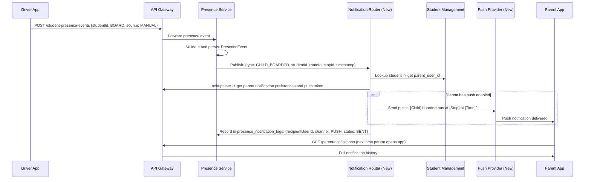

---

## 6. Alert Lifecycle and Audit

Every alert event and every notification delivery is recorded for audit purposes.

### Alert Event Log Structure

| Field            | Description                                                 |
| ---------------- | ----------------------------------------------------------- |
| alert_id         | Unique identifier of the alert                              |
| event_timestamp  | When the event occurred                                     |
| event_type       | CREATED, CONFIRMED, AUTO_ESCALATED, RESOLVED, REOPENED      |
| actor_user_id    | Who performed the action (driver, admin, system)            |
| actor_role       | Role of the actor                                           |
| notes            | Optional notes (resolution reason, false alarm explanation) |
| escalation_level | Current escalation level (SCHOOL, BOARD, OSTA)              |

### Notification Delivery Log Structure

| Field                         | Description                                              |
| ----------------------------- | -------------------------------------------------------- |
| notification_id               | Unique identifier                                        |
| alert_id or presence_event_id | Source event                                             |
| recipient_user_id             | Who the notification was sent to                         |
| channel                       | PUSH, EMAIL, SMS, IN_APP                                 |
| status                        | QUEUED, SENT, DELIVERED, FAILED, READ                    |
| sent_at                       | Timestamp of send attempt                                |
| delivered_at                  | Timestamp of delivery confirmation (from provider)       |
| read_at                       | Timestamp when user read/acknowledged (in-app only)      |
| failure_reason                | If FAILED, why (invalid token, number unreachable, etc.) |

---

## 7. Migration from Current Alert System

### Current State

The existing alert system supports:

- Emergency alert creation (PANIC_BUTTON, ROUTE_DEVIATION, INCIDENT, LATE_ARRIVAL, ROUTE_DIVERSION, OTHER)
- WebSocket broadcast to admin dashboard
- SSE stream available for parent app (partially wired)
- AlertNotificationLog table (PUSH/EMAIL/SMS channels defined but only PUSH status is logged)
- No actual push provider integration
- No confirmation workflow
- No alert classification or audience routing

### Migration Steps

1. **Introduce Alert Classifier**: New component between event source and notification pipeline. Classifies incoming events into Tier 1/2/3 based on event type. No breaking changes to existing alert creation API.

2. **Add Confirmation Engine**: New component for Tier 1 events. Holds alert in PENDING_CONFIRMATION state. Exposes confirmation API for School Admin. Implements timeout-based auto-escalation. Existing ACTIVE/RESOLVED states remain; PENDING_CONFIRMATION is added.

3. **Build Notification Router**: New service component. Reads recipient preferences. Selects delivery channel(s). Calls push provider, email service, or SMS gateway. Logs delivery status in existing AlertNotificationLog table (schema compatible). Existing WebSocket and SSE delivery remain as channels within the router.

4. **Integrate Push Provider**: FCM (Firebase Cloud Messaging) for cross-platform push. Parent app registers device token on login. Token stored in user profile. Notification Router sends via FCM SDK.

5. **Integrate Email and SMS**: Email via AWS SES or SMTP for non-urgent and summary notifications. SMS via Twilio or AWS SNS for emergency escalation. Both configured via environment variables.

6. **Add Presence-to-Notification Pipeline**: Presence Service publishes events to BullMQ. Notification Router consumes and routes to parents. Uses existing PresenceNotificationLog table.

7. **Deploy Parent Preference UI**: Settings page in Parent App with notification preferences. Preferences persisted in user profile (new fields on User entity).

---

## v4/RolesAndWorkflows

_Source: `prd/v4/RolesAndWorkflows.md`_

# SBTM v4 Roles, Responsibilities and Workflows

- Document owner: Product and Architecture
- Last reviewed: 2026-04-02
- Scope: Complete role model, responsibility matrix, coordination workflows, and approval chains
- Audience: AI Agents, Product Managers, Business Analysts, Development Team

## Related Documents

- [Gap Analysis](./v4/GapAnalysis.md)
- [Alert Strategy](./v4/AlertStrategy.md)
- [Integration and Migration](./v4/IntegrationAndMigration.md)
- [Business Requirements](../Business/Requirements.md)
- [Use Cases](../Business/UseCases.md)

---

## 1. Role Hierarchy and Scope

### SBTM Role Access Model

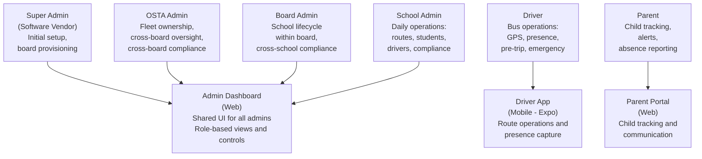

### Role Definitions

| Role                          | Scope        | Access Level                                 | Primary Application | Tenant Boundary                  |
| ----------------------------- | ------------ | -------------------------------------------- | ------------------- | -------------------------------- |
| **Super Admin** (New)         | System-wide  | Full platform configuration                  | Admin Dashboard     | None (system-level)              |
| **OSTA Admin**                | Cross-board  | Fleet, oversight, system compliance          | Admin Dashboard     | All boards, all schools          |
| **Board Admin** (OCSB, OCDSB) | Board-level  | Schools, cross-school oversight within board | Admin Dashboard     | Own board and all schools within |
| **School Admin**              | School-level | Students, routes, daily operations           | Admin Dashboard     | Own school only                  |
| **Driver**                    | Route-level  | Route execution, presence, emergency         | Driver App          | Assigned routes only             |
| **Parent**                    | Child-level  | Child tracking, alerts, absence              | Parent Portal       | Linked children's routes only    |

---

## 2. Responsibility Matrix (RACI)

Legend: **R** = Responsible (does the work), **A** = Accountable (ultimate owner), **C** = Consulted (input before decision), **I** = Informed (notified after)

### System Setup and Configuration

| Activity                                     | Super Admin | OSTA Admin | Board Admin | School Admin | Driver | Parent |
| -------------------------------------------- | :---------: | :--------: | :---------: | :----------: | :----: | :----: |
| Initial platform deployment                  |    R, A     |     I      |      -      |      -       |   -    |   -    |
| Configure system settings (timezone, region) |    R, A     |     C      |      -      |      -       |   -    |   -    |
| Create / manage school boards                |      R      |    A, C    |      I      |      -       |   -    |   -    |
| Create initial OSTA Admin account            |    R, A     |     -      |      -      |      -       |   -    |   -    |
| Platform version upgrades                    |    R, A     |     I      |      I      |      I       |   -    |   -    |

After initial setup, the Super Admin role is used only for platform maintenance and major configuration changes. Day-to-day operations are handled by OSTA Admin and below.

### Organization Management

| Activity                                         | Super Admin | OSTA Admin | Board Admin | School Admin | Driver | Parent |
| ------------------------------------------------ | :---------: | :--------: | :---------: | :----------: | :----: | :----: |
| Create / modify school board                     |      -      |    R, A    |      I      |      -       |   -    |   -    |
| Deactivate school board                          |      -      |    R, A    |      C      |      I       |   -    |   -    |
| Create / modify school within board              |      -      |     C      |    R, A     |      I       |   -    |   -    |
| Deactivate school                                |      -      |     I      |    R, A     |      C       |   -    |   -    |
| Configure school settings (bell times, calendar) |      -      |     -      |      C      |     R, A     |   -    |   I    |
| Manage academic calendar and holidays            |      -      |     I      |    R, A     |      C       |   I    |   I    |

### Fleet and Vehicle Management

| Activity                                            | Super Admin | OSTA Admin | Board Admin |  School Admin  | Driver | Parent |
| --------------------------------------------------- | :---------: | :--------: | :---------: | :------------: | :----: | :----: |
| Add / register vehicle in fleet                     |      -      |    R, A    |      I      |       I        |   -    |   -    |
| Update vehicle status (active/maintenance/inactive) |      -      |    R, A    |      I      |       C        |   I    |   -    |
| Assign vehicle to school                            |      -      |    R, A    |      C      |       C        |   -    |   -    |
| Assign vehicle to route                             |      -      |     A      |      I      |      R, C      |   I    |   -    |
| Remove vehicle from fleet                           |      -      |    R, A    |      I      |       I        |   -    |   -    |
| View fleet dashboard (all vehicles)                 |      -      |     R      |      R      | R (own school) |   -    |   -    |

Fleet Assignment Workflow (OSTA assigns to school and route in consultation with School Admin):

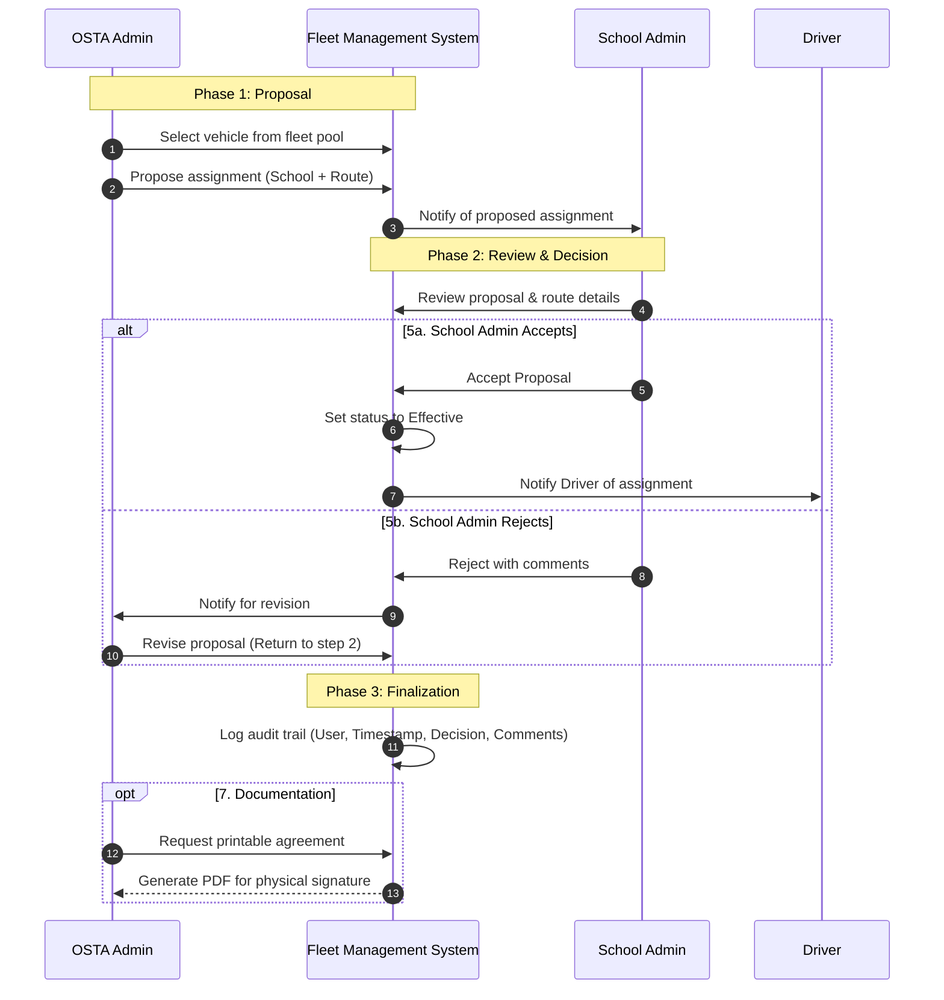

### Route and Stop Management

| Activity                                        | Super Admin | OSTA Admin |      Board Admin       | School Admin | Driver |        Parent        |
| ----------------------------------------------- | :---------: | :--------: | :--------------------: | :----------: | :----: | :------------------: |
| Create new route                                |      -      |     C      |           C            |     R, A     |   -    |          -           |
| Modify route (stops, timing, path)              |      -      |     I      | I (if policy impacted) |     R, A     |   I    | I (affected parents) |
| Delete route                                    |      -      |     I      |           C            |     R, A     |   I    |          I           |
| Add / remove / modify stops                     |      -      |     -      |           -            |     R, A     |   I    | I (affected parents) |
| Optimize route stop ordering                    |      -      |     -      |           -            |     R, A     |   -    |          -           |
| Bulk import routes from Excel/CSV               |      -      |     I      |           C            |     R, A     |   -    |          -           |
| Clone previous year routes                      |      -      |     -      |           C            |     R, A     |   -    |          -           |
| Review and approve route changes at board level |      -      |     -      |          R, A          |      C       |   -    |          -           |

Route Change Notification Rules:

- **Major changes** (new route, route cancellation, stop removal): School Admin proposes -> Board Admin approves (if policy requires) -> Parents of affected students notified 5 business days before effective date.
- **Minor changes** (time adjustment <10 minutes, stop reorder): School Admin implements directly -> Parents notified 2 business days before effective date.
- **Emergency changes** (road closure, safety issue): School Admin implements immediately -> Parents notified same day -> Board Admin informed.

### Student Management

| Activity                          | Super Admin | OSTA Admin | Board Admin |    School Admin     |    Driver     | Parent |
| --------------------------------- | :---------: | :--------: | :---------: | :-----------------: | :-----------: | :----: |
| Enroll student                    |      -      |     -      |      I      |        R, A         |       -       |   I    |
| Update student information        |      -      |     -      |      -      |        R, A         |       -       |   I    |
| Assign student to route and stop  |      -      |     -      |      -      |        R, A         |       I       |   I    |
| Transfer student between schools  |      -      |     -      |      C      | R (both schools), A |       I       |   I    |
| Withdraw / graduate student       |      -      |     -      |      I      |        R, A         |       I       |   I    |
| Bulk import students from CSV/SIS |      -      |     -      |      I      |        R, A         |       -       |   -    |
| View student roster for route     |      -      |     R      |      R      |          R          | R (own route) |   -    |
| Report child absence              |      -      |     -      |      -      |          I          |       I       |  R, A  |
| Confirm absence receipt           |      -      |     -      |      -      |          R          |       I       |   I    |

### Daily Operations

| Activity                              | Super Admin | OSTA Admin | Board Admin |  School Admin  |  Driver  |         Parent         |
| ------------------------------------- | :---------: | :--------: | :---------: | :------------: | :------: | :--------------------: |
| Complete pre-trip vehicle inspection  |      -      |     -      |      -      | I (if failed)  |   R, A   |           -            |
| Start route                           |      -      |     -      |      -      |       I        |   R, A   |     I (ETA update)     |
| Send GPS location updates             |      -      |     -      |      -      |       -        | R (auto) |           -            |
| Capture student boarding (manual/BLE) |      -      |     -      |      -      |       I        |   R, A   |           I            |
| Capture student alighting             |      -      |     -      |      -      |       I        |   R, A   |           I            |
| End route                             |      -      |     -      |      -      |       I        |   R, A   |           -            |
| Monitor fleet in real-time            |      -      |     R      |      R      | R (own school) |    -     |           -            |
| Track child's bus live                |      -      |     -      |      -      |       -        |    -     |           R            |
| Trigger emergency/panic               |      -      |     I      |      I      |       I        |   R, A   | I (after confirmation) |

### Alert and Emergency Management

| Activity                              | Super Admin |  OSTA Admin  | Board Admin  |   School Admin   | Driver | Parent |
| ------------------------------------- | :---------: | :----------: | :----------: | :--------------: | :----: | :----: |
| Trigger panic/emergency alert         |      -      |      -       |      -       |        -         |   R    |   -    |
| Receive emergency alert (immediate)   |      -      |      I       |      I       |   R (confirm)    |   -    |   -    |
| Confirm/classify emergency alert      |      -      |      C       |      C       |       R, A       |   -    |   -    |
| Notify parents of confirmed emergency |      -      |      -       |      -       | A (system sends) |   -    |   I    |
| Resolve emergency alert               |      -      |      A       |      R       |        R         |   -    |   I    |
| Generate incident report              |      -      |      A       |      R       |       R, C       |   C    |   -    |
| Review incident report                |      -      |     R, A     |      R       |        C         |   -    |   -    |
| Escalate unacknowledged alert         |      -      | R (receives) | R (receives) |    A (origin)    |   -    |   -    |

### Compliance and Audit

| Activity                                  | Super Admin | OSTA Admin |   Board Admin   |   School Admin   | Driver |       Parent        |
| ----------------------------------------- | :---------: | :--------: | :-------------: | :--------------: | :----: | :-----------------: |
| Submit driver compliance documents        |      -      |     -      |        -        |        I         |   R    |          -          |
| Review driver compliance status           |      -      |  R (all)   |    R (board)    |  R (school), A   |   -    |          -          |
| Record vehicle inspection results         |      -      |     -      |        -        |        I         |  R, A  |          -          |
| Review compliance across schools          |      -      |     R      |      R, A       |        C         |   -    |          -          |
| Generate compliance report                |      -      |     R      |        R        |        R         |   -    |          -          |
| View system audit logs                    |      -      |     R      | R (board scope) | R (school scope) |   -    |          -          |
| Handle DSAR (Data Subject Access Request) |      -      |     A      |        I        |        R         |   -    |    R (requestor)    |
| Manage parent consent records             |      -      |     -      |        I        |       R, A       |   -    | R (gives/withdraws) |

---

## 3. Coordination Workflows

### 3.1 Fleet Assignment Workflow

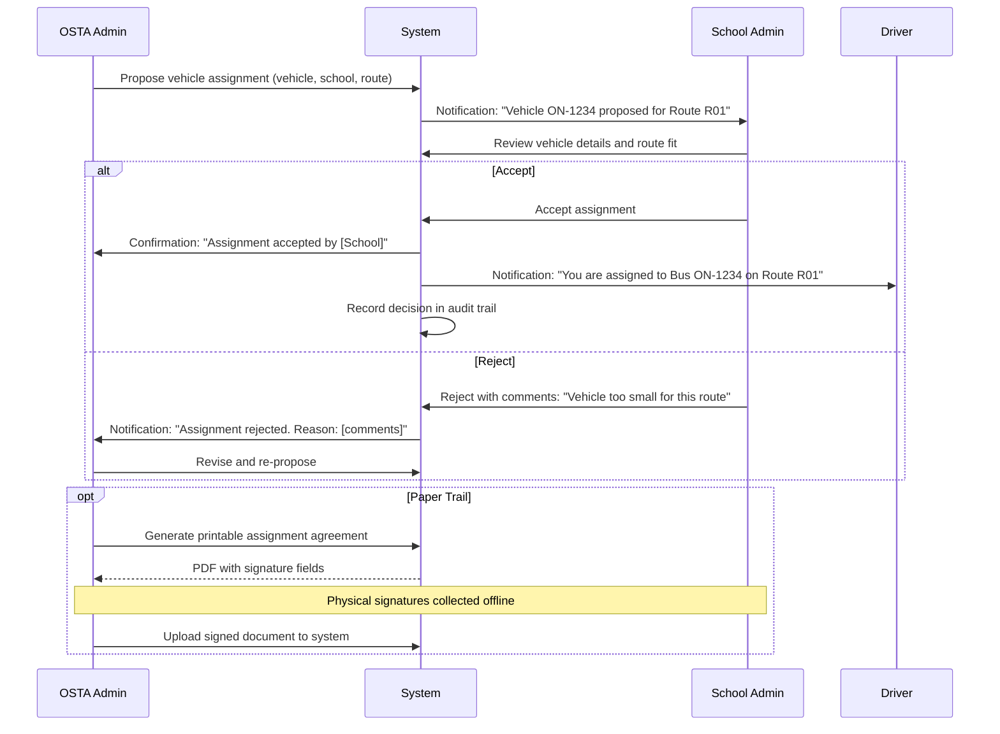

### 3.2 Emergency Alert Confirmation Workflow

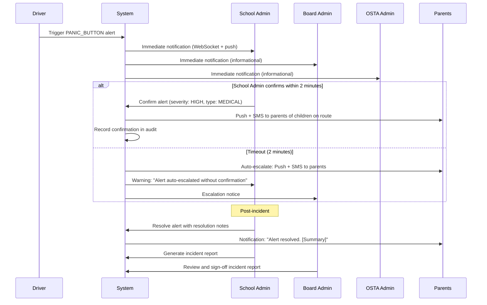

### 3.3 Student Enrollment and Parent Onboarding Workflow

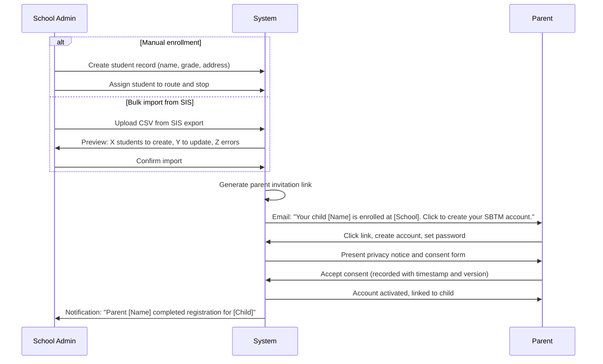

### 3.4 Route Change Notification Workflow

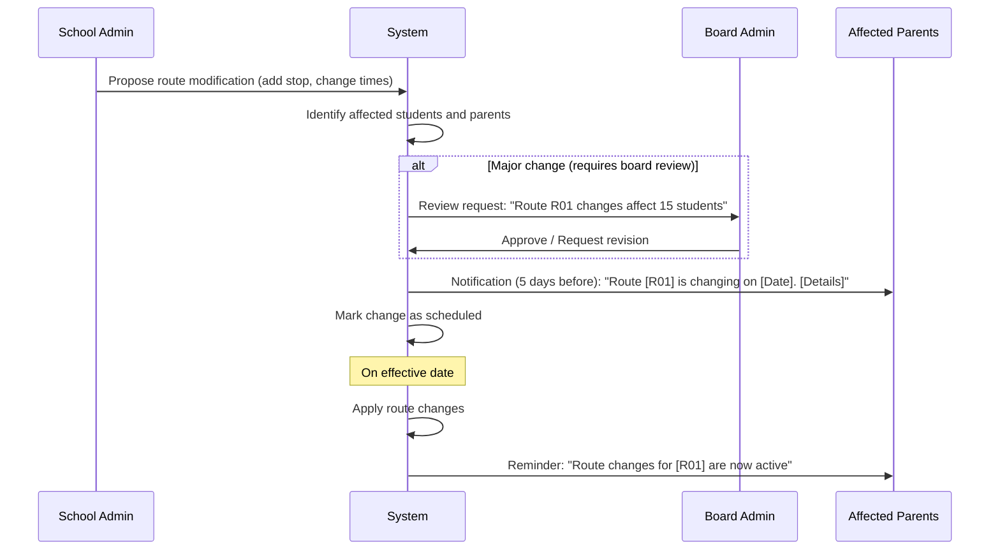

### 3.5 Pre-Trip Inspection and Route Start Workflow

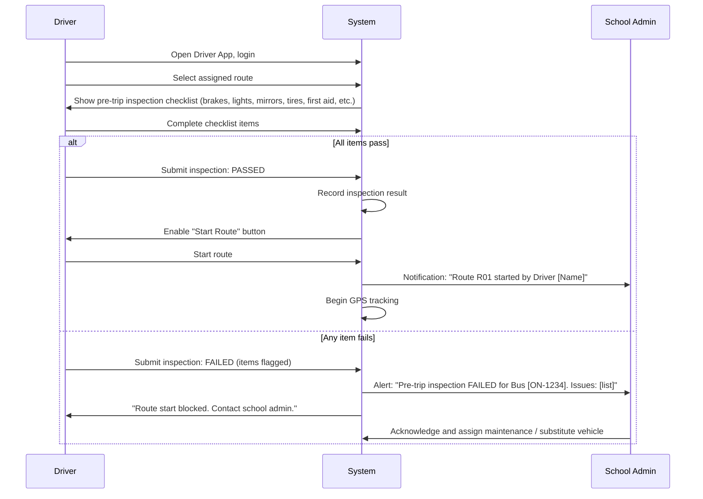

### 3.6 Absence Reporting Workflow

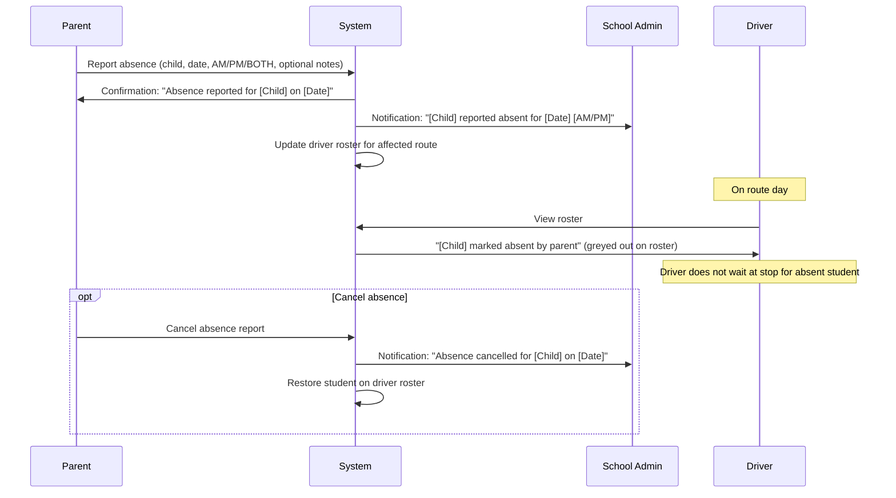

---

## 4. Hybrid Workflow Model (Digital + Paper)

Certain Ontario transportation operations require both digital tracking and physical documentation. The system supports a hybrid model:

### Activities Requiring Paper Trail

| Activity                     | Digital Component                          | Paper Component                  | How It Works                                                                                                                                         |
| ---------------------------- | ------------------------------------------ | -------------------------------- | ---------------------------------------------------------------------------------------------------------------------------------------------------- |
| Fleet assignment agreement   | Proposal/acceptance in system              | Signed assignment letter         | System generates PDF with agreement details. Both parties sign physically. Signed PDF uploaded back to system.                                       |
| Route approval (board level) | Board Admin approval in system             | Filed route plan document        | System generates route plan document with stops, timing, capacity. Board Admin approves digitally AND/OR signs physically.                           |
| Incident report              | Alert timeline, resolution notes in system | Regulatory incident form         | System pre-fills incident report template. School Admin adds narrative. Printed, signed, and filed per regulatory requirements. Uploaded to system.  |
| Driver compliance            | Compliance status tracked in system        | License copies, certifications   | Physical documents scanned and uploaded. System stores and tracks expiry dates.                                                                      |
| Parent consent               | Digital consent recorded in system         | Physical consent form (optional) | Digital consent is primary. Schools that require physical signature get a printable consent form. Signed form uploaded for record.                   |
| Annual route plan            | Route data managed in system               | Board-approved route plan binder | System exports complete route plan for board (all routes, stops, schedules, driver assignments). Board approves physical copy for regulatory filing. |

### Digital Signature Support

For workflows where both parties are system users, digital signature is implemented as:

1. System presents the document to the approver in the UI
2. Approver reviews content and clicks "Sign and Approve"
3. System records: user identity, timestamp, IP address, document hash
4. Document is marked as "Digitally Signed" with signer details
5. Document can be exported as PDF with digital signature metadata

This approach does not require PKI-based signing but provides an auditable digital approval chain suitable for internal transportation operations.

---

## 5. Responsibility Boundaries by Lifecycle Phase

### Phase 1: System Bootstrap (One-time)

- **Super Admin**: Deploy platform, configure system settings, create initial OSTA Admin
- **OSTA Admin**: Create school boards, invite Board Admins

### Phase 2: Tenant Provisioning (Per-board, per-school)

- **Board Admin**: Create schools within their board, invite School Admins, configure board calendar
- **School Admin**: Configure school settings (bell times), import students, create routes, invite drivers, trigger parent onboarding

### Phase 3: Daily Operations (Recurring)

- **Driver**: Pre-trip inspection, start route, GPS tracking, presence capture, end route
- **School Admin**: Monitor fleet, respond to alerts, manage absences, review compliance
- **Parent**: Track child, receive notifications, report absences

### Phase 4: Oversight and Compliance (Periodic)

- **Board Admin**: Review cross-school compliance, approve major route changes, review incident reports
- **OSTA Admin**: Review fleet utilization, system-wide compliance, audit trail, generate regulatory reports

### Phase 5: Maintenance and Upgrades

- **Super Admin**: Platform upgrades, database migrations, infrastructure changes
- **OSTA Admin**: Communicate changes to boards, verify post-upgrade operations

---

## 6. Navigation Items by Role (Admin Dashboard)

The Admin Dashboard sidebar displays navigation items based on the authenticated user's role. Items are filtered at the component level and also protected by route-level guards to prevent direct URL access.

| Navigation Item | Path                  | Super Admin | OSTA Admin | Board Admin | School Admin | Notes                                  |
| --------------- | --------------------- | :---------: | :--------: | :---------: | :----------: | -------------------------------------- |
| Dashboard       | `/dashboard`          |      ✓      |     ✓      |      ✓      |      ✓       | Role-appropriate overview              |
| Alerts          | `/alerts`             |      ✓      |     ✓      |      ✓      |      ✓       | Scope varies by role                   |
| Operational     | `/alerts/operational` |      ✓      |     ✓      |      ✓      |      ✓       | Operational alert management           |
| Routes          | `/routes`             |      ✓      |     ✓      |      ✓      |      ✓       | School Admin: own school only          |
| Planner         | `/routes/planner`     |      ✓      |     ✓      |      ✓      |      ✓       | Route planning tool                    |
| Fleet           | `/vehicles`           |      ✓      |     ✓      |      ✗      |      ✗       | Fleet ownership is OSTA responsibility |
| Compliance      | `/compliance`         |      ✓      |     ✓      |      ✓      |      ✓       | Scope varies by role                   |
| Assignments     | `/fleet-assignments`  |      ✓      |     ✓      |      ✓      |      ✓       | OSTA proposes, School accepts/rejects  |
| Students        | `/students`           |      ✓      |     ✓      |      ✓      |      ✓       | Scope varies by role                   |
| Absences        | `/absences`           |      ✓      |     ✓      |      ✓      |      ✓       | Scope varies by role                   |
| Boards          | `/boards`             |      ✓      |     ✓      |      ✗      |      ✗       | Board management is OSTA-level         |
| Schools         | `/schools`            |      ✓      |     ✓      |      ✓      |      ✗       | Board Admin sees own board schools     |
| Users           | `/users`              |      ✓      |     ✗      |      ✗      |      ✗       | User management is Super Admin only    |
| Settings        | `/settings`           |      ✓      |     ✓      |      ✓      |      ✓       | Role-appropriate settings              |

**Key decisions:**

- **Fleet (Vehicles)**: Restricted to OSTA Admin and Super Admin. Fleet ownership and management is an OSTA-level responsibility per the RACI matrix (Section 2). Board and School Admins are only Consulted/Informed.
- **Boards**: Restricted to OSTA Admin and Super Admin. Board lifecycle management is an OSTA-level responsibility.
- **Schools**: Available to Board Admin and above. Board Admin manages schools within their board; School Admin accesses their own school via other pages.
- **Users**: Restricted to Super Admin only for system-wide user management.
- **Videos**: Removed from navigation. Video functionality is not part of the Phase C scope.
- **Driver and Parent roles**: These roles do not access the Admin Dashboard. Drivers use the Driver App (mobile) and Parents use the Parent Portal (web).

---

## v4/IntegrationAndMigration

_Source: `prd/v4/IntegrationAndMigration.md`_

# SBTM v4 Integration and Data Migration Strategy

- Document owner: Product and Architecture
- Last reviewed: 2026-04-02
- Scope: External system integration, data migration from legacy systems, bulk import/export capabilities
- Audience: AI Agents, Product Managers, Integration Engineers, Development Team

## Related Documents

- [Gap Analysis](./v4/GapAnalysis.md)
- [Roles and Workflows](./v4/RolesAndWorkflows.md)
- [Alert Strategy](./v4/AlertStrategy.md)
- [Business Requirements](../Business/Requirements.md)
- [API Reference](../Reference/APIReference.md)
- [Service Contracts](../Reference/ServiceContracts.md)

---

## 1. Integration Landscape

### C4 Context Diagram: Target Integration Architecture

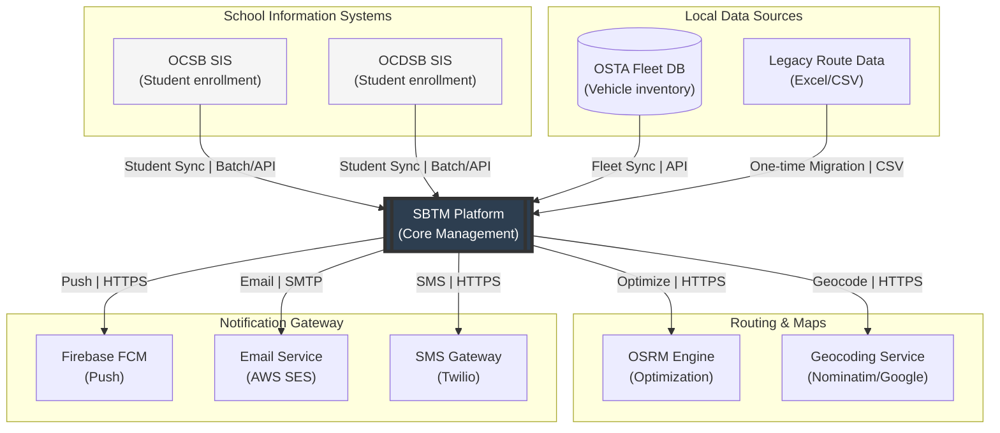

---

## 2. Student Information System (SIS) Integration

### 2.1 Problem Statement

Schools already maintain student enrollment data in their Student Information Systems (OCSB and OCDSB each have their own SIS). Currently, school admins must manually re-enter or CSV-import student data into SBTM. This creates duplicate data entry, risk of inconsistency, and a maintenance burden that grows with student count.

### 2.2 Integration Options

#### Option A: Batch File Sync (Recommended for Initial Rollout)

This is the simplest approach that works with any SIS that can export data.

```
Flow: SIS Batch Sync

1. SIS exports student data as CSV/XML on a scheduled basis (nightly or on-demand)
2. Export file is placed in a secure shared location (SFTP server or cloud storage)
3. SBTM Integration Adapter reads the file on schedule or when triggered
4. Adapter maps SIS fields to SBTM student model using board-specific mapping configuration
5. Adapter compares with current SBTM data:
   - New students -> Create enrollment records
   - Changed students -> Update records (name change, grade change, address change)
   - Missing students -> Flag for review (not auto-deleted)
6. Preview report generated for School Admin review
7. School Admin approves import -> Changes applied
8. Audit trail records all changes with source: "SIS_SYNC"
```

Field Mapping Configuration (per board):

| SIS Field (Example) | SBTM Field                         | Transformation                                          | Required |
| ------------------- | ---------------------------------- | ------------------------------------------------------- | -------- |
| `StudentNumber`     | `external_student_id`              | Direct map                                              | Yes      |
| `FirstName`         | `first_name`                       | Direct map                                              | Yes      |
| `LastName`          | `last_name`                        | Direct map                                              | Yes      |
| `Grade`             | `grade`                            | Normalize (e.g., "JK" -> "JK", "1" -> "1")              | Yes      |
| `HomeAddress`       | `address`                          | Concatenate address fields                              | Yes      |
| `ParentEmail`       | (used for parent account creation) | Validate email format                                   | No       |
| `ParentPhone`       | (used for parent account creation) | Validate phone format                                   | No       |
| `SchoolCode`        | `school_id`                        | Lookup school by external code                          | Yes      |
| `Status`            | `status`                           | Map: "Active" -> "ENROLLED", "Withdrawn" -> "WITHDRAWN" | Yes      |

Conflict Resolution Rules:

| Scenario                                             | Rule                                                             |
| ---------------------------------------------------- | ---------------------------------------------------------------- |
| Student exists in SIS but not in SBTM                | Create new student record. Do not auto-assign to route.          |
| Student exists in SBTM but not in SIS export         | Flag for review. School Admin decides to keep or withdraw.       |
| Student name changed                                 | Update name. Flag for School Admin review.                       |
| Student address changed                              | Update address. Flag for route reassignment review.              |
| Student grade changed                                | Update grade. May affect route eligibility.                      |
| Student transferred to different school (same board) | Flag as transfer. Both source and target School Admins notified. |
| Duplicate external_student_id                        | Reject import for that record. Alert School Admin.               |

#### Option B: API-Based Real-Time Sync (Future Enhancement)

For boards whose SIS provides REST or SOAP APIs, SBTM can integrate in near-real-time.

```
Flow: SIS API Sync

1. SIS publishes webhook or SBTM polls SIS API at configurable interval (e.g., every 4 hours)
2. SBTM Integration Adapter calls SIS API with "changes since" timestamp
3. Adapter processes changes using same field mapping and conflict resolution as batch
4. No School Admin approval step for routine updates (name, grade)
5. New enrollments and withdrawals still require School Admin review
6. Audit trail records all changes with source: "SIS_API_SYNC"
```

This requires SIS vendor cooperation to provide API access and is recommended only after the batch sync is proven stable.

### 2.3 Parent Account Auto-Provisioning from SIS

When student data includes parent contact information:

1. System extracts parent email and phone from SIS data
2. If parent account does not exist for that email, system creates an account in PENDING state
3. System sends invitation email to parent with activation link
4. Parent activates account, sets password, accepts consent
5. System links parent to child record via `parent_user_id`
6. If parent already exists (e.g., sibling already enrolled), system adds new child to existing parent account

---

## 3. OSTA Fleet Management Integration

### 3.1 Problem Statement

OSTA already maintains a fleet database with vehicle inventory, ownership, licensing, maintenance schedules, and insurance records. The current SBTM system requires manual re-creation of vehicle records, leading to data duplication and inconsistency.

### 3.2 Integration Design

#### One-Way Sync: OSTA Fleet DB as Source of Truth

```
Flow: Fleet Sync

1. OSTA Fleet DB exports vehicle data (CSV, database view, or API)
2. SBTM Fleet Sync Adapter reads vehicle data on schedule or trigger
3. Adapter maps OSTA fleet fields to SBTM vehicle model:
   - Vehicle ID (OSTA internal) -> external_vehicle_id (new field on Vehicle entity)
   - License plate -> licensePlate
   - Vehicle type/capacity -> capacity (new field)
   - Status -> status (map OSTA statuses to ACTIVE/MAINTENANCE/INACTIVE)
   - Safety certification expiry -> linked to compliance records
4. For new vehicles: Create in SBTM, unassigned to any school
5. For changed vehicles: Update status, plates, capacity
6. For decommissioned vehicles: Mark as INACTIVE in SBTM
7. OSTA Admin assigns synced vehicles to schools/routes through existing workflow
```

Vehicle Entity Extensions (new fields needed):

| Field                 | Type      | Description                                   |
| --------------------- | --------- | --------------------------------------------- |
| `external_vehicle_id` | String    | ID from OSTA fleet system (for sync matching) |
| `capacity`            | Integer   | Passenger capacity                            |
| `vehicle_type`        | Enum      | FULL_SIZE, MINI_BUS, WHEELCHAIR_ACCESSIBLE    |
| `year`                | Integer   | Vehicle manufacture year                      |
| `make_model`          | String    | Vehicle make and model                        |
| `insurance_expiry`    | Date      | Insurance expiration date                     |
| `safety_cert_expiry`  | Date      | Safety certification expiration date          |
| `last_synced_at`      | Timestamp | Last fleet sync timestamp                     |
| `sync_source`         | String    | "OSTA_FLEET" or "MANUAL"                      |

#### Two-Way Sync (Future Enhancement)

For bidirectional sync, SBTM writes assignment status back to OSTA fleet system:

- Vehicle assigned to school -> update OSTA fleet record with school assignment
- Vehicle maintenance reported in SBTM -> update OSTA fleet status
- Requires API access to OSTA fleet system for write operations

### 3.3 Fleet Assignment with Synced Data

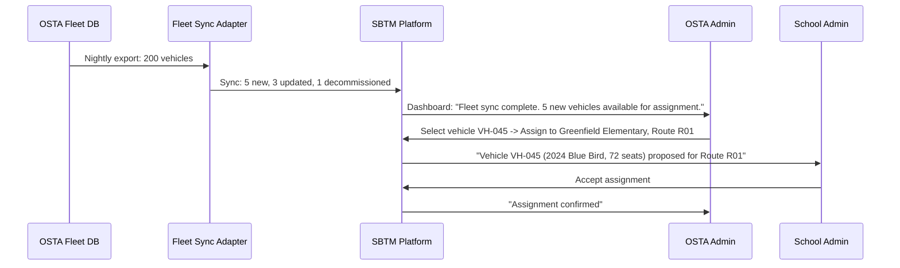

---

## 4. Legacy Route Data Migration

### 4.1 Problem Statement

Schools and OSTA have existing route definitions stored in Excel spreadsheets, PDF documents, or legacy transportation software. Migrating hundreds of routes manually through the route planner UI is impractical.

### 4.2 Route Import Wizard

The system provides a multi-step import wizard for bulk route creation from Excel or CSV files.

#### Step 1: Upload and Template Selection

Admin uploads Excel/CSV file. System provides downloadable template:

```csv
route_name,direction,start_time,estimated_duration_min,vehicle_id,stop_sequence,stop_address,stop_lat,stop_lng,stop_arrival_time
Bank Street South,AM,07:15,45,,1,123 Bank St Ottawa ON,,,07:15
Bank Street South,AM,07:15,45,,2,456 Gladstone Ave Ottawa ON,,,07:22
Bank Street South,AM,07:15,45,,3,789 Bronson Ave Ottawa ON,,,07:30
```

Rules:

- `route_name` + `direction` together identify a unique route
- If `stop_lat`/`stop_lng` are empty, system geocodes the address
- If `vehicle_id` is empty, vehicle assignment is deferred
- `stop_arrival_time` is optional; system can calculate based on OSRM if omitted

#### Step 2: Validation and Geocoding

```
Flow: Route Import Validation

1. Parse file and group rows by route_name + direction
2. For each route:
   a. Validate required fields (name, direction, at least 2 stops)
   b. Geocode addresses without coordinates (via Nominatim or geocoding service)
   c. Validate coordinates are within service region (Ottawa area bounding box)
   d. Check for duplicate route names within same school
3. For each stop:
   a. Validate address format
   b. Validate or generate coordinates
   c. Validate stop sequence is contiguous (1, 2, 3, ...)
4. Generate validation report:
   - Routes ready to create: N
   - Routes with warnings (missing coords, duplicate names): N
   - Routes with errors (invalid data, missing required fields): N
   - Addresses that could not be geocoded: list
```

#### Step 3: Preview and Correction

Admin reviews validated data on a map:

- Each route shown on map with stops and proposed polyline
- Stops with geocoded addresses highlighted for verification
- Admin can drag-and-drop stops to correct placement
- Admin can edit route details (name, times) inline
- Routes with errors must be fixed or excluded before proceeding

#### Step 4: OSRM Polyline Generation

For each validated route:

1. Submit stop coordinates to OSRM `/route/v1/driving/` endpoint
2. Receive road-following polyline and stop-to-stop distances/durations
3. Store encoded polyline with route record
4. Calculate estimated duration if not provided

#### Step 5: Commit

Admin confirms import. System creates all routes and stops in a single transaction. Audit log records bulk import with source file reference and route count.

### 4.3 Data Migration Checklist for Excel Routes

| Step | Action                                        | Who                            | How                                                |
| ---- | --------------------------------------------- | ------------------------------ | -------------------------------------------------- |
| 1    | Collect all existing route files from schools | School Admin                   | Gather Excel/PDF files                             |
| 2    | Standardize into import template format       | School Admin (with IT support) | Use provided Excel template                        |
| 3    | Verify addresses are valid Canadian format    | School Admin                   | Manual review + geocoder validation                |
| 4    | Verify stop sequences and timing              | School Admin                   | Cross-reference with current schedules             |
| 5    | Upload to SBTM import wizard                  | School Admin                   | Admin Dashboard -> Routes -> Import                |
| 6    | Review validation report                      | School Admin                   | Fix errors, verify geocoded locations on map       |
| 7    | Generate OSRM polylines                       | System (automated)             | System calls OSRM for each route                   |
| 8    | Preview and confirm                           | School Admin                   | Verify routes on map, commit import                |
| 9    | Assign vehicles to imported routes            | School Admin / OSTA Admin      | Use fleet assignment workflow                      |
| 10   | Assign students to imported routes            | School Admin                   | Use student-route assignment or bulk CSV           |
| 11   | Verify complete data                          | School Admin                   | Cross-check route count, stop count, student count |

---

## 5. Address Geocoding Service Integration

### 5.1 Problem Statement

Creating stops currently requires manual latitude/longitude entry. This is impractical for non-technical users and error-prone.

### 5.2 Geocoding Integration Design

#### Option A: Self-Hosted Nominatim (Recommended for Privacy)

Nominatim is the OpenStreetMap geocoding engine. Self-hosting ensures student address data never leaves the organization's infrastructure (PIPEDA/MFIPPA compliance).

- Deploy Nominatim Docker container with Canada/Ontario data extract
- Endpoint: `GET /search?q=123+Bank+St+Ottawa+ON&format=json&countrycodes=ca`
- Returns latitude, longitude, display name, bounding box
- Reverse geocoding: `GET /reverse?lat=45.3876&lon=-75.6960&format=json`

#### Option B: Google Maps / Mapbox Geocoding API (Alternative)

If self-hosted Nominatim is insufficient:

- Higher geocoding accuracy for Canadian addresses
- Requires API key and usage-based billing
- Student address data is sent to external service (privacy consideration)
- Must be approved by privacy assessment before use with student data

### 5.3 Geocoding in UI Workflows

**Stop Creation**: Admin types address in search box -> System geocodes in real-time -> Suggestions shown as dropdown -> Admin selects correct match -> Map pin placed at location -> Admin can fine-tune by dragging pin.

**Bulk Import**: For stops without coordinates, system batch-geocodes all addresses during validation step.

**Student Address Geocoding**: When a student address is entered or imported, system geocodes to determine nearest route stops for assignment suggestions.

---

## 6. Data Export and Reporting

### 6.1 Export Capabilities (New)

| Data Set               | Export Formats      | Available To                          | Use Case                                     |
| ---------------------- | ------------------- | ------------------------------------- | -------------------------------------------- |
| Student List           | CSV, PDF            | School Admin, Board Admin, OSTA Admin | School records, regulatory submission        |
| Route Plan             | CSV, PDF (with map) | School Admin, Board Admin             | Route planning documentation, board approval |
| Presence Records       | CSV                 | School Admin, Board Admin             | Attendance reporting, safety audit           |
| Alert History          | CSV, PDF            | School Admin, Board Admin, OSTA Admin | Incident reporting, safety review            |
| Compliance Summary     | CSV, PDF            | School Admin, Board Admin, OSTA Admin | Regulatory compliance reporting              |
| Vehicle Inspection Log | CSV, PDF            | School Admin, Board Admin             | Maintenance records, safety audit            |
| Audit Trail            | CSV                 | OSTA Admin                            | Regulatory audit, investigation              |
| Parent Contact List    | CSV                 | School Admin                          | Emergency contact reference                  |

### 6.2 Scheduled Reports (New)

| Report                    | Frequency                 | Recipients                | Content                                                                       |
| ------------------------- | ------------------------- | ------------------------- | ----------------------------------------------------------------------------- |
| Daily Operations Summary  | Daily (end of operations) | School Admin              | Routes completed, presence stats, alerts, late arrivals                       |
| Weekly Compliance Status  | Weekly (Monday morning)   | Board Admin, School Admin | Expiring credentials, overdue inspections, compliance rate                    |
| Monthly Fleet Utilization | Monthly (1st of month)    | OSTA Admin, Board Admin   | Vehicle usage, maintenance frequency, downtime                                |
| Annual Safety Report      | Annually                  | OSTA Admin                | Alert statistics, incident summary, presence compliance, inspection pass rate |

---

## 7. Notification Delivery Integration

### 7.1 Push Notification (FCM)

Integration with Firebase Cloud Messaging for cross-platform push delivery:

```
Setup:
1. Create Firebase project for SBTM
2. Configure FCM in driver app (Android/iOS via Expo)
3. Configure FCM in parent app (web push via service worker)
4. Store FCM server key in SBTM environment configuration
5. On user login, register device token with SBTM (new API: POST /devices/register)
6. Notification Router sends via FCM Admin SDK

Token Management:
- Tokens stored per user (user can have multiple devices)
- Token refreshed on each app launch
- Stale tokens cleaned up when FCM returns "not registered" error
```

### 7.2 Email (AWS SES / SMTP)

```
Setup:
1. Configure SMTP connection or AWS SES credentials in environment
2. Verify sender domain (e.g., notifications@sbtm-osta.ca)
3. Create email templates for each notification type (HTML + plain text)
4. Configure rate limits per environment

Use Cases:
- Parent invitation emails
- Route change notifications
- Weekly/monthly reports
- Non-urgent compliance reminders
- Alert summary (daily digest)
```

### 7.3 SMS (Twilio / AWS SNS)

```
Setup:
1. Configure Twilio account SID and auth token (or AWS SNS credentials)
2. Purchase or configure sender phone number with Canadian regulations (CASL compliance)
3. Configure SMS templates (160 char limit for standard SMS)
4. Set up delivery status webhooks

Use Cases:
- Emergency alert escalation (Tier 1 only)
- Two-factor authentication (future)
- Parent account activation (alternative to email)

Rate Limits:
- Emergency SMS: No rate limit (safety-critical)
- Routine SMS: Max 5 per user per day
```

---

## 8. Migration Planning Summary

### Pre-Migration Activities

| Activity                                        | Owner                 | Duration Estimate | Dependencies            |
| ----------------------------------------------- | --------------------- | ----------------- | ----------------------- |
| Collect route data from all schools (Excel/PDF) | School Admins         | 2-4 weeks         | School cooperation      |
| Standardize route data into import template     | School Admins + IT    | 1-2 weeks         | Template availability   |
| Collect student data from SIS                   | Board IT              | 1 week            | SIS export access       |
| Collect fleet data from OSTA                    | OSTA IT               | 1 week            | Fleet DB access         |
| Configure field mapping per board               | SBTM Development Team | 1 week            | Sample data from boards |
| Set up geocoding service                        | SBTM Development Team | 1 week            | Infrastructure          |
| Set up notification services (FCM/email/SMS)    | SBTM Development Team | 2 weeks           | Service accounts        |

### Migration Sequence

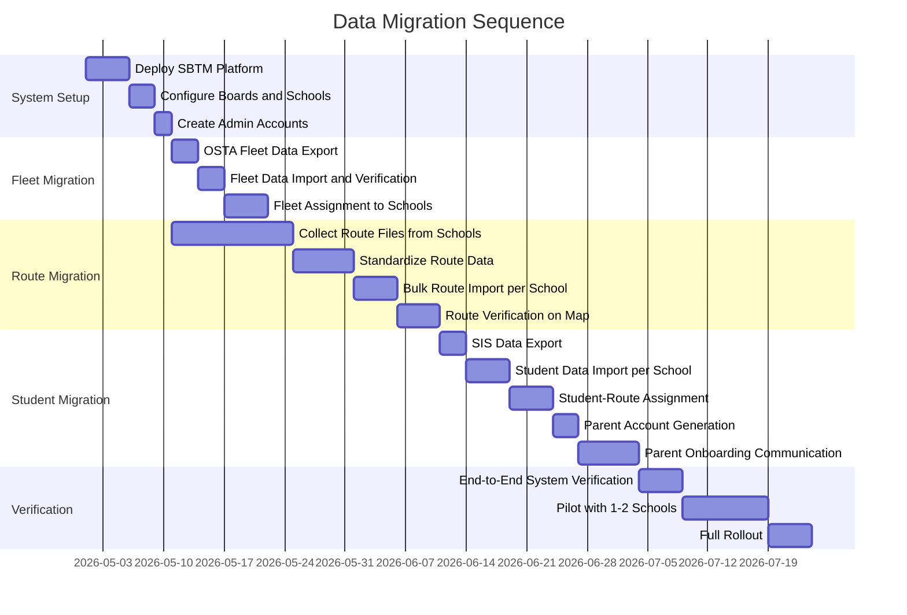

### Post-Migration Verification Checklist

| Check                                          | Expected Result                               | Who Verifies |
| ---------------------------------------------- | --------------------------------------------- | ------------ |
| All school boards created                      | Count matches expected boards                 | OSTA Admin   |
| All schools created under correct boards       | Count and board assignment correct            | Board Admin  |
| All vehicles imported                          | Count matches OSTA fleet DB                   | OSTA Admin   |
| All routes imported per school                 | Count matches legacy data                     | School Admin |
| Route polylines render correctly on map        | Visual verification                           | School Admin |
| Stop locations are accurate on map             | Visual verification against known addresses   | School Admin |
| All students imported per school               | Count matches SIS data                        | School Admin |
| Students assigned to correct routes and stops  | Spot-check 10% of students                    | School Admin |
| Parent accounts generated                      | Count matches unique parent emails            | School Admin |
| Parent invitation emails delivered             | Check email delivery logs                     | SBTM Admin   |
| Driver accounts created and assigned to routes | Each route has a driver                       | School Admin |
| Notification services operational              | Send test push, email, SMS                    | SBTM Admin   |
| GPS tracking operational                       | Simulate bus location, verify on dashboard    | SBTM Admin   |
| Alert workflow operational                     | Trigger test alert, verify notification chain | School Admin |

---

## v4/ProductionIntegrationChecklist

_Source: `prd/v4/ProductionIntegrationChecklist.md`_

# SBTM Production Integration Checklist

- Document owner: Product, Architecture, and Operations
- Last reviewed: 2026-04-02
- Scope: Comprehensive checklist of all activities for production rollout and version upgrades
- Audience: AI Agents, Project Managers, DevOps Engineers, QA Team

## Related Documents

- [Production Rollout Guide](./v4/ProductionRolloutGuide.md)
- [Upgrade Plan](./v4/UpgradePlan.md)
- [Integration and Migration](./v4/IntegrationAndMigration.md)

---

## Checklist Usage

- Each item has an **Automation Status**: `Manual`, `To Automate`, or `Automated`
- `To Automate` items are candidates for automation scripts, CI/CD pipelines, or monitoring tools. This document describes what needs to be automated but does not provide the scripts.
- Check off items as they are completed. Record the completion date and responsible person.

---

## Section 1: First-Time Deployment Checklist

### 1.1 Infrastructure Setup

| #      | Activity                                                              | Owner  | Automation Status | Completed | Date | Notes                                     |
| ------ | --------------------------------------------------------------------- | ------ | :---------------: | :-------: | ---- | ----------------------------------------- |
| 1.1.1  | Provision application hosting (K8s cluster or VMs) in Canadian region | DevOps |    To Automate    |    [ ]    |      | Terraform/Ansible playbook needed         |
| 1.1.2  | Deploy PostgreSQL 15 + PostGIS with encryption at rest                | DevOps |    To Automate    |    [ ]    |      | Managed DB service or containerized       |
| 1.1.3  | Configure PostgreSQL automated daily backups (30-day retention)       | DevOps |    To Automate    |    [ ]    |      | Backup schedule and retention script      |
| 1.1.4  | Test database restore from backup on staging                          | DevOps |      Manual       |    [ ]    |      | Restore test must succeed                 |
| 1.1.5  | Deploy Redis 7 with persistence                                       | DevOps |    To Automate    |    [ ]    |      | AOF or RDB persistence                    |
| 1.1.6  | Deploy OSRM with Ontario road network data                            | DevOps |    To Automate    |    [ ]    |      | Download and process OSM extract          |
| 1.1.7  | Deploy Nominatim with Canada data (if self-hosting geocoder)          | DevOps |    To Automate    |    [ ]    |      | Optional; alternative is external API     |
| 1.1.8  | Configure DNS records for production domain                           | DevOps |      Manual       |    [ ]    |      | A record or CNAME for sbtm.osta.ca        |
| 1.1.9  | Provision and install SSL/TLS certificate                             | DevOps |    To Automate    |    [ ]    |      | Let's Encrypt or managed cert             |
| 1.1.10 | Configure SSL certificate auto-renewal                                | DevOps |    To Automate    |    [ ]    |      | Certbot or equivalent                     |
| 1.1.11 | Set up email service (SES or SMTP)                                    | DevOps |      Manual       |    [ ]    |      | Verify sender domain                      |
| 1.1.12 | Send test email through configured service                            | QA     |      Manual       |    [ ]    |      | Verify delivery to real inbox             |
| 1.1.13 | Create Firebase Cloud Messaging project                               | DevOps |      Manual       |    [ ]    |      | FCM project for push notifications        |
| 1.1.14 | Configure FCM server key in environment                               | DevOps |      Manual       |    [ ]    |      | Store in secret manager                   |
| 1.1.15 | Send test push notification through FCM                               | QA     |      Manual       |    [ ]    |      | Verify receipt on test device             |
| 1.1.16 | Set up SMS gateway (Twilio or SNS)                                    | DevOps |      Manual       |    [ ]    |      | Canadian phone number, CASL registration  |
| 1.1.17 | Send test SMS through configured gateway                              | QA     |      Manual       |    [ ]    |      | Verify receipt on test phone              |
| 1.1.18 | Deploy monitoring stack (Jaeger, Prometheus/Grafana or equivalent)    | DevOps |    To Automate    |    [ ]    |      | Containerized monitoring                  |
| 1.1.19 | Configure uptime monitoring for all service endpoints                 | DevOps |    To Automate    |    [ ]    |      | External monitoring service or script     |
| 1.1.20 | Set up alerting for service downtime (email/PagerDuty/Slack)          | DevOps |    To Automate    |    [ ]    |      | Alert when health check fails             |
| 1.1.21 | Configure secret manager (Vault, AWS Secrets Manager, or similar)     | DevOps |    To Automate    |    [ ]    |      | All secrets stored here, not in env files |
| 1.1.22 | Configure network security (firewall rules, VPC, security groups)     | DevOps |    To Automate    |    [ ]    |      | Only necessary ports exposed              |
| 1.1.23 | Set up log aggregation (ELK, CloudWatch, or similar)                  | DevOps |    To Automate    |    [ ]    |      | Centralized logging for all services      |

### 1.2 Application Deployment

| #      | Activity                                                          | Owner  | Automation Status | Completed | Date | Notes                                             |
| ------ | ----------------------------------------------------------------- | ------ | :---------------: | :-------: | ---- | ------------------------------------------------- |
| 1.2.1  | Build production Docker images for all 7 backend services         | DevOps |    To Automate    |    [ ]    |      | CI/CD pipeline                                    |
| 1.2.2  | Build production bundles for Admin Dashboard and Parent Portal    | DevOps |    To Automate    |    [ ]    |      | CI/CD pipeline                                    |
| 1.2.3  | Build production APK/IPA for Driver App                           | DevOps |    To Automate    |    [ ]    |      | EAS Build or equivalent                           |
| 1.2.4  | Configure all environment variables for each service              | DevOps |    To Automate    |    [ ]    |      | Template-based env config from secrets            |
| 1.2.5  | Deploy API Gateway service                                        | DevOps |    To Automate    |    [ ]    |      | Rolling deploy                                    |
| 1.2.6  | Run database schema migration                                     | DevOps |    To Automate    |    [ ]    |      | TypeORM + Prisma migrations                       |
| 1.2.7  | Apply RLS policies to PostgreSQL                                  | DevOps |    To Automate    |    [ ]    |      | Run rls-policies.sql                              |
| 1.2.8  | Deploy GPS Tracking service                                       | DevOps |    To Automate    |    [ ]    |      |                                                   |
| 1.2.9  | Deploy Emergency Alerts service                                   | DevOps |    To Automate    |    [ ]    |      |                                                   |
| 1.2.10 | Deploy Student Presence service                                   | DevOps |    To Automate    |    [ ]    |      |                                                   |
| 1.2.11 | Deploy Video Service                                              | DevOps |    To Automate    |    [ ]    |      |                                                   |
| 1.2.12 | Deploy Student Management service                                 | DevOps |    To Automate    |    [ ]    |      |                                                   |
| 1.2.13 | Deploy Compliance Management service                              | DevOps |    To Automate    |    [ ]    |      |                                                   |
| 1.2.14 | Deploy Notification Router service (new)                          | DevOps |    To Automate    |    [ ]    |      |                                                   |
| 1.2.15 | Deploy Admin Dashboard frontend                                   | DevOps |    To Automate    |    [ ]    |      | Static files + nginx or CDN                       |
| 1.2.16 | Deploy Parent Portal frontend                                     | DevOps |    To Automate    |    [ ]    |      | Static files + nginx or CDN                       |
| 1.2.17 | Submit Driver App to Play Store (internal test track)             | DevOps |      Manual       |    [ ]    |      | Allow 1-3 days for review                         |
| 1.2.18 | Submit Driver App to App Store (TestFlight)                       | DevOps |      Manual       |    [ ]    |      | Allow 1-3 days for review                         |
| 1.2.19 | Verify all service health endpoints return 200                    | QA     |    To Automate    |    [ ]    |      | Automated health check script                     |
| 1.2.20 | Verify inter-service communication (Gateway -> all downstream)    | QA     |    To Automate    |    [ ]    |      | Integration test suite                            |
| 1.2.21 | Verify WebSocket connectivity (admin dashboard -> alerts service) | QA     |      Manual       |    [ ]    |      | Open dashboard, verify connection                 |
| 1.2.22 | Verify SSE connectivity (parent app -> alerts stream)             | QA     |      Manual       |    [ ]    |      | Open parent app, verify stream                    |
| 1.2.23 | Run smoke test suite                                              | QA     |    To Automate    |    [ ]    |      | Automated smoke tests                             |
| 1.2.24 | Verify rate limiting is active on public endpoints                | QA     |      Manual       |    [ ]    |      | Send >100 requests, verify 429 response           |
| 1.2.25 | Verify service-to-service JWT authentication is enforced          | QA     |      Manual       |    [ ]    |      | Direct call to downstream without JWT returns 401 |

### 1.3 System Bootstrap

| #      | Activity                                                            | Owner         | Automation Status | Completed | Date | Notes                          |
| ------ | ------------------------------------------------------------------- | ------------- | :---------------: | :-------: | ---- | ------------------------------ |
| 1.3.1  | Create Super Admin account (first-time setup wizard or manual)      | Super Admin   |      Manual       |    [ ]    |      | Secure password generated      |
| 1.3.2  | Login as Super Admin and verify access                              | Super Admin   |      Manual       |    [ ]    |      |                                |
| 1.3.3  | Configure system settings (timezone, region, notification defaults) | Super Admin   |      Manual       |    [ ]    |      |                                |
| 1.3.4  | Create OSTA Admin account                                           | Super Admin   |      Manual       |    [ ]    |      |                                |
| 1.3.5  | OSTA Admin logs in and verifies access                              | OSTA Admin    |      Manual       |    [ ]    |      |                                |
| 1.3.6  | Create Board: Ottawa Catholic School Board (OCSB)                   | OSTA Admin    |      Manual       |    [ ]    |      |                                |
| 1.3.7  | Create Board: Ottawa-Carleton District School Board (OCDSB)         | OSTA Admin    |      Manual       |    [ ]    |      |                                |
| 1.3.8  | Create Board Admin accounts for OCSB and OCDSB                      | OSTA Admin    |      Manual       |    [ ]    |      |                                |
| 1.3.9  | Board Admins receive invitation email and activate accounts         | Board Admins  |      Manual       |    [ ]    |      |                                |
| 1.3.10 | Board Admins create pilot schools                                   | Board Admins  |      Manual       |    [ ]    |      |                                |
| 1.3.11 | Board Admins create School Admin accounts for pilot schools         | Board Admins  |      Manual       |    [ ]    |      |                                |
| 1.3.12 | School Admins receive invitation email and activate accounts        | School Admins |      Manual       |    [ ]    |      |                                |
| 1.3.13 | Verify tenant isolation: School Admin A cannot see School B data    | QA            |      Manual       |    [ ]    |      | Critical security verification |
| 1.3.14 | Verify tenant isolation: Board Admin cannot see other board's data  | QA            |      Manual       |    [ ]    |      | Critical security verification |

### 1.4 Data Migration

| #      | Activity                                                            | Owner              | Automation Status | Completed | Date | Notes                                |
| ------ | ------------------------------------------------------------------- | ------------------ | :---------------: | :-------: | ---- | ------------------------------------ |
| 1.4.1  | Obtain fleet data export from OSTA                                  | OSTA Admin         |      Manual       |    [ ]    |      | CSV or database export               |
| 1.4.2  | Configure fleet field mapping                                       | DevOps             |      Manual       |    [ ]    |      | Match OSTA fields to SBTM fields     |
| 1.4.3  | Run fleet data import                                               | OSTA Admin         |      Manual       |    [ ]    |      | Via sync adapter or bulk import      |
| 1.4.4  | Verify fleet data: count, details, status                           | OSTA Admin         |      Manual       |    [ ]    |      | Spot-check 20% of vehicles           |
| 1.4.5  | Assign vehicles to pilot schools                                    | OSTA Admin         |      Manual       |    [ ]    |      | Via fleet assignment workflow        |
| 1.4.6  | School Admin accepts vehicle assignments                            | School Admin       |      Manual       |    [ ]    |      |                                      |
| 1.4.7  | Collect route data files from pilot schools                         | School Admins      |      Manual       |    [ ]    |      | Excel/CSV files                      |
| 1.4.8  | Standardize route data into import template                         | School Admins      |      Manual       |    [ ]    |      | Use provided template                |
| 1.4.9  | Upload route data to import wizard                                  | School Admins      |      Manual       |    [ ]    |      | Admin Dashboard -> Routes -> Import  |
| 1.4.10 | Review validation report and fix errors                             | School Admins      |      Manual       |    [ ]    |      | Address any geocoding failures       |
| 1.4.11 | Preview routes on map and verify accuracy                           | School Admins      |      Manual       |    [ ]    |      | Visual verification                  |
| 1.4.12 | Commit route import                                                 | School Admins      |      Manual       |    [ ]    |      |                                      |
| 1.4.13 | Verify route count matches expected                                 | School Admins      |      Manual       |    [ ]    |      |                                      |
| 1.4.14 | Obtain student data from SIS                                        | Board IT           |      Manual       |    [ ]    |      | CSV export from SIS                  |
| 1.4.15 | Configure SIS field mapping per board                               | DevOps             |      Manual       |    [ ]    |      | Match SIS fields to SBTM fields      |
| 1.4.16 | Run student data import                                             | School Admins      |      Manual       |    [ ]    |      | Via bulk import or SIS sync          |
| 1.4.17 | Review import results: created, updated, errors                     | School Admins      |      Manual       |    [ ]    |      |                                      |
| 1.4.18 | Verify student count matches SIS                                    | School Admins      |      Manual       |    [ ]    |      |                                      |
| 1.4.19 | Assign students to routes and stops                                 | School Admins      |      Manual       |    [ ]    |      | Individual or bulk assignment        |
| 1.4.20 | Verify student-route assignments (spot check 10%)                   | School Admins      |      Manual       |    [ ]    |      |                                      |
| 1.4.21 | Generate parent invitation emails                                   | System             |    To Automate    |    [ ]    |      | Automated from student parent data   |
| 1.4.22 | Monitor parent activation rate                                      | School Admins      |      Manual       |    [ ]    |      | Track % activated over 1 week        |
| 1.4.23 | Follow up with unactivated parents (email reminder)                 | School Admins      |    To Automate    |    [ ]    |      | Reminder email after 3 days          |
| 1.4.24 | Create driver accounts                                              | School Admins      |      Manual       |    [ ]    |      |                                      |
| 1.4.25 | Assign drivers to routes                                            | School Admins      |      Manual       |    [ ]    |      |                                      |
| 1.4.26 | Enter driver compliance data (licenses, background checks, medical) | School Admins      |      Manual       |    [ ]    |      |                                      |
| 1.4.27 | Perform end-to-end data reconciliation                              | QA + School Admins |      Manual       |    [ ]    |      | Compare SBTM totals with source data |

### 1.5 Pilot Testing

| #      | Activity                                                    | Owner                 | Automation Status | Completed | Date | Notes                                     |
| ------ | ----------------------------------------------------------- | --------------------- | :---------------: | :-------: | ---- | ----------------------------------------- |
| 1.5.1  | Conduct driver training session (in-person or video)        | School Admins         |      Manual       |    [ ]    |      | Cover: login, route select, roster, panic |
| 1.5.2  | Conduct admin training session                              | SBTM Team             |      Manual       |    [ ]    |      | Cover: dashboard, alerts, compliance      |
| 1.5.3  | Drivers install app and login successfully                  | Drivers               |      Manual       |    [ ]    |      |                                           |
| 1.5.4  | Drivers see assigned routes in app                          | Drivers               |      Manual       |    [ ]    |      |                                           |
| 1.5.5  | Pilot Day 1: Driver starts route, GPS tracks on dashboard   | All                   |      Manual       |    [ ]    |      | Verify: map shows bus location            |
| 1.5.6  | Pilot Day 1: Driver marks students as boarded               | Drivers               |      Manual       |    [ ]    |      |                                           |
| 1.5.7  | Pilot Day 1: Parent receives boarding push notification     | QA                    |      Manual       |    [ ]    |      |                                           |
| 1.5.8  | Pilot Day 1: Driver marks students as alighted              | Drivers               |      Manual       |    [ ]    |      |                                           |
| 1.5.9  | Pilot Day 1: Parent receives alighting push notification    | QA                    |      Manual       |    [ ]    |      |                                           |
| 1.5.10 | Pilot Day 1: Simulate emergency (driver triggers panic)     | Driver + School Admin |      Manual       |    [ ]    |      | Coordinated test                          |
| 1.5.11 | Pilot Day 1: School Admin receives and confirms alert       | School Admin          |      Manual       |    [ ]    |      | Within 2 minutes                          |
| 1.5.12 | Pilot Day 1: Parents receive emergency notification         | QA                    |      Manual       |    [ ]    |      | Push + SMS                                |
| 1.5.13 | Pilot Day 1: School Admin resolves alert                    | School Admin          |      Manual       |    [ ]    |      |                                           |
| 1.5.14 | Pilot Day 1: Parent receives resolution notification        | QA                    |      Manual       |    [ ]    |      |                                           |
| 1.5.15 | Pilot Day 1: Parent reports absence for next day            | Parent                |      Manual       |    [ ]    |      |                                           |
| 1.5.16 | Pilot Day 2: Driver sees absent student on roster           | Driver                |      Manual       |    [ ]    |      |                                           |
| 1.5.17 | Pilot Week 1: Test pre-trip inspection flow                 | Driver                |      Manual       |    [ ]    |      |                                           |
| 1.5.18 | Pilot Week 1: Test compliance expiry alert                  | School Admin          |      Manual       |    [ ]    |      | Set a test expiry date                    |
| 1.5.19 | Pilot Week 1: Review alert response times                   | School Admin          |      Manual       |    [ ]    |      | All alerts confirmed within target        |
| 1.5.20 | Pilot Week 1: Collect feedback from all roles               | Project Manager       |      Manual       |    [ ]    |      | Survey or interview                       |
| 1.5.21 | Address critical issues found in pilot                      | Dev Team              |      Manual       |    [ ]    |      |                                           |
| 1.5.22 | Pilot Week 2: Extended operation (all pilot routes, 5 days) | All                   |      Manual       |    [ ]    |      |                                           |
| 1.5.23 | Pilot Week 2: Zero critical issues for 3 consecutive days   | QA                    |      Manual       |    [ ]    |      | Go/no-go criterion                        |
| 1.5.24 | Pilot sign-off: all stakeholders approve full rollout       | Project Manager       |      Manual       |    [ ]    |      | Formal sign-off document                  |

### 1.6 Full Rollout

| #     | Activity                                           | Owner                  | Automation Status | Completed | Date | Notes                               |
| ----- | -------------------------------------------------- | ---------------------- | :---------------: | :-------: | ---- | ----------------------------------- |
| 1.6.1 | Complete data migration for all remaining schools  | School Admins          |      Manual       |    [ ]    |      | Repeat section 1.4 per school       |
| 1.6.2 | Complete driver onboarding for all routes          | School Admins          |      Manual       |    [ ]    |      |                                     |
| 1.6.3 | Complete parent onboarding for all students        | System + School Admins |      Manual       |    [ ]    |      |                                     |
| 1.6.4 | Verify system performance under full load          | DevOps                 |    To Automate    |    [ ]    |      | Load test or monitor first few days |
| 1.6.5 | Establish daily monitoring routine                 | DevOps                 |      Manual       |    [ ]    |      |                                     |
| 1.6.6 | Confirm support contacts and escalation procedures | Operations             |      Manual       |    [ ]    |      |                                     |
| 1.6.7 | Full rollout sign-off                              | OSTA Admin             |      Manual       |    [ ]    |      |                                     |

---

## Section 2: Feature/Version Upgrade Checklist

### 2.1 Pre-Upgrade

| #     | Activity                                     | Owner           | Automation Status | Completed | Date | Notes                         |
| ----- | -------------------------------------------- | --------------- | :---------------: | :-------: | ---- | ----------------------------- |
| 2.1.1 | Release notes prepared and reviewed          | Dev Lead        |      Manual       |    [ ]    |      |                               |
| 2.1.2 | Database migration scripts tested on staging | Dev Lead        |    To Automate    |    [ ]    |      | CI runs migration on staging  |
| 2.1.3 | Rollback scripts prepared and tested         | Dev Lead        |      Manual       |    [ ]    |      |                               |
| 2.1.4 | Full test suite passes on staging            | QA              |    To Automate    |    [ ]    |      | CI/CD gate                    |
| 2.1.5 | Configuration changes documented             | DevOps          |      Manual       |    [ ]    |      | New env vars, setting changes |
| 2.1.6 | Stakeholders notified of maintenance window  | Project Manager |      Manual       |    [ ]    |      | 24-48h advance notice         |
| 2.1.7 | Fresh database backup taken                  | DevOps          |    To Automate    |    [ ]    |      | Immediately before upgrade    |
| 2.1.8 | Verify backup integrity (checksum)           | DevOps          |    To Automate    |    [ ]    |      |                               |
| 2.1.9 | Maintenance mode ready (if breaking changes) | DevOps          |    To Automate    |    [ ]    |      | Static "upgrading" page       |

### 2.2 Upgrade Execution

| #     | Activity                                        | Owner           | Automation Status | Completed | Date | Notes                        |
| ----- | ----------------------------------------------- | --------------- | :---------------: | :-------: | ---- | ---------------------------- |
| 2.2.1 | Enable maintenance mode (breaking changes only) | DevOps          |    To Automate    |    [ ]    |      |                              |
| 2.2.2 | Run database migration                          | DevOps          |    To Automate    |    [ ]    |      |                              |
| 2.2.3 | Deploy updated backend services                 | DevOps          |    To Automate    |    [ ]    |      | Rolling or blue-green deploy |
| 2.2.4 | Deploy updated frontend applications            | DevOps          |    To Automate    |    [ ]    |      |                              |
| 2.2.5 | Disable maintenance mode                        | DevOps          |    To Automate    |    [ ]    |      |                              |
| 2.2.6 | Verify all health endpoints return 200          | QA              |    To Automate    |    [ ]    |      |                              |
| 2.2.7 | Run smoke test suite                            | QA              |    To Automate    |    [ ]    |      |                              |
| 2.2.8 | Verify no error spike in logs/monitoring        | DevOps          |    To Automate    |    [ ]    |      | 30-minute monitoring         |
| 2.2.9 | Notify stakeholders: upgrade complete           | Project Manager |      Manual       |    [ ]    |      |                              |

### 2.3 Post-Upgrade Verification

| #     | Activity                                       | Owner         | Automation Status | Completed | Date | Notes                               |
| ----- | ---------------------------------------------- | ------------- | :---------------: | :-------: | ---- | ----------------------------------- |
| 2.3.1 | Login as each role and verify access           | QA            |      Manual       |    [ ]    |      | OSTA, Board, School, Driver, Parent |
| 2.3.2 | Verify GPS tracking is operational             | QA            |      Manual       |    [ ]    |      |                                     |
| 2.3.3 | Verify alert creation and delivery             | QA            |      Manual       |    [ ]    |      |                                     |
| 2.3.4 | Verify presence capture and notification       | QA            |      Manual       |    [ ]    |      |                                     |
| 2.3.5 | Verify new features work as documented         | QA            |      Manual       |    [ ]    |      | Per release notes                   |
| 2.3.6 | Monitor error rates for 24 hours               | DevOps        |    To Automate    |    [ ]    |      |                                     |
| 2.3.7 | Collect user feedback (any issues with update) | School Admins |      Manual       |    [ ]    |      |                                     |
| 2.3.8 | Update documentation to reflect changes        | Dev Lead      |      Manual       |    [ ]    |      |                                     |

### 2.4 Mobile App Upgrade

| #     | Activity                                                    | Owner         | Automation Status | Completed | Date | Notes              |
| ----- | ----------------------------------------------------------- | ------------- | :---------------: | :-------: | ---- | ------------------ |
| 2.4.1 | Build new driver app version                                | DevOps        |    To Automate    |    [ ]    |      | EAS Build          |
| 2.4.2 | Test new app version against production API                 | QA            |      Manual       |    [ ]    |      |                    |
| 2.4.3 | Verify old app version still works (backward compatibility) | QA            |      Manual       |    [ ]    |      |                    |
| 2.4.4 | Submit to Play Store                                        | DevOps        |      Manual       |    [ ]    |      |                    |
| 2.4.5 | Submit to App Store                                         | DevOps        |      Manual       |    [ ]    |      |                    |
| 2.4.6 | Notify drivers to update (push + email)                     | School Admins |      Manual       |    [ ]    |      |                    |
| 2.4.7 | Monitor adoption rate (% on new version)                    | DevOps        |    To Automate    |    [ ]    |      | Track via API logs |
| 2.4.8 | After 2 weeks: decide on deprecating old version            | Dev Lead      |      Manual       |    [ ]    |      |                    |

---

## Section 3: Automation Summary

The following items are marked "To Automate" and should be implemented as part of the DevOps and CI/CD setup:

### CI/CD Pipeline Automation

| What                                  | Why                             | Tool Suggestions                  |
| ------------------------------------- | ------------------------------- | --------------------------------- |
| Build Docker images on git push       | Consistent, reproducible builds | GitHub Actions, GitLab CI         |
| Run test suite on pull request        | Catch regressions before merge  | CI pipeline with Jest/Vitest      |
| Deploy to staging on merge to develop | Continuous integration testing  | CD pipeline                       |
| Deploy to production on release tag   | Controlled production releases  | CD pipeline with approval gate    |
| Database migration execution          | Consistent schema updates       | Run as part of deploy pipeline    |
| Smoke test execution post-deploy      | Immediate deploy verification   | Automated test runner in pipeline |

### Infrastructure Automation

| What                         | Why                                    | Tool Suggestions                          |
| ---------------------------- | -------------------------------------- | ----------------------------------------- |
| Infrastructure provisioning  | Reproducible, version-controlled infra | Terraform, Pulumi, AWS CDK                |
| SSL certificate renewal      | Prevent certificate expiry             | Certbot with cron, or managed certs       |
| Database backup scheduling   | Data protection                        | pg_dump cron job or managed DB feature    |
| Log rotation and cleanup     | Prevent disk fill                      | logrotate, cloudwatch                     |
| OSRM data update (quarterly) | Keep road network current              | Cron job to download and process OSM data |

### Monitoring Automation

| What                             | Why                               | Tool Suggestions                        |
| -------------------------------- | --------------------------------- | --------------------------------------- |
| Health check endpoints monitored | Detect outages immediately        | Uptime Robot, Pingdom, custom script    |
| Error rate alerting              | Detect issues before users report | Prometheus + Alertmanager, Datadog      |
| Queue depth monitoring           | Detect processing backlogs        | Redis monitoring + alerts               |
| Disk/CPU/memory alerts           | Prevent resource exhaustion       | Cloud provider monitoring               |
| Slow query logging               | Performance degradation detection | PostgreSQL pg_stat_statements           |
| Notification delivery monitoring | Ensure parents receive alerts     | FCM delivery reports, Twilio dashboards |

### Operational Automation

| What                                              | Why                            | Tool Suggestions                                 |
| ------------------------------------------------- | ------------------------------ | ------------------------------------------------ |
| Daily operations summary email                    | Reduce manual reporting burden | Scheduled job in Compliance service              |
| Compliance expiry check and alert                 | Prevent compliance gaps        | Existing scheduled job, add email notification   |
| Parent invitation reminder (3 days after initial) | Improve activation rate        | Scheduled job checking unactivated accounts      |
| Data retention enforcement                        | Privacy compliance             | Existing retention service (already implemented) |
| Stale device token cleanup                        | Keep push delivery reliable    | Periodic job removing invalid FCM tokens         |

---

## v4/ProductionRolloutGuide

_Source: `prd/v4/ProductionRolloutGuide.md`_

# SBTM Production Implementation and Rollout Guide

- Document owner: Product, Architecture, and Operations
- Last reviewed: 2026-04-02
- Scope: Complete guide for first-time production deployment and feature/version upgrades
- Audience: AI Agents, DevOps Engineers, Project Managers, OSTA Operations Team

## Related Documents

- [Production Integration Checklist](./v4/ProductionIntegrationChecklist.md)
- [Upgrade Plan](./v4/UpgradePlan.md)
- [Integration and Migration](./v4/IntegrationAndMigration.md)
- [Deployment Architecture](../Design/DeploymentArchitecture.md)
- [Deployment Guide](../Operations/DeploymentGuide.md)
- [Runbooks](../Operations/Runbooks.md)

---

## Part 1: First-Time Production Deployment

### 1.1 Pre-Deployment Planning

#### Stakeholder Coordination

| Stakeholder                   | Required Actions Before Go-Live                                                    | Lead Time |
| ----------------------------- | ---------------------------------------------------------------------------------- | --------- |
| OSTA Operations               | Approve deployment plan, identify OSTA Admin user(s), provide fleet data access    | 4 weeks   |
| School Boards (OCSB, OCDSB)   | Identify Board Admin user(s), confirm SIS export capability, agree on data sharing | 4 weeks   |
| Participating Schools (pilot) | Identify School Admin user(s), collect route data, identify pilot drivers          | 3 weeks   |
| Pilot Drivers                 | Available for training, have compatible mobile device                              | 2 weeks   |
| IT Infrastructure             | Provision production environment, DNS, SSL certificates, network access            | 3 weeks   |
| Privacy Officer               | Review privacy impact assessment, approve data handling procedures                 | 4 weeks   |

#### Environment Requirements

| Component                        | Specification                                  | Notes                                     |
| -------------------------------- | ---------------------------------------------- | ----------------------------------------- |
| Application Hosting              | Kubernetes cluster or VM-based deployment      | Canadian hosting region required (PIPEDA) |
| PostgreSQL 15 + PostGIS          | 50 GB initial storage, daily automated backups | Dedicated instance, not shared            |
| Redis 7                          | 2 GB memory minimum                            | For BullMQ queues and caching             |
| OSRM                             | Self-hosted with Ontario road network data     | Ottawa region minimum, Ontario preferred  |
| Nominatim (optional)             | Self-hosted with Canada data extract           | For privacy-safe geocoding                |
| Jaeger / OpenTelemetry Collector | Distributed tracing backend                    | Production observability                  |
| Object Storage                   | MinIO or S3-compatible                         | For video storage                         |
| DNS                              | sbtm.osta.ca (or similar)                      | SSL/TLS certificate required              |
| Email Service                    | AWS SES or SMTP relay                          | Verified sender domain                    |
| Push Notifications               | Firebase Cloud Messaging account               | FCM project with server key               |
| SMS Gateway                      | Twilio or AWS SNS                              | Canadian phone number, CASL compliance    |

### 1.2 Deployment Sequence

#### Stage 1: Infrastructure Provisioning (Week 1)

| Step | Activity                                               | Owner  | Verification                                                                 |
| ---- | ------------------------------------------------------ | ------ | ---------------------------------------------------------------------------- |
| 1.1  | Provision application hosting environment (K8s or VMs) | DevOps | SSH/kubectl access confirmed                                                 |
| 1.2  | Deploy PostgreSQL 15 + PostGIS                         | DevOps | `psql` connection test, PostGIS extension verified                           |
| 1.3  | Deploy Redis 7                                         | DevOps | `redis-cli ping` returns PONG                                                |
| 1.4  | Deploy OSRM with Ontario road data                     | DevOps | `curl http://osrm:5000/route/v1/driving/-75.7,45.4;-75.6,45.3` returns route |
| 1.5  | Configure DNS and SSL certificate                      | DevOps | HTTPS access to domain confirmed                                             |
| 1.6  | Configure email service (SES/SMTP)                     | DevOps | Test email sent and received                                                 |
| 1.7  | Configure Firebase Cloud Messaging project             | DevOps | FCM test message delivered                                                   |
| 1.8  | Configure SMS gateway (Twilio/SNS)                     | DevOps | Test SMS sent and received                                                   |
| 1.9  | Set up monitoring stack (Jaeger, health checks)        | DevOps | Jaeger UI accessible, health endpoints responding                            |
| 1.10 | Configure automated database backup schedule           | DevOps | Backup runs, restore tested on staging                                       |

What needs to be automated: Database backup scheduling, SSL certificate renewal, health check monitoring, infrastructure provisioning scripts (Terraform/Ansible).

#### Stage 2: Application Deployment (Week 2)

| Step | Activity                                                      | Owner  | Verification                                  |
| ---- | ------------------------------------------------------------- | ------ | --------------------------------------------- |
| 2.1  | Build and deploy API Gateway (port 3001)                      | DevOps | Health check: `GET /health` returns 200       |
| 2.2  | Run database migration (schema creation)                      | DevOps | All tables created, RLS policies applied      |
| 2.3  | Deploy GPS Tracking service (port 3002)                       | DevOps | Health check passing                          |
| 2.4  | Deploy Emergency Alerts service (port 3003)                   | DevOps | Health check + WebSocket handshake test       |
| 2.5  | Deploy Student Presence service (port 3004)                   | DevOps | Health check passing                          |
| 2.6  | Deploy Video Service (port 3005)                              | DevOps | Health check + storage write test             |
| 2.7  | Deploy Student Management service (port 3006)                 | DevOps | Health check passing                          |
| 2.8  | Deploy Compliance Management service (port 3007)              | DevOps | Health check passing                          |
| 2.9  | Deploy Notification Router (new service)                      | DevOps | Health check + FCM connectivity test          |
| 2.10 | Deploy Admin Dashboard frontend                               | DevOps | Login page loads at production URL            |
| 2.11 | Deploy Parent Portal frontend                                 | DevOps | Login page loads at parent URL                |
| 2.12 | Publish Driver App to testing track (Play Store / TestFlight) | DevOps | App installs and connects to production API   |
| 2.13 | Configure environment variables for all services              | DevOps | All services start without errors             |
| 2.14 | Verify inter-service communication                            | DevOps | API Gateway can reach all downstream services |
| 2.15 | Run smoke test suite against production                       | QA     | All smoke tests pass                          |

What needs to be automated: CI/CD pipeline for build and deploy, database migration execution, smoke test suite, service health monitoring.

#### Stage 3: System Bootstrap (Week 2-3)

| Step | Activity                                                                       | Owner        | Verification                             |
| ---- | ------------------------------------------------------------------------------ | ------------ | ---------------------------------------- |
| 3.1  | Run first-time setup wizard (or manual bootstrap)                              | Super Admin  | OSTA Admin account created and can login |
| 3.2  | Configure system settings (timezone: America/Toronto, region: Ontario)         | Super Admin  | Settings persisted                       |
| 3.3  | Create school boards (OCSB, OCDSB)                                             | OSTA Admin   | Boards visible in admin dashboard        |
| 3.4  | Create Board Admin accounts and send invitations                               | OSTA Admin   | Board Admins receive email, can login    |
| 3.5  | Board Admins create pilot schools                                              | Board Admins | Schools visible under correct boards     |
| 3.6  | Board Admins create School Admin accounts for pilot schools                    | Board Admins | School Admins receive email, can login   |
| 3.7  | Configure notification settings (alert escalation timing, default preferences) | OSTA Admin   | Settings persisted and verified          |

#### Stage 4: Data Migration (Week 3-4)

| Step | Activity                                                   | Owner              | Verification                                  |
| ---- | ---------------------------------------------------------- | ------------------ | --------------------------------------------- |
| 4.1  | Import fleet data from OSTA (sync or manual entry)         | OSTA Admin         | Vehicle count matches source, details correct |
| 4.2  | Assign vehicles to pilot schools                           | OSTA Admin         | School Admins see assigned vehicles           |
| 4.3  | Import routes for pilot schools (Excel/CSV import wizard)  | School Admins      | Route count matches, polylines render on map  |
| 4.4  | Verify route stops on map                                  | School Admins      | Stop locations are accurate                   |
| 4.5  | Import students from SIS (batch file import)               | School Admins      | Student count matches SIS, data correct       |
| 4.6  | Assign students to routes and stops                        | School Admins      | Students appear on route rosters              |
| 4.7  | Create driver accounts for pilot routes                    | School Admins      | Drivers receive email, can login to app       |
| 4.8  | Assign drivers to routes                                   | School Admins      | Drivers see assigned routes in app            |
| 4.9  | Generate parent invitation emails                          | System             | Parent invitation emails sent                 |
| 4.10 | Monitor parent activation rate                             | School Admins      | Track: % of parents activated                 |
| 4.11 | Enter driver compliance data (licenses, background checks) | School Admins      | Compliance status shows correctly             |
| 4.12 | Cross-check all data against source systems                | School Admins + QA | Data reconciliation report clean              |

#### Stage 5: Pilot Testing (Week 4-6)

| Step | Activity                                                    | Owner                 | Verification                                       |
| ---- | ----------------------------------------------------------- | --------------------- | -------------------------------------------------- |
| 5.1  | Conduct driver training (app usage, pre-trip, panic button) | School Admins         | Drivers can operate app independently              |
| 5.2  | Conduct admin training (dashboard, alerts, compliance)      | SBTM Team             | Admins can use dashboard independently             |
| 5.3  | Day 1 pilot: 1-2 buses, controlled conditions               | All                   | GPS tracks appear, presence events captured        |
| 5.4  | Verify parent receives boarding notification                | QA + Parents          | Push received within 10 seconds                    |
| 5.5  | Test emergency alert workflow (simulated panic)             | School Admin + Driver | Alert -> confirmation -> parent notification works |
| 5.6  | Test absence reporting workflow                             | Parent + School Admin | Absence shows on driver roster                     |
| 5.7  | Week 1 pilot: Full day of operations for pilot routes       | All                   | End-of-day: all routes completed, no data loss     |
| 5.8  | Review pilot feedback from all roles                        | Project Manager       | Issues documented, fixes prioritized               |
| 5.9  | Fix critical issues found during pilot                      | Development Team      | All critical issues resolved                       |
| 5.10 | Week 2 pilot: Expanded to all pilot school routes           | All                   | Stable operations for 5 consecutive days           |

#### Stage 6: Full Rollout (Week 6-8)

| Step | Activity                                          | Owner                  | Verification                                  |
| ---- | ------------------------------------------------- | ---------------------- | --------------------------------------------- |
| 6.1  | Rollout decision: go/no-go based on pilot results | Project Manager + OSTA | Formal sign-off                               |
| 6.2  | Complete data migration for all remaining schools | School Admins          | All schools migrated                          |
| 6.3  | Complete onboarding for all remaining drivers     | School Admins          | All drivers trained and active                |
| 6.4  | Scale parent onboarding                           | School Admins          | Parent invitation rate tracked                |
| 6.5  | Monitor system performance under full load        | DevOps                 | No performance degradation                    |
| 6.6  | Establish operational support procedures          | Operations             | Support contacts, escalation paths documented |
| 6.7  | Transition to steady-state operations             | Operations             | Daily monitoring routine established          |

---

## Part 2: Feature/Version Upgrade Procedure

### 2.1 Upgrade Planning

#### Pre-Upgrade Checklist

| Check                            | Description                                                          | Owner            |
| -------------------------------- | -------------------------------------------------------------------- | ---------------- |
| Release notes reviewed           | All changes, new features, and breaking changes documented           | Development Lead |
| Database migrations identified   | List of schema changes with rollback scripts                         | Development Lead |
| Configuration changes identified | New environment variables, setting changes                           | DevOps           |
| Stakeholder communication        | Admins notified of upcoming changes, schedule, and expected downtime | Project Manager  |
| Rollback plan prepared           | Step-by-step procedure to revert to previous version                 | DevOps           |
| Staging validation complete      | All changes tested on staging environment                            | QA               |
| Backup completed                 | Fresh database backup taken immediately before upgrade               | DevOps           |

#### Stakeholder Communication Template

```
Subject: SBTM System Upgrade - [Version X.Y] - [Date]

Dear [Role] team,

The SBTM system will be upgraded on [Date] at [Time] (Eastern).

Expected downtime: [X] minutes

What's changing:
- [Feature 1]: [Brief description of what this means for your role]
- [Feature 2]: [Brief description]

What you need to do:
- [Any action required from the user, e.g., "Update your mobile app"]
- [Or "No action required from you"]

If you experience any issues after the upgrade, contact [support contact].

Thank you.
```

### 2.2 Upgrade Execution Procedure

#### Standard Upgrade (No Breaking Changes)

| Step | Activity                                     | Owner           | Duration   |
| ---- | -------------------------------------------- | --------------- | ---------- |
| 1    | Notify stakeholders of maintenance window    | Project Manager | 24h before |
| 2    | Take database backup                         | DevOps          | 5 min      |
| 3    | Deploy new backend services (rolling update) | DevOps          | 10 min     |
| 4    | Run database migrations                      | DevOps          | 5 min      |
| 5    | Deploy new frontend applications             | DevOps          | 5 min      |
| 6    | Run smoke test suite                         | QA/Automated    | 5 min      |
| 7    | Verify health checks for all services        | DevOps          | 2 min      |
| 8    | Monitor error rates for 30 minutes           | DevOps          | 30 min     |
| 9    | Notify stakeholders: upgrade complete        | Project Manager | Immediate  |

What needs to be automated: Rolling deployment, database migration execution, smoke tests, health checks, error rate monitoring, stakeholder notification.

#### Breaking Change Upgrade (Schema or API Changes)

| Step | Activity                                               | Owner           | Duration   |
| ---- | ------------------------------------------------------ | --------------- | ---------- |
| 1    | Notify stakeholders of extended maintenance window     | Project Manager | 48h before |
| 2    | Take full database backup (data + schema)              | DevOps          | 10 min     |
| 3    | Enable maintenance mode (show "System upgrading" page) | DevOps          | 1 min      |
| 4    | Stop all backend services                              | DevOps          | 2 min      |
| 5    | Run schema migration                                   | DevOps          | 5-15 min   |
| 6    | Deploy new backend services                            | DevOps          | 10 min     |
| 7    | Run data migration scripts (if any)                    | DevOps          | Variable   |
| 8    | Deploy new frontend applications                       | DevOps          | 5 min      |
| 9    | Run full test suite (smoke + integration)              | QA              | 15 min     |
| 10   | Disable maintenance mode                               | DevOps          | 1 min      |
| 11   | Monitor for 1 hour                                     | DevOps          | 60 min     |
| 12   | Notify stakeholders: upgrade complete                  | Project Manager | Immediate  |

#### Mobile App Upgrade

| Step | Activity                                                 | Owner         | Notes                             |
| ---- | -------------------------------------------------------- | ------------- | --------------------------------- |
| 1    | Submit driver app update to Play Store / App Store       | DevOps        | Allow 1-3 days for review         |
| 2    | Backend API ensures backward compatibility for 2 weeks   | Development   | Old app version continues to work |
| 3    | Notify drivers to update app (push notification + email) | School Admins | Include update instructions       |
| 4    | Monitor: % of drivers on new version                     | DevOps        | Track via API user-agent          |
| 5    | After 2 weeks: deprecate old API version if warranted    | Development   | Log warnings for old clients      |

### 2.3 Rollback Procedure

| Step | Activity                                                                  | Owner                    | Duration   |
| ---- | ------------------------------------------------------------------------- | ------------------------ | ---------- |
| 1    | Decision to rollback (based on error rate, critical bug, data corruption) | Project Manager + DevOps | Immediate  |
| 2    | Enable maintenance mode                                                   | DevOps                   | 1 min      |
| 3    | Stop all backend services                                                 | DevOps                   | 2 min      |
| 4    | Restore database from pre-upgrade backup                                  | DevOps                   | 10-30 min  |
| 5    | Deploy previous version of all backend services                           | DevOps                   | 10 min     |
| 6    | Deploy previous version of frontend applications                          | DevOps                   | 5 min      |
| 7    | Run smoke tests against restored environment                              | QA                       | 5 min      |
| 8    | Disable maintenance mode                                                  | DevOps                   | 1 min      |
| 9    | Notify stakeholders: system restored to previous version                  | Project Manager          | Immediate  |
| 10   | Post-mortem: analyze what went wrong, prevent recurrence                  | Development + DevOps     | Within 24h |

Important: Data entered between the upgrade and the rollback will be lost. If the upgrade has been live for more than a few hours, a rollback decision must weigh data loss against the severity of the issue.

---

## Part 3: Operational Procedures

### 3.1 Daily Operations Checklist (School Admin)

| Time               | Activity                             | How                                    |
| ------------------ | ------------------------------------ | -------------------------------------- |
| Before first route | Review driver roster and absences    | Dashboard -> Absences page             |
| Before first route | Check pre-trip inspection completion | Dashboard -> Compliance -> Inspections |
| During operations  | Monitor fleet on dashboard           | Dashboard -> main map view             |
| During operations  | Respond to alerts within 2 minutes   | Alert modal or Alerts page             |
| After last route   | Review daily operations summary      | Email or Dashboard -> Summary (future) |
| After last route   | Review any unresolved alerts         | Alerts page -> filter: Active          |
| End of day         | Check compliance expiry warnings     | Compliance page -> Drivers tab         |

### 3.2 Weekly Operations Checklist (Board Admin)

| Day       | Activity                                       | How                                     |
| --------- | ---------------------------------------------- | --------------------------------------- |
| Monday    | Review weekly compliance summary report        | Email report or Compliance dashboard    |
| Monday    | Check for unresolved alerts from previous week | Alerts page -> filter: Active           |
| Wednesday | Review fleet utilization across schools        | Tenant Dashboard                        |
| Friday    | Review incident reports from the week          | Alerts -> filter: Resolved this week    |
| As needed | Approve route changes from schools             | Route change requests (future workflow) |

### 3.3 Monthly Operations Checklist (OSTA Admin)

| Activity                                                          | How                                      |
| ----------------------------------------------------------------- | ---------------------------------------- |
| Review system-wide compliance status                              | Tenant Dashboard -> Compliance overview  |
| Review fleet utilization and maintenance frequency                | Fleet dashboard                          |
| Review alert statistics (volume, response time, false alarm rate) | Alert analytics (future dashboard)       |
| Review parent adoption metrics (registered vs. active)            | User Management -> filter: PARENT        |
| Review and approve fleet reassignment requests                    | Fleet assignment workflow                |
| Generate monthly report for regulatory submission                 | Export -> Monthly Safety Report (future) |

### 3.4 Annual Operations

| Activity                                           | When                           | Who                        |
| -------------------------------------------------- | ------------------------------ | -------------------------- |
| Prepare routes for new school year                 | 6-8 weeks before school starts | School Admins              |
| Clone and adjust previous year routes              | 6-8 weeks before               | School Admins              |
| Refresh student data from SIS                      | 2-4 weeks before               | School Admins + Board IT   |
| Update driver compliance records                   | Before school year starts      | School Admins + Drivers    |
| Verify fleet readiness (inspections, status)       | 2 weeks before                 | OSTA Admin + School Admins |
| Generate parent invitations for new students       | 1-2 weeks before               | System + School Admins     |
| Conduct driver refresher training                  | 1 week before                  | School Admins              |
| Verify system readiness (test routes, test alerts) | 3 days before                  | All Admins + QA            |

---

## Part 4: Support and Escalation

### Support Tiers

| Tier   | Scope                                                   | Response Time | Who                                |
| ------ | ------------------------------------------------------- | ------------- | ---------------------------------- |
| Tier 1 | User questions, password resets, app navigation         | Same day      | School Admin (for parents/drivers) |
| Tier 2 | Data issues, configuration problems, integration errors | 4 hours       | Board Admin / SBTM Support         |
| Tier 3 | System outages, data corruption, security incidents     | 1 hour        | SBTM Development / DevOps          |

### Escalation Path

```
Parent/Driver issue
  -> School Admin (Tier 1)
    -> Board Admin / SBTM Support (Tier 2)
      -> SBTM Development Team (Tier 3)

System outage
  -> DevOps monitoring detects (automated)
    -> SBTM Development Team (Tier 3, immediate)
      -> OSTA Admin notified (stakeholder communication)
```

### Incident Severity Levels

| Severity      | Definition                                            | Response                           | Communication                                |
| ------------- | ----------------------------------------------------- | ---------------------------------- | -------------------------------------------- |
| P1 - Critical | System down, no workaround. Safety features affected. | Response within 15 min. All hands. | Notify OSTA Admin, Board Admins immediately. |
| P2 - High     | Major feature broken, workaround available.           | Response within 1 hour.            | Notify affected School Admins.               |
| P3 - Medium   | Minor feature broken, limited impact.                 | Response within 4 hours.           | Track in issue tracker.                      |
| P4 - Low      | Cosmetic issue, enhancement request.                  | Response within 1 business day.    | Acknowledge and schedule.                    |

---

## v4/ImplementationPlanForPhaseBAlertGovernanceandConfirmation

_Source: `prd/v4/ImplementationPlanForPhaseBAlertGovernanceandConfirmation.md`_

## Plan: Phase B — Alert Governance and Confirmation

Implement alert tier classification (Tier 1/2/3), admin confirmation workflow with auto-escalation, escalation chain (School → Board → OSTA), operational alerts dashboard, and full audit trail. This transforms the current simple ACTIVE/RESOLVED alert lifecycle into a governed process where Tier 1 safety alerts require School Admin confirmation before parent delivery, with timeout-based auto-escalation.

---

### **Steps**

#### Phase 1: Database Schema & Enums (Foundation — all others depend on this)

1. Add new PostgreSQL enums to init-db.sql: `alert_tier_enum` (TIER_1/2/3), `alert_confirmation_action_enum` (CONFIRMED, FALSE_ALARM, REQUEST_INFO, AUTO_ESCALATED), `alert_escalation_level_enum` (SCHOOL, BOARD, OSTA, PARENT). Extend `emergency_alert_status_enum` with PENDING_CONFIRMATION, CONFIRMED, FALSE_ALARM, ESCALATED. Add new event types: MEDICAL, LATE_DEPARTURE, COMPLIANCE_EXPIRING, COMPLIANCE_EXPIRED, INSPECTION_FAILED, VEHICLE_MAINTENANCE.

2. Alter `emergency_alert` table — add columns: `tier`, `confirmationRequired`, `confirmationDeadlineAt`, `confirmedByUserId`, `confirmedAt`, `confirmationAction`, `confirmationNotes`, `escalationLevel`, `escalatedAt`, `parentNotifiedAt`.

3. Create new `alert_event_log` table for audit trail — columns: id, alertId, eventType (CREATED/CONFIRMED/FALSE_ALARM/AUTO_ESCALATED/NOTIFIED_PARENTS/ESCALATED_BOARD/ESCALATED_OSTA/RESOLVED/REOPENED), actorUserId, actorRole, notes, escalationLevel, metadata (JSONB), createdAt.

#### Phase 2: Alert Classifier (B.1) — _parallel with Phase 4_

4. Create `AlertClassifier` class in `services/emergency-alerts/src/modules/alerts/alert-classifier.ts` with `classify(eventType)` method mapping: PANIC*BUTTON/MEDICAL/INCIDENT/PANIC_ALERT → TIER_1 (confirmationRequired: true); LATE_DEPARTURE/LATE_ARRIVAL/ROUTE_DIVERSION/COMPLIANCE*\*/INSPECTION_FAILED/VEHICLE_MAINTENANCE → TIER_2 (confirmation: false); ROUTE_DEVIATION → context-dependent classification.

5. Update `EmergencyEventType` enum, add `AlertTier`/`ConfirmationAction`/`EscalationLevel` enums, and add new columns to `EmergencyAlert` entity in emergency-alert.entity.ts.

6. Integrate classifier into `AlertsService.create()` — auto-classify on alert creation, set tier and confirmationRequired before save.

#### Phase 3: Confirmation Engine & Escalation Chain (B.2, B.4) — _depends on Phase 2_

7. Create `ConfirmationEngineService` in `services/emergency-alerts/src/modules/alerts/confirmation-engine.service.ts`:
   - For Tier 1: set status=PENDING_CONFIRMATION, schedule BullMQ delayed job at 2-min timeout, notify School Admin via WebSocket+push
   - `confirm(alertId, userId, notes)` → status=CONFIRMED, trigger parent notification
   - `markFalseAlarm(alertId, userId, notes)` → status=FALSE_ALARM, no parent notification
   - `requestMoreInfo(alertId, userId, notes)` → extend deadline +2 min, reschedule timeout

8. Create `EscalationProcessor` (BullMQ) in `services/emergency-alerts/src/modules/alerts/escalation.processor.ts` — queue `'alert-escalation'` with jobs: `confirmation-timeout` (2 min → auto-escalate to parents), `escalate-board` (5 min → Board Admin), `escalate-osta` (15 min → OSTA Admin), `critical-unresolved` (30 min → audit log).

9. Register `'alert-escalation'` queue and new providers in alerts.module.ts.

10. Update `AlertsProcessor.process()` in alerts.processor.ts — Tier 1: route through confirmation engine (no immediate parent fan-out); Tier 2: admin-only delivery; Tier 3: immediate parent delivery (bypass confirmation).

#### Phase 4: Audit Trail (B.6) — _parallel with Phase 2_

11. Create `AlertEventLog` entity in `services/emergency-alerts/src/modules/alerts/entities/alert-event-log.entity.ts`.

12. Create `AuditTrailService` in `services/emergency-alerts/src/modules/alerts/audit-trail.service.ts` with `log(alertId, eventType, actorUserId, actorRole, notes?, escalationLevel?, metadata?)`.

13. Integrate audit calls at all state transitions: creation, confirmation, false alarm, auto-escalation, parent notification, board/OSTA escalation, resolution.

14. Add `GET /alerts/:alertId/audit-trail` endpoint to alerts.controller.ts.

#### Phase 5: API Gateway Updates — _depends on Phase 3_

15. Add new proxy endpoints in alerts.controller.ts: `POST /alerts/:id/confirm`, `POST /alerts/:id/false-alarm`, `POST /alerts/:id/request-info`, `GET /alerts/:id/audit-trail`, `GET /alerts/operational` — all RBAC-gated to SCHOOL_ADMIN/BOARD_ADMIN/OSTA_ADMIN.

16. Update alerts.gateway.service.ts to proxy new endpoints.

#### Phase 6: Admin Confirmation UI (B.3) — _depends on Phase 5, parallel with Phase 7_

17. Create `AlertConfirmationModal` component in `apps/admin-dashboard/src/components/alerts/AlertConfirmationModal.tsx` — shows alert details, countdown timer, and actions: "Confirm & Notify Parents", "Mark as False Alarm" (with notes), "Request More Information".

18. Update AlertDetail.tsx — for PENDING_CONFIRMATION alerts, show confirmation actions instead of "Mark as Resolved".

19. Update AlertCard.tsx — add tier badge (red/amber/blue), pulsing indicator for pending confirmation, countdown display.

20. Add new API methods in alerts.api.ts: `confirmAlert()`, `markFalseAlarm()`, `requestMoreInfo()`, `getAuditTrail()`, `getOperationalAlerts()`.

21. Update mock data and handlers in alerts.data.ts and alerts.mock.ts.

#### Phase 7: Operational Alerts Dashboard (B.5) — _parallel with Phase 6_

22. Create `OperationalAlerts` page in `apps/admin-dashboard/src/pages/OperationalAlerts.tsx` — shows Tier 2 alerts only, filterable by type/date/school, admin-only.

23. Add `/alerts/operational` route in App.tsx and nav item in Sidebar.tsx.

24. Update Alerts.tsx — add tier filter tabs: "Safety (Tier 1)" / "Operational (Tier 2)" / "All".

#### Phase 8: Parent App Updates — _depends on Phase 3_

25. Update `ActiveAlert` type in api.ts and types/index.ts to include tier and confirmation status fields. No major UI changes — parents only receive alerts post-confirmation or post-timeout.

#### Phase 9: Testing — _depends on all above_

26. Write unit tests: `alert-classifier.spec.ts`, `confirmation-engine.service.spec.ts`, `escalation.processor.spec.ts`, `audit-trail.service.spec.ts`. Update existing `alerts.service.spec.ts` and `alerts.processor.spec.ts`.

27. E2E test scenarios: Tier 1 confirm → parents notified; Tier 1 timeout → auto-escalate; false alarm → no parent notification; Tier 2 → admin-only; escalation chain timing; audit trail completeness.

#### Phase 10: Documentation & Scripts — _depends on Phase 9_

28. Update database docs: DatabaseSchema.md, DataArchitecture.md
29. Update architecture docs: Architecture.md, SystemArchitecture.md, EventCatalog.md, IntegrationArchitecture.md
30. Update demo docs: DEMO_SETUP_GUIDE.md, LiveDemoScript.md, QUICK_REFERENCE.md — add alert governance demo scene
31. Update user guides: school-operator/README.md, parent/README.md
32. Update operations docs: Runbooks.md, Troubleshooting.md, Observability.md
33. Update PRD docs: Mark Phase B complete in UpgradePlan.md, mark gaps resolved in GapAnalysis.md
34. Update scripts: simulate-demo.sh — add confirmation workflow simulation; verify-demo.sh and verify.sql — add audit trail verification queries

---

### **Relevant Files**

**New files (11):**

- `services/emergency-alerts/src/modules/alerts/alert-classifier.ts` — tier classification logic
- `services/emergency-alerts/src/modules/alerts/confirmation-engine.service.ts` — confirmation + timeout workflow
- `services/emergency-alerts/src/modules/alerts/escalation.processor.ts` — BullMQ escalation jobs
- `services/emergency-alerts/src/modules/alerts/audit-trail.service.ts` — audit logging
- `services/emergency-alerts/src/modules/alerts/entities/alert-event-log.entity.ts` — audit entity
- `services/emergency-alerts/src/modules/alerts/*.spec.ts` — 4 test files
- `apps/admin-dashboard/src/components/alerts/AlertConfirmationModal.tsx` — confirmation modal
- `apps/admin-dashboard/src/pages/OperationalAlerts.tsx` — Tier 2 dashboard

**Key modified files:**

- init-db.sql — schema changes (enums, columns, new table)
- emergency-alert.entity.ts — new enums + entity columns
- alerts.service.ts — `create()` integrates classifier + confirmation engine
- alerts.processor.ts — tier-aware fan-out gating
- alerts.module.ts — register new queue + providers
- alerts.controller.ts — 5 new endpoints
- AlertCard.tsx — tier badges + confirmation indicator
- AlertDetail.tsx — confirmation actions
- alerts.api.ts — new API methods
- 16+ documentation files (see Phase 10)

---

### **Verification**

1. `cd services/emergency-alerts && pnpm test` — all new + existing tests pass
2. Create PANIC_BUTTON → verify tier=TIER_1, status=PENDING_CONFIRMATION, confirmationDeadlineAt set
3. POST `/alerts/:id/confirm` → verify status=CONFIRMED, parent push+SMS sent
4. POST `/alerts/:id/false-alarm` → verify status=FALSE_ALARM, no parent notification
5. Wait 2+ min on unconfirmed Tier 1 → verify auto-escalation to parents + audit log entry
6. Wait 5 min → Board Admin notified; wait 15 min → OSTA Admin notified
7. Create LATE_DEPARTURE → verify tier=TIER_2, admin-only visibility, no parent notification
8. Presence BOARD/ALIGHT events → verify immediate parent delivery (no confirmation gate)
9. GET `/alerts/:id/audit-trail` → verify all transitions logged with actor, role, timestamp
10. Admin dashboard: trigger Tier 1 alert → confirmation modal appears with countdown → confirm → parent notified
11. Navigate to `/alerts/operational` → only Tier 2 alerts shown
12. Run simulate-demo.sh → alert governance flow in logs
13. Run verify-demo.sh → alert_event_log has entries
14. Admin dashboard with `VITE_USE_MOCK=true` → confirmation modal works with mock data

---

### **Decisions**

- Confirmation timeout = 2 minutes; Escalation: 5 min (Board), 15 min (OSTA), 30 min (critical-unresolved) — per AlertStrategy.md
- ROUTE_DEVIATION starts as admin-only; progressive escalation at 5/15 min thresholds (not full Tier 1 confirmation flow)
- Existing ACTIVE/RESOLVED statuses preserved for backward compatibility; new statuses added alongside
- Parent app: minimal changes — confirmation gate is entirely backend-controlled
- Driver app "Request More Info" response UI: out of scope for Phase B (defer to Phase C)

### **Further Considerations**

1. **Driver "Request Info" responses**: Admin can request info but driver response UI isn't in Phase B scope. Recommendation: notify driver via existing WebSocket, defer response UI to Phase C.
2. **Quiet hours**: AlertStrategy mentions parent quiet-hours config. Recommendation: defer to Phase E (Operational Maturity).
3. **BUS_APPROACHING / ETA_UPDATE**: Mentioned in AlertStrategy Tier 3 but no event generators exist. Recommendation: add enum values now, defer generation logic to Phase E.

---

## Backlog/UpgradePlan

_Source: `prd/Backlog/UpgradePlan.md`_

# SBTM v1 Post-Phase-5 Upgrade Plan

- Document owner: Product and Engineering
- Last reviewed: 2026-03-26
- Primary use: Remediation plan for gaps remaining after all five upgrade phases

## Purpose

This plan addresses the implementation gaps identified in [GapAnalysis.md](v4/GapAnalysis.md). It sequences the remaining work into focused increments that can be delivered independently.

## Related Documents

- [GapAnalysis.md](v4/GapAnalysis.md) — Post-Phase-5 gap analysis
- [../../Design/SecurityPrivacyArchitecture.md](../Design/SecurityPrivacyArchitecture.md)
- [../../Design/DataRetention.md](../Design/DataRetention.md)
- [../../Business/Requirements.md](../Business/Requirements.md)
- [../../sdlc_guidelines/07_deployment_operations/monitoring_observability.md](../sdlc_guidelines/07_deployment_operations/monitoring_observability.md)

## Increment Overview

| Increment                                                      | Focus                                                         | Priority | Effort |
| -------------------------------------------------------------- | ------------------------------------------------------------- | -------- | ------ |
| **[INC-1](#inc-1-activate-existing-security-controls)**        | Activate rate limiting and service-to-service auth guards     | Critical | Low    |
| **[INC-2](#inc-2-observability-foundation)**                   | Correlation IDs, structured logging, OpenTelemetry setup      | Critical | Medium |
| **[INC-3](#inc-3-centralized-audit-pipeline)**                 | Cross-service audit event emission and centralized storage    | High     | High   |
| **[INC-4](#inc-4-data-lifecycle-and-privacy)**                 | Retention schedules, purge jobs, DSAR workflow                | Medium   | High   |
| **[INC-5](#inc-5-secret-management-and-production-readiness)** | Secret management, CORS hardening, production deployment prep | Medium   | Medium |

## Delivery Sequence

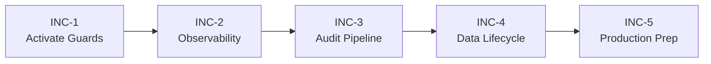

INC-1 and INC-2 can be worked in parallel as they have no dependencies on each other. INC-3 benefits from correlation IDs (INC-2) being in place. INC-4 and INC-5 are independent but logically follow the operational foundation.

---

## INC-1: Activate Existing Security Controls

### Goal

Wire existing but inactive security guards into the request pipeline so rate limiting and service-to-service authentication are enforced at runtime.

### Scope

#### 1.1 Apply ThrottlerGuard Globally

- Register `ThrottlerGuard` as a global guard in the API Gateway `AppModule`.
- Verify throttler configuration reads from `RATE_LIMIT_TTL` and `RATE_LIMIT_MAX` environment variables.
- Add `@SkipThrottle()` decorator to health check endpoints.

**Files affected:**

- `services/api-gateway/src/app.module.ts`

**Requirements traced:** SR-INPUT-001

#### 1.2 Activate Service-to-Service Auth

- Create a shared internal JWT signing key (`INTERNAL_SERVICE_SECRET`) in environment configuration.
- Apply `InternalServiceAuthGuard` to all internal-facing endpoints in downstream services.
- Add an HTTP interceptor in the API Gateway that attaches internal service JWT to outgoing requests.
- Verify that direct service access without the internal token returns 401.

**Files affected:**

- All service `app.module.ts` files
- API Gateway HTTP proxy/forwarding modules
- `docker-compose.yml` — add `INTERNAL_SERVICE_SECRET`

**Requirements traced:** SR-SVC-001, SR-SVC-002

### Acceptance Criteria

- [ ] Exceeding rate limit on any public endpoint returns HTTP 429.
- [ ] Direct HTTP call to a downstream service without internal token returns 401.
- [ ] Gateway-proxied calls succeed because the gateway attaches the internal token.
- [ ] Health check endpoints are exempt from rate limiting.

### Verification

| Test Type   | Scope                                                                 |
| ----------- | --------------------------------------------------------------------- |
| Manual      | Send 101 rapid requests to a public endpoint; verify 429 on the 101st |
| Manual      | Call downstream service directly without internal token; verify 401   |
| Integration | Gateway → downstream service call succeeds with internal token        |

---

## INC-2: Observability Foundation

### Goal

Establish cross-service observability so requests can be traced, logs are structured, and the platform is ready for production monitoring.

### Scope

#### 2.1 Correlation ID Middleware

- Add middleware to the API Gateway that generates a UUID `X-Request-Id` if not present in the incoming request.
- Propagate `X-Request-Id` to all outgoing HTTP calls to downstream services.
- Include `X-Request-Id` in all structured log entries in the gateway and downstream services.
- Include `X-Request-Id` in HTTP response headers.

**Files affected:**

- API Gateway middleware
- All service logging configuration
- HTTP proxy/forwarding modules

**Requirements traced:** OPS-TRACE-001

#### 2.2 Structured Logging

- Ensure all services emit JSON-structured log entries with fields: `timestamp`, `level`, `service`, `requestId`, `schoolId`, `message`.
- Replace console-based logging with structured logger where practical.

**Files affected:**

- All service logging setup

#### 2.3 OpenTelemetry Setup

- Configure OpenTelemetry NodeJS SDK with automatic HTTP instrumentation.
- Add OTLP exporter configuration (default to local Jaeger or console exporter for development).
- Add OpenTelemetry collector to `docker-compose.yml` for local development.

**Files affected:**

- New: `libs/tracing/` or service-level tracing bootstrap
- `docker-compose.yml` — add collector service

**Requirements traced:** NFR-OBS-001

### Acceptance Criteria

- [ ] Every response includes `X-Request-Id` header.
- [ ] Log entries across gateway and downstream services for the same request share the same `requestId`.
- [ ] OpenTelemetry traces appear in the local collector UI.

### Verification

| Test Type | Scope                                                                                           |
| --------- | ----------------------------------------------------------------------------------------------- |
| Manual    | Send request to gateway; verify `X-Request-Id` in response and in downstream service logs       |
| Manual    | Open Jaeger/collector UI; verify trace spans across gateway and at least one downstream service |

---

## INC-3: Centralized Audit Pipeline

### Goal

Deliver a cross-service audit trail where critical mutations from all services are captured, centralized, and queryable.

### Scope

#### 3.1 Audit Event Schema

Define a standard audit event payload:

```json
{
  "requestId": "uuid",
  "service": "api-gateway",
  "userId": "uuid",
  "schoolId": "uuid",
  "action": "CREATE",
  "resource": "route",
  "resourceId": "uuid",
  "timestamp": "ISO-8601",
  "details": {}
}
```

#### 3.2 Audit Event Emission

- Add audit event emission to critical mutation endpoints:
  - API Gateway: user creation, role changes, route CRUD, vehicle CRUD
  - Student Management: student enrollment, route assignment changes
  - Emergency Alerts: alert creation, status changes
  - Student Presence: manual presence overrides
  - Compliance Management: compliance record changes, inspection submissions

**Files affected:**

- Critical mutation handlers in all services

#### 3.3 Audit Event Consumer

- Create a BullMQ consumer (in compliance service or new audit module) that persists audit events to a dedicated audit table.
- Expose a query endpoint for audit log retrieval with filtering by service, resource, user, and time range.

**Files affected:**

- Compliance service or new audit module
- Database migration for centralized audit table

**Requirements traced:** OPS-AUDIT-001, SR-AUDIT-001

### Acceptance Criteria

- [ ] A route creation through the gateway produces a queryable audit record.
- [ ] Audit records include requestId for correlation with traces.
- [ ] Audit records from different services are stored in the same table and queryable together.
- [ ] Audit query endpoint supports filtering by service, resource type, and time range.

### Verification

| Test Type   | Scope                                                         |
| ----------- | ------------------------------------------------------------- |
| Integration | Create route → verify audit record exists with correct fields |
| Integration | Create alert → verify audit record exists                     |
| Query test  | Filter audit logs by service, resource, and time range        |

---

## INC-4: Data Lifecycle and Privacy

### Goal

Implement data retention schedules, purge jobs, and privacy-response workflows required by PIPEDA alignment.

### Scope

#### 4.1 Retention Configuration

Define retention configuration per data class:

| Data Class               | Retention                  | Action                |
| ------------------------ | -------------------------- | --------------------- |
| GPS location records     | 90 days                    | Purge                 |
| Emergency alert records  | 1 year                     | Archive to cold table |
| Presence events          | 90 days                    | Purge                 |
| Video metadata and files | 30 days                    | Purge                 |
| Audit logs               | 2 years                    | Archive               |
| Student records          | Active enrollment + 1 year | Anonymize             |

#### 4.2 Purge Jobs

- Implement scheduled BullMQ jobs for each data class.
- Run purge jobs on a configurable schedule (default: daily).
- Log purge actions to the audit trail.

**Files affected:**

- GPS Tracking: purge location_points older than threshold
- Emergency Alerts: archive alerts older than threshold
- Student Presence: purge events older than threshold
- Video Service: purge metadata and files older than threshold
- Compliance: archive audit logs older than threshold

#### 4.3 DSAR Workflow

- Implement a data subject access request endpoint that retrieves all personal data for a given parent or student.
- Implement a data deletion endpoint that removes personal data within SLA.
- Record DSAR fulfillment in the audit trail.

**Requirements traced:** PR-RET-001, PR-DEL-001, PR-ENC-001

### Acceptance Criteria

- [ ] GPS records older than 90 days are automatically purged.
- [ ] Purge job runs produce audit trail entries.
- [ ] DSAR endpoint returns all personal data for a student/parent.
- [ ] Data deletion endpoint removes personal data and logs the action.

### Verification

| Test Type          | Scope                                                         |
| ------------------ | ------------------------------------------------------------- |
| Scheduled job test | Insert old data → run purge job → verify data removed         |
| DSAR test          | Create test data → request DSAR → verify complete response    |
| Retention test     | Verify each data class has retention config and working purge |

---

## INC-5: Secret Management and Production Readiness

### Goal

Prepare the platform for production deployment by addressing remaining security and operational concerns.

### Scope

#### 5.1 Secret Management Planning

- Document the target secret management approach (Vault, cloud KMS, or managed secrets).
- Remove hardcoded secrets from docker-compose.yml and replace with `.env` file references.
- Add `.env.example` with placeholder values.

#### 5.2 CORS Hardening

- Ensure all services with HTTP endpoints validate CORS origins from configuration.
- Restrict allowed origins to configured values only.

#### 5.3 Production Deployment Checklist

- Create a production readiness checklist covering:
  - TLS termination
  - Database backup and restore procedures
  - Secret rotation procedures
  - Monitoring and alerting setup
  - Incident response readiness

**Requirements traced:** OPS-DEPLOY-002, NFR-DATA-001, OPS-RUN-001, OPS-BACKUP-001

### Acceptance Criteria

- [ ] No plaintext secrets in version-controlled configuration files.
- [ ] `.env.example` provides documented placeholder configuration.
- [ ] CORS origins are validated across all HTTP services.
- [ ] Production readiness checklist is documented and actionable.

### Verification

| Test Type            | Scope                                                     |
| -------------------- | --------------------------------------------------------- |
| Code review          | No hardcoded secrets in docker-compose.yml or source code |
| Manual               | Cross-origin request from unauthorized origin is rejected |
| Documentation review | Production checklist covers all operational requirements  |

---

## Backlog/GapAnalysis

_Source: `prd/Backlog/GapAnalysis.md`_

# SBTM v1 Post-Phase-5 Gap Analysis

- Document owner: Product and Engineering
- Last reviewed: 2026-03-26
- Primary use: Verified gap inventory between current implementation and v1 design/business targets after all five upgrade phases

## Purpose

This analysis reviews the implementation state **after completion of all five upgrade phases** against the revised v1 design in `docs/Design`, the business requirements in `docs/Business`, and the event catalog in `docs/Design/EventCatalog.md`. It identifies remaining deltas that prevent moving from the current state to a fully production-capable v1 platform.

## Related Documents

- [../GapAnalysis.md](../GapAnalysis.md) — Original pre-phase gap analysis
- [../PhaseWiseImplementationPlan.md](../PhaseWiseImplementationPlan.md) — Original phase plan
- [UpgradePlan.md](UpgradePlan.md) — New upgrade plan derived from this analysis
- [../../Design/Architecture.md](../Design/Architecture.md)
- [../../Design/SecurityPrivacyArchitecture.md](../Design/SecurityPrivacyArchitecture.md)
- [../../Design/EventCatalog.md](../Design/EventCatalog.md)
- [../../Business/Requirements.md](../Business/Requirements.md)
- [../../Business/Features.md](../Business/Features.md)

## Executive Summary

The five upgrade phases have materially advanced the platform. RLS policies are defined, service-to-service auth guards exist, rate limiting configuration is in place, and GPS event publishing with geofencing has been implemented. However, several Phase 5 deliverables remain partially implemented or are code-present-but-not-activated, and cross-cutting concerns like centralized audit, correlation IDs, data lifecycle, and production observability have not been delivered.

The remaining gaps cluster into three categories:

1. **Activation gaps** — Code exists but guards/middleware are not wired into request pipelines (rate limiting, service-to-service auth).
2. **Missing infrastructure** — Centralized audit pipeline, correlation ID propagation, OpenTelemetry exporters, and data retention jobs have no implementation.
3. **Documentation-to-implementation drift** — The upgrade plan and design docs describe these features as planned; the UpgradePlan phases still show status "Planned" despite partial completion.

## Gap Matrix (Post-Phase-5)

| Area                               | v1 Target                                                   | Current State                                                                            | Gap Level | Phase Origin |
| ---------------------------------- | ----------------------------------------------------------- | ---------------------------------------------------------------------------------------- | --------- | ------------ |
| Rate limiting activation           | Throttler guards applied to all public endpoints            | Package installed, config in docker-compose, guard not applied to controllers            | Medium    | Phase 5      |
| Service-to-service auth activation | Internal JWT/mTLS validated on all inter-service calls      | Guard file exists in student-management; not applied to endpoints in any service         | High      | Phase 5      |
| Centralized audit pipeline         | Cross-service audit events centrally queryable              | No consumer service, no cross-service event schema, compliance service logs locally only | High      | Phase 5      |
| Correlation ID propagation         | Requests traceable across service boundaries                | No HTTP interceptor or middleware propagating correlation headers                        | High      | Phase 5      |
| OpenTelemetry instrumentation      | Distributed tracing with span generation and export         | `@opentelemetry/api` package present; no exporter configuration or span code             | Medium    | Phase 5      |
| Data retention and purge           | Scheduled purge/archival by data class per retention matrix | No purge job code, no archival workflow                                                  | Medium    | Phase 5      |
| DSAR workflow                      | Data subject access requests fulfilled within 30 days       | Not implemented                                                                          | Medium    | Phase 5      |
| Secret management                  | Centralized secret management, no hardcoded secrets         | Secrets in docker-compose env vars; no vault or managed secret integration               | Medium    | Phase 5      |
| CORS origin validation             | All services validate CORS origins                          | Config present in docker-compose; not all services integrate it                          | Low       | Phase 5      |
| Notification service (end-to-end)  | Dedicated notification consumer for parent push/SMS/email   | Phase 1 scope — verify consumer is wired and delivering                                  | Verify    | Phase 1      |
| BLE scanning in driver app         | Expo BLE scanning producing SmartTag payloads               | Phase 2 scope — verify implementation completeness                                       | Verify    | Phase 2      |
| Route deviation alerting           | Deviation events produce downstream emergency alerts        | Phase 3 scope — verify consumer wiring                                                   | Verify    | Phase 3      |
| Tenant onboarding UI               | Full CRUD for boards/schools with invitation workflows      | Phase 4 scope — verify beyond listing pages                                              | Verify    | Phase 4      |
| Absence reporting                  | Parent reports absence affecting driver roster              | Phase 4 scope — verify endpoint and UI                                                   | Verify    | Phase 4      |

## Detailed Gap Analysis

### 1. Phase 5 Items Not Fully Delivered

#### 1.1 Rate Limiting Guard Not Applied

**Design requirement**: SR-INPUT-001 mandates input validation and rate limiting on public endpoints. `@nestjs/throttler` is installed and configured via environment variables (`RATE_LIMIT_TTL=60000`, `RATE_LIMIT_MAX=100`), but the `ThrottlerGuard` is not applied as a global guard or at controller level in any service.

**Impact**: Public API endpoints have no runtime rate limiting despite configuration existing. This is a security hardening gap.

**Recommendation**: Apply `ThrottlerGuard` globally in the API Gateway module.

#### 1.2 Service-to-Service Authentication Not Activated

**Design requirement**: SR-SVC-001 requires authenticated internal service calls. A guard file `internal-service-auth.guard.ts` exists in the student-management service, but it is not applied to any endpoint or used as middleware in any service.

**Impact**: Inter-service calls remain unauthenticated. Any network-accessible service can call any other without identity.

**Recommendation**:

- Generate a shared internal JWT signing key for service-to-service calls.
- Apply the auth guard to all internal endpoints across services.
- Add service identity headers to outgoing inter-service HTTP calls.

#### 1.3 Centralized Audit Pipeline Missing

**Design requirement**: OPS-AUDIT-001 requires critical mutations across all services to be auditable and centrally queryable. The compliance service logs locally, but there is no cross-service audit event schema, no BullMQ consumer for audit events, and no centralized audit storage.

**Impact**: Audit trail is fragmented. Critical mutations in GPS, presence, alerts, and gateway services are not captured in a unified audit log.

**Recommendation**:

- Define a standard audit event schema (action, resource, resourceId, userId, schoolId, timestamp, details).
- Add audit event emission to critical mutation endpoints across all services.
- Create a centralized audit consumer (or extend compliance service) to persist cross-service audit records.

#### 1.4 Correlation ID Propagation Missing

**Design requirement**: OPS-TRACE-001 requires requests to be traceable across service boundaries. The coding standards define fields `requestId`, `tenantId`, `userId`, `action`, but no HTTP interceptor or middleware propagates these headers between services.

**Impact**: Cross-service debugging requires manual log correlation. Incident investigation is slower and less reliable.

**Recommendation**:

- Add correlation ID middleware to the API Gateway that generates or propagates `X-Request-Id` headers.
- Propagate correlation headers in all outgoing HTTP calls from the gateway to downstream services.
- Include correlation ID in all structured log entries.

#### 1.5 OpenTelemetry Not Configured

**Design requirement**: NFR-OBS-001 requires logs, metrics, and traces sufficient to diagnose cross-service issues. `@opentelemetry/api` is installed but no exporter, tracer provider, or span instrumentation exists.

**Impact**: No distributed tracing capability. Production observability is limited to individual service logs.

**Recommendation**:

- Configure OpenTelemetry SDK with a tracer provider and exporter (Jaeger, Zipkin, or OTLP).
- Add automatic HTTP instrumentation for NestJS and Express services.
- Export traces to a local collector for development; plan for managed collector in production.

#### 1.6 Data Retention and Purge Not Implemented

**Design requirement**: PR-RET-001 requires data retained only as long as necessary. The DataRetention.md design document defines explicit retention periods (GPS 90 days, alerts 1 year, presence 90 days, video 30 days, audit 2 years), but no purge jobs, archival workflows, or deletion scheduling exists.

**Impact**: Data grows unbounded. Privacy compliance is not achievable for production deployment.

**Recommendation**:

- Implement scheduled purge jobs for each data class using cron or BullMQ scheduled jobs.
- Add archival support for audit logs and alert records.
- Implement DSAR workflow for personal data retrieval and deletion.

#### 1.7 Secret Management

**Design requirement**: Security architecture calls for separation of secrets from static configuration. Current implementation uses plaintext environment variables in docker-compose.yml.

**Impact**: Acceptable for local development, but not production-ready.

**Recommendation**: Plan integration with a secret management solution (HashiCorp Vault, AWS Secrets Manager, or similar) before production deployment.

### 2. Document-to-Implementation Drift

The following documents contain status or claims that need updating:

| Document                          | Issue                                                                                                           |
| --------------------------------- | --------------------------------------------------------------------------------------------------------------- |
| `docs/prd/UpgradePlan/README.md`  | All phases show status "Planned" — should reflect implementation status                                         |
| `docs/prd/UpgradePlan/Phase-*.md` | All five phases show status "Planned" — acceptance criteria should be checked                                   |
| `docs/prd/GapAnalysis.md`         | Gap matrix shows pre-implementation state — needs post-implementation update                                    |
| `docs/Business/Features.md`       | Feature status (Partial/Planned) needs update for delivered phases                                              |
| `docs/Design/EventCatalog.md`     | `location.updated` and `route.deviation` show "Implemented — Phase 3" but other events need status verification |
| `docs/UserGuide/*`                | Caveats about incomplete features need updating for delivered phases                                            |
| `docs/Demo/*`                     | ~~Scripts reference PowerShell (.ps1) — need updating for bash/Ubuntu~~ **RESOLVED**                            |
| `docs/Operations/*`               | ~~References to PowerShell scripts need updating~~ **RESOLVED**                                                 |

### 3. Cross-Cutting Concerns

#### 3.1 Development Environment — RESOLVED

Bash equivalents have been created for all scripts:

- `init-db.sh` (replaces `init-db.ps1`)
- `reset-demo-db.sh` (replaces `reset-demo-db.ps1`)
- `simulate-demo.sh` (replaces `simulate-demo.ps1`)
- `verify-demo.sh` (replaces `verify-demo.ps1`)

The `package.json` `db:init` script has been updated to use `bash ./scripts/init-db.sh`.
All documentation references have been updated from PowerShell to bash. The original `.ps1` files are retained for reference.

#### 3.2 Testing Infrastructure — RESOLVED

The testing guide has been expanded to include:

- Structured test pyramid documentation
- Test scenario index with IDs (UT01-UT12, IT01-IT08, SM01-SM08, AZ01-AZ05)
- Coverage requirements by component
- CI pipeline stage mapping
- Test data policy and mocking standards

## Recommendations Summary

| Priority | Gap                                | Effort | Requirement   |
| -------- | ---------------------------------- | ------ | ------------- |
| Critical | Centralized audit pipeline         | High   | OPS-AUDIT-001 |
| Critical | Correlation ID propagation         | Medium | OPS-TRACE-001 |
| High     | Service-to-service auth activation | Low    | SR-SVC-001    |
| High     | Rate limiting guard activation     | Low    | SR-INPUT-001  |
| Medium   | OpenTelemetry configuration        | Medium | NFR-OBS-001   |
| Medium   | Data retention/purge jobs          | High   | PR-RET-001    |
| Medium   | DSAR workflow                      | Medium | PR-DEL-001    |
| Medium   | Secret management planning         | Medium | NFR-DATA-001  |
| Low      | CORS integration across services   | Low    | SR-INPUT-001  |
