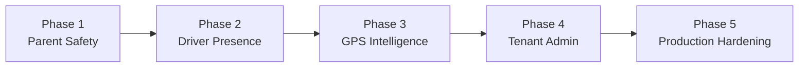

# Phase-Wise Implementation Plan (Revised v1)

- Document owner: Product and Engineering
- Last reviewed: 2026-03-30
- Primary use: Delivery sequencing summary and index for detailed phase plans

This is the summary index for the SBTM v1 upgrade plan. Each phase has a self-contained implementation plan in the [UpgradePlan/](UpgradePlan/) directory with full scope, acceptance criteria, verification, dependencies, and module cross-references.

## Related Documents

- [GapAnalysis.md](GapAnalysis.md)
- [UpgradePlan/README.md](UpgradePlan/README.md) — Phase plan index
- [../Business/Requirements.md](../Business/Requirements.md)
- [../Design/Architecture.md](../Design/Architecture.md)
- [../Design/TechnicalSpecifications.md](../Design/TechnicalSpecifications.md)
- [../Test/TestingGuide.md](../Test/TestingGuide.md)
- [../Demo/DEMO_SETUP_GUIDE.md](../Demo/DEMO_SETUP_GUIDE.md)

## Planning Principles

- Build on what already exists instead of reworking implemented foundations.
- Close end-to-end workflow gaps before adding deeper platform sophistication.
- Sequence producer and consumer work together so new event-driven features become usable immediately.
- Keep each phase independently demonstrable and testable.

## Phase Summary

| Phase                                                                                        | Goal                                                                                                                   | Gap Level | Detail                                                                      |
| -------------------------------------------------------------------------------------------- | ---------------------------------------------------------------------------------------------------------------------- | --------- | --------------------------------------------------------------------------- |
| **[Phase 1: Parent Safety Communication](UpgradePlan/Phase-1-ParentSafetyCommunication.md)** | Deliver end-to-end parent notification — event occurs, parent receives message in near real time, delivery is recorded | Critical  | Notification backbone, parent delivery workflows, SSE integration           |
| **[Phase 2: Driver Presence](UpgradePlan/Phase-2-DriverPresence.md)**                        | Make the driver app the authoritative presence-capture tool                                                            | High      | Roster-to-API wiring, BLE/SmartTag capture, route lifecycle state           |
| **[Phase 3: GPS Intelligence](UpgradePlan/Phase-3-GpsEventingGeofencing.md)**                | Turn GPS from passive tracking into an operational intelligence pipeline                                               | High      | Event publication, geofencing, deviation detection, real route optimization |
| **[Phase 4: Tenant Administration](UpgradePlan/Phase-4-TenantAdminProvisioning.md)**         | Operational multi-tenant onboarding without database seeding                                                           | Medium    | Org management, user provisioning, absence reporting, tenant dashboards     |
| **[Phase 5: Production Hardening](UpgradePlan/Phase-5-SecurityProductionHardening.md)**      | Enterprise security, audit, and compliance controls                                                                    | Medium    | RLS, service-to-service auth, centralized audit, data lifecycle             |

## Delivery Sequence

1. **Phase 1** — Unlocks the clearest business value: real parent alerts.
2. **Phase 2** — Makes field operations and presence data trustworthy.
3. **Phase 3** — Adds route intelligence atop stable eventing.
4. **Phase 4** — Enables real tenant onboarding after core workflows stabilize.
5. **Phase 5** — Hardens the platform for production readiness.

## Demo Impact by Phase

| After Phase | Demo Capability                                              |
| ----------- | ------------------------------------------------------------ |
| 1           | Real parent alerts instead of narrated future-state behavior |
| 2           | True boarding and alighting flows from the driver app        |
| 3           | Real route intelligence instead of placeholder optimization  |
| 4           | Live tenant and user onboarding                              |
| 5           | Credible production-readiness demonstration                  |
