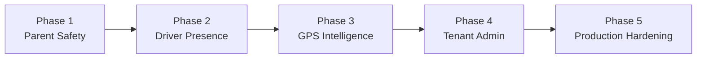

# Upgrade Plan

- Document owner: Product and Engineering
- Last reviewed: 2026-03-30
- Primary use: Index for the phase-wise upgrade from prototype to v1

## Overview

This directory contains self-contained implementation plans for each upgrade phase, derived from the [Gap Analysis](../GapAnalysis.md) and the [Phase-Wise Implementation Plan](../PhaseWiseImplementationPlan.md).

Each phase file includes scope, acceptance criteria, verification steps, and cross-references to the relevant implementation modules, design docs, and business requirements.

## Phase Index

| Phase                                             | Focus                                            | Gap Level | Status  |
| ------------------------------------------------- | ------------------------------------------------ | --------- | ------- |
| [Phase 1](Phase-1-ParentSafetyCommunication.md)   | Complete the Parent Safety Communication Loop    | Critical  | Planned |
| [Phase 2](Phase-2-DriverPresence.md)              | Finish the Driver Presence Workflow              | High      | Planned |
| [Phase 3](Phase-3-GpsEventingGeofencing.md)       | GPS Eventing, Geofencing, and Route Intelligence | High      | Planned |
| [Phase 4](Phase-4-TenantAdminProvisioning.md)     | Tenant Administration and User Provisioning      | Medium    | Planned |
| [Phase 5](Phase-5-SecurityProductionHardening.md) | Security, Compliance, and Production Hardening   | Medium    | Planned |

## Delivery Sequence

1. **Phase 1** unlocks the clearest business value — real parent alerts instead of narrated future-state.
2. **Phase 2** makes field operations and presence data trustworthy.
3. **Phase 3** adds route intelligence atop stable eventing.
4. **Phase 4** enables real tenant onboarding after core workflows are stable.
5. **Phase 5** hardens the platform for production readiness.

## Related Documents

- [../GapAnalysis.md](../GapAnalysis.md) — Verified gap inventory
- [../PhaseWiseImplementationPlan.md](../PhaseWiseImplementationPlan.md) — Summary plan
- [../../Business/Requirements.md](../../../Business/Requirements.md) — Business requirements
- [../../Design/Architecture.md](../../../Design/Architecture.md) — System architecture
