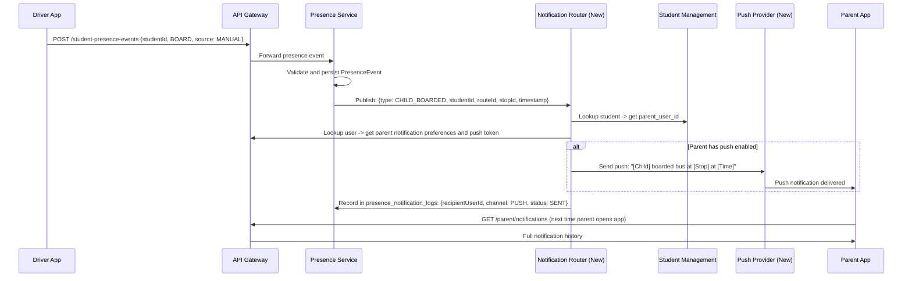

# SBTM v4 Alert Strategy

- Document owner: Product and Architecture
- Last reviewed: 2026-04-02
- Scope: Alert classification, audience routing, confirmation workflows, notification channels, and escalation
- Audience: AI Agents, Product Managers, Business Analysts, Development Team

## Related Documents

- [Gap Analysis](./GapAnalysis.md)
- [Roles and Workflows](./RolesAndWorkflows.md)
- [Business Requirements](../../Business/Requirements.md)
- [Event Catalog](../../Design/EventCatalog.md)
- [Emergency Alerts Module](../../Implementation/Module-4-EmergencyAlerts.md)

---

## 1. Alert Classification Model

All system events that require human attention are classified into three tiers based on audience and urgency.

### Tier 1: Safety Alerts (Admin + Parent)

Safety alerts are events that directly affect student safety and must reach both operational staff and parents.

| Event Type      | Source                                                  |     Auto-broadcast to Parents?      | Admin Confirmation Required? | Escalation                                                                             |
| --------------- | ------------------------------------------------------- | :---------------------------------: | :--------------------------: | -------------------------------------------------------------------------------------- |
| PANIC_BUTTON    | Driver triggers panic                                   | After confirmation or 2-min timeout |      Yes (School Admin)      | Auto-escalate to Board -> OSTA if unconfirmed                                          |
| MEDICAL         | Driver reports medical event                            |         After confirmation          |      Yes (School Admin)      | Same as PANIC                                                                          |
| INCIDENT        | Driver or system reports incident                       |         After confirmation          |      Yes (School Admin)      | Same as PANIC                                                                          |
| ROUTE_DEVIATION | GPS geofence service detects deviation beyond threshold |  No (admin-only unless escalated)   |     No (auto-generated)      | If deviation persists >5 min, School Admin notified. If >15 min, Board Admin notified. |

### Tier 2: Operational Alerts (Admin Only)

Operational alerts inform administrators about service status and compliance issues. Parents do not receive these.

| Event Type          | Source                                                           | Recipients                | Action Required                                |
| ------------------- | ---------------------------------------------------------------- | ------------------------- | ---------------------------------------------- |
| LATE_DEPARTURE      | Route not started within scheduled window                        | School Admin              | Investigate and contact driver                 |
| LATE_ARRIVAL        | Bus behind schedule by >10 min at any stop                       | School Admin              | Monitor, notify parents if >20 min             |
| ROUTE_DIVERSION     | Driver manually reports planned diversion                        | School Admin, Board Admin | Acknowledge and update route if needed         |
| COMPLIANCE_EXPIRING | Scheduled check: driver license/medical within 30 days of expiry | School Admin              | Contact driver, arrange renewal                |
| COMPLIANCE_EXPIRED  | Scheduled check: driver license/medical expired                  | School Admin, Board Admin | Suspend driver assignment until renewed        |
| INSPECTION_FAILED   | Pre-trip inspection failed                                       | School Admin              | Arrange maintenance or substitute vehicle      |
| VEHICLE_MAINTENANCE | Vehicle status changed to maintenance                            | School Admin              | Arrange substitute vehicle for affected routes |

### Tier 3: Informational Notifications (Parent-facing)

Informational notifications keep parents aware of their child's transport status. These are routine and not alarming.

| Event Type        | Source                                               | Recipients               | Delivery Channel                           |
| ----------------- | ---------------------------------------------------- | ------------------------ | ------------------------------------------ |
| CHILD_BOARDED     | Presence service: student board event                | Parent of specific child | Push notification                          |
| CHILD_ALIGHTED    | Presence service: student alight event               | Parent of specific child | Push notification                          |
| BUS_APPROACHING   | GPS + geofence: bus within X minutes of child's stop | Parent of specific child | Push notification                          |
| ROUTE_STARTED     | Driver starts route                                  | All parents on route     | Push notification (optional, configurable) |
| ROUTE_COMPLETED   | Driver ends route                                    | All parents on route     | Push notification (optional, configurable) |
| ABSENCE_CONFIRMED | School Admin confirms reported absence               | Reporting parent         | Push + in-app                              |
| ROUTE_CHANGE      | School Admin modifies route affecting child          | Affected parents         | Push + email                               |
| ETA_UPDATE        | Significant ETA change (>5 min) for child's stop     | Parent of specific child | Push notification                          |

### C4 Component Diagram: Alert Flow

```
[C4 Component]
title: Alert Processing Architecture

Component(driver_app, "Driver App", "Triggers panic, reports incidents")
Component(gps_service, "GPS Tracking", "Detects deviations, monitors geofences")
Component(presence_service, "Student Presence", "Board/alight events")
Component(compliance_service, "Compliance", "Expiry checks via scheduled jobs")

Component(alert_classifier, "Alert Classifier", "New: classifies event into Tier 1/2/3")
Component(confirmation_engine, "Confirmation Engine", "New: holds Tier 1 alerts for admin confirmation")
Component(notification_router, "Notification Router", "New: routes to correct audience via correct channel")

Component(push_provider, "Push Provider", "FCM/APNs")
Component(email_service, "Email Service", "SMTP/SES")
Component(sms_gateway, "SMS Gateway", "Twilio/SNS")
Component(websocket, "WebSocket", "Real-time admin UI")
Component(sse, "SSE Stream", "Real-time parent app")

driver_app --> alert_classifier : "PANIC, MEDICAL, INCIDENT"
gps_service --> alert_classifier : "ROUTE_DEVIATION, LATE_ARRIVAL"
presence_service --> notification_router : "CHILD_BOARDED, CHILD_ALIGHTED (Tier 3, direct)"
compliance_service --> notification_router : "COMPLIANCE_EXPIRING (Tier 2, direct)"

alert_classifier --> confirmation_engine : "Tier 1 events"
alert_classifier --> notification_router : "Tier 2 events (bypass confirmation)"

confirmation_engine --> notification_router : "After admin confirms or timeout"
notification_router --> websocket : "Admin alerts"
notification_router --> sse : "Parent in-app"
notification_router --> push_provider : "Parent push"
notification_router --> email_service : "Email delivery"
notification_router --> sms_gateway : "SMS escalation"
```

---

## 2. Confirmation and Escalation Rules

### Confirmation Workflow for Tier 1 (Safety) Alerts

```mermaid
statechart
    [*] --> TRIGGERED : Driver/system creates alert
    TRIGGERED --> PENDING_CONFIRMATION : School Admin notified
    PENDING_CONFIRMATION --> CONFIRMED : School Admin confirms (within 2 min)
    PENDING_CONFIRMATION --> AUTO_ESCALATED : 2-minute timeout
    CONFIRMED --> PARENT_NOTIFIED : System sends to parents
    AUTO_ESCALATED --> PARENT_NOTIFIED : System sends to parents + logs auto-escalation
    PARENT_NOTIFIED --> MONITORING : Admin monitoring situation
    MONITORING --> RESOLVED : Admin resolves with notes
    RESOLVED --> REPORT_GENERATED : Incident report created
    REPORT_GENERATED --> [*]
```

### Escalation Chain

| Time Since Alert | Action                                   | Recipients                                          |
| ---------------- | ---------------------------------------- | --------------------------------------------------- |
| 0 seconds        | Alert created                            | School Admin (immediate WebSocket + push)           |
| 0 seconds        | Informational copy                       | Board Admin, OSTA Admin (WebSocket only)            |
| 2 minutes        | If unconfirmed: auto-escalate to parents | Parents on affected route (push + SMS)              |
| 5 minutes        | If unacknowledged by School Admin        | Board Admin receives escalation (push + SMS)        |
| 15 minutes       | If unacknowledged by Board Admin         | OSTA Admin receives escalation (push + SMS + email) |
| 30 minutes       | If still unresolved                      | System marks as CRITICAL_UNRESOLVED in audit log    |

### Confirmation UI for School Admin

When a Tier 1 alert arrives, the School Admin sees a modal overlay:

```
EMERGENCY ALERT - Confirmation Required

Route: R01 - Bank Street South
Vehicle: BUS-01 (ON-1001)
Driver: John Smith
Time: 08:23 AM
Type: PANIC_BUTTON
Location: 45.3876, -75.6960 (Bank St & Glebe Ave)

Actions:
[Confirm and Notify Parents] - Broadcasts to all parents on route
[Confirm as False Alarm] - Records as false alarm, no parent notification
[Request More Information] - Contacts driver, extends timer by 2 min

Auto-escalation to parents in: 1:45
```

---

## 3. Notification Channel Strategy

### Channel Selection Rules

| Alert Tier             | Primary Channel   | Secondary Channel        | Emergency Fallback               |
| ---------------------- | ----------------- | ------------------------ | -------------------------------- |
| Tier 1 (Safety)        | Push notification | SMS                      | Email (if push + SMS both fail)  |
| Tier 2 (Operational)   | In-app WebSocket  | Email (daily digest)     | -                                |
| Tier 3 (Informational) | Push notification | In-app notification list | Email (weekly summary, optional) |

### Parent Notification Preferences

Parents can configure the following preferences per notification type:

| Setting                  | Options                                       | Default             |
| ------------------------ | --------------------------------------------- | ------------------- |
| Emergency alerts         | Always on (cannot disable)                    | Push + SMS          |
| Child boarding/alighting | Push / In-app only / Off                      | Push                |
| Bus approaching stop     | Push / Off                                    | Push                |
| Route start/complete     | Push / Off                                    | Off                 |
| Route changes            | Push + Email / Email only                     | Push + Email        |
| Daily summary            | Email / Off                                   | Off                 |
| Quiet hours              | Start time - End time                         | 9:00 PM - 6:00 AM   |
| Emergency override       | Always deliver emergencies during quiet hours | On (cannot disable) |

### Notification Message Templates

Emergency (Tier 1):

```
EMERGENCY: [EVENT_TYPE] on [ROUTE_NAME]
Bus [VEHICLE_ID] carrying [CHILD_NAME] has reported a [EVENT_TYPE] at [TIME].
Location: [ADDRESS_OR_COORDINATES]
School [SCHOOL_NAME] has been notified.
Updates will follow.
```

Child Boarded (Tier 3):

```
[CHILD_NAME] boarded bus [ROUTE_NAME] at [STOP_NAME] at [TIME].
```

Child Alighted (Tier 3):

```
[CHILD_NAME] has arrived. Alighted from bus [ROUTE_NAME] at [TIME].
```

Bus Approaching (Tier 3):

```
Bus [ROUTE_NAME] is approximately [X] minutes from [STOP_NAME].
```

---

## 4. Alert Visibility by Role

### What Each Role Sees

| Alert/Event         |    OSTA Admin     | Board Admin | School Admin |        Driver         |                 Parent                 |
| ------------------- | :---------------: | :---------: | :----------: | :-------------------: | :------------------------------------: |
| PANIC_BUTTON        | All (system-wide) |  Own board  |  Own school  | Own route (triggered) | Own child's route (after confirmation) |
| MEDICAL             |        All        |  Own board  |  Own school  |       Own route       | Own child's route (after confirmation) |
| ROUTE_DEVIATION     |        All        |  Own board  |  Own school  |           -           |          - (unless escalated)          |
| LATE_DEPARTURE      |        All        |  Own board  |  Own school  |           -           |                   -                    |
| LATE_ARRIVAL        |        All        |  Own board  |  Own school  |           -           |     Own child's route (if >20 min)     |
| COMPLIANCE_EXPIRING |        All        |  Own board  |  Own school  |      Own record       |                   -                    |
| INSPECTION_FAILED   |         -         |  Own board  |  Own school  |    Own inspection     |                   -                    |
| CHILD_BOARDED       |         -         |      -      |  Own school  |           -           |             Own child only             |
| CHILD_ALIGHTED      |         -         |      -      |  Own school  |           -           |             Own child only             |
| BUS_APPROACHING     |         -         |      -      |      -       |           -           |             Own child only             |
| ROUTE_CHANGE        |        All        |  Own board  |  Own school  |       Own route       |           Own child's route            |

### Alert Dashboard Views

**OSTA Admin**: System-wide alert dashboard with filters by board, school, alert type, severity, status. Aggregate statistics: total active alerts, average response time, false alarm rate.

**Board Admin**: Board-scoped alert list with school breakdown. Cross-school comparison: which schools have most alerts, slowest response times.

**School Admin**: School-specific alert management. Active alerts with confirmation action. Alert history with resolution notes. Performance metrics: response time, resolution time.

**Parent**: Personalized notification feed for linked children only. Emergency banner when active Tier 1 alert affects child's route. Notification history with read/unread status.

---

## 5. Presence-to-Notification Pipeline

Student boarding and alighting events must flow from the driver's app to the parent's device.



---

## 6. Alert Lifecycle and Audit

Every alert event and every notification delivery is recorded for audit purposes.

### Alert Event Log Structure

| Field            | Description                                                 |
| ---------------- | ----------------------------------------------------------- |
| alert_id         | Unique identifier of the alert                              |
| event_timestamp  | When the event occurred                                     |
| event_type       | CREATED, CONFIRMED, AUTO_ESCALATED, RESOLVED, REOPENED      |
| actor_user_id    | Who performed the action (driver, admin, system)            |
| actor_role       | Role of the actor                                           |
| notes            | Optional notes (resolution reason, false alarm explanation) |
| escalation_level | Current escalation level (SCHOOL, BOARD, OSTA)              |

### Notification Delivery Log Structure

| Field                         | Description                                              |
| ----------------------------- | -------------------------------------------------------- |
| notification_id               | Unique identifier                                        |
| alert_id or presence_event_id | Source event                                             |
| recipient_user_id             | Who the notification was sent to                         |
| channel                       | PUSH, EMAIL, SMS, IN_APP                                 |
| status                        | QUEUED, SENT, DELIVERED, FAILED, READ                    |
| sent_at                       | Timestamp of send attempt                                |
| delivered_at                  | Timestamp of delivery confirmation (from provider)       |
| read_at                       | Timestamp when user read/acknowledged (in-app only)      |
| failure_reason                | If FAILED, why (invalid token, number unreachable, etc.) |

---

## 7. Migration from Current Alert System

### Current State

The existing alert system supports:

- Emergency alert creation (PANIC_BUTTON, ROUTE_DEVIATION, INCIDENT, LATE_ARRIVAL, ROUTE_DIVERSION, OTHER)
- WebSocket broadcast to admin dashboard
- SSE stream available for parent app (partially wired)
- AlertNotificationLog table (PUSH/EMAIL/SMS channels defined but only PUSH status is logged)
- No actual push provider integration
- No confirmation workflow
- No alert classification or audience routing

### Migration Steps

1. **Introduce Alert Classifier**: New component between event source and notification pipeline. Classifies incoming events into Tier 1/2/3 based on event type. No breaking changes to existing alert creation API.

2. **Add Confirmation Engine**: New component for Tier 1 events. Holds alert in PENDING_CONFIRMATION state. Exposes confirmation API for School Admin. Implements timeout-based auto-escalation. Existing ACTIVE/RESOLVED states remain; PENDING_CONFIRMATION is added.

3. **Build Notification Router**: New service component. Reads recipient preferences. Selects delivery channel(s). Calls push provider, email service, or SMS gateway. Logs delivery status in existing AlertNotificationLog table (schema compatible). Existing WebSocket and SSE delivery remain as channels within the router.

4. **Integrate Push Provider**: FCM (Firebase Cloud Messaging) for cross-platform push. Parent app registers device token on login. Token stored in user profile. Notification Router sends via FCM SDK.

5. **Integrate Email and SMS**: Email via AWS SES or SMTP for non-urgent and summary notifications. SMS via Twilio or AWS SNS for emergency escalation. Both configured via environment variables.

6. **Add Presence-to-Notification Pipeline**: Presence Service publishes events to BullMQ. Notification Router consumes and routes to parents. Uses existing PresenceNotificationLog table.

7. **Deploy Parent Preference UI**: Settings page in Parent App with notification preferences. Preferences persisted in user profile (new fields on User entity).
