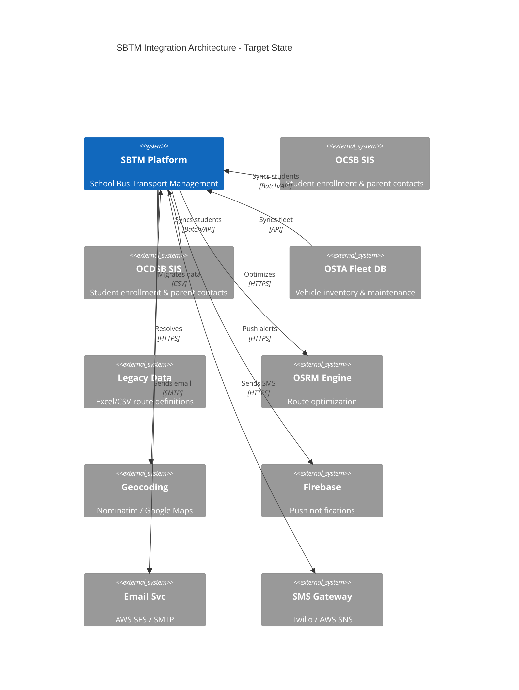
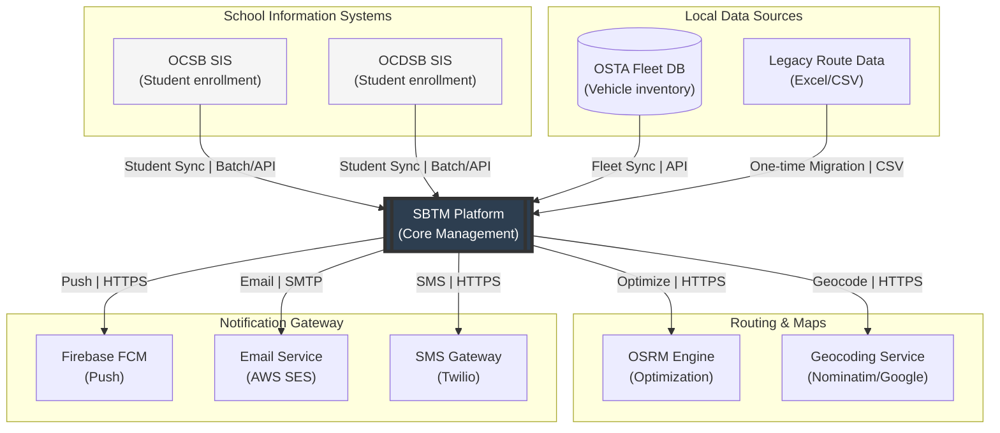
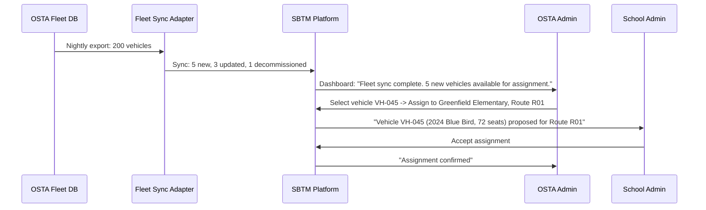
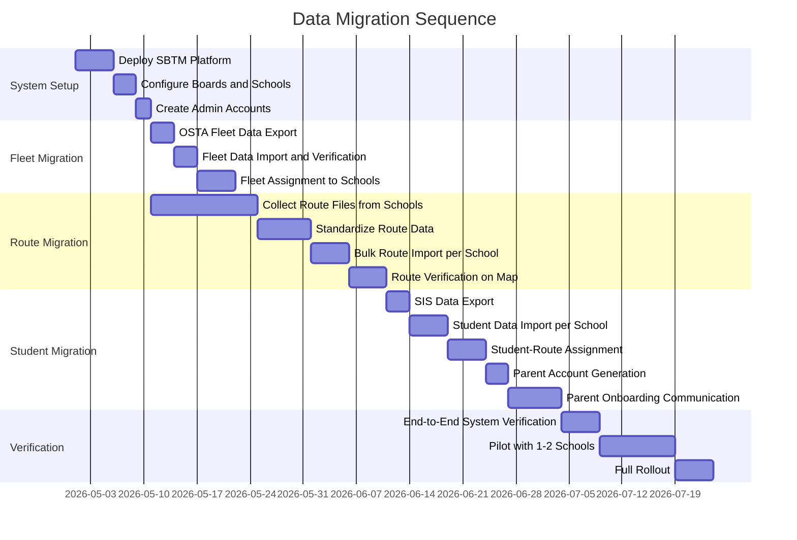

# SBTM v4 Integration and Data Migration Strategy

- Document owner: Product and Architecture
- Last reviewed: 2026-04-02
- Scope: External system integration, data migration from legacy systems, bulk import/export capabilities
- Audience: AI Agents, Product Managers, Integration Engineers, Development Team

## Related Documents

- [Gap Analysis](./GapAnalysis.md)
- [Roles and Workflows](./RolesAndWorkflows.md)
- [Alert Strategy](./AlertStrategy.md)
- [Business Requirements](../../Business/Requirements.md)
- [API Reference](../../Reference/APIReference.md)
- [Service Contracts](../../Reference/ServiceContracts.md)

---

## 1. Integration Landscape

### C4 Context Diagram: Target Integration Architecture



Mermaid version of diagram



---

## 2. Student Information System (SIS) Integration

### 2.1 Problem Statement

Schools already maintain student enrollment data in their Student Information Systems (OCSB and OCDSB each have their own SIS). Currently, school admins must manually re-enter or CSV-import student data into SBTM. This creates duplicate data entry, risk of inconsistency, and a maintenance burden that grows with student count.

### 2.2 Integration Options

#### Option A: Batch File Sync (Recommended for Initial Rollout)

This is the simplest approach that works with any SIS that can export data.

```
Flow: SIS Batch Sync

1. SIS exports student data as CSV/XML on a scheduled basis (nightly or on-demand)
2. Export file is placed in a secure shared location (SFTP server or cloud storage)
3. SBTM Integration Adapter reads the file on schedule or when triggered
4. Adapter maps SIS fields to SBTM student model using board-specific mapping configuration
5. Adapter compares with current SBTM data:
   - New students -> Create enrollment records
   - Changed students -> Update records (name change, grade change, address change)
   - Missing students -> Flag for review (not auto-deleted)
6. Preview report generated for School Admin review
7. School Admin approves import -> Changes applied
8. Audit trail records all changes with source: "SIS_SYNC"
```

Field Mapping Configuration (per board):

| SIS Field (Example) | SBTM Field                         | Transformation                                          | Required |
| ------------------- | ---------------------------------- | ------------------------------------------------------- | -------- |
| `StudentNumber`     | `external_student_id`              | Direct map                                              | Yes      |
| `FirstName`         | `first_name`                       | Direct map                                              | Yes      |
| `LastName`          | `last_name`                        | Direct map                                              | Yes      |
| `Grade`             | `grade`                            | Normalize (e.g., "JK" -> "JK", "1" -> "1")              | Yes      |
| `HomeAddress`       | `address`                          | Concatenate address fields                              | Yes      |
| `ParentEmail`       | (used for parent account creation) | Validate email format                                   | No       |
| `ParentPhone`       | (used for parent account creation) | Validate phone format                                   | No       |
| `SchoolCode`        | `school_id`                        | Lookup school by external code                          | Yes      |
| `Status`            | `status`                           | Map: "Active" -> "ENROLLED", "Withdrawn" -> "WITHDRAWN" | Yes      |

Conflict Resolution Rules:

| Scenario                                             | Rule                                                             |
| ---------------------------------------------------- | ---------------------------------------------------------------- |
| Student exists in SIS but not in SBTM                | Create new student record. Do not auto-assign to route.          |
| Student exists in SBTM but not in SIS export         | Flag for review. School Admin decides to keep or withdraw.       |
| Student name changed                                 | Update name. Flag for School Admin review.                       |
| Student address changed                              | Update address. Flag for route reassignment review.              |
| Student grade changed                                | Update grade. May affect route eligibility.                      |
| Student transferred to different school (same board) | Flag as transfer. Both source and target School Admins notified. |
| Duplicate external_student_id                        | Reject import for that record. Alert School Admin.               |

#### Option B: API-Based Real-Time Sync (Future Enhancement)

For boards whose SIS provides REST or SOAP APIs, SBTM can integrate in near-real-time.

```
Flow: SIS API Sync

1. SIS publishes webhook or SBTM polls SIS API at configurable interval (e.g., every 4 hours)
2. SBTM Integration Adapter calls SIS API with "changes since" timestamp
3. Adapter processes changes using same field mapping and conflict resolution as batch
4. No School Admin approval step for routine updates (name, grade)
5. New enrollments and withdrawals still require School Admin review
6. Audit trail records all changes with source: "SIS_API_SYNC"
```

This requires SIS vendor cooperation to provide API access and is recommended only after the batch sync is proven stable.

### 2.3 Parent Account Auto-Provisioning from SIS

When student data includes parent contact information:

1. System extracts parent email and phone from SIS data
2. If parent account does not exist for that email, system creates an account in PENDING state
3. System sends invitation email to parent with activation link
4. Parent activates account, sets password, accepts consent
5. System links parent to child record via `parent_user_id`
6. If parent already exists (e.g., sibling already enrolled), system adds new child to existing parent account

---

## 3. OSTA Fleet Management Integration

### 3.1 Problem Statement

OSTA already maintains a fleet database with vehicle inventory, ownership, licensing, maintenance schedules, and insurance records. The current SBTM system requires manual re-creation of vehicle records, leading to data duplication and inconsistency.

### 3.2 Integration Design

#### One-Way Sync: OSTA Fleet DB as Source of Truth

```
Flow: Fleet Sync

1. OSTA Fleet DB exports vehicle data (CSV, database view, or API)
2. SBTM Fleet Sync Adapter reads vehicle data on schedule or trigger
3. Adapter maps OSTA fleet fields to SBTM vehicle model:
   - Vehicle ID (OSTA internal) -> external_vehicle_id (new field on Vehicle entity)
   - License plate -> licensePlate
   - Vehicle type/capacity -> capacity (new field)
   - Status -> status (map OSTA statuses to ACTIVE/MAINTENANCE/INACTIVE)
   - Safety certification expiry -> linked to compliance records
4. For new vehicles: Create in SBTM, unassigned to any school
5. For changed vehicles: Update status, plates, capacity
6. For decommissioned vehicles: Mark as INACTIVE in SBTM
7. OSTA Admin assigns synced vehicles to schools/routes through existing workflow
```

Vehicle Entity Extensions (new fields needed):

| Field                 | Type      | Description                                   |
| --------------------- | --------- | --------------------------------------------- |
| `external_vehicle_id` | String    | ID from OSTA fleet system (for sync matching) |
| `capacity`            | Integer   | Passenger capacity                            |
| `vehicle_type`        | Enum      | FULL_SIZE, MINI_BUS, WHEELCHAIR_ACCESSIBLE    |
| `year`                | Integer   | Vehicle manufacture year                      |
| `make_model`          | String    | Vehicle make and model                        |
| `insurance_expiry`    | Date      | Insurance expiration date                     |
| `safety_cert_expiry`  | Date      | Safety certification expiration date          |
| `last_synced_at`      | Timestamp | Last fleet sync timestamp                     |
| `sync_source`         | String    | "OSTA_FLEET" or "MANUAL"                      |

#### Two-Way Sync (Future Enhancement)

For bidirectional sync, SBTM writes assignment status back to OSTA fleet system:

- Vehicle assigned to school -> update OSTA fleet record with school assignment
- Vehicle maintenance reported in SBTM -> update OSTA fleet status
- Requires API access to OSTA fleet system for write operations

### 3.3 Fleet Assignment with Synced Data



---

## 4. Legacy Route Data Migration

### 4.1 Problem Statement

Schools and OSTA have existing route definitions stored in Excel spreadsheets, PDF documents, or legacy transportation software. Migrating hundreds of routes manually through the route planner UI is impractical.

### 4.2 Route Import Wizard

The system provides a multi-step import wizard for bulk route creation from Excel or CSV files.

#### Step 1: Upload and Template Selection

Admin uploads Excel/CSV file. System provides downloadable template:

```csv
route_name,direction,start_time,estimated_duration_min,vehicle_id,stop_sequence,stop_address,stop_lat,stop_lng,stop_arrival_time
Bank Street South,AM,07:15,45,,1,123 Bank St Ottawa ON,,,07:15
Bank Street South,AM,07:15,45,,2,456 Gladstone Ave Ottawa ON,,,07:22
Bank Street South,AM,07:15,45,,3,789 Bronson Ave Ottawa ON,,,07:30
```

Rules:

- `route_name` + `direction` together identify a unique route
- If `stop_lat`/`stop_lng` are empty, system geocodes the address
- If `vehicle_id` is empty, vehicle assignment is deferred
- `stop_arrival_time` is optional; system can calculate based on OSRM if omitted

#### Step 2: Validation and Geocoding

```
Flow: Route Import Validation

1. Parse file and group rows by route_name + direction
2. For each route:
   a. Validate required fields (name, direction, at least 2 stops)
   b. Geocode addresses without coordinates (via Nominatim or geocoding service)
   c. Validate coordinates are within service region (Ottawa area bounding box)
   d. Check for duplicate route names within same school
3. For each stop:
   a. Validate address format
   b. Validate or generate coordinates
   c. Validate stop sequence is contiguous (1, 2, 3, ...)
4. Generate validation report:
   - Routes ready to create: N
   - Routes with warnings (missing coords, duplicate names): N
   - Routes with errors (invalid data, missing required fields): N
   - Addresses that could not be geocoded: list
```

#### Step 3: Preview and Correction

Admin reviews validated data on a map:

- Each route shown on map with stops and proposed polyline
- Stops with geocoded addresses highlighted for verification
- Admin can drag-and-drop stops to correct placement
- Admin can edit route details (name, times) inline
- Routes with errors must be fixed or excluded before proceeding

#### Step 4: OSRM Polyline Generation

For each validated route:

1. Submit stop coordinates to OSRM `/route/v1/driving/` endpoint
2. Receive road-following polyline and stop-to-stop distances/durations
3. Store encoded polyline with route record
4. Calculate estimated duration if not provided

#### Step 5: Commit

Admin confirms import. System creates all routes and stops in a single transaction. Audit log records bulk import with source file reference and route count.

### 4.3 Data Migration Checklist for Excel Routes

| Step | Action                                        | Who                            | How                                                |
| ---- | --------------------------------------------- | ------------------------------ | -------------------------------------------------- |
| 1    | Collect all existing route files from schools | School Admin                   | Gather Excel/PDF files                             |
| 2    | Standardize into import template format       | School Admin (with IT support) | Use provided Excel template                        |
| 3    | Verify addresses are valid Canadian format    | School Admin                   | Manual review + geocoder validation                |
| 4    | Verify stop sequences and timing              | School Admin                   | Cross-reference with current schedules             |
| 5    | Upload to SBTM import wizard                  | School Admin                   | Admin Dashboard -> Routes -> Import                |
| 6    | Review validation report                      | School Admin                   | Fix errors, verify geocoded locations on map       |
| 7    | Generate OSRM polylines                       | System (automated)             | System calls OSRM for each route                   |
| 8    | Preview and confirm                           | School Admin                   | Verify routes on map, commit import                |
| 9    | Assign vehicles to imported routes            | School Admin / OSTA Admin      | Use fleet assignment workflow                      |
| 10   | Assign students to imported routes            | School Admin                   | Use student-route assignment or bulk CSV           |
| 11   | Verify complete data                          | School Admin                   | Cross-check route count, stop count, student count |

---

## 5. Address Geocoding Service Integration

### 5.1 Problem Statement

Creating stops currently requires manual latitude/longitude entry. This is impractical for non-technical users and error-prone.

### 5.2 Geocoding Integration Design

#### Option A: Self-Hosted Nominatim (Recommended for Privacy)

Nominatim is the OpenStreetMap geocoding engine. Self-hosting ensures student address data never leaves the organization's infrastructure (PIPEDA/MFIPPA compliance).

- Deploy Nominatim Docker container with Canada/Ontario data extract
- Endpoint: `GET /search?q=123+Bank+St+Ottawa+ON&format=json&countrycodes=ca`
- Returns latitude, longitude, display name, bounding box
- Reverse geocoding: `GET /reverse?lat=45.3876&lon=-75.6960&format=json`

#### Option B: Google Maps / Mapbox Geocoding API (Alternative)

If self-hosted Nominatim is insufficient:

- Higher geocoding accuracy for Canadian addresses
- Requires API key and usage-based billing
- Student address data is sent to external service (privacy consideration)
- Must be approved by privacy assessment before use with student data

### 5.3 Geocoding in UI Workflows

**Stop Creation**: Admin types address in search box -> System geocodes in real-time -> Suggestions shown as dropdown -> Admin selects correct match -> Map pin placed at location -> Admin can fine-tune by dragging pin.

**Bulk Import**: For stops without coordinates, system batch-geocodes all addresses during validation step.

**Student Address Geocoding**: When a student address is entered or imported, system geocodes to determine nearest route stops for assignment suggestions.

---

## 6. Data Export and Reporting

### 6.1 Export Capabilities (New)

| Data Set               | Export Formats      | Available To                          | Use Case                                     |
| ---------------------- | ------------------- | ------------------------------------- | -------------------------------------------- |
| Student List           | CSV, PDF            | School Admin, Board Admin, OSTA Admin | School records, regulatory submission        |
| Route Plan             | CSV, PDF (with map) | School Admin, Board Admin             | Route planning documentation, board approval |
| Presence Records       | CSV                 | School Admin, Board Admin             | Attendance reporting, safety audit           |
| Alert History          | CSV, PDF            | School Admin, Board Admin, OSTA Admin | Incident reporting, safety review            |
| Compliance Summary     | CSV, PDF            | School Admin, Board Admin, OSTA Admin | Regulatory compliance reporting              |
| Vehicle Inspection Log | CSV, PDF            | School Admin, Board Admin             | Maintenance records, safety audit            |
| Audit Trail            | CSV                 | OSTA Admin                            | Regulatory audit, investigation              |
| Parent Contact List    | CSV                 | School Admin                          | Emergency contact reference                  |

### 6.2 Scheduled Reports (New)

| Report                    | Frequency                 | Recipients                | Content                                                                       |
| ------------------------- | ------------------------- | ------------------------- | ----------------------------------------------------------------------------- |
| Daily Operations Summary  | Daily (end of operations) | School Admin              | Routes completed, presence stats, alerts, late arrivals                       |
| Weekly Compliance Status  | Weekly (Monday morning)   | Board Admin, School Admin | Expiring credentials, overdue inspections, compliance rate                    |
| Monthly Fleet Utilization | Monthly (1st of month)    | OSTA Admin, Board Admin   | Vehicle usage, maintenance frequency, downtime                                |
| Annual Safety Report      | Annually                  | OSTA Admin                | Alert statistics, incident summary, presence compliance, inspection pass rate |

---

## 7. Notification Delivery Integration

### 7.1 Push Notification (FCM)

Integration with Firebase Cloud Messaging for cross-platform push delivery:

```
Setup:
1. Create Firebase project for SBTM
2. Configure FCM in driver app (Android/iOS via Expo)
3. Configure FCM in parent app (web push via service worker)
4. Store FCM server key in SBTM environment configuration
5. On user login, register device token with SBTM (new API: POST /devices/register)
6. Notification Router sends via FCM Admin SDK

Token Management:
- Tokens stored per user (user can have multiple devices)
- Token refreshed on each app launch
- Stale tokens cleaned up when FCM returns "not registered" error
```

### 7.2 Email (AWS SES / SMTP)

```
Setup:
1. Configure SMTP connection or AWS SES credentials in environment
2. Verify sender domain (e.g., notifications@sbtm-osta.ca)
3. Create email templates for each notification type (HTML + plain text)
4. Configure rate limits per environment

Use Cases:
- Parent invitation emails
- Route change notifications
- Weekly/monthly reports
- Non-urgent compliance reminders
- Alert summary (daily digest)
```

### 7.3 SMS (Twilio / AWS SNS)

```
Setup:
1. Configure Twilio account SID and auth token (or AWS SNS credentials)
2. Purchase or configure sender phone number with Canadian regulations (CASL compliance)
3. Configure SMS templates (160 char limit for standard SMS)
4. Set up delivery status webhooks

Use Cases:
- Emergency alert escalation (Tier 1 only)
- Two-factor authentication (future)
- Parent account activation (alternative to email)

Rate Limits:
- Emergency SMS: No rate limit (safety-critical)
- Routine SMS: Max 5 per user per day
```

---

## 8. Migration Planning Summary

### Pre-Migration Activities

| Activity                                        | Owner                 | Duration Estimate | Dependencies            |
| ----------------------------------------------- | --------------------- | ----------------- | ----------------------- |
| Collect route data from all schools (Excel/PDF) | School Admins         | 2-4 weeks         | School cooperation      |
| Standardize route data into import template     | School Admins + IT    | 1-2 weeks         | Template availability   |
| Collect student data from SIS                   | Board IT              | 1 week            | SIS export access       |
| Collect fleet data from OSTA                    | OSTA IT               | 1 week            | Fleet DB access         |
| Configure field mapping per board               | SBTM Development Team | 1 week            | Sample data from boards |
| Set up geocoding service                        | SBTM Development Team | 1 week            | Infrastructure          |
| Set up notification services (FCM/email/SMS)    | SBTM Development Team | 2 weeks           | Service accounts        |

### Migration Sequence



### Post-Migration Verification Checklist

| Check                                          | Expected Result                               | Who Verifies |
| ---------------------------------------------- | --------------------------------------------- | ------------ |
| All school boards created                      | Count matches expected boards                 | OSTA Admin   |
| All schools created under correct boards       | Count and board assignment correct            | Board Admin  |
| All vehicles imported                          | Count matches OSTA fleet DB                   | OSTA Admin   |
| All routes imported per school                 | Count matches legacy data                     | School Admin |
| Route polylines render correctly on map        | Visual verification                           | School Admin |
| Stop locations are accurate on map             | Visual verification against known addresses   | School Admin |
| All students imported per school               | Count matches SIS data                        | School Admin |
| Students assigned to correct routes and stops  | Spot-check 10% of students                    | School Admin |
| Parent accounts generated                      | Count matches unique parent emails            | School Admin |
| Parent invitation emails delivered             | Check email delivery logs                     | SBTM Admin   |
| Driver accounts created and assigned to routes | Each route has a driver                       | School Admin |
| Notification services operational              | Send test push, email, SMS                    | SBTM Admin   |
| GPS tracking operational                       | Simulate bus location, verify on dashboard    | SBTM Admin   |
| Alert workflow operational                     | Trigger test alert, verify notification chain | School Admin |
