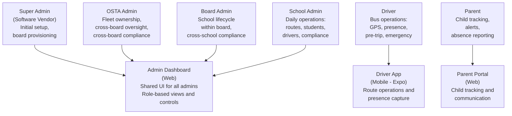
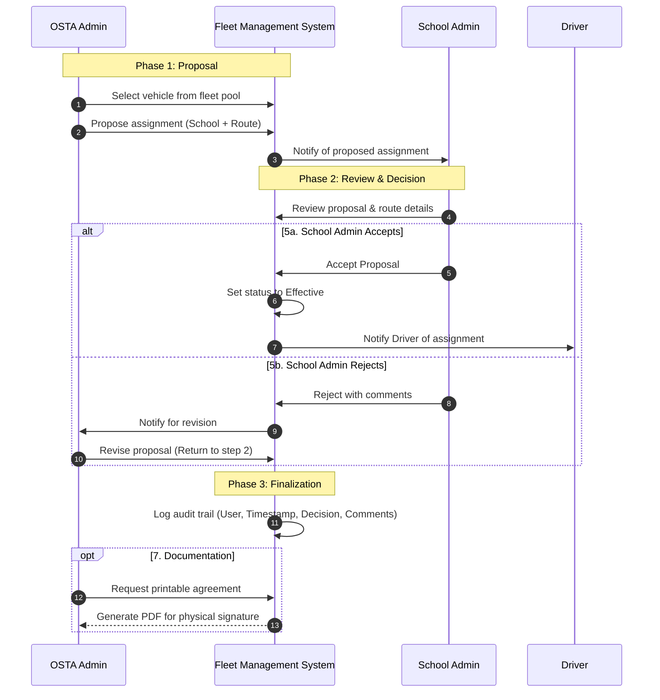
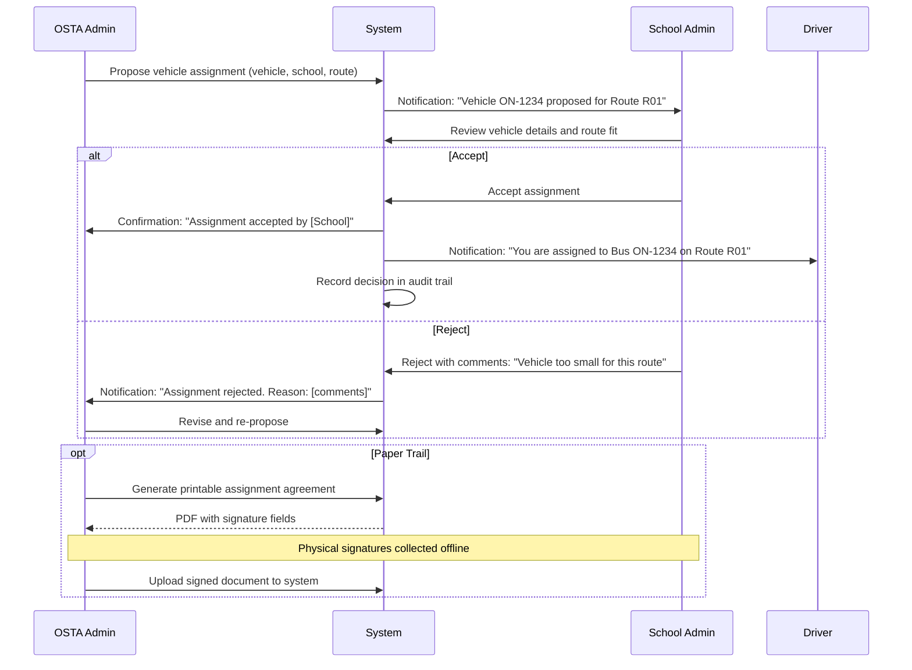
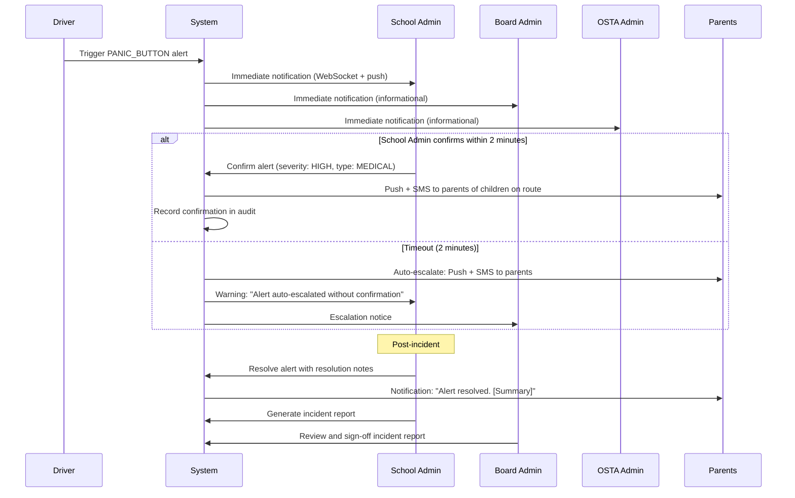
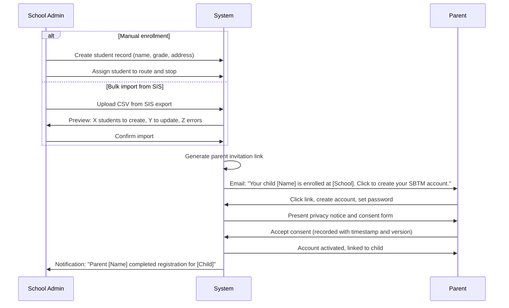
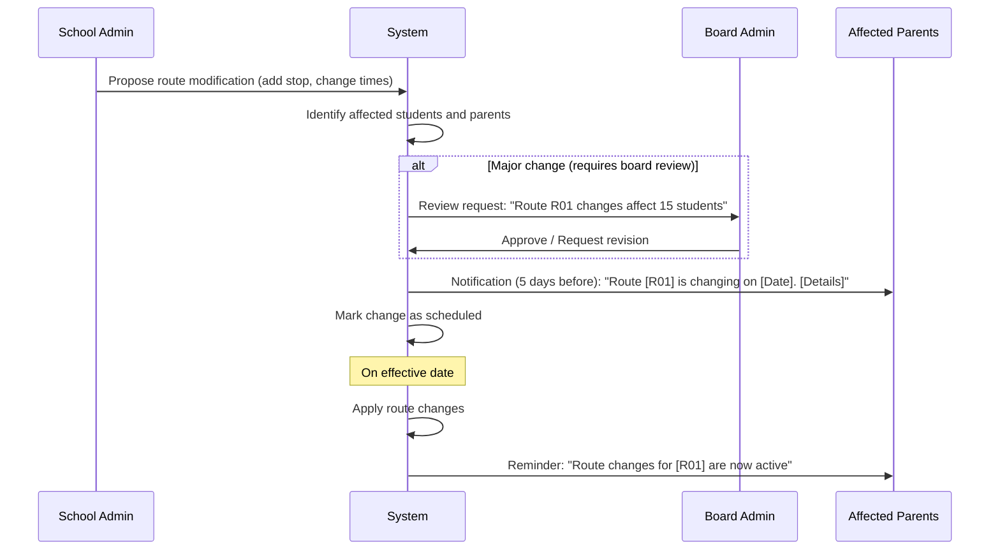
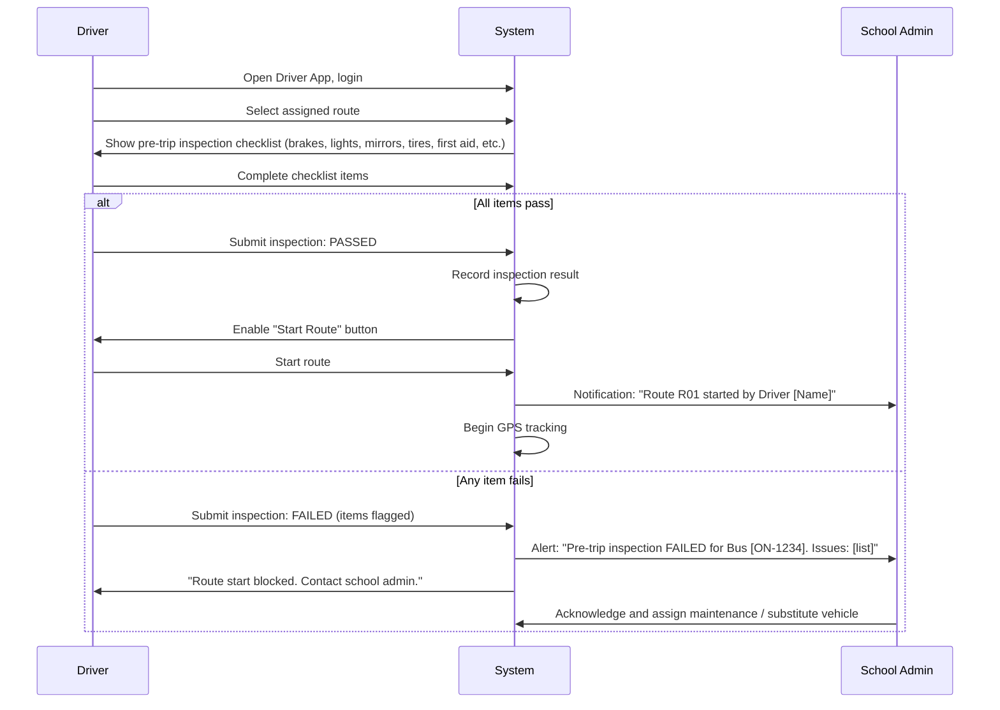
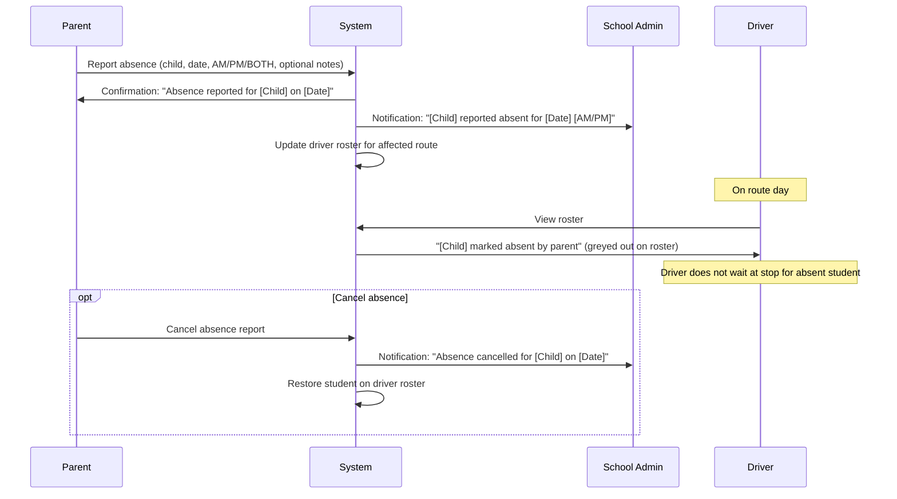

# SBTM v4 Roles, Responsibilities and Workflows

- Document owner: Product and Architecture
- Last reviewed: 2026-04-02
- Scope: Complete role model, responsibility matrix, coordination workflows, and approval chains
- Audience: AI Agents, Product Managers, Business Analysts, Development Team

## Related Documents

- [Gap Analysis](./GapAnalysis.md)
- [Alert Strategy](./AlertStrategy.md)
- [Integration and Migration](./IntegrationAndMigration.md)
- [Business Requirements](../../Business/Requirements.md)
- [Use Cases](../../Business/UseCases.md)

---

## 1. Role Hierarchy and Scope

### SBTM Role Access Model

### Role Definitions

| Role                          | Scope        | Access Level                                 | Primary Application | Tenant Boundary                  |
| ----------------------------- | ------------ | -------------------------------------------- | ------------------- | -------------------------------- |
| **Super Admin** (New)         | System-wide  | Full platform configuration                  | Admin Dashboard     | None (system-level)              |
| **OSTA Admin**                | Cross-board  | Fleet, oversight, system compliance          | Admin Dashboard     | All boards, all schools          |
| **Board Admin** (OCSB, OCDSB) | Board-level  | Schools, cross-school oversight within board | Admin Dashboard     | Own board and all schools within |
| **School Admin**              | School-level | Students, routes, daily operations           | Admin Dashboard     | Own school only                  |
| **Driver**                    | Route-level  | Route execution, presence, emergency         | Driver App          | Assigned routes only             |
| **Parent**                    | Child-level  | Child tracking, alerts, absence              | Parent Portal       | Linked children's routes only    |

---

## 2. Responsibility Matrix (RACI)

Legend: **R** = Responsible (does the work), **A** = Accountable (ultimate owner), **C** = Consulted (input before decision), **I** = Informed (notified after)

### System Setup and Configuration

| Activity                                     | Super Admin | OSTA Admin | Board Admin | School Admin | Driver | Parent |
| -------------------------------------------- | :---------: | :--------: | :---------: | :----------: | :----: | :----: |
| Initial platform deployment                  |    R, A     |     I      |      -      |      -       |   -    |   -    |
| Configure system settings (timezone, region) |    R, A     |     C      |      -      |      -       |   -    |   -    |
| Create / manage school boards                |      R      |    A, C    |      I      |      -       |   -    |   -    |
| Create initial OSTA Admin account            |    R, A     |     -      |      -      |      -       |   -    |   -    |
| Platform version upgrades                    |    R, A     |     I      |      I      |      I       |   -    |   -    |

After initial setup, the Super Admin role is used only for platform maintenance and major configuration changes. Day-to-day operations are handled by OSTA Admin and below.

### Organization Management

| Activity                                         | Super Admin | OSTA Admin | Board Admin | School Admin | Driver | Parent |
| ------------------------------------------------ | :---------: | :--------: | :---------: | :----------: | :----: | :----: |
| Create / modify school board                     |      -      |    R, A    |      I      |      -       |   -    |   -    |
| Deactivate school board                          |      -      |    R, A    |      C      |      I       |   -    |   -    |
| Create / modify school within board              |      -      |     C      |    R, A     |      I       |   -    |   -    |
| Deactivate school                                |      -      |     I      |    R, A     |      C       |   -    |   -    |
| Configure school settings (bell times, calendar) |      -      |     -      |      C      |     R, A     |   -    |   I    |
| Manage academic calendar and holidays            |      -      |     I      |    R, A     |      C       |   I    |   I    |

### Fleet and Vehicle Management

| Activity                                            | Super Admin | OSTA Admin | Board Admin |  School Admin  | Driver | Parent |
| --------------------------------------------------- | :---------: | :--------: | :---------: | :------------: | :----: | :----: |
| Add / register vehicle in fleet                     |      -      |    R, A    |      I      |       I        |   -    |   -    |
| Update vehicle status (active/maintenance/inactive) |      -      |    R, A    |      I      |       C        |   I    |   -    |
| Assign vehicle to school                            |      -      |    R, A    |      C      |       C        |   -    |   -    |
| Assign vehicle to route                             |      -      |     A      |      I      |      R, C      |   I    |   -    |
| Remove vehicle from fleet                           |      -      |    R, A    |      I      |       I        |   -    |   -    |
| View fleet dashboard (all vehicles)                 |      -      |     R      |      R      | R (own school) |   -    |   -    |

Fleet Assignment Workflow (OSTA assigns to school and route in consultation with School Admin):

### Route and Stop Management

| Activity                                        | Super Admin | OSTA Admin |      Board Admin       | School Admin | Driver |        Parent        |
| ----------------------------------------------- | :---------: | :--------: | :--------------------: | :----------: | :----: | :------------------: |
| Create new route                                |      -      |     C      |           C            |     R, A     |   -    |          -           |
| Modify route (stops, timing, path)              |      -      |     I      | I (if policy impacted) |     R, A     |   I    | I (affected parents) |
| Delete route                                    |      -      |     I      |           C            |     R, A     |   I    |          I           |
| Add / remove / modify stops                     |      -      |     -      |           -            |     R, A     |   I    | I (affected parents) |
| Optimize route stop ordering                    |      -      |     -      |           -            |     R, A     |   -    |          -           |
| Bulk import routes from Excel/CSV               |      -      |     I      |           C            |     R, A     |   -    |          -           |
| Clone previous year routes                      |      -      |     -      |           C            |     R, A     |   -    |          -           |
| Review and approve route changes at board level |      -      |     -      |          R, A          |      C       |   -    |          -           |

Route Change Notification Rules:

- **Major changes** (new route, route cancellation, stop removal): School Admin proposes -> Board Admin approves (if policy requires) -> Parents of affected students notified 5 business days before effective date.
- **Minor changes** (time adjustment <10 minutes, stop reorder): School Admin implements directly -> Parents notified 2 business days before effective date.
- **Emergency changes** (road closure, safety issue): School Admin implements immediately -> Parents notified same day -> Board Admin informed.

### Student Management

| Activity                          | Super Admin | OSTA Admin | Board Admin |    School Admin     |    Driver     | Parent |
| --------------------------------- | :---------: | :--------: | :---------: | :-----------------: | :-----------: | :----: |
| Enroll student                    |      -      |     -      |      I      |        R, A         |       -       |   I    |
| Update student information        |      -      |     -      |      -      |        R, A         |       -       |   I    |
| Assign student to route and stop  |      -      |     -      |      -      |        R, A         |       I       |   I    |
| Transfer student between schools  |      -      |     -      |      C      | R (both schools), A |       I       |   I    |
| Withdraw / graduate student       |      -      |     -      |      I      |        R, A         |       I       |   I    |
| Bulk import students from CSV/SIS |      -      |     -      |      I      |        R, A         |       -       |   -    |
| View student roster for route     |      -      |     R      |      R      |          R          | R (own route) |   -    |
| Report child absence              |      -      |     -      |      -      |          I          |       I       |  R, A  |
| Confirm absence receipt           |      -      |     -      |      -      |          R          |       I       |   I    |

### Daily Operations

| Activity                              | Super Admin | OSTA Admin | Board Admin |  School Admin  |  Driver  |         Parent         |
| ------------------------------------- | :---------: | :--------: | :---------: | :------------: | :------: | :--------------------: |
| Complete pre-trip vehicle inspection  |      -      |     -      |      -      | I (if failed)  |   R, A   |           -            |
| Start route                           |      -      |     -      |      -      |       I        |   R, A   |     I (ETA update)     |
| Send GPS location updates             |      -      |     -      |      -      |       -        | R (auto) |           -            |
| Capture student boarding (manual/BLE) |      -      |     -      |      -      |       I        |   R, A   |           I            |
| Capture student alighting             |      -      |     -      |      -      |       I        |   R, A   |           I            |
| End route                             |      -      |     -      |      -      |       I        |   R, A   |           -            |
| Monitor fleet in real-time            |      -      |     R      |      R      | R (own school) |    -     |           -            |
| Track child's bus live                |      -      |     -      |      -      |       -        |    -     |           R            |
| Trigger emergency/panic               |      -      |     I      |      I      |       I        |   R, A   | I (after confirmation) |

### Alert and Emergency Management

| Activity                              | Super Admin |  OSTA Admin  | Board Admin  |   School Admin   | Driver | Parent |
| ------------------------------------- | :---------: | :----------: | :----------: | :--------------: | :----: | :----: |
| Trigger panic/emergency alert         |      -      |      -       |      -       |        -         |   R    |   -    |
| Receive emergency alert (immediate)   |      -      |      I       |      I       |   R (confirm)    |   -    |   -    |
| Confirm/classify emergency alert      |      -      |      C       |      C       |       R, A       |   -    |   -    |
| Notify parents of confirmed emergency |      -      |      -       |      -       | A (system sends) |   -    |   I    |
| Resolve emergency alert               |      -      |      A       |      R       |        R         |   -    |   I    |
| Generate incident report              |      -      |      A       |      R       |       R, C       |   C    |   -    |
| Review incident report                |      -      |     R, A     |      R       |        C         |   -    |   -    |
| Escalate unacknowledged alert         |      -      | R (receives) | R (receives) |    A (origin)    |   -    |   -    |

### Compliance and Audit

| Activity                                  | Super Admin | OSTA Admin |   Board Admin   |   School Admin   | Driver |       Parent        |
| ----------------------------------------- | :---------: | :--------: | :-------------: | :--------------: | :----: | :-----------------: |
| Submit driver compliance documents        |      -      |     -      |        -        |        I         |   R    |          -          |
| Review driver compliance status           |      -      |  R (all)   |    R (board)    |  R (school), A   |   -    |          -          |
| Record vehicle inspection results         |      -      |     -      |        -        |        I         |  R, A  |          -          |
| Review compliance across schools          |      -      |     R      |      R, A       |        C         |   -    |          -          |
| Generate compliance report                |      -      |     R      |        R        |        R         |   -    |          -          |
| View system audit logs                    |      -      |     R      | R (board scope) | R (school scope) |   -    |          -          |
| Handle DSAR (Data Subject Access Request) |      -      |     A      |        I        |        R         |   -    |    R (requestor)    |
| Manage parent consent records             |      -      |     -      |        I        |       R, A       |   -    | R (gives/withdraws) |

---

## 3. Coordination Workflows

### 3.1 Fleet Assignment Workflow

### 3.2 Emergency Alert Confirmation Workflow

### 3.3 Student Enrollment and Parent Onboarding Workflow

### 3.4 Route Change Notification Workflow

### 3.5 Pre-Trip Inspection and Route Start Workflow

### 3.6 Absence Reporting Workflow

---

## 4. Hybrid Workflow Model (Digital + Paper)

Certain Ontario transportation operations require both digital tracking and physical documentation. The system supports a hybrid model:

### Activities Requiring Paper Trail

| Activity                     | Digital Component                          | Paper Component                  | How It Works                                                                                                                                         |
| ---------------------------- | ------------------------------------------ | -------------------------------- | ---------------------------------------------------------------------------------------------------------------------------------------------------- |
| Fleet assignment agreement   | Proposal/acceptance in system              | Signed assignment letter         | System generates PDF with agreement details. Both parties sign physically. Signed PDF uploaded back to system.                                       |
| Route approval (board level) | Board Admin approval in system             | Filed route plan document        | System generates route plan document with stops, timing, capacity. Board Admin approves digitally AND/OR signs physically.                           |
| Incident report              | Alert timeline, resolution notes in system | Regulatory incident form         | System pre-fills incident report template. School Admin adds narrative. Printed, signed, and filed per regulatory requirements. Uploaded to system.  |
| Driver compliance            | Compliance status tracked in system        | License copies, certifications   | Physical documents scanned and uploaded. System stores and tracks expiry dates.                                                                      |
| Parent consent               | Digital consent recorded in system         | Physical consent form (optional) | Digital consent is primary. Schools that require physical signature get a printable consent form. Signed form uploaded for record.                   |
| Annual route plan            | Route data managed in system               | Board-approved route plan binder | System exports complete route plan for board (all routes, stops, schedules, driver assignments). Board approves physical copy for regulatory filing. |

### Digital Signature Support

For workflows where both parties are system users, digital signature is implemented as:

1. System presents the document to the approver in the UI
2. Approver reviews content and clicks "Sign and Approve"
3. System records: user identity, timestamp, IP address, document hash
4. Document is marked as "Digitally Signed" with signer details
5. Document can be exported as PDF with digital signature metadata

This approach does not require PKI-based signing but provides an auditable digital approval chain suitable for internal transportation operations.

---

## 5. Responsibility Boundaries by Lifecycle Phase

### Phase 1: System Bootstrap (One-time)

- **Super Admin**: Deploy platform, configure system settings, create initial OSTA Admin
- **OSTA Admin**: Create school boards, invite Board Admins

### Phase 2: Tenant Provisioning (Per-board, per-school)

- **Board Admin**: Create schools within their board, invite School Admins, configure board calendar
- **School Admin**: Configure school settings (bell times), import students, create routes, invite drivers, trigger parent onboarding

### Phase 3: Daily Operations (Recurring)

- **Driver**: Pre-trip inspection, start route, GPS tracking, presence capture, end route
- **School Admin**: Monitor fleet, respond to alerts, manage absences, review compliance
- **Parent**: Track child, receive notifications, report absences

### Phase 4: Oversight and Compliance (Periodic)

- **Board Admin**: Review cross-school compliance, approve major route changes, review incident reports
- **OSTA Admin**: Review fleet utilization, system-wide compliance, audit trail, generate regulatory reports

### Phase 5: Maintenance and Upgrades

- **Super Admin**: Platform upgrades, database migrations, infrastructure changes
- **OSTA Admin**: Communicate changes to boards, verify post-upgrade operations
