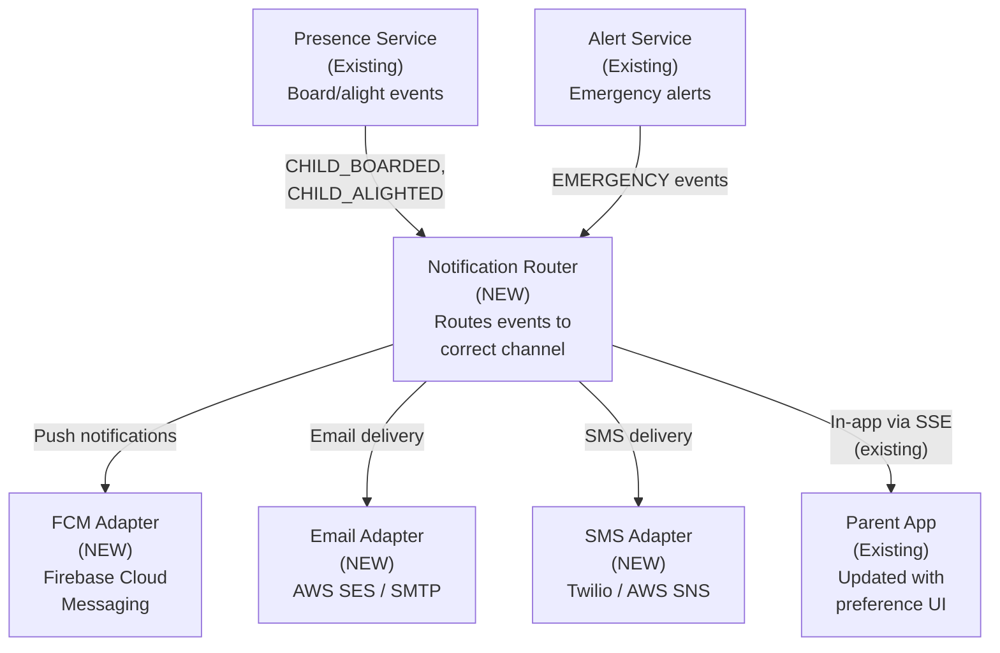
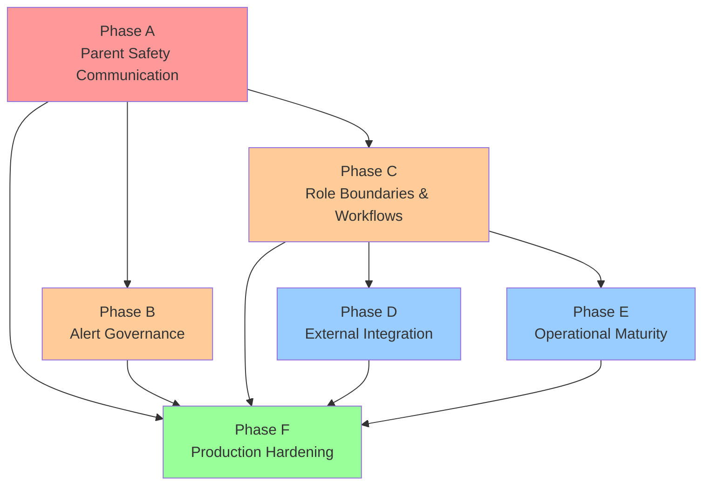

# SBTM v4 Upgrade Plan

- Document owner: Product and Architecture
- Last reviewed: 2026-04-06
- Scope: Phased delivery plan from current state to production-ready system
- Audience: AI Agents, Product Managers, Architects, Project Managers, Development Team

## Related Documents

- [Gap Analysis](./GapAnalysis.md)
- [Roles and Workflows](./RolesAndWorkflows.md)
- [Alert Strategy](./AlertStrategy.md)
- [Integration and Migration](./IntegrationAndMigration.md)
- [Production Rollout Guide](./ProductionRolloutGuide.md)
- [Previous Upgrade Plans](../v1/PhaseWiseImplementationPlan.md)

---

## Phase Status

| Phase       | Name                                    | Status      | Completion Notes                                                                         |
| ----------- | --------------------------------------- | ----------- | ---------------------------------------------------------------------------------------- |
| **Phase A** | Parent Safety Communication             | ✅ Complete | Alert notification pipeline, BullMQ fan-out, presence notifications, WebSocket real-time |
| **Phase B** | Alert Governance and Confirmation       | ✅ Complete | See implementation notes below                                                           |
| **Phase C** | Role Boundary Enforcement and Workflows | 🔲 Planned  | Depends on Phase A                                                                       |
| **Phase D** | External System Integration             | 🔲 Planned  | Depends on Phase C                                                                       |
| **Phase E** | Operational Maturity                    | 🔲 Planned  | Depends on Phase C                                                                       |
| **Phase F** | Production Deployment and Hardening     | 🔲 Planned  | Depends on all above                                                                     |

---

## Upgrade Philosophy

Each phase is independently demonstrable and delivers business value. The plan sequences work so that critical safety features (parent notification) land first, followed by operational workflows, then integration and scale.

Phases build on each other but each produces a usable increment.

---

## Phase Overview

| Phase       | Name                                    | Business Value                                                                                               | Duration Target | Dependencies |
| ----------- | --------------------------------------- | ------------------------------------------------------------------------------------------------------------ | --------------- | ------------ |
| **Phase A** | Parent Safety Communication             | Parents receive real-time safety alerts and presence notifications                                           | 4-6 weeks       | None         |
| **Phase B** | Alert Governance and Confirmation       | Emergency alerts are classified, confirmed by admins before parent delivery, and escalated if unacknowledged | 3-4 weeks       | Phase A      |
| **Phase C** | Role Boundary Enforcement and Workflows | All roles operate within correct boundaries with coordination workflows for fleet and route management       | 4-5 weeks       | Phase A      |
| **Phase D** | External System Integration             | Student data from SIS, fleet from OSTA, bulk route import from Excel                                         | 5-6 weeks       | Phase C      |
| **Phase E** | Operational Maturity                    | Compliance workflows, reporting, calendar management, pre-trip enforcement                                   | 3-4 weeks       | Phase C      |
| **Phase F** | Production Deployment and Hardening     | Production infrastructure, monitoring, backup, first-time setup wizard                                       | 3-4 weeks       | All above    |

---

## Phase A: Parent Safety Communication

### Business Objective

Parents can receive push notifications when their child boards or alights the bus, and are immediately informed of confirmed emergency events.

### Deliverables

| ID  | Deliverable                                                               | Addresses Gap               |
| --- | ------------------------------------------------------------------------- | --------------------------- |
| A.1 | Notification Router service component                                     | GAP-ALERT-004               |
| A.2 | FCM push notification integration                                         | GAP-ALERT-004               |
| A.3 | Presence-to-notification pipeline (child boarded/alighted -> parent push) | GAP-ALERT-002               |
| A.4 | Emergency alert delivery to parents via push + SMS                        | GAP-ROLE-006, GAP-ALERT-004 |
| A.5 | Parent notification preference UI and persistence                         | GAP-ALERT-005               |
| A.6 | Email integration for non-urgent notifications                            | GAP-ALERT-004               |
| A.7 | SMS integration for emergency escalation                                  | GAP-ALERT-004               |

### Acceptance Criteria

- When a driver marks a student as boarded, the student's parent receives a push notification within 10 seconds
- When a driver marks a student as alighted, the student's parent receives a push notification within 10 seconds
- When an emergency alert is created, all parents on the affected route receive push + SMS within the configured timeline
- Parent can configure notification preferences (which events, which channels)
- Emergency notifications cannot be disabled by parents
- Notification delivery is logged with status (SENT/DELIVERED/FAILED)

### Phase A - Notification Pipeline

---

## Phase B: Alert Governance and Confirmation

### Business Objective

Emergency alerts follow a governed process: classified by tier, confirmed by School Admin before parent delivery, and escalated through the admin hierarchy if unacknowledged.

### Deliverables

| ID  | Deliverable                                                                | Addresses Gap |
| --- | -------------------------------------------------------------------------- | ------------- |
| B.1 | Alert classifier component (Tier 1/2/3)                                    | GAP-ALERT-001 |
| B.2 | Confirmation engine with timeout-based auto-escalation                     | GAP-WF-005    |
| B.3 | Admin confirmation UI (modal with confirm/false-alarm/request-info)        | GAP-WF-005    |
| B.4 | Escalation chain (School -> Board -> OSTA) with configurable timing        | GAP-ALERT-006 |
| B.5 | Operational alerts (Tier 2) dashboard for admin-only events                | GAP-ALERT-001 |
| B.6 | Alert lifecycle audit trail (CREATED -> CONFIRMED -> NOTIFIED -> RESOLVED) | GAP-GOV-002   |

### Acceptance Criteria

- Tier 1 alerts (PANIC, MEDICAL, INCIDENT) require School Admin confirmation before parent delivery
- If School Admin does not confirm within 2 minutes, alert auto-escalates to parents
- Unacknowledged alerts escalate: 5 min -> Board Admin, 15 min -> OSTA Admin
- Tier 2 alerts (LATE_DEPARTURE, COMPLIANCE) only visible to admins
- Tier 3 events (boarding/alighting) bypass confirmation and go directly to parents
- Full audit trail for every alert state transition

### Implementation Notes

**Implemented in branch `copilot/update-upgrade-plan-phase-b`:**

| Deliverable                   | Implementation                                                                                                                                                                                                                                                     |
| ----------------------------- | ------------------------------------------------------------------------------------------------------------------------------------------------------------------------------------------------------------------------------------------------------------------ |
| B.1 Alert classifier          | `services/emergency-alerts/src/modules/alerts/alert-classifier.service.ts` — classifies `EmergencyEventType` into `AlertTier.TIER_1/2/3` using static `Set` lookups                                                                                                |
| B.2 Confirmation engine       | `AlertsService.create()` — Tier 1 alerts set status `PENDING_CONFIRMATION` and schedule 3 BullMQ delayed jobs: `confirmation-timeout` (2 min), `board-escalation` (5 min), `osta-escalation` (15 min). State-guard pattern in processor prevents double-execution. |
| B.3 Admin confirmation UI     | `AlertConfirmationModal.tsx` — modal with live countdown timer, Confirm/False Alarm/Request Info actions. Shown automatically when admin clicks a `PENDING_CONFIRMATION` alert.                                                                                    |
| B.4 Escalation chain          | `AlertsProcessor.handleBoardEscalation()` / `handleOstaEscalation()` — update `escalationLevel` on the alert entity and fan out via `notifications` queue.                                                                                                         |
| B.5 Tier 2 operational alerts | `AlertsService.create()` — Tier 2 alerts set status `ACTIVE` with no parent notification. Frontend `Alerts.tsx` shows these only in admin views.                                                                                                                   |
| B.6 Audit trail               | `AlertAuditLog` entity. `AlertsService` writes audit entries on every state transition: `CREATED → PENDING_CONFIRMATION → CONFIRMED/AUTO_ESCALATED/FALSE_ALARM → PARENT_NOTIFIED → RESOLVED`. Processor writes `BOARD_ESCALATED` / `OSTA_ESCALATED`.               |

**New API endpoints:**

- `PATCH /api/v1/alerts/:id/confirm` — School Admin confirms Tier 1 alert
- `PATCH /api/v1/alerts/:id/false-alarm` — School Admin marks as false alarm
- `PATCH /api/v1/alerts/:id/request-info` — School Admin requests more information
- `GET /api/v1/alerts/audit/:id` — Full lifecycle audit trail for an alert

**Entity changes:**

- `EmergencyEventType` extended with `MEDICAL`, `LATE_DEPARTURE`, `COMPLIANCE`
- `EmergencyAlertStatus` extended with `PENDING_CONFIRMATION`, `CONFIRMED`, `AUTO_ESCALATED`, `FALSE_ALARM`
- New enums: `AlertTier`, `AlertEscalationLevel`
- New columns on `EmergencyAlert`: `tier`, `confirmedBy`, `confirmedAt`, `escalationLevel`, `autoEscalatedAt`, `parentNotifiedAt`
- New entity: `AlertAuditLog` with full transition history

**Threat model note:** The delayed BullMQ job chain introduces a new attack surface — a stale/replayed job could trigger parent notifications for an already-resolved alert. Mitigated by re-fetching alert status from the database in each job handler before acting (state guard pattern). See `AlertsProcessor.handleConfirmationTimeout()`.

---

## Phase C: Role Boundary Enforcement and Workflows

### Business Objective

Each role operates within its defined responsibility boundary. Cross-role coordination is supported through in-system workflows for fleet assignment, route changes, and student transfers.

### Deliverables

| ID  | Deliverable                                                                         | Addresses Gap            |
| --- | ----------------------------------------------------------------------------------- | ------------------------ |
| C.1 | Super Admin role for system bootstrap and maintenance                               | GAP-ROLE-001             |
| C.2 | Board Admin school management (create/modify/deactivate schools)                    | GAP-ROLE-003             |
| C.3 | School Admin full student management (enroll/edit/withdraw) in UI                   | GAP-ROLE-004             |
| C.4 | Fleet assignment workflow (OSTA proposes -> School confirms)                        | GAP-ROLE-002, GAP-WF-001 |
| C.5 | Route change notification workflow (changes -> affected parents notified)           | GAP-WF-002               |
| C.6 | Absence confirmation workflow (parent reports -> driver roster updated)             | GAP-ROLE-006             |
| C.7 | Admin dashboard role-based view filtering (sidebar and page content adapts to role) | GAP-ROLE-004             |
| C.8 | Document generation for printable agreements (PDF export)                           | GAP-WF-006               |

### Acceptance Criteria

- Board Admin can create, modify, and deactivate schools within their board
- Board Admin cannot access schools in other boards
- School Admin can enroll, edit, and withdraw students through the UI (not just API)
- OSTA Admin can propose vehicle-to-route assignment; School Admin must confirm
- When a route is modified, parents of affected students are notified before the change date
- When a parent reports absence, the driver's roster shows the student as absent
- Admin dashboard sidebar shows only pages relevant to the user's role
- Fleet assignment generates a printable PDF agreement

---

## Phase D: External System Integration

### Business Objective

The system integrates with existing school and OSTA data sources to eliminate duplicate data entry and enable bulk migration of legacy data.

### Deliverables

| ID  | Deliverable                                                                        | Addresses Gap |
| --- | ---------------------------------------------------------------------------------- | ------------- |
| D.1 | SIS batch file sync adapter (CSV/XML import from SIS)                              | GAP-INT-001   |
| D.2 | Board-specific field mapping configuration                                         | GAP-INT-001   |
| D.3 | Student sync preview and approval workflow                                         | GAP-INT-001   |
| D.4 | OSTA fleet database sync adapter                                                   | GAP-INT-002   |
| D.5 | Excel/CSV route import wizard (upload -> validate -> geocode -> preview -> commit) | GAP-INT-003   |
| D.6 | Address geocoding service integration (Nominatim or Google)                        | GAP-INT-006   |
| D.7 | Parent auto-provisioning from SIS contact data                                     | GAP-INT-005   |
| D.8 | Data export capabilities (CSV/PDF for students, routes, compliance, alerts)        | GAP-INT-004   |

### Acceptance Criteria

- School Admin can upload SIS export file and preview student changes before committing
- OSTA Admin can trigger fleet sync and see newly available vehicles
- School Admin can upload Excel with 100+ routes and import them in batch with OSRM polylines
- Stop creation via address search with geocoding (no manual coordinates)
- Parent accounts auto-created from SIS parent contact data with email invitation
- Admin can export student list, route plan, compliance summary as CSV or PDF

---

## Phase E: Operational Maturity

### Business Objective

The system supports complete daily operational workflows including pre-trip enforcement, compliance management, reporting, and calendar awareness.

### Deliverables

| ID  | Deliverable                                                           | Addresses Gap |
| --- | --------------------------------------------------------------------- | ------------- |
| E.1 | Pre-trip inspection enforcement (must pass before route start)        | GAP-GOV-004   |
| E.2 | Compliance visibility across role hierarchy (school -> board -> OSTA) | GAP-GOV-001   |
| E.3 | Compliance expiry alerts and remediation workflow                     | GAP-WF-007    |
| E.4 | Incident report generation (auto-filled from alert data, exportable)  | GAP-GOV-003   |
| E.5 | Academic calendar management (holidays, PA days)                      | GAP-OPS-003   |
| E.6 | Route schedule windows with late-departure detection                  | GAP-OPS-004   |
| E.7 | Parent consent management (collect, store, withdrawal workflow)       | GAP-GOV-005   |
| E.8 | Scheduled reports (daily/weekly/monthly) via email                    | GAP-INT-004   |

### Acceptance Criteria

- Driver cannot start route without passing pre-trip inspection
- Failed inspection blocks route and alerts School Admin
- Board Admin sees compliance status for all schools in their board
- Expired compliance triggers automatic notification to School Admin and Board Admin
- Incident report can be generated from resolved alert, exported as PDF
- Routes marked as inactive on holidays (no unnecessary alerts or tracking)
- Parents present consent during onboarding; consent record stored with timestamp
- School Admin receives daily operation summary email

---

## Phase F: Production Deployment and Hardening

### Business Objective

The system is ready for production deployment with proper infrastructure, monitoring, backup, and guided first-time setup.

### Deliverables

| ID   | Deliverable                                                                   | Addresses Gap  |
| ---- | ----------------------------------------------------------------------------- | -------------- |
| F.1  | First-time setup wizard (Super Admin creates OSTA Admin, configures boards)   | GAP-OPS-001    |
| F.2  | Guided tenant provisioning workflow (new board/school setup)                  | GAP-OPS-002    |
| F.3  | Production infrastructure configuration (to be documented, not scripted here) | OPS-DEPLOY-002 |
| F.4  | Database backup and restore procedures                                        | OPS-BACKUP-001 |
| F.5  | Monitoring and alerting for system health                                     | OPS-MON-001    |
| F.6  | Rate limiting activation on public endpoints                                  | SR-INPUT-001   |
| F.7  | Service-to-service authentication enforcement                                 | SR-SVC-001     |
| F.8  | Secret management (vault or cloud KMS)                                        | Security       |
| F.9  | Production deployment runbook                                                 | OPS-RUN-001    |
| F.10 | Feature-version upgrade procedure and rollback plan                           | OPS-RUN-001    |

### Acceptance Criteria

- Fresh deployment can be bootstrapped through UI wizard without database scripts
- Production environment has automated daily backups with tested restore procedure
- System health dashboard monitors: service uptime, API latency, queue depth, error rate
- Public API endpoints are rate-limited (100 req/min per user, configurable)
- All service-to-service calls use authenticated internal JWT
- Secrets are stored in vault, not in environment variables
- Documented upgrade procedure with step-by-step rollback plan

---

## Phase Dependencies

---

## Risk Assessment

| Risk                                                          | Likelihood | Impact | Mitigation                                                                                               |
| ------------------------------------------------------------- | ---------- | ------ | -------------------------------------------------------------------------------------------------------- |
| SIS integration delayed by board IT availability              | High       | Medium | Start with CSV batch import; API sync is Phase D enhancement                                             |
| Push notification delivery inconsistency                      | Medium     | High   | Implement fallback chain (push -> SMS -> email). Monitor delivery rates.                                 |
| Legacy route data quality is poor                             | High       | Medium | Route import wizard includes validation and map preview. Admin can correct before commit.                |
| Parent adoption rate is low                                   | Medium     | High   | Simple onboarding flow. Email invitation with one-click setup. Consider SMS invitation as alternative.   |
| Alert confirmation timeout causes delayed parent notification | Low        | High   | 2-minute timeout is short enough for safety. Auto-escalation ensures delivery even without admin action. |
| OSTA fleet DB access is restricted                            | Medium     | Medium | Manual fleet entry fallback remains available. Sync is an enhancement, not a dependency.                 |
| Privacy concern with geocoding external service               | Low        | High   | Default to self-hosted Nominatim. External geocoder only with privacy assessment approval.               |

---

## Further Considerations

### Phase C — Role Boundary Enforcement: Pre-work Notes

Phase B establishes the confirmation and escalation model but intentionally defers RBAC enforcement at the API layer to Phase C. The following gaps should be addressed in Phase C:

- **Alert endpoint RBAC**: `PATCH /alerts/:id/confirm` must be restricted to `SCHOOL_ADMIN`, `BOARD_ADMIN`, `OSTA_ADMIN` roles at the API Gateway. Currently the `InternalServiceAuthGuard` validates that the request comes from the gateway, but role checking within the alert service is not yet enforced.
- **Tier 2 admin-only visibility**: The API currently does not filter alerts by tier when returning results. Phase C should add role-aware filtering so parents never see Tier 2 alerts even if they somehow reach the endpoint.
- **Alert ownership**: Phase C should enforce that only the owning school's admin can confirm an alert. Board and OSTA admins should only intervene at their escalation tier.

### Phase D — Integration: Alert Data Export

- Incident reports generated from resolved Tier 1 alerts (deliverable E.4) will rely on the `AlertAuditLog` entity introduced in Phase B. The audit trail schema is designed to support this use case.

### Phase E — Operational Maturity: Confirmation Timeout Tuning

- The 2-minute confirmation timeout and 5/15-minute escalation delays are constants in `alerts.service.ts`. Phase E should expose these as per-school configurable values stored in school settings, allowing boards with different response-time SLAs to adjust timing without code changes.
- The `requestInfo` action currently only logs an audit event. Phase E should consider extending the timer window when info is requested, to give the admin adequate response time without forcing auto-escalation.
