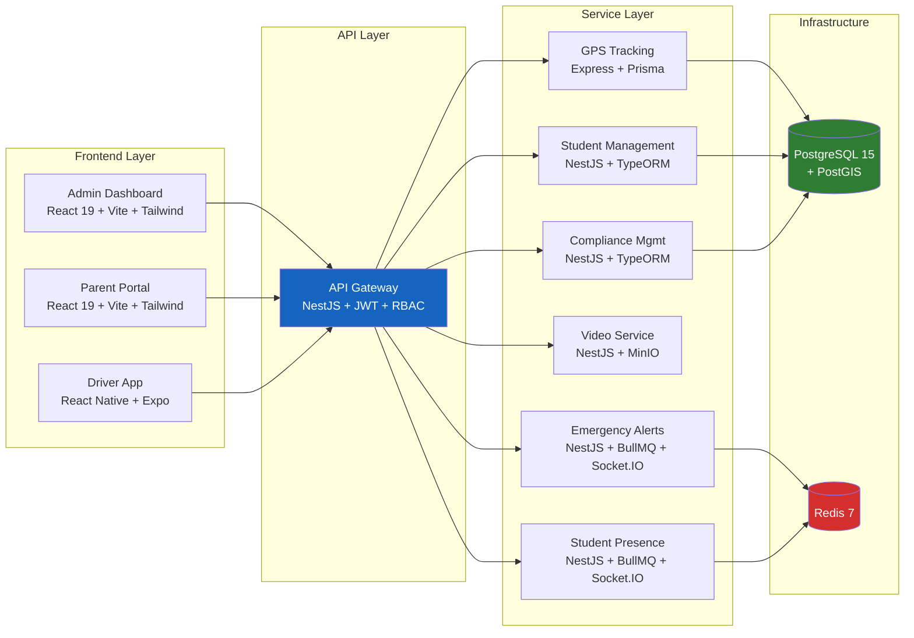
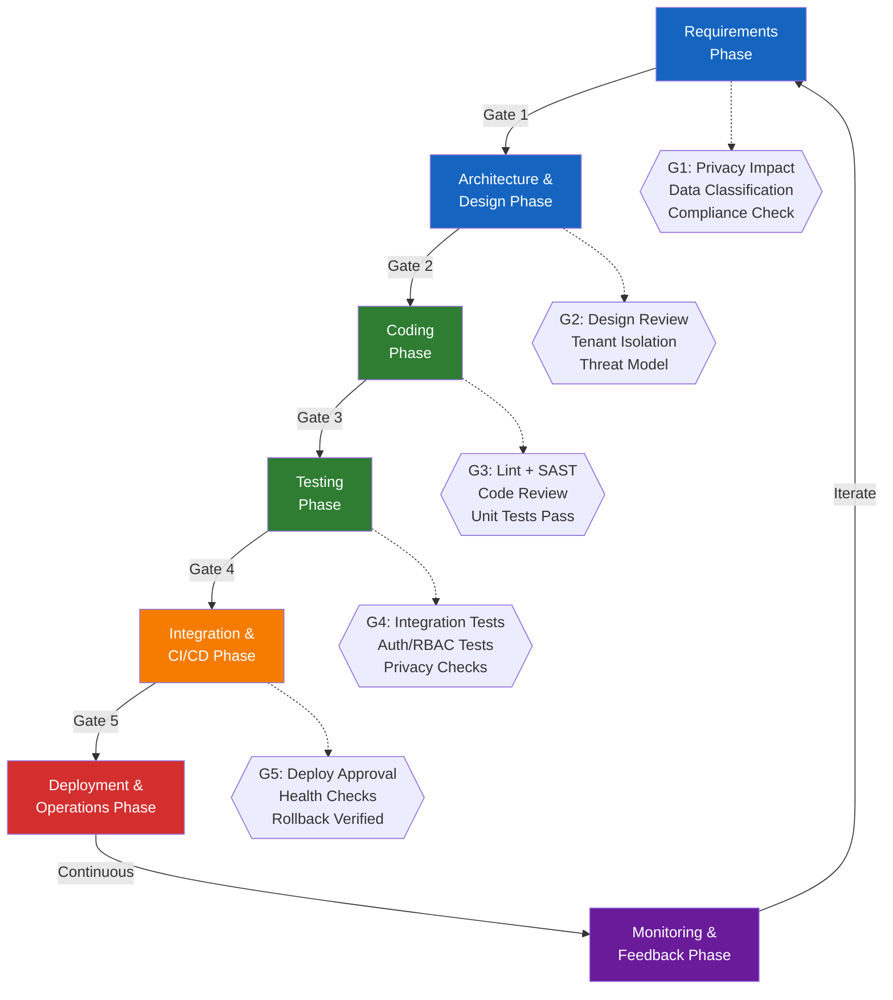

# SBTM Master Policy — Root Governance Document

- Document owner: Product and Engineering
- Last reviewed: 2026-03-24
- Primary use: Foundation policy — all AI agents and developers must follow these rules

---

## 1. Project Identity

| Attribute | Value |
|---|---|
| **Project Name** | School Bus Transport Management System (SBTM) |
| **Domain** | School Transportation Safety — Multi-tenant SaaS |
| **Privacy Ceiling** | Student PII (minors), regulated under PIPEDA and MFIPPA |
| **Compliance Frameworks** | PIPEDA, MFIPPA, Ontario Highway Traffic Act (school buses), AODA |
| **Deployment Targets** | Docker Compose (local/dev), Kubernetes (production) |
| **Team Size** | 3–5 developers |
| **Development Model** | Trunk-based development with short-lived feature branches |
| **Primary AI Agent** | GitHub Copilot (Workspace/Chat mode) |

## 2. Mission Statement

SBTM provides real-time school bus tracking, student presence detection (BLE SmartTags and manual), emergency alerting, compliance management, and parent notification across a multi-tenant platform supporting Ontario School Transportation Authorities (OSTAs), school boards, and individual schools. The system must protect student privacy, enforce tenant isolation, and deliver safety-critical notifications reliably.

## 3. Core Technology Stack

| Layer | Technology | Purpose |
|---|---|---|
| API Gateway | NestJS + JWT + Passport | Auth, RBAC, rate limiting, tenant guards, service proxying |
| Microservices | NestJS (6 services) + Express (GPS) | Domain-specific business logic with TypeScript |
| Database | PostgreSQL 15 + PostGIS | Relational storage with geospatial extensions |
| Queuing | Redis 7 + BullMQ | Job queues for alerts, presence, and notification processing |
| Real-time | Socket.IO + SSE | WebSocket broadcast and server-sent events |
| Web Frontend | React 19 + Vite + TailwindCSS | Admin dashboard and parent portal |
| Mobile | React Native + Expo | Driver app (iOS/Android/Web) |
| Object Storage | MinIO (S3-compatible) | Video event storage |
| Maps | Leaflet (web), React Native Maps (mobile) | Route visualization and live tracking |
| Containerization | Docker + Docker Compose | Development and deployment orchestration |

## 4. SDLC Lifecycle with Quality Gates

Every phase of the software development lifecycle includes quality and privacy activities. Features advance through gates before reaching production.

### Quality Gate Definitions

| Gate | Phase Transition | Mandatory Checks |
|---|---|---|
| **G1** | Requirements → Architecture | Privacy impact assessed; data classification assigned; compliance requirements mapped (PIPEDA, MFIPPA) |
| **G2** | Architecture → Coding | Design review completed; tenant isolation documented; threat model for child-safety scenarios |
| **G3** | Coding → Testing | ESLint passes (zero errors); code review by peer; no hardcoded secrets; unit tests included |
| **G4** | Testing → Integration | Integration tests pass; auth and RBAC scenarios verified; tenant cross-access tests pass |
| **G5** | Integration → Deployment | Deployment approval from lead; health checks verified; rollback procedure tested |

## 5. Universal Rules — Always Enforce

These rules apply to all code, documentation, and configuration in this project.

### 5.1 Privacy and Data Handling

- **RULE-PII-01**: Student data is personally identifiable information about minors. Handle with the highest care. Never log student names, addresses, or parent contact details in plain text.
- **RULE-PII-02**: Test data must be synthetic. Never use real student names, real addresses, or real parent contact information in tests or seed data.
- **RULE-PII-03**: All API responses containing student data must be scoped to the authenticated user's tenant (`school_id`).
- **RULE-PII-04**: Comply with PIPEDA consent requirements for any new data collection or sharing feature.

### 5.2 Security

- **RULE-SEC-01**: No hardcoded secrets, passwords, API keys, or tokens in source code. Use environment variables or secret management.
- **RULE-SEC-02**: All external-facing endpoints must require JWT authentication via the API Gateway.
- **RULE-SEC-03**: Validate and sanitize all user input at system boundaries using class-validator (NestJS) or Zod (Express).
- **RULE-SEC-04**: Apply RBAC checks for every mutation endpoint. Never trust client-supplied role or tenant context.
- **RULE-SEC-05**: Apply rate limiting on authentication and data-write endpoints.

### 5.3 Code Quality

- **RULE-QA-01**: All new code must have accompanying unit tests. Target 80% line coverage for services.
- **RULE-QA-02**: Use TypeScript strict mode (`"strict": true`) across all packages.
- **RULE-QA-03**: Handle errors explicitly. Never swallow exceptions. Use structured error responses.
- **RULE-QA-04**: Use structured logging with correlation IDs for cross-service request tracing.

### 5.4 Development Process

- **RULE-DEV-01**: All changes go through pull requests with at least one reviewer.
- **RULE-DEV-02**: Use conventional commits (`feat:`, `fix:`, `docs:`, `chore:`, `refactor:`, `test:`).
- **RULE-DEV-03**: CI must pass (lint, test, build) before PR merge.
- **RULE-DEV-04**: Document architectural decisions in ADRs when they affect service boundaries, data models, or security posture.

### 5.5 Compliance

- **RULE-CMP-01**: PIPEDA and MFIPPA govern student and parent data handling. Document consent flows for new data use.
- **RULE-CMP-02**: Ontario Highway Traffic Act requirements apply to route compliance, vehicle inspections, and driver certifications.
- **RULE-CMP-03**: Maintain audit logs for critical operations: auth events, student data access, emergency alerts, compliance changes.
- **RULE-CMP-04**: Data retention schedules must align with MFIPPA record retention requirements.

## 6. Architectural Principles

- **Multi-tenant first**: Every query, mutation, and API response must respect tenant boundaries via `school_id`.
- **Event-aware**: Business-critical state changes produce domain events consumed by notification and analytics pipelines.
- **Privacy-by-design**: Student data minimization, consent tracking, and audit trails are architectural concerns, not afterthoughts.
- **Graceful degradation**: The driver app must buffer events offline and replay on reconnect. Parent-facing features must degrade gracefully when backend services are unavailable.
- **Separation of concerns**: Business, design, implementation, and operational documentation remain in separate doc domains.

## 7. Related Documents

- [README.md](README.md) — SDLC guidelines index and loading order
- [docs/Governance/DocumentationPolicy.md](../Governance/DocumentationPolicy.md) — Documentation structure and maintenance rules
- [docs/Business/Requirements.md](../Business/Requirements.md) — Business requirements baseline
- [docs/Design/Architecture.md](../Design/Architecture.md) — v1 target architecture
