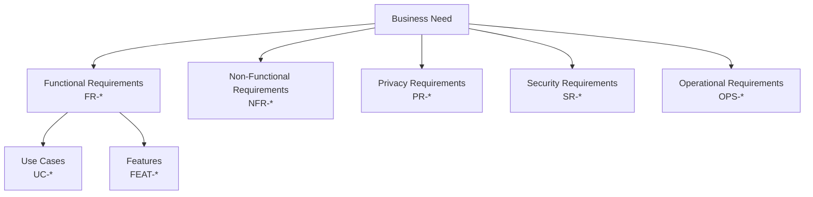

# Requirements Engineering

- Document owner: Product and Engineering
- Last reviewed: 2026-03-24
- Primary use: Structured requirement capture with taxonomy, stable IDs, and RFC 2119 keywords

## Purpose

Define how requirements are captured, structured, and maintained in SBTM. All requirements use stable identifiers and follow a consistent taxonomy so they can be traced through design, implementation, and testing.

## Requirement Taxonomy



| Category | ID Prefix | Description | Example |
|---|---|---|---|
| Functional | `FR-*` | What the system must do | FR-GPS-001: Record vehicle location at configurable intervals |
| Non-Functional | `NFR-*` | Quality attributes | NFR-PERF-001: GPS ingest supports 100 updates/second |
| Privacy | `PR-*` | Data handling and consent | PR-CONSENT-001: Guardian consent required before student data collection |
| Security | `SR-*` | Security controls | SR-AUTH-001: All API endpoints require JWT authentication |
| Operational | `OPS-*` | Deployment and runtime | OPS-DEPLOY-001: Services start via Docker Compose with health checks |
| Use Case | `UC-*` | End-to-end user workflow | UC-001: Admin Plans a Route |
| Feature | `FEAT-*` | Business-facing capability | FEAT-GPS-001: Real-Time Vehicle Location Tracking |

## RFC 2119 Keywords

Use these keywords consistently in requirement statements:

| Keyword | Meaning |
|---|---|
| **MUST** | Absolute requirement. The feature will not ship without this |
| **SHOULD** | Strongly recommended. Omission requires documented justification |
| **MAY** | Optional. Included if time and resources permit in the current phase |

## Requirement Record Template

Each requirement should include:

```markdown
### FR-GPS-001: Record Vehicle Location

- **Priority**: MUST
- **Category**: Functional
- **Description**: The GPS tracking service must accept and persist location updates from driver devices at configurable intervals.
- **Acceptance Criteria**: POST /locations accepts lat, lng, vehicleId, routeId, timestamp. Returns 201 with persisted record.
- **Traces To**: UC-002 (Driver Executes Route), FEAT-GPS-001
- **Implementation**: Module-1-GpsTracking.md
- **Phase**: Delivered
```

## Requirements Management Rules

- New requirements are added to `docs/Business/Requirements.md` with the next available ID.
- Requirements are never deleted; they are marked as `Superseded` with a reference to the replacement.
- Use case files live in `docs/Business/usecases/` with one file per use case.
- Feature entries live in `docs/Business/Features.md` with traceability back to requirements.
- Gap items in `docs/prd/GapAnalysis.md` should trace back to specific requirement IDs.

## Related Documents

- [traceability.md](traceability.md) — Traceability matrix
- [../../Business/Requirements.md](../../Business/Requirements.md) — Live requirements catalog
- [../../Business/UseCases.md](../../Business/UseCases.md) — Use case index
- [../../Business/Features.md](../../Business/Features.md) — Feature catalog
