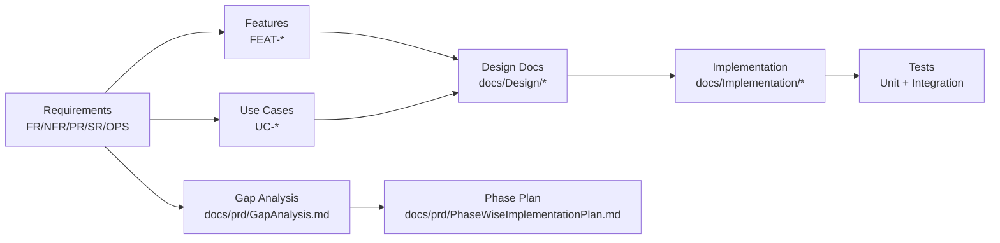

# Traceability

- Document owner: Product and Engineering
- Last reviewed: 2026-03-24
- Primary use: Bidirectional traceability rules between requirements, design, implementation, and tests

## Purpose

Ensure every requirement can be traced forward to implementation and tests, and every implementation decision can be traced back to a business need. Traceability prevents undocumented features, orphan code, and untested requirements.

## Traceability Chain

## Traceability Rules

| Source | Must Link To | How |
|---|---|---|
| Requirement (FR-*, PR-*, etc.) | Use cases and features | `Traces To` field in requirement record |
| Use case (UC-*) | Requirements, design sections | Related Documents section in UC file |
| Feature (FEAT-*) | Requirements, implementation module | Requirement Coverage column in Features.md |
| Design document | Business requirements justifying the design | Related Documents section |
| Implementation module | Gap analysis, delivery phase | Source of Truth section in Module-*.md |
| Test case | Requirement or acceptance criteria it verifies | Test description or comment |

## Gap Traceability

Items in `docs/prd/GapAnalysis.md` must:
- Reference the v1 design target that created the gap.
- Reference the current implementation state that confirms the gap.
- Be assigned to a phase in `docs/prd/PhaseWiseImplementationPlan.md`.

## Verification

During PR review, check:
- New features trace back to a requirement ID.
- New requirements have corresponding use cases or feature entries.
- Implementation modules reference their delivery phase.
- Gap items are assigned to phases.

## Related Documents

- [requirements_engineering.md](requirements_engineering.md) — Requirement capture format
- [../../Business/Requirements.md](../../Business/Requirements.md) — Requirements catalog
- [../../prd/GapAnalysis.md](../../prd/GapAnalysis.md) — Gap inventory
- [../../prd/PhaseWiseImplementationPlan.md](../../prd/PhaseWiseImplementationPlan.md) — Phase plan
