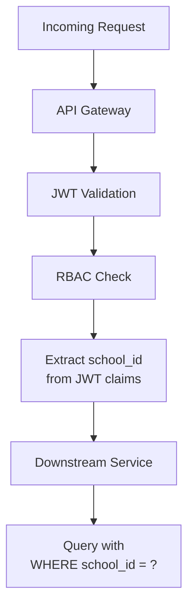
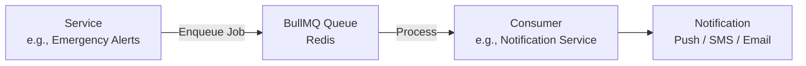

# Design Guidelines

- Document owner: Engineering
- Last reviewed: 2026-03-24
- Primary use: Microservice design patterns, event-driven architecture, and multi-tenancy patterns

## Purpose

Define the design patterns and conventions used in SBTM's microservice architecture. These patterns ensure consistency across the 7 backend services and 3 frontend applications.

## Service Decomposition

Each backend service owns a bounded context:

| Service | Bounded Context | Primary Entity | Storage |
|---|---|---|---|
| API Gateway | Auth, routing, aggregation | User sessions | PostgreSQL (TypeORM) |
| GPS Tracking | Vehicle location | Location records | PostgreSQL (Prisma) |
| Emergency Alerts | Crisis events | Alert records | PostgreSQL + Redis (BullMQ) |
| Student Presence | Attendance | Presence events | PostgreSQL + Redis (BullMQ) |
| Video Service | Video events | Video metadata | PostgreSQL + MinIO |
| Student Management | Enrollment | Student records | PostgreSQL (TypeORM) |
| Compliance Management | Inspections, audit | Compliance records | PostgreSQL (TypeORM) |

## Multi-Tenancy Pattern

SBTM uses application-layer tenant isolation with `school_id` as the tenant discriminator:

Rules:
- Every database query for tenant-scoped data must include `school_id` in the WHERE clause.
- The gateway extracts `school_id` from the JWT and propagates it to downstream services.
- Services must not accept `school_id` from client request bodies — use the JWT claim.
- Admin-level roles (OSTA Admin) may access cross-tenant data; all other roles are strictly tenant-scoped.

## Event-Driven Patterns

SBTM uses BullMQ (Redis-backed) for asynchronous event processing:

### Event Design Rules
- Events should be immutable facts: "alert.created", "presence.boarded", "location.updated".
- Each event must include: `eventType`, `timestamp`, `tenantId` (school_id), and a payload.
- Producers must not depend on consumers — events are fire-and-forget from the producer's perspective.
- Consumers must be idempotent — processing the same event twice produces the same outcome.

## API Design Conventions

- Use RESTful endpoints with consistent resource naming: `/api/v1/{resource}`.
- Return standard HTTP status codes: 200 (OK), 201 (Created), 400 (Bad Request), 401 (Unauthorized), 403 (Forbidden), 404 (Not Found), 500 (Internal Server Error).
- Use DTOs with class-validator decorators (NestJS) or Zod schemas (Express) for request validation.
- Return structured error responses: `{ statusCode, message, error }`.
- Support pagination for list endpoints: `?page=1&limit=20`.

## Database Design Conventions

- Use UUID primary keys for all entities.
- Include `created_at` and `updated_at` timestamps on all tables.
- Include `school_id` as a required column on all tenant-scoped tables.
- Use database migrations (Prisma or TypeORM) — never modify schemas directly.
- Use naming conventions: `snake_case` for tables and columns, singular table names (`student`, not `students`).

## Related Documents

- [architecture_guidelines.md](architecture_guidelines.md) — C4 model and ADR format
- [threat_modeling.md](threat_modeling.md) — Threat modeling
- [../../Design/IntegrationArchitecture.md](../../Design/IntegrationArchitecture.md) — Integration patterns
- [../../Design/DataArchitecture.md](../../Design/DataArchitecture.md) — Data domain ownership
