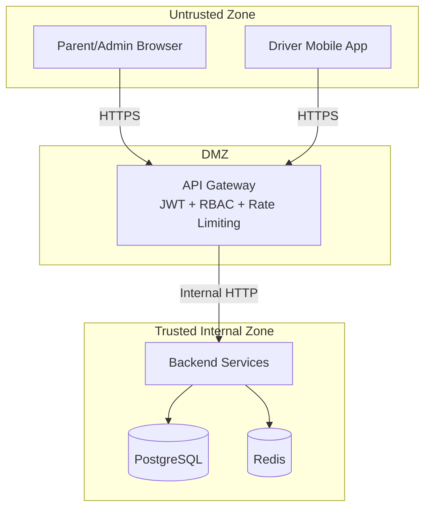

# Threat Modeling

- Document owner: Engineering and Security
- Last reviewed: 2026-03-24
- Primary use: STRIDE threat modeling methodology adapted for student safety and tenant isolation

## Purpose

Define how threats are identified and mitigated in SBTM. Given the system handles minor student data and safety-critical operations, threat modeling is a mandatory part of architectural design.

## Methodology

SBTM uses STRIDE for threat categorization:

| Category | Threat | SBTM Example |
|---|---|---|
| **Spoofing** | Identity impersonation | Attacker uses stolen JWT to submit fake presence events |
| **Tampering** | Data modification | Malicious GPS coordinates injected to misrepresent bus location |
| **Repudiation** | Denying actions | Driver denies triggering a panic alert |
| **Information Disclosure** | Unauthorized data access | Cross-tenant query returns students from another school |
| **Denial of Service** | System unavailability | Flood of GPS updates overwhelms the tracking service |
| **Elevation of Privilege** | Unauthorized role escalation | Parent account gains admin access to compliance data |

## Trust Boundaries

| Boundary | Threats | Mitigations |
|---|---|---|
| Browser/Mobile → Gateway | Spoofing, Tampering, DoS | JWT validation, input validation, rate limiting, HTTPS only |
| Gateway → Services | Spoofing, Elevation of Privilege | Propagate verified JWT claims, enforce RBAC at gateway, planned service-to-service auth |
| Services → Database | Information Disclosure, Tampering | Tenant-scoped queries (school_id), parameterized queries, planned RLS |

## Child Safety Threat Scenarios

| Scenario | Impact | Mitigation |
|---|---|---|
| False boarding event | Parent believes child is on bus when they are not | Require verified source (driver action or BLE detection); audit trail for event origin |
| Spoofed GPS position | Admin map shows incorrect bus location | Validate GPS coordinate ranges; detect teleportation anomalies; audit GPS source |
| Emergency alert suppression | Safety incident goes unreported | Alerts stored durably before delivery; audit all alert lifecycle transitions |
| Unauthorized student data access | Student PII exposed to wrong tenant | school_id scoping on every query; RBAC role checks; audit access to student records |
| Notification to wrong parent | Privacy breach — wrong guardian receives student data | Parent-student linkage verified at data layer; notification routing uses verified associations |

## When to Update the Threat Model

- Adding a new service or external integration.
- Changing the authentication or authorization model.
- Adding a new data flow involving student PII.
- Introducing a new notification channel (push, SMS, email).
- Modifying tenant isolation boundaries.

## Related Documents

- [architecture_guidelines.md](architecture_guidelines.md) — Architecture conventions
- [design_guidelines.md](design_guidelines.md) — Multi-tenancy and event patterns
- [../../Design/SecurityPrivacyArchitecture.md](../../Design/SecurityPrivacyArchitecture.md) — Security architecture
- [../01_security_compliance/data_classification.md](../01_security_compliance/data_classification.md) — Data tiers
