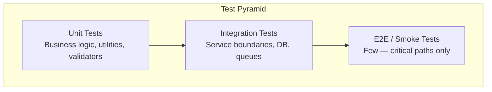

# Testing Strategy

- Document owner: Engineering and QA
- Last reviewed: 2026-03-24
- Primary use: Test pyramid, coverage requirements, and test organization for SBTM

## Purpose

Define the testing approach for SBTM services and applications. Tests ensure correctness, prevent regressions, and validate that privacy and safety requirements are met.

## Test Pyramid



| Layer | Scope | Tools | Target |
|---|---|---|---|
| **Unit** | Single function, class, or module in isolation | Jest | All services and apps |
| **Integration** | Service + database, service + Redis, API endpoint | Jest + Supertest | Backend services |
| **E2E / Smoke** | Multi-service workflow through API Gateway | Jest + Supertest or Playwright | CI pipeline (critical paths) |

## Coverage Requirements

| Service Type | Minimum Coverage | Notes |
|---|---|---|
| NestJS services | 70% line coverage | Focus on service layer and guards |
| Express service (GPS) | 70% line coverage | Focus on route handlers and validators |
| React admin dashboard | 60% line coverage | Focus on hooks, state management, API calls |
| React Native driver app | 60% line coverage | Focus on hooks and business logic |
| Shared utilities | 80% line coverage | Pure functions should have near-complete coverage |

## Test Organization

```
services/<service-name>/
├── src/
│   ├── <feature>/
│   │   ├── <feature>.service.ts
│   │   ├── <feature>.service.spec.ts    ← Unit test (co-located)
│   │   └── <feature>.controller.spec.ts ← Unit test (co-located)
│   └── ...
├── test/
│   ├── <feature>.integration.spec.ts    ← Integration tests
│   └── setup.ts                          ← Test database setup
└── jest.config.js
```

Rules:
- Unit tests are co-located with the source file: `file.ts` → `file.spec.ts`.
- Integration tests go in the `test/` directory at the service root.
- Test files use the naming pattern: `*.spec.ts` (unit), `*.integration.spec.ts` (integration), `*.e2e.spec.ts` (end-to-end).

## Test Data Rules

- Use factory functions or builders to create test data — not raw object literals scattered across tests.
- Never use production data in tests.
- Test data for student entities must use obviously fake data (e.g., "Test Student Alpha", IDs starting with `test-`).
- Integration tests that touch the database must clean up after themselves (use transactions or truncation).

## What to Test

| Must Test | How |
|---|---|
| Tenant isolation (school_id scoping) | Integration test: verify Service A cannot read Service B tenant data |
| RBAC enforcement | Unit test: guards reject unauthorized roles |
| Input validation | Unit test: invalid DTOs are rejected |
| Error handling | Unit test: service returns proper error for edge cases |
| Queue processing | Integration test: enqueue job, verify consumer outcome |
| WebSocket authentication | Integration test: unauthenticated socket is rejected |

## Related Documents

- [security_testing.md](security_testing.md) — Security-specific test patterns
- [performance_testing.md](performance_testing.md) — Load and performance testing
- [../../Test/TestingGuide.md](../../Test/TestingGuide.md) — Project testing guide
