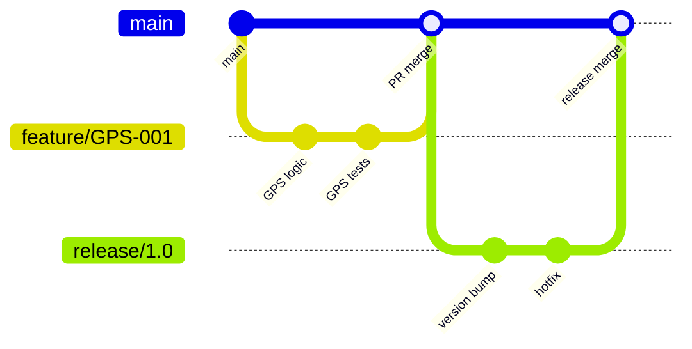

# Branching Strategy

- Document owner: Engineering
- Last reviewed: 2026-03-24
- Primary use: Git branching model, merge rules, and release flow for SBTM monorepo

## Purpose

Define the branching model for the SBTM monorepo. The strategy balances rapid development with stability by using feature branches, a shared main branch, and optional release branches.

## Branch Model



## Branch Types

| Branch | Pattern | Lifetime | Purpose |
|---|---|---|---|
| `main` | `main` | Permanent | Integration branch; always deployable to staging |
| Feature | `feature/<ticket>-<description>` | Days | New features and enhancements |
| Bugfix | `fix/<ticket>-<description>` | Days | Bug fixes |
| Release | `release/<version>` | Days–weeks | Stabilization before production deploy |
| Hotfix | `hotfix/<ticket>-<description>` | Hours–days | Critical production fixes |

## Branch Rules

- `main` is protected: no direct pushes. All changes enter via pull request.
- Feature branches are created from `main` and merged back to `main`.
- Release branches are created from `main` when a phase milestone is ready. Only bugfixes are cherry-picked into release branches.
- Hotfix branches are created from the release tag or `main` and merged to both `main` and the active release branch.
- Delete feature branches after merge.

## Pull Request Requirements

| Requirement | Rule |
|---|---|
| Reviewers | Minimum 1 approval required |
| Tests | CI pipeline must pass (lint, build, test) |
| Merge method | Squash merge for feature branches; merge commit for releases |
| Branch freshness | Branch must be up-to-date with `main` before merge |
| Commit message | Squash commit follows Conventional Commits format |

## Naming Examples

```
feature/GPS-042-geofence-alerts
fix/ALERT-017-missing-school-id
release/1.0.0
hotfix/AUTH-003-token-expiry
```

## Related Documents

- [ci_cd_pipeline.md](ci_cd_pipeline.md) — CI/CD pipeline stages
- [artifact_management.md](artifact_management.md) — Build artifacts and images
- [../04_coding_standards/general_coding.md](../04_coding_standards/general_coding.md) — Commit message format
