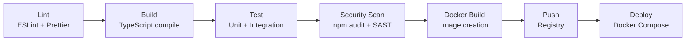

# CI/CD Pipeline

- Document owner: Engineering and DevOps
- Last reviewed: 2026-03-24
- Primary use: Pipeline stages, quality gates, and automation for SBTM

## Purpose

Define the continuous integration and delivery pipeline for the SBTM monorepo. The pipeline ensures code quality, security compliance, and deployment readiness.

## Pipeline Stages

## Stage Details

### 1. Lint

- Tool: ESLint + Prettier
- Scope: All TypeScript files in the changed packages
- Fail condition: Any lint error (warnings are allowed but tracked)

### 2. Build

- Tool: `tsc` via each package's build script
- Scope: All affected packages (monorepo-aware)
- Fail condition: Any TypeScript compilation error

### 3. Test

- Tool: Jest
- Scope: Unit tests for changed packages, integration tests for affected services
- Fail condition: Any test failure or coverage below minimum threshold
- Coverage thresholds: See testing_strategy.md

### 4. Security Scan

- Tool: `npm audit`, optionally a SAST scanner
- Scope: All dependencies and source code
- Fail condition: Any `critical` or `high` vulnerability in `npm audit`
- Monitoring: `moderate` findings are logged as warnings

### 5. Docker Build

- Tool: Docker (multi-stage builds)
- Scope: Services and apps that have changed
- Rule: Use specific base image tags (not `latest`). See supply_chain_security.md.
- Fail condition: Build failure or image exceeds size threshold

### 6. Push

- Tool: Docker registry (local or cloud)
- Scope: Successfully built images
- Tagging: `<service>:<branch>-<short-sha>` for branches, `<service>:<version>` for releases

### 7. Deploy

- Tool: Docker Compose (local/staging), orchestrator for production
- Scope: Updated services only
- Smoke test: Health check endpoints must pass within 60 seconds of deployment

## Quality Gates

| Gate | When | Blocks Merge/Deploy? |
|---|---|---|
| Lint pass | Every PR | Yes |
| Build pass | Every PR | Yes |
| Tests pass + coverage met | Every PR | Yes |
| No critical/high vulnerabilities | Every PR | Yes |
| Docker image builds | Pre-deploy | Yes |
| Health checks pass | Post-deploy | Triggers rollback |

## Monorepo Considerations

- Use affected-package detection to avoid running all checks on every PR.
- If `tsconfig.base.json`, `docker-compose.yml`, or shared configuration changes, run all checks.
- Tag images per service so only changed services are redeployed.

## Configuration Files

| File | Purpose |
|---|---|
| `docker-compose.yml` | Local development and staging |
| `docker-compose.ci.yml` | CI pipeline overrides |
| `eslint.config.js` (per package) | Lint configuration |
| `jest.config.js` (per package) | Test configuration |
| `Dockerfile` (per service/app) | Build configuration |

## Related Documents

- [branching_strategy.md](branching_strategy.md) — Branch model and PR rules
- [artifact_management.md](artifact_management.md) — Image tagging and registry
- [../05_testing/testing_strategy.md](../05_testing/testing_strategy.md) — Coverage requirements
- [../01_security_compliance/supply_chain_security.md](../01_security_compliance/supply_chain_security.md) — Dependency and image security
