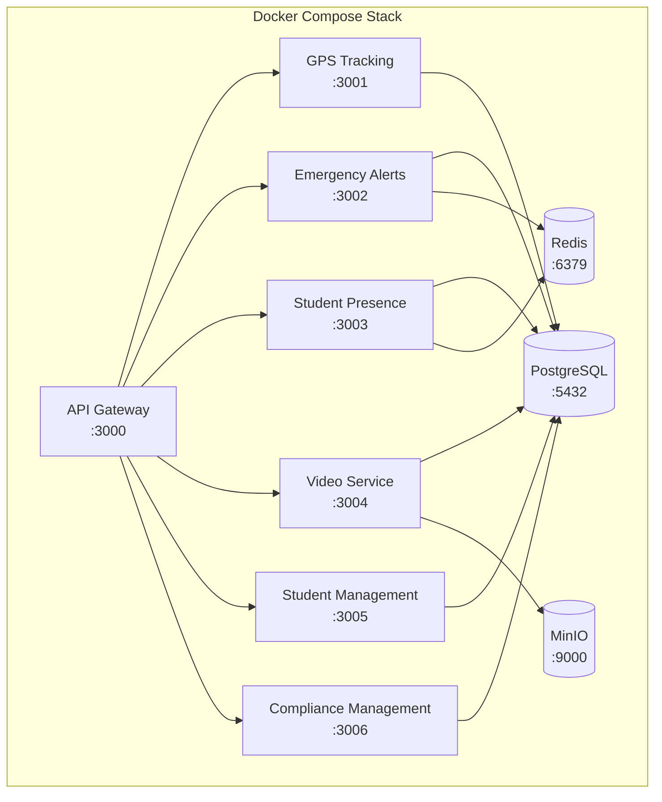

# Deployment Guidelines

- Document owner: Engineering and DevOps
- Last reviewed: 2026-03-24
- Primary use: Deployment procedures, environment configuration, and rollback strategy

## Purpose

Define how SBTM services are deployed across environments. The current deployment model uses Docker Compose with a path toward orchestrated production deployments.

## Environments

| Environment | Purpose | Deployment Method | Data |
|---|---|---|---|
| **Local** | Developer workstation | `docker-compose up` | Seed data from `scripts/init-db.sql` |
| **CI** | Automated testing | `docker-compose.ci.yml` | Ephemeral test data |
| **Staging** | Pre-release validation, demos | Docker Compose on shared server | Demo data from `scripts/simulate-demo.ps1` |
| **Production** | Live service | Docker Compose or orchestrator | Real operational data |

## Deployment Architecture



## Deployment Procedure

### Pre-Deployment Checklist

- [ ] All CI quality gates pass (lint, build, test, security scan).
- [ ] Docker images built and tagged correctly.
- [ ] Database migrations reviewed and tested on staging.
- [ ] Environment variables verified for target environment.
- [ ] Rollback plan documented.

### Deployment Steps

1. Pull latest images for updated services.
2. Run database migrations if any (TypeORM or Prisma migrate).
3. Stop affected services: `docker-compose stop <service>`.
4. Start updated services: `docker-compose up -d <service>`.
5. Verify health checks pass: `curl http://localhost:<port>/health`.
6. Run smoke tests against the deployed environment.
7. Monitor logs for errors in the first 15 minutes.

### Rollback Procedure

1. Stop the failing service.
2. Re-tag or pull the previous image version.
3. Start the previous version.
4. If database migrations were applied, run the down migration.
5. Verify health checks and smoke tests.
6. Document the incident.

## Environment Configuration

- All environment-specific configuration is in `.env` files (not committed) or environment variables set in the deployment environment.
- Configuration schema is validated at service startup. Unknown or missing required variables cause a startup failure.
- Sensitive values (database passwords, JWT secrets, API keys) must not be committed or logged.

## Health Checks

Every service must expose `GET /health` returning:

```json
{
  "status": "ok",
  "service": "<service-name>",
  "uptime": 12345,
  "dependencies": {
    "database": "ok",
    "redis": "ok"
  }
}
```

Docker Compose health checks should be configured to poll this endpoint.

## Related Documents

- [monitoring_observability.md](monitoring_observability.md) — Monitoring and alerting
- [incident_response.md](incident_response.md) — Incident management
- [../06_integration_cicd/ci_cd_pipeline.md](../06_integration_cicd/ci_cd_pipeline.md) — CI/CD pipeline
- [../../Operations/DeploymentGuide.md](../../Operations/DeploymentGuide.md) — Operations deployment guide
