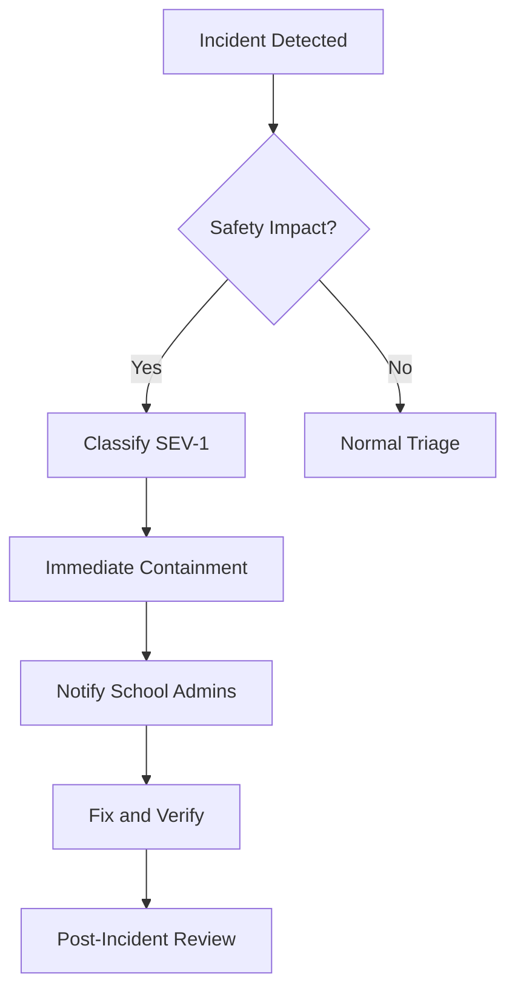

# Incident Response

- Document owner: Engineering and Operations
- Last reviewed: 2026-03-24
- Primary use: Incident classification, response procedures, and post-incident review for SBTM

## Purpose

Define how incidents are classified, handled, and reviewed for SBTM. Given the safety-critical nature of school bus tracking, timely incident response is essential.

## Incident Severity Levels

| Severity | Definition | Examples | Response Time |
|---|---|---|---|
| **SEV-1: Critical** | Safety impact or total system outage | Emergency alerts not delivered; GPS tracking completely down during school hours; student data breach | Immediate (within 15 min) |
| **SEV-2: Major** | Significant feature degradation | GPS updates delayed > 2 min; admin dashboard inaccessible; presence detection failing | Within 1 hour |
| **SEV-3: Minor** | Limited impact, workaround available | Single service degraded but functional; performance below budget but operational | Within 4 hours |
| **SEV-4: Low** | Cosmetic or minor inconvenience | UI display issue; non-critical log errors; documentation inaccuracy | Next business day |

## Response Procedure

### 1. Detect

- Automated: Monitoring alerts (see monitoring_observability.md)
- Manual: User reports, operator observation

### 2. Triage

- Assign severity level based on table above.
- Safety-related incidents are automatically SEV-1 if they affect active school routes.
- Identify affects scope: which schools, routes, or users are impacted.

### 3. Contain

- For SEV-1/SEV-2: Rally the on-call engineer and relevant service owners.
- Implement immediate mitigation (rollback, feature flag disable, traffic reroute).
- Communication: notify affected school administrators if student-facing features are impacted.

### 4. Resolve

- Identify root cause.
- Apply fix (hotfix branch → expedited review → deploy).
- Verify resolution with smoke tests and monitoring.

### 5. Review

- Post-incident review within 48 hours for SEV-1/SEV-2.
- Document: timeline, root cause, impact, mitigation, and preventive actions.
- Create follow-up tickets for systemic improvements.

## Safety Escalation

When an incident involves child safety:



Safety-impacting incidents include:
- Emergency alert delivery failure during an active alert.
- GPS tracking outage during active school routes.
- False presence data (student shown as boarded when not).
- Unauthorized access to student PII.

## Communication Template

For SEV-1/SEV-2 incidents affecting schools:

```
Subject: [SBTM Incident] <Brief description>

Status: Investigating / Mitigated / Resolved
Severity: SEV-1 / SEV-2
Affected: <Schools, features, routes>
Impact: <What users are experiencing>
Next Update: <Time>

Actions Taken:
- <List of containment/fix steps>
```

## Post-Incident Review Template

```markdown
# PIR: <Incident Title>

- Date: YYYY-MM-DD
- Severity: SEV-X
- Duration: X hours Y minutes
- Impact: <Schools, users, features affected>

## Timeline
- HH:MM — <Event>

## Root Cause
<What caused the incident>

## What Went Well
- <Positive observations>

## What Could Be Improved
- <Areas for improvement>

## Action Items
| Action | Owner | Due Date |
|---|---|---|
```

## Related Documents

- [monitoring_observability.md](monitoring_observability.md) — Alerting and metrics
- [deployment_guidelines.md](deployment_guidelines.md) — Rollback procedures
- [../../Operations/DeploymentGuide.md](../../Operations/DeploymentGuide.md) — Operations guide
